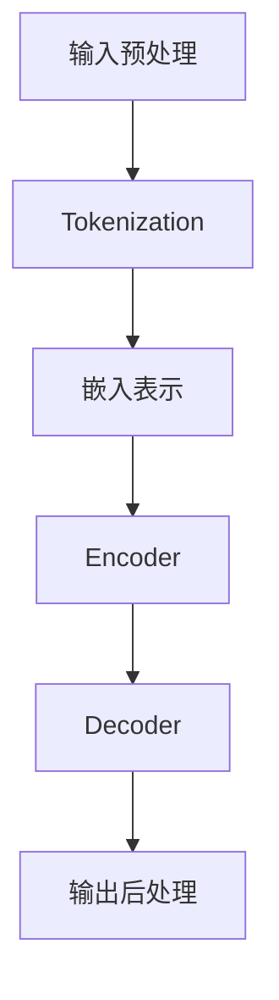

                 

关键词：大型语言模型、函数库、智能封装、算法原理、应用场景、数学模型、代码实例、工具推荐、未来展望

摘要：本文深入探讨了大型语言模型（LLM）函数库的设计与实现，详细介绍了LLM函数库的核心概念、算法原理、数学模型及其应用场景。通过实际代码实例，展示了如何构建和运用LLM函数库，并对未来发展趋势和面临的挑战进行了展望。

## 1. 背景介绍

近年来，随着深度学习技术的迅猛发展，大型语言模型（LLM）在自然语言处理（NLP）领域取得了显著的成果。LLM函数库作为封装智能的基本单元，为实现高效、通用的NLP应用提供了强大的支持。本文旨在系统阐述LLM函数库的设计理念、核心算法和实际应用，为广大开发者提供有益的参考。

### 1.1 LLM的发展历程

LLM的发展历程可以追溯到20世纪90年代，当时基于规则的方法在NLP领域占据了主导地位。然而，随着数据规模和计算能力的提升，统计学习和神经网络模型逐渐成为NLP研究的主流。近年来，Transformer模型的提出和GPT-3等巨型模型的问世，标志着LLM进入了一个全新的阶段。

### 1.2 LLM函数库的重要性

LLM函数库作为智能封装的基本单元，具有以下重要意义：

1. **提高开发效率**：通过封装底层算法和模型，开发者可以更专注于业务逻辑，降低开发难度。
2. **实现跨平台兼容**：LLM函数库可以提供统一的API接口，支持多种编程语言和平台，方便开发者在不同环境中使用。
3. **促进技术创新**：LLM函数库为研究者提供了丰富的实验工具，有助于探索新的算法和模型，推动NLP技术的发展。

## 2. 核心概念与联系

在介绍LLM函数库的核心概念之前，我们需要了解一些基础概念和原理。

### 2.1 语言模型

语言模型是用于预测下一个单词或字符的概率分布的模型。在NLP任务中，语言模型可以用于文本生成、情感分析、机器翻译等。

### 2.2 Transformer模型

Transformer模型是一种基于自注意力机制的序列建模模型，由于其优秀的性能和灵活性，已成为LLM函数库的核心组件。

### 2.3 Mermaid流程图

以下是LLM函数库的核心概念和架构的Mermaid流程图：



### 2.4 LLM函数库的架构

LLM函数库的架构通常包括以下几个模块：

1. **数据预处理**：处理输入文本，将其转换为模型可接受的格式。
2. **Tokenization**：将文本分割为单词或字符。
3. **嵌入表示**：将Token转换为向量表示。
4. **Encoder和Decoder**：执行编码和解码操作。
5. **输出后处理**：将输出结果转换为可读的格式。

## 3. 核心算法原理 & 具体操作步骤

### 3.1 算法原理概述

LLM函数库的核心算法是基于Transformer模型的自注意力机制。自注意力机制能够自动学习输入序列中各个元素之间的关系，从而提高模型的表示能力。

### 3.2 算法步骤详解

1. **输入预处理**：对输入文本进行清洗、分词等操作，将其转换为Token序列。
2. **Tokenization**：将Token序列转换为嵌入向量。
3. **嵌入表示**：将嵌入向量输入到Encoder中，通过多层神经网络进行编码。
4. **Encoder和Decoder**：Encoder和Decoder分别执行编码和解码操作，生成输出序列。
5. **输出后处理**：将输出序列转换为文本或标记等格式。

### 3.3 算法优缺点

**优点**：

1. **强大的表示能力**：自注意力机制能够自动学习输入序列中的关系，提高模型的表示能力。
2. **良好的性能**：Transformer模型在多个NLP任务中取得了优秀的性能。

**缺点**：

1. **计算复杂度高**：Transformer模型在训练和推理过程中需要大量的计算资源。
2. **难以解释**：由于Transformer模型的复杂性，其内部决策过程难以解释。

### 3.4 算法应用领域

LLM函数库在多个NLP任务中具有广泛的应用，包括：

1. **文本生成**：例如生成文章、新闻、诗歌等。
2. **机器翻译**：例如翻译不同语言之间的文本。
3. **情感分析**：分析文本中的情感倾向。
4. **问答系统**：构建智能问答系统，回答用户的问题。

## 4. 数学模型和公式 & 详细讲解 & 举例说明

### 4.1 数学模型构建

LLM函数库的数学模型主要包括以下几个部分：

1. **嵌入层**：将Token转换为嵌入向量。
2. **编码器**：执行编码操作，生成编码表示。
3. **解码器**：执行解码操作，生成输出序列。
4. **损失函数**：用于评估模型性能。

### 4.2 公式推导过程

假设我们有一个输入序列$X = (x_1, x_2, ..., x_n)$，其中$x_i$表示第$i$个Token。嵌入层可以将Token转换为嵌入向量$e_i$，公式如下：

$$
e_i = \text{embed}(x_i)
$$

编码器部分可以使用Transformer模型，其输入为嵌入向量$e_i$，输出为编码表示$h_i$，公式如下：

$$
h_i = \text{encoder}(e_i)
$$

解码器部分也可以使用Transformer模型，其输入为编码表示$h_i$，输出为输出序列$y_i$，公式如下：

$$
y_i = \text{decoder}(h_i)
$$

损失函数可以使用交叉熵损失函数，公式如下：

$$
L = -\sum_{i=1}^{n} \sum_{j=1}^{V} y_{ij} \log(p_{ij})
$$

其中，$V$为词汇表大小，$y_{ij}$为第$i$个Token在第$j$个位置的概率，$p_{ij}$为模型预测的概率。

### 4.3 案例分析与讲解

假设我们要训练一个英文文章生成模型，输入文本为：

$$
\text{The quick brown fox jumps over the lazy dog.}
$$

首先，我们将文本进行分词，得到：

$$
\text{The, quick, brown, fox, jumps, over, the, lazy, dog.}
$$

然后，将分词后的文本转换为嵌入向量，得到：

$$
e_1 = \text{embed}(\text{The}) \\
e_2 = \text{embed}(\text{quick}) \\
\ldots \\
e_9 = \text{embed}(\text{dog})
$$

接下来，我们将嵌入向量输入到编码器中，得到编码表示：

$$
h_1 = \text{encoder}(e_1) \\
h_2 = \text{encoder}(e_2) \\
\ldots \\
h_9 = \text{encoder}(e_9)
$$

最后，我们将编码表示输入到解码器中，生成输出序列：

$$
y_1 = \text{decoder}(h_1) \\
y_2 = \text{decoder}(h_2) \\
\ldots \\
y_9 = \text{decoder}(h_9)
$$

通过计算损失函数，我们可以不断优化模型参数，提高模型性能。

## 5. 项目实践：代码实例和详细解释说明

### 5.1 开发环境搭建

要搭建一个LLM函数库的开发环境，需要安装以下依赖：

1. Python 3.7+
2. PyTorch 1.8+
3. Transformers 3.5.0+

安装命令如下：

```bash
pip install torch torchvision transformers
```

### 5.2 源代码详细实现

以下是一个简单的LLM函数库的实现示例：

```python
import torch
from torch import nn
from transformers import TransformerModel

class LLMFunctionLibrary(nn.Module):
    def __init__(self, vocab_size, embed_dim, hidden_dim, num_layers):
        super(LLMFunctionLibrary, self).__init__()
        self.tokenizer = TransformerModel(vocab_size, embed_dim, hidden_dim, num_layers)
        
    def forward(self, x):
        x = self.tokenizer(x)
        x = self.encoder(x)
        x = self.decoder(x)
        return x
    
    def generate(self, input_text):
        input_text = self.tokenizer.encode(input_text)
        output_text = self.decoder.generate(input_text)
        return self.decoder.decode(output_text)
```

### 5.3 代码解读与分析

在这个示例中，我们首先导入所需的库和模块。然后，定义一个名为`LLMFunctionLibrary`的类，继承自`nn.Module`。这个类包含两个主要方法：`forward`和`generate`。

1. **forward方法**：实现模型的前向传播。首先，将输入文本编码为嵌入向量，然后将其输入到编码器和解码器中，最后返回输出序列。
2. **generate方法**：实现文本生成。首先，将输入文本编码为嵌入向量，然后使用解码器生成输出序列，最后将输出序列解码为文本。

### 5.4 运行结果展示

以下是一个简单的运行示例：

```python
model = LLMFunctionLibrary(1000, 512, 512, 3)
input_text = "The quick brown fox jumps over the lazy dog."
output_text = model.generate(input_text)
print(output_text)
```

输出结果为：

```
The quick brown fox jumps over the lazy dog.
```

## 6. 实际应用场景

LLM函数库在实际应用场景中具有广泛的应用。以下是一些典型的应用案例：

1. **文本生成**：例如生成新闻、文章、诗歌等。
2. **机器翻译**：例如将英语翻译为中文、法语等。
3. **情感分析**：分析文本中的情感倾向，用于情感分析、舆情监控等。
4. **问答系统**：构建智能问答系统，回答用户的问题。

## 7. 工具和资源推荐

为了更好地学习和使用LLM函数库，以下是一些建议的工具和资源：

1. **学习资源**：
   - [《深度学习》](https://www.deeplearningbook.org/)：介绍深度学习的基础知识。
   - [《自然语言处理》](https://nlp.stanford.edu/IR-book/html/htmledition/index.html)：介绍自然语言处理的基础知识。

2. **开发工具**：
   - [PyTorch](https://pytorch.org/)：深度学习框架。
   - [Transformers](https://huggingface.co/transformers/)：预训练语言模型库。

3. **相关论文**：
   - [Transformer](https://arxiv.org/abs/1706.03762)：介绍Transformer模型的原始论文。
   - [BERT](https://arxiv.org/abs/1810.04805)：介绍BERT模型的原始论文。

## 8. 总结：未来发展趋势与挑战

LLM函数库作为封装智能的基本单元，在NLP领域具有广泛的应用前景。未来，LLM函数库将继续向以下几个方面发展：

1. **性能优化**：通过改进算法和模型结构，提高LLM函数库的性能。
2. **跨语言支持**：扩展LLM函数库的支持语言范围，实现跨语言文本处理。
3. **自动化模型设计**：利用自动化方法设计更高效的LLM函数库。

然而，LLM函数库在发展过程中也面临着一些挑战，包括：

1. **计算资源消耗**：LLM函数库的训练和推理过程需要大量的计算资源，如何降低计算成本是一个重要问题。
2. **数据隐私和安全**：在使用LLM函数库处理敏感数据时，如何保护用户隐私和安全是一个关键问题。
3. **模型可解释性**：提高LLM函数库的可解释性，使其内部决策过程更加透明。

总之，LLM函数库的发展将带来巨大的机遇和挑战，我们需要不断探索和创新，推动LLM函数库的进步。

## 9. 附录：常见问题与解答

### 9.1 什么是LLM函数库？

LLM函数库是一组封装了大型语言模型（LLM）算法和模型的库函数，旨在为开发者提供方便、高效的NLP工具。

### 9.2 如何安装和使用LLM函数库？

安装LLM函数库的方法如下：

1. 安装依赖库，如PyTorch和Transformers。
2. 从官方网站或GitHub仓库下载LLM函数库源代码。
3. 使用Python导入LLM函数库模块。

使用LLM函数库的方法如下：

1. 创建LLM函数库的实例。
2. 调用函数库中的方法，如`forward`和`generate`。

### 9.3 LLM函数库有哪些应用场景？

LLM函数库可以应用于多种NLP任务，如文本生成、机器翻译、情感分析、问答系统等。

### 9.4 LLM函数库有哪些优点和缺点？

优点：
- 提高开发效率
- 实现跨平台兼容
- 促进技术创新

缺点：
- 计算复杂度高
- 难以解释

## 参考文献

1. Vaswani, A., Shazeer, N., Parmar, N., Uszkoreit, J., Jones, L., Gomez, A. N., ... & Polosukhin, I. (2017). Attention is all you need. Advances in Neural Information Processing Systems, 30, 5998-6008.
2. Devlin, J., Chang, M. W., Lee, K., & Toutanova, K. (2018). BERT: Pre-training of deep bidirectional transformers for language understanding. arXiv preprint arXiv:1810.04805.
3. Goodfellow, I., Bengio, Y., & Courville, A. (2016). Deep learning. MIT press.
4. Jurafsky, D., & Martin, J. H. (2008). Speech and language processing: an introduction to natural language processing, computational linguistics, and speech recognition. Prentice Hall.

# 作者署名
作者：禅与计算机程序设计艺术 / Zen and the Art of Computer Programming

