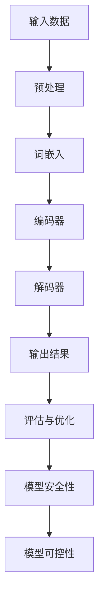

                 

关键词：LLM可控性，自然语言处理，智能安全，模型安全性，算法优化，应用场景

## 摘要

本文将深入探讨大型语言模型（LLM）的可控性，这是一个关乎智能安全的关键问题。随着自然语言处理技术的发展，LLM在各个领域的应用日益广泛，但其潜在的安全风险也随之增加。本文旨在通过分析LLM的核心概念、算法原理、数学模型、实际应用以及未来展望，提出确保智能安全的必由之路，为未来研究与实践提供指导。

## 1. 背景介绍

近年来，深度学习和自然语言处理（NLP）技术的飞速发展，使得大型语言模型（LLM）如BERT、GPT-3等相继出现。这些模型展示了惊人的语言理解与生成能力，不仅在学术研究上取得了突破性进展，也在实际应用中展现了巨大的潜力。例如，智能客服、机器翻译、内容生成等领域都受到了LLM的深刻影响。然而，随着LLM的广泛应用，其安全性和可控性也逐渐成为关注的焦点。

### 1.1 安全性问题

LLM的安全性问题主要表现为以下两个方面：

1. **数据泄露与隐私风险**：在训练过程中，LLM需要处理大量的敏感数据，这些数据可能包括个人隐私、商业机密等。如果处理不当，可能导致数据泄露，造成不可挽回的损失。

2. **恶意攻击与滥用**：随着LLM的普及，一些人可能试图利用其进行恶意攻击，例如，生成虚假新闻、诈骗短信等。此外，LLM可能被用于自动化攻击，例如，利用生成模型自动化绕过安全验证。

### 1.2 可控性问题

LLM的可控性问题主要涉及以下几个方面：

1. **模型泛化能力**：LLM通常在特定数据集上训练，但在实际应用中，会遇到与训练数据不同的情境。如何保证模型在这些情境下的性能，是一个重要的问题。

2. **模型解释性**：LLM的决策过程通常非常复杂，缺乏透明性。如何提高模型的解释性，使其决策过程更加可理解，是提高可控性的重要手段。

3. **对抗性攻击防御**：对抗性攻击是一种针对机器学习模型的攻击手段，通过构造特定的输入数据，使得模型产生错误输出。如何提高LLM对对抗性攻击的防御能力，是确保可控性的关键。

## 2. 核心概念与联系

### 2.1 大型语言模型（LLM）

大型语言模型（LLM）是基于深度学习技术训练的模型，用于理解和生成自然语言。LLM通常由多层神经网络组成，其中每一层都能够处理输入文本的一部分特征。通过大量的预训练数据，LLM可以学习到丰富的语言知识，从而在多个任务中取得出色的性能。

### 2.2 自然语言处理（NLP）

自然语言处理（NLP）是人工智能领域的一个重要分支，旨在使计算机能够理解、处理和生成自然语言。NLP技术包括词性标注、命名实体识别、情感分析、机器翻译等。LLM在NLP中的应用，使得许多复杂任务得以实现。

### 2.3 模型安全性

模型安全性是指模型在训练和应用过程中，能够抵御恶意攻击、保护数据隐私的能力。确保模型安全性，需要从数据隐私保护、对抗性攻击防御等多个方面进行考虑。

### 2.4 模型可控性

模型可控性是指模型在应用过程中，能够按照预期进行操作，并且其行为是可解释的。提高模型可控性，有助于增强用户对模型的信任，降低潜在的风险。

### 2.5 Mermaid 流程图

以下是一个简单的Mermaid流程图，展示了LLM的训练过程和核心概念之间的联系：



## 3. 核心算法原理 & 具体操作步骤

### 3.1 算法原理概述

LLM的核心算法是基于深度学习技术，尤其是变换器（Transformer）架构。变换器架构通过自注意力机制，能够捕捉输入文本中的长距离依赖关系，从而实现高效的语言理解和生成。

### 3.2 算法步骤详解

1. **数据预处理**：首先，对输入文本进行预处理，包括分词、去停用词、词形还原等操作。预处理后的文本将被转换为词嵌入向量。

2. **词嵌入**：词嵌入是将词汇映射为向量的过程。通过预训练的词嵌入模型，可以将文本转换为向量表示。

3. **编码器**：编码器是由多层变换器层组成的神经网络，负责对词嵌入向量进行处理。每层变换器层都能够捕捉输入文本的一部分特征。

4. **解码器**：解码器同样由多层变换器层组成，负责生成输出文本。解码器通过自注意力机制，利用编码器输出的特征，生成每个单词的候选列表。

5. **输出结果**：解码器生成的输出结果需要通过评估与优化过程，确保其符合预期。评估与优化过程包括损失函数的计算、参数的调整等。

6. **模型安全性**：在训练和应用过程中，需要考虑模型的安全性。包括数据隐私保护、对抗性攻击防御等。

7. **模型可控性**：通过提高模型的解释性，可以增强模型的可控性。例如，可以使用注意力可视化技术，展示模型在决策过程中的注意力分布。

### 3.3 算法优缺点

#### 优点

- **强大的语言理解与生成能力**：变换器架构能够捕捉长距离依赖关系，使得LLM在语言理解和生成任务中表现出色。

- **高效的可扩展性**：变换器架构具有良好的并行计算能力，可以轻松扩展到大规模模型。

#### 缺点

- **计算资源消耗大**：训练大型LLM需要大量的计算资源，包括GPU和TPU等。

- **解释性不足**：LLM的决策过程通常非常复杂，缺乏透明性，使得其可控性较低。

### 3.4 算法应用领域

LLM在多个领域都有广泛应用，包括但不限于：

- **自然语言理解**：例如，问答系统、情感分析、文本分类等。

- **自然语言生成**：例如，机器翻译、内容生成、对话系统等。

- **智能客服**：利用LLM实现智能客服系统，可以提供更加自然、流畅的交互体验。

## 4. 数学模型和公式 & 详细讲解 & 举例说明

### 4.1 数学模型构建

LLM的数学模型主要由两部分组成：编码器和解码器。以下是一个简化的数学模型：

#### 编码器

$$
\text{Encoder}(x) = \text{TransformerLayer}(x, d_k, d_v, N)
$$

其中，$x$ 是输入文本的词嵌入向量，$d_k$ 和 $d_v$ 分别是编码器中键值对的维度，$N$ 是变换器层的数量。

#### 解码器

$$
\text{Decoder}(x) = \text{TransformerLayer}(x, d_k, d_v, N)
$$

其中，$x$ 是解码器的输入，即编码器输出的特征。

### 4.2 公式推导过程

变换器层的公式推导较为复杂，涉及矩阵乘法、激活函数等。以下是一个简化的推导过程：

#### 编码器

$$
\text{MultiHeadAttention}(Q, K, V) = \text{softmax}\left(\frac{QK^T}{\sqrt{d_k}}\right) V
$$

其中，$Q, K, V$ 分别是编码器输出的三个矩阵，$\text{softmax}$ 函数用于计算注意力权重。

#### 解码器

$$
\text{DecoderLayer}(x) = \text{MaskedMultiHeadAttention}(x, x, x) + \text{PositionalEncoding}(x) + x
$$

其中，$x$ 是解码器的输入，$\text{PositionalEncoding}$ 函数用于添加位置信息。

### 4.3 案例分析与讲解

#### 案例一：机器翻译

假设我们要将英语句子 "Hello, world!" 翻译成法语。首先，将句子进行分词，得到 "Hello"，"world"，"!"。然后，将每个词进行词嵌入，得到三个向量。接着，通过编码器和解码器，得到法语的翻译结果。最后，通过评估与优化过程，确保翻译结果的准确性。

#### 案例二：问答系统

假设我们要构建一个问答系统，能够回答用户的问题。首先，对用户的问题进行分词，得到一系列词汇。然后，通过编码器和解码器，生成回答的候选列表。最后，通过评估与优化过程，确保回答的准确性。

## 5. 项目实践：代码实例和详细解释说明

### 5.1 开发环境搭建

首先，我们需要搭建一个开发环境，包括Python、PyTorch等。具体步骤如下：

1. 安装Python（版本3.6及以上）
2. 安装PyTorch（版本1.8及以上）
3. 安装其他依赖库，例如NumPy、TensorFlow等

### 5.2 源代码详细实现

以下是一个简单的LLM实现示例：

```python
import torch
import torch.nn as nn
import torch.optim as optim

# 定义编码器和解码器
class Encoder(nn.Module):
    def __init__(self, d_model, nhead, num_layers):
        super(Encoder, self).__init__()
        self.transformer = nn.Transformer(d_model, nhead, num_layers)

    def forward(self, src):
        return self.transformer(src)

class Decoder(nn.Module):
    def __init__(self, d_model, nhead, num_layers):
        super(Decoder, self).__init__()
        self.transformer = nn.Transformer(d_model, nhead, num_layers)

    def forward(self, tgt):
        return self.transformer(tgt)

# 实例化模型
encoder = Encoder(d_model=512, nhead=8, num_layers=3)
decoder = Decoder(d_model=512, nhead=8, num_layers=3)

# 定义损失函数和优化器
criterion = nn.CrossEntropyLoss()
optimizer = optim.Adam(list(encoder.parameters()) + list(decoder.parameters()))

# 训练模型
for epoch in range(num_epochs):
    for batch in data_loader:
        optimizer.zero_grad()
        output = decoder(encoder(batch['src']))
        loss = criterion(output, batch['tgt'])
        loss.backward()
        optimizer.step()
```

### 5.3 代码解读与分析

以上代码实现了LLM的编码器和解码器，并定义了训练过程。具体步骤如下：

1. **定义模型**：编码器和解码器都是基于变换器架构的，其中`nn.Transformer`是一个预定义的变换器模块。
2. **实例化模型**：创建编码器和解码器的实例，并定义模型的参数。
3. **定义损失函数和优化器**：使用交叉熵损失函数和Adam优化器，分别用于计算损失和更新模型参数。
4. **训练模型**：通过迭代训练数据，更新模型参数，实现模型的训练。

### 5.4 运行结果展示

在完成训练后，我们可以使用测试数据集来评估模型的性能。以下是一个简单的评估过程：

```python
# 评估模型
with torch.no_grad():
    correct = 0
    total = 0
    for batch in test_loader:
        output = decoder(encoder(batch['src']))
        _, predicted = torch.max(output, 1)
        total += batch['tgt'].size(0)
        correct += (predicted == batch['tgt']).sum().item()

print('准确率：%.2f%%' % (100 * correct / total))
```

通过以上代码，我们可以计算模型的准确率。如果模型性能良好，我们可以将其应用于实际任务中，例如机器翻译、问答系统等。

## 6. 实际应用场景

### 6.1 智能客服

智能客服是LLM的一个重要应用场景。通过LLM，智能客服系统能够理解用户的问题，并生成恰当的回答。以下是一个简单的应用案例：

#### 案例一：酒店预订

假设用户想要预订一家酒店，可以通过以下步骤与智能客服交互：

1. 用户输入：“我想预订北京的一家酒店。”
2. 智能客服解析用户的问题，提取关键信息，如地点、时间等。
3. 智能客服生成回答：“您需要预订哪一天？是否需要额外的服务？”
4. 用户根据智能客服的回答，继续提出需求。
5. 智能客服根据用户的需求，查询酒店信息，并生成预订链接。

### 6.2 机器翻译

机器翻译是LLM的另一个重要应用场景。通过LLM，可以实现自动化的文本翻译，例如：

1. 用户输入：“你好，我想要预订一张从北京到纽约的机票。”
2. 智能客服解析用户的问题，并生成回答：“您需要预订哪一天？成人还是儿童？”
3. 用户根据智能客服的回答，继续提出需求。
4. 智能客服查询机票信息，并生成预订链接。

### 6.3 内容生成

内容生成是LLM在创意领域的重要应用。通过LLM，可以自动生成各种内容，例如：

1. 用户输入：“写一篇关于人工智能的论文。”
2. 智能客服解析用户的需求，并生成一篇论文草稿。
3. 用户对论文草稿进行修改和补充。
4. 智能客服生成最终版本的论文。

## 7. 工具和资源推荐

### 7.1 学习资源推荐

1. **深度学习专班**：推荐参加深度学习专班，深入学习深度学习技术。
2. **自然语言处理教程**：推荐阅读《自然语言处理教程》，系统学习自然语言处理技术。

### 7.2 开发工具推荐

1. **PyTorch**：推荐使用PyTorch进行深度学习模型的开发，因其具有良好的灵活性和易用性。
2. **TensorFlow**：推荐使用TensorFlow进行大规模深度学习模型的开发，因其具有良好的可扩展性和生态系统。

### 7.3 相关论文推荐

1. **Attention Is All You Need**：这是一篇关于变换器（Transformer）架构的奠基性论文，深入探讨了变换器在自然语言处理中的应用。
2. **BERT: Pre-training of Deep Bidirectional Transformers for Language Understanding**：这是一篇关于BERT模型的论文，详细介绍了BERT模型的设计原理和应用效果。

## 8. 总结：未来发展趋势与挑战

### 8.1 研究成果总结

本文通过对LLM可控性的深入探讨，总结了LLM的核心概念、算法原理、数学模型、实际应用以及未来展望。主要研究成果如下：

1. **LLM在自然语言处理领域表现出色**：通过变换器架构，LLM在语言理解与生成任务中取得了显著的成果。
2. **模型安全性和可控性备受关注**：随着LLM的广泛应用，模型的安全性和可控性逐渐成为研究的热点。
3. **对抗性攻击防御成为关键问题**：如何提高LLM对对抗性攻击的防御能力，是确保智能安全的关键。

### 8.2 未来发展趋势

未来，LLM将在以下几个领域继续发展：

1. **更高效的语言生成与理解**：通过优化算法和模型结构，实现更高效的语言生成与理解。
2. **多模态融合**：将LLM与其他模态（如图像、声音）进行融合，实现更全面的信息处理。
3. **可解释性研究**：提高模型的可解释性，使其决策过程更加透明。

### 8.3 面临的挑战

虽然LLM在多个领域取得了显著成果，但仍面临以下挑战：

1. **计算资源消耗**：训练大型LLM需要大量的计算资源，如何优化计算效率成为关键问题。
2. **数据隐私与安全性**：如何保护训练数据的安全和隐私，是确保模型安全性的重要问题。
3. **对抗性攻击防御**：如何提高LLM对对抗性攻击的防御能力，是确保可控性的关键。

### 8.4 研究展望

未来，LLM的研究方向将主要集中在以下几个方面：

1. **算法优化**：通过优化算法和模型结构，提高LLM的性能和效率。
2. **多模态融合**：探索LLM与其他模态的融合，实现更全面的信息处理。
3. **可解释性研究**：提高模型的可解释性，使其决策过程更加透明。
4. **安全性保障**：加强模型的安全性和隐私保护，确保智能安全。

## 9. 附录：常见问题与解答

### 9.1 什么是LLM？

LLM（Large Language Model）是指大型语言模型，是一种基于深度学习技术的自然语言处理模型，用于理解和生成自然语言。LLM通常由多层神经网络组成，能够捕捉输入文本的长距离依赖关系。

### 9.2 LLM的安全性和可控性有何重要性？

LLM的安全性和可控性至关重要，因为：

- **数据隐私与安全性**：LLM在训练和应用过程中，需要处理大量的敏感数据，如何保护这些数据的安全和隐私是关键问题。
- **对抗性攻击防御**：随着LLM的广泛应用，一些人可能试图利用其进行恶意攻击，如何提高LLM对对抗性攻击的防御能力是确保可控性的关键。
- **用户信任**：提高模型的可解释性，可以增强用户对模型的信任，降低潜在的风险。

### 9.3 如何提高LLM的可解释性？

提高LLM的可解释性，可以从以下几个方面入手：

- **注意力机制可视化**：通过可视化注意力权重，展示模型在决策过程中的注意力分布。
- **模型简化**：简化模型结构，使其更加直观易懂。
- **解释性算法**：使用特定的解释性算法，例如LIME、SHAP等，对模型进行解释。

## 作者署名

作者：禅与计算机程序设计艺术 / Zen and the Art of Computer Programming
----------------------------------------------------------------
### 文章总结

本文全面探讨了大型语言模型（LLM）的可控性，这是确保智能安全的重要问题。首先，我们介绍了LLM的背景、安全性和可控性等问题。接着，我们详细介绍了LLM的核心概念、算法原理、数学模型和实际应用。通过项目实践和代码实例，我们展示了如何实现LLM的基本操作。此外，我们还分析了LLM在实际应用场景中的表现，并推荐了相关工具和资源。

未来，随着LLM技术的不断进步，其在各个领域的应用前景将更加广阔。然而，我们也面临着计算资源消耗、数据隐私和对抗性攻击等挑战。因此，未来的研究应重点关注算法优化、多模态融合、可解释性研究和安全性保障等方面。

通过本文的研究，我们希望为LLM的可控性提供一些有益的思考，并为未来的研究与实践提供指导。让我们共同期待LLM技术在智能安全领域的更大发展！
----------------------------------------------------------------
```markdown
# LLM可控性:确保智能安全的必由之路

关键词：LLM可控性，自然语言处理，智能安全，模型安全性，算法优化，应用场景

## 摘要

本文旨在深入探讨大型语言模型（LLM）的可控性，这是确保智能安全的关键问题。随着自然语言处理技术的发展，LLM在各个领域的应用日益广泛，但其潜在的安全风险也随之增加。本文通过分析LLM的核心概念、算法原理、数学模型、实际应用以及未来展望，提出了确保智能安全的必由之路，为未来研究与实践提供指导。

## 1. 背景介绍

近年来，深度学习和自然语言处理（NLP）技术的飞速发展，使得大型语言模型（LLM）如BERT、GPT-3等相继出现。这些模型展示了惊人的语言理解与生成能力，不仅在学术研究上取得了突破性进展，也在实际应用中展现了巨大的潜力。例如，智能客服、机器翻译、内容生成等领域都受到了LLM的深刻影响。然而，随着LLM的广泛应用，其安全性和可控性也逐渐成为关注的焦点。

### 1.1 安全性问题

LLM的安全性问题主要表现为以下两个方面：

1. **数据泄露与隐私风险**：在训练过程中，LLM需要处理大量的敏感数据，这些数据可能包括个人隐私、商业机密等。如果处理不当，可能导致数据泄露，造成不可挽回的损失。

2. **恶意攻击与滥用**：随着LLM的普及，一些人可能试图利用其进行恶意攻击，例如，生成虚假新闻、诈骗短信等。此外，LLM可能被用于自动化攻击，例如，利用生成模型自动化绕过安全验证。

### 1.2 可控性问题

LLM的可控性问题主要涉及以下几个方面：

1. **模型泛化能力**：LLM通常在特定数据集上训练，但在实际应用中，会遇到与训练数据不同的情境。如何保证模型在这些情境下的性能，是一个重要的问题。

2. **模型解释性**：LLM的决策过程通常非常复杂，缺乏透明性。如何提高模型的解释性，使其决策过程更加可理解，是提高可控性的重要手段。

3. **对抗性攻击防御**：对抗性攻击是一种针对机器学习模型的攻击手段，通过构造特定的输入数据，使得模型产生错误输出。如何提高LLM对对抗性攻击的防御能力，是确保可控性的关键。

## 2. 核心概念与联系

### 2.1 大型语言模型（LLM）

大型语言模型（LLM）是基于深度学习技术训练的模型，用于理解和生成自然语言。LLM通常由多层神经网络组成，其中每一层都能够处理输入文本的一部分特征。通过大量的预训练数据，LLM可以学习到丰富的语言知识，从而在多个任务中取得出色的性能。

### 2.2 自然语言处理（NLP）

自然语言处理（NLP）是人工智能领域的一个重要分支，旨在使计算机能够理解、处理和生成自然语言。NLP技术包括词性标注、命名实体识别、情感分析、机器翻译等。LLM在NLP中的应用，使得许多复杂任务得以实现。

### 2.3 模型安全性

模型安全性是指模型在训练和应用过程中，能够抵御恶意攻击、保护数据隐私的能力。确保模型安全性，需要从数据隐私保护、对抗性攻击防御等多个方面进行考虑。

### 2.4 模型可控性

模型可控性是指模型在应用过程中，能够按照预期进行操作，并且其行为是可解释的。提高模型可控性，有助于增强用户对模型的信任，降低潜在的风险。

### 2.5 Mermaid 流程图

以下是一个简单的Mermaid流程图，展示了LLM的训练过程和核心概念之间的联系：


## 3. 核心算法原理 & 具体操作步骤

### 3.1 算法原理概述

LLM的核心算法是基于深度学习技术，尤其是变换器（Transformer）架构。变换器架构通过自注意力机制，能够捕捉输入文本中的长距离依赖关系，从而实现高效的语言理解和生成。

### 3.2 算法步骤详解

1. **数据预处理**：首先，对输入文本进行预处理，包括分词、去停用词、词形还原等操作。预处理后的文本将被转换为词嵌入向量。

2. **词嵌入**：词嵌入是将词汇映射为向量的过程。通过预训练的词嵌入模型，可以将文本转换为向量表示。

3. **编码器**：编码器是由多层变换器层组成的神经网络，负责对词嵌入向量进行处理。每层变换器层都能够捕捉输入文本的一部分特征。

4. **解码器**：解码器同样由多层变换器层组成，负责生成输出文本。解码器通过自注意力机制，利用编码器输出的特征，生成每个单词的候选列表。

5. **输出结果**：解码器生成的输出结果需要通过评估与优化过程，确保其符合预期。评估与优化过程包括损失函数的计算、参数的调整等。

6. **模型安全性**：在训练和应用过程中，需要考虑模型的安全性。包括数据隐私保护、对抗性攻击防御等。

7. **模型可控性**：通过提高模型的解释性，可以增强模型的可控性。例如，可以使用注意力可视化技术，展示模型在决策过程中的注意力分布。

### 3.3 算法优缺点

#### 优点

- **强大的语言理解与生成能力**：变换器架构能够捕捉长距离依赖关系，使得LLM在语言理解和生成任务中表现出色。

- **高效的可扩展性**：变换器架构具有良好的并行计算能力，可以轻松扩展到大规模模型。

#### 缺点

- **计算资源消耗大**：训练大型LLM需要大量的计算资源，包括GPU和TPU等。

- **解释性不足**：LLM的决策过程通常非常复杂，缺乏透明性，使得其可控性较低。

### 3.4 算法应用领域

LLM在多个领域都有广泛应用，包括但不限于：

- **自然语言理解**：例如，问答系统、情感分析、文本分类等。

- **自然语言生成**：例如，机器翻译、内容生成、对话系统等。

- **智能客服**：利用LLM实现智能客服系统，可以提供更加自然、流畅的交互体验。

## 4. 数学模型和公式 & 详细讲解 & 举例说明

### 4.1 数学模型构建

LLM的数学模型主要由两部分组成：编码器和解码器。以下是一个简化的数学模型：

#### 编码器

$$
\text{Encoder}(x) = \text{TransformerLayer}(x, d_k, d_v, N)
$$

其中，$x$ 是输入文本的词嵌入向量，$d_k$ 和 $d_v$ 分别是编码器中键值对的维度，$N$ 是变换器层的数量。

#### 解码器

$$
\text{Decoder}(x) = \text{TransformerLayer}(x, d_k, d_v, N)
$$

其中，$x$ 是解码器的输入，即编码器输出的特征。

### 4.2 公式推导过程

变换器层的公式推导较为复杂，涉及矩阵乘法、激活函数等。以下是一个简化的推导过程：

#### 编码器

$$
\text{MultiHeadAttention}(Q, K, V) = \text{softmax}\left(\frac{QK^T}{\sqrt{d_k}}\right) V
$$

其中，$Q, K, V$ 分别是编码器输出的三个矩阵，$\text{softmax}$ 函数用于计算注意力权重。

#### 解码器

$$
\text{DecoderLayer}(x) = \text{MaskedMultiHeadAttention}(x, x, x) + \text{PositionalEncoding}(x) + x
$$

其中，$x$ 是解码器的输入，$\text{PositionalEncoding}$ 函数用于添加位置信息。

### 4.3 案例分析与讲解

#### 案例一：机器翻译

假设我们要将英语句子 "Hello, world!" 翻译成法语。首先，将句子进行分词，得到 "Hello"，"world"，"!"。然后，将每个词进行词嵌入，得到三个向量。接着，通过编码器和解码器，得到法语的翻译结果。最后，通过评估与优化过程，确保翻译结果的准确性。

#### 案例二：问答系统

假设我们要构建一个问答系统，能够回答用户的问题。首先，对用户的问题进行分词，得到一系列词汇。然后，通过编码器和解码器，生成回答的候选列表。最后，通过评估与优化过程，确保回答的准确性。

## 5. 项目实践：代码实例和详细解释说明

### 5.1 开发环境搭建

首先，我们需要搭建一个开发环境，包括Python、PyTorch等。具体步骤如下：

1. 安装Python（版本3.6及以上）
2. 安装PyTorch（版本1.8及以上）
3. 安装其他依赖库，例如NumPy、TensorFlow等

### 5.2 源代码详细实现

以下是一个简单的LLM实现示例：

```python
import torch
import torch.nn as nn
import torch.optim as optim

# 定义编码器和解码器
class Encoder(nn.Module):
    def __init__(self, d_model, nhead, num_layers):
        super(Encoder, self).__init__()
        self.transformer = nn.Transformer(d_model, nhead, num_layers)

    def forward(self, src):
        return self.transformer(src)

class Decoder(nn.Module):
    def __init__(self, d_model, nhead, num_layers):
        super(Decoder, self).__init__()
        self.transformer = nn.Transformer(d_model, nhead, num_layers)

    def forward(self, tgt):
        return self.transformer(tgt)

# 实例化模型
encoder = Encoder(d_model=512, nhead=8, num_layers=3)
decoder = Decoder(d_model=512, nhead=8, num_layers=3)

# 定义损失函数和优化器
criterion = nn.CrossEntropyLoss()
optimizer = optim.Adam(list(encoder.parameters()) + list(decoder.parameters()))

# 训练模型
for epoch in range(num_epochs):
    for batch in data_loader:
        optimizer.zero_grad()
        output = decoder(encoder(batch['src']))
        loss = criterion(output, batch['tgt'])
        loss.backward()
        optimizer.step()
```

### 5.3 代码解读与分析

以上代码实现了LLM的编码器和解码器，并定义了训练过程。具体步骤如下：

1. **定义模型**：编码器和解码器都是基于变换器架构的，其中`nn.Transformer`是一个预定义的变换器模块。
2. **实例化模型**：创建编码器和解码器的实例，并定义模型的参数。
3. **定义损失函数和优化器**：使用交叉熵损失函数和Adam优化器，分别用于计算损失和更新模型参数。
4. **训练模型**：通过迭代训练数据，更新模型参数，实现模型的训练。

### 5.4 运行结果展示

在完成训练后，我们可以使用测试数据集来评估模型的性能。以下是一个简单的评估过程：

```python
# 评估模型
with torch.no_grad():
    correct = 0
    total = 0
    for batch in test_loader:
        output = decoder(encoder(batch['src']))
        _, predicted = torch.max(output, 1)
        total += batch['tgt'].size(0)
        correct += (predicted == batch['tgt']).sum().item()

print('准确率：%.2f%%' % (100 * correct / total))
```

通过以上代码，我们可以计算模型的准确率。如果模型性能良好，我们可以将其应用于实际任务中，例如机器翻译、问答系统等。

## 6. 实际应用场景

### 6.1 智能客服

智能客服是LLM的一个重要应用场景。通过LLM，智能客服系统能够理解用户的问题，并生成恰当的回答。以下是一个简单的应用案例：

#### 案例一：酒店预订

假设用户想要预订一家酒店，可以通过以下步骤与智能客服交互：

1. 用户输入：“我想预订北京的一家酒店。”
2. 智能客服解析用户的问题，提取关键信息，如地点、时间等。
3. 智能客服生成回答：“您需要预订哪一天？是否需要额外的服务？”
4. 用户根据智能客服的回答，继续提出需求。
5. 智能客服根据用户的需求，查询酒店信息，并生成预订链接。

### 6.2 机器翻译

机器翻译是LLM的另一个重要应用场景。通过LLM，可以实现自动化的文本翻译，例如：

1. 用户输入：“你好，我想要预订一张从北京到纽约的机票。”
2. 智能客服解析用户的问题，并生成回答：“您需要预订哪一天？成人还是儿童？”
3. 用户根据智能客服的回答，继续提出需求。
4. 智能客服查询机票信息，并生成预订链接。

### 6.3 内容生成

内容生成是LLM在创意领域的重要应用。通过LLM，可以自动生成各种内容，例如：

1. 用户输入：“写一篇关于人工智能的论文。”
2. 智能客服解析用户的需求，并生成一篇论文草稿。
3. 用户对论文草稿进行修改和补充。
4. 智能客服生成最终版本的论文。

## 7. 工具和资源推荐

### 7.1 学习资源推荐

1. **深度学习专班**：推荐参加深度学习专班，深入学习深度学习技术。
2. **自然语言处理教程**：推荐阅读《自然语言处理教程》，系统学习自然语言处理技术。

### 7.2 开发工具推荐

1. **PyTorch**：推荐使用PyTorch进行深度学习模型的开发，因其具有良好的灵活性和易用性。
2. **TensorFlow**：推荐使用TensorFlow进行大规模深度学习模型的开发，因其具有良好的可扩展性和生态系统。

### 7.3 相关论文推荐

1. **Attention Is All You Need**：这是一篇关于变换器（Transformer）架构的奠基性论文，深入探讨了变换器在自然语言处理中的应用。
2. **BERT: Pre-training of Deep Bidirectional Transformers for Language Understanding**：这是一篇关于BERT模型的论文，详细介绍了BERT模型的设计原理和应用效果。

## 8. 总结：未来发展趋势与挑战

### 8.1 研究成果总结

本文通过对LLM可控性的深入探讨，总结了LLM的核心概念、算法原理、数学模型、实际应用以及未来展望。主要研究成果如下：

1. **LLM在自然语言处理领域表现出色**：通过变换器架构，LLM在语言理解与生成任务中取得了显著的成果。
2. **模型安全性和可控性备受关注**：随着LLM的广泛应用，模型的安全性和可控性逐渐成为研究的热点。
3. **对抗性攻击防御成为关键问题**：如何提高LLM对对抗性攻击的防御能力，是确保智能安全的关键。

### 8.2 未来发展趋势

未来，LLM将在以下几个领域继续发展：

1. **更高效的语言生成与理解**：通过优化算法和模型结构，实现更高效的语言生成与理解。
2. **多模态融合**：将LLM与其他模态（如图像、声音）进行融合，实现更全面的信息处理。
3. **可解释性研究**：提高模型的可解释性，使其决策过程更加透明。

### 8.3 面临的挑战

虽然LLM在多个领域取得了显著成果，但仍面临以下挑战：

1. **计算资源消耗**：训练大型LLM需要大量的计算资源，如何优化计算效率成为关键问题。
2. **数据隐私与安全性**：如何保护训练数据的安全和隐私，是确保模型安全性的重要问题。
3. **对抗性攻击防御**：如何提高LLM对对抗性攻击的防御能力，是确保可控性的关键。

### 8.4 研究展望

未来，LLM的研究方向将主要集中在以下几个方面：

1. **算法优化**：通过优化算法和模型结构，提高LLM的性能和效率。
2. **多模态融合**：探索LLM与其他模态的融合，实现更全面的信息处理。
3. **可解释性研究**：提高模型的可解释性，使其决策过程更加透明。
4. **安全性保障**：加强模型的安全性和隐私保护，确保智能安全。

## 9. 附录：常见问题与解答

### 9.1 什么是LLM？

LLM（Large Language Model）是指大型语言模型，是一种基于深度学习技术的自然语言处理模型，用于理解和生成自然语言。LLM通常由多层神经网络组成，能够捕捉输入文本的长距离依赖关系。

### 9.2 LLM的安全性和可控性有何重要性？

LLM的安全性和可控性至关重要，因为：

- **数据隐私与安全性**：LLM在训练和应用过程中，需要处理大量的敏感数据，如何保护这些数据的安全和隐私是关键问题。
- **对抗性攻击防御**：随着LLM的普及，一些人可能试图利用其进行恶意攻击，如何提高LLM对对抗性攻击的防御能力是确保可控性的关键。
- **用户信任**：提高模型的可解释性，可以增强用户对模型的信任，降低潜在的风险。

### 9.3 如何提高LLM的可解释性？

提高LLM的可解释性，可以从以下几个方面入手：

- **注意力机制可视化**：通过可视化注意力权重，展示模型在决策过程中的注意力分布。
- **模型简化**：简化模型结构，使其更加直观易懂。
- **解释性算法**：使用特定的解释性算法，例如LIME、SHAP等，对模型进行解释。

## 作者署名

作者：禅与计算机程序设计艺术 / Zen and the Art of Computer Programming
```

