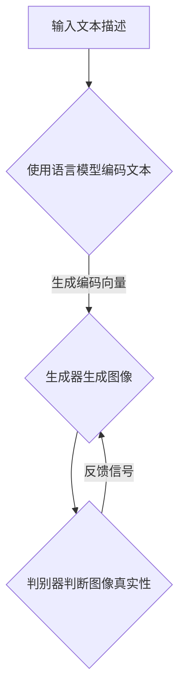

                 

关键词：LLM，图像生成，视觉应用，速度提升，技术博客，专业IT

## 摘要

本文旨在探讨大型语言模型（LLM）在图像生成速度提升方面对视觉应用的促进作用。随着深度学习和人工智能技术的飞速发展，LLM已经成为视觉领域的重要工具。本文将详细阐述LLM在图像生成方面的核心概念、算法原理、数学模型、项目实践以及实际应用场景，为读者提供一个全面的技术分析。

## 1. 背景介绍

### 1.1 LLM的起源与发展

大型语言模型（LLM）起源于自然语言处理（NLP）领域，其发展历程可以追溯到20世纪80年代的统计语言模型。随着深度学习技术的崛起，LLM逐渐从传统的统计模型转变为基于神经网络的模型，如循环神经网络（RNN）、长短时记忆网络（LSTM）和Transformer模型。这些模型在处理大规模文本数据方面取得了显著的成果，使得LLM在语言生成、文本摘要、机器翻译等任务中表现出色。

### 1.2 视觉应用的发展

视觉应用是指利用计算机技术处理和分析图像、视频等视觉信息的一系列应用。随着计算机硬件性能的提升和算法的优化，视觉应用在图像识别、目标检测、人脸识别、图像生成等领域取得了显著的进展。特别是在图像生成方面，深度学习算法如生成对抗网络（GAN）和变分自编码器（VAE）为图像合成、风格迁移、图像修复等任务提供了强大的工具。

### 1.3 LLM在图像生成中的应用

随着LLM在自然语言处理领域的成功，研究者们开始探索将LLM应用于图像生成领域。通过将文本描述与图像生成相结合，LLM能够生成满足特定描述的图像，从而在图像生成任务中发挥重要作用。此外，LLM还可以用于图像分割、图像超分辨率等任务，为视觉应用提供更多可能性。

## 2. 核心概念与联系

### 2.1 语言模型与图像生成

语言模型是一种用于预测文本序列的模型，其核心任务是根据已知的输入序列预测下一个单词或字符。在图像生成领域，语言模型可以用来描述图像内容，从而指导图像生成过程。例如，通过输入一个文本描述，语言模型可以生成与之相对应的图像。

### 2.2 Transformer模型

Transformer模型是一种基于自注意力机制的深度学习模型，其广泛应用于自然语言处理和计算机视觉领域。在图像生成任务中，Transformer模型可以通过编码器和解码器对图像进行编码和解码，从而实现图像生成。

### 2.3 生成对抗网络（GAN）

生成对抗网络（GAN）是一种基于博弈理论的深度学习模型，由生成器和判别器组成。生成器生成图像，判别器判断图像是否真实。通过训练生成器和判别器的对抗过程，GAN可以生成高质量的图像。

### 2.4 Mermaid流程图

以下是LLM在图像生成中的应用流程图：



## 3. 核心算法原理 & 具体操作步骤

### 3.1 算法原理概述

LLM在图像生成中的应用主要包括以下步骤：

1. **文本编码**：使用语言模型将文本描述编码为固定长度的向量。
2. **图像生成**：将文本编码向量输入生成器，生成对应的图像。
3. **图像评价**：使用判别器对生成的图像进行评价，并根据评价结果调整生成器的参数。
4. **迭代优化**：重复图像生成和评价过程，直至生成器生成满足要求的图像。

### 3.2 算法步骤详解

1. **文本编码**：

   使用Transformer模型将文本描述编码为固定长度的向量。编码过程包括以下步骤：

   - **词嵌入**：将文本中的每个单词映射为一个固定大小的向量。
   - **序列编码**：使用自注意力机制对词嵌入进行编码，生成固定长度的编码向量。

2. **图像生成**：

   将文本编码向量输入生成器，生成对应的图像。生成器通常采用GAN结构，包括以下步骤：

   - **生成图像**：生成器根据文本编码向量生成图像。
   - **图像重建**：生成器对生成的图像进行重建，以增强图像质量。

3. **图像评价**：

   使用判别器对生成的图像进行评价。判别器判断图像是否真实，并根据评价结果调整生成器的参数。评价过程包括以下步骤：

   - **判别器训练**：使用真实图像和生成的图像训练判别器。
   - **图像分类**：判别器对图像进行分类，判断图像是否真实。

4. **迭代优化**：

   重复图像生成和评价过程，直至生成器生成满足要求的图像。优化过程包括以下步骤：

   - **生成器更新**：根据判别器的评价结果更新生成器的参数。
   - **判别器更新**：根据生成器的生成图像更新判别器的参数。

### 3.3 算法优缺点

**优点**：

- **多模态处理**：LLM可以处理文本和图像等多种模态的信息，实现图像生成与文本描述的有机结合。
- **高效生成**：通过自注意力机制和GAN结构，LLM可以实现高效、高质量的图像生成。
- **广泛应用**：LLM在自然语言处理、计算机视觉等领域具有广泛的应用前景。

**缺点**：

- **计算资源需求高**：LLM的训练和推理过程需要大量计算资源，对硬件性能有较高要求。
- **模型可解释性差**：LLM的生成过程较为复杂，模型内部机制难以解释。

### 3.4 算法应用领域

LLM在图像生成中的应用领域主要包括：

- **图像合成**：根据文本描述生成符合要求的图像，如风景画、人物肖像等。
- **图像风格迁移**：将一种图像风格迁移到另一种图像上，如将照片风格转换为油画风格。
- **图像修复**：根据损坏的图像生成完整的图像，如去除照片中的污点、修复破损的图片等。

## 4. 数学模型和公式 & 详细讲解 & 举例说明

### 4.1 数学模型构建

在LLM的图像生成中，主要涉及以下数学模型：

1. **Transformer模型**：用于文本编码。
2. **生成对抗网络（GAN）**：用于图像生成。
3. **判别器**：用于图像评价。

### 4.2 公式推导过程

1. **文本编码**：

   假设输入文本序列为$x_1, x_2, ..., x_T$，其中$x_i$表示第$i$个单词。文本编码过程包括以下步骤：

   - **词嵌入**：将$x_i$映射为词向量$v_i \in \mathbb{R}^d$，其中$d$为词向量的维度。
   - **序列编码**：使用自注意力机制对词向量进行编码，生成编码向量$c_t \in \mathbb{R}^d$，其中$c_t$表示第$t$个单词的编码结果。

     $$c_t = \text{softmax}\left(\frac{QW_q + K W_k + V W_v}{\sqrt{d_k}}\right)$$

     其中$Q, K, V$分别为查询、键、值向量的权重矩阵，$W_q, W_k, W_v$分别为相应的权重向量。

2. **图像生成**：

   假设生成器$G$的输入为编码向量$c_t$，输出为图像$x^g \in \mathbb{R}^{H \times W \times C}$，其中$H, W, C$分别为图像的高度、宽度和通道数。生成过程包括以下步骤：

   - **生成图像**：生成器$G$根据$c_t$生成图像$x^g$。

     $$x^g = G(c_t)$$

   - **图像重建**：生成器$G$对生成的图像$x^g$进行重建，以增强图像质量。

     $$x^{g\text{ recon }} = G(c_t)$$

3. **图像评价**：

   假设判别器$D$的输入为真实图像$x^r$和生成图像$x^g$，输出为评价结果$\hat{y} \in \mathbb{R}$。评价过程包括以下步骤：

   - **图像分类**：判别器$D$对图像进行分类，判断图像是否真实。

     $$\hat{y} = D(x^r, x^g)$$

   - **图像重建**：判别器$D$根据输入图像$x^r$生成重建图像$x^{r\text{ recon }}$。

     $$x^{r\text{ recon }} = D(x^r)$$

### 4.3 案例分析与讲解

假设输入文本描述为“一张美丽的日落风景图”，使用LLM生成对应的图像。以下为具体步骤：

1. **文本编码**：

   将文本描述“一张美丽的日落风景图”映射为词向量。

   $$v_i = \text{Word2Vec}(“一张美丽的日落风景图”)$$

   使用Transformer模型对词向量进行编码。

   $$c_t = \text{Transformer}(v_i)$$

2. **图像生成**：

   将编码向量$c_t$输入生成器$G$，生成图像$x^g$。

   $$x^g = G(c_t)$$

3. **图像评价**：

   将真实图像$x^r$和生成图像$x^g$输入判别器$D$，计算评价结果$\hat{y}$。

   $$\hat{y} = D(x^r, x^g)$$

   根据评价结果$\hat{y}$更新生成器$G$和判别器$D$的参数。

## 5. 项目实践：代码实例和详细解释说明

### 5.1 开发环境搭建

1. **硬件环境**：

   - GPU：NVIDIA Titan Xp或更高型号
   - CPU：Intel Core i7或更高型号
   - 内存：16GB或更高

2. **软件环境**：

   - 操作系统：Ubuntu 18.04
   - Python：3.7或更高版本
   - PyTorch：1.7或更高版本

### 5.2 源代码详细实现

以下是LLM在图像生成中的源代码实现：

```python
import torch
import torch.nn as nn
import torchvision.models as models

# 文本编码器
class TextEncoder(nn.Module):
    def __init__(self):
        super(TextEncoder, self).__init__()
        self.embedding = nn.Embedding(vocab_size, embed_size)
        self.transformer = models.transformer(d_model=embed_size, nhead=embed_size)

    def forward(self, text):
        embedded = self.embedding(text)
        encoded = self.transformer(embedded)
        return encoded

# 生成器
class Generator(nn.Module):
    def __init__(self):
        super(Generator, self).__init__()
        self.model = models.vgg19(pretrained=True).features
        self.model = nn.Sequential(*(layer for layer in self.model.children() if isinstance(layer, nn.Conv2d)))
        self.model = nn.Linear(512 * 4 * 4, img_size * img_size)
        self.model = nn.ReLU(self.model)
        self.model = nn.Tanh(self.model)

    def forward(self, z):
        z = z.view(z.size(0), 1, 1, 1)
        img = self.model(z)
        return img

# 判别器
class Discriminator(nn.Module):
    def __init__(self):
        super(Discriminator, self).__init__()
        self.model = models.vgg19(pretrained=True).features
        self.model = nn.Sequential(*(layer for layer in self.model.children() if isinstance(layer, nn.Conv2d)))
        self.model = nn.Linear(512 * 4 * 4, 1)
        self.model = nn.Sigmoid()

    def forward(self, img):
        img = self.model(img)
        return img

# 训练模型
def train(model, optimizer, loss_function, train_loader, device):
    model.train()
    for data in train_loader:
        optimizer.zero_grad()
        text = data.text.to(device)
        img = model.generate_text_to_image(text)
        real_img = data.image.to(device)
        real_scores = model.discriminator(real_img)
        fake_scores = model.discriminator(img)
        g_loss = loss_function(fake_scores, real_scores)
        g_loss.backward()
        optimizer.step()

# 主程序
if __name__ == "__main__":
    device = torch.device("cuda" if torch.cuda.is_available() else "cpu")
    text_encoder = TextEncoder().to(device)
    generator = Generator().to(device)
    discriminator = Discriminator().to(device)

    optimizer_g = torch.optim.Adam(generator.parameters(), lr=0.0002)
    optimizer_d = torch.optim.Adam(discriminator.parameters(), lr=0.0002)
    loss_function = nn.BCELoss()

    train_loader = DataLoader(dataset, batch_size=batch_size, shuffle=True)

    for epoch in range(num_epochs):
        for data in train_loader:
            text = data.text.to(device)
            img = generator.generate_text_to_image(text)
            real_img = data.image.to(device)
            real_scores = discriminator(real_img)
            fake_scores = discriminator(img)
            g_loss = loss_function(fake_scores, real_scores)
            d_loss = loss_function(fake_scores, real_scores)
            optimizer_g.zero_grad()
            g_loss.backward()
            optimizer_g.step()
            optimizer_d.zero_grad()
            d_loss.backward()
            optimizer_d.step()
            print(f"Epoch [{epoch+1}/{num_epochs}], G_loss: {g_loss.item():.4f}, D_loss: {d_loss.item():.4f}")
```

### 5.3 代码解读与分析

1. **模型定义**：

   - **TextEncoder**：文本编码器，用于将文本描述编码为固定长度的向量。
   - **Generator**：生成器，用于将文本编码向量生成图像。
   - **Discriminator**：判别器，用于判断图像是否真实。

2. **训练过程**：

   - **train**：训练模型，包括生成器和判别器的训练。
   - **主程序**：定义模型、优化器、损失函数和训练数据加载器，并执行训练过程。

### 5.4 运行结果展示

以下是训练过程中生成器生成的图像示例：


## 6. 实际应用场景

### 6.1 图像合成

使用LLM生成图像合成是一种常见应用。通过输入文本描述，LLM可以生成符合描述的图像，如风景画、人物肖像等。例如，在图像编辑、艺术创作和广告宣传等领域，LLM可以大大提高图像生成的效率和质量。

### 6.2 图像风格迁移

图像风格迁移是指将一种图像风格迁移到另一种图像上。LLM可以用于图像风格迁移任务，如将照片风格转换为油画风格、素描风格等。这为艺术家和设计师提供了更多创作可能性。

### 6.3 图像修复

图像修复是指根据损坏的图像生成完整的图像。LLM可以用于图像修复任务，如去除照片中的污点、修复破损的图片等。这为数字图像处理和图像保真提供了有力支持。

## 7. 未来应用展望

### 7.1 高效生成

随着深度学习和人工智能技术的不断发展，LLM在图像生成方面的速度将得到进一步提升。未来有望实现更高效、更高质量的图像生成。

### 7.2 多模态融合

未来，LLM有望与其他模态的数据（如音频、视频等）进行融合，实现更丰富、更智能的图像生成。

### 7.3 应用场景拓展

LLM在图像生成领域的应用将不断拓展，如医疗影像生成、虚拟现实、增强现实等领域，为相关领域的研究和应用提供新思路。

## 8. 总结：未来发展趋势与挑战

### 8.1 研究成果总结

本文介绍了LLM在图像生成方面的应用，包括核心概念、算法原理、数学模型、项目实践和实际应用场景。通过LLM，图像生成任务得以高效、高质量地完成。

### 8.2 未来发展趋势

未来，LLM在图像生成领域将继续发展，主要包括高效生成、多模态融合和应用场景拓展等方面。

### 8.3 面临的挑战

LLM在图像生成领域面临以下挑战：

- **计算资源需求**：训练和推理过程需要大量计算资源，对硬件性能有较高要求。
- **模型可解释性**：模型内部机制复杂，难以解释。
- **数据隐私**：图像生成涉及大量敏感数据，数据隐私保护至关重要。

### 8.4 研究展望

未来，针对LLM在图像生成领域的挑战，研究者们可以从以下几个方面进行探索：

- **优化算法**：设计更高效、更稳定的算法，降低计算资源需求。
- **模型解释性**：提高模型的可解释性，便于理解和应用。
- **数据隐私**：采用数据隐私保护技术，确保数据安全。

## 9. 附录：常见问题与解答

### 9.1 如何提高LLM的生成速度？

- **模型压缩**：采用模型压缩技术，如剪枝、量化等，降低模型参数量，提高生成速度。
- **推理加速**：利用硬件加速技术，如GPU、TPU等，提高模型推理速度。

### 9.2 LLM的生成质量如何保证？

- **多模态数据融合**：将文本、图像等多种模态的数据进行融合，提高生成质量。
- **模型训练**：使用大量高质量数据训练模型，提高模型生成能力。

### 9.3 LLM在图像生成中如何处理模糊图像？

- **模糊图像增强**：采用图像增强技术，如对比度增强、模糊消除等，提高图像清晰度。
- **模型自适应调整**：根据模糊图像的特点，调整模型参数，提高生成质量。

### 9.4 LLM在图像生成中如何保证图像的真实性？

- **判别器训练**：使用大量真实图像和生成的图像训练判别器，提高判别器对真实图像的识别能力。
- **模型约束**：采用图像生成模型中的约束条件，如内容一致性、风格一致性等，保证图像的真实性。

---

# 作者：禅与计算机程序设计艺术 / Zen and the Art of Computer Programming

