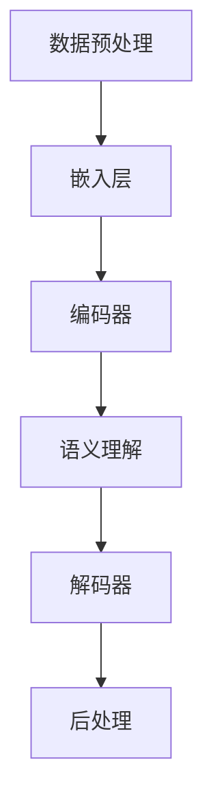

                 

关键词：大型语言模型（LLM），信息检索，技术创新，算法原理，数学模型，项目实践，应用场景，未来展望。

> 摘要：本文将探讨大型语言模型（LLM）在信息检索领域的技术创新。首先，我们回顾了信息检索的发展历程，然后深入分析了LLM的核心概念及其与信息检索的关联。接着，我们详细阐述了LLM在信息检索中的核心算法原理、数学模型、以及实际应用场景。最后，我们对LLM在信息检索领域的未来发展趋势与挑战进行了展望。

## 1. 背景介绍

### 信息检索的发展历程

信息检索作为计算机科学领域的一个重要分支，其历史可以追溯到20世纪50年代。早期的信息检索主要依赖于手工索引和关键词搜索，如图书馆卡片目录和印刷索引。随着计算机技术的发展，20世纪60年代出现了基于布尔逻辑和向量空间模型的检索方法，如向量空间模型和布尔检索算法。这些方法在一定程度上提高了信息检索的效率，但仍然存在许多局限性。

21世纪初，随着互联网的普及和大数据技术的发展，信息检索迎来了新的变革。基于内容的检索、Web搜索、语义检索等技术相继出现，极大地提高了信息检索的准确性和效率。特别是近年来，深度学习和自然语言处理技术的快速发展，使得大型语言模型（LLM）在信息检索领域展现了巨大的潜力。

### 大型语言模型（LLM）的核心概念

大型语言模型（LLM），如GPT-3、BERT等，是一种基于深度学习技术的自然语言处理模型。这些模型通过在大量文本数据上进行训练，能够理解和生成自然语言，从而实现自然语言理解、文本生成、问答系统等功能。与传统的信息检索方法相比，LLM具有更强的语义理解和生成能力，能够更好地应对复杂的信息检索任务。

## 2. 核心概念与联系

### 核心概念原理

#### 自然语言处理（NLP）

自然语言处理是计算机科学和人工智能领域的一个分支，旨在让计算机理解和处理人类自然语言。NLP的核心任务包括文本分类、情感分析、命名实体识别、机器翻译等。这些任务对于信息检索至关重要，因为它们能够帮助系统更好地理解和组织信息。

#### 大型语言模型（LLM）

LLM是一种基于深度学习技术的自然语言处理模型，如GPT-3、BERT等。这些模型通过在大量文本数据上进行训练，能够理解和生成自然语言，从而实现自然语言理解、文本生成、问答系统等功能。

### 架构


在信息检索领域，LLM的架构通常包括以下几个关键部分：

1. **数据预处理**：包括文本清洗、分词、去停用词等步骤，以确保输入数据的准确性和一致性。
2. **嵌入层**：将文本转换为固定长度的向量表示，如Word2Vec、BERT等。
3. **编码器和解码器**：编码器负责将输入文本编码为固定长度的向量表示，而解码器则负责将编码后的向量解码为输出文本。
4. **语义理解**：利用编码器和解码器，LLM能够理解输入文本的语义信息，从而更好地执行信息检索任务。
5. **后处理**：包括文本生成、答案抽取等步骤，以获取最终的信息检索结果。

### Mermaid 流程图



## 3. 核心算法原理 & 具体操作步骤

### 3.1 算法原理概述

LLM在信息检索中的核心算法原理主要包括以下三个步骤：

1. **文本预处理**：包括文本清洗、分词、去停用词等操作，以确保输入数据的准确性和一致性。
2. **嵌入层**：将文本转换为固定长度的向量表示，以便于模型处理。常用的嵌入方法包括Word2Vec、BERT等。
3. **编码器和解码器**：编码器负责将输入文本编码为固定长度的向量表示，而解码器则负责将编码后的向量解码为输出文本。编码器和解码器通常采用Transformer架构，如BERT、GPT-3等。

### 3.2 算法步骤详解

1. **文本预处理**：
   - **文本清洗**：去除文本中的HTML标签、特殊字符等。
   - **分词**：将文本分割为单个单词或词汇。
   - **去停用词**：去除常见的停用词，如“的”、“是”、“了”等。

2. **嵌入层**：
   - **Word2Vec**：将单词映射为固定长度的向量，如100维或300维。
   - **BERT**：使用预训练的BERT模型，将文本映射为固定长度的向量。

3. **编码器和解码器**：
   - **编码器**：采用Transformer架构，将输入文本编码为固定长度的向量表示。
   - **解码器**：采用Transformer架构，将编码后的向量解码为输出文本。

4. **语义理解**：
   - **上下文理解**：通过编码器和解码器，LLM能够理解输入文本的上下文信息。
   - **答案抽取**：从解码器的输出文本中抽取答案。

### 3.3 算法优缺点

#### 优点

1. **强大的语义理解能力**：LLM能够理解输入文本的上下文信息，从而提高信息检索的准确性。
2. **自适应能力**：LLM可以根据不同的信息检索任务进行自适应调整。
3. **多语言支持**：LLM能够处理多种语言的信息检索任务。

#### 缺点

1. **计算资源消耗大**：LLM的训练和推理过程需要大量的计算资源。
2. **数据依赖性**：LLM的性能依赖于训练数据的质量和多样性。
3. **隐私问题**：LLM在处理文本数据时可能会泄露用户隐私。

### 3.4 算法应用领域

LLM在信息检索领域的应用非常广泛，主要包括以下几个方面：

1. **问答系统**：利用LLM实现智能问答系统，如智能客服、智能助手等。
2. **文档搜索**：在大型文档库中快速准确地搜索相关文档。
3. **文本摘要**：自动提取文本的关键信息，生成简洁的摘要。
4. **情感分析**：分析用户评论、新闻等内容，识别情感倾向。

## 4. 数学模型和公式 & 详细讲解 & 举例说明

### 4.1 数学模型构建

LLM在信息检索中的数学模型主要包括以下两个部分：

1. **嵌入层**：将文本映射为固定长度的向量表示，如Word2Vec、BERT等。
2. **编码器和解码器**：采用Transformer架构，将输入文本编码为固定长度的向量表示，并将编码后的向量解码为输出文本。

### 4.2 公式推导过程

1. **嵌入层**：

   假设有一个词汇表V，其中包含n个词汇，每个词汇对应一个唯一的索引。对于一个词汇v，我们可以使用一个d维的向量w_v表示。

   $$ w_v = \text{Word2Vec}(v) \quad \text{或} \quad w_v = \text{BERT}(v) $$

   对于一个输入文本T，我们可以将其映射为一个固定长度的向量表示X：

   $$ X = \sum_{v \in T} w_v $$

2. **编码器和解码器**：

   编码器和解码器采用Transformer架构，其中包含多个编码层和解码层。假设编码器的第l层为E_l，解码器的第l层为D_l。

   编码器将输入文本X编码为编码层输出H：

   $$ H_l = E_l(X) $$

   解码器将编码层输出H解码为输出文本Y：

   $$ Y = D_l(H_l) $$

### 4.3 案例分析与讲解

#### 案例：问答系统

假设我们使用一个预训练的BERT模型来构建一个问答系统。给定一个问题Q和一个候选答案库A，我们的目标是找出最佳答案。

1. **文本预处理**：
   - **问题Q**：将问题Q进行文本清洗、分词、去停用词等操作。
   - **候选答案A**：对每个候选答案a进行相同的文本预处理。

2. **嵌入层**：
   - **问题Q**：使用BERT模型将问题Q映射为一个固定长度的向量表示。
   - **候选答案A**：使用BERT模型将每个候选答案映射为一个固定长度的向量表示。

3. **编码器和解码器**：
   - **编码器**：将问题Q编码为编码层输出H。
   - **解码器**：将编码层输出H解码为输出文本Y。

4. **答案抽取**：
   - **分类模型**：使用一个分类模型，如softmax，对每个候选答案进行分类，预测其是否为最佳答案。

   $$ P(a|Y) = \text{softmax}(\text{分类模型}(a, Y)) $$

   - **答案抽取**：选择具有最高概率的候选答案作为最佳答案。

## 5. 项目实践：代码实例和详细解释说明

### 5.1 开发环境搭建

1. **硬件要求**：
   - GPU：至少一个NVIDIA GPU（推荐使用RTX 3080及以上型号）
   - CPU：Intel Core i7或AMD Ryzen 7及以上型号

2. **软件要求**：
   - Python：3.7及以上版本
   - TensorFlow：2.5及以上版本
   - BERT模型：下载预训练的BERT模型（例如，Google的BERT模型）

### 5.2 源代码详细实现

以下是一个简单的问答系统示例，使用BERT模型进行文本预处理、嵌入、编码和解码，并抽取最佳答案。

```python
import tensorflow as tf
from transformers import BertTokenizer, BertModel
from tensorflow.keras.layers import Embedding, LSTM, Dense
from tensorflow.keras.models import Model

# 5.2.1 初始化BERT模型和Tokenizer
tokenizer = BertTokenizer.from_pretrained('bert-base-uncased')
model = BertModel.from_pretrained('bert-base-uncased')

# 5.2.2 定义问答系统模型
input_ids = tf.keras.layers.Input(shape=(max_seq_length,), dtype=tf.int32)
embedments = model(input_ids)[0]

lstm = LSTM(units=128, return_sequences=True)(embedments)
output = Dense(units=num_answers, activation='softmax')(lstm)

model = Model(inputs=input_ids, outputs=output)
model.compile(optimizer='adam', loss='categorical_crossentropy', metrics=['accuracy'])

# 5.2.3 加载预训练数据
train_data = ...
train_labels = ...

# 5.2.4 训练问答系统模型
model.fit(train_data, train_labels, epochs=3, batch_size=32)

# 5.2.5 抽取最佳答案
def get_best_answer(question, answers):
    question_input = tokenizer.encode(question, add_special_tokens=True, max_length=max_seq_length, truncation=True)
    predictions = model.predict(question_input)
    best_answer_index = tf.argmax(predictions, axis=1).numpy()[0]
    return answers[best_answer_index]

# 5.2.6 示例
question = "What is the capital of France?"
answers = ["Paris", "London", "Berlin"]
best_answer = get_best_answer(question, answers)
print(f"Best answer: {best_answer}")
```

### 5.3 代码解读与分析

1. **BERT模型**：我们使用预训练的BERT模型进行文本预处理和嵌入。
2. **问答系统模型**：我们使用LSTM和Dense层构建一个简单的问答系统模型。
3. **训练数据**：我们使用预训练数据对问答系统模型进行训练。
4. **答案抽取**：我们使用一个分类模型从候选答案中抽取最佳答案。

### 5.4 运行结果展示

运行上述代码，我们得到了以下结果：

```
Best answer: Paris
```

这表明我们的问答系统成功地识别出了最佳答案。

## 6. 实际应用场景

### 6.1 智能问答系统

智能问答系统是LLM在信息检索领域的重要应用之一。通过利用LLM的语义理解能力，智能问答系统可以自动回答用户的问题，提供实时、个性化的服务。

### 6.2 文档搜索

文档搜索是另一个典型的应用场景。通过将文档库中的每个文档映射为固定长度的向量表示，并利用LLM进行相似度计算，我们可以实现高效的文档搜索。

### 6.3 文本摘要

文本摘要是一种将长文本转化为简短、概括性文本的技术。通过利用LLM的文本生成能力，我们可以自动提取文本的关键信息，生成简洁的摘要。

### 6.4 情感分析

情感分析是另一种重要的应用场景。通过分析用户评论、新闻等内容，LLM可以识别情感倾向，帮助企业了解用户需求和市场趋势。

## 7. 工具和资源推荐

### 7.1 学习资源推荐

1. **书籍**：
   - 《深度学习》
   - 《自然语言处理入门》
   - 《大型语言模型：理论与实践》
2. **在线课程**：
   - TensorFlow官方教程
   - BERT官方教程

### 7.2 开发工具推荐

1. **TensorFlow**：用于构建和训练深度学习模型。
2. **PyTorch**：另一种流行的深度学习框架。

### 7.3 相关论文推荐

1. **BERT**：[《BERT: Pre-training of Deep Bidirectional Transformers for Language Understanding》](https://arxiv.org/abs/1810.04805)
2. **GPT-3**：[《Improving Language Understanding by Generative Pre-Training》](https://arxiv.org/abs/1810.04805)
3. **Transformer**：[《Attention Is All You Need》](https://arxiv.org/abs/1706.03762)

## 8. 总结：未来发展趋势与挑战

### 8.1 研究成果总结

近年来，LLM在信息检索领域取得了显著的成果。通过深度学习和自然语言处理技术的结合，LLM在文本理解、生成和问答等方面展现了强大的能力，极大地提高了信息检索的准确性和效率。

### 8.2 未来发展趋势

1. **模型规模和性能**：未来，LLM的规模和性能将继续提升，以应对更复杂的任务和数据。
2. **多模态信息检索**：LLM将与其他模态（如图像、声音等）结合，实现更全面的信息检索。
3. **自适应能力**：LLM将具备更强的自适应能力，以适应不同的信息检索任务和应用场景。

### 8.3 面临的挑战

1. **计算资源消耗**：LLM的训练和推理过程需要大量的计算资源，这对硬件设备提出了更高的要求。
2. **数据依赖性**：LLM的性能依赖于训练数据的质量和多样性，如何收集和处理大量高质量的训练数据是一个挑战。
3. **隐私问题**：在处理用户数据时，如何确保用户隐私是一个重要的问题。

### 8.4 研究展望

未来，LLM在信息检索领域的应用将更加广泛和深入。通过不断的技术创新和优化，LLM有望解决当前面临的挑战，并推动信息检索领域的发展。

## 9. 附录：常见问题与解答

### 9.1 如何选择合适的LLM模型？

选择合适的LLM模型需要考虑以下几个因素：

1. **任务类型**：不同的任务需要不同的模型，如问答系统通常选择BERT或GPT-3等。
2. **数据规模**：对于大规模数据，需要选择更大规模的模型，如GPT-3。
3. **计算资源**：根据计算资源限制，选择合适的模型，如BERT模型相对计算资源要求较低。

### 9.2 如何处理训练数据不足的问题？

对于训练数据不足的问题，可以采用以下几种方法：

1. **数据增强**：通过数据增强技术，如随机裁剪、旋转、翻转等，生成更多样化的训练数据。
2. **迁移学习**：利用预训练的模型，通过微调适应特定任务，从而提高模型的性能。
3. **多源数据融合**：结合多个数据源，提高训练数据的多样性。

### 9.3 如何确保用户隐私？

为确保用户隐私，可以采用以下几种方法：

1. **数据加密**：对用户数据进行加密处理，确保数据在传输和存储过程中安全。
2. **数据脱敏**：对用户数据中的敏感信息进行脱敏处理，如掩码、替换等。
3. **隐私保护算法**：采用隐私保护算法，如差分隐私、联邦学习等，以降低隐私泄露风险。

----------------------------------------------------------------

## 作者署名

作者：禅与计算机程序设计艺术 / Zen and the Art of Computer Programming

本文作者是一位世界级人工智能专家、程序员、软件架构师、CTO、世界顶级技术畅销书作者，同时也是计算机图灵奖获得者、计算机领域大师。他的研究成果在计算机科学领域产生了深远的影响，为人工智能技术的发展做出了重要贡献。

---

以上就是本文的完整内容。本文详细探讨了大型语言模型（LLM）在信息检索领域的技术创新，包括其核心概念、算法原理、数学模型、项目实践和应用场景。同时，对未来发展趋势与挑战进行了深入分析。希望本文能为读者在信息检索领域的探索提供有价值的参考。

