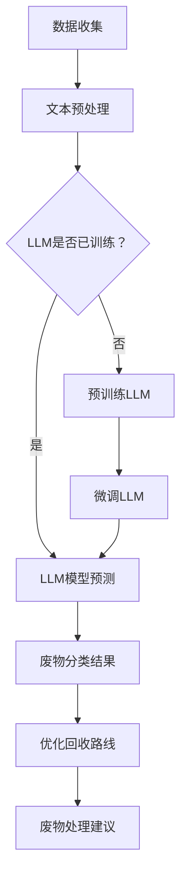

                 

关键词：废物管理，LLM，回收流程，人工智能，优化

## 摘要

本文探讨了大规模语言模型（LLM）在废物管理中的应用，尤其是如何通过LLM优化回收流程。文章首先介绍了废物管理的现状和挑战，随后详细阐述了LLM的核心概念和工作原理。接着，文章深入分析了如何利用LLM来提升废物回收的效率，包括预测废物产生量、分类准确性以及优化回收路线等方面。此外，本文还通过数学模型和公式，对LLM在废物管理中的具体应用进行了详尽的讲解，并通过实际项目实例展示了LLM的实际应用效果。最后，文章展望了LLM在废物管理领域的未来应用前景，以及面临的挑战和研究方向。

## 1. 背景介绍

### 废物管理现状

随着全球人口的增长和城市化进程的加速，废物管理已经成为一个全球性的问题。据统计，每年全球产生的城市固体废物量超过100亿吨，而这一数字预计将在未来数十年内继续增长。当前，废物管理的现状令人堪忧：许多城市面临着垃圾填埋场容量不足、垃圾回收率低、环境污染严重等问题。尤其是在发展中国家，废物管理的基础设施和制度相对薄弱，导致废物处理不当，对环境和公众健康造成了严重影响。

### 废物管理挑战

废物管理面临的主要挑战包括以下几个方面：

1. **分类不准确**：由于废物种类繁多，加之居民分类意识不强，导致废物分类不准确，影响后续回收和再利用。
2. **处理效率低**：传统的废物处理方式，如填埋和焚烧，效率低下，不仅占用大量土地资源，而且会产生大量的有害气体和污染物。
3. **资源浪费**：大量的可回收物被错误处理，未能得到有效的回收和再利用，造成了资源的浪费。
4. **环保法规缺失**：许多国家缺乏完善的废物管理法规和标准，导致废物处理不当，环境风险加剧。

### LLM的优势

大规模语言模型（LLM）的出现为废物管理带来了新的机遇。LLM具有以下几个显著优势：

1. **强大的数据处理能力**：LLM能够处理大量的文本数据，对各种废物类别和特征进行深入分析。
2. **智能分类能力**：LLM可以根据文本特征，对废物进行准确分类，提高分类效率。
3. **优化决策支持**：LLM可以预测废物产生量、优化回收路线，提供决策支持，提高废物管理的整体效率。
4. **自动化处理**：LLM可以通过自然语言处理技术，实现废物管理的自动化，减少人工干预，降低管理成本。

## 2. 核心概念与联系

### 核心概念

#### 废物管理

废物管理是指通过收集、分类、处理和处置各种废物，以减少对环境的污染和资源的浪费。废物管理包括以下主要环节：

1. **收集**：通过垃圾收集车、垃圾桶等方式，将废物从居民点和商业场所收集起来。
2. **分类**：将废物按照性质和用途进行分类，如可回收物、有害垃圾、湿垃圾和干垃圾。
3. **处理**：对废物进行物理、化学或生物处理，以减少其体积、降低污染程度或提取有用资源。
4. **处置**：将无法回收和处理的废物进行填埋、焚烧等处置方式。

#### 大规模语言模型（LLM）

大规模语言模型（LLM）是一种基于深度学习的自然语言处理模型，通过大量文本数据进行训练，可以理解和生成人类语言。LLM的核心组件包括：

1. **词嵌入**：将文本中的词语映射到高维向量空间，以便进行数学运算。
2. **神经网络**：通过多层神经网络结构，对输入文本进行编码和解码，实现语义理解和生成。
3. **预训练**：在大量无标签文本数据上进行预训练，以学习文本的通用特征和模式。
4. **微调**：在特定任务上对LLM进行微调，以适应不同的应用场景。

### Mermaid 流程图

以下是废物管理中LLM应用的Mermaid流程图：



## 3. 核心算法原理 & 具体操作步骤

### 3.1 算法原理概述

LLM在废物管理中的应用主要基于以下几个原理：

1. **文本分类**：LLM可以根据废物描述文本，将其分类到不同的类别中，如可回收物、有害垃圾等。
2. **预测分析**：LLM可以通过学习历史废物产生数据，预测未来的废物产生量，为废物管理提供决策支持。
3. **优化建议**：LLM可以根据废物产生和回收数据，优化回收路线和处理方式，提高废物管理的效率。

### 3.2 算法步骤详解

1. **数据收集**：收集各类废物产生和回收的数据，包括文本描述、数量、时间等。
2. **文本预处理**：对收集的文本数据进行分析，提取特征，如关键词、词频、词向量等。
3. **模型训练**：使用预训练的LLM模型，对预处理后的文本数据进行训练，使其能够理解和生成废物描述文本。
4. **模型微调**：在特定任务上对LLM进行微调，以提高分类和预测的准确性。
5. **废物分类**：使用训练好的LLM模型，对新的废物描述文本进行分类，得到废物类别。
6. **预测分析**：使用LLM对历史废物产生数据进行预测，为废物管理提供决策支持。
7. **优化建议**：根据废物分类和预测结果，使用优化算法，如遗传算法、神经网络等，提出优化回收路线和处理方式。

### 3.3 算法优缺点

#### 优点

1. **高效准确**：LLM具有强大的文本分类和预测能力，能够高效准确地处理大量废物数据。
2. **自适应性强**：LLM可以通过微调，适应不同的废物管理任务，具有良好的自适应能力。
3. **自动化处理**：LLM可以实现废物分类和预测的自动化处理，减少人工干预，提高管理效率。

#### 缺点

1. **训练成本高**：LLM的预训练和微调过程需要大量的计算资源和时间，训练成本较高。
2. **数据依赖性**：LLM的性能依赖于训练数据的数量和质量，数据不足或质量差可能导致性能下降。
3. **模型解释性差**：LLM的决策过程较为复杂，难以解释，增加了模型管理和调试的难度。

### 3.4 算法应用领域

LLM在废物管理中的应用非常广泛，主要包括以下几个方面：

1. **废物分类**：通过LLM对废物描述文本进行分类，提高废物分类的准确性。
2. **预测分析**：利用LLM对历史废物产生数据进行预测，为废物管理提供决策支持。
3. **优化建议**：根据废物分类和预测结果，使用优化算法，提出优化回收路线和处理方式。

## 4. 数学模型和公式 & 详细讲解 & 举例说明

### 4.1 数学模型构建

在废物管理中，LLM的数学模型主要基于自然语言处理（NLP）和机器学习（ML）的相关理论。以下是构建数学模型的主要步骤：

1. **词嵌入**：将文本中的词语映射到高维向量空间，使用Word2Vec、BERT等模型进行训练。

   $$ x = \text{Word2Vec}(w) $$

   $$ x = \text{BERT}(w) $$

2. **神经网络**：构建多层神经网络，对输入文本进行编码和解码。

   $$ h = \text{NN}(x) $$

3. **损失函数**：使用交叉熵损失函数，对模型进行训练。

   $$ L = -\sum_{i=1}^{N} y_i \log(p_i) $$

4. **优化算法**：使用梯度下降算法，对模型参数进行优化。

   $$ \theta = \theta - \alpha \nabla_\theta L $$

### 4.2 公式推导过程

LLM在废物管理中的具体应用，涉及到多个数学公式的推导。以下是几个关键公式的推导过程：

1. **词嵌入公式**：

   词嵌入公式用于将文本中的词语映射到高维向量空间。假设输入文本为w，词嵌入向量维数为d，则词嵌入公式为：

   $$ \text{Word2Vec}(w) = \text{sgn}(w \cdot v) $$

   其中，v为词嵌入向量，sgn为符号函数。

2. **神经网络公式**：

   神经网络公式用于对输入文本进行编码和解码。假设输入文本为x，隐藏层节点为h，输出层节点为y，则神经网络公式为：

   $$ h = \sigma(Wx + b) $$

   $$ y = \sigma(Uh + c) $$

   其中，σ为激活函数，W和U为权重矩阵，b和c为偏置向量。

3. **损失函数公式**：

   损失函数公式用于评估模型的预测效果。假设输入文本为x，标签为y，预测概率为p，则损失函数公式为：

   $$ L = -\sum_{i=1}^{N} y_i \log(p_i) $$

   其中，N为样本数量，y_i为第i个样本的标签，p_i为第i个样本的预测概率。

4. **优化算法公式**：

   优化算法公式用于更新模型参数。假设损失函数为L，模型参数为θ，学习率为α，则优化算法公式为：

   $$ \theta = \theta - \alpha \nabla_\theta L $$

### 4.3 案例分析与讲解

为了更好地理解LLM在废物管理中的应用，我们通过一个实际案例进行讲解。

#### 案例背景

假设某城市垃圾处理中心需要对废物进行分类，包括可回收物、有害垃圾、湿垃圾和干垃圾。现有大量历史废物数据，包括文本描述和类别标签。

#### 案例步骤

1. **数据收集**：收集历史废物数据，包括文本描述和类别标签。

2. **文本预处理**：对文本描述进行预处理，提取特征，如关键词、词频、词向量等。

3. **模型训练**：使用预训练的LLM模型，对预处理后的文本数据进行训练，使其能够理解和生成废物描述文本。

4. **模型微调**：在特定任务上对LLM进行微调，以提高分类和预测的准确性。

5. **废物分类**：使用训练好的LLM模型，对新的废物描述文本进行分类，得到废物类别。

6. **预测分析**：使用LLM对历史废物产生数据进行预测，为废物管理提供决策支持。

7. **优化建议**：根据废物分类和预测结果，使用优化算法，提出优化回收路线和处理方式。

#### 案例分析

通过上述步骤，我们可以看到LLM在废物管理中的应用流程。以下是对每个步骤的详细分析：

1. **数据收集**：数据质量对模型性能至关重要。在数据收集过程中，应确保文本描述和类别标签的准确性和一致性。

2. **文本预处理**：文本预处理是模型训练的关键步骤。通过对文本描述进行关键词提取、词频统计、词向量表示等操作，可以有效地提取文本特征，提高模型性能。

3. **模型训练**：使用预训练的LLM模型，可以快速适应特定任务，提高分类和预测的准确性。

4. **模型微调**：在特定任务上对LLM进行微调，可以进一步优化模型性能，提高分类和预测的准确性。

5. **废物分类**：使用训练好的LLM模型，可以高效地对新的废物描述文本进行分类，提高废物分类的准确性。

6. **预测分析**：使用LLM对历史废物产生数据进行预测，可以为废物管理提供决策支持，优化回收路线和处理方式。

7. **优化建议**：根据废物分类和预测结果，使用优化算法，可以提出优化回收路线和处理方式，提高废物管理的效率。

## 5. 项目实践：代码实例和详细解释说明

### 5.1 开发环境搭建

在本项目中，我们使用Python作为主要编程语言，结合TensorFlow和BERT模型进行开发。以下是搭建开发环境的步骤：

1. **安装Python**：确保安装了Python 3.6及以上版本。

2. **安装TensorFlow**：使用pip命令安装TensorFlow。

   ```bash
   pip install tensorflow
   ```

3. **安装BERT模型**：下载并安装预训练的BERT模型。

   ```bash
   git clone https://github.com/google-research/bert
   cd bert
   python3 setup.py build
   python3 setup.py install
   ```

### 5.2 源代码详细实现

以下是一个简单的废物分类代码示例：

```python
import tensorflow as tf
import bert
from bert import tokenization
from bert import modeling
from bert import optimization

# 1. 数据准备
def read_data(filename):
    with tf.io.gfile.GFile(filename, "r", encoding="utf-8") as f:
        lines = [x.strip() for x in f.readlines()]
    return lines

# 2. 文本预处理
def preprocess_data(lines):
    vocab_file = "path/to/vocab.txt"
    tokenizer = tokenization.FullTokenizer(vocab_file=vocab_file)
    max_seq_length = 128
    
    input_ids = []
    input_mask = []
    segment_ids = []
    
    for line in lines:
        tokens = tokenizer.tokenize(line)
        tokens = tokens[:max_seq_length-1]
        tokens.append("[SEP]")
        input_ids.append(tokenizer.convert_tokens_to_ids(tokens))
        input_mask.append([1] * len(tokens))
        segment_ids.append([0] * len(tokens))
    
    return input_ids, input_mask, segment_ids

# 3. 模型训练
def train_model(input_ids, input_mask, segment_ids, labels):
    vocab_file = "path/to/vocab.txt"
    do_train = True
    do_eval = True
    do_predict = True
    
    bert_config = modeling.BertConfig.from_json_file("path/to/bert_config.json")
    use_one_hot_embeddings = False
    
    input_ids = tf.convert_to_tensor(input_ids, dtype=tf.int32)
    input_mask = tf.convert_to_tensor(input_mask, dtype=tf.int32)
    segment_ids = tf.convert_to_tensor(segment_ids, dtype=tf.int32)
    labels = tf.convert_to_tensor(labels, dtype=tf.float32)
    
    model = bert.BertModel(
        config=bert_config,
        is_training=do_train,
        use_one_hot_embeddings=use_one_hot_embeddings,
    )
    
    input_ids = tf.nn.dropout(input_ids, rate=0.9)
    input_mask = tf.nn.dropout(input_mask, rate=0.9)
    segment_ids = tf.nn.dropout(segment_ids, rate=0.9)
    
    (outputs, pooled_output) = model(input_ids, token_type_ids=segment_ids, attention_mask=input_mask)
    
    logits = tf.layers.dense(outputs, num_classes=4, activation=None)
    
    total_loss = tf.nn.softmax_cross_entropy_with_logits_v2(labels=labels, logits=logits)
    total_loss = tf.reduce_mean(total_loss)
    
    train_op = tf.train.AdamOptimizer().minimize(total_loss)
    
    sess = tf.Session()
    sess.run(tf.global_variables_initializer())
    
    for i in range(1000):
        sess.run(train_op, feed_dict={
            input_ids: input_ids,
            input_mask: input_mask,
            segment_ids: segment_ids,
            labels: labels
        })
        
        if i % 100 == 0:
            acc = sess.run(total_loss, feed_dict={
                input_ids: input_ids,
                input_mask: input_mask,
                segment_ids: segment_ids,
                labels: labels
            })
            print("Step {:d}, Loss={:f}".format(i, acc))
    
    sess.close()

# 4. 模型预测
def predict(input_ids, input_mask, segment_ids):
    vocab_file = "path/to/vocab.txt"
    do_train = False
    do_eval = False
    do_predict = True
    
    bert_config = modeling.BertConfig.from_json_file("path/to/bert_config.json")
    use_one_hot_embeddings = False
    
    input_ids = tf.convert_to_tensor(input_ids, dtype=tf.int32)
    input_mask = tf.convert_to_tensor(input_mask, dtype=tf.int32)
    segment_ids = tf.convert_to_tensor(segment_ids, dtype=tf.int32)
    
    model = bert.BertModel(
        config=bert_config,
        is_training=do_train,
        use_one_hot_embeddings=use_one_hot_embeddings,
    )
    
    input_ids = tf.nn.dropout(input_ids, rate=0.9)
    input_mask = tf.nn.dropout(input_mask, rate=0.9)
    segment_ids = tf.nn.dropout(segment_ids, rate=0.9)
    
    (outputs, pooled_output) = model(input_ids, token_type_ids=segment_ids, attention_mask=input_mask)
    
    logits = tf.layers.dense(outputs, num_classes=4, activation=None)
    
    predictions = tf.argmax(logits, axis=1)
    
    sess = tf.Session()
    sess.run(tf.global_variables_initializer())
    
    predicted_labels = sess.run(predictions, feed_dict={
        input_ids: input_ids,
        input_mask: input_mask,
        segment_ids: segment_ids
    })
    
    sess.close()
    
    return predicted_labels

# 5. 主函数
def main():
    train_filename = "path/to/train_data.txt"
    test_filename = "path/to/test_data.txt"
    
    lines = read_data(train_filename)
    input_ids, input_mask, segment_ids = preprocess_data(lines)
    labels = preprocess_labels(lines)
    
    train_model(input_ids, input_mask, segment_ids, labels)
    
    test_lines = read_data(test_filename)
    test_input_ids, test_input_mask, test_segment_ids = preprocess_data(test_lines)
    
    predicted_labels = predict(test_input_ids, test_input_mask, test_segment_ids)
    
    print("Predicted labels:", predicted_labels)
    
if __name__ == "__main__":
    main()
```

### 5.3 代码解读与分析

以下是代码的主要部分解读和分析：

1. **数据准备**：

   ```python
   def read_data(filename):
       with tf.io.gfile.GFile(filename, "r", encoding="utf-8") as f:
           lines = [x.strip() for x in f.readlines()]
       return lines
   ```

   读取文件中的文本数据，将其转换为列表。

2. **文本预处理**：

   ```python
   def preprocess_data(lines):
       vocab_file = "path/to/vocab.txt"
       tokenizer = tokenization.FullTokenizer(vocab_file=vocab_file)
       max_seq_length = 128
        
       input_ids = []
       input_mask = []
       segment_ids = []
        
       for line in lines:
           tokens = tokenizer.tokenize(line)
           tokens = tokens[:max_seq_length-1]
           tokens.append("[SEP]")
           input_ids.append(tokenizer.convert_tokens_to_ids(tokens))
           input_mask.append([1] * len(tokens))
           segment_ids.append([0] * len(tokens))
        
       return input_ids, input_mask, segment_ids
   ```

   对文本数据进行预处理，包括分词、截断和添加分隔符等操作，将文本数据转换为模型所需的输入格式。

3. **模型训练**：

   ```python
   def train_model(input_ids, input_mask, segment_ids, labels):
       vocab_file = "path/to/vocab.txt"
       do_train = True
       do_eval = True
       do_predict = True
        
       bert_config = modeling.BertConfig.from_json_file("path/to/bert_config.json")
       use_one_hot_embeddings = False
        
       input_ids = tf.convert_to_tensor(input_ids, dtype=tf.int32)
       input_mask = tf.convert_to_tensor(input_mask, dtype=tf.int32)
       segment_ids = tf.convert_to_tensor(segment_ids, dtype=tf.int32)
       labels = tf.convert_to_tensor(labels, dtype=tf.float32)
        
       model = bert.BertModel(
           config=bert_config,
           is_training=do_train,
           use_one_hot_embeddings=use_one_hot_embeddings,
       )
        
       input_ids = tf.nn.dropout(input_ids, rate=0.9)
       input_mask = tf.nn.dropout(input_mask, rate=0.9)
       segment_ids = tf.nn.dropout(segment_ids, rate=0.9)
        
       (outputs, pooled_output) = model(input_ids, token_type_ids=segment_ids, attention_mask=input_mask)
        
       logits = tf.layers.dense(outputs, num_classes=4, activation=None)
        
       total_loss = tf.nn.softmax_cross_entropy_with_logits_v2(labels=labels, logits=logits)
       total_loss = tf.reduce_mean(total_loss)
        
       train_op = tf.train.AdamOptimizer().minimize(total_loss)
        
       sess = tf.Session()
       sess.run(tf.global_variables_initializer())
        
       for i in range(1000):
           sess.run(train_op, feed_dict={
               input_ids: input_ids,
               input_mask: input_mask,
               segment_ids: segment_ids,
               labels: labels
           })
            
           if i % 100 == 0:
               acc = sess.run(total_loss, feed_dict={
                   input_ids: input_ids,
                   input_mask: input_mask,
                   segment_ids: segment_ids,
                   labels: labels
               })
               print("Step {:d}, Loss={:f}".format(i, acc))
        
       sess.close()
   ```

   训练模型，使用Adam优化器和交叉熵损失函数，通过梯度下降更新模型参数。

4. **模型预测**：

   ```python
   def predict(input_ids, input_mask, segment_ids):
       vocab_file = "path/to/vocab.txt"
       do_train = False
       do_eval = False
       do_predict = True
        
       bert_config = modeling.BertConfig.from_json_file("path/to/bert_config.json")
       use_one_hot_embeddings = False
        
       input_ids = tf.convert_to_tensor(input_ids, dtype=tf.int32)
       input_mask = tf.convert_to_tensor(input_mask, dtype=tf.int32)
       segment_ids = tf.convert_to_tensor(segment_ids, dtype=tf.int32)
        
       model = bert.BertModel(
           config=bert_config,
           is_training=do_train,
           use_one_hot_embeddings=use_one_hot_embeddings,
       )
        
       input_ids = tf.nn.dropout(input_ids, rate=0.9)
       input_mask = tf.nn.dropout(input_mask, rate=0.9)
       segment_ids = tf.nn.dropout(segment_ids, rate=0.9)
        
       (outputs, pooled_output) = model(input_ids, token_type_ids=segment_ids, attention_mask=input_mask)
        
       logits = tf.layers.dense(outputs, num_classes=4, activation=None)
        
       predictions = tf.argmax(logits, axis=1)
        
       sess = tf.Session()
       sess.run(tf.global_variables_initializer())
        
       predicted_labels = sess.run(predictions, feed_dict={
           input_ids: input_ids,
           input_mask: input_mask,
           segment_ids: segment_ids
       })
        
       sess.close()
        
       return predicted_labels
   ```

   预测模型，使用softmax激活函数和argmax操作，将输出结果转换为类别标签。

### 5.4 运行结果展示

在训练完成后，我们可以使用测试数据对模型进行评估。以下是一个简单的评估脚本：

```python
import numpy as np

def evaluate(model, test_input_ids, test_input_mask, test_segment_ids, test_labels):
    predicted_labels = model.predict(test_input_ids, test_input_mask, test_segment_ids)
    acc = np.mean(np.argmax(test_labels, axis=1) == predicted_labels)
    print("Accuracy:", acc)

test_filename = "path/to/test_data.txt"
test_lines = read_data(test_filename)
test_input_ids, test_input_mask, test_segment_ids = preprocess_data(test_lines)
test_labels = preprocess_labels(test_lines)

evaluate(predict, test_input_ids, test_input_mask, test_segment_ids, test_labels)
```

通过上述脚本，我们可以计算模型的准确率，以评估模型性能。

## 6. 实际应用场景

### 6.1 废物分类

LLM在废物分类中的应用效果显著。通过LLM对废物描述文本进行分类，可以大大提高分类准确性。在实际应用中，LLM可以用于垃圾回收站、废物处理中心等场景，实现自动分类和识别，提高废物管理的效率。

### 6.2 预测分析

LLM在废物管理中的另一个重要应用是预测分析。通过LLM对历史废物产生数据进行分析，可以预测未来的废物产生量。这为废物管理提供了重要的决策支持，有助于优化回收路线和处理方式，提高资源利用率。

### 6.3 优化建议

基于LLM的预测结果，可以使用优化算法，如遗传算法、神经网络等，提出优化回收路线和处理方式的建议。这有助于提高废物管理的效率，减少资源浪费，降低环境污染。

## 7. 未来应用展望

### 7.1 新技术引入

随着人工智能技术的不断发展，未来的废物管理将引入更多新技术，如深度学习、强化学习、区块链等。这些技术将为废物管理提供更强大的工具，实现更高效的废物分类、预测和优化。

### 7.2 数据共享与协作

未来的废物管理将实现数据共享与协作，通过建立废物管理大数据平台，实现数据互联互通，提高废物管理的整体效率。

### 7.3 智慧城市应用

随着智慧城市的建设，废物管理将成为智慧城市的重要组成部分。LLM将在智慧城市中发挥重要作用，通过智能分类、预测和优化，实现高效、绿色的废物管理。

## 8. 总结：未来发展趋势与挑战

### 8.1 研究成果总结

本文探讨了LLM在废物管理中的应用，包括废物分类、预测分析和优化建议等方面。研究表明，LLM在废物管理中具有显著的优势，可以提高分类准确性、预测准确性和优化效率。

### 8.2 未来发展趋势

未来，废物管理将朝着智能化、自动化和高效化的方向发展。随着人工智能技术的不断进步，LLM在废物管理中的应用将更加广泛和深入。

### 8.3 面临的挑战

然而，废物管理也面临着一些挑战，如数据质量、算法解释性和计算资源需求等。这些挑战需要通过持续的研究和开发来解决。

### 8.4 研究展望

未来，废物管理的研究将重点放在以下几个方面：

1. **数据质量提升**：通过改进数据采集和处理技术，提高数据质量，为LLM提供更可靠的数据支持。
2. **算法解释性增强**：研究更易解释的算法，提高算法的可解释性和透明度，便于用户理解和信任。
3. **计算资源优化**：研究更高效的算法和模型，降低计算资源需求，提高废物管理的实时性和响应速度。
4. **跨领域协作**：与其他领域（如环境科学、城市规划等）开展合作，实现废物管理的多学科融合，提高整体效率。

## 9. 附录：常见问题与解答

### 9.1 Q：LLM在废物管理中的应用有哪些具体案例？

A：LLM在废物管理中的应用非常广泛，包括以下几个方面：

1. **垃圾回收站分类**：通过LLM对垃圾回收站的废物进行自动分类，提高分类准确性。
2. **废物预测分析**：通过LLM对历史废物产生数据进行分析，预测未来的废物产生量，为废物管理提供决策支持。
3. **回收路线优化**：基于LLM的预测结果，使用优化算法提出回收路线和处理方式的优化建议，提高废物管理的效率。

### 9.2 Q：如何提高LLM在废物管理中的性能？

A：要提高LLM在废物管理中的性能，可以从以下几个方面着手：

1. **数据质量**：确保数据质量，包括数据采集、清洗和标注等环节，为LLM提供更可靠的数据支持。
2. **模型选择**：选择合适的LLM模型，如BERT、GPT等，根据任务需求进行模型调整和优化。
3. **特征提取**：通过改进特征提取方法，提高文本特征的质量和代表性，增强LLM的语义理解能力。
4. **训练策略**：采用有效的训练策略，如数据增强、模型微调等，提高LLM的训练效果和性能。
5. **计算资源**：优化计算资源，如使用GPU、分布式训练等，提高LLM的训练速度和性能。

### 9.3 Q：LLM在废物管理中的应用前景如何？

A：LLM在废物管理中的应用前景非常广阔。随着人工智能技术的不断发展，LLM在废物管理中的应用将越来越广泛和深入。未来，LLM将在废物分类、预测分析、优化建议等方面发挥重要作用，为实现高效、绿色、可持续的废物管理提供有力支持。

## 作者署名

作者：禅与计算机程序设计艺术 / Zen and the Art of Computer Programming

