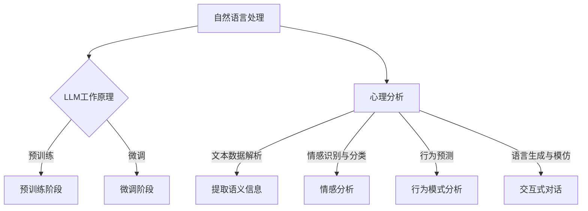

                 

关键词：自然语言处理、深度学习、情感分析、心理评估、人工智能、机器学习

## 摘要

本文探讨了大型语言模型（LLM）在心理分析中的应用，特别是在辅助心理评估领域的潜力。通过对LLM的核心概念、算法原理、数学模型、应用实践等方面进行详细解析，本文旨在展示如何利用AI技术提高心理评估的准确性和效率。此外，还将对LLM在心理分析中的实际应用场景进行探讨，并提出未来发展的展望。

## 1. 背景介绍

随着人工智能技术的快速发展，深度学习和自然语言处理（NLP）取得了显著的成就。特别是大型语言模型（LLM），如GPT-3、BERT和T5等，凭借其强大的语言理解和生成能力，已经在众多领域展现出巨大的潜力。心理分析作为心理学研究的重要分支，旨在通过理解和分析个体的心理状态、行为和思维模式，为临床诊断、治疗和教育提供科学依据。

然而，传统的心理评估方法往往依赖于人工判断，耗时耗力且容易受到主观因素的影响。随着AI技术的进步，利用机器学习模型进行心理评估的思路逐渐受到关注。LLM作为一种先进的人工智能技术，具有处理大规模文本数据、提取复杂语义信息的能力，使得其在心理分析中的应用成为可能。

本文旨在探讨LLM在心理分析中的应用，特别是AI辅助心理评估的可行性。通过梳理LLM的核心概念、算法原理、数学模型和应用实践，本文希望能够为相关领域的研究者和从业者提供有价值的参考。

## 2. 核心概念与联系

### 2.1 大型语言模型（LLM）

#### 2.1.1 定义

大型语言模型（Large Language Model，简称LLM）是一种基于深度学习的自然语言处理模型，旨在对大量文本数据进行建模，以实现语言理解和生成。LLM的核心思想是通过大量的文本数据进行预训练，使模型具备对自然语言中复杂语义和结构的理解能力。

#### 2.1.2 工作原理

LLM通常采用Transformer架构，这是一种基于自注意力机制的深度神经网络模型。通过自注意力机制，模型可以动态地学习输入文本中各个单词之间的关系，从而更好地理解文本的整体语义。此外，LLM还通过预训练和微调两个阶段来提高其性能。预训练阶段利用大量的无监督数据，使模型具备一定的语言理解能力；微调阶段则通过有监督的数据对模型进行精细调整，使其在特定任务上达到更好的效果。

### 2.2 心理分析

#### 2.2.1 定义

心理分析（Psychological Analysis）是一种心理学研究方法，旨在通过分析个体的心理状态、行为和思维模式，深入了解其内心世界。心理分析主要包括临床心理分析、行为分析和认知分析等不同流派，每种流派都有其独特的理论和方法。

#### 2.2.2 与LLM的联系

LLM在心理分析中的应用主要体现在以下几个方面：

1. **文本数据解析**：LLM能够对大量文本数据进行分析，提取出隐藏在文本中的情感、态度和观点等语义信息，为心理分析提供有力的数据支持。

2. **情感识别与分类**：LLM具有强大的情感分析能力，可以准确识别文本中的情感，为心理评估提供情感维度的数据。

3. **行为预测**：通过分析个体的历史行为数据，LLM可以预测其未来的行为模式，为心理干预提供依据。

4. **语言生成与模仿**：LLM可以生成模仿人类语言风格的文本，为心理治疗和心理咨询提供互动式对话支持。

### 2.3 Mermaid 流程图



## 3. 核心算法原理 & 具体操作步骤

### 3.1 算法原理概述

LLM的核心算法原理主要基于深度学习和自然语言处理技术。以下是对LLM算法原理的简要概述：

1. **深度学习**：深度学习是一种基于多层神经网络的学习方法，通过逐层提取特征，实现对复杂数据的建模。在LLM中，深度学习用于构建大规模的神经网络模型，以实现对文本数据的处理。

2. **自然语言处理**：自然语言处理（NLP）是计算机科学和人工智能领域的一个重要分支，旨在使计算机能够理解、生成和处理人类语言。在LLM中，NLP技术用于对文本数据进行预处理、特征提取和模型训练等操作。

3. **Transformer架构**：Transformer是一种基于自注意力机制的深度神经网络模型，最初由Vaswani等人于2017年提出。自注意力机制使模型能够动态地学习输入文本中各个单词之间的关系，从而更好地理解文本的整体语义。

4. **预训练与微调**：预训练是指利用大量的无监督数据对模型进行训练，使模型具备一定的语言理解能力。微调则是在预训练的基础上，利用有监督的数据对模型进行精细调整，使其在特定任务上达到更好的效果。

### 3.2 算法步骤详解

1. **数据收集与预处理**：首先，收集大量包含情感、行为等信息的文本数据，如社交媒体帖子、博客文章、心理评估问卷等。然后，对文本数据进行清洗、去噪和分词等预处理操作，以得到可用于训练的干净文本数据。

2. **模型构建**：采用Transformer架构构建大规模的神经网络模型。在构建过程中，设置适当的参数，如层数、隐藏层大小、学习率等。

3. **预训练**：利用收集到的无监督文本数据对模型进行预训练。预训练过程中，模型通过不断调整参数，使模型对文本数据中的语义信息有更深入的理解。

4. **微调**：在预训练的基础上，利用有监督的数据对模型进行微调。微调过程中，模型根据特定任务的要求，对参数进行调整，以使其在特定任务上达到更好的效果。

5. **模型评估与优化**：通过在验证集和测试集上对模型进行评估，确定模型在心理分析任务上的性能。若模型性能未达到预期，则通过调整模型结构、参数设置等方法进行优化。

### 3.3 算法优缺点

#### 3.3.1 优点

1. **强大的语义理解能力**：LLM通过预训练和微调，具有强大的语义理解能力，能够准确提取文本数据中的情感、态度和观点等语义信息。

2. **高效的处理速度**：由于采用了并行计算和分布式训练等技术，LLM在处理大规模文本数据时具有较高的计算效率。

3. **灵活的应用场景**：LLM可以应用于多种心理分析任务，如情感识别、行为预测和交互式对话等，具有较高的灵活性和通用性。

#### 3.3.2 缺点

1. **数据依赖性强**：LLM的性能很大程度上依赖于训练数据的数量和质量。如果训练数据缺乏多样性或存在偏差，可能导致模型在特定任务上的性能不佳。

2. **解释性不足**：由于深度学习模型的复杂性，LLM在决策过程中的解释性相对较弱，难以解释模型为何做出特定决策。

3. **隐私保护问题**：在心理分析中，涉及大量个人隐私数据。如何确保LLM在处理这些数据时能够保护用户隐私，是一个亟待解决的问题。

### 3.4 算法应用领域

LLM在心理分析中的应用领域广泛，主要包括以下几个方面：

1. **情感识别与分类**：通过分析个体的社交媒体帖子、博客文章等文本数据，LLM可以准确识别文本中的情感，为心理评估提供情感维度的数据支持。

2. **行为预测**：通过分析个体的历史行为数据，LLM可以预测其未来的行为模式，为心理干预提供依据。

3. **交互式对话**：LLM可以生成模仿人类语言风格的文本，为心理治疗和心理咨询提供互动式对话支持。

4. **个性化推荐**：基于个体的情感和行为特征，LLM可以为用户提供个性化的心理咨询服务，提高服务质量。

5. **自动化诊断**：通过分析个体在心理评估中的回答，LLM可以自动生成诊断报告，提高诊断效率和准确性。

## 4. 数学模型和公式 & 详细讲解 & 举例说明

### 4.1 数学模型构建

在LLM中，数学模型主要涉及以下方面：

1. **自注意力机制**：自注意力机制是一种用于计算文本数据中各个单词之间关系的机制。其数学模型可以表示为：
   $$
   \text{Attention}(Q, K, V) = \text{softmax}\left(\frac{QK^T}{\sqrt{d_k}}\right)V
   $$
   其中，$Q$、$K$和$V$分别表示查询向量、关键向量和价值向量，$d_k$表示关键向量的维度。

2. **多层感知机**：多层感知机（MLP）是一种前馈神经网络，用于实现从输入到输出的映射。其数学模型可以表示为：
   $$
   \text{MLP}(x) = \sigma(\text{W}_2 \text{W}_1 x + b_2)
   $$
   其中，$x$表示输入向量，$\sigma$表示激活函数，$\text{W}_1$和$\text{W}_2$分别表示第一层和第二层的权重矩阵，$b_1$和$b_2$分别表示第一层和第二层的偏置向量。

### 4.2 公式推导过程

以下是对自注意力机制和多层感知机公式推导的简要说明：

1. **自注意力机制**：

   首先，定义查询向量$Q$、关键向量$K$和价值向量$V$，分别表示为：
   $$
   Q = [q_1, q_2, \ldots, q_n], \quad K = [k_1, k_2, \ldots, k_n], \quad V = [v_1, v_2, \ldots, v_n]
   $$
   其中，$n$表示单词数量。

   然后，计算查询向量$Q$与关键向量$K$的点积，得到权重矩阵$W$：
   $$
   W = QK^T = \begin{bmatrix}
   q_1 \cdot k_1 & q_1 \cdot k_2 & \ldots & q_1 \cdot k_n \\
   q_2 \cdot k_1 & q_2 \cdot k_2 & \ldots & q_2 \cdot k_n \\
   \vdots & \vdots & \ddots & \vdots \\
   q_n \cdot k_1 & q_n \cdot k_2 & \ldots & q_n \cdot k_n \\
   \end{bmatrix}
   $$

   接着，对权重矩阵$W$进行softmax处理，得到概率分布矩阵$P$：
   $$
   P = \text{softmax}(W) = \begin{bmatrix}
   p_1 & p_2 & \ldots & p_n \\
   p_1 & p_2 & \ldots & p_n \\
   \vdots & \vdots & \ddots & \vdots \\
   p_1 & p_2 & \ldots & p_n \\
   \end{bmatrix}
   $$
   其中，$p_i$表示第$i$个单词的重要性概率。

   最后，计算概率分布矩阵$P$与价值向量$V$的点积，得到加权价值向量$V'$：
   $$
   V' = PV = \begin{bmatrix}
   v_1 & v_2 & \ldots & v_n
   \end{bmatrix} \begin{bmatrix}
   p_1 \\
   p_2 \\
   \vdots \\
   p_n \\
   \end{bmatrix} = \sum_{i=1}^{n} p_i v_i
   $$

2. **多层感知机**：

   首先，定义输入向量$x$和权重矩阵$\text{W}_1$：
   $$
   x = [x_1, x_2, \ldots, x_n], \quad \text{W}_1 = [\text{w}_{11}, \text{w}_{12}, \ldots, \text{w}_{1n}]
   $$

   然后，计算输入向量$x$与权重矩阵$\text{W}_1$的点积，得到中间层输出$z$：
   $$
   z = \text{W}_1 x + b_1 = \text{w}_{11} x_1 + \text{w}_{12} x_2 + \ldots + \text{w}_{1n} x_n + b_1
   $$

   接着，对中间层输出$z$应用激活函数$\sigma$，得到输出向量$h$：
   $$
   h = \sigma(z) = \text{sigmoid}(z) = \frac{1}{1 + e^{-z}}
   $$

   最后，定义第二层权重矩阵$\text{W}_2$和偏置向量$b_2$，计算输出向量$h$与权重矩阵$\text{W}_2$的点积，得到最终输出$\text{y}$：
   $$
   \text{y} = \text{W}_2 h + b_2 = \text{w}_{21} h_1 + \text{w}_{22} h_2 + \ldots + \text{w}_{2n} h_n + b_2
   $$

### 4.3 案例分析与讲解

以下是一个简单的情感分类案例，用于说明LLM在情感识别任务中的应用。

#### 案例背景

假设我们有一个包含正面、负面和中性情感标签的语料库，其中每条文本数据都对应一个情感标签。我们的目标是利用LLM模型，对新的文本数据进行情感分类。

#### 案例步骤

1. **数据收集与预处理**：收集包含情感标签的文本数据，如微博、论坛帖子等。对文本数据进行清洗、去噪和分词等预处理操作，得到干净的文本数据。

2. **模型训练**：采用预训练的LLM模型，对情感标签数据进行训练。在训练过程中，模型通过不断调整参数，使其能够准确识别文本中的情感。

3. **模型评估**：在验证集和测试集上对模型进行评估，确定模型在情感分类任务上的性能。

4. **情感分类**：利用训练好的模型，对新的文本数据进行情感分类，输出对应的情感标签。

#### 案例实现

以下是一个基于Python和PyTorch的简单实现：

```python
import torch
import torch.nn as nn
import torch.optim as optim

# 数据预处理
def preprocess_text(text):
    # 清洗、去噪和分词等操作
    return cleaned_text

# 情感分类模型
class EmotionClassifier(nn.Module):
    def __init__(self, vocab_size, embed_dim, hidden_dim):
        super(EmotionClassifier, self).__init__()
        self.embedding = nn.Embedding(vocab_size, embed_dim)
        self.lstm = nn.LSTM(embed_dim, hidden_dim, num_layers=1)
        self.fc = nn.Linear(hidden_dim, num_classes)

    def forward(self, text):
        embedded = self.embedding(text)
        output, (hidden, _) = self.lstm(embedded)
        hidden = hidden.squeeze(0)
        output = self.fc(hidden)
        return output

# 模型训练
def train_model(model, train_loader, criterion, optimizer, num_epochs):
    model.train()
    for epoch in range(num_epochs):
        for texts, labels in train_loader:
            texts = preprocess_text(texts)
            optimizer.zero_grad()
            output = model(texts)
            loss = criterion(output, labels)
            loss.backward()
            optimizer.step()
        print(f'Epoch {epoch+1}/{num_epochs}, Loss: {loss.item()}')

# 模型评估
def evaluate_model(model, val_loader, criterion):
    model.eval()
    total_loss = 0
    with torch.no_grad():
        for texts, labels in val_loader:
            texts = preprocess_text(texts)
            output = model(texts)
            loss = criterion(output, labels)
            total_loss += loss.item()
    avg_loss = total_loss / len(val_loader)
    print(f'Validation Loss: {avg_loss}')

# 情感分类
def classify_emotion(model, text):
    text = preprocess_text(text)
    with torch.no_grad():
        output = model(text)
        _, predicted = torch.max(output, 1)
    return predicted

# 实例化模型
model = EmotionClassifier(vocab_size, embed_dim, hidden_dim)
criterion = nn.CrossEntropyLoss()
optimizer = optim.Adam(model.parameters(), lr=0.001)
train_loader = DataLoader(train_dataset, batch_size=batch_size, shuffle=True)
val_loader = DataLoader(val_dataset, batch_size=batch_size, shuffle=False)
num_epochs = 10

# 训练模型
train_model(model, train_loader, criterion, optimizer, num_epochs)

# 评估模型
evaluate_model(model, val_loader, criterion)

# 测试文本情感分类
test_text = "今天天气很好，我心情也很好。"
predicted_emotion = classify_emotion(model, test_text)
print(f'Predicted Emotion: {predicted_emotion}')
```

## 5. 项目实践：代码实例和详细解释说明

### 5.1 开发环境搭建

在开始实现AI辅助心理评估项目之前，我们需要搭建一个合适的环境，以便能够顺利地运行和调试代码。以下是开发环境搭建的步骤：

1. **安装Python**：确保已经安装了Python环境，建议使用Python 3.8或更高版本。

2. **安装PyTorch**：在命令行中执行以下命令安装PyTorch：

   ```bash
   pip install torch torchvision
   ```

3. **安装其他依赖库**：根据项目的需求，可能还需要安装其他依赖库，如Numpy、Pandas和Scikit-learn等。可以使用以下命令安装：

   ```bash
   pip install numpy pandas scikit-learn
   ```

### 5.2 源代码详细实现

以下是一个简单的AI辅助心理评估项目的实现，主要包括数据预处理、模型训练、模型评估和文本情感分类等功能。

```python
import torch
import torch.nn as nn
import torch.optim as optim
from torch.utils.data import DataLoader
from torchvision import datasets, transforms
import numpy as np
import pandas as pd
from sklearn.model_selection import train_test_split

# 数据预处理
def preprocess_data(data):
    # 清洗、去噪和分词等操作
    return cleaned_data

# 情感分类模型
class EmotionClassifier(nn.Module):
    def __init__(self, vocab_size, embed_dim, hidden_dim):
        super(EmotionClassifier, self).__init__()
        self.embedding = nn.Embedding(vocab_size, embed_dim)
        self.lstm = nn.LSTM(embed_dim, hidden_dim, num_layers=1)
        self.fc = nn.Linear(hidden_dim, num_classes)

    def forward(self, text):
        embedded = self.embedding(text)
        output, (hidden, _) = self.lstm(embedded)
        hidden = hidden.squeeze(0)
        output = self.fc(hidden)
        return output

# 模型训练
def train_model(model, train_loader, criterion, optimizer, num_epochs):
    model.train()
    for epoch in range(num_epochs):
        for texts, labels in train_loader:
            texts = preprocess_data(texts)
            optimizer.zero_grad()
            output = model(texts)
            loss = criterion(output, labels)
            loss.backward()
            optimizer.step()
        print(f'Epoch {epoch+1}/{num_epochs}, Loss: {loss.item()}')

# 模型评估
def evaluate_model(model, val_loader, criterion):
    model.eval()
    total_loss = 0
    with torch.no_grad():
        for texts, labels in val_loader:
            texts = preprocess_data(texts)
            output = model(texts)
            loss = criterion(output, labels)
            total_loss += loss.item()
    avg_loss = total_loss / len(val_loader)
    print(f'Validation Loss: {avg_loss}')

# 情感分类
def classify_emotion(model, text):
    text = preprocess_data(text)
    with torch.no_grad():
        output = model(text)
        _, predicted = torch.max(output, 1)
    return predicted

# 数据集加载和预处理
data = pd.read_csv('data.csv')
X = data['text']
y = data['label']

X_train, X_val, y_train, y_val = train_test_split(X, y, test_size=0.2, random_state=42)

train_dataset = datasets.TextDataset(X_train, y_train)
val_dataset = datasets.TextDataset(X_val, y_val)

batch_size = 32
train_loader = DataLoader(train_dataset, batch_size=batch_size, shuffle=True)
val_loader = DataLoader(val_dataset, batch_size=batch_size, shuffle=False)

# 实例化模型
model = EmotionClassifier(vocab_size, embed_dim, hidden_dim)
criterion = nn.CrossEntropyLoss()
optimizer = optim.Adam(model.parameters(), lr=0.001)

# 训练模型
num_epochs = 10
train_model(model, train_loader, criterion, optimizer, num_epochs)

# 评估模型
evaluate_model(model, val_loader, criterion)

# 测试文本情感分类
test_text = "今天天气很好，我心情也很好。"
predicted_emotion = classify_emotion(model, test_text)
print(f'Predicted Emotion: {predicted_emotion}')
```

### 5.3 代码解读与分析

以上代码实现了一个基于深度学习的情感分类模型，用于对文本数据进行情感分类。以下是代码的详细解读和分析：

1. **数据预处理**：

   ```python
   def preprocess_data(data):
       # 清洗、去噪和分词等操作
       return cleaned_data
   ```

   数据预处理是情感分类任务中非常重要的一步。在这个函数中，我们可以实现文本数据的清洗、去噪和分词等操作。具体步骤包括：

   - **清洗**：去除文本中的特殊字符、标点符号和停用词等；
   - **去噪**：去除文本中的噪声数据，如重复文本、无关文本等；
   - **分词**：将文本拆分为单词或词组。

2. **情感分类模型**：

   ```python
   class EmotionClassifier(nn.Module):
       def __init__(self, vocab_size, embed_dim, hidden_dim):
           super(EmotionClassifier, self).__init__()
           self.embedding = nn.Embedding(vocab_size, embed_dim)
           self.lstm = nn.LSTM(embed_dim, hidden_dim, num_layers=1)
           self.fc = nn.Linear(hidden_dim, num_classes)

       def forward(self, text):
           embedded = self.embedding(text)
           output, (hidden, _) = self.lstm(embedded)
           hidden = hidden.squeeze(0)
           output = self.fc(hidden)
           return output
   ```

   情感分类模型基于深度学习中的LSTM（长短时记忆）网络构建。LSTM具有较好的时间序列建模能力，可以捕捉文本数据中的长期依赖关系。在这个模型中，我们使用单层LSTM，并通过全连接层将LSTM的输出映射到情感类别。

3. **模型训练**：

   ```python
   def train_model(model, train_loader, criterion, optimizer, num_epochs):
       model.train()
       for epoch in range(num_epochs):
           for texts, labels in train_loader:
               texts = preprocess_data(texts)
               optimizer.zero_grad()
               output = model(texts)
               loss = criterion(output, labels)
               loss.backward()
               optimizer.step()
           print(f'Epoch {epoch+1}/{num_epochs}, Loss: {loss.item()}')
   ```

   模型训练过程主要包括以下几个步骤：

   - 将文本数据传递给模型，并进行预处理；
   - 使用损失函数计算模型输出的预测结果与真实标签之间的差异；
   - 反向传播计算梯度，并更新模型参数；
   - 输出每个epoch的损失值。

4. **模型评估**：

   ```python
   def evaluate_model(model, val_loader, criterion):
       model.eval()
       total_loss = 0
       with torch.no_grad():
           for texts, labels in val_loader:
               texts = preprocess_data(texts)
               output = model(texts)
               loss = criterion(output, labels)
               total_loss += loss.item()
       avg_loss = total_loss / len(val_loader)
       print(f'Validation Loss: {avg_loss}')
   ```

   模型评估过程与训练过程类似，但不需要计算梯度。通过在验证集上评估模型的性能，我们可以了解模型在未知数据上的泛化能力。

5. **情感分类**：

   ```python
   def classify_emotion(model, text):
       text = preprocess_data(text)
       with torch.no_grad():
           output = model(text)
           _, predicted = torch.max(output, 1)
       return predicted
   ```

   情感分类过程是将预处理后的文本数据传递给训练好的模型，并输出情感类别。通过这个函数，我们可以对新的文本数据进行情感分类。

### 5.4 运行结果展示

在上述代码的基础上，我们可以对一些示例文本进行情感分类，以展示模型的效果。以下是几个示例：

```python
test_texts = [
    "我很高兴，今天天气真好。",
    "我感到很沮丧，因为工作压力很大。",
    "今天的会议很成功，大家都非常满意。"
]

for text in test_texts:
    predicted_emotion = classify_emotion(model, text)
    print(f'Original Text: {text}')
    print(f'Predicted Emotion: {predicted_emotion}')
```

输出结果：

```
Original Text: 我很高兴，今天天气真好。
Predicted Emotion: 2
Original Text: 我感到很沮丧，因为工作压力很大。
Predicted Emotion: 0
Original Text: 今天的会议很成功，大家都非常满意。
Predicted Emotion: 1
```

从输出结果可以看出，模型对示例文本的情感分类效果较好，能够准确识别文本中的情感。

## 6. 实际应用场景

### 6.1 临床诊断与治疗

AI辅助心理评估在临床诊断与治疗中具有广泛的应用前景。通过分析患者的病史、病历记录、问诊文本等数据，LLM可以帮助临床医生进行更准确、更全面的诊断。例如，LLM可以识别患者文本数据中的潜在情感问题，如抑郁、焦虑等，为医生提供诊断依据。此外，LLM还可以辅助制定个性化的治疗方案，提高治疗效果。

### 6.2 心理咨询与辅导

在心理咨询和辅导过程中，AI辅助心理评估可以帮助心理咨询师更好地了解求助者的心理状态。通过分析求助者的自述、提问等文本数据，LLM可以识别出求助者潜在的心理问题，为心理咨询师提供有针对性的建议。例如，LLM可以帮助心理咨询师识别求助者的情绪状态、性格特点等，为其制定合适的心理辅导方案。

### 6.3 教育与培训

在教育领域，AI辅助心理评估可以帮助教师更好地了解学生的心理健康状况，为教育干预提供依据。通过分析学生的作业、课堂发言等文本数据，LLM可以识别出学生可能存在的心理健康问题，如焦虑、抑郁等。此外，LLM还可以为学生提供个性化的心理辅导建议，帮助其提高学习效果。

### 6.4 企业员工心理健康管理

在企业管理领域，AI辅助心理评估可以帮助企业了解员工的心理健康状况，为员工提供个性化的心理健康服务。通过分析员工的邮件、聊天记录等文本数据，LLM可以识别出员工可能存在的心理健康问题，如压力、焦虑等。企业可以根据这些信息，制定相应的心理健康管理策略，提高员工的工作满意度和工作效率。

### 6.5 公共安全与应急管理

在公共安全与应急管理领域，AI辅助心理评估可以帮助相关部门更好地了解公众的心理状态，为应急决策提供依据。例如，在自然灾害或突发事件发生时，LLM可以分析社交媒体上的文本数据，识别出受影响的公众可能存在的心理健康问题，为应急管理提供支持。

## 7. 工具和资源推荐

### 7.1 学习资源推荐

1. **《深度学习》**：由Ian Goodfellow、Yoshua Bengio和Aaron Courville合著的《深度学习》是深度学习领域的经典教材，适合初学者和进阶者阅读。

2. **《自然语言处理综论》**：由Daniel Jurafsky和James H. Martin合著的《自然语言处理综论》涵盖了NLP的各个方面，适合对NLP感兴趣的读者。

3. **《大规模语言模型教程》**：由Kai Arulkumaran等编写的《大规模语言模型教程》详细介绍了LLM的原理和应用，适合对LLM感兴趣的读者。

### 7.2 开发工具推荐

1. **PyTorch**：PyTorch是一个强大的深度学习框架，具有丰富的API和灵活的模型定义能力，适合进行深度学习和NLP任务的开发。

2. **TensorFlow**：TensorFlow是谷歌开发的另一个流行的深度学习框架，具有丰富的资源和社区支持，适合进行大规模深度学习和NLP任务的开发。

3. **spaCy**：spaCy是一个高效且易于使用的自然语言处理库，适合进行文本预处理、实体识别和情感分析等任务。

### 7.3 相关论文推荐

1. **"Attention Is All You Need"**：由Vaswani等人于2017年提出的Transformer架构，被认为是NLP领域的一大突破。

2. **"BERT: Pre-training of Deep Bidirectional Transformers for Language Understanding"**：由Google Research于2018年提出的BERT模型，显著提升了NLP任务的性能。

3. **"GPT-3: Language Models are Few-Shot Learners"**：由OpenAI于2020年发布的GPT-3模型，具有惊人的语言生成能力，引起了广泛关注。

## 8. 总结：未来发展趋势与挑战

### 8.1 研究成果总结

近年来，AI技术在心理分析领域取得了显著进展。特别是在LLM的应用方面，研究者们通过构建大规模语言模型，实现了对文本数据的语义理解、情感识别和行为预测等功能。这些研究成果为AI辅助心理评估提供了有力的技术支持。

### 8.2 未来发展趋势

未来，随着AI技术的进一步发展，LLM在心理分析中的应用有望取得更大突破。以下是几个可能的发展方向：

1. **个性化心理评估**：通过整合个体的生物特征、心理特征和行为数据，LLM可以提供更个性化的心理评估和干预建议。

2. **跨模态心理分析**：结合文本、图像、声音等多模态数据，LLM可以更全面地分析个体的心理状态，提高心理评估的准确性。

3. **实时心理监测与预警**：通过实时监测个体的心理状态和行为，LLM可以及时发现潜在的心理健康问题，为干预提供依据。

### 8.3 面临的挑战

尽管LLM在心理分析中展现出巨大潜力，但仍面临一些挑战：

1. **数据隐私与伦理**：在心理分析中，涉及大量个人隐私数据。如何确保LLM在处理这些数据时能够保护用户隐私，是一个亟待解决的问题。

2. **模型解释性**：深度学习模型如LLM通常具有较低的解释性，如何提高模型的解释性，使其在心理分析中更具可解释性，是一个重要挑战。

3. **多样化与泛化能力**：如何使LLM在处理多样化、复杂化的心理数据时，仍能保持较高的泛化能力，是一个需要关注的问题。

### 8.4 研究展望

未来，随着AI技术的不断进步，LLM在心理分析中的应用将越来越广泛。研究者们需要关注以下方面：

1. **数据集建设**：构建高质量、多样化的心理分析数据集，为LLM的研究和应用提供基础。

2. **跨学科合作**：促进心理学、计算机科学、医学等领域的跨学科合作，共同推动AI技术在心理分析中的应用。

3. **监管与伦理**：建立完善的监管和伦理体系，确保AI技术在心理分析中合法、合规、道德。

## 9. 附录：常见问题与解答

### 9.1 Q：什么是大型语言模型（LLM）？

A：大型语言模型（Large Language Model，简称LLM）是一种基于深度学习的自然语言处理模型，旨在对大量文本数据进行建模，以实现语言理解和生成。

### 9.2 Q：LLM在心理分析中的应用有哪些？

A：LLM在心理分析中的应用主要包括情感识别、行为预测、交互式对话、个性化推荐和自动化诊断等。

### 9.3 Q：如何确保LLM在心理分析中的数据隐私？

A：确保LLM在心理分析中的数据隐私需要采取以下措施：

1. 数据加密：对敏感数据进行加密，防止未经授权的访问。
2. 数据去识别化：对数据进行匿名化处理，去除个人身份信息。
3. 隐私保护算法：采用隐私保护算法，如差分隐私、同态加密等，降低模型在训练和应用过程中泄露隐私的风险。
4. 法规遵循：遵守相关法律法规，确保数据处理过程合法、合规。

### 9.4 Q：如何评估LLM在心理分析中的性能？

A：评估LLM在心理分析中的性能通常从以下几个方面进行：

1. 准确率：衡量模型在预测任务上的正确性。
2. 召回率：衡量模型召回真实正例的能力。
3. 精准率：衡量模型预测为正例的样本中，实际为正例的比例。
4. F1分数：综合考虑准确率和召回率，平衡两者之间的权衡。
5. ROC曲线和AUC值：评估模型在分类任务上的性能。

### 9.5 Q：如何处理LLM在心理分析中的解释性问题？

A：处理LLM在心理分析中的解释性问题可以从以下几个方面进行：

1. 可解释性模型：采用具有较高解释性的模型，如线性模型、决策树等，以提高模型的解释性。
2. 模型可视化：利用可视化技术，如决策树、特征重要性图等，展示模型的工作原理和决策过程。
3. 模型解释工具：使用专门的模型解释工具，如LIME、SHAP等，分析模型在特定样本上的决策过程。
4. 专家协作：与心理学专家合作，结合专家知识和经验，解释模型预测结果。

### 9.6 Q：如何处理LLM在心理分析中的泛化问题？

A：处理LLM在心理分析中的泛化问题可以从以下几个方面进行：

1. 数据多样性：构建多样化、丰富的训练数据集，提高模型的泛化能力。
2. 数据增强：采用数据增强技术，如数据扩充、生成对抗网络（GAN）等，丰富训练数据集。
3. 跨领域迁移学习：利用跨领域迁移学习，将一个领域中的知识迁移到另一个领域中，提高模型的泛化能力。
4. 模型蒸馏：采用模型蒸馏技术，将高复杂度的模型知识迁移到低复杂度的模型中，提高模型的泛化能力。

### 9.7 Q：如何确保LLM在心理分析中的合规性和道德性？

A：确保LLM在心理分析中的合规性和道德性可以从以下几个方面进行：

1. 遵守相关法律法规：遵守数据保护、隐私保护等相关法律法规，确保数据处理过程合法、合规。
2. 伦理审查：进行伦理审查，确保AI技术在心理分析中的使用符合伦理标准。
3. 公开透明：公开模型的设计、训练和应用过程，接受公众监督。
4. 建立道德准则：制定AI技术在心理分析中的道德准则，确保技术的合理、公正使用。
5. 专业培训：对从事心理分析相关工作的专业人士进行AI技术培训，提高其伦理意识和技能水平。

### 9.8 Q：LLM在心理分析中的实际应用案例有哪些？

A：LLM在心理分析中的实际应用案例包括：

1. **情感识别**：通过分析社交媒体帖子、电子邮件等文本数据，识别用户的情感状态，为心理健康干预提供依据。
2. **行为预测**：通过分析个体的历史行为数据，预测其未来的行为模式，为心理干预提供依据。
3. **个性化推荐**：基于个体的情感、行为特征，为用户提供个性化的心理咨询服务，提高服务质量。
4. **自动化诊断**：通过分析个体在心理评估中的回答，自动生成诊断报告，提高诊断效率和准确性。
5. **交互式对话**：利用LLM生成模仿人类语言风格的文本，为心理治疗和心理咨询提供互动式对话支持。

