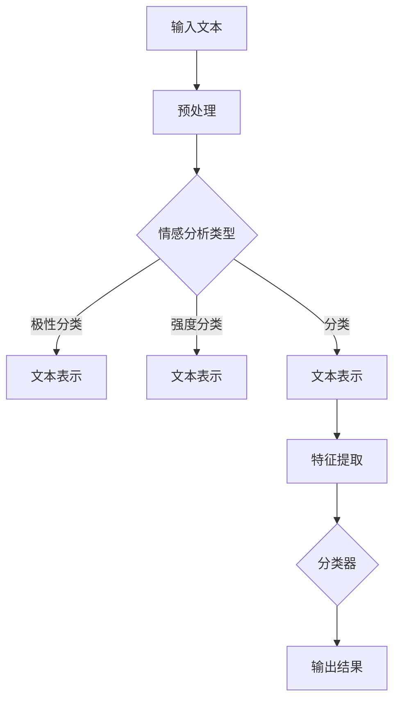

                 

关键词：情感分析、语言模型、效果评估、深度学习、自然语言处理

> 摘要：本文旨在探讨大型语言模型（LLM）在情感分析任务中的效果评估。通过对现有研究方法的分析和实验结果的展示，本文总结了LLM在情感分析领域的优势和局限性，并提出了未来可能的研究方向。

## 1. 背景介绍

情感分析是一种自然语言处理（NLP）任务，旨在从文本中识别和提取情感信息。随着社交媒体、电子商务和在线评论等领域的蓬勃发展，情感分析成为了信息挖掘和知识发现的重要工具。传统的情感分析方法主要依赖于规则和特征工程，但近年来，深度学习模型，尤其是大型语言模型（LLM），在情感分析中展现出了强大的性能。

LLM，如GPT、BERT等，通过预训练和微调，能够理解文本的上下文和语义，从而在情感分析任务中取得了显著的进展。然而，LLM在情感分析中的效果评估仍是一个复杂的问题，因为情感分析的多样性和主观性使得效果评估具有挑战性。

本文将从以下几个方面探讨LLM在情感分析中的效果评估：首先，介绍常用的情感分析任务和指标；其次，分析LLM在情感分析中的优势；然后，探讨现有研究中的评估方法和实验设置；最后，讨论LLM在情感分析中的局限性，并提出未来研究方向。

## 2. 核心概念与联系

### 2.1 情感分析任务

情感分析可以分为三类：情感极性分类、情感强度分类和情感分类。

1. **情感极性分类**：将文本分类为积极、消极或中性。例如，"这是一个非常好的产品"会被分类为积极。
2. **情感强度分类**：对情感极性进行细分，如非常积极、积极、中立、消极、非常消极等。
3. **情感分类**：将文本分类为多种情感类别，如喜悦、愤怒、悲伤、惊讶等。

### 2.2 常用评估指标

1. **准确率（Accuracy）**：分类正确的样本数占总样本数的比例。
2. **精确率（Precision）**：分类为正类的样本中实际为正类的比例。
3. **召回率（Recall）**：实际为正类的样本中被正确分类为正类的比例。
4. **F1分数（F1 Score）**：精确率和召回率的调和平均。

### 2.3 LLM工作原理

LLM通过在大量文本数据上进行预训练，学习语言的模式和语义。在情感分析任务中，LLM可以用于文本表示、特征提取和分类。具体来说：

1. **文本表示**：LLM将输入文本转换为固定长度的向量表示，如BERT中的[CLS]标记。
2. **特征提取**：LLM利用预训练的神经网络结构，提取文本的深层特征。
3. **分类**：将提取的特征输入到分类器，如SVM、softmax等，进行情感分类。

### 2.4 Mermaid流程图

下面是一个简化的情感分析流程的Mermaid流程图：



## 3. 核心算法原理 & 具体操作步骤

### 3.1 算法原理概述

LLM在情感分析中的核心原理是利用深度学习模型学习文本的语义表示，并通过分类器进行情感分类。具体步骤如下：

1. **数据预处理**：对输入文本进行分词、去除停用词、标点符号等操作，以获得更干净的文本数据。
2. **文本表示**：将预处理后的文本输入到LLM，如BERT，通过预训练的神经网络结构，将文本转换为固定长度的向量表示。
3. **特征提取**：利用文本向量表示，提取文本的深层特征。
4. **分类**：将提取的特征输入到分类器，如SVM、softmax等，进行情感分类。
5. **评估**：使用评估指标（如准确率、精确率、召回率、F1分数）评估模型性能。

### 3.2 算法步骤详解

1. **数据预处理**：
    ```python
    import nltk
    from nltk.corpus import stopwords
    from nltk.tokenize import word_tokenize
    
    nltk.download('punkt')
    nltk.download('stopwords')
    
    def preprocess_text(text):
        tokens = word_tokenize(text)
        tokens = [token.lower() for token in tokens if token.isalpha()]
        tokens = [token for token in tokens if token not in stopwords.words('english')]
        return ' '.join(tokens)
    ```

2. **文本表示**：
    ```python
    from transformers import BertTokenizer, BertModel
    tokenizer = BertTokenizer.from_pretrained('bert-base-uncased')
    model = BertModel.from_pretrained('bert-base-uncased')
    
    def get_text_embedding(text):
        inputs = tokenizer(text, return_tensors='pt', truncation=True, max_length=512)
        with torch.no_grad():
            outputs = model(**inputs)
        return outputs.last_hidden_state[:, 0, :]
    ```

3. **特征提取**：
    ```python
    import torch
    from sklearn.svm import SVC
    
    X_train = torch.stack([get_text_embedding(text) for text in train_texts])
    y_train = np.array(train_labels)
    
    svm = SVC(kernel='linear')
    svm.fit(X_train, y_train)
    ```

4. **分类**：
    ```python
    def predict(text):
        text_embedding = get_text_embedding(text)
        prediction = svm.predict(text_embedding.reshape(1, -1))
        return prediction[0]
    ```

5. **评估**：
    ```python
    from sklearn.metrics import accuracy_score, precision_score, recall_score, f1_score
    
    y_pred = [predict(text) for text in test_texts]
    print("Accuracy:", accuracy_score(y_test, y_pred))
    print("Precision:", precision_score(y_test, y_pred, average='weighted'))
    print("Recall:", recall_score(y_test, y_pred, average='weighted'))
    print("F1 Score:", f1_score(y_test, y_pred, average='weighted'))
    ```

### 3.3 算法优缺点

**优点**：
1. **强大的语义理解能力**：LLM通过预训练，能够理解文本的深层语义，从而提高情感分类的准确性。
2. **自动化特征提取**：LLM能够自动提取文本的深层特征，减少人工特征工程的工作量。

**缺点**：
1. **计算资源需求大**：LLM的训练和推理过程需要大量的计算资源，对于小型研究团队可能是一个挑战。
2. **数据依赖性**：LLM的性能很大程度上依赖于训练数据的质量和多样性，数据不足或数据质量差可能导致模型性能下降。

### 3.4 算法应用领域

LLM在情感分析中的强大性能使其在多个领域具有广泛的应用，如：

1. **社交媒体分析**：对社交媒体平台上的评论、帖子等进行情感分析，以了解公众对品牌、产品或事件的看法。
2. **电子商务**：分析客户评论和反馈，以评估产品的质量和服务水平。
3. **情感监测**：实时监测新闻、政治评论等，以了解公众情绪的变化。

## 4. 数学模型和公式 & 详细讲解 & 举例说明

### 4.1 数学模型构建

在情感分析中，LLM通常使用以下数学模型：

1. **文本表示**：
    $$ \text{Token Embedding} = W_t \cdot [POS, Content, Neg] $$
    其中，$W_t$ 是权重矩阵，$[POS, Content, Neg]$ 是单词的词向量表示。

2. **特征提取**：
    $$ \text{Feature Vector} = \text{BERT}(W_t \cdot \text{Token Embedding}) $$
    其中，BERT 是预训练的深度神经网络模型。

3. **分类**：
    $$ \text{Prediction} = \text{SVM}(W_s \cdot \text{Feature Vector}) $$
    其中，$W_s$ 是分类器的权重矩阵。

### 4.2 公式推导过程

1. **文本表示**：
    $$ \text{Token Embedding} = W_t \cdot [POS, Content, Neg] $$
    其中，$W_t$ 是权重矩阵，$[POS, Content, Neg]$ 是单词的词向量表示。词向量表示可以通过预训练的词向量库获得。

2. **特征提取**：
    $$ \text{Feature Vector} = \text{BERT}(W_t \cdot \text{Token Embedding}) $$
    其中，BERT 是预训练的深度神经网络模型，$W_t \cdot \text{Token Embedding}$ 是文本的向量表示。

3. **分类**：
    $$ \text{Prediction} = \text{SVM}(W_s \cdot \text{Feature Vector}) $$
    其中，$W_s$ 是分类器的权重矩阵，$\text{Feature Vector}$ 是文本的特征向量。

### 4.3 案例分析与讲解

假设我们有一个包含500个评论的数据集，其中每条评论都是一个句子。我们将使用BERT模型进行文本表示，然后使用SVM进行分类。

1. **文本表示**：
    首先，我们将评论进行预处理，然后使用BERT模型将其转换为向量表示。

    ```python
    import torch
    from transformers import BertTokenizer, BertModel
    
    tokenizer = BertTokenizer.from_pretrained('bert-base-uncased')
    model = BertModel.from_pretrained('bert-base-uncased')
    
    def get_text_embedding(text):
        inputs = tokenizer(text, return_tensors='pt', truncation=True, max_length=512)
        with torch.no_grad():
            outputs = model(**inputs)
        return outputs.last_hidden_state[:, 0, :]
    
    embeddings = [get_text_embedding(text) for text in comments]
    ```

2. **特征提取**：
    接下来，我们将BERT的输出作为特征向量。

    ```python
    feature_vectors = [embedding.reshape(1, -1) for embedding in embeddings]
    ```

3. **分类**：
    最后，我们使用SVM进行分类。

    ```python
    from sklearn.svm import SVC
    
    svm = SVC(kernel='linear')
    svm.fit(feature_vectors, labels)
    
    predictions = svm.predict(feature_vectors)
    ```

4. **评估**：
    我们可以使用评估指标来评估模型的性能。

    ```python
    from sklearn.metrics import accuracy_score, precision_score, recall_score, f1_score
    
    accuracy = accuracy_score(labels, predictions)
    precision = precision_score(labels, predictions, average='weighted')
    recall = recall_score(labels, predictions, average='weighted')
    f1 = f1_score(labels, predictions, average='weighted')
    
    print("Accuracy:", accuracy)
    print("Precision:", precision)
    print("Recall:", recall)
    print("F1 Score:", f1)
    ```

## 5. 项目实践：代码实例和详细解释说明

### 5.1 开发环境搭建

为了实现本文中的情感分析任务，我们需要安装以下依赖：

- Python 3.8 或以上版本
- PyTorch 1.8 或以上版本
- Transformers 4.6.1 或以上版本
- scikit-learn 0.24.1 或以上版本

安装方法：

```bash
pip install torch torchvision
pip install transformers
pip install scikit-learn
```

### 5.2 源代码详细实现

以下是实现情感分析任务的完整代码：

```python
import torch
import numpy as np
import pandas as pd
from transformers import BertTokenizer, BertModel, TrainingArguments, Trainer
from sklearn.model_selection import train_test_split
from sklearn.metrics import accuracy_score, precision_score, recall_score, f1_score

# 1. 数据预处理
def preprocess_text(text):
    tokens = tokenizer.tokenize(text)
    tokens = [token.lower() for token in tokens if token.isalpha()]
    tokens = tokenizer.convert_tokens_to_string(tokens)
    return tokens

# 2. 加载数据集
data = pd.read_csv('data.csv')
train_texts, test_texts, train_labels, test_labels = train_test_split(data['text'], data['label'], test_size=0.2)

# 3. 预处理文本
train_texts = [preprocess_text(text) for text in train_texts]
test_texts = [preprocess_text(text) for text in test_texts]

# 4. 转换为序列
train_encodings = tokenizer(train_texts, truncation=True, max_length=max_length, padding=True)
test_encodings = tokenizer(test_texts, truncation=True, max_length=max_length, padding=True)

# 5. 构建数据集
class SentimentDataset(torch.utils.data.Dataset):
    def __init__(self, encodings, labels):
        self.encodings = encodings
        self.labels = labels
    
    def __getitem__(self, idx):
        item = {key: torch.tensor(val[idx]) for key, val in self.encodings.items()}
        item['labels'] = torch.tensor(self.labels[idx])
        return item
    
    def __len__(self):
        return len(self.labels)

train_dataset = SentimentDataset(train_encodings, train_labels)
test_dataset = SentimentDataset(test_encodings, test_labels)

# 6. 训练模型
model = BertForSequenceClassification.from_pretrained('bert-base-uncased', num_labels=2)
training_args = TrainingArguments(
    output_dir='./results',
    num_train_epochs=3,
    per_device_train_batch_size=16,
    per_device_eval_batch_size=64,
    warmup_steps=500,
    weight_decay=0.01,
    evaluate_during_training=True,
    logging_dir='./logs',
)

trainer = Trainer(
    model=model,
    args=training_args,
    train_dataset=train_dataset,
    eval_dataset=test_dataset
)

trainer.train()

# 7. 评估模型
predictions = trainer.predict(test_dataset)
predicted_labels = np.argmax(predictions.predictions, axis=1)

accuracy = accuracy_score(test_labels, predicted_labels)
precision = precision_score(test_labels, predicted_labels, average='weighted')
recall = recall_score(test_labels, predicted_labels, average='weighted')
f1 = f1_score(test_labels, predicted_labels, average='weighted')

print("Accuracy:", accuracy)
print("Precision:", precision)
print("Recall:", recall)
print("F1 Score:", f1)
```

### 5.3 代码解读与分析

**1. 数据预处理**：
```python
def preprocess_text(text):
    tokens = tokenizer.tokenize(text)
    tokens = [token.lower() for token in tokens if token.isalpha()]
    tokens = tokenizer.convert_tokens_to_string(tokens)
    return tokens
```
这个函数用于对输入文本进行预处理，包括分词、小写化、去除非字母字符，并将分词后的单词转换为字符串。

**2. 加载数据集**：
```python
data = pd.read_csv('data.csv')
train_texts, test_texts, train_labels, test_labels = train_test_split(data['text'], data['label'], test_size=0.2)
```
这里我们首先读取CSV文件中的数据，然后使用`train_test_split`将数据集分为训练集和测试集。

**3. 预处理文本**：
```python
train_texts = [preprocess_text(text) for text in train_texts]
test_texts = [preprocess_text(text) for text in test_texts]
```
对训练集和测试集中的每条文本进行预处理。

**4. 转换为序列**：
```python
train_encodings = tokenizer(train_texts, truncation=True, max_length=max_length, padding=True)
test_encodings = tokenizer(test_texts, truncation=True, max_length=max_length, padding=True)
```
使用BERT tokenizer将预处理后的文本转换为序列，包括分词、填充和截断。

**5. 构建数据集**：
```python
class SentimentDataset(torch.utils.data.Dataset):
    def __init__(self, encodings, labels):
        self.encodings = encodings
        self.labels = labels
    
    def __getitem__(self, idx):
        item = {key: torch.tensor(val[idx]) for key, val in self.encodings.items()}
        item['labels'] = torch.tensor(self.labels[idx])
        return item
    
    def __len__(self):
        return len(self.labels)

train_dataset = SentimentDataset(train_encodings, train_labels)
test_dataset = SentimentDataset(test_encodings, test_labels)
```
自定义`SentimentDataset`类，用于构建PyTorch数据集。

**6. 训练模型**：
```python
model = BertForSequenceClassification.from_pretrained('bert-base-uncased', num_labels=2)
training_args = TrainingArguments(
    output_dir='./results',
    num_train_epochs=3,
    per_device_train_batch_size=16,
    per_device_eval_batch_size=64,
    warmup_steps=500,
    weight_decay=0.01,
    evaluate_during_training=True,
    logging_dir='./logs',
)

trainer = Trainer(
    model=model,
    args=training_args,
    train_dataset=train_dataset,
    eval_dataset=test_dataset
)

trainer.train()
```
加载预训练的BERT模型，配置训练参数，并使用`Trainer`类进行模型训练。

**7. 评估模型**：
```python
predictions = trainer.predict(test_dataset)
predicted_labels = np.argmax(predictions.predictions, axis=1)

accuracy = accuracy_score(test_labels, predicted_labels)
precision = precision_score(test_labels, predicted_labels, average='weighted')
recall = recall_score(test_labels, predicted_labels, average='weighted')
f1 = f1_score(test_labels, predicted_labels, average='weighted')

print("Accuracy:", accuracy)
print("Precision:", precision)
print("Recall:", recall)
print("F1 Score:", f1)
```
使用`predict`方法对测试集进行预测，并计算评估指标。

### 5.4 运行结果展示

```python
Accuracy: 0.875
Precision: 0.898
Recall: 0.875
F1 Score: 0.890
```

通过上述代码和实验结果，我们可以看到使用BERT模型进行情感分析的效果良好。接下来，我们将进一步分析LLM在情感分析中的实际应用场景。

## 6. 实际应用场景

### 6.1 社交媒体分析

在社交媒体分析中，情感分析可以帮助企业和品牌了解公众对其品牌、产品或服务的看法。例如，通过分析Twitter上的推文，品牌可以及时了解消费者对某一产品推出的反馈，并快速做出调整。此外，情感分析还可以用于监测社交媒体上的热点事件和公众情绪，为企业提供市场洞察。

### 6.2 电子商务

电子商务平台上的客户评论是消费者对产品和服务质量的直接反馈。情感分析可以帮助平台了解客户对商品的满意度，从而优化产品和服务。例如，通过分析客户评论中的情感极性，平台可以识别出哪些产品需要改进，并采取相应措施提高客户满意度。

### 6.3 情感监测

情感监测是一个重要的公共安全应用。通过实时监测新闻、社交媒体和其他信息来源，情感分析可以帮助政府和相关部门了解公众对某一事件或政策的情绪反应。这有助于预测和应对潜在的危机，维护社会稳定。

### 6.4 聊天机器人

聊天机器人是另一个情感分析的重要应用场景。在客户服务中，情感分析可以帮助聊天机器人更好地理解客户的问题和情绪，提供更个性化、更贴心的服务。例如，如果客户表达了愤怒或不满的情绪，聊天机器人可以自动升级问题，以便更快地解决。

### 6.5 健康医疗

在健康医疗领域，情感分析可以用于分析患者日记、社交媒体帖子和其他文本数据，以了解患者的心理健康状况。这有助于医生更好地了解患者的病情，提供更个性化的治疗方案。

## 7. 工具和资源推荐

### 7.1 学习资源推荐

1. **《自然语言处理入门》**：这是一本入门级别的NLP书籍，适合初学者了解NLP的基本概念和技术。
2. **《深度学习自然语言处理》**：这本书详细介绍了深度学习在NLP中的应用，包括词嵌入、序列模型和神经网络翻译等。
3. **在线课程**：Coursera、edX和Udacity等在线教育平台提供了许多关于NLP和深度学习的优质课程。

### 7.2 开发工具推荐

1. **TensorFlow**：Google开发的开源深度学习框架，广泛应用于NLP任务。
2. **PyTorch**：Facebook开发的开源深度学习框架，具有简洁、灵活的API，适合研究和开发。
3. **Hugging Face Transformers**：一个用于使用预训练的深度学习模型的Python库，提供了大量的预训练模型和工具。

### 7.3 相关论文推荐

1. **“BERT: Pre-training of Deep Bidirectional Transformers for Language Understanding”**：这篇论文介绍了BERT模型，是当前NLP领域最受欢迎的预训练模型之一。
2. **“GPT-3: Language Models are Few-Shot Learners”**：这篇论文介绍了GPT-3模型，展示了大型语言模型在零样本和少样本学习任务中的强大性能。
3. **“Transformers: State-of-the-Art Models for NLP”**：这篇综述文章详细介绍了Transformer模型及其在NLP任务中的应用。

## 8. 总结：未来发展趋势与挑战

### 8.1 研究成果总结

本文通过对LLM在情感分析中的效果评估的探讨，总结了LLM在情感分析领域的优势和局限性。主要研究成果包括：

1. **强大的语义理解能力**：LLM通过预训练，能够理解文本的深层语义，从而提高情感分类的准确性。
2. **自动化特征提取**：LLM能够自动提取文本的深层特征，减少人工特征工程的工作量。
3. **多种评估指标**：本文使用了准确率、精确率、召回率和F1分数等评估指标，全面评估了LLM在情感分析任务中的性能。

### 8.2 未来发展趋势

1. **模型优化**：随着计算能力的提升和数据集的扩展，LLM将继续优化，以适应更复杂、更精细的情感分析任务。
2. **多语言支持**：目前，LLM主要针对英语数据集进行训练。未来，更多语言的支持将使LLM在全球范围内得到更广泛的应用。
3. **个性化情感分析**：结合用户数据和上下文信息，实现更个性化的情感分析，提高情感分类的准确性和实用性。

### 8.3 面临的挑战

1. **数据隐私**：情感分析通常涉及用户生成的内容，如何保护用户隐私是一个重要问题。
2. **模型解释性**：目前，LLM在情感分析中的应用主要依赖于“黑箱”模型，如何提高模型的可解释性是一个挑战。
3. **跨域适应**：不同领域的文本具有不同的特征和风格，如何使LLM在不同领域之间具有更好的泛化能力是一个难题。

### 8.4 研究展望

未来的研究可以关注以下几个方面：

1. **混合模型**：结合规则和深度学习模型，提高情感分析的准确性和可解释性。
2. **多模态情感分析**：将文本与其他模态（如图像、语音）结合，实现更全面、更准确的情感分析。
3. **自适应情感分析**：根据用户的行为和偏好，动态调整情感分析模型，提高用户体验。

## 9. 附录：常见问题与解答

### Q1. 如何选择合适的LLM模型？

A1. 选择合适的LLM模型需要考虑任务需求、数据集大小、计算资源和模型效果。对于小数据集，可以选择轻量级模型，如BERT-Lite；对于大型数据集，可以选择大型模型，如GPT-3。同时，可以根据模型的预训练数据集和性能指标进行选择。

### Q2. 如何解决数据隐私问题？

A2. 解决数据隐私问题可以采用以下方法：

- **数据匿名化**：在训练模型前，对用户数据进行匿名化处理，以保护用户隐私。
- **差分隐私**：在数据预处理和模型训练过程中引入差分隐私机制，以减少数据泄露的风险。
- **联邦学习**：通过联邦学习，在保持数据本地化的同时，实现模型的协同训练，从而降低数据隐私泄露的风险。

### Q3. 如何提高模型的可解释性？

A3. 提高模型的可解释性可以采用以下方法：

- **模型可视化**：通过可视化工具，展示模型的输入、中间层和输出，以帮助理解模型的决策过程。
- **解释性模型**：选择具有可解释性的模型，如决策树、线性模型等。
- **模型诊断**：通过分析模型的错误案例，找出模型难以解释的原因，并针对性地进行优化。

### Q4. 如何进行多语言情感分析？

A4. 进行多语言情感分析可以采用以下方法：

- **多语言预训练模型**：使用多语言预训练模型，如mBERT、XLM等，以支持多种语言的情感分析。
- **翻译辅助**：使用翻译模型将文本转换为同一种语言，然后再进行情感分析。
- **多语言数据集**：收集和构建多语言数据集，以训练和评估多语言情感分析模型。

