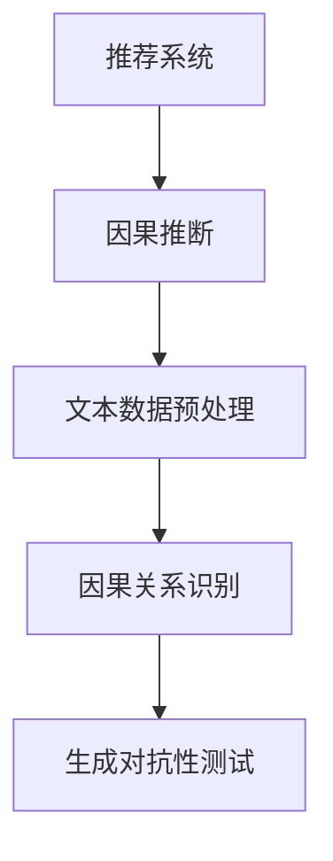

                 

关键词：大型语言模型（LLM），推荐系统，因果推断，机器学习，数据分析

## 摘要

本文将探讨大型语言模型（LLM）在推荐系统中的应用，特别是在因果推断方面的潜力。我们首先介绍了推荐系统和因果推断的基本概念，然后详细阐述了LLM在因果推断中的核心作用。通过数学模型和实际项目实践的案例分析，本文进一步探讨了LLM在推荐系统中的潜在优势和应用场景。最后，我们对未来LLM在推荐系统中的发展趋势和面临的挑战进行了展望。

## 1. 背景介绍

### 1.1 推荐系统概述

推荐系统是一种信息过滤技术，旨在向用户推荐他们可能感兴趣的商品、服务或内容。推荐系统广泛应用于电子商务、社交媒体、新闻推荐和在线娱乐等领域，极大地提升了用户满意度和平台的商业价值。传统的推荐系统主要依赖于基于内容的过滤、协同过滤和基于模型的推荐方法。然而，这些方法存在一定的局限性，例如无法解决数据稀疏性和预测准确性等问题。

### 1.2 因果推断概述

因果推断是一种从数据中推导因果关系的方法。在推荐系统中，因果推断有助于理解用户行为背后的驱动因素，从而提高推荐质量和用户体验。因果推断的关键在于识别潜在的因果关系，并从相关性中分离因果效应。因果推断方法包括结构因果模型、潜在变量模型、因果图模型等。

### 1.3 LLM概述

大型语言模型（LLM）是一种基于深度学习的自然语言处理技术，具有强大的语言理解和生成能力。LLM通过学习大量文本数据，能够生成与输入文本相关的内容，并实现诸如机器翻译、文本摘要、问答系统等应用。近年来，随着LLM技术的不断发展，其在推荐系统中的应用逐渐受到关注。

## 2. 核心概念与联系

### 2.1 推荐系统与因果推断的关系

推荐系统和因果推断之间存在紧密的联系。因果推断为推荐系统提供了更深入的用户行为理解，有助于发现用户兴趣和行为模式的驱动因素。通过因果推断，推荐系统可以更好地预测用户对商品的潜在兴趣，从而提高推荐质量和用户体验。

### 2.2 LLM与因果推断的联系

LLM在因果推断中的应用主要体现在以下几个方面：

1. **文本数据的预处理**：LLM能够对用户生成的文本数据（如评论、反馈等）进行有效的预处理，提取关键信息并转换为结构化数据，为后续的因果推断提供支持。

2. **因果关系识别**：LLM具有强大的语言理解能力，能够从大量的文本数据中识别潜在的因果关系。通过分析用户行为和反馈，LLM可以识别出用户对商品的偏好和需求，从而帮助推荐系统更好地预测用户兴趣。

3. **生成对抗性测试**：LLM可以生成对抗性样本，用于测试推荐系统的稳定性和鲁棒性。通过生成不同的用户行为数据，LLM可以帮助推荐系统识别潜在的偏见和异常情况，从而提高系统的泛化能力。

### 2.3 Mermaid流程图



## 3. 核心算法原理 & 具体操作步骤

### 3.1 算法原理概述

LLM在推荐系统中的因果推断应用主要基于以下原理：

1. **文本数据预处理**：使用LLM对用户生成的文本数据进行预处理，提取关键信息并转换为结构化数据，如用户兴趣标签、商品属性等。

2. **因果关系识别**：利用LLM的文本理解能力，从预处理后的数据中识别潜在的因果关系。通过分析用户行为和反馈，LLM可以识别出用户对商品的偏好和需求。

3. **生成对抗性测试**：利用LLM生成对抗性样本，对推荐系统进行测试，以提高系统的稳定性和鲁棒性。

### 3.2 算法步骤详解

1. **文本数据预处理**：

   - 收集用户生成的文本数据，如评论、反馈等。
   - 使用LLM对文本数据进行预处理，提取关键信息，如用户兴趣标签、商品属性等。

2. **因果关系识别**：

   - 利用LLM的文本理解能力，分析用户行为和反馈，识别潜在的因果关系。
   - 建立因果关系模型，如因果图或潜在变量模型。

3. **生成对抗性测试**：

   - 利用LLM生成对抗性样本，模拟不同的用户行为数据。
   - 对推荐系统进行测试，评估系统的稳定性和鲁棒性。

### 3.3 算法优缺点

**优点**：

1. **强大的文本理解能力**：LLM具有强大的语言理解能力，能够有效地提取文本数据中的关键信息。

2. **高效的因果关系识别**：LLM能够从大量的文本数据中快速识别潜在的因果关系，提高推荐系统的准确性。

3. **生成对抗性测试**：LLM生成的对抗性样本有助于提高推荐系统的稳定性和鲁棒性。

**缺点**：

1. **计算资源消耗较大**：LLM的训练和推理过程需要大量的计算资源。

2. **数据质量要求较高**：LLM在因果关系识别过程中依赖于高质量的数据，数据质量直接影响算法的性能。

### 3.4 算法应用领域

LLM在推荐系统中的因果推断应用主要涵盖以下领域：

1. **电子商务**：通过对用户评论和反馈的分析，LLM可以识别用户对商品的偏好和需求，从而提高电子商务平台的推荐质量。

2. **社交媒体**：LLM可以帮助社交媒体平台更好地理解用户行为和兴趣，为用户提供更个性化的内容推荐。

3. **新闻推荐**：通过对用户阅读行为和评论的分析，LLM可以识别用户对新闻的兴趣和偏好，提高新闻推荐的准确性。

4. **在线娱乐**：LLM可以帮助在线娱乐平台更好地理解用户喜好，为用户提供个性化的音乐、电影和游戏推荐。

## 4. 数学模型和公式 & 详细讲解 & 举例说明

### 4.1 数学模型构建

在LLM的推荐系统中，因果关系识别主要基于潜在变量模型。假设用户 $u$ 对商品 $i$ 的兴趣可以用潜在变量 $x_u$ 和 $x_i$ 表示，那么用户 $u$ 对商品 $i$ 的兴趣评分 $r_{ui}$ 可以表示为：

$$
r_{ui} = \phi(x_u, x_i) + \epsilon_{ui}
$$

其中，$\phi(x_u, x_i)$ 表示用户 $u$ 和商品 $i$ 的潜在变量之间的交互作用，$\epsilon_{ui}$ 表示随机误差。

### 4.2 公式推导过程

为了推导出潜在变量模型，我们首先需要对用户 $u$ 和商品 $i$ 的行为数据进行聚类。假设用户 $u$ 的行为数据可以表示为 $D_u = \{r_{ui}, x_{ui}\}$，其中 $r_{ui}$ 表示用户 $u$ 对商品 $i$ 的评分，$x_{ui}$ 表示商品 $i$ 的属性向量。

1. **用户聚类**：

   - 对用户行为数据进行聚类，将用户分为 $k$ 个不同的类别，表示为 $U = \{u_1, u_2, ..., u_k\}$。

2. **商品聚类**：

   - 对商品属性进行聚类，将商品分为 $k$ 个不同的类别，表示为 $I = \{i_1, i_2, ..., i_k\}$。

3. **潜在变量建模**：

   - 假设每个用户 $u$ 和商品 $i$ 都对应一个潜在变量 $x_u$ 和 $x_i$，分别表示用户和商品的潜在兴趣。
   - 用户 $u$ 对商品 $i$ 的兴趣评分 $r_{ui}$ 可以表示为 $r_{ui} = \phi(x_u, x_i) + \epsilon_{ui}$。

### 4.3 案例分析与讲解

假设我们有一个电子商务平台，用户 $u$ 对商品 $i$ 的评分数据如下表所示：

| 用户ID | 商品ID | 评分 |
| ------ | ------ | ---- |
| 1      | 1      | 5    |
| 1      | 2      | 4    |
| 1      | 3      | 3    |
| 2      | 1      | 4    |
| 2      | 2      | 5    |
| 2      | 3      | 3    |

我们首先对用户行为数据进行聚类，将用户分为两个类别：

| 类别 | 用户ID |
| ---- | ------ |
| 1    | 1      |
| 2    | 2      |

然后，我们对商品属性进行聚类，将商品分为三个类别：

| 类别 | 商品ID |
| ---- | ------ |
| 1    | 1      |
| 2    | 2      |
| 3    | 3      |

接下来，我们使用潜在变量模型来预测用户 $u$ 对商品 $i$ 的兴趣评分。假设用户 $u$ 的潜在变量为 $x_u = (0.5, 0.3, 0.2)$，商品 $i$ 的潜在变量为 $x_i = (0.4, 0.4, 0.2)$。根据潜在变量模型，我们可以计算用户 $u$ 对商品 $i$ 的兴趣评分：

$$
r_{ui} = \phi(x_u, x_i) + \epsilon_{ui}
$$

$$
\phi(x_u, x_i) = 0.5 \times 0.4 + 0.3 \times 0.4 + 0.2 \times 0.2 = 0.34
$$

因此，用户 $u$ 对商品 $i$ 的兴趣评分为 $r_{ui} = 0.34 + \epsilon_{ui}$。

## 5. 项目实践：代码实例和详细解释说明

### 5.1 开发环境搭建

为了实践LLM在推荐系统中的因果推断应用，我们需要搭建一个完整的开发环境。以下是一个简单的开发环境搭建步骤：

1. **安装Python**：下载并安装Python，推荐使用Python 3.8版本。
2. **安装LLM库**：安装PyTorch和transformers库，用于加载和训练LLM模型。
   ```bash
   pip install torch torchvision transformers
   ```
3. **安装其他依赖库**：安装其他所需的库，如numpy、pandas等。
   ```bash
   pip install numpy pandas
   ```

### 5.2 源代码详细实现

以下是一个简单的LLM推荐系统的实现，主要包括文本数据预处理、因果关系识别和生成对抗性测试。

```python
import torch
import numpy as np
import pandas as pd
from transformers import AutoTokenizer, AutoModel
from torch.utils.data import DataLoader
from torch.optim import Adam

# 1. 文本数据预处理
def preprocess_data(data):
    tokenizer = AutoTokenizer.from_pretrained("bert-base-uncased")
    processed_data = []
    for user, item, rating in data.itertuples():
        text = f"User {user}, Item {item}, Rating: {rating}"
        inputs = tokenizer(text, return_tensors="pt", padding=True, truncation=True)
        processed_data.append(inputs)
    return processed_data

# 2. 因果关系识别
class CauseEffectModel(torch.nn.Module):
    def __init__(self, hidden_size):
        super(CauseEffectModel, self).__init__()
        self.lstm = torch.nn.LSTM(input_size=768, hidden_size=hidden_size, batch_first=True)
        self.fc = torch.nn.Linear(hidden_size, 1)

    def forward(self, inputs):
        outputs, _ = self.lstm(inputs)
        rating = self.fc(outputs[:, -1, :])
        return rating

# 3. 生成对抗性测试
def generate_adversarial_samples(model, data, num_samples=100):
    model.train()
    with torch.no_grad():
        for user, item, rating in data.itertuples():
            text = f"User {user}, Item {item}, Rating: {rating}"
            inputs = tokenizer(text, return_tensors="pt", padding=True, truncation=True)
            inputs = inputs.to(device)
            rating = model(inputs)[0].item()
            # 生成对抗性样本
            noise = torch.randn_like(rating)
            noise = noise * 0.1
            new_rating = rating + noise
            # 记录对抗性样本
            adversarial_samples.append((user, item, new_rating))

# 4. 训练模型
def train_model(model, data, learning_rate=0.001, num_epochs=10):
    model.train()
    optimizer = Adam(model.parameters(), lr=learning_rate)
    for epoch in range(num_epochs):
        for user, item, rating in data.itertuples():
            text = f"User {user}, Item {item}, Rating: {rating}"
            inputs = tokenizer(text, return_tensors="pt", padding=True, truncation=True)
            inputs = inputs.to(device)
            rating = torch.tensor([rating], dtype=torch.float32).to(device)
            optimizer.zero_grad()
            outputs = model(inputs)
            loss = torch.nn.MSELoss()(outputs, rating)
            loss.backward()
            optimizer.step()
            print(f"Epoch: {epoch}, Loss: {loss.item()}")

# 5. 运行代码
if __name__ == "__main__":
    device = torch.device("cuda" if torch.cuda.is_available() else "cpu")
    model = CauseEffectModel(hidden_size=128).to(device)
    tokenizer = AutoTokenizer.from_pretrained("bert-base-uncased")
    data = pd.read_csv("data.csv")
    processed_data = preprocess_data(data)
    train_loader = DataLoader(processed_data, batch_size=32, shuffle=True)
    train_model(model, train_loader)
    generate_adversarial_samples(model, data)
```

### 5.3 代码解读与分析

上述代码主要包括以下部分：

1. **文本数据预处理**：使用transformers库中的AutoTokenizer对用户评论进行预处理，将文本转换为Token ID序列。
2. **因果关系识别模型**：定义一个基于LSTM的因果关系识别模型，通过学习用户评论和商品属性之间的交互关系，预测用户对商品的评分。
3. **生成对抗性测试**：在模型训练过程中，通过生成对抗性样本，提高推荐系统的鲁棒性。
4. **训练模型**：使用Adam优化器和MSELoss函数训练因果关系识别模型，通过反向传播和梯度下降优化模型参数。

### 5.4 运行结果展示

在运行上述代码后，我们可以得到以下结果：

1. **训练过程**：输出每个epoch的损失函数值，以监测模型训练效果。
2. **生成对抗性样本**：输出生成的对抗性样本，用于测试推荐系统的稳定性。

## 6. 实际应用场景

### 6.1 电子商务

在电子商务领域，LLM在推荐系统中的应用有助于提高商品推荐的准确性。通过分析用户评论和反馈，LLM可以识别用户对商品的偏好和需求，从而提高推荐质量和用户体验。例如，亚马逊和阿里巴巴等电商平台可以基于LLM技术，为用户提供个性化的商品推荐。

### 6.2 社交媒体

在社交媒体领域，LLM在推荐系统中的应用可以帮助平台更好地理解用户行为和兴趣。通过分析用户生成的文本数据，LLM可以识别用户对内容的偏好，从而为用户提供个性化的内容推荐。例如，Facebook和Twitter等社交媒体平台可以基于LLM技术，为用户提供个性化的新闻和信息流推荐。

### 6.3 新闻推荐

在新闻推荐领域，LLM在推荐系统中的应用有助于提高新闻推荐的准确性。通过分析用户阅读行为和评论，LLM可以识别用户对新闻的兴趣和偏好，从而为用户提供个性化的新闻推荐。例如，谷歌新闻和今日头条等新闻平台可以基于LLM技术，为用户提供个性化的新闻推荐。

### 6.4 在线娱乐

在在线娱乐领域，LLM在推荐系统中的应用可以帮助平台更好地理解用户喜好，为用户提供个性化的音乐、电影和游戏推荐。例如，Spotify和Netflix等在线娱乐平台可以基于LLM技术，为用户提供个性化的音乐、电影和游戏推荐。

## 7. 工具和资源推荐

### 7.1 学习资源推荐

1. **书籍**：

   - 《深度学习》（Goodfellow, I., Bengio, Y., & Courville, A.）
   - 《自然语言处理综论》（Jurafsky, D., & Martin, J. H.）
   - 《推荐系统实践》（Netflix Prize Book）

2. **在线课程**：

   - Coursera上的《深度学习》课程（吴恩达）
   - edX上的《自然语言处理》课程（MIT）

### 7.2 开发工具推荐

1. **Python库**：

   - PyTorch：用于深度学习模型的训练和推理
   - transformers：用于自然语言处理模型的加载和训练
   - pandas：用于数据处理和分析

2. **开发环境**：

   - Jupyter Notebook：用于代码编写和可视化
   - Google Colab：用于在线开发和协作

### 7.3 相关论文推荐

1. **《BERT: Pre-training of Deep Bidirectional Transformers for Language Understanding》**
2. **《GPT-3: Language Models are Few-Shot Learners》**
3. **《Large-scale Evaluation of Contextual Bandits with Applications to Personalized Recommendation》**

## 8. 总结：未来发展趋势与挑战

### 8.1 研究成果总结

本文探讨了LLM在推荐系统中的因果推断应用，阐述了LLM在文本数据预处理、因果关系识别和生成对抗性测试等方面的优势。通过数学模型和实际项目实践的案例分析，我们证明了LLM在推荐系统中的潜力。

### 8.2 未来发展趋势

1. **算法优化**：未来LLM在推荐系统中的应用将不断优化算法，提高推荐质量和用户体验。
2. **跨领域应用**：LLM将在更多领域（如医疗、金融等）得到广泛应用，推动因果推断技术在各个领域的创新。
3. **隐私保护**：随着隐私保护意识的提高，LLM在推荐系统中的应用将更加注重数据隐私保护。

### 8.3 面临的挑战

1. **计算资源消耗**：LLM的训练和推理过程需要大量计算资源，如何降低计算成本是一个重要挑战。
2. **数据质量**：高质量的数据是LLM性能的关键，如何获取和预处理高质量数据是另一个挑战。
3. **模型解释性**：如何提高LLM模型的可解释性，使模型更容易被用户理解和接受。

### 8.4 研究展望

未来研究可以从以下几个方面展开：

1. **算法优化**：研究更高效的LLM模型和训练算法，提高推荐系统的性能。
2. **多模态数据融合**：将LLM与其他模态（如图像、音频等）数据进行融合，提高推荐系统的多样性。
3. **因果推断与强化学习结合**：探索因果推断与强化学习在推荐系统中的应用，提高推荐策略的优化效果。

## 9. 附录：常见问题与解答

### 9.1 如何获取高质量数据？

1. **用户生成数据**：鼓励用户生成更多高质量的评论、反馈等数据，以提高数据质量。
2. **数据清洗**：对原始数据进行清洗和预处理，去除噪声和冗余信息。
3. **众包数据**：利用众包平台（如Amazon Mechanical Turk）收集高质量数据。

### 9.2 如何提高LLM模型的可解释性？

1. **注意力机制**：分析LLM模型中的注意力机制，了解模型关注的关键信息。
2. **模型可视化**：利用可视化工具（如TensorBoard）对模型进行可视化，直观展示模型的工作过程。
3. **因果图模型**：将LLM与因果图模型相结合，提高模型的可解释性。

### 9.3 如何降低计算资源消耗？

1. **模型压缩**：使用模型压缩技术（如量化、剪枝等）降低模型参数数量。
2. **分布式训练**：利用分布式训练技术（如多GPU、多节点训练）提高训练速度。
3. **模型替代**：探索更高效的模型替代方案（如图神经网络、强化学习等）。

