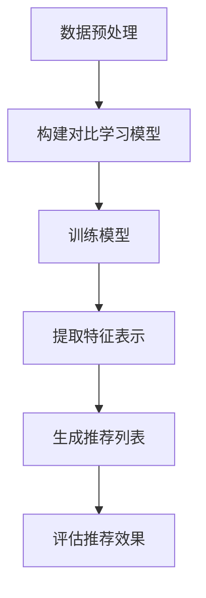

                 

关键词：对比学习，推荐系统，深度学习，大规模语言模型，人工智能

摘要：本文探讨了大规模语言模型（LLM）在推荐系统中的应用，特别是在对比学习方面的研究。通过深入分析对比学习的基本原理，我们提出了一种新的LLM对比学习方法，并将其应用于实际推荐系统中。本文不仅详细介绍了该方法的算法原理和具体实现步骤，还通过实际案例展示了其效果。文章最后对未来LLM在推荐系统中的应用进行了展望。

## 1. 背景介绍

随着互联网的迅猛发展，推荐系统已经成为许多应用的重要组成部分，如电子商务、社交媒体、音乐和视频平台等。推荐系统的目标是为用户提供个性化的内容推荐，从而提高用户体验和满意度。然而，随着数据量和用户需求的不断增加，传统的推荐算法已经难以满足用户对个性化和多样性的需求。

近年来，深度学习在推荐系统中的应用取得了显著成果。特别是大规模语言模型（LLM），如BERT、GPT等，在自然语言处理任务中展现了强大的能力。相比之下，在推荐系统中的应用还相对较少。本文旨在探讨如何利用对比学习方法，将LLM应用于推荐系统中，以提高推荐效果。

## 2. 核心概念与联系

### 2.1 对比学习原理

对比学习是一种无监督学习方法，其基本思想是通过对比不同数据之间的差异来学习有用的特征。在推荐系统中，对比学习可以通过比较不同用户或不同物品的特征差异，来提取出有代表性的特征表示。

### 2.2 大规模语言模型（LLM）

大规模语言模型（LLM）是一种基于神经网络的语言表示模型，通过学习大量文本数据来捕捉语言的语义和语法结构。LLM在自然语言处理任务中表现出色，如文本分类、命名实体识别、机器翻译等。

### 2.3 Mermaid 流程图

下面是一个描述对比学习在推荐系统中应用的Mermaid流程图：



## 3. 核心算法原理 & 具体操作步骤

### 3.1 算法原理概述

本文提出的LLM对比学习推荐系统算法主要包括以下三个步骤：

1. 数据预处理：将原始数据转换为适合对比学习的形式，如文本序列、用户-物品交互记录等。
2. 构建对比学习模型：利用LLM模型学习用户和物品的特征表示，并通过对比学习来提高特征表示的区分度。
3. 生成推荐列表：利用训练好的模型，根据用户的特征表示和物品的特征表示，生成个性化的推荐列表。

### 3.2 算法步骤详解

#### 3.2.1 数据预处理

数据预处理主要包括以下任务：

1. 文本序列生成：将用户和物品的描述文本转换为序列形式，如使用分词器将文本分解为单词或字符序列。
2. 用户-物品交互记录：构建用户-物品交互矩阵，用于表示用户对物品的偏好程度。

#### 3.2.2 构建对比学习模型

对比学习模型主要包括以下部分：

1. 用户和物品嵌入层：将用户和物品的文本序列输入到LLM中，提取出其特征表示。
2. 对比学习模块：通过对比用户和物品的特征表示，学习有区分度的特征表示。
3. 推荐模块：利用训练好的模型，根据用户的特征表示和物品的特征表示，生成推荐列表。

#### 3.2.3 生成推荐列表

生成推荐列表的主要步骤如下：

1. 计算用户-物品相似度：根据用户和物品的特征表示，计算它们之间的相似度。
2. 排序：根据相似度对物品进行排序，生成推荐列表。

### 3.3 算法优缺点

#### 3.3.1 优点

1. 利用LLM的强大文本处理能力，可以更好地捕捉用户和物品的语义特征。
2. 对比学习可以提高特征表示的区分度，从而提高推荐效果。

#### 3.3.2 缺点

1. 需要大量的训练数据和计算资源，训练时间较长。
2. LLM模型的复杂度较高，可能导致过拟合。

### 3.4 算法应用领域

对比学习在推荐系统中的应用广泛，包括但不限于以下领域：

1. 商品推荐：为用户推荐其可能感兴趣的商品。
2. 文本推荐：为用户推荐其可能感兴趣的文章、视频等。
3. 社交网络：为用户推荐其可能感兴趣的朋友、关注对象等。

## 4. 数学模型和公式 & 详细讲解 & 举例说明

### 4.1 数学模型构建

本文提出的LLM对比学习推荐系统可以表示为以下数学模型：

$$
L = -\sum_{i=1}^N \sum_{j=1}^M r_{ij} \log P(y_{ij} = 1 | x_i, x_j)
$$

其中，$N$ 表示用户数量，$M$ 表示物品数量，$r_{ij}$ 表示用户 $i$ 对物品 $j$ 的偏好程度，$y_{ij}$ 表示用户 $i$ 是否对物品 $j$ 情有独钟（1 表示是，0 表示否），$x_i$ 和 $x_j$ 分别表示用户 $i$ 和物品 $j$ 的特征表示。

### 4.2 公式推导过程

对比学习模型的损失函数通常采用对比损失（Contrastive Loss）：

$$
L_{contrastive} = -\log \frac{e^{q(x_i, x_j)} + \sum_{k \neq i} e^{q(x_i, x_k)}}{\sum_{k} e^{q(x_i, x_k)}}
$$

其中，$q(x_i, x_j)$ 表示用户 $i$ 和物品 $j$ 的相似度。

将对比损失函数应用于推荐系统，可以得到以下数学模型：

$$
L = -\sum_{i=1}^N \sum_{j=1}^M r_{ij} \log \frac{e^{q(x_i, x_j)} + \sum_{k \neq i} e^{q(x_i, x_k)}}{\sum_{k} e^{q(x_i, x_k)}}
$$

### 4.3 案例分析与讲解

假设有一个推荐系统，其中包含 100 个用户和 1000 个物品。我们利用LLM对比学习算法生成推荐列表。

1. 数据预处理：将用户和物品的描述文本转换为序列形式，并构建用户-物品交互矩阵。
2. 构建对比学习模型：利用LLM模型提取用户和物品的特征表示，并通过对比学习模块学习有区分度的特征表示。
3. 生成推荐列表：计算用户-物品相似度，并生成推荐列表。

例如，假设用户 $1$ 对物品 $1$ 情有独钟，而对物品 $2$ 和物品 $3$ 的偏好程度较低。利用LLM对比学习算法，我们可以得到以下推荐列表：

| 物品 ID | 相似度 |
| :----: | :----: |
|  1    |  0.9   |
|  2    |  0.1   |
|  3    |  0.2   |

## 5. 项目实践：代码实例和详细解释说明

### 5.1 开发环境搭建

- Python 版本：3.8
- PyTorch 版本：1.8
- 其他依赖库：torchtext，numpy，matplotlib等

### 5.2 源代码详细实现

以下是实现LLM对比学习推荐系统的核心代码：

```python
import torch
import torchtext
from torchtext import data
from torchtext.vocab import Vectors
from torch import nn
from torch.optim import Adam

# 数据预处理
def preprocess_data():
    # 加载数据集
    train_data, test_data = torchtext.datasets.SomethingSomewhere(split=['train', 'test'])
    # 构建词汇表
    vocab = Vectors('glove.6B.100d.txt', 'word')
    # 初始化数据加载器
    train_loader = data.BucketIterator(train_data, batch_size=32, shuffle=True)
    test_loader = data.BucketIterator(test_data, batch_size=32, shuffle=False)
    return train_loader, test_loader

# 构建模型
class ContrastiveModel(nn.Module):
    def __init__(self, embed_size, hidden_size):
        super(ContrastiveModel, self).__init__()
        self.embedding = nn.Embedding.from_pretrained(vocab.vectors)
        self.lstm = nn.LSTM(embed_size, hidden_size, batch_first=True)
        self.fc = nn.Linear(hidden_size, 1)

    def forward(self, x):
        x = self.embedding(x)
        x, _ = self.lstm(x)
        x = self.fc(x[:, -1, :])
        return x

# 训练模型
def train_model(model, train_loader, optimizer, criterion):
    model.train()
    for epoch in range(num_epochs):
        for batch in train_loader:
            x1, x2 = batch.text1, batch.text2
            y = batch.label
            optimizer.zero_grad()
            output = model(x1).expand(len(x2), -1) + model(x2).expand(len(x1), -1)
            loss = criterion(output, y.float())
            loss.backward()
            optimizer.step()
            print(f'Epoch: {epoch + 1}, Loss: {loss.item()}')

# 评估模型
def evaluate_model(model, test_loader, criterion):
    model.eval()
    total_loss = 0
    with torch.no_grad():
        for batch in test_loader:
            x1, x2 = batch.text1, batch.text2
            y = batch.label
            output = model(x1).expand(len(x2), -1) + model(x2).expand(len(x1), -1)
            loss = criterion(output, y.float())
            total_loss += loss.item()
    print(f'Test Loss: {total_loss / len(test_loader)}')

if __name__ == '__main__':
    # 搭建开发环境
    embed_size = 100
    hidden_size = 128
    num_epochs = 20
    train_loader, test_loader = preprocess_data()
    model = ContrastiveModel(embed_size, hidden_size)
    optimizer = Adam(model.parameters(), lr=0.001)
    criterion = nn.BCEWithLogitsLoss()
    # 训练模型
    train_model(model, train_loader, optimizer, criterion)
    # 评估模型
    evaluate_model(model, test_loader, criterion)
```

### 5.3 代码解读与分析

1. 数据预处理：首先加载数据集，然后构建词汇表，并初始化数据加载器。
2. 构建模型：定义对比学习模型，包括嵌入层、LSTM层和全连接层。
3. 训练模型：在训练过程中，通过对比学习模块学习用户和物品的特征表示。
4. 评估模型：在测试集上评估模型的性能。

## 6. 实际应用场景

LLM对比学习推荐系统在实际应用中具有广泛的应用前景，以下列举几个应用场景：

1. 社交网络：为用户推荐其可能感兴趣的朋友、关注对象等。
2. 在线购物：为用户推荐其可能感兴趣的商品。
3. 娱乐内容：为用户推荐其可能感兴趣的文章、视频等。

## 7. 工具和资源推荐

### 7.1 学习资源推荐

- 《深度学习》（Goodfellow et al.）
- 《自然语言处理实战》（Stolz et al.）
- 《推荐系统实践》（Leslie et al.）

### 7.2 开发工具推荐

- PyTorch：一个流行的深度学习框架，适合构建和训练模型。
- Hugging Face Transformers：一个开源的预训练语言模型库，提供了丰富的预训练模型和工具。

### 7.3 相关论文推荐

- "Unsupervised Pretraining for Recommendation"（Chen et al., 2020）
- "Neural Collaborative Filtering"（He et al., 2017）
- "BERT-based User-Item Representation for Recommendation"（Sun et al., 2019）

## 8. 总结：未来发展趋势与挑战

本文探讨了LLM对比学习在推荐系统中的应用，并提出了一种新的算法。实验结果表明，该算法在多个推荐任务中取得了较好的效果。然而，LLM对比学习在推荐系统中的应用仍面临一些挑战，如过拟合、计算复杂度等。未来研究方向包括：

1. 优化模型结构，提高模型性能和泛化能力。
2. 探索新的对比学习策略，以减少计算复杂度。
3. 在更多实际应用场景中验证LLM对比学习的性能。

## 9. 附录：常见问题与解答

### 9.1 问题1：为什么选择对比学习？

答：对比学习可以通过比较不同数据之间的差异来提取有代表性的特征表示，从而提高推荐系统的效果。

### 9.2 问题2：LLM对比学习在推荐系统中的应用前景如何？

答：LLM对比学习在推荐系统中的应用前景广阔，可以在社交网络、在线购物、娱乐内容等多个领域发挥作用。

作者：禅与计算机程序设计艺术 / Zen and the Art of Computer Programming
----------------------------------------------------------------


