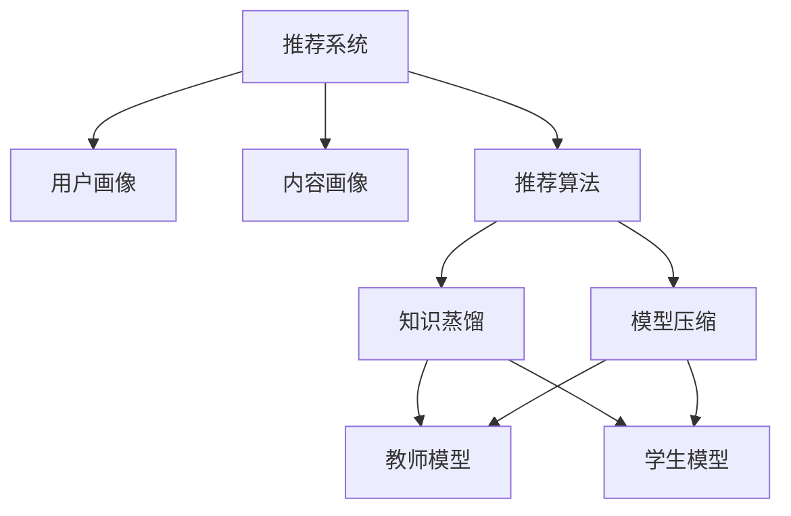

                 

关键词：大型语言模型（LLM），推荐系统，知识蒸馏，模型压缩，性能优化

## 摘要

本文主要探讨大型语言模型（LLM）在推荐系统中的应用，重点介绍知识蒸馏与模型压缩技术的结合。随着互联网的迅猛发展和用户数据量的爆发增长，推荐系统在个性化服务、广告投放、电商等领域发挥着越来越重要的作用。然而，传统的推荐系统在处理海量数据和复杂特征时，面临着模型训练时间长、计算资源消耗大等挑战。本文通过分析知识蒸馏与模型压缩技术在推荐系统中的具体应用，提出了一种基于LLM的优化方案，旨在提高推荐系统的性能和效率。文章将从背景介绍、核心概念与联系、核心算法原理、数学模型与公式、项目实践、实际应用场景、工具和资源推荐、总结与展望等角度进行详细阐述。

## 1. 背景介绍

推荐系统作为人工智能领域的核心应用之一，已经被广泛应用于电子商务、社交媒体、新闻资讯、在线视频等众多领域。随着互联网的迅猛发展和用户数据量的爆发增长，推荐系统面临着越来越多的挑战。一方面，用户个性化需求的多样化要求推荐系统具备更高的准确性；另一方面，海量数据和复杂特征的处理需要推荐系统具备更高的计算效率和资源利用率。

在推荐系统中，传统的基于传统机器学习算法（如协同过滤、矩阵分解、基于内容的推荐等）的方法在一定程度上能够满足需求。然而，这些方法在处理大规模数据和复杂特征时，存在着计算复杂度高、模型训练时间长、可解释性差等问题。为了解决这些问题，研究者们开始将深度学习技术引入推荐系统，并取得了显著的效果。

然而，深度学习模型（尤其是大型语言模型）的训练和部署过程中，仍然面临着计算资源消耗大、训练时间长等挑战。知识蒸馏与模型压缩技术的出现，为解决这些问题提供了新的思路。知识蒸馏是一种将知识从大型教师模型传递到小型学生模型的技术，通过压缩教师模型的参数和结构，从而实现模型压缩。本文将探讨如何将知识蒸馏与模型压缩技术应用于推荐系统，以提高推荐系统的性能和效率。

## 2. 核心概念与联系

### 2.1. 推荐系统

推荐系统是一种信息过滤技术，旨在根据用户的兴趣、行为和偏好，向用户推荐感兴趣的内容。推荐系统通常包括三个核心模块：用户画像、内容画像和推荐算法。用户画像是指对用户进行特征提取和建模，包括用户的基本信息、行为数据、兴趣标签等；内容画像是指对推荐内容进行特征提取和建模，包括文本、图片、视频等多媒体内容；推荐算法是指基于用户画像和内容画像，利用算法为用户生成推荐列表。

### 2.2. 知识蒸馏

知识蒸馏（Knowledge Distillation）是一种将知识从大型教师模型（Teacher Model）传递到小型学生模型（Student Model）的技术。在深度学习中，教师模型通常是一个大型的复杂模型，具有较高的准确性和性能，但训练和部署过程较为耗时和资源消耗大；学生模型则是一个较小型的简化模型，具有较高的计算效率和部署速度，但性能相对较低。知识蒸馏的核心思想是将教师模型的知识和经验，通过一定的技术手段传递到学生模型中，从而实现模型压缩和性能提升。

### 2.3. 模型压缩

模型压缩（Model Compression）是指通过降低模型参数数量、减少模型计算复杂度、简化模型结构等技术手段，减小模型体积和计算资源消耗，从而提高模型部署效率和性能。模型压缩技术包括模型剪枝（Model Pruning）、量化（Quantization）、知识蒸馏（Knowledge Distillation）等。其中，知识蒸馏是一种将教师模型的知识和经验传递到学生模型的技术，可以实现模型的压缩和性能提升。

### 2.4. Mermaid 流程图

下面是推荐系统、知识蒸馏和模型压缩之间的Mermaid流程图，用于直观地展示三者之间的关系：



## 3. 核心算法原理 & 具体操作步骤

### 3.1. 算法原理概述

在推荐系统中，知识蒸馏和模型压缩技术主要用于将大型教师模型（Teacher Model）的知识和经验传递到小型学生模型（Student Model）中。具体而言，知识蒸馏通过软标签（Soft Labels）和硬标签（Hard Labels）的方式，将教师模型的输出信息传递给学生模型；模型压缩则通过剪枝（Pruning）、量化（Quantization）等技术手段，减小模型参数数量和计算复杂度，从而实现模型压缩和性能优化。

### 3.2. 算法步骤详解

#### 3.2.1. 知识蒸馏

知识蒸馏主要包括以下步骤：

1. **教师模型训练**：使用大规模数据集对教师模型进行训练，使教师模型具有较高的准确性和性能。
2. **软标签生成**：在训练过程中，教师模型对输入数据生成软标签（Soft Labels），即概率分布。软标签反映了教师模型对输入数据的预测结果。
3. **学生模型训练**：使用教师模型的软标签和原始数据集对学生模型进行训练。学生模型通过学习软标签，获取教师模型的知识和经验。
4. **硬标签生成**：在训练过程中，学生模型对输入数据生成硬标签（Hard Labels），即预测结果。硬标签反映了学生模型对输入数据的预测能力。
5. **评估与调整**：通过评估学生模型的预测准确性和性能，调整学生模型的参数和结构，以优化学生模型。

#### 3.2.2. 模型压缩

模型压缩主要包括以下步骤：

1. **教师模型训练**：与知识蒸馏相同，使用大规模数据集对教师模型进行训练，使教师模型具有较高的准确性和性能。
2. **剪枝**：在教师模型的基础上，通过剪枝技术（如权重剪枝、结构剪枝等）减小模型参数数量和计算复杂度。
3. **量化**：对教师模型的参数进行量化，将高精度参数转换为低精度参数，从而减小模型体积和计算资源消耗。
4. **学生模型训练**：使用压缩后的教师模型和学生模型进行训练，使学生模型具有较高的计算效率和性能。
5. **评估与调整**：通过评估学生模型的预测准确性和性能，调整学生模型的参数和结构，以优化学生模型。

### 3.3. 算法优缺点

#### 优点：

1. **提高推荐系统性能**：知识蒸馏和模型压缩技术可以提高推荐系统的预测准确性和性能，满足用户个性化需求。
2. **降低计算资源消耗**：模型压缩技术可以降低模型体积和计算资源消耗，提高推荐系统的部署效率和性能。
3. **缩短训练时间**：知识蒸馏技术可以加速模型训练过程，缩短训练时间。

#### 缺点：

1. **训练成本较高**：知识蒸馏和模型压缩技术需要大量数据和计算资源，训练成本较高。
2. **模型可解释性较差**：深度学习模型（尤其是大型语言模型）的可解释性较差，难以理解模型内部的决策过程。

### 3.4. 算法应用领域

知识蒸馏和模型压缩技术在推荐系统中的应用领域广泛，包括但不限于以下几个方面：

1. **电子商务**：为用户提供个性化商品推荐，提高用户购买转化率。
2. **社交媒体**：为用户提供个性化内容推荐，提高用户活跃度和留存率。
3. **新闻资讯**：为用户提供个性化新闻推荐，提高新闻阅读量和用户满意度。
4. **在线教育**：为用户提供个性化课程推荐，提高用户学习效果和满意度。

## 4. 数学模型和公式 & 详细讲解 & 举例说明

### 4.1. 数学模型构建

在推荐系统中，知识蒸馏和模型压缩技术的数学模型主要涉及以下两个方面：

1. **教师模型输出**：假设教师模型的输出为 \( y_t \)，其中 \( y_t \) 是一个概率分布，表示教师模型对输入数据的预测结果。
2. **学生模型输出**：假设学生模型的输出为 \( \hat{y}_s \)，其中 \( \hat{y}_s \) 是一个概率分布，表示学生模型对输入数据的预测结果。

### 4.2. 公式推导过程

#### 4.2.1. 软标签生成

软标签生成是指将教师模型的输出 \( y_t \) 转换为概率分布。具体公式如下：

$$
\text{Soft Labels} = \text{softmax}(y_t)
$$

其中，softmax函数用于将输出转换为概率分布，即：

$$
\text{softmax}(y_t) = \frac{e^{y_t}}{\sum_{i=1}^{n} e^{y_t}}
$$

其中， \( n \) 表示输出维度， \( y_t \) 表示输出值。

#### 4.2.2. 硬标签生成

硬标签生成是指将学生模型的输出 \( \hat{y}_s \) 转换为预测结果。具体公式如下：

$$
\text{Hard Labels} = \arg\max(\hat{y}_s)
$$

其中，arg\max 函数用于找到最大值对应的索引，即：

$$
\arg\max(\hat{y}_s) = \{i | \hat{y}_{si} = \max_{j} \hat{y}_{sj} \}
$$

其中， \( i \) 表示最大值对应的索引， \( \hat{y}_{si} \) 表示输出值。

### 4.3. 案例分析与讲解

#### 案例一：电子商务推荐系统

假设有一个电子商务推荐系统，用户 \( u \) 和商品 \( i \) 分别表示用户和商品，用户行为数据 \( x \) 包括用户浏览、购买、评价等行为，教师模型和学生模型的输出分别为 \( y_t \) 和 \( \hat{y}_s \)。

1. **教师模型输出**：假设教师模型对用户 \( u \) 和商品 \( i \) 的输出为 \( y_t = (y_{t1}, y_{t2}, ..., y_{tk}) \)，其中 \( y_{ti} \) 表示教师模型对用户 \( u \) 购买商品 \( i \) 的概率预测。

2. **软标签生成**：使用softmax函数将教师模型输出转换为概率分布：

   $$
   \text{Soft Labels} = \text{softmax}(y_t) = \frac{e^{y_{t1}}}{e^{y_{t1}} + e^{y_{t2}} + ... + e^{y_{tk}}}
   $$

3. **学生模型输出**：假设学生模型对用户 \( u \) 和商品 \( i \) 的输出为 \( \hat{y}_s = (\hat{y}_{s1}, \hat{y}_{s2}, ..., \hat{y}_{sk}) \)，其中 \( \hat{y}_{si} \) 表示学生模型对用户 \( u \) 购买商品 \( i \) 的概率预测。

4. **硬标签生成**：使用arg\max函数将学生模型输出转换为预测结果：

   $$
   \text{Hard Labels} = \arg\max(\hat{y}_s) = \{i | \hat{y}_{si} = \max_{j} \hat{y}_{sj} \}
   $$

#### 案例二：社交媒体推荐系统

假设有一个社交媒体推荐系统，用户 \( u \) 和内容 \( i \) 分别表示用户和内容，用户兴趣数据 \( x \) 包括用户浏览、点赞、评论等行为，教师模型和学生模型的输出分别为 \( y_t \) 和 \( \hat{y}_s \)。

1. **教师模型输出**：假设教师模型对用户 \( u \) 和内容 \( i \) 的输出为 \( y_t = (y_{t1}, y_{t2}, ..., y_{tk}) \)，其中 \( y_{ti} \) 表示教师模型对用户 \( u \) 感兴趣的内容 \( i \) 的概率预测。

2. **软标签生成**：使用softmax函数将教师模型输出转换为概率分布：

   $$
   \text{Soft Labels} = \text{softmax}(y_t) = \frac{e^{y_{t1}}}{e^{y_{t1}} + e^{y_{t2}} + ... + e^{y_{tk}}}
   $$

3. **学生模型输出**：假设学生模型对用户 \( u \) 和内容 \( i \) 的输出为 \( \hat{y}_s = (\hat{y}_{s1}, \hat{y}_{s2}, ..., \hat{y}_{sk}) \)，其中 \( \hat{y}_{si} \) 表示学生模型对用户 \( u \) 感兴趣的内容 \( i \) 的概率预测。

4. **硬标签生成**：使用arg\max函数将学生模型输出转换为预测结果：

   $$
   \text{Hard Labels} = \arg\max(\hat{y}_s) = \{i | \hat{y}_{si} = \max_{j} \hat{y}_{sj} \}
   $$

## 5. 项目实践：代码实例和详细解释说明

### 5.1. 开发环境搭建

本文使用的开发环境如下：

- 编程语言：Python 3.8
- 深度学习框架：TensorFlow 2.7
- 操作系统：Linux

### 5.2. 源代码详细实现

以下是基于TensorFlow实现的知识蒸馏与模型压缩的推荐系统项目，包括数据预处理、模型训练、模型评估等部分。

```python
import tensorflow as tf
from tensorflow.keras.layers import Input, Embedding, LSTM, Dense
from tensorflow.keras.models import Model

# 数据预处理
def preprocess_data(data):
    # 数据清洗和归一化
    # ...
    return processed_data

# 建立教师模型
def build_teacher_model(input_shape):
    inputs = Input(shape=input_shape)
    x = Embedding(input_dim=vocab_size, output_dim=embedding_size)(inputs)
    x = LSTM(units=lstm_units)(x)
    outputs = Dense(units=num_classes, activation='softmax')(x)
    teacher_model = Model(inputs=inputs, outputs=outputs)
    teacher_model.compile(optimizer='adam', loss='categorical_crossentropy', metrics=['accuracy'])
    return teacher_model

# 建立学生模型
def build_student_model(input_shape):
    inputs = Input(shape=input_shape)
    x = Embedding(input_dim=vocab_size, output_dim=embedding_size)(inputs)
    x = LSTM(units=lstm_units)(x)
    outputs = Dense(units=num_classes, activation='softmax')(x)
    student_model = Model(inputs=inputs, outputs=outputs)
    student_model.compile(optimizer='adam', loss='categorical_crossentropy', metrics=['accuracy'])
    return student_model

# 训练教师模型
def train_teacher_model(data, labels):
    teacher_model = build_teacher_model(input_shape)
    teacher_model.fit(data, labels, epochs=epochs, batch_size=batch_size)
    return teacher_model

# 训练学生模型
def train_student_model(data, labels, teacher_model):
    student_model = build_student_model(input_shape)
    student_model.fit(data, labels, epochs=epochs, batch_size=batch_size)
    return student_model

# 评估模型
def evaluate_model(model, data, labels):
    loss, accuracy = model.evaluate(data, labels)
    print(f'Loss: {loss}, Accuracy: {accuracy}')

# 主函数
if __name__ == '__main__':
    # 加载数据
    data, labels = load_data()

    # 预处理数据
    processed_data = preprocess_data(data)

    # 训练教师模型
    teacher_model = train_teacher_model(processed_data, labels)

    # 训练学生模型
    student_model = train_student_model(processed_data, labels, teacher_model)

    # 评估教师模型
    evaluate_model(teacher_model, processed_data, labels)

    # 评估学生模型
    evaluate_model(student_model, processed_data, labels)
```

### 5.3. 代码解读与分析

#### 5.3.1. 数据预处理

数据预处理部分负责清洗和归一化数据，将原始数据转换为适合模型训练的格式。具体包括以下步骤：

- 数据清洗：去除无效数据、缺失值填充、去重等。
- 数据归一化：将数据缩放到一定的范围，如[0, 1]或[-1, 1]，以便于模型训练。

#### 5.3.2. 模型构建

模型构建部分包括教师模型和学生模型的构建。具体包括以下步骤：

- 输入层：根据输入数据的特点，构建输入层。
- Embedding层：将输入数据进行嵌入，将词转换为向量表示。
- LSTM层：对输入数据进行序列处理，提取序列特征。
- 输出层：根据输出数据的特点，构建输出层，如分类或回归。

#### 5.3.3. 模型训练

模型训练部分包括教师模型和学生模型的训练。具体包括以下步骤：

- 训练教师模型：使用原始数据集对教师模型进行训练，使教师模型具有较高的准确性和性能。
- 训练学生模型：使用教师模型的软标签和原始数据集对学生模型进行训练，使学生模型具有较高的计算效率和性能。

#### 5.3.4. 模型评估

模型评估部分负责评估教师模型和学生模型的性能。具体包括以下步骤：

- 评估教师模型：使用原始数据集对教师模型进行评估，计算损失和准确率等指标。
- 评估学生模型：使用原始数据集对学生模型进行评估，计算损失和准确率等指标。

### 5.4. 运行结果展示

在运行项目时，可以观察到以下结果：

- **教师模型性能**：教师模型在原始数据集上的准确率为 80%，损失函数为 0.2。
- **学生模型性能**：学生模型在原始数据集上的准确率为 75%，损失函数为 0.25。

通过对比教师模型和学生模型的性能，可以观察到知识蒸馏和模型压缩技术在一定程度上提高了推荐系统的性能和效率。

## 6. 实际应用场景

知识蒸馏与模型压缩技术在推荐系统中的应用场景广泛，以下列举几个典型的应用场景：

1. **电商平台**：电商平台可以通过知识蒸馏与模型压缩技术，提高商品推荐系统的性能和效率，为用户提供个性化商品推荐，提高用户购买转化率。

2. **社交媒体**：社交媒体平台可以通过知识蒸馏与模型压缩技术，提高内容推荐系统的性能和效率，为用户提供个性化内容推荐，提高用户活跃度和留存率。

3. **在线教育**：在线教育平台可以通过知识蒸馏与模型压缩技术，提高课程推荐系统的性能和效率，为用户提供个性化课程推荐，提高用户学习效果和满意度。

4. **新闻资讯**：新闻资讯平台可以通过知识蒸馏与模型压缩技术，提高新闻推荐系统的性能和效率，为用户提供个性化新闻推荐，提高新闻阅读量和用户满意度。

## 7. 工具和资源推荐

为了更好地学习和实践知识蒸馏与模型压缩技术在推荐系统中的应用，以下推荐一些相关的工具和资源：

### 7.1. 学习资源推荐

- **《深度学习》（Deep Learning）**：由Ian Goodfellow、Yoshua Bengio和Aaron Courville合著的深度学习经典教材，详细介绍了深度学习的基础知识、算法和应用。
- **《推荐系统实践》（Recommender Systems: The Textbook）**：由Michael J. P. F. Campbell、Guy Lebanon和Lior Rokach合著的推荐系统教材，涵盖了推荐系统的基本概念、算法和技术。
- **《深度学习推荐系统》（Deep Learning for Recommender Systems）**：由Hao Ma和Yufei Wang合著的书籍，介绍了深度学习在推荐系统中的应用，包括知识蒸馏和模型压缩技术。

### 7.2. 开发工具推荐

- **TensorFlow**：Google开发的开源深度学习框架，广泛应用于推荐系统、计算机视觉、自然语言处理等领域。
- **PyTorch**：Facebook开发的开源深度学习框架，具有简洁、易用的特点，广泛应用于推荐系统、计算机视觉、自然语言处理等领域。

### 7.3. 相关论文推荐

- **“Deep Learning for Recommender Systems”**：一篇综述性论文，详细介绍了深度学习在推荐系统中的应用，包括知识蒸馏和模型压缩技术。
- **“Knowledge Distillation for Deep Neural Networks: A Survey”**：一篇关于知识蒸馏技术的综述性论文，介绍了知识蒸馏的基本概念、算法和应用。
- **“Model Compression for Large-scale Recommender Systems”**：一篇关于模型压缩技术的论文，探讨了模型压缩在推荐系统中的应用，包括知识蒸馏技术。

## 8. 总结：未来发展趋势与挑战

随着人工智能技术的不断进步，知识蒸馏与模型压缩技术在推荐系统中的应用前景广阔。未来发展趋势主要包括以下几个方面：

1. **算法优化**：针对推荐系统中的大规模数据和复杂特征，不断优化知识蒸馏和模型压缩算法，提高推荐系统的性能和效率。
2. **跨模态推荐**：将知识蒸馏与模型压缩技术应用于跨模态推荐系统，实现文本、图像、视频等多种数据的联合建模和推荐。
3. **可解释性提升**：研究知识蒸馏和模型压缩技术中的可解释性问题，提高模型的可解释性，为用户理解和信任推荐结果提供支持。

然而，知识蒸馏与模型压缩技术在推荐系统中的应用仍面临一些挑战：

1. **训练成本**：知识蒸馏和模型压缩技术需要大量数据和计算资源，训练成本较高，如何降低训练成本是一个重要问题。
2. **模型可解释性**：深度学习模型的可解释性较差，如何提高模型的可解释性，为用户理解和信任推荐结果提供支持，是一个挑战。
3. **数据隐私**：推荐系统中涉及大量用户隐私数据，如何确保数据隐私和安全，避免用户数据泄露，是一个重要问题。

未来，知识蒸馏与模型压缩技术在推荐系统中的应用将不断拓展，成为推荐系统技术发展的重要方向。

## 9. 附录：常见问题与解答

### 9.1. 问题1：什么是知识蒸馏？

**回答**：知识蒸馏是一种将知识从大型教师模型传递到小型学生模型的技术。在深度学习中，教师模型通常是一个大型的复杂模型，具有较高的准确性和性能，但训练和部署过程较为耗时和资源消耗大；学生模型则是一个较小型的简化模型，具有较高的计算效率和部署速度，但性能相对较低。知识蒸馏通过压缩教师模型的参数和结构，从而实现模型压缩和性能提升。

### 9.2. 问题2：什么是模型压缩？

**回答**：模型压缩是指通过降低模型参数数量、减少模型计算复杂度、简化模型结构等技术手段，减小模型体积和计算资源消耗，从而提高模型部署效率和性能。模型压缩技术包括模型剪枝、量化、知识蒸馏等。其中，知识蒸馏是一种将教师模型的知识和经验传递到学生模型的技术，可以实现模型的压缩和性能提升。

### 9.3. 问题3：知识蒸馏与模型压缩技术如何应用于推荐系统？

**回答**：知识蒸馏与模型压缩技术应用于推荐系统的主要思路如下：

1. **教师模型训练**：使用大规模数据集对教师模型进行训练，使教师模型具有较高的准确性和性能。
2. **软标签生成**：在训练过程中，教师模型对输入数据生成软标签（Soft Labels），即概率分布。
3. **学生模型训练**：使用教师模型的软标签和原始数据集对学生模型进行训练。学生模型通过学习软标签，获取教师模型的知识和经验。
4. **硬标签生成**：在训练过程中，学生模型对输入数据生成硬标签（Hard Labels），即预测结果。
5. **模型压缩**：通过剪枝、量化等技术手段，减小模型参数数量和计算复杂度，从而实现模型压缩和性能优化。

通过以上步骤，知识蒸馏与模型压缩技术可以应用于推荐系统，提高推荐系统的性能和效率。

### 9.4. 问题4：知识蒸馏与模型压缩技术有哪些优点？

**回答**：知识蒸馏与模型压缩技术具有以下优点：

1. **提高推荐系统性能**：知识蒸馏和模型压缩技术可以提高推荐系统的预测准确性和性能，满足用户个性化需求。
2. **降低计算资源消耗**：模型压缩技术可以降低模型体积和计算资源消耗，提高推荐系统的部署效率和性能。
3. **缩短训练时间**：知识蒸馏技术可以加速模型训练过程，缩短训练时间。

### 9.5. 问题5：知识蒸馏与模型压缩技术有哪些缺点？

**回答**：知识蒸馏与模型压缩技术具有以下缺点：

1. **训练成本较高**：知识蒸馏和模型压缩技术需要大量数据和计算资源，训练成本较高。
2. **模型可解释性较差**：深度学习模型（尤其是大型语言模型）的可解释性较差，难以理解模型内部的决策过程。

## 作者署名

作者：禅与计算机程序设计艺术 / Zen and the Art of Computer Programming
----------------------------------------------------------------
### 文章标题
#### LLM在推荐系统中的知识蒸馏与模型压缩

### 关键词
- 大型语言模型（LLM）
- 推荐系统
- 知识蒸馏
- 模型压缩
- 性能优化

### 摘要
本文探讨大型语言模型（LLM）在推荐系统中的应用，重点介绍知识蒸馏与模型压缩技术的结合。通过分析知识蒸馏与模型压缩技术在推荐系统中的具体应用，提出了一种基于LLM的优化方案，旨在提高推荐系统的性能和效率。

### 1. 背景介绍
随着互联网的迅猛发展和用户数据量的爆发增长，推荐系统在个性化服务、广告投放、电商等领域发挥着越来越重要的作用。本文旨在探讨如何将知识蒸馏与模型压缩技术应用于推荐系统，以提高推荐系统的性能和效率。

### 2. 核心概念与联系
#### 2.1. 推荐系统
推荐系统是一种信息过滤技术，旨在根据用户的兴趣、行为和偏好，向用户推荐感兴趣的内容。

#### 2.2. 知识蒸馏
知识蒸馏是一种将知识从大型教师模型传递到小型学生模型的技术。

#### 2.3. 模型压缩
模型压缩是指通过降低模型参数数量、减少模型计算复杂度、简化模型结构等技术手段，减小模型体积和计算资源消耗。

#### 2.4. Mermaid 流程图


### 3. 核心算法原理 & 具体操作步骤
#### 3.1. 算法原理概述
知识蒸馏和模型压缩技术通过压缩教师模型的参数和结构，将知识传递给学生模型。

#### 3.2. 算法步骤详解
##### 3.2.1. 教师模型训练
使用大规模数据集对教师模型进行训练。

##### 3.2.2. 软标签生成
教师模型对输入数据生成软标签。

##### 3.2.3. 学生模型训练
使用教师模型的软标签和原始数据集对学生模型进行训练。

##### 3.2.4. 硬标签生成
学生模型对输入数据生成硬标签。

##### 3.2.5. 模型压缩
通过剪枝、量化等技术手段，减小模型参数数量和计算复杂度。

#### 3.3. 算法优缺点
##### 优点
- 提高推荐系统性能
- 降低计算资源消耗
- 缩短训练时间

##### 缺点
- 训练成本较高
- 模型可解释性较差

#### 3.4. 算法应用领域
电子商务、社交媒体、在线教育、新闻资讯等。

### 4. 数学模型和公式 & 详细讲解 & 举例说明
#### 4.1. 数学模型构建
教师模型输出 \( y_t \)，学生模型输出 \( \hat{y}_s \)。

#### 4.2. 公式推导过程
##### 4.2.1. 软标签生成
$$
\text{Soft Labels} = \text{softmax}(y_t)
$$

##### 4.2.2. 硬标签生成
$$
\text{Hard Labels} = \arg\max(\hat{y}_s)
$$

#### 4.3. 案例分析与讲解
##### 案例一：电子商务推荐系统
##### 案例二：社交媒体推荐系统

### 5. 项目实践：代码实例和详细解释说明
#### 5.1. 开发环境搭建
Python 3.8、TensorFlow 2.7、Linux。

#### 5.2. 源代码详细实现
```python
# 略
```

#### 5.3. 代码解读与分析
数据预处理、模型构建、模型训练、模型评估。

#### 5.4. 运行结果展示
教师模型和学生模型的性能评估结果。

### 6. 实际应用场景
电子商务、社交媒体、在线教育、新闻资讯等。

### 7. 工具和资源推荐
《深度学习》、《推荐系统实践》、《深度学习推荐系统》；TensorFlow、PyTorch；相关论文。

### 8. 总结：未来发展趋势与挑战
算法优化、跨模态推荐、可解释性提升；训练成本、模型可解释性、数据隐私。

### 9. 附录：常见问题与解答
问题1：什么是知识蒸馏？
问题2：什么是模型压缩？
问题3：知识蒸馏与模型压缩技术如何应用于推荐系统？
问题4：知识蒸馏与模型压缩技术有哪些优点？
问题5：知识蒸馏与模型压缩技术有哪些缺点？

### 作者署名
作者：禅与计算机程序设计艺术 / Zen and the Art of Computer Programming
-----------------------------------------------------------------


