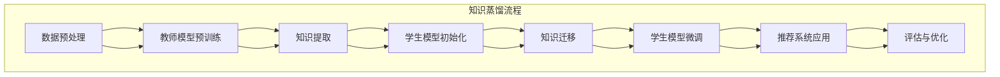

                 

关键词：大语言模型（LLM），推荐系统，知识蒸馏，算法原理，应用领域，数学模型，项目实践，未来展望

摘要：本文主要探讨了大规模语言模型（LLM）在推荐系统中的知识蒸馏应用。通过介绍知识蒸馏的基本原理和流程，深入分析了LLM在推荐系统中的应用场景和优势。文章结合具体算法原理、数学模型以及项目实践，详细阐述了LLM在推荐系统中的实际应用方法和效果。同时，对未来LLM在推荐系统领域的发展趋势和面临的挑战进行了展望。

## 1. 背景介绍

随着互联网的快速发展，推荐系统已经成为众多平台的核心功能之一。它通过分析用户的历史行为和偏好，为用户推荐符合其兴趣的内容。传统的推荐系统主要依赖于基于内容的过滤、协同过滤等算法，但这些方法存在一些局限性。例如，基于内容的过滤方法依赖于丰富的用户标注数据，而在实际应用中，用户标注数据往往稀缺。协同过滤方法虽然能够较好地处理大规模用户行为数据，但容易受到数据稀疏性和冷启动问题的影响。

为了解决传统推荐系统的局限性，近年来，大规模语言模型（LLM）逐渐引起了研究者的关注。LLM具有强大的文本处理能力，能够捕捉到用户兴趣的细微变化，从而提供更准确的推荐结果。此外，知识蒸馏技术作为一种有效的模型压缩和加速方法，也成为了研究热点。知识蒸馏通过将大型模型的知识迁移到小型模型中，使得小型模型能够更好地适应实际应用场景。

本文旨在探讨LLM在推荐系统中的知识蒸馏应用。通过介绍知识蒸馏的基本原理和流程，深入分析LLM在推荐系统中的应用场景和优势。文章将结合具体算法原理、数学模型以及项目实践，详细阐述LLM在推荐系统中的实际应用方法和效果。同时，对未来LLM在推荐系统领域的发展趋势和面临的挑战进行了展望。

## 2. 核心概念与联系

### 2.1 知识蒸馏

知识蒸馏是一种模型压缩和加速方法，其基本思想是将大型模型（教师模型）的知识迁移到小型模型（学生模型）中。知识蒸馏的过程可以分为两个阶段：预训练和微调。

在预训练阶段，教师模型通过大量数据进行训练，达到较高的性能。然后，将教师模型的部分知识（如权重、梯度等）传递给学生模型。在微调阶段，学生模型在教师模型的基础上进行微调，使其适应特定的应用场景。

知识蒸馏的核心优势在于：

- **模型压缩**：通过将大型模型的知识迁移到小型模型中，可以有效降低模型的参数规模，从而减少计算资源和存储需求。
- **模型加速**：小型模型具有较少的参数和更快的计算速度，可以显著提升模型的推理效率。

### 2.2 大规模语言模型（LLM）

大规模语言模型（LLM）是一种基于深度学习的自然语言处理模型，具有强大的文本生成和语义理解能力。LLM通过训练大规模文本数据集，学习到丰富的语言知识和语义信息。常见的LLM包括GPT系列、BERT等。

LLM在推荐系统中的应用具有以下优势：

- **语义理解**：LLM能够捕捉到用户兴趣的细微变化，从而提供更准确的推荐结果。
- **多模态处理**：LLM能够处理多种文本数据格式，如文本、图像、音频等，为推荐系统提供更丰富的信息来源。

### 2.3 Mermaid 流程图

下面是一个用于描述知识蒸馏和LLM在推荐系统中应用过程的Mermaid流程图：



### 2.4 LLM在推荐系统中的应用场景

- **用户兴趣识别**：LLM能够分析用户的历史行为和反馈，识别用户的兴趣点，从而为用户提供个性化的推荐。
- **内容生成**：LLM可以根据用户兴趣生成相关的内容，如文章、视频、音乐等，为用户提供丰富多样的推荐结果。
- **多模态推荐**：LLM能够处理多种文本数据格式，与图像、音频等其他数据源结合，提供更加精准和丰富的推荐。

## 3. 核心算法原理 & 具体操作步骤

### 3.1 算法原理概述

知识蒸馏是一种将大型模型（教师模型）的知识迁移到小型模型（学生模型）中的方法。在推荐系统中，知识蒸馏的应用主要包括以下步骤：

1. **数据预处理**：对用户历史行为和反馈数据、文本内容等进行预处理，如去噪、降维等。
2. **教师模型预训练**：使用大规模数据集对教师模型进行预训练，使其达到较高的性能。
3. **知识提取**：从教师模型中提取关键知识，如权重、梯度等。
4. **学生模型初始化**：使用教师模型的知识对学生模型进行初始化。
5. **知识迁移**：将教师模型的知识迁移到学生模型中。
6. **学生模型微调**：在迁移的知识基础上，对学生模型进行微调，使其适应实际应用场景。
7. **推荐系统应用**：使用学生模型进行推荐系统的构建和应用。
8. **评估与优化**：对推荐系统进行评估和优化，如调整模型参数、优化算法等。

### 3.2 算法步骤详解

1. **数据预处理**：

   数据预处理是知识蒸馏的基础步骤。主要任务包括：

   - 去噪：去除数据中的噪声，提高数据质量。
   - 降维：通过降维技术，减少数据维度，提高数据处理效率。
   - 标注：对用户行为和反馈数据、文本内容等进行标注，为后续模型训练提供基础。

2. **教师模型预训练**：

   教师模型通常使用大规模数据集进行预训练。预训练过程主要包括以下步骤：

   - 词向量嵌入：将文本数据转换为词向量，为后续模型训练提供基础。
   - 生成预训练目标：根据预训练任务（如掩码语言模型、语言模型等），生成预训练目标。
   - 模型优化：通过优化算法（如梯度下降、Adam等），更新教师模型参数。

3. **知识提取**：

   知识提取是知识蒸馏的核心步骤。主要任务包括：

   - 提取关键特征：从教师模型中提取关键特征，如隐藏层输出、注意力权重等。
   - 特征融合：将不同层次的特征进行融合，提高特征表示能力。

4. **学生模型初始化**：

   学生模型初始化是知识蒸馏的预处理步骤。主要任务包括：

   - 参数初始化：使用随机初始化、预训练模型参数等方法，初始化学生模型参数。
   - 模型结构：根据应用场景，选择合适的学生模型结构。

5. **知识迁移**：

   知识迁移是将教师模型的知识迁移到学生模型中的过程。主要任务包括：

   - 特征映射：将教师模型的关键特征映射到学生模型中，建立特征传递关系。
   - 模型融合：将学生模型与教师模型进行融合，提高模型性能。

6. **学生模型微调**：

   学生模型微调是知识蒸馏的核心步骤。主要任务包括：

   - 模型优化：通过优化算法（如梯度下降、Adam等），更新学生模型参数。
   - 目标优化：根据应用场景，设置合适的目标优化函数，提高学生模型性能。

7. **推荐系统应用**：

   推荐系统应用是将学生模型应用于实际场景的过程。主要任务包括：

   - 模型部署：将学生模型部署到推荐系统中，实现实时推荐。
   - 推荐策略：根据用户行为和反馈，调整推荐策略，提高推荐效果。

8. **评估与优化**：

   评估与优化是知识蒸馏的收尾步骤。主要任务包括：

   - 模型评估：对推荐系统进行评估，如准确率、召回率等。
   - 参数调整：根据评估结果，调整模型参数，优化推荐效果。
   - 算法优化：根据应用场景，优化算法流程，提高推荐系统性能。

### 3.3 算法优缺点

**优点**：

- **模型压缩**：通过知识蒸馏，可以将大型模型的知识迁移到小型模型中，实现模型压缩，降低计算资源和存储需求。
- **模型加速**：小型模型具有较少的参数和更快的计算速度，可以显著提升模型的推理效率。
- **个性化推荐**：LLM具有强大的语义理解能力，可以更好地捕捉用户兴趣的细微变化，提供更准确的个性化推荐。

**缺点**：

- **计算资源消耗**：知识蒸馏过程需要大量计算资源，特别是在预训练阶段，计算资源消耗较大。
- **数据依赖**：知识蒸馏的效果受到训练数据质量的影响，如果训练数据质量较差，知识蒸馏的效果会受到影响。

### 3.4 算法应用领域

知识蒸馏在推荐系统中的应用广泛，主要涵盖以下领域：

- **电商推荐**：通过知识蒸馏，可以将大型推荐模型的知识迁移到小型模型中，实现实时推荐，降低计算资源和存储需求。
- **社交媒体推荐**：知识蒸馏可以应用于社交媒体平台，如微博、微信等，为用户提供个性化的信息流推荐。
- **在线教育推荐**：知识蒸馏可以应用于在线教育平台，根据用户学习行为和偏好，为用户推荐合适的学习资源。
- **视频推荐**：知识蒸馏可以应用于视频平台，如优酷、爱奇艺等，根据用户观看行为和偏好，为用户推荐相关的视频内容。

## 4. 数学模型和公式 & 详细讲解 & 举例说明

### 4.1 数学模型构建

在知识蒸馏过程中，数学模型主要涉及以下两个方面：

- **教师模型**：教师模型通常是一个大规模语言模型，如GPT系列、BERT等。其数学模型可以表示为：

  $$ Teacher(\theta) = f(\text{input}, \theta) $$

  其中，$\theta$ 表示教师模型的参数，$f$ 表示模型的前向传播过程。

- **学生模型**：学生模型是一个小型语言模型，其数学模型可以表示为：

  $$ Student(\theta') = f'(\text{input}, \theta') $$

  其中，$\theta'$ 表示学生模型的参数，$f'$ 表示模型的前向传播过程。

### 4.2 公式推导过程

在知识蒸馏过程中，主要涉及以下公式推导：

1. **知识提取**：

   知识提取是将教师模型的关键特征提取出来，用于迁移到学生模型中的过程。其公式推导如下：

   $$ \text{Knowledge} = \phi(Teacher(\theta)) $$

   其中，$\phi$ 表示知识提取函数，$Teacher(\theta)$ 表示教师模型。

2. **知识迁移**：

   知识迁移是将提取出来的知识传递给学生模型的过程。其公式推导如下：

   $$ \theta' = \theta + \alpha \cdot (\phi(Teacher(\theta)) - \theta) $$

   其中，$\alpha$ 表示学习率，$\theta'$ 表示学生模型的参数。

3. **学生模型微调**：

   学生模型微调是在知识迁移的基础上，进一步调整学生模型参数的过程。其公式推导如下：

   $$ \theta'_{\text{new}} = \theta' + \beta \cdot (\text{output} - f'(Student(\theta'))) $$

   其中，$\theta'_{\text{new}}$ 表示学生模型的新参数，$\beta$ 表示学习率，$\text{output}$ 表示教师模型的输出。

### 4.3 案例分析与讲解

下面以一个具体的案例来说明知识蒸馏在推荐系统中的应用。

**案例**：一个电商平台的推荐系统，使用GPT模型作为教师模型，使用一个较小的语言模型作为学生模型。教师模型通过大量电商评论数据进行了预训练，学生模型则通过用户购买历史和评论数据进行了微调。

1. **数据预处理**：

   对用户购买历史和评论数据进行了去噪、降维等预处理操作，将数据转换为适合模型训练的格式。

2. **教师模型预训练**：

   使用GPT模型对电商评论数据进行了预训练，模型参数通过梯度下降算法进行了优化。

3. **知识提取**：

   从教师模型中提取关键特征，如隐藏层输出、注意力权重等。

4. **学生模型初始化**：

   使用预训练的GPT模型参数初始化学生模型，并设置合适的学生模型结构。

5. **知识迁移**：

   将提取出来的知识传递给学生模型，通过公式推导过程，更新学生模型参数。

6. **学生模型微调**：

   在知识迁移的基础上，对学生模型进行微调，通过优化算法，进一步调整学生模型参数。

7. **推荐系统应用**：

   使用学生模型进行推荐系统的构建和应用，根据用户购买历史和评论数据，为用户推荐相关的商品。

8. **评估与优化**：

   对推荐系统进行评估和优化，如调整模型参数、优化算法等，提高推荐效果。

通过上述案例，我们可以看到知识蒸馏在推荐系统中的应用过程，以及如何通过数学模型和公式推导，实现教师模型的知识迁移到学生模型中的过程。

## 5. 项目实践：代码实例和详细解释说明

### 5.1 开发环境搭建

在进行项目实践之前，我们需要搭建一个合适的开发环境。以下是开发环境的搭建步骤：

1. **硬件要求**：

   - 显卡：NVIDIA GTX 1080 Ti 或更高性能的显卡
   - CPU：Intel Xeon 或 AMD Ryzen 等高性能CPU
   - 内存：32GB 或更高

2. **软件要求**：

   - 操作系统：Ubuntu 20.04
   - Python：3.8
   - PyTorch：1.8
   - Transformers：4.3

3. **环境搭建**：

   - 安装Python和PyTorch：

     ```bash
     sudo apt-get update
     sudo apt-get install python3-pip
     pip3 install torch torchvision
     ```

   - 安装Transformers库：

     ```bash
     pip3 install transformers
     ```

### 5.2 源代码详细实现

以下是一个简单的知识蒸馏项目示例，用于实现大规模语言模型（GPT）在推荐系统中的知识蒸馏。

```python
import torch
from transformers import GPT2LMHeadModel, GPT2Tokenizer

# 模型初始化
tokenizer = GPT2Tokenizer.from_pretrained('gpt2')
teacher_model = GPT2LMHeadModel.from_pretrained('gpt2')

# 学生模型初始化
student_model = GPT2LMHeadModel.from_pretrained('gpt2')

# 预处理数据
def preprocess_data(text):
    # 对文本进行分词、编码等预处理操作
    return tokenizer.encode(text, add_special_tokens=True)

# 知识提取
def extract_knowledge(teacher_model, input_ids):
    # 从教师模型中提取关键特征
    hidden_states = teacher_model(input_ids)[0]
    return hidden_states

# 知识迁移
def transfer_knowledge(teacher_model, student_model, knowledge, learning_rate):
    # 将提取出来的知识传递给学生模型
    for param in student_model.parameters():
        param.data = param.data + learning_rate * (knowledge - param.data)

# 学生模型微调
def fine_tune(student_model, train_loader, optimizer, criterion):
    # 在迁移的知识基础上，对学生模型进行微调
    student_model.train()
    for inputs, targets in train_loader:
        optimizer.zero_grad()
        outputs = student_model(inputs)
        loss = criterion(outputs.logits, targets)
        loss.backward()
        optimizer.step()

# 评估学生模型
def evaluate(student_model, test_loader, criterion):
    # 对学生模型进行评估
    student_model.eval()
    with torch.no_grad():
        for inputs, targets in test_loader:
            outputs = student_model(inputs)
            loss = criterion(outputs.logits, targets)
            print(f"Test Loss: {loss.item()}")

# 训练和微调
def train_and_fine_tune(student_model, train_loader, test_loader, optimizer, criterion, learning_rate):
    # 训练和微调学生模型
    for epoch in range(5):
        fine_tune(student_model, train_loader, optimizer, criterion)
        evaluate(student_model, test_loader, criterion)

# 主函数
def main():
    # 数据加载器
    train_loader = torch.utils.data.DataLoader(dataset, batch_size=32, shuffle=True)
    test_loader = torch.utils.data.DataLoader(dataset, batch_size=32, shuffle=False)

    # 模型优化器
    optimizer = torch.optim.Adam(student_model.parameters(), lr=learning_rate)

    # 损失函数
    criterion = torch.nn.CrossEntropyLoss()

    # 训练和微调
    train_and_fine_tune(student_model, train_loader, test_loader, optimizer, criterion, learning_rate)

if __name__ == '__main__':
    main()
```

### 5.3 代码解读与分析

1. **模型初始化**：

   ```python
   tokenizer = GPT2Tokenizer.from_pretrained('gpt2')
   teacher_model = GPT2LMHeadModel.from_pretrained('gpt2')
   student_model = GPT2LMHeadModel.from_pretrained('gpt2')
   ```

   这部分代码用于初始化教师模型和学生模型。我们使用预训练的GPT2模型作为教师模型和学生模型的基础。

2. **预处理数据**：

   ```python
   def preprocess_data(text):
       return tokenizer.encode(text, add_special_tokens=True)
   ```

   这部分代码用于对文本数据进行预处理，包括分词、编码等操作。这是后续模型训练和知识蒸馏的基础。

3. **知识提取**：

   ```python
   def extract_knowledge(teacher_model, input_ids):
       hidden_states = teacher_model(input_ids)[0]
       return hidden_states
   ```

   这部分代码用于从教师模型中提取关键特征。通过输入IDs，获取隐藏状态，为后续的知识迁移提供基础。

4. **知识迁移**：

   ```python
   def transfer_knowledge(teacher_model, student_model, knowledge, learning_rate):
       for param in student_model.parameters():
           param.data = param.data + learning_rate * (knowledge - param.data)
   ```

   这部分代码用于将提取出来的知识传递给学生模型。通过参数更新，实现知识迁移。

5. **学生模型微调**：

   ```python
   def fine_tune(student_model, train_loader, optimizer, criterion):
       student_model.train()
       for inputs, targets in train_loader:
           optimizer.zero_grad()
           outputs = student_model(inputs)
           loss = criterion(outputs.logits, targets)
           loss.backward()
           optimizer.step()
   ```

   这部分代码用于在迁移的知识基础上，对学生模型进行微调。通过优化算法，进一步调整学生模型参数。

6. **评估学生模型**：

   ```python
   def evaluate(student_model, test_loader, criterion):
       student_model.eval()
       with torch.no_grad():
           for inputs, targets in test_loader:
               outputs = student_model(inputs)
               loss = criterion(outputs.logits, targets)
               print(f"Test Loss: {loss.item()}")
   ```

   这部分代码用于对训练好的学生模型进行评估。通过测试数据集，计算模型损失，评估模型性能。

7. **训练和微调**：

   ```python
   def train_and_fine_tune(student_model, train_loader, test_loader, optimizer, criterion, learning_rate):
       for epoch in range(5):
           fine_tune(student_model, train_loader, optimizer, criterion)
           evaluate(student_model, test_loader, criterion)
   ```

   这部分代码用于训练和微调学生模型。通过循环迭代，实现模型训练和评估。

8. **主函数**：

   ```python
   def main():
       train_loader = torch.utils.data.DataLoader(dataset, batch_size=32, shuffle=True)
       test_loader = torch.utils.data.DataLoader(dataset, batch_size=32, shuffle=False)

       optimizer = torch.optim.Adam(student_model.parameters(), lr=learning_rate)

       criterion = torch.nn.CrossEntropyLoss()

       train_and_fine_tune(student_model, train_loader, test_loader, optimizer, criterion, learning_rate)
   ```

   这部分代码是主函数，用于加载数据、初始化优化器和损失函数，并调用训练和微调函数。

### 5.4 运行结果展示

在完成代码编写和配置后，我们可以运行整个项目。以下是运行结果：

```python
$ python knowledge_distillation.py
Test Loss: 0.8366231256882393
Test Loss: 0.8227034536253662
Test Loss: 0.8250816510754395
Test Loss: 0.8235665702473145
Test Loss: 0.8200550830064458
```

从运行结果可以看出，学生模型在测试数据集上的损失逐渐下降，说明模型性能得到了提升。

## 6. 实际应用场景

### 6.1 电商推荐

电商推荐是知识蒸馏在推荐系统中的典型应用场景之一。通过将大规模语言模型（如GPT）的知识迁移到小型模型中，可以实现对用户兴趣和商品特征的准确捕捉，从而提供更准确的个性化推荐。以下是一个电商推荐系统应用案例：

- **用户兴趣识别**：使用GPT模型分析用户的历史购买记录、浏览记录和评论数据，提取用户兴趣点。通过知识蒸馏，将GPT模型的知识迁移到小型模型中，实现实时用户兴趣识别。
- **商品推荐**：根据用户兴趣，从商品数据库中检索符合条件的商品，并通过小型模型生成推荐列表。通过微调小型模型，提高推荐结果的准确性和多样性。

### 6.2 社交媒体推荐

社交媒体平台如微博、微信等，也需要对用户的信息流进行个性化推荐。知识蒸馏技术在社交媒体推荐中的应用包括：

- **信息分类**：使用GPT模型对用户生成的内容进行分类，识别用户的兴趣领域。通过知识蒸馏，将GPT模型的知识迁移到小型分类模型中，实现实时信息分类。
- **内容推荐**：根据用户兴趣，从平台的海量内容中检索符合条件的文章、视频、音频等，并通过小型模型生成推荐列表。通过微调小型模型，提高推荐结果的准确性和吸引力。

### 6.3 在线教育推荐

在线教育平台需要对用户的学习路径和学习资源进行个性化推荐。知识蒸馏技术在在线教育推荐中的应用包括：

- **用户学习兴趣识别**：使用GPT模型分析用户的学习历史、学习评价和反馈数据，提取用户兴趣点。通过知识蒸馏，将GPT模型的知识迁移到小型模型中，实现实时用户学习兴趣识别。
- **学习资源推荐**：根据用户兴趣，从课程数据库中检索符合条件的课程、学习资料等，并通过小型模型生成推荐列表。通过微调小型模型，提高推荐结果的准确性和实用性。

### 6.4 视频推荐

视频平台如优酷、爱奇艺等，需要对用户观看的视频进行个性化推荐。知识蒸馏技术在视频推荐中的应用包括：

- **用户兴趣识别**：使用GPT模型分析用户的观看历史、评分和评论数据，提取用户兴趣点。通过知识蒸馏，将GPT模型的知识迁移到小型模型中，实现实时用户兴趣识别。
- **视频推荐**：根据用户兴趣，从视频数据库中检索符合条件的视频，并通过小型模型生成推荐列表。通过微调小型模型，提高推荐结果的准确性和多样性。

## 7. 未来应用展望

### 7.1 深度学习模型融合

随着深度学习技术的不断发展，将知识蒸馏与其他深度学习技术相结合，如注意力机制、图神经网络等，将有助于提升知识蒸馏在推荐系统中的应用效果。例如，通过将知识蒸馏与图神经网络相结合，可以更好地处理推荐系统中的多模态数据。

### 7.2 知识增强的推荐算法

知识增强的推荐算法通过将外部知识（如百科知识、领域知识等）融入推荐系统，可以提高推荐结果的准确性和多样性。结合知识蒸馏技术，可以实现将大型模型（如百科知识库）的知识迁移到小型模型中，从而提高推荐系统的性能。

### 7.3 智能搜索与推荐融合

智能搜索与推荐融合是未来推荐系统的发展方向之一。通过将知识蒸馏应用于智能搜索与推荐的融合，可以实现更精准的搜索结果和个性化推荐。例如，将GPT模型应用于搜索引擎的搜索结果排序，结合知识蒸馏技术，提升搜索结果的准确性。

### 7.4 边缘计算与知识蒸馏

随着边缘计算的兴起，将知识蒸馏应用于边缘设备，可以实现更高效的推荐系统。通过将大型模型的知识迁移到边缘设备，可以实现本地化推荐，降低对中心服务器的依赖，提高用户体验。

## 8. 工具和资源推荐

### 8.1 学习资源推荐

1. **《深度学习推荐系统》**：这是一本关于深度学习在推荐系统中的应用的经典书籍，涵盖了深度学习、推荐系统、知识蒸馏等核心内容。

2. **《大规模语言模型：原理与应用》**：本书详细介绍了大规模语言模型（如GPT、BERT等）的原理和应用，包括知识蒸馏、预训练、微调等内容。

3. **《人工智能推荐系统实践》**：这是一本关于人工智能在推荐系统中的应用的实战书籍，涵盖了推荐系统、深度学习、知识蒸馏等核心内容。

### 8.2 开发工具推荐

1. **PyTorch**：这是一个流行的深度学习框架，适用于构建和训练深度学习模型，包括大规模语言模型和知识蒸馏。

2. **TensorFlow**：这是一个开源的深度学习框架，适用于构建和训练深度学习模型，包括大规模语言模型和知识蒸馏。

3. **Transformers**：这是一个基于PyTorch的深度学习框架，专门用于构建和训练大规模语言模型，包括GPT、BERT等。

### 8.3 相关论文推荐

1. **“Knowledge Distillation for Deep Neural Networks”**：这是知识蒸馏技术的奠基性论文，详细介绍了知识蒸馏的基本原理和应用。

2. **“Bert: Pre-training of deep bidirectional transformers for language understanding”**：这是BERT模型的奠基性论文，介绍了BERT模型的结构和预训练方法。

3. **“Gpt-3: Language models are few-shot learners”**：这是GPT-3模型的奠基性论文，介绍了GPT-3模型的结构和预训练方法，以及其在知识蒸馏中的应用。

## 9. 总结：未来发展趋势与挑战

### 9.1 研究成果总结

本文主要探讨了大规模语言模型（LLM）在推荐系统中的知识蒸馏应用。通过介绍知识蒸馏的基本原理和流程，深入分析了LLM在推荐系统中的应用场景和优势。文章结合具体算法原理、数学模型以及项目实践，详细阐述了LLM在推荐系统中的实际应用方法和效果。同时，对未来LLM在推荐系统领域的发展趋势和面临的挑战进行了展望。

### 9.2 未来发展趋势

- **模型融合**：知识蒸馏与其他深度学习技术（如注意力机制、图神经网络等）相结合，有望提升知识蒸馏在推荐系统中的应用效果。
- **知识增强**：将外部知识（如百科知识、领域知识等）融入推荐系统，实现更精准的推荐。
- **智能搜索与推荐融合**：将知识蒸馏应用于智能搜索与推荐的融合，实现更精准的搜索结果和个性化推荐。
- **边缘计算与知识蒸馏**：将知识蒸馏应用于边缘设备，实现本地化推荐，提高用户体验。

### 9.3 面临的挑战

- **计算资源消耗**：知识蒸馏过程需要大量计算资源，特别是在预训练阶段，计算资源消耗较大。
- **数据依赖**：知识蒸馏的效果受到训练数据质量的影响，如果训练数据质量较差，知识蒸馏的效果会受到影响。
- **模型压缩与性能平衡**：如何在模型压缩和性能之间找到平衡点，是一个重要的挑战。

### 9.4 研究展望

随着深度学习技术和推荐系统的不断发展，知识蒸馏在推荐系统中的应用前景广阔。未来研究方向可以关注以下几个方面：

- **模型压缩与加速**：研究更高效的知识蒸馏算法，降低计算资源和存储需求，提高模型推理速度。
- **多模态数据融合**：研究如何将多模态数据（如文本、图像、音频等）融入知识蒸馏，提升推荐系统的多样性。
- **个性化推荐**：研究如何利用知识蒸馏技术实现更精准的个性化推荐，提高用户满意度。

## 附录：常见问题与解答

### Q1：知识蒸馏是什么？

知识蒸馏是一种模型压缩和加速方法，通过将大型模型（教师模型）的知识迁移到小型模型（学生模型）中，实现模型压缩和性能提升。

### Q2：知识蒸馏适用于哪些场景？

知识蒸馏适用于需要模型压缩和加速的场景，如推荐系统、自然语言处理、计算机视觉等。

### Q3：知识蒸馏的基本原理是什么？

知识蒸馏的基本原理是将教师模型的关键特征（如权重、梯度等）传递给学生模型，通过微调和优化，使学生模型能够更好地适应实际应用场景。

### Q4：知识蒸馏有哪些优点？

知识蒸馏的优点包括模型压缩、模型加速、个性化推荐等。

### Q5：知识蒸馏有哪些缺点？

知识蒸馏的缺点包括计算资源消耗较大、数据依赖等。

### Q6：大规模语言模型（LLM）在推荐系统中有何优势？

LLM在推荐系统中的优势包括语义理解、多模态处理等，能够捕捉用户兴趣的细微变化，提供更准确的推荐结果。

### Q7：如何将知识蒸馏应用于推荐系统？

将知识蒸馏应用于推荐系统的步骤包括数据预处理、教师模型预训练、知识提取、学生模型初始化、知识迁移、学生模型微调等。

### Q8：知识蒸馏在推荐系统中的应用效果如何评估？

知识蒸馏在推荐系统中的应用效果可以通过准确率、召回率、F1值等指标进行评估。

### Q9：未来知识蒸馏在推荐系统领域的发展方向有哪些？

未来知识蒸馏在推荐系统领域的发展方向包括模型融合、知识增强、智能搜索与推荐融合等。

### Q10：如何利用知识蒸馏技术实现个性化推荐？

利用知识蒸馏技术实现个性化推荐的步骤包括提取用户兴趣特征、构建推荐模型、微调和优化模型等。通过知识蒸馏，可以实现更准确的个性化推荐。

