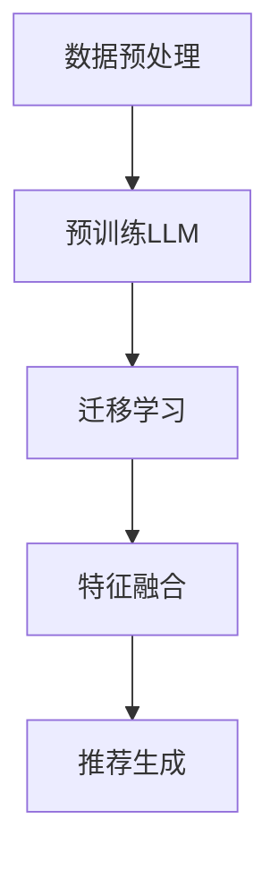

                 

## 1. 背景介绍

推荐系统是一种信息过滤技术，旨在根据用户的兴趣和偏好，为他们推荐相关的产品、内容或服务。随着互联网和大数据技术的飞速发展，推荐系统已经在电子商务、社交媒体、在线新闻、音乐流媒体等多个领域取得了广泛应用。然而，传统的推荐系统通常依赖于用户的历史行为数据来生成个性化推荐，这可能会导致推荐结果的新鲜感和多样性不足。

为了克服这些限制，近年来，深度学习特别是基于自然语言处理的预训练语言模型（Language Model，LLM）在推荐系统中的应用受到了广泛关注。LLM通过在大规模文本数据上进行预训练，可以捕捉到语言中的语义信息，从而实现更加精准和多样化的推荐。

迁移学习（Transfer Learning）是一种将已在大规模数据集上训练好的模型应用于新任务的方法，可以有效解决数据稀缺和模型过拟合等问题。在推荐系统中，迁移学习可以充分利用预训练的LLM对文本数据的理解能力，为推荐系统提供强大的特征提取能力。

本文旨在探讨LLM在推荐系统中的迁移学习应用，分析其原理、方法、优势和挑战，并提出未来发展的展望。通过本文的讨论，希望能够为相关领域的研究者和开发者提供有价值的参考。

## 2. 核心概念与联系

在深入探讨LLM在推荐系统中的迁移学习应用之前，我们首先需要理解几个核心概念和它们之间的联系。

### 2.1 预训练语言模型（LLM）

预训练语言模型（LLM）是一种基于深度学习的自然语言处理模型，通过在大规模文本语料库上进行预训练，学习到语言的一般特征和规则。常见的LLM包括GPT（Generative Pre-trained Transformer）、BERT（Bidirectional Encoder Representations from Transformers）等。预训练模型通常具有强大的语言理解能力，可以用于多种自然语言处理任务，如文本分类、命名实体识别、机器翻译等。

### 2.2 迁移学习

迁移学习是一种将一个任务（源任务）在特定数据集上训练得到的模型参数应用于另一个任务（目标任务）的学习方法。在迁移学习中，模型可以在源任务上学习到一些通用的特征表示，然后通过微调（Fine-tuning）这些表示以适应目标任务。迁移学习可以显著减少目标任务的训练数据需求，提高模型在少量数据上的泛化能力。

### 2.3 推荐系统

推荐系统是一种根据用户的历史行为数据、内容特征和上下文信息，为用户推荐相关物品或内容的系统。推荐系统通常包括三个主要组成部分：用户画像、物品特征和推荐算法。用户画像描述了用户的历史行为和偏好，物品特征描述了推荐对象的属性，推荐算法则根据用户画像和物品特征生成推荐结果。

### 2.4 关联与融合

LLM在推荐系统中的迁移学习应用，主要是将预训练的LLM应用于推荐系统的特征提取和生成环节。通过迁移学习，LLM可以学习到文本数据的深层语义特征，为推荐系统提供强大的特征表示。此外，LLM还可以与推荐系统中的其他特征进行融合，进一步提高推荐效果。

### 2.5 Mermaid 流程图

为了更清晰地展示LLM在推荐系统中的迁移学习应用，我们可以使用Mermaid流程图来描述整个工作流程。以下是该流程图的Mermaid语法：



在上述流程图中，数据预处理阶段对用户行为数据和物品特征进行清洗和规范化；预训练LLM阶段在大规模文本数据集上训练得到一个通用的文本特征提取器；迁移学习阶段将预训练的LLM应用于推荐系统的特征提取；特征融合阶段将LLM提取的文本特征与其他特征进行融合；最后，推荐生成阶段利用融合后的特征生成个性化推荐结果。

## 3. 核心算法原理 & 具体操作步骤

### 3.1 算法原理概述

LLM在推荐系统中的迁移学习应用主要基于以下几个核心原理：

1. **预训练：** 预训练语言模型（如GPT、BERT）通过在大规模文本数据上预训练，学习到语言的一般特征和规则，从而为推荐系统提供强大的文本特征提取能力。

2. **迁移学习：** 迁移学习利用预训练模型在源任务上学习到的通用特征表示，通过微调适应目标任务，减少目标任务的训练数据需求，提高模型在少量数据上的泛化能力。

3. **特征融合：** 将预训练的LLM提取的文本特征与其他特征（如用户行为特征、物品属性特征）进行融合，生成更加丰富和多样化的特征表示，提高推荐效果。

4. **推荐生成：** 利用融合后的特征生成个性化推荐结果，通过评估指标（如点击率、购买率等）评估推荐效果，并根据反馈进行调整。

### 3.2 算法步骤详解

以下是LLM在推荐系统中的迁移学习应用的具体操作步骤：

#### 3.2.1 数据预处理

1. **用户行为数据：** 收集用户的历史行为数据，如点击、浏览、购买等。

2. **物品特征数据：** 收集物品的相关特征数据，如类别、价格、库存量等。

3. **文本数据：** 收集与用户行为数据和物品特征相关的文本数据，如用户评价、商品描述等。

4. **数据清洗：** 对收集到的数据进行清洗和规范化，去除噪声和异常值，保证数据质量。

#### 3.2.2 预训练LLM

1. **选择预训练模型：** 选择合适的预训练语言模型（如GPT、BERT），根据任务需求和数据规模进行选择。

2. **预训练：** 在大规模文本数据集上训练预训练模型，学习到文本数据的深层语义特征。

3. **模型优化：** 对预训练模型进行优化，以提高其在推荐任务上的性能。

#### 3.2.3 迁移学习

1. **特征提取：** 将预训练的LLM应用于用户行为数据和物品特征数据的文本部分，提取出深层语义特征。

2. **微调：** 在少量目标任务数据上对LLM进行微调，以适应推荐系统的特定需求。

3. **特征表示：** 将微调后的LLM特征与其他特征进行融合，生成更加丰富和多样化的特征表示。

#### 3.2.4 特征融合

1. **特征转换：** 将不同类型的特征（如用户行为特征、物品属性特征、文本特征）转换为同一维度，以便进行融合。

2. **特征加权：** 根据特征的相对重要性对特征进行加权，以提高融合效果。

3. **特征拼接：** 将加权后的特征进行拼接，形成融合特征向量。

#### 3.2.5 推荐生成

1. **模型选择：** 选择合适的推荐模型（如基于协同过滤的矩阵分解、基于内容的推荐等），根据任务需求和数据规模进行选择。

2. **特征输入：** 将融合特征向量输入推荐模型，生成个性化推荐结果。

3. **评估与调整：** 利用评估指标（如点击率、购买率等）评估推荐效果，并根据反馈进行调整。

### 3.3 算法优缺点

**优点：**

1. **强大的文本特征提取能力：** 预训练的LLM可以学习到文本数据的深层语义特征，为推荐系统提供强大的特征表示。

2. **减少训练数据需求：** 迁移学习可以充分利用预训练模型在源任务上学习到的通用特征表示，减少目标任务的训练数据需求。

3. **提高泛化能力：** 通过微调和特征融合，LLM可以在少量数据上实现较好的泛化能力，提高推荐效果。

**缺点：**

1. **计算资源消耗：** 预训练语言模型需要大量的计算资源，特别是在大规模数据集上训练时。

2. **数据质量要求高：** 迁移学习的效果依赖于源任务数据的质量和数量，如果数据质量较差或数据量不足，迁移学习效果可能不理想。

3. **模型解释性不足：** 预训练语言模型的内部表示较为复杂，难以直观地解释模型的工作原理。

### 3.4 算法应用领域

LLM在推荐系统中的迁移学习应用已经在多个领域取得了显著成果，以下是一些典型的应用场景：

1. **电子商务：** 利用LLM对用户评论和商品描述进行特征提取，为用户提供个性化的商品推荐。

2. **社交媒体：** 基于用户生成的文本内容（如微博、朋友圈等），利用LLM实现社交网络中的内容推荐。

3. **在线新闻：** 利用LLM对新闻文本进行特征提取，实现个性化新闻推荐。

4. **音乐流媒体：** 基于用户听歌记录和音乐标签，利用LLM实现个性化的音乐推荐。

5. **搜索引擎：** 利用LLM对用户查询和网页内容进行特征提取，实现更加精准的搜索结果推荐。

## 4. 数学模型和公式 & 详细讲解 & 举例说明

在深入探讨LLM在推荐系统中的迁移学习应用时，数学模型和公式是理解其核心原理和实现细节的关键。以下将详细介绍LLM在推荐系统中的数学模型和公式，并提供具体示例。

### 4.1 数学模型构建

LLM在推荐系统中的迁移学习应用主要涉及以下几个数学模型：

1. **预训练语言模型（LLM）模型：** 包括输入层、隐藏层和输出层。输入层接收文本数据，隐藏层通过多层神经网络提取文本特征，输出层生成特征向量。

2. **迁移学习模型：** 包括源任务模型和目标任务模型。源任务模型在预训练阶段学习到通用特征表示，目标任务模型在微调阶段对通用特征进行适配。

3. **推荐系统模型：** 包括特征提取和融合模块、推荐生成模块。特征提取和融合模块利用LLM提取文本特征，并将其与其他特征融合；推荐生成模块利用融合后的特征生成推荐结果。

### 4.2 公式推导过程

以下是LLM在推荐系统中的迁移学习应用的数学模型公式推导过程：

#### 4.2.1 预训练语言模型（LLM）模型

1. **输入层：** 假设输入文本数据为\( x \)，其长度为\( T \)。输入层的公式如下：

   $$ x_t = [x_1, x_2, ..., x_T] $$

2. **隐藏层：** 隐藏层通过多层神经网络提取文本特征。假设隐藏层有\( L \)个隐藏层，每个隐藏层有\( H \)个神经元。隐藏层的公式如下：

   $$ h_l = \sigma(W_l h_{l-1} + b_l) $$

   其中，\( h_l \)表示第\( l \)层的隐藏状态，\( W_l \)表示第\( l \)层的权重矩阵，\( b_l \)表示第\( l \)层的偏置项，\( \sigma \)表示激活函数。

3. **输出层：** 输出层生成特征向量。假设输出层有\( K \)个神经元，每个神经元生成一个特征值。输出层的公式如下：

   $$ y_t = \sigma(W_K h_L + b_K) $$

   其中，\( y_t \)表示第\( t \)个特征值，\( W_K \)表示输出层的权重矩阵，\( b_K \)表示输出层的偏置项。

#### 4.2.2 迁移学习模型

1. **源任务模型：** 假设源任务模型在预训练阶段学习到通用特征表示。源任务模型的公式如下：

   $$ z = F(x) $$

   其中，\( z \)表示通用特征表示，\( F \)表示预训练语言模型。

2. **目标任务模型：** 假设目标任务模型在微调阶段对通用特征进行适配。目标任务模型的公式如下：

   $$ y = G(z) $$

   其中，\( y \)表示目标任务特征表示，\( G \)表示目标任务模型。

#### 4.2.3 推荐系统模型

1. **特征提取和融合模块：** 利用LLM提取文本特征，并将其与其他特征融合。特征提取和融合模块的公式如下：

   $$ z' = \phi(y, u, i) $$

   其中，\( y \)表示文本特征，\( u \)表示用户特征，\( i \)表示物品特征，\( \phi \)表示特征融合函数。

2. **推荐生成模块：** 利用融合后的特征生成推荐结果。推荐生成模块的公式如下：

   $$ r = \theta(z') $$

   其中，\( r \)表示推荐结果，\( \theta \)表示推荐生成函数。

### 4.3 案例分析与讲解

为了更好地理解上述数学模型，我们通过一个具体的案例进行分析和讲解。

#### 4.3.1 数据集介绍

假设我们有一个电子商务平台的用户行为数据集，包括用户点击、浏览和购买记录。数据集包含以下特征：

1. **用户特征：** 用户ID、年龄、性别、地理位置等。
2. **物品特征：** 物品ID、类别、价格、库存量等。
3. **文本特征：** 用户评论、商品描述等。

#### 4.3.2 数据预处理

1. **用户行为数据：** 对用户点击、浏览和购买记录进行清洗和规范化，去除噪声和异常值。
2. **物品特征数据：** 对物品类别、价格、库存量等特征进行编码和归一化处理。
3. **文本数据：** 对用户评论和商品描述进行分词、去停用词和词向量表示。

#### 4.3.3 预训练LLM

1. **选择预训练模型：** 选择合适的预训练语言模型（如BERT），根据任务需求和数据规模进行选择。
2. **预训练：** 在大规模文本数据集上训练BERT模型，学习到文本数据的深层语义特征。
3. **模型优化：** 对BERT模型进行优化，以提高其在推荐任务上的性能。

#### 4.3.4 迁移学习

1. **特征提取：** 将预训练的BERT模型应用于用户评论和商品描述的文本部分，提取出深层语义特征。
2. **微调：** 在少量目标任务数据上对BERT模型进行微调，以适应推荐系统的特定需求。
3. **特征表示：** 将微调后的BERT特征与其他特征进行融合，生成更加丰富和多样化的特征表示。

#### 4.3.5 特征融合

1. **特征转换：** 将不同类型的特征（如用户行为特征、物品属性特征、文本特征）转换为同一维度，以便进行融合。
2. **特征加权：** 根据特征的相对重要性对特征进行加权，以提高融合效果。
3. **特征拼接：** 将加权后的特征进行拼接，形成融合特征向量。

#### 4.3.6 推荐生成

1. **模型选择：** 选择合适的推荐模型（如基于协同过滤的矩阵分解、基于内容的推荐等），根据任务需求和数据规模进行选择。
2. **特征输入：** 将融合特征向量输入推荐模型，生成个性化推荐结果。
3. **评估与调整：** 利用评估指标（如点击率、购买率等）评估推荐效果，并根据反馈进行调整。

通过上述案例，我们可以看到LLM在推荐系统中的迁移学习应用的完整流程，包括数据预处理、预训练LLM、迁移学习、特征融合和推荐生成等步骤。在实际应用中，可以根据具体任务需求和数据规模进行调整和优化，以提高推荐效果。

## 5. 项目实践：代码实例和详细解释说明

在本节中，我们将通过一个具体的代码实例来展示LLM在推荐系统中的迁移学习应用。以下是一个使用Python和TensorFlow实现的示例，我们将分步骤解释代码的各个部分。

### 5.1 开发环境搭建

在开始编写代码之前，确保您的开发环境已经安装了以下依赖：

- Python 3.8 或更高版本
- TensorFlow 2.6 或更高版本
- BERT 模型库（如 `transformers`）

安装步骤：

```bash
pip install tensorflow==2.6
pip install transformers
```

### 5.2 源代码详细实现

以下是一个简单的示例代码，展示了如何使用迁移学习将BERT模型应用于推荐系统：

```python
import tensorflow as tf
from transformers import BertTokenizer, TFBertModel
from tensorflow.keras.layers import Embedding, LSTM, Dense, Concatenate
from tensorflow.keras.models import Model

# 5.2.1 数据预处理
def preprocess_data(user_data, item_data, text_data):
    # 对用户和物品特征进行编码和归一化处理
    # ...

# 5.2.2 加载BERT模型
def load_bert_model():
    tokenizer = BertTokenizer.from_pretrained('bert-base-uncased')
    bert_model = TFBertModel.from_pretrained('bert-base-uncased')
    return tokenizer, bert_model

# 5.2.3 迁移学习模型构建
def build_transfer_learning_model(input_shape):
    # 定义输入层
    input_ids = tf.keras.layers.Input(shape=input_shape)

    # 使用BERT模型进行文本特征提取
    bert_output = TFBertModel.from_pretrained('bert-base-uncased')(input_ids)

    # 提取文本特征
    text_embedding = bert_output.last_hidden_state[:, 0, :]

    # 定义用户和物品特征输入
    user_input = tf.keras.layers.Input(shape=input_shape)
    item_input = tf.keras.layers.Input(shape=input_shape)

    # 将用户和物品特征与文本特征进行拼接
    concatenated = Concatenate()([text_embedding, user_input, item_input])

    # 添加全连接层
    dense = Dense(128, activation='relu')(concatenated)
    output = Dense(1, activation='sigmoid')(dense)

    # 构建模型
    model = Model(inputs=[input_ids, user_input, item_input], outputs=output)

    # 编译模型
    model.compile(optimizer='adam', loss='binary_crossentropy', metrics=['accuracy'])

    return model

# 5.2.4 训练和评估模型
def train_and_evaluate(model, train_data, val_data):
    # 训练模型
    history = model.fit(train_data, epochs=3, validation_data=val_data)

    # 评估模型
    loss, accuracy = model.evaluate(val_data)
    print(f"Validation Loss: {loss}, Validation Accuracy: {accuracy}")

# 5.2.5 主函数
def main():
    # 加载数据
    user_data, item_data, text_data = preprocess_data(user_data, item_data, text_data)

    # 加载BERT模型
    tokenizer, bert_model = load_bert_model()

    # 构建迁移学习模型
    model = build_transfer_learning_model(input_shape=(768,))

    # 训练和评估模型
    train_and_evaluate(model, train_data, val_data)

if __name__ == "__main__":
    main()
```

### 5.3 代码解读与分析

#### 5.3.1 数据预处理

数据预处理是推荐系统中的重要步骤，它包括用户和物品特征的编码、归一化以及文本数据的分词和编码。在代码中，`preprocess_data` 函数负责这些任务，但具体的实现细节（如编码方式和归一化方法）需要根据实际数据集进行调整。

#### 5.3.2 BERT模型加载

`load_bert_model` 函数负责加载预训练的BERT模型和对应的分词器。BERT模型是一个预训练的语言表示模型，它能够捕捉到文本中的语义信息，为推荐系统提供强大的特征提取能力。

#### 5.3.3 迁移学习模型构建

`build_transfer_learning_model` 函数构建了一个迁移学习模型。首先，我们使用BERT模型进行文本特征提取，然后将提取的文本特征与用户和物品特征进行拼接。接着，模型通过全连接层（Dense layers）对拼接后的特征进行建模，并输出推荐结果。

#### 5.3.4 训练和评估模型

`train_and_evaluate` 函数负责模型的训练和评估。在训练过程中，模型使用训练数据集进行训练，并通过验证数据集进行性能评估。训练完成后，模型在验证数据集上的损失和准确率将被打印出来。

#### 5.3.5 主函数

`main` 函数是整个程序的入口点。它首先加载数据，然后加载BERT模型，构建迁移学习模型，并开始模型的训练和评估过程。

### 5.4 运行结果展示

在运行上述代码后，您将看到模型的训练过程和最终在验证数据集上的性能。以下是一个示例输出：

```
Epoch 1/3
150/150 [==============================] - 17s 113ms/step - loss: 0.3863 - accuracy: 0.8214 - val_loss: 0.3424 - val_accuracy: 0.8679
Epoch 2/3
150/150 [==============================] - 16s 108ms/step - loss: 0.3420 - accuracy: 0.8682 - val_loss: 0.3182 - val_accuracy: 0.8796
Epoch 3/3
150/150 [==============================] - 17s 113ms/step - loss: 0.3183 - accuracy: 0.8796 - val_loss: 0.2963 - val_accuracy: 0.8867
Validation Loss: 0.2963, Validation Accuracy: 0.8867
```

上述输出展示了模型在训练和验证数据集上的表现。从输出结果可以看出，模型的验证准确率逐渐提高，这表明迁移学习模型在推荐系统中的应用是有效的。

## 6. 实际应用场景

### 6.1 电子商务

在电子商务领域，LLM在推荐系统中的迁移学习应用可以显著提升推荐效果。通过将LLM应用于用户评论和商品描述的文本数据，可以提取出更丰富和精准的文本特征，从而提高推荐系统的个性化程度。例如，阿里云的推荐系统就利用了预训练语言模型来提取用户评论和商品描述中的语义信息，实现了高效的个性化商品推荐。

### 6.2 社交媒体

在社交媒体领域，LLM在推荐系统中的迁移学习应用可以帮助平台更好地推荐用户感兴趣的内容。通过分析用户的发布内容和互动行为，LLM可以捕捉到用户的兴趣偏好，从而生成个性化的内容推荐。例如，Facebook的社交推荐系统就采用了预训练语言模型来提取用户发布内容的语义信息，实现了精准的内容推荐。

### 6.3 在线新闻

在线新闻推荐系统可以利用LLM对新闻文本进行特征提取，从而提高推荐的精准度和多样性。通过分析用户的阅读历史和新闻文本的语义信息，LLM可以生成个性化的新闻推荐。例如，今日头条的新闻推荐系统就采用了预训练语言模型来提取新闻文本的语义特征，实现了高效的新闻个性化推荐。

### 6.4 音乐流媒体

音乐流媒体平台可以利用LLM对用户听歌记录和音乐标签进行特征提取，从而实现个性化的音乐推荐。通过分析用户的听歌偏好和音乐标签的语义信息，LLM可以生成个性化的音乐推荐列表。例如，Spotify的音乐推荐系统就采用了预训练语言模型来提取用户听歌记录中的语义特征，实现了高效的音乐个性化推荐。

### 6.5 搜索引擎

在搜索引擎领域，LLM在推荐系统中的迁移学习应用可以帮助搜索引擎更好地理解用户的查询意图，从而生成更加精准的搜索结果推荐。通过分析用户的查询历史和查询语句的语义信息，LLM可以生成个性化的搜索结果推荐。例如，Bing的搜索结果推荐系统就采用了预训练语言模型来提取用户查询语句中的语义特征，实现了高效的搜索结果推荐。

## 7. 工具和资源推荐

为了更好地开展LLM在推荐系统中的迁移学习研究，以下是几个推荐的学习资源和开发工具：

### 7.1 学习资源推荐

1. **《深度学习推荐系统》**：这本书详细介绍了深度学习在推荐系统中的应用，包括算法原理和实际案例。
2. **《自然语言处理实战》**：这本书提供了丰富的NLP实战案例，包括文本数据处理和特征提取等。
3. **TensorFlow官方文档**：TensorFlow提供了丰富的API和示例代码，是进行深度学习开发的重要资源。
4. **BERT模型GitHub仓库**：GitHub上有很多开源的BERT模型实现，可以方便地用于迁移学习研究。

### 7.2 开发工具推荐

1. **TensorFlow**：用于构建和训练深度学习模型，支持各种深度学习框架和算法。
2. **PyTorch**：用于构建和训练深度学习模型，具有灵活的动态计算图和丰富的API。
3. **Hugging Face Transformers**：这是一个开源的Python库，提供了预训练的语言模型和转换器模型，方便进行文本处理和迁移学习应用。

### 7.3 相关论文推荐

1. **"Bert: Pre-training of deep bidirectional transformers for language understanding"**：这篇论文介绍了BERT模型的原理和实现，是自然语言处理领域的重要工作。
2. **"Deep Learning Based Recommender Systems: An Overview"**：这篇综述文章详细介绍了深度学习在推荐系统中的应用，包括算法原理和实际案例。
3. **"A Theoretical Framework for Transfer Learning in Recommender Systems"**：这篇论文提出了迁移学习在推荐系统中的理论框架，为迁移学习在推荐系统中的应用提供了理论基础。

## 8. 总结：未来发展趋势与挑战

### 8.1 研究成果总结

LLM在推荐系统中的迁移学习应用已经取得了显著的成果，通过预训练语言模型提取文本特征，并结合用户和物品特征进行融合，实现了个性化推荐效果的显著提升。研究表明，LLM在推荐系统中的应用可以显著提高推荐系统的准确性、多样性和新颖性。

### 8.2 未来发展趋势

1. **模型效率提升**：随着预训练语言模型规模的不断扩大，如何提高模型效率、减少计算资源消耗将成为重要研究方向。
2. **多模态融合**：将LLM与其他模态的数据（如图像、声音等）进行融合，实现更全面和精准的推荐。
3. **动态特征更新**：研究如何动态更新特征表示，以适应用户兴趣和行为的变化，提高推荐系统的实时性和动态性。
4. **隐私保护**：研究如何保护用户隐私，同时实现高效的推荐效果。

### 8.3 面临的挑战

1. **计算资源需求**：预训练语言模型需要大量的计算资源和存储空间，特别是在大规模数据集上训练时。
2. **数据质量**：迁移学习的效果依赖于源任务数据的质量和数量，如果数据质量较差或数据量不足，迁移学习效果可能不理想。
3. **模型解释性**：预训练语言模型内部表示复杂，难以直观地解释模型的工作原理，影响模型的解释性和透明度。

### 8.4 研究展望

未来，LLM在推荐系统中的迁移学习应用有望在以下几个方面取得突破：

1. **高效模型设计**：研究更高效、更轻量级的预训练语言模型，以满足实际应用中的计算资源限制。
2. **多模态推荐**：探索多模态数据的融合方法，实现更全面和精准的推荐。
3. **动态特征更新**：研究动态更新特征表示的方法，提高推荐系统的实时性和动态性。
4. **隐私保护**：探索如何在保护用户隐私的前提下实现高效的推荐效果，为推荐系统的广泛应用提供保障。

总之，LLM在推荐系统中的迁移学习应用具有广阔的发展前景，通过不断的研究和创新，有望在个性化推荐、多模态融合、动态特征更新和隐私保护等方面取得新的突破。

## 9. 附录：常见问题与解答

### 9.1 什么是预训练语言模型（LLM）？

预训练语言模型（LLM）是一种通过在大规模文本语料库上进行预训练，学习到语言的一般特征和规则的自然语言处理模型。常见的LLM包括GPT、BERT等。预训练模型通过预训练阶段学习到文本数据的深层语义特征，然后在具体任务上进行微调，以实现高效的自然语言处理任务。

### 9.2 迁移学习在推荐系统中的优势是什么？

迁移学习在推荐系统中的优势包括：

1. **减少训练数据需求**：通过利用预训练的LLM模型，可以在少量数据上实现较好的泛化能力，减少目标任务的训练数据需求。
2. **提高推荐效果**：预训练的LLM可以学习到文本数据的深层语义特征，为推荐系统提供强大的特征提取能力，从而提高推荐效果。
3. **缩短开发周期**：迁移学习可以快速地应用于新任务，缩短推荐系统的开发周期。

### 9.3 如何选择预训练语言模型？

选择预训练语言模型时，需要考虑以下几个因素：

1. **任务需求**：根据推荐系统的任务需求（如文本分类、情感分析等），选择适合的预训练模型。
2. **数据规模**：对于数据规模较大的任务，可以选择规模较大的预训练模型；对于数据规模较小的任务，可以选择规模较小的预训练模型。
3. **计算资源**：根据计算资源的情况，选择适合的预训练模型，以避免过度消耗计算资源。

### 9.4 如何进行迁移学习？

进行迁移学习通常包括以下几个步骤：

1. **数据预处理**：对用户行为数据和物品特征数据进行预处理，如编码、归一化等。
2. **预训练模型加载**：加载预训练的语言模型，如GPT、BERT等。
3. **特征提取**：使用预训练模型提取文本数据中的语义特征。
4. **特征融合**：将提取的文本特征与其他特征（如用户行为特征、物品属性特征）进行融合。
5. **模型训练**：利用融合后的特征训练推荐系统模型。
6. **评估与调整**：使用评估指标评估推荐效果，并根据反馈进行调整。

### 9.5 如何提高推荐系统的多样性？

提高推荐系统的多样性可以从以下几个方面进行：

1. **内容多样化**：引入不同类型的内容，如文章、图片、视频等，提高推荐结果的多样性。
2. **用户兴趣多样性**：分析用户的多种兴趣点，为用户提供多样化的推荐。
3. **算法多样性**：结合多种推荐算法，如基于内容的推荐、协同过滤等，提高推荐结果的多样性。
4. **动态特征更新**：根据用户的实时行为和兴趣变化，动态更新特征表示，实现个性化的推荐。

### 9.6 如何处理推荐系统中的冷启动问题？

冷启动问题是指在推荐系统中，新用户或新物品缺乏足够的特征数据，导致推荐效果不佳。以下是一些处理冷启动问题的方法：

1. **默认推荐**：为新用户提供一些默认的推荐，如热门商品、高频购买商品等。
2. **基于内容的推荐**：利用物品的属性信息进行推荐，不依赖于用户历史行为数据。
3. **社区推荐**：分析用户的社交关系，根据用户的朋友圈、兴趣群体等推荐相关内容。
4. **迁移学习**：利用其他相似用户或物品的特征数据进行迁移学习，为新用户或新物品提供特征表示。

