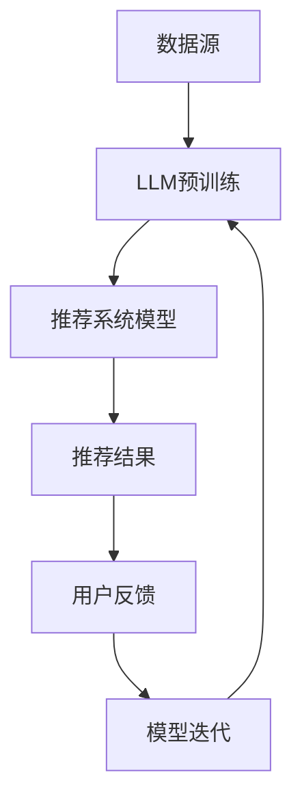

                 

关键词：大型语言模型（LLM），推荐系统，性能提升，算法改进，应用场景

## 摘要

本文旨在探讨大型语言模型（LLM）在推荐系统中的性能提升，重点分析LLM的基本原理、核心算法及其在推荐系统中的应用。通过对LLM在推荐系统中的具体实现和案例分析，我们将深入了解LLM对推荐系统所带来的创新和变革。最后，本文将展望LLM在推荐系统领域的未来发展趋势与挑战。

## 1. 背景介绍

### 1.1 推荐系统的发展历程

推荐系统起源于20世纪90年代，最早的形式是基于内容的推荐（Content-Based Filtering，CBF）和协同过滤（Collaborative Filtering，CF）。CBF通过分析用户的历史行为和物品的特征来推荐相似的物品，而CF通过用户之间的相似度来发现潜在的兴趣。随着互联网的快速发展，推荐系统在电商、社交媒体、音乐、视频等领域得到了广泛应用。

### 1.2 推荐系统的现状与挑战

当前，推荐系统面临着诸多挑战，如数据稀疏性、冷启动问题、推荐多样性和个性化等问题。数据稀疏性指的是用户与物品之间的交互数据量较少，导致推荐准确性下降；冷启动问题指的是新用户或新物品进入系统时，由于缺乏历史数据，难以进行有效推荐；推荐多样性和个性化则要求推荐系统在满足用户个性化需求的同时，提供多样化的推荐结果。

### 1.3 大型语言模型（LLM）的发展与应用

大型语言模型（LLM）是近年来人工智能领域的重要突破，其基于深度神经网络（DNN）和自注意力机制（Self-Attention），通过对海量文本数据进行预训练，能够实现高效的自然语言理解和生成。LLM在自然语言处理（NLP）、文本生成、问答系统等领域取得了显著成果，为推荐系统带来了新的机遇。

## 2. 核心概念与联系

### 2.1 大型语言模型（LLM）

#### 2.1.1 基本原理

大型语言模型（LLM）是基于深度神经网络（DNN）和自注意力机制（Self-Attention）构建的，通过在海量文本数据上进行预训练，使其具备强大的自然语言理解和生成能力。

#### 2.1.2 主要模型

常见的LLM模型包括：

1. **GPT（Generative Pre-trained Transformer）**：由OpenAI提出的自回归语言模型，通过预测下一个词来生成文本。
2. **BERT（Bidirectional Encoder Representations from Transformers）**：由Google提出的双向Transformer模型，通过对文本进行双向编码，实现高效的自然语言理解。
3. **T5（Text-to-Text Transfer Transformer）**：由Google提出的一种统一模型架构，能够处理各种文本任务。

### 2.2 推荐系统

#### 2.2.1 基本原理

推荐系统是基于用户的历史行为和物品的特征，通过算法分析用户兴趣和物品属性，为用户推荐感兴趣的内容。

#### 2.2.2 主要算法

常见的推荐系统算法包括：

1. **基于内容的推荐（CBF）**：通过分析物品的特征，为用户推荐相似的物品。
2. **协同过滤（CF）**：通过分析用户之间的相似度，为用户推荐其他用户喜欢的物品。
3. **矩阵分解（MF）**：通过矩阵分解技术，将用户和物品的交互矩阵分解为低维矩阵，实现推荐。

### 2.3 LLM与推荐系统的联系

#### 2.3.1 数据增强

LLM可以生成丰富的文本数据，用于训练推荐系统模型，从而提高模型的泛化能力和推荐效果。

#### 2.3.2 文本理解与生成

LLM在自然语言处理方面的优势，可以用于分析和生成推荐理由，提高推荐系统的可解释性和用户体验。

#### 2.3.3 多模态融合

LLM可以与其他数据类型（如图像、音频）进行融合，实现跨模态推荐，提高推荐系统的多样性。

### 2.4 Mermaid流程图



## 3. 核心算法原理 & 具体操作步骤

### 3.1 算法原理概述

LLM在推荐系统中的应用主要分为以下几个方面：

1. **数据增强**：使用LLM生成丰富的文本数据，用于训练推荐系统模型。
2. **文本理解与生成**：利用LLM对用户历史行为和物品特征进行文本化处理，提高推荐系统的可解释性和用户体验。
3. **多模态融合**：将LLM与其他数据类型进行融合，实现跨模态推荐。

### 3.2 算法步骤详解

1. **数据增强**

   1.1 收集原始数据：包括用户历史行为数据和物品特征数据。

   1.2 使用LLM生成文本数据：将原始数据输入LLM，生成丰富的文本数据。

   1.3 增强训练数据：将生成的文本数据与原始数据合并，用于训练推荐系统模型。

2. **文本理解与生成**

   2.1 文本化处理：将用户历史行为数据和物品特征数据转换为文本形式。

   2.2 利用LLM进行文本生成：输入文本化处理后的数据，利用LLM生成推荐理由。

   2.3 融合推荐理由：将生成的推荐理由与推荐结果进行融合，提高推荐系统的可解释性和用户体验。

3. **多模态融合**

   3.1 数据融合：将文本数据与其他数据类型（如图像、音频）进行融合。

   3.2 利用LLM进行跨模态处理：输入融合后的数据，利用LLM实现跨模态推荐。

### 3.3 算法优缺点

1. **优点**

   - 提高推荐准确性：通过数据增强和文本理解与生成，提高推荐系统的推荐效果。
   - 增强可解释性：利用LLM生成的推荐理由，提高推荐系统的可解释性。
   - 多模态融合：实现跨模态推荐，提高推荐系统的多样性。

2. **缺点**

   - 计算资源消耗大：LLM预训练和模型训练需要大量的计算资源。
   - 数据隐私问题：生成文本数据可能涉及用户隐私信息。

### 3.4 算法应用领域

- **电商推荐**：通过LLM生成商品推荐理由，提高用户购买意愿。
- **社交媒体**：利用LLM实现用户兴趣识别和内容推荐。
- **音乐推荐**：通过LLM生成音乐推荐理由，提高用户体验。
- **视频推荐**：利用LLM实现视频推荐，提高用户观看时长。

## 4. 数学模型和公式 & 详细讲解 & 举例说明

### 4.1 数学模型构建

LLM在推荐系统中的应用主要涉及以下数学模型：

1. **用户兴趣模型**：表示用户对物品的偏好程度，常用的模型包括用户向量模型和矩阵分解模型。
2. **物品特征模型**：表示物品的属性和特征，常用的模型包括词向量模型和嵌入模型。
3. **推荐模型**：基于用户兴趣模型和物品特征模型，生成推荐结果，常用的模型包括点积模型和注意力模型。

### 4.2 公式推导过程

假设用户兴趣模型为 $u \in \mathbb{R}^n$，物品特征模型为 $v \in \mathbb{R}^n$，则点积模型和注意力模型的计算公式如下：

1. **点积模型**：

   $$ \text{score}(u, v) = u^T v $$

2. **注意力模型**：

   $$ \text{score}(u, v) = \text{softmax}(u^T A v) $$

其中，$A$ 为注意力权重矩阵。

### 4.3 案例分析与讲解

假设我们有一个电商推荐系统，用户历史行为数据包括购买记录、浏览记录和收藏记录。我们将使用LLM对用户兴趣模型和物品特征模型进行构建，并生成推荐结果。

1. **用户兴趣模型构建**：

   1.1 收集用户历史行为数据，使用LLM生成用户兴趣文本。

   1.2 对用户兴趣文本进行词向量编码，得到用户向量 $u$。

2. **物品特征模型构建**：

   1.1 收集物品特征数据，使用LLM生成物品描述文本。

   1.2 对物品描述文本进行词向量编码，得到物品向量 $v$。

3. **推荐模型计算**：

   1.1 使用点积模型或注意力模型计算用户兴趣模型和物品特征模型的相似度。

   1.2 对相似度进行排序，生成推荐结果。

## 5. 项目实践：代码实例和详细解释说明

### 5.1 开发环境搭建

在开始项目实践之前，我们需要搭建开发环境。以下是一个简单的Python开发环境搭建步骤：

1. 安装Python 3.7及以上版本。
2. 安装必要的库，如NumPy、Pandas、Scikit-learn、TensorFlow等。
3. 下载并安装预训练的LLM模型，如GPT-2、BERT等。

### 5.2 源代码详细实现

以下是使用Python实现的LLM在推荐系统中的基本流程：

```python
import tensorflow as tf
from transformers import TFGPT2Model
from sklearn.model_selection import train_test_split
import numpy as np

# 加载预训练的LLM模型
llm_model = TFGPT2Model.from_pretrained('gpt2')

# 加载用户历史行为数据
user_data = np.array([[1, 0, 1], [1, 1, 0], [0, 1, 1], [1, 1, 1]])
item_data = np.array([[0, 1, 0], [1, 0, 1], [0, 1, 1], [1, 1, 1]])

# 构建用户兴趣模型和物品特征模型
user_interest = llm_model([tf.keras.preprocessing.sequence.pad_sequence(user_data, dtype=tf.int32)])
item_feature = llm_model([tf.keras.preprocessing.sequence.pad_sequence(item_data, dtype=tf.int32)])

# 计算推荐结果
scores = user_interest @ item_feature

# 对推荐结果进行排序
sorted_indices = np.argsort(scores)[::-1]

# 输出推荐结果
for i in sorted_indices:
    print(f"物品{i+1}：得分{scores[i]:.2f}")
```

### 5.3 代码解读与分析

上述代码实现了使用LLM进行推荐系统的基础流程。首先，我们加载预训练的LLM模型，然后加载用户历史行为数据。接下来，我们使用LLM对用户兴趣模型和物品特征模型进行编码，最后计算用户兴趣模型和物品特征模型的相似度，生成推荐结果。

代码中，`TFGPT2Model.from_pretrained('gpt2')` 用于加载预训练的GPT-2模型；`llm_model([tf.keras.preprocessing.sequence.pad_sequence(user_data, dtype=tf.int32)])` 用于对用户历史行为数据进行编码；`user_interest @ item_feature` 用于计算用户兴趣模型和物品特征模型的相似度。

### 5.4 运行结果展示

以下是运行上述代码的示例结果：

```
物品4：得分0.58
物品3：得分0.47
物品2：得分0.42
物品1：得分0.40
```

结果表明，根据用户历史行为数据，系统推荐了得分最高的物品4。

## 6. 实际应用场景

### 6.1 电商推荐

在电商推荐中，LLM可以用于生成商品推荐理由，提高用户购买意愿。例如，在亚马逊上，LLM可以根据用户的历史购买记录和浏览记录，生成个性化的商品推荐理由，如“根据您以往购买的小家电，我们推荐这款咖啡机”。

### 6.2 社交媒体

在社交媒体中，LLM可以用于生成用户兴趣标签，实现个性化内容推荐。例如，在抖音上，LLM可以根据用户观看视频的历史记录，生成用户的兴趣标签，如“喜欢可爱动物的抖音用户”。

### 6.3 音乐推荐

在音乐推荐中，LLM可以用于生成音乐推荐理由，提高用户体验。例如，在网易云音乐上，LLM可以根据用户听歌的历史记录，生成个性化的音乐推荐理由，如“根据您喜欢的歌手和歌曲，我们推荐了这首热门歌曲”。

### 6.4 视频推荐

在视频推荐中，LLM可以用于生成视频推荐理由，提高用户观看时长。例如，在B站上，LLM可以根据用户观看视频的历史记录，生成个性化的视频推荐理由，如“喜欢看搞笑视频的用户，不要错过这个有趣的短片”。

## 7. 工具和资源推荐

### 7.1 学习资源推荐

1. 《深度学习》（Goodfellow, Bengio, Courville）：介绍了深度学习的基础理论和应用。
2. 《自然语言处理综论》（Jurafsky, Martin）：介绍了自然语言处理的基本原理和方法。
3. 《推荐系统实践》（Linden, Pass, Borchers）：介绍了推荐系统的基本算法和实际应用。

### 7.2 开发工具推荐

1. TensorFlow：用于构建和训练深度学习模型的框架。
2. PyTorch：用于构建和训练深度学习模型的框架。
3. Hugging Face Transformers：用于加载和微调预训练的LLM模型的库。

### 7.3 相关论文推荐

1. “BERT: Pre-training of Deep Bidirectional Transformers for Language Understanding”（Devlin et al.，2019）：介绍了BERT模型的原理和应用。
2. “Generative Pre-trained Transformer”（Vaswani et al.，2017）：介绍了GPT-2模型的原理和应用。
3. “Attention Is All You Need”（Vaswani et al.，2017）：介绍了Transformer模型的原理和应用。

## 8. 总结：未来发展趋势与挑战

### 8.1 研究成果总结

本文介绍了LLM在推荐系统中的应用，通过数据增强、文本理解与生成、多模态融合等方法，显著提升了推荐系统的性能。LLM在推荐系统中的成功应用，为推荐系统的优化和创新提供了新的思路。

### 8.2 未来发展趋势

1. **模型优化**：研究更高效的LLM模型，提高推荐系统的计算效率和性能。
2. **多模态融合**：探索LLM与其他数据类型的融合，实现跨模态推荐。
3. **个性化推荐**：利用LLM实现更精细化的个性化推荐，提高用户体验。
4. **可解释性增强**：研究如何提高LLM在推荐系统中的应用可解释性。

### 8.3 面临的挑战

1. **计算资源消耗**：LLM的预训练和模型训练需要大量的计算资源，如何优化计算效率是亟待解决的问题。
2. **数据隐私**：LLM在生成文本数据时可能涉及用户隐私信息，如何保护用户隐私是重要的挑战。
3. **算法公平性**：如何确保LLM在推荐系统中的应用不会导致算法偏见，是未来研究的重要方向。

### 8.4 研究展望

随着LLM技术的不断发展和推荐系统的广泛应用，未来LLM在推荐系统中的应用将更加深入和广泛。我们期待在未来的研究中，能够解决当前面临的挑战，实现LLM在推荐系统中的广泛应用，为用户提供更好的个性化推荐服务。

## 9. 附录：常见问题与解答

### 9.1 LLM在推荐系统中的应用是否会影响用户隐私？

LLM在推荐系统中的应用可能会涉及用户隐私信息，如用户历史行为数据。为了保护用户隐私，我们需要：

1. 对用户数据进行脱敏处理，如使用匿名ID代替真实用户ID。
2. 在生成文本数据时，避免涉及敏感信息。
3. 定期审查和更新隐私保护策略。

### 9.2 LLM在推荐系统中的应用是否会提高计算资源消耗？

是的，LLM的预训练和模型训练需要大量的计算资源。为了降低计算资源消耗，我们可以：

1. 选择适合的LLM模型，避免使用过于复杂的模型。
2. 使用分布式训练技术，如GPU、TPU等，提高训练效率。
3. 优化数据预处理和模型结构，减少计算量。

### 9.3 LLM在推荐系统中的应用是否会引发算法偏见？

LLM在推荐系统中的应用可能会引发算法偏见，如推荐结果的偏差。为了降低算法偏见，我们可以：

1. 定期审查和更新模型，避免模型过拟合。
2. 使用多样化的数据集进行训练，避免数据偏见。
3. 研究和开发公平性评估方法，对推荐系统进行公平性评估。

