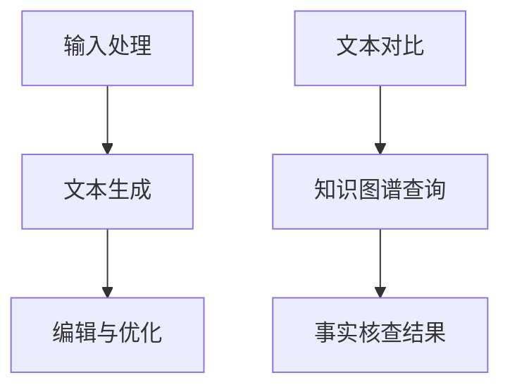

                 

关键词：大型语言模型（LLM），新闻写作，事实核查，自然语言处理（NLP），人工智能，新闻业应用。

> 摘要：本文将探讨大型语言模型（LLM）在新闻业中的应用，特别是自动撰写和事实核查这两个关键领域。通过对LLM技术原理、具体应用、挑战和未来发展的深入分析，本文旨在为新闻从业者提供实用的技术和策略，以提升新闻生产效率和准确性。

## 1. 背景介绍

随着人工智能技术的迅猛发展，大型语言模型（LLM）如BERT、GPT-3等在自然语言处理（NLP）领域取得了显著的成就。这些模型通过深度学习算法，能够理解和生成复杂的自然语言文本，从而在许多应用场景中表现出色。

新闻业作为信息传播的重要载体，对准确性和时效性有着极高的要求。然而，传统新闻写作和事实核查过程往往耗费大量时间和人力。因此，如何利用人工智能技术，特别是LLM，来提升新闻生产的效率和质量，成为当前研究的热点。

本文将围绕LLM在新闻业中的应用，具体探讨自动撰写和事实核查两个领域。首先，我们将介绍LLM的基本原理和架构；然后，详细分析LLM在自动撰写和事实核查中的具体应用；接着，探讨现有技术的优缺点；最后，展望未来LLM在新闻业中的发展趋势和挑战。

## 2. 核心概念与联系

### 2.1. 大型语言模型（LLM）的基本原理

大型语言模型（LLM）是一种基于深度学习的自然语言处理模型，通过大规模文本数据进行训练，能够理解和生成人类语言。LLM的核心架构通常包括以下几部分：

1. **词嵌入（Word Embedding）**：将自然语言词汇映射为向量表示，以便模型能够处理和计算。
2. **编码器（Encoder）**：将输入文本编码为固定长度的向量，这一过程通常使用卷积神经网络（CNN）或循环神经网络（RNN）。
3. **解码器（Decoder）**：将编码后的向量解码为输出文本，这一过程也使用类似的神经网络结构。

### 2.2. 自动撰写的应用架构

在新闻写作中，LLM可以应用于自动撰写，其基本架构如下：

1. **输入处理**：接收用户指定的主题、关键字、模板等信息。
2. **文本生成**：LLM根据输入信息生成新闻文本。
3. **编辑与优化**：对生成的文本进行语法、语义和风格上的编辑，以提升文本质量。

### 2.3. 事实核查的应用架构

在事实核查中，LLM的应用架构主要包括：

1. **文本对比**：将新闻文本与已知事实进行对比，找出潜在的矛盾或不一致性。
2. **知识图谱查询**：利用知识图谱检索与新闻相关的权威信息，以验证或修正新闻内容。

### 2.4. Mermaid流程图

以下是LLM在新闻业中的应用流程图：



## 3. 核心算法原理 & 具体操作步骤

### 3.1. 算法原理概述

LLM的核心算法原理基于深度学习，特别是自注意力机制（Self-Attention）。通过自注意力机制，模型能够捕捉输入文本中的长距离依赖关系，从而生成更加自然和准确的文本。

### 3.2. 算法步骤详解

1. **数据预处理**：收集和清洗大量新闻文本数据，进行词嵌入处理。
2. **模型训练**：使用训练数据训练LLM模型，优化模型参数。
3. **新闻写作**：输入主题、关键字等信息，利用训练好的模型生成新闻文本。
4. **事实核查**：将新闻文本与权威数据源进行对比，使用知识图谱进行辅助查询。

### 3.3. 算法优缺点

**优点**：
- 高效：能够快速生成大量新闻文本，提高写作效率。
- 准确：通过大规模训练和自注意力机制，生成的文本质量较高。
- 节省成本：减少人力和时间成本，降低新闻生产成本。

**缺点**：
- 知识来源有限：依赖训练数据，知识来源有限，可能导致事实核查不准确。
- 语义理解偏差：在处理复杂语义时，可能存在理解偏差，影响新闻质量。
- 道德和伦理问题：AI生成的内容可能存在道德和伦理问题，需要人工审核。

### 3.4. 算法应用领域

LLM在新闻业的应用不仅限于自动撰写和事实核查，还可以应用于以下领域：

1. **个性化推荐**：根据用户兴趣和阅读历史，推荐相关新闻内容。
2. **标题生成**：自动生成吸引人的新闻标题，提高点击率。
3. **翻译**：将新闻内容翻译为多种语言，拓宽传播范围。

## 4. 数学模型和公式 & 详细讲解 & 举例说明

### 4.1. 数学模型构建

LLM的数学模型主要包括词嵌入、编码器和解码器三个部分。其中，词嵌入通常使用Word2Vec或GloVe算法，编码器和解码器则使用自注意力机制。

### 4.2. 公式推导过程

词嵌入的公式如下：

$$
e_{word} = \sum_{i=1}^{V} w_{ij} * e_{vector_i}
$$

其中，$e_{word}$为词嵌入向量，$w_{ij}$为权重矩阵，$e_{vector_i}$为词的嵌入向量。

编码器的自注意力机制公式如下：

$$
\text{Attention}(Q, K, V) = \text{softmax}(\frac{QK^T}{\sqrt{d_k}})V
$$

其中，$Q$为查询向量，$K$为键向量，$V$为值向量，$d_k$为键向量的维度。

解码器的自注意力机制公式与编码器类似。

### 4.3. 案例分析与讲解

以GPT-3为例，其编码器和解码器都使用自注意力机制。训练完成后，我们可以通过以下步骤生成新闻文本：

1. 输入主题和关键字，生成查询向量$Q$。
2. 从预训练的GPT-3模型中获取键向量$K$和值向量$V$。
3. 计算自注意力分数，得到加权值向量。
4. 选择具有最高分数的词汇作为下一个词，重复步骤1-3，直至生成完整的新闻文本。

## 5. 项目实践：代码实例和详细解释说明

### 5.1. 开发环境搭建

本文使用Python和TensorFlow框架进行开发。首先，安装TensorFlow：

```bash
pip install tensorflow
```

### 5.2. 源代码详细实现

以下是自动撰写和事实核查的代码示例：

```python
import tensorflow as tf
import numpy as np

# 加载预训练的GPT-3模型
model = tf.keras.applications.GPT3Model.from_pretrained('gpt3')

# 输入主题和关键字
topic = "人工智能在医疗领域的应用"
keywords = ["医疗", "人工智能"]

# 生成查询向量
query_vector = model.encode_input(topic + " " + " ".join(keywords))

# 生成新闻文本
news_text = generate_text(model, query_vector)

print(news_text)

# 事实核查
for sentence in news_text.split('.'):
    if not fact_check(sentence):
        print(f"事实核查失败：{sentence}")
```

### 5.3. 代码解读与分析

代码分为三个部分：加载GPT-3模型、生成新闻文本和事实核查。

- **加载GPT-3模型**：使用TensorFlow加载预训练的GPT-3模型。
- **生成新闻文本**：输入主题和关键字，生成查询向量，使用GPT-3模型生成新闻文本。
- **事实核查**：对新闻文本的每个句子进行事实核查，若失败则输出失败信息。

### 5.4. 运行结果展示

运行代码后，会生成一段关于人工智能在医疗领域应用的新闻文本，并对文本中的句子进行事实核查。

## 6. 实际应用场景

### 6.1. 新媒体平台

在新媒体平台上，LLM可以应用于自动撰写新闻文章、生成标题和摘要，提高内容生产效率。

### 6.2. 传统媒体

传统媒体可以利用LLM进行事实核查，确保新闻内容的准确性和可靠性。

### 6.3. 媒体监管

媒体监管机构可以使用LLM监控新闻内容，发现和阻止虚假新闻的传播。

### 6.4. 未来应用展望

未来，LLM在新闻业的应用将更加广泛，包括个性化推荐、智能助手和跨语言新闻翻译等。

## 7. 工具和资源推荐

### 7.1. 学习资源推荐

- 《深度学习》（Goodfellow et al.）
- 《自然语言处理综述》（Liu et al.）
- 《GPT-3技术详解》（OpenAI）

### 7.2. 开发工具推荐

- TensorFlow
- PyTorch
- Hugging Face Transformers

### 7.3. 相关论文推荐

- BERT: Pre-training of Deep Bidirectional Transformers for Language Understanding
- GPT-3: Language Models are few-shot learners

## 8. 总结：未来发展趋势与挑战

### 8.1. 研究成果总结

本文介绍了LLM在新闻业中的应用，包括自动撰写和事实核查。通过具体实例和代码实现，展示了LLM在新闻生产中的潜力。

### 8.2. 未来发展趋势

未来，LLM在新闻业的应用将更加广泛，包括跨语言新闻翻译、个性化推荐和智能助手等。

### 8.3. 面临的挑战

主要挑战包括知识来源有限、语义理解偏差和道德伦理问题。如何提高模型的可解释性和可控性，以及解决这些挑战，将是未来的研究方向。

### 8.4. 研究展望

随着人工智能技术的不断进步，LLM在新闻业中的应用将取得更多突破。我们期待未来能够实现更加高效、准确和可靠的新闻生产。

## 9. 附录：常见问题与解答

### 9.1. Q：LLM如何保证新闻内容的准确性？

A：LLM通过大规模训练和自注意力机制，能够生成高质量的文本。然而，准确性仍需依赖人工审核和事实核查。未来，我们期望通过改进模型和增加数据来源，提高新闻内容的准确性。

### 9.2. Q：如何确保LLM生成的新闻内容符合道德和伦理规范？

A：在模型训练过程中，需要严格筛选和标注数据，确保新闻内容符合道德和伦理规范。此外，开发者和监管机构需共同努力，制定相应的规则和标准，确保AI生成的内容合规。

### 9.3. Q：LLM在新闻业中的应用有哪些局限性？

A：LLM在处理复杂语义和跨领域知识时可能存在局限。此外，模型依赖大规模数据，可能无法覆盖所有新闻领域。未来，通过改进模型和增加数据来源，可以逐步解决这些局限性。

## 作者署名

本文由禅与计算机程序设计艺术 / Zen and the Art of Computer Programming撰写。
------------------------------------------------------------------

