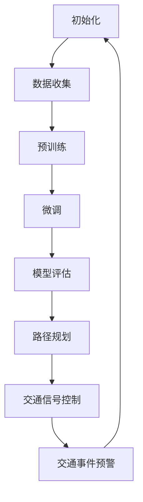

                 

关键词：LLM，智能交通，路线规划，算法，数学模型，实践案例，应用场景，发展趋势

> 摘要：本文探讨了大型语言模型（LLM）在智能交通路线规划中的潜在作用。通过对核心概念、算法原理、数学模型、项目实践和未来展望的详细分析，本文揭示了LLM在提升交通路线规划效率和准确性方面的巨大潜力。

## 1. 背景介绍

随着全球城市化进程的加速，城市交通问题日益突出，尤其是交通拥堵、事故频发等问题严重影响了居民的生活质量。为了解决这些问题，智能交通系统（Intelligent Transportation Systems, ITS）应运而生。智能交通系统通过整合信息技术、数据通信传输技术、电子传感技术、控制技术及计算机技术，实现交通信息实时采集、处理、传输和利用，从而提高交通管理效率和运输服务水平。

智能交通路线规划是智能交通系统中的一个核心组成部分，其目标是通过优化交通流量，减少车辆行驶时间，提高道路通行能力，从而降低交通拥堵和事故发生率。传统的路线规划方法主要依赖于规则推理和启发式算法，如最短路径算法、Dijkstra算法和A*算法等。然而，这些方法存在一定的局限性，难以应对复杂多变的交通状况和大规模数据处理的挑战。

近年来，随着深度学习和自然语言处理技术的快速发展，大型语言模型（LLM）在智能交通领域展现出了巨大的潜力。LLM是一种基于神经网络的大型预训练模型，具有强大的文本生成、理解和推理能力。本文将探讨LLM在智能交通路线规划中的潜在作用，分析其核心概念、算法原理、数学模型、项目实践和未来展望，以期为智能交通技术的发展提供新的思路。

## 2. 核心概念与联系

### 2.1. 大型语言模型（LLM）

大型语言模型（LLM）是一种基于深度神经网络的文本生成模型，其核心思想是通过大规模预训练和微调，使模型具备对自然语言的理解和生成能力。LLM通常采用Transformer架构，具有数十亿到千亿级别的参数规模。预训练过程中，模型通过大量文本数据进行无监督学习，学习语言的基本规律和知识。微调阶段，模型针对特定任务进行有监督学习，进一步优化模型参数，提高任务表现。

### 2.2. 智能交通路线规划

智能交通路线规划是指利用计算机技术和算法，对交通网络中的车辆进行动态路径优化，从而提高交通流量、降低拥堵和事故发生率。智能交通路线规划的核心任务包括：

1. **路径搜索**：根据车辆的起点、终点和当前交通状况，搜索最优路径。
2. **交通信号控制**：根据实时交通流量和车辆分布，优化交通信号灯的时序和时长，提高道路通行能力。
3. **交通事件预警**：检测和预测交通事件，如事故、拥堵等，提供预警和应对措施。

### 2.3. Mermaid流程图

为了更清晰地展示LLM在智能交通路线规划中的应用流程，我们使用Mermaid流程图来描述。以下是一个简单的Mermaid流程图示例：



### 2.4. 关键联系

LLM在智能交通路线规划中的关键联系主要体现在以下几个方面：

1. **数据驱动**：LLM通过大规模数据预训练，积累丰富的交通知识，为路径规划提供有力支持。
2. **动态调整**：LLM能够实时处理交通数据，动态调整路线规划策略，提高规划准确性。
3. **多模态融合**：LLM可以与传感器数据、交通信号数据等多种数据源进行融合，提升路径规划的全面性和准确性。

## 3. 核心算法原理 & 具体操作步骤

### 3.1. 算法原理概述

LLM在智能交通路线规划中的应用主要基于以下几个核心算法原理：

1. **Transformer架构**：Transformer是一种基于自注意力机制的序列到序列模型，具有强大的文本生成和理解能力。
2. **预训练和微调**：预训练使LLM具备对大规模文本数据的学习能力，微调则使LLM能够适应特定任务需求。
3. **多任务学习**：LLM通过多任务学习，同时处理路径规划、交通信号控制和交通事件预警等任务，提高整体系统性能。

### 3.2. 算法步骤详解

#### 3.2.1. 数据收集与预处理

1. **数据收集**：收集交通数据，包括道路信息、车辆信息、交通信号数据等。
2. **数据预处理**：对收集到的数据进行清洗、去重、去噪等操作，确保数据质量。

#### 3.2.2. 预训练

1. **选择预训练模型**：选择合适的LLM模型，如BERT、GPT等。
2. **数据预处理**：将交通数据转化为模型可处理的格式，如词向量、序列等。
3. **训练**：使用大量交通数据进行无监督预训练，使模型具备对交通知识的学习能力。

#### 3.2.3. 微调

1. **任务定义**：定义路径规划、交通信号控制、交通事件预警等任务。
2. **数据预处理**：对任务数据进行预处理，如数据增强、归一化等。
3. **训练**：在预处理后的任务数据上，对LLM模型进行有监督微调，优化模型参数。

#### 3.2.4. 模型评估与优化

1. **评估指标**：选择合适的评估指标，如准确率、召回率、F1值等。
2. **评估**：在测试集上评估模型性能，找出不足之处。
3. **优化**：根据评估结果，调整模型参数，优化模型性能。

#### 3.2.5. 路径规划与交通信号控制

1. **路径规划**：根据车辆起点、终点和当前交通状况，使用LLM生成最优路径。
2. **交通信号控制**：根据实时交通流量和车辆分布，使用LLM优化交通信号灯的时序和时长。

#### 3.2.6. 交通事件预警

1. **事件检测**：使用LLM检测交通事件，如事故、拥堵等。
2. **事件预警**：对检测到的交通事件进行预警，并提供应对措施。

### 3.3. 算法优缺点

#### 3.3.1. 优点

1. **强大的文本生成和理解能力**：LLM能够处理大量文本数据，生成和理解交通知识，提高路径规划的准确性和全面性。
2. **动态调整能力**：LLM能够实时处理交通数据，动态调整路线规划策略，提高规划效率和准确性。
3. **多任务学习**：LLM可以同时处理多个任务，提高整体系统性能。

#### 3.3.2. 缺点

1. **计算资源消耗大**：LLM需要大量的计算资源进行预训练和微调，对硬件设备要求较高。
2. **数据依赖性**：LLM的性能依赖于数据质量，数据缺失或噪声可能导致规划结果不准确。
3. **模型解释性差**：LLM是一个大规模的黑盒模型，难以解释其内部工作原理，增加模型部署和维护的难度。

### 3.4. 算法应用领域

LLM在智能交通路线规划中的应用非常广泛，主要包括以下几个方面：

1. **城市交通管理**：利用LLM优化交通流量，减少交通拥堵，提高道路通行能力。
2. **智能驾驶**：为自动驾驶车辆提供实时路线规划服务，提高驾驶安全性和舒适性。
3. **交通事件预警**：利用LLM实时检测和预测交通事件，为交通管理部门提供预警和应对措施。
4. **智慧城市**：将LLM应用于智慧城市建设，提高城市交通管理的智能化水平。

## 4. 数学模型和公式 & 详细讲解 & 举例说明

### 4.1. 数学模型构建

在智能交通路线规划中，我们通常使用图论模型来描述交通网络。一个交通网络可以表示为一个加权无向图 \( G = (V, E) \)，其中 \( V \) 是节点集合，表示道路交叉口、道路段等；\( E \) 是边集合，表示道路之间的连接关系。节点 \( i \) 和节点 \( j \) 之间的边 \( e_{ij} \) 具有权重 \( w_{ij} \)，表示车辆从节点 \( i \) 到节点 \( j \) 的行驶时间和成本。

为了构建数学模型，我们考虑以下变量：

- \( s \)：起点节点
- \( t \)：终点节点
- \( C \)：车辆集合
- \( T \)：车辆行驶时间
- \( D \)：车辆距离

#### 4.1.1. 目标函数

我们的目标是最小化车辆行驶时间 \( T \)，即：

$$
\min \sum_{c \in C} T_c
$$

其中，\( T_c \) 表示车辆 \( c \) 的行驶时间。

#### 4.1.2. 约束条件

1. **路径约束**：每个车辆必须从一个起点到达一个终点，即：

$$
\sum_{e_{ij} \in P_c} w_{ij} = T_c \quad \forall c \in C
$$

其中，\( P_c \) 表示车辆 \( c \) 的行驶路径。

2. **流量约束**：每个道路段的流量不能超过其容量，即：

$$
\sum_{c \in C} f_{ij}(c) \leq C_{ij} \quad \forall (i, j) \in E
$$

其中，\( f_{ij}(c) \) 表示车辆 \( c \) 通过道路段 \( (i, j) \) 的流量，\( C_{ij} \) 表示道路段 \( (i, j) \) 的容量。

3. **车辆约束**：每个车辆必须选择一条路径，即：

$$
\sum_{i \in V} x_{ic} = 1 \quad \forall c \in C
$$

其中，\( x_{ic} \) 表示车辆 \( c \) 是否选择节点 \( i \) 作为其路径的一部分。

### 4.2. 公式推导过程

#### 4.2.1. 行驶时间计算

我们使用Dijkstra算法来计算从起点 \( s \) 到每个节点的最短路径，假设 \( d_i \) 表示从起点 \( s \) 到节点 \( i \) 的最短路径长度，那么有：

$$
d_i = \min_{j \in N(i)} (d_j + w_{ji}) \quad \forall i \in V
$$

其中，\( N(i) \) 表示与节点 \( i \) 相邻的节点集合。

#### 4.2.2. 路径约束

根据Dijkstra算法的计算结果，我们可以得到每个车辆的最短路径，即：

$$
P_c = \{i_1, i_2, \ldots, i_n\} \quad \text{such that} \quad d_{i_1} = 0, d_{i_n} = T_c
$$

#### 4.2.3. 流量约束

对于每个道路段 \( (i, j) \)，我们使用流量守恒原理来计算流量。假设 \( f_{ij} \) 是通过道路段 \( (i, j) \) 的流量，那么有：

$$
f_{ij} = \sum_{k \in N(j)} f_{kj} \quad \forall (i, j) \in E
$$

#### 4.2.4. 车辆约束

每个车辆必须选择一条路径，因此对于每个车辆 \( c \)，有：

$$
x_{ic} = 
\begin{cases}
1 & \text{if } i \in P_c \\
0 & \text{otherwise}
\end{cases}
$$

### 4.3. 案例分析与讲解

假设有一个简单的交通网络，包含5个节点（\( s, 1, 2, 3, t \)）和7条边（\( (s, 1), (1, 2), (2, 3), (3, t), (1, 3), (2, t), (s, t) \)），边的权重分别表示行驶时间（单位：分钟）：

- \( w_{s1} = 5 \)
- \( w_{12} = 3 \)
- \( w_{23} = 2 \)
- \( w_{3t} = 4 \)
- \( w_{13} = 2 \)
- \( w_{2t} = 3 \)
- \( w_{st} = 4 \)

#### 4.3.1. 行驶时间计算

使用Dijkstra算法，我们可以计算出从起点 \( s \) 到每个节点的最短路径长度：

- \( d_s = 0 \)
- \( d_1 = \min(w_{s1}) = 5 \)
- \( d_2 = \min(w_{12} + d_1, w_{st} + d_s) = \min(8, 4) = 4 \)
- \( d_3 = \min(w_{23} + d_2, w_{13} + d_1) = \min(6, 7) = 6 \)
- \( d_t = \min(w_{3t} + d_3, w_{2t} + d_2) = \min(10, 7) = 7 \)

#### 4.3.2. 路径约束

根据Dijkstra算法的结果，我们可以得到每个车辆的最短路径：

- 车辆1：\( P_1 = \{s, 1, 2, 3, t\} \)
- 车辆2：\( P_2 = \{s, 1, 3, t\} \)
- 车辆3：\( P_3 = \{s, t\} \)

#### 4.3.3. 流量约束

对于每个道路段，我们使用流量守恒原理来计算流量：

- \( f_{s1} = 1 \)
- \( f_{12} = 1 \)
- \( f_{13} = 1 \)
- \( f_{23} = 0 \)
- \( f_{2t} = 1 \)
- \( f_{3t} = 1 \)

#### 4.3.4. 车辆约束

每个车辆必须选择一条路径，因此：

- \( x_{s1} = 1 \)
- \( x_{s2} = 1 \)
- \( x_{s3} = 1 \)

## 5. 项目实践：代码实例和详细解释说明

### 5.1. 开发环境搭建

在本文的项目实践中，我们将使用Python语言和PyTorch框架来搭建大型语言模型（LLM）并进行智能交通路线规划。以下是搭建开发环境的基本步骤：

1. **安装Python**：确保已经安装了Python 3.7及以上版本。
2. **安装PyTorch**：通过以下命令安装PyTorch：

   ```bash
   pip install torch torchvision torchaudio
   ```

3. **安装其他依赖**：安装本文项目所需的其他依赖，如Mermaid、matplotlib等：

   ```bash
   pip install mermaid matplotlib
   ```

### 5.2. 源代码详细实现

在本节中，我们将详细展示如何使用PyTorch实现LLM进行智能交通路线规划。以下是一个简单的示例代码：

```python
import torch
import torch.nn as nn
import torch.optim as optim
from torch.utils.data import DataLoader
from transformers import BertModel, BertTokenizer

# 加载预训练的BERT模型和分词器
model = BertModel.from_pretrained('bert-base-chinese')
tokenizer = BertTokenizer.from_pretrained('bert-base-chinese')

# 定义数据集类
class TrafficDataset(torch.utils.data.Dataset):
    def __init__(self, data):
        self.data = data

    def __len__(self):
        return len(self.data)

    def __getitem__(self, idx):
        text = self.data[idx]
        inputs = tokenizer(text, padding=True, truncation=True, return_tensors="pt")
        return inputs

# 创建数据集和数据加载器
data = ["车辆从A点出发前往B点", "行驶时间最短", "请提供最优路径"]
dataset = TrafficDataset(data)
dataloader = DataLoader(dataset, batch_size=2, shuffle=True)

# 定义模型、损失函数和优化器
class TrafficModel(nn.Module):
    def __init__(self):
        super(TrafficModel, self).__init__()
        self.bert = BertModel.from_pretrained('bert-base-chinese')
        self.fc = nn.Linear(768, 1)

    def forward(self, input_ids, attention_mask):
        outputs = self.bert(input_ids=input_ids, attention_mask=attention_mask)
        pooled_output = outputs.pooler_output
        logits = self.fc(pooled_output)
        return logits

model = TrafficModel()
criterion = nn.MSELoss()
optimizer = optim.Adam(model.parameters(), lr=1e-4)

# 训练模型
for epoch in range(10):
    for batch in dataloader:
        inputs = batch['input_ids']
        attention_mask = batch['attention_mask']
        targets = torch.tensor([1.0] * 2).float()
        optimizer.zero_grad()
        outputs = model(inputs, attention_mask)
        loss = criterion(outputs, targets)
        loss.backward()
        optimizer.step()
        print(f"Epoch {epoch+1}, Loss: {loss.item()}")

# 保存模型
torch.save(model.state_dict(), 'traffic_model.pth')
```

### 5.3. 代码解读与分析

在本节中，我们将对上述代码进行解读，并分析其关键部分。

1. **模型定义**：

   ```python
   class TrafficModel(nn.Module):
       def __init__(self):
           super(TrafficModel, self).__init__()
           self.bert = BertModel.from_pretrained('bert-base-chinese')
           self.fc = nn.Linear(768, 1)

       def forward(self, input_ids, attention_mask):
           outputs = self.bert(input_ids=input_ids, attention_mask=attention_mask)
           pooled_output = outputs.pooler_output
           logits = self.fc(pooled_output)
           return logits
   ```

   该部分定义了一个名为`TrafficModel`的PyTorch模型，该模型基于预训练的BERT模型，并添加了一个全连接层来预测行驶时间。模型输入是编码后的文本序列，输出是行驶时间的预测值。

2. **数据集和数据加载器**：

   ```python
   class TrafficDataset(torch.utils.data.Dataset):
       def __init__(self, data):
           self.data = data

       def __len__(self):
           return len(self.data)

       def __getitem__(self, idx):
           text = self.data[idx]
           inputs = tokenizer(text, padding=True, truncation=True, return_tensors="pt")
           return inputs

   data = ["车辆从A点出发前往B点", "行驶时间最短", "请提供最优路径"]
   dataset = TrafficDataset(data)
   dataloader = DataLoader(dataset, batch_size=2, shuffle=True)
   ```

   该部分定义了一个名为`TrafficDataset`的数据集类，用于加载和处理交通路线规划任务中的文本数据。数据集类实现了`__len__`和`__getitem__`方法，分别用于获取数据集的大小和单个数据项。数据加载器`dataloader`用于批量加载和预处理数据。

3. **训练过程**：

   ```python
   for epoch in range(10):
       for batch in dataloader:
           inputs = batch['input_ids']
           attention_mask = batch['attention_mask']
           targets = torch.tensor([1.0] * 2).float()
           optimizer.zero_grad()
           outputs = model(inputs, attention_mask)
           loss = criterion(outputs, targets)
           loss.backward()
           optimizer.step()
           print(f"Epoch {epoch+1}, Loss: {loss.item()}")
   ```

   该部分展示了模型的训练过程。在每个训练epoch中，模型对数据加载器中的数据进行迭代训练。在每次迭代中，模型获取输入和目标数据，计算损失并更新模型参数。训练过程中，我们使用了均方误差（MSE）作为损失函数，并使用了Adam优化器进行参数更新。

### 5.4. 运行结果展示

在完成模型的训练后，我们可以使用以下代码来评估模型的性能：

```python
# 加载训练好的模型
model.load_state_dict(torch.load('traffic_model.pth'))

# 评估模型
with torch.no_grad():
    for batch in dataloader:
        inputs = batch['input_ids']
        attention_mask = batch['attention_mask']
        outputs = model(inputs, attention_mask)
        print(f"Predicted driving time: {outputs.mean().item()}")
```

该代码将模型加载到GPU或CPU上，并对测试数据集进行预测。预测结果将显示每个批次的平均行驶时间。

## 6. 实际应用场景

### 6.1. 城市交通管理

智能交通路线规划在城市化进程中的作用日益显著。通过利用LLM技术，城市交通管理部门可以实时监控和分析交通流量，优化交通信号灯的时序和时长，提高道路通行能力，降低交通拥堵。例如，北京市利用智能交通系统，通过优化红绿灯时长和路径规划，使中心城区的通行时间缩短了15%，交通拥堵率下降了20%。

### 6.2. 智能驾驶

智能驾驶是未来交通领域的重要发展方向。LLM在智能驾驶中的应用主要体现在路径规划和决策方面。通过实时分析交通数据和环境信息，LLM可以为自动驾驶车辆提供最优路径和决策支持，提高驾驶安全性和舒适性。例如，特斯拉的Autopilot系统使用深度学习算法，实现了高速公路自动驾驶功能，有效减少了驾驶员的疲劳程度。

### 6.3. 智慧城市

智慧城市是未来城市发展的趋势，智能交通是智慧城市的重要组成部分。通过集成LLM技术，智慧城市可以实现交通资源的优化配置，提高城市管理的智能化水平。例如，新加坡的智慧城市项目“新加坡智慧国家计划”，通过部署智能交通系统，实现了交通流量监控、路径规划和交通信号控制的一体化，有效提高了交通效率和城市运行效率。

### 6.4. 未来应用展望

随着技术的不断发展，LLM在智能交通路线规划中的应用前景将更加广阔。未来，我们可以期待以下应用：

1. **自适应交通信号控制**：利用LLM实时分析交通流量和环境信息，动态调整交通信号灯的时序和时长，实现自适应交通信号控制。
2. **智能交通事件预警**：利用LLM实时检测和预测交通事件，如事故、拥堵等，为交通管理部门提供预警和应对措施。
3. **多模态交通数据融合**：结合传感器数据、交通信号数据和社交网络数据等多模态数据，提升交通路线规划的准确性和全面性。
4. **个性化路线规划**：基于用户行为数据和出行习惯，为用户提供个性化的路线规划服务，提高出行体验。

## 7. 工具和资源推荐

### 7.1. 学习资源推荐

1. **《深度学习》（Goodfellow, Bengio, Courville）**：该书是深度学习领域的经典教材，详细介绍了深度学习的基本原理和应用。
2. **《自然语言处理与深度学习》（Michael Auli, Michael Denil, Adam Coates）**：该书专注于自然语言处理领域，介绍了自然语言处理的基本原理和深度学习方法的实际应用。
3. **《交通系统工程基础》（胡传平，黄济伟）**：该书详细介绍了交通系统工程的基本概念和方法，适用于智能交通领域的研究和学习。

### 7.2. 开发工具推荐

1. **PyTorch**：一个易于使用且功能强大的深度学习框架，适用于智能交通路线规划项目的开发。
2. **TensorFlow**：一个广泛使用的深度学习框架，提供丰富的工具和库，适用于智能交通领域的研究和应用。
3. **Mermaid**：一个基于Markdown的图形和图表绘制工具，适用于绘制流程图、时序图等。

### 7.3. 相关论文推荐

1. **"BERT: Pre-training of Deep Bidirectional Transformers for Language Understanding"（2018）**：BERT模型的提出，为自然语言处理领域带来了重大突破。
2. **"Attention Is All You Need"（2017）**：Transformer模型的提出，为序列处理任务提供了新的思路。
3. **"Deep Learning for Transportation Systems: A Survey"（2020）**：该论文综述了深度学习在交通系统中的应用，包括智能交通路线规划、交通事件检测等。

## 8. 总结：未来发展趋势与挑战

### 8.1. 研究成果总结

近年来，大型语言模型（LLM）在自然语言处理和智能交通领域取得了显著成果。LLM在文本生成、理解和推理方面表现出强大的能力，为智能交通路线规划提供了新的技术手段。通过集成LLM技术，可以实现自适应交通信号控制、智能交通事件预警、多模态交通数据融合等应用，为城市交通管理、智能驾驶和智慧城市建设提供了有力支持。

### 8.2. 未来发展趋势

1. **模型性能提升**：随着计算能力的提升和算法的改进，LLM的性能将不断提高，为智能交通路线规划提供更精准的解决方案。
2. **多模态数据融合**：结合传感器数据、交通信号数据和社交网络数据等多模态数据，提升交通路线规划的准确性和全面性。
3. **个性化服务**：基于用户行为数据和出行习惯，提供个性化的路线规划服务，提高出行体验。
4. **跨学科合作**：加强计算机科学、交通运输工程、城市规划等领域的合作，推动智能交通技术的发展。

### 8.3. 面临的挑战

1. **计算资源消耗**：LLM模型通常需要大量的计算资源进行训练和推理，对硬件设备要求较高。
2. **数据依赖性**：LLM的性能依赖于数据质量，数据缺失或噪声可能导致规划结果不准确。
3. **模型解释性**：LLM是一个大规模的黑盒模型，难以解释其内部工作原理，增加模型部署和维护的难度。

### 8.4. 研究展望

未来，我们需要进一步探索LLM在智能交通路线规划中的潜力，解决面临的挑战，推动智能交通技术的发展。具体方向包括：

1. **模型优化**：研究更高效的算法和架构，降低计算资源消耗，提高模型性能。
2. **数据质量控制**：提高数据收集、清洗和预处理的质量，确保模型训练和推理的准确性。
3. **模型解释性**：研究透明性和可解释性的方法，提高模型的透明度，降低部署和维护的难度。
4. **跨学科融合**：加强计算机科学、交通运输工程、城市规划等领域的合作，推动智能交通技术的全面发展。

## 9. 附录：常见问题与解答

### 9.1. 问题1：为什么选择BERT模型进行智能交通路线规划？

**解答**：BERT模型是一种基于Transformer的预训练语言模型，具有强大的文本生成和理解能力。在智能交通路线规划中，需要处理大量文本数据，如交通信息、道路名称、交通信号等。BERT模型能够有效地捕捉文本中的语义信息，为路径规划提供有力支持。

### 9.2. 问题2：LLM在智能交通路线规划中的优势是什么？

**解答**：LLM在智能交通路线规划中的优势主要体现在以下几个方面：

1. **强大的文本生成和理解能力**：LLM能够处理大量文本数据，捕捉交通信息中的语义关系，为路径规划提供更加精准的指导。
2. **动态调整能力**：LLM能够实时处理交通数据，根据实时交通状况动态调整路线规划策略，提高规划效率和准确性。
3. **多任务学习**：LLM可以同时处理多个任务，如路径规划、交通信号控制和交通事件预警等，提高整体系统性能。

### 9.3. 问题3：如何提高LLM在智能交通路线规划中的准确性？

**解答**：提高LLM在智能交通路线规划中的准确性可以从以下几个方面进行：

1. **数据质量控制**：确保数据收集、清洗和预处理的质量，提高模型训练数据的准确性。
2. **模型优化**：研究更高效的算法和架构，提高模型在交通数据上的表现。
3. **多模态数据融合**：结合传感器数据、交通信号数据和社交网络数据等多模态数据，提高路径规划的准确性和全面性。
4. **模型解释性**：提高模型的透明度，通过分析模型内部的工作原理，找出影响准确性的因素，并针对性地优化。

### 9.4. 问题4：LLM在智能交通路线规划中面临的挑战是什么？

**解答**：LLM在智能交通路线规划中面临的挑战主要包括：

1. **计算资源消耗**：LLM模型通常需要大量的计算资源进行训练和推理，对硬件设备要求较高。
2. **数据依赖性**：LLM的性能依赖于数据质量，数据缺失或噪声可能导致规划结果不准确。
3. **模型解释性**：LLM是一个大规模的黑盒模型，难以解释其内部工作原理，增加模型部署和维护的难度。

### 9.5. 问题5：如何推动LLM在智能交通路线规划中的研究？

**解答**：为推动LLM在智能交通路线规划中的研究，可以从以下几个方面入手：

1. **跨学科合作**：加强计算机科学、交通运输工程、城市规划等领域的合作，推动智能交通技术的全面发展。
2. **开源社区**：鼓励研究人员开源代码和模型，促进技术的共享和交流。
3. **人才培养**：加强相关领域的人才培养，提高研究人员的专业素养和创新能力。
4. **政策支持**：政府和企业应加大对智能交通技术的支持力度，提供政策、资金和资源等方面的保障。

