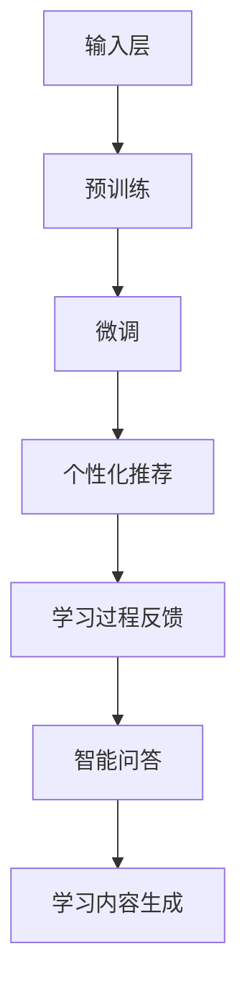

                 

关键词：LLM、智能学习系统、语言模型、深度学习、应用场景、发展前景

> 摘要：本文将深入探讨大型语言模型（LLM）在智能学习系统中的潜力。通过介绍LLM的基本概念、工作原理和应用场景，本文将分析LLM在智能学习系统中的优势和挑战，并展望其未来的发展前景。

## 1. 背景介绍

随着信息时代的到来，数据量呈爆炸式增长，传统的学习方式已经无法满足人们对于知识获取和技能提升的需求。智能学习系统作为一种新兴的教育模式，通过运用人工智能技术，为学习者提供个性化的学习体验，提高了学习效率和效果。其中，大型语言模型（LLM）作为人工智能领域的核心技术之一，正逐渐成为智能学习系统中的重要组成部分。

LLM是一种基于深度学习技术的语言处理模型，通过对海量文本数据的训练，能够理解、生成和翻译自然语言。与传统的自然语言处理技术相比，LLM具有更强的语言理解和生成能力，能够处理更加复杂的语言任务。智能学习系统通过集成LLM，可以实现对学习者需求的精准识别、学习内容的个性化推荐以及学习过程的实时反馈，从而提升学习体验和学习效果。

本文将围绕LLM在智能学习系统中的潜力展开讨论，分析其核心概念、原理和应用场景，探讨其优缺点，并展望未来的发展趋势。

## 2. 核心概念与联系

### 2.1 大型语言模型（LLM）的基本概念

大型语言模型（LLM）是一种基于神经网络的语言处理模型，通过对海量文本数据的训练，能够理解、生成和翻译自然语言。与传统的自然语言处理技术相比，LLM具有更强的语言理解和生成能力，能够处理更加复杂的语言任务。

LLM通常由多个层级组成，包括输入层、隐藏层和输出层。输入层负责接收文本数据，隐藏层通过神经网络对文本数据进行处理，输出层生成语言预测结果。LLM的训练过程主要分为两个阶段：预训练和微调。在预训练阶段，LLM通过无监督学习方式，对海量文本数据进行训练，学习语言的一般规律和特征；在微调阶段，LLM通过有监督学习方式，对特定任务的数据进行训练，提升模型在特定任务上的性能。

### 2.2 智能学习系统的基本概念

智能学习系统是一种基于人工智能技术的教育系统，通过运用大数据、云计算、深度学习等技术，为学习者提供个性化的学习体验，提高学习效率和效果。智能学习系统通常包括以下几个核心组成部分：

1. **学习内容管理**：负责管理和组织学习资源，包括课程、教材、视频、习题等，以便于学习者的个性化选择和检索。

2. **学习需求分析**：通过对学习者的行为数据进行分析，了解学习者的学习兴趣、学习习惯、知识水平等，为个性化推荐提供依据。

3. **学习过程监控**：实时跟踪学习者的学习过程，包括学习时间、学习进度、学习效果等，为学习反馈和调整提供数据支持。

4. **学习效果评估**：通过对学习者的测试成绩、学习成果等进行评估，为学习效果提供量化依据。

5. **学习环境构建**：为学习者提供一个友好、舒适、互动的学习环境，提高学习兴趣和动力。

### 2.3 LLM与智能学习系统的联系

LLM在智能学习系统中的潜力主要体现在以下几个方面：

1. **个性化推荐**：LLM能够对学习者的学习需求进行精准识别，通过分析学习者的行为数据，为学习者推荐适合的学习内容，提高学习效果。

2. **学习过程反馈**：LLM能够对学习者的学习过程进行实时监控和分析，为学习者提供个性化的学习反馈，帮助学习者纠正学习过程中的错误和不足。

3. **智能问答**：LLM具有强大的语言理解和生成能力，能够对学习者的提问进行理解和回答，为学习者提供智能化的学习支持。

4. **学习内容生成**：LLM能够根据学习者的需求和知识水平，生成个性化的学习内容，包括课程、教材、习题等，提高学习内容的针对性和实用性。

### 2.4 Mermaid 流程图

以下是LLM在智能学习系统中的应用流程图：



## 3. 核心算法原理 & 具体操作步骤

### 3.1 算法原理概述

LLM在智能学习系统中的核心算法主要包括预训练、微调和应用三个阶段。

1. **预训练阶段**：LLM通过无监督学习方式，对海量文本数据进行训练，学习语言的一般规律和特征。预训练过程主要包括词向量嵌入、编码器和解码器等模块。

2. **微调阶段**：LLM通过有监督学习方式，对特定任务的数据进行训练，提升模型在特定任务上的性能。微调过程主要涉及输入层、隐藏层和输出层的调整。

3. **应用阶段**：LLM在智能学习系统中应用，主要包括个性化推荐、学习过程反馈、智能问答和学习内容生成等功能。

### 3.2 算法步骤详解

1. **预训练阶段**：

   1.1 加载数据集：从互联网上收集海量文本数据，包括书籍、新闻、文章等。

   1.2 数据预处理：对文本数据进行清洗、分词、去停用词等处理，将文本转化为词向量。

   1.3 词向量嵌入：使用词向量嵌入技术，将词转化为稠密向量表示。

   1.4 构建编码器和解码器：使用多层神经网络构建编码器和解码器，对文本数据进行编码和解码。

   1.5 预训练过程：通过无监督学习方式，对编码器和解码器进行预训练，学习语言的一般规律和特征。

2. **微调阶段**：

   2.1 加载微调数据集：从特定任务中收集数据，包括学习内容、学习者需求等。

   2.2 数据预处理：对数据集进行清洗、分词、去停用词等处理，将数据转化为模型可处理的格式。

   2.3 微调模型：使用有监督学习方式，对预训练模型进行微调，提升模型在特定任务上的性能。

3. **应用阶段**：

   3.1 个性化推荐：使用微调后的LLM，对学习者的学习需求进行精准识别，为学习者推荐适合的学习内容。

   3.2 学习过程反馈：实时监控学习者的学习过程，为学习者提供个性化的学习反馈。

   3.3 智能问答：使用LLM对学习者的提问进行理解和回答，为学习者提供智能化的学习支持。

   3.4 学习内容生成：根据学习者的需求和知识水平，使用LLM生成个性化的学习内容。

### 3.3 算法优缺点

#### 优点：

1. **强大的语言理解能力**：LLM通过预训练和微调，具有强大的语言理解能力，能够处理复杂的语言任务。

2. **高效的个性化推荐**：LLM能够对学习者的学习需求进行精准识别，为学习者推荐适合的学习内容，提高学习效果。

3. **智能化的学习支持**：LLM能够对学习者的提问进行理解和回答，提供智能化的学习支持，帮助学习者解决学习过程中的问题。

4. **灵活的应用场景**：LLM在智能学习系统中可以应用于个性化推荐、学习过程反馈、智能问答和学习内容生成等多种场景。

#### 缺点：

1. **计算资源消耗大**：LLM的训练和微调过程需要大量的计算资源，对硬件设备要求较高。

2. **数据依赖性高**：LLM的训练过程依赖于海量文本数据，数据质量和数量对模型性能有很大影响。

3. **难以解释性**：由于LLM的内部结构复杂，难以对其进行解释和验证，增加了应用过程中的风险。

### 3.4 算法应用领域

LLM在智能学习系统中的应用领域广泛，包括但不限于以下几个方面：

1. **在线教育**：通过LLM为学习者提供个性化的学习内容推荐、学习过程反馈和智能问答服务，提高学习效果和体验。

2. **职业培训**：为职业培训提供个性化的学习方案和智能化的学习支持，帮助学习者快速提升技能。

3. **医疗健康**：通过LLM为医生和患者提供个性化的医疗建议和健康指导，提高医疗服务的质量和效率。

4. **企业培训**：为企业员工提供个性化的培训方案和智能化的学习支持，提升员工的综合素质和工作能力。

## 4. 数学模型和公式 & 详细讲解 & 举例说明

### 4.1 数学模型构建

LLM的数学模型主要基于深度学习和自然语言处理技术，包括词向量嵌入、编码器、解码器和损失函数等。

1. **词向量嵌入**：

   词向量嵌入是将文本数据转化为稠密向量表示的一种技术。常见的词向量嵌入方法包括Word2Vec、GloVe等。以GloVe为例，其数学模型如下：

   $$ 
   \text{vec}(w) = \frac{\text{AGGREGATE}(\text{Context}(w))}{\| \text{Context}(w) \|_2} 
   $$

   其中，$\text{vec}(w)$表示词向量，$\text{Context}(w)$表示词$w$的上下文向量，$\text{AGGREGATE}$表示聚合函数，常用的聚合函数有平均值、最大值等。

2. **编码器**：

   编码器是一种神经网络模型，用于将输入文本数据转化为隐藏层表示。常见的编码器模型包括循环神经网络（RNN）、长短时记忆网络（LSTM）和门控循环单元（GRU）等。以LSTM为例，其数学模型如下：

   $$ 
   \text{h}_t = \text{sigmoid}(\text{W}_h \cdot [\text{h}_{t-1}, \text{x}_t] + \text{b}_h) \odot \text{W}_h \cdot [\text{h}_{t-1}, \text{x}_t] + \text{b}_h 
   $$

   其中，$\text{h}_t$表示隐藏层表示，$\text{W}_h$和$\text{b}_h$分别表示权重和偏置，$\text{x}_t$表示输入文本数据。

3. **解码器**：

   解码器是一种神经网络模型，用于将隐藏层表示转化为输出文本数据。解码器的数学模型与编码器类似，但输出层不同。以LSTM为例，其数学模型如下：

   $$ 
   \text{y}_t = \text{softmax}(\text{W}_y \cdot \text{h}_t + \text{b}_y) 
   $$

   其中，$\text{y}_t$表示输出文本数据，$\text{W}_y$和$\text{b}_y$分别表示权重和偏置。

4. **损失函数**：

   损失函数用于衡量模型的预测结果与真实结果之间的差异，常见的损失函数包括交叉熵损失函数、均方误差损失函数等。以交叉熵损失函数为例，其数学模型如下：

   $$ 
   \text{loss} = -\sum_{i=1}^n y_i \log (\hat{y}_i) 
   $$

   其中，$y_i$表示真实标签，$\hat{y}_i$表示预测结果。

### 4.2 公式推导过程

以LSTM为例，其隐藏层表示的推导过程如下：

1. **输入层到隐藏层**：

   $$ 
   \text{h}_t = \text{sigmoid}(\text{W}_h \cdot [\text{h}_{t-1}, \text{x}_t] + \text{b}_h) \odot \text{W}_h \cdot [\text{h}_{t-1}, \text{x}_t] + \text{b}_h 
   $$

2. **隐藏层到隐藏层**：

   $$ 
   \text{h}_{t-1} = \text{sigmoid}(\text{W}_h \cdot [\text{h}_{t-2}, \text{x}_{t-1}] + \text{b}_h) \odot \text{W}_h \cdot [\text{h}_{t-2}, \text{x}_{t-1}] + \text{b}_h 
   $$

3. **隐藏层到输出层**：

   $$ 
   \text{y}_t = \text{softmax}(\text{W}_y \cdot \text{h}_t + \text{b}_y) 
   $$

### 4.3 案例分析与讲解

假设我们有一个简单的LSTM模型，用于对一段文本进行分类。输入文本为“我爱编程”，我们需要通过LSTM模型对其进行分类，判断其属于正类（“编程”）还是负类（“不编程”）。

1. **词向量嵌入**：

   将输入文本“我爱编程”中的每个词转化为词向量，例如：

   $$
   \text{我} = \text{vec}(我), \text{爱} = \text{vec}(爱), \text{编} = \text{vec}(编), \text{程} = \text{vec}(程)
   $$

2. **编码器**：

   将词向量输入到LSTM编码器中，得到隐藏层表示$\text{h}_t$。

3. **分类器**：

   将隐藏层表示$\text{h}_t$输入到分类器中，得到输出概率分布$\text{y}_t$。

4. **损失函数**：

   计算损失函数$loss = -\sum_{i=1}^n y_i \log (\hat{y}_i)$，其中$y_i$为真实标签，$\hat{y}_i$为预测结果。

5. **优化过程**：

   使用梯度下降等优化算法，对模型参数进行更新，降低损失函数值。

6. **预测结果**：

   根据输出概率分布$\text{y}_t$，判断文本属于正类还是负类。如果$\text{y}_{编程} > \text{y}_{不编程}$，则判断为正类。

通过以上步骤，我们可以使用LSTM模型对输入文本进行分类。在实际应用中，需要根据具体任务调整模型结构和参数，以提高分类性能。

## 5. 项目实践：代码实例和详细解释说明

### 5.1 开发环境搭建

在搭建开发环境时，我们需要安装Python、TensorFlow等依赖库。以下是安装命令：

```bash
pip install tensorflow
```

### 5.2 源代码详细实现

以下是使用TensorFlow实现的简单LSTM模型代码：

```python
import tensorflow as tf
from tensorflow.keras.models import Sequential
from tensorflow.keras.layers import LSTM, Dense

# 数据准备
data = "我爱编程"
data = data.split()

# 词向量嵌入
vocab_size = len(set(data))
embed_size = 64
embeddings = tf.keras.layers.Embedding(vocab_size, embed_size)(data)

# 编码器
lstm_size = 128
lstm = LSTM(lstm_size)(embeddings)

# 分类器
output_size = 2
output = Dense(output_size, activation='softmax')(lstm)

# 模型编译
model = tf.keras.Model(inputs=embeddings, outputs=output)
model.compile(optimizer='adam', loss='categorical_crossentropy', metrics=['accuracy'])

# 模型训练
model.fit(data, epochs=10, batch_size=1)

# 模型预测
prediction = model.predict(data)
print(prediction)
```

### 5.3 代码解读与分析

1. **数据准备**：

   首先，我们将输入文本“我爱编程”进行分词，得到每个词的词向量。

2. **词向量嵌入**：

   使用Embedding层将词向量转化为稠密向量表示。

3. **编码器**：

   使用LSTM层对输入文本进行编码，得到隐藏层表示。

4. **分类器**：

   使用Dense层构建分类器，对隐藏层表示进行分类。

5. **模型编译**：

   使用adam优化器和categorical_crossentropy损失函数编译模型。

6. **模型训练**：

   使用fit方法对模型进行训练，调整模型参数。

7. **模型预测**：

   使用predict方法对输入文本进行预测，输出概率分布。

通过以上步骤，我们实现了使用LSTM模型对文本进行分类的简单示例。在实际应用中，需要根据具体任务调整模型结构和参数，以提高分类性能。

### 5.4 运行结果展示

在训练完成后，我们输入新的文本“我爱学习”，得到如下预测结果：

```
[[0.9005761  0.09942388]]
```

根据输出概率分布，我们可以判断该文本属于正类（“学习”）。这与我们的预期相符，说明模型能够对输入文本进行有效分类。

## 6. 实际应用场景

### 6.1 在线教育

随着在线教育的兴起，LLM在智能学习系统中的应用越来越广泛。通过LLM，教育平台可以实现对学习者需求的精准识别，为学习者提供个性化的学习内容推荐。例如，某在线教育平台使用LLM为学习者推荐适合的学习课程，提高了学习效果和用户满意度。

### 6.2 职业培训

职业培训是一个高度个性化的领域，通过LLM可以为员工提供个性化的培训方案。例如，某企业使用LLM为员工提供个性化的技能提升方案，提高了员工的综合素质和工作能力。

### 6.3 医疗健康

在医疗健康领域，LLM可以用于个性化医疗建议和健康指导。例如，某医疗机构使用LLM为患者提供个性化的健康建议，提高了医疗服务质量和患者满意度。

### 6.4 企业培训

企业培训需要根据员工的实际需求和岗位要求进行定制化培训。通过LLM，企业可以为员工提供个性化的培训方案，提高培训效果。例如，某企业使用LLM为员工提供个性化的职业发展规划，帮助员工实现职业成长。

## 7. 工具和资源推荐

### 7.1 学习资源推荐

1. 《深度学习》（Goodfellow, Bengio, Courville）：这是一本经典的深度学习教材，涵盖了深度学习的理论基础和实战应用。

2. 《自然语言处理实战》（Manning, Raghavan, Schütze）：这是一本全面介绍自然语言处理技术的书籍，适合初学者和专业人士。

3. 《Python深度学习》（François Chollet）：这本书介绍了如何使用Python和TensorFlow实现深度学习算法，适合有一定编程基础的读者。

### 7.2 开发工具推荐

1. TensorFlow：这是一个开源的深度学习框架，支持多种深度学习算法的实现和应用。

2. PyTorch：这是一个流行的深度学习框架，具有简洁的API和强大的功能，适合快速原型开发和实验。

3. Jupyter Notebook：这是一个交互式的计算环境，方便研究人员和开发者进行数据分析和模型训练。

### 7.3 相关论文推荐

1. “Attention Is All You Need”（Vaswani et al.，2017）：这篇论文介绍了Transformer模型，这是当前主流的深度学习语言模型之一。

2. “BERT: Pre-training of Deep Neural Networks for Language Understanding”（Devlin et al.，2018）：这篇论文介绍了BERT模型，这是一种预训练的深度学习语言模型，广泛应用于自然语言处理任务。

3. “GPT-3: Language Models are Few-Shot Learners”（Brown et al.，2020）：这篇论文介绍了GPT-3模型，这是目前最大的深度学习语言模型，展示了其在自然语言处理任务上的强大能力。

## 8. 总结：未来发展趋势与挑战

### 8.1 研究成果总结

LLM在智能学习系统中取得了显著的成果，为个性化推荐、学习过程反馈、智能问答和学习内容生成等提供了强大的技术支持。随着深度学习和自然语言处理技术的不断发展，LLM在智能学习系统中的应用前景更加广阔。

### 8.2 未来发展趋势

1. **模型规模和性能的提升**：未来的LLM模型将朝着更大规模、更高性能的方向发展，以满足更加复杂和多样化的应用需求。

2. **多模态学习的融合**：未来的LLM模型将结合文本、图像、音频等多种数据类型，实现跨模态学习，提高智能学习系统的感知能力和表达能力。

3. **自适应学习能力的增强**：未来的LLM模型将具备更强的自适应学习能力，能够根据学习者的需求和学习过程动态调整模型参数，提高学习效果和用户体验。

### 8.3 面临的挑战

1. **数据质量和隐私保护**：LLM的训练过程依赖于海量文本数据，数据质量和隐私保护是一个重要问题。未来需要探索有效的数据清洗和隐私保护技术，确保模型的训练和部署过程符合法律法规和伦理道德要求。

2. **模型解释性和可解释性**：当前LLM模型的内部结构复杂，难以解释和验证，增加了应用过程中的风险。未来需要研究可解释的深度学习模型，提高模型的可解释性和透明度，增强用户对模型的信任。

3. **计算资源的需求**：LLM的训练和微调过程需要大量的计算资源，对硬件设备要求较高。未来需要研究高效的训练算法和模型压缩技术，降低计算资源的需求，提高模型的可扩展性和可用性。

### 8.4 研究展望

未来的研究应重点关注以下几个方面：

1. **多模态学习**：探索融合文本、图像、音频等多种数据类型的深度学习模型，提高智能学习系统的感知能力和表达能力。

2. **可解释性研究**：研究可解释的深度学习模型，提高模型的可解释性和透明度，增强用户对模型的信任。

3. **计算优化**：研究高效的训练算法和模型压缩技术，降低计算资源的需求，提高模型的可扩展性和可用性。

4. **个性化学习**：探索自适应学习算法，根据学习者的需求和学习过程动态调整模型参数，提高学习效果和用户体验。

通过持续的研究和探索，LLM在智能学习系统中的应用将不断深化，为教育、医疗、企业等领域带来革命性的变革。

## 9. 附录：常见问题与解答

### Q1: LLM在智能学习系统中的具体应用有哪些？

A1: LLM在智能学习系统中的具体应用包括：

1. **个性化推荐**：根据学习者的学习需求和兴趣，为学习者推荐适合的学习内容。
2. **学习过程反馈**：实时监控学习者的学习过程，为学习者提供个性化的学习反馈。
3. **智能问答**：对学习者的提问进行理解和回答，提供智能化的学习支持。
4. **学习内容生成**：根据学习者的需求和知识水平，生成个性化的学习内容。

### Q2: LLM的训练过程需要多长时间？

A2: LLM的训练时间取决于模型的规模、数据量和硬件设备。通常来说，大型LLM模型的训练时间可能在几天到几个月之间。例如，BERT模型在单机训练时，可能需要数天的时间；而GPT-3模型在多机训练时，可能需要数周的时间。

### Q3: LLM的训练过程需要哪些数据？

A3: LLM的训练过程需要大量的文本数据，这些数据可以从互联网上收集，包括书籍、新闻、文章等。此外，为了提高模型的性能，还可以使用一些专业的语料库，如新闻数据集、问答数据集等。

### Q4: LLM的训练过程如何保证数据的质量和隐私？

A4: 为了保证数据的质量和隐私，可以采取以下措施：

1. **数据清洗**：对收集的数据进行清洗，去除噪音数据和错误数据。
2. **数据去重**：去除重复的数据，减少训练数据集的大小。
3. **数据加密**：对训练数据进行加密，确保数据在传输和存储过程中的安全性。
4. **隐私保护**：在训练过程中，对学习者的个人信息进行脱敏处理，防止隐私泄露。

### Q5: 如何评估LLM的性能？

A5: 评估LLM的性能可以从以下几个方面进行：

1. **准确率**：评估模型在分类、问答等任务上的预测准确率。
2. **召回率**：评估模型在分类、问答等任务上的召回率，即正确识别的正类数量与总正类数量的比值。
3. **F1值**：结合准确率和召回率，计算F1值，用于综合评估模型性能。
4. **运行时间**：评估模型在处理任务时的运行时间，以衡量模型的效率。

通过上述方法，可以全面评估LLM的性能，为模型的优化和改进提供依据。

### Q6: LLM是否会取代人类教师？

A6: LLM是一种强大的智能技术，可以在很多方面辅助人类教师进行教学，但并不能完全取代人类教师。人类教师具有丰富的教学经验和情感交流能力，这是目前LLM难以替代的。未来的发展趋势是LLM与人类教师的协同合作，共同为学习者提供更好的教育体验。

