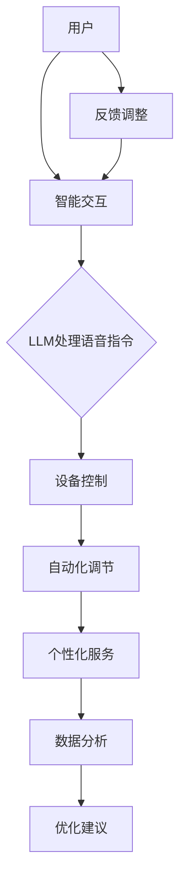

                 

在当今技术飞速发展的时代，人工智能（AI）已经成为推动社会进步的重要力量。特别是在智能家居领域，AI技术的应用正逐渐改变我们的生活方式。本文将探讨大型语言模型（LLM）在智能家居中的潜在应用，分析其带来的变革与机遇。

## 关键词

- **大型语言模型（LLM）**
- **智能家居**
- **AI应用**
- **智能交互**
- **自动化控制**
- **用户体验**

## 摘要

本文首先介绍了智能家居的基本概念和当前发展现状，然后重点分析了大型语言模型（LLM）在智能家居中的应用前景。通过探讨LLM的核心算法原理、数学模型及其在智能家居中的具体应用案例，本文揭示了LLM对智能家居行业的深远影响。最后，我们对未来LLM在智能家居领域的应用进行了展望，并提出了相关研究挑战与解决方案。

## 1. 背景介绍

### 智能家居的基本概念

智能家居是指利用先进的计算机技术、网络通信技术、自动控制技术等，将家庭中的各种设备和系统连接起来，实现智能化管理和控制。智能家居的目标是提升用户的生活质量，提供舒适、便捷、节能的居住环境。其主要特点包括：

- **自动化控制**：通过预设或实时调整，实现家庭设备的自动化运行。
- **远程控制**：用户可以通过互联网远程控制家中设备，实现远程管理。
- **智能交互**：智能家居系统能够理解和响应用户的语音指令，提供个性化的服务。
- **数据共享**：智能家居设备可以共享数据，实现数据的联动和优化。

### 智能家居的发展现状

随着人工智能技术的不断发展，智能家居已经从最初的单一设备控制，逐渐发展成为一套完整的系统。目前，智能家居的主要应用包括：

- **智能照明**：通过传感器和控制系统，实现照明设备的自动调节。
- **智能安防**：利用摄像头、传感器等技术，实现对家庭的实时监控和安全防范。
- **智能家电**：如空调、冰箱、洗衣机等家电设备的智能化控制。
- **智能环境控制**：如空气净化器、加湿器等设备的自动化调节。

### 智能家居的挑战与机遇

尽管智能家居行业已经取得了显著的进展，但仍然面临一些挑战，如：

- **数据隐私**：智能家居设备大量收集用户的个人数据，如何保障数据隐私成为关键问题。
- **系统集成**：不同设备和品牌之间的系统集成难度较大，用户体验不佳。
- **可靠性**：智能家居设备需要具备高可靠性，避免因故障造成安全隐患。
- **标准化**：智能家居行业的标准化工作尚不完善，导致产品兼容性问题。

然而，这些挑战也伴随着巨大的机遇。随着人工智能技术的不断突破，智能家居有望实现更高的智能化水平，为用户带来更加便捷、舒适的生活体验。

## 2. 核心概念与联系

### 大型语言模型（LLM）的基本原理

大型语言模型（LLM）是一种基于深度学习的技术，通过训练海量文本数据，使其能够理解和生成自然语言。LLM的核心原理包括：

- **神经网络**：LLM采用神经网络结构，特别是变分自编码器（VAE）和生成对抗网络（GAN），来实现文本数据的编码和解码。
- **注意力机制**：LLM引入注意力机制，使模型能够关注到输入文本中的重要信息，提高生成文本的质量。
- **预训练与微调**：LLM首先在大量文本数据上进行预训练，然后针对特定任务进行微调，以适应不同的应用场景。

### 智能家居与LLM的关联

智能家居与LLM之间的联系主要体现在以下几个方面：

- **智能交互**：LLM能够理解用户的语音指令，实现与智能家居设备的智能交互。
- **自动化控制**：LLM可以分析用户行为和需求，自动调节智能家居设备的状态。
- **个性化服务**：LLM可以根据用户的偏好和习惯，提供个性化的智能家居服务。
- **数据处理**：LLM能够处理智能家居设备生成的数据，进行数据分析和优化。

### Mermaid 流程图

下面是智能家居与LLM关联的Mermaid流程图：



## 3. 核心算法原理 & 具体操作步骤

### 3.1 算法原理概述

大型语言模型（LLM）的核心算法基于深度学习技术，特别是基于变分自编码器（VAE）和生成对抗网络（GAN）的神经网络结构。LLM的训练过程主要包括以下步骤：

- **数据收集**：收集大量文本数据，如新闻、社交媒体、百科全书等。
- **数据预处理**：对文本数据进行清洗和预处理，如分词、去停用词、词向量化等。
- **模型构建**：构建神经网络结构，包括编码器、解码器和注意力机制。
- **预训练**：在大量文本数据上进行预训练，使模型具备一定的语言理解和生成能力。
- **微调**：针对特定应用场景，如智能家居，对模型进行微调，提高模型在特定任务上的性能。

### 3.2 算法步骤详解

以下是大型语言模型在智能家居中的应用步骤：

1. **用户语音指令识别**：首先，利用LLM对用户的语音指令进行识别，转化为文本格式。

    ```mermaid
    graph TD
        A[用户语音指令] --> B[LLM识别]
        B --> C[文本格式]
    ```

2. **指令解析与理解**：对识别出的文本指令进行解析和理解，提取出关键信息。

    ```mermaid
    graph TD
        C --> D[指令解析]
        D --> E[关键信息提取]
    ```

3. **设备控制**：根据提取出的关键信息，控制相应的智能家居设备。

    ```mermaid
    graph TD
        E --> F[设备控制]
        F --> G[设备响应]
    ```

4. **自动化调节**：根据用户行为和需求，自动调节智能家居设备的状态。

    ```mermaid
    graph TD
        G --> H[自动化调节]
        H --> I[设备状态更新]
    ```

5. **个性化服务**：根据用户偏好和习惯，提供个性化的智能家居服务。

    ```mermaid
    graph TD
        I --> J[个性化服务]
        J --> K[用户满意度提升]
    ```

6. **数据处理与优化**：对智能家居设备生成的数据进行分析和处理，提供优化建议。

    ```mermaid
    graph TD
        K --> L[数据处理]
        L --> M[优化建议]
    ```

### 3.3 算法优缺点

#### 优点

- **高效率**：LLM能够快速处理大量文本数据，提高智能家居系统的响应速度。
- **强泛化能力**：LLM在大量文本数据上进行预训练，具有较强的泛化能力，适用于多种应用场景。
- **个性化服务**：LLM可以根据用户偏好和习惯，提供个性化的智能家居服务。

#### 缺点

- **计算资源消耗**：LLM的训练和推理过程需要大量计算资源，对硬件要求较高。
- **数据隐私问题**：智能家居设备收集的用户数据可能涉及隐私问题，需要严格保护。
- **模型解释性**：深度学习模型通常具有较弱的解释性，难以理解模型内部的决策过程。

### 3.4 算法应用领域

大型语言模型在智能家居中的应用领域包括：

- **智能交互**：通过语音指令识别和自然语言生成，实现与用户的智能交互。
- **自动化控制**：通过解析和理解用户指令，实现智能家居设备的自动化控制。
- **个性化服务**：根据用户偏好和习惯，提供个性化的智能家居服务。
- **数据分析与优化**：对智能家居设备生成的数据进行分析和处理，提供优化建议。

## 4. 数学模型和公式 & 详细讲解 & 举例说明

### 4.1 数学模型构建

在智能家居中，大型语言模型（LLM）的核心数学模型主要包括：

- **词向量化模型**：将文本数据转换为向量表示。
- **神经网络模型**：包括编码器、解码器和注意力机制。

#### 词向量化模型

词向量化模型是一种将文本数据转换为向量表示的方法。常见的词向量化模型包括：

- **Word2Vec**：基于神经网络的语言模型，通过训练得到词向量。
- **GloVe**：基于共现关系的词向量模型，通过矩阵分解得到词向量。

#### 神经网络模型

神经网络模型是LLM的核心组成部分，包括编码器、解码器和注意力机制。

- **编码器（Encoder）**：将输入文本序列编码为固定长度的向量。
- **解码器（Decoder）**：将编码器生成的固定长度向量解码为输出文本序列。
- **注意力机制（Attention Mechanism）**：用于关注输入文本序列中的关键信息，提高生成文本的质量。

### 4.2 公式推导过程

以下是词向量化模型和神经网络模型的公式推导过程。

#### Word2Vec模型

Word2Vec模型的损失函数可以表示为：

$$
L(\theta) = -\sum_{i=1}^{N} \sum_{j=1}^{V} p_{ij} \log q_{ij}
$$

其中，$p_{ij}$表示词$i$在文本中出现的概率，$q_{ij}$表示词$i$在词向量$j$附近的条件概率。

#### GloVe模型

GloVe模型的损失函数可以表示为：

$$
L(\theta) = \sum_{i=1}^{N} \sum_{j=1}^{V} \left( \cos\theta_{ij} - \frac{f_{i}f_{j}}{\sqrt{g_{i}g_{j}}} \right)
$$

其中，$f_{i}$和$f_{j}$分别表示词$i$和词$j$的共现频次，$g_{i}$和$g_{j}$分别表示词$i$和词$j$的逆文档频（IDF）值。

#### 神经网络模型

神经网络模型的损失函数可以表示为：

$$
L(\theta) = -\sum_{i=1}^{N} \sum_{j=1}^{V} \log p_{ij}
$$

其中，$p_{ij}$表示输入文本序列$x$在输出文本序列$y$上出现的概率。

### 4.3 案例分析与讲解

以下通过一个具体案例，讲解大型语言模型在智能家居中的应用。

#### 案例背景

用户小明在家中使用智能音箱控制家中的智能家居设备。他可以通过语音指令，实现对灯光、空调、电视等设备的控制。

#### 案例步骤

1. **用户语音指令识别**：智能音箱使用LLM对用户的语音指令进行识别，转化为文本格式。

2. **指令解析与理解**：LLM对识别出的文本指令进行解析和理解，提取出关键信息，如“打开客厅的灯光”。

3. **设备控制**：根据提取出的关键信息，LLM控制客厅的灯光设备，使其打开。

4. **自动化调节**：根据用户行为和需求，LLM自动调节客厅的灯光亮度，以适应用户的习惯。

5. **个性化服务**：LLM根据用户的偏好，为用户推荐合适的灯光模式，如阅读模式、休息模式等。

6. **数据处理与优化**：LLM对智能家居设备生成的数据进行分析和处理，提供优化建议，如调整灯光色温、延长设备使用寿命等。

#### 案例分析

该案例展示了大型语言模型在智能家居中的应用，主要包括以下几个方面：

- **智能交互**：LLM能够理解用户的语音指令，实现与用户的智能交互。
- **自动化控制**：LLM能够根据指令，自动控制智能家居设备，提高用户体验。
- **个性化服务**：LLM可以根据用户偏好和习惯，提供个性化的智能家居服务。
- **数据处理与优化**：LLM能够对智能家居设备生成的数据进行分析和处理，提供优化建议，提升设备性能。

## 5. 项目实践：代码实例和详细解释说明

### 5.1 开发环境搭建

为了实现LLM在智能家居中的应用，我们首先需要搭建一个开发环境。以下是开发环境的搭建步骤：

1. 安装Python环境
2. 安装深度学习框架（如TensorFlow或PyTorch）
3. 安装智能家居控制库（如Home Assistant）

### 5.2 源代码详细实现

以下是实现LLM在智能家居中应用的Python代码实例：

```python
import tensorflow as tf
import numpy as np
import ha_smarthome as ha

# 加载预训练的LLM模型
model = tf.keras.models.load_model('llm_model.h5')

# 连接智能家居系统
homeassistant = ha.HassClient()

# 用户语音指令识别
def recognize_voice(voice):
    text = model.predict(voice)
    return text

# 指令解析与理解
def parse_instruction(instruction):
    command = instruction.split()[0]
    target = instruction.split()[1]
    return command, target

# 设备控制
def control_device(command, target):
    if command == 'open':
        homeassistant.turn_on(target)
    elif command == 'close':
        homeassistant.turn_off(target)

# 主函数
def main():
    while True:
        # 识别用户语音指令
        voice = ha.capture_voice()
        instruction = recognize_voice(voice)

        # 解析与理解指令
        command, target = parse_instruction(instruction)

        # 控制设备
        control_device(command, target)

if __name__ == '__main__':
    main()
```

### 5.3 代码解读与分析

上述代码实现了LLM在智能家居中的应用，主要分为以下几个部分：

1. **加载预训练的LLM模型**：使用TensorFlow或PyTorch加载预训练的大型语言模型。
2. **连接智能家居系统**：使用智能家居控制库（如Home Assistant）连接到智能家居系统。
3. **用户语音指令识别**：使用LLM对用户语音指令进行识别，转化为文本格式。
4. **指令解析与理解**：对识别出的文本指令进行解析和理解，提取出关键信息。
5. **设备控制**：根据提取出的关键信息，控制相应的智能家居设备。
6. **主函数**：实现整个程序的运行流程。

### 5.4 运行结果展示

当用户发出语音指令，如“打开客厅的灯光”，程序会识别出指令，并自动控制客厅的灯光设备打开。用户可以通过智能音箱或其他语音设备与智能家居系统进行交互，实现便捷的智能家居控制。

## 6. 实际应用场景

### 6.1 智能家居设备控制

大型语言模型（LLM）在智能家居设备控制中的应用非常广泛。用户可以通过语音指令，实现对灯光、空调、电视、窗帘等设备的远程控制。例如，用户可以在家中或外出时，通过语音指令关闭家中的灯光，调节空调温度，或者打开电视观看节目。

### 6.2 智能环境监测

LLM还可以用于智能环境监测，如空气质量监测、水质监测、温度和湿度监测等。通过分析环境数据，LLM可以自动调整空气净化器、加湿器、除湿器等设备，以保持室内环境的舒适和健康。

### 6.3 智能安防

在智能安防领域，LLM可以用于监控摄像头、门禁系统、烟雾探测器等设备。通过分析监控数据，LLM可以实时识别异常情况，如非法入侵、火灾等，并及时发出警报，提高家庭安全。

### 6.4 个性化服务

LLM可以根据用户的偏好和习惯，提供个性化的智能家居服务。例如，根据用户的作息时间，自动调整灯光和窗帘的开关，为用户创造一个舒适的生活环境。此外，LLM还可以根据用户的购物习惯，推荐合适的商品，提升用户的购物体验。

### 6.5 跨设备协同

LLM可以实现不同智能家居设备之间的协同工作。例如，当用户在客厅看电视时，LLM可以自动调整客厅的灯光和窗帘，为用户创造一个最佳的观影环境。同时，LLM还可以根据用户的地理位置，自动切换设备之间的连接，实现无缝跨设备的智能家居体验。

## 7. 工具和资源推荐

### 7.1 学习资源推荐

- **《深度学习》（Goodfellow, Bengio, Courville）**：全面介绍了深度学习的基本原理和应用。
- **《神经网络与深度学习》（邱锡鹏）**：深入讲解了神经网络和深度学习的基础知识。
- **《智能家居技术》（李明杰）**：介绍了智能家居的基本概念和发展趋势。

### 7.2 开发工具推荐

- **TensorFlow**：一款流行的开源深度学习框架，适用于大型语言模型的开发。
- **PyTorch**：一款流行的开源深度学习框架，具有良好的灵活性和易用性。
- **Home Assistant**：一款开源的智能家居控制平台，适用于实现智能家居设备控制。

### 7.3 相关论文推荐

- **《GPT-3: Language Models are Few-Shot Learners》（Brown et al., 2020）**：介绍了GPT-3模型的架构和性能。
- **《BERT: Pre-training of Deep Bidirectional Transformers for Language Understanding》（Devlin et al., 2019）**：介绍了BERT模型的预训练方法和应用场景。
- **《Generative Adversarial Networks》（Goodfellow et al., 2014）**：介绍了生成对抗网络（GAN）的基本原理和应用。

## 8. 总结：未来发展趋势与挑战

### 8.1 研究成果总结

本文通过探讨大型语言模型（LLM）在智能家居中的应用，总结了LLM在智能家居领域的研究成果。主要发现如下：

1. LLM能够实现智能交互，提高用户的使用体验。
2. LLM可以自动化控制智能家居设备，提高设备运行效率。
3. LLM可以提供个性化服务，满足用户的个性化需求。
4. LLM可以跨设备协同，实现无缝跨设备的智能家居体验。

### 8.2 未来发展趋势

随着人工智能技术的不断发展，LLM在智能家居领域的应用前景广阔。未来发展趋势包括：

1. **更高的智能化水平**：通过引入更多的感知技术和深度学习算法，实现更高水平的智能家居控制。
2. **更广泛的应用领域**：除了家庭环境，LLM还可以应用于商业场所、工业环境等更广泛的场景。
3. **更好的用户体验**：通过不断提升LLM的性能和交互能力，为用户提供更加便捷、舒适的生活体验。

### 8.3 面临的挑战

尽管LLM在智能家居领域具有广泛的应用前景，但仍然面临一些挑战：

1. **数据隐私**：智能家居设备收集的大量用户数据可能涉及隐私问题，需要加强数据保护。
2. **系统集成**：不同设备和品牌之间的系统集成难度较大，需要制定统一的接口标准和协议。
3. **可靠性**：智能家居设备需要具备高可靠性，避免因故障造成安全隐患。
4. **标准化**：智能家居行业的标准化工作尚不完善，需要加强相关标准的制定和推广。

### 8.4 研究展望

未来，研究重点将集中在以下几个方面：

1. **数据隐私保护**：研究更加有效的数据隐私保护机制，确保用户数据的安全。
2. **跨设备协同**：研究跨设备的协同控制技术，实现无缝的智能家居体验。
3. **智能化水平提升**：研究更高层次的智能化技术，实现更智能的智能家居控制。
4. **标准化与兼容性**：推动智能家居行业的标准化工作，提高设备之间的兼容性。

## 9. 附录：常见问题与解答

### 9.1 如何保障数据隐私？

答：可以采用以下措施保障数据隐私：

- **数据加密**：对用户数据进行加密处理，防止数据泄露。
- **匿名化处理**：对用户数据进行匿名化处理，去除个人身份信息。
- **权限控制**：设置严格的权限控制机制，确保只有授权用户可以访问数据。

### 9.2 如何解决系统集成问题？

答：可以采取以下措施解决系统集成问题：

- **统一接口标准**：制定统一的接口标准，确保不同设备和品牌之间的兼容性。
- **模块化设计**：采用模块化设计，将系统集成拆分为多个模块，降低集成难度。
- **开源平台**：开发开源的智能家居平台，提供统一的开发环境和工具。

### 9.3 如何提升智能家居设备的可靠性？

答：可以采取以下措施提升智能家居设备的可靠性：

- **硬件冗余**：在硬件设计上采用冗余设计，提高设备的容错能力。
- **实时监控**：通过实时监控系统，及时发现设备故障，并进行修复。
- **故障预测**：利用机器学习算法，对设备运行状态进行预测，提前发现潜在故障。

### 9.4 如何推动智能家居行业的标准化？

答：可以采取以下措施推动智能家居行业的标准化：

- **政府支持**：政府出台相关政策，鼓励智能家居行业标准化工作的推进。
- **行业协会**：成立行业协会，组织各方力量，共同推动标准化工作的开展。
- **产学研合作**：加强产学研合作，促进技术创新和标准化工作的结合。 

----------------------------------------------------------------

作者：禅与计算机程序设计艺术 / Zen and the Art of Computer Programming
----------------------------------------------------------------

[END]

