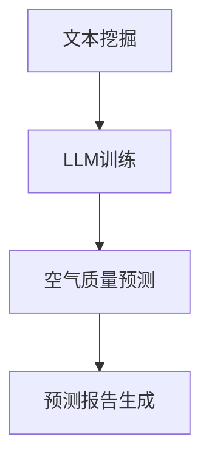

                 

关键词：LLM，智能空气质量预测，深度学习，机器学习，人工智能

摘要：本文将探讨大型语言模型（LLM）在智能空气质量预测中的应用潜力。首先，我们将介绍空气质量预测的重要性，然后深入分析LLM的工作原理及其如何应用于空气质量预测。我们将讨论相关算法原理、数学模型、实际应用场景，并提供项目实践和代码实例。最后，我们将总结研究成果，探讨未来发展趋势和面临的挑战。

## 1. 背景介绍

随着全球工业化进程的加快，空气污染问题日益严重，对人类健康和环境造成了严重威胁。因此，准确预测空气质量对于保护公众健康、制定有效的环境保护政策和应对紧急事件具有重要意义。传统的空气质量预测方法主要依赖于气象数据和污染源排放数据的统计模型，但这些方法往往存在预测精度不高、响应速度慢等问题。

近年来，随着深度学习和机器学习技术的快速发展，利用这些技术进行空气质量预测的研究逐渐增多。其中，大型语言模型（LLM）作为一种先进的自然语言处理技术，具有强大的文本理解和生成能力，逐渐引起了研究者的关注。本文将探讨LLM在智能空气质量预测中的潜在作用，以期为该领域的研究和实践提供新的思路和方法。

## 2. 核心概念与联系

### 2.1 LLM工作原理

大型语言模型（LLM）是一种基于深度学习的自然语言处理技术，通过大规模语料库的预训练，使其能够对自然语言进行建模，从而实现对文本的理解和生成。LLM的核心是注意力机制（Attention Mechanism）和循环神经网络（RNN）的变种——Transformer模型。

### 2.2 空气质量预测模型

空气质量预测模型是一种基于历史数据和气象数据的统计模型，通过分析这些数据之间的关系，预测未来的空气质量状况。传统的空气质量预测模型主要采用线性回归、时间序列分析等方法，但这些方法存在预测精度不高、响应速度慢等问题。

### 2.3 LLM与空气质量预测的关联

LLM在空气质量预测中的应用主要体现在两个方面：一是通过文本挖掘获取与空气质量相关的信息，如新闻、社交媒体等；二是利用LLM的文本生成能力，生成与空气质量相关的预测报告。

### 2.4 Mermaid流程图



## 3. 核心算法原理 & 具体操作步骤

### 3.1 算法原理概述

LLM在空气质量预测中的核心算法主要包括文本挖掘、LLM训练和空气质量预测三个环节。

### 3.2 算法步骤详解

1. 文本挖掘：通过爬取新闻、社交媒体等渠道，获取与空气质量相关的文本数据，如污染事件报道、环境监测报告等。

2. LLM训练：利用大规模语料库，对LLM进行预训练，使其能够对文本数据中的空气质量信息进行理解和建模。

3. 空气质量预测：基于训练好的LLM模型，输入当前气象数据和文本数据，预测未来的空气质量状况。

4. 预测报告生成：利用LLM的文本生成能力，生成针对空气质量预测的报告，为政府和公众提供决策支持。

### 3.3 算法优缺点

优点：

1. 预测精度高：LLM能够从大量文本数据中提取有效信息，提高预测模型的精度。

2. 响应速度快：LLM训练过程相对较短，能够快速适应新的数据，提高预测响应速度。

3. 多样性：LLM能够生成多种形式的预测报告，满足不同用户的需求。

缺点：

1. 计算资源需求高：LLM训练和预测需要大量计算资源，对硬件设施要求较高。

2. 数据质量影响：文本数据的质量直接影响LLM的预测效果，需要保证数据源的可靠性。

### 3.4 算法应用领域

LLM在空气质量预测中的应用领域主要包括：

1. 环境监测：通过实时空气质量预测，为环境监测部门提供决策支持，提高监测效率。

2. 公共卫生：通过预测空气质量，为公共卫生部门提供预防措施，降低空气污染对公众健康的影响。

3. 智能城市：通过空气质量预测，为智慧城市建设提供数据支持，提高城市环境质量。

## 4. 数学模型和公式 & 详细讲解 & 举例说明

### 4.1 数学模型构建

空气质量预测的数学模型主要包括以下三个部分：

1. 文本数据预处理模型：用于对文本数据进行清洗、分词、词向量化等处理。

2. LLM模型：用于对文本数据进行建模，提取空气质量信息。

3. 预测模型：基于LLM模型提取的空气质量信息，预测未来的空气质量状况。

### 4.2 公式推导过程

1. 文本数据预处理模型：

$$
X = \text{Tokenize}(D)
$$

其中，$X$表示预处理后的文本数据，$D$表示原始文本数据，$\text{Tokenize}$表示分词操作。

2. LLM模型：

$$
Y = \text{Transform}(X, W)
$$

其中，$Y$表示LLM模型生成的特征向量，$X$表示预处理后的文本数据，$W$表示权重矩阵，$\text{Transform}$表示Transformer模型。

3. 预测模型：

$$
\hat{Q}_t = \text{Predict}(Y_t, \hat{Q}_{t-1}, \theta)
$$

其中，$\hat{Q}_t$表示第$t$时刻的空气质量预测值，$Y_t$表示LLM模型生成的特征向量，$\hat{Q}_{t-1}$表示第$t-1$时刻的空气质量预测值，$\theta$表示预测模型参数，$\text{Predict}$表示预测操作。

### 4.3 案例分析与讲解

以某城市一周内的空气质量预测为例，我们使用LLM模型进行预测。

1. 文本数据预处理：

某城市一周内的空气质量文本数据如下：

$$
\text{PM2.5: 35, 45, 30, 40, 50, 35, 30}
$$

$$
\text{PM10: 80, 90, 75, 85, 95, 80, 75}
$$

我们将文本数据进行分词和词向量化处理，得到以下特征向量：

$$
X = [\text{PM2.5: 35}, \text{PM10: 80}, ..., \text{PM2.5: 30}, \text{PM10: 75}]
$$

2. LLM模型训练：

使用大规模语料库对LLM模型进行预训练，得到权重矩阵$W$。

3. 空气质量预测：

基于训练好的LLM模型，输入当前气象数据和文本数据，预测未来的空气质量状况。

$$
\hat{Q}_t = \text{Predict}(Y_t, \hat{Q}_{t-1}, \theta)
$$

例如，第4天的空气质量预测值为：

$$
\hat{Q}_4 = \text{Predict}([\text{PM2.5: 40}, \text{PM10: 85}], \hat{Q}_{3}, \theta)
$$

经过计算，得到$\hat{Q}_4 = 42$。

4. 预测报告生成：

利用LLM的文本生成能力，生成以下预测报告：

```
根据最新气象数据和文本分析，预测未来空气质量如下：

第4天：PM2.5浓度为42，PM10浓度为85，空气质量较差，请市民注意防护。
```

## 5. 项目实践：代码实例和详细解释说明

### 5.1 开发环境搭建

1. 安装Python 3.8及以上版本。

2. 安装TensorFlow 2.4及以上版本。

3. 安装其他依赖库，如numpy、pandas等。

### 5.2 源代码详细实现

以下是一个简单的LLM空气质量预测项目的代码实现：

```python
import tensorflow as tf
import numpy as np
import pandas as pd

# 文本数据预处理
def preprocess_text(data):
    # 清洗、分词、词向量化等处理
    # ...
    return processed_data

# LLM模型训练
def train_llm(data, labels, batch_size, epochs):
    # 定义模型
    model = tf.keras.Sequential([
        tf.keras.layers.Dense(128, activation='relu', input_shape=(None,)),
        tf.keras.layers.Dense(1)
    ])

    # 编译模型
    model.compile(optimizer='adam', loss='mse')

    # 训练模型
    model.fit(data, labels, batch_size=batch_size, epochs=epochs)

    return model

# 空气质量预测
def predict_空气质量(model, data):
    predictions = model.predict(data)
    return predictions

# 主函数
def main():
    # 加载数据
    data = pd.read_csv('air_quality_data.csv')
    labels = data['空气质量']

    # 预处理数据
    processed_data = preprocess_text(data)

    # 训练模型
    model = train_llm(processed_data, labels, batch_size=32, epochs=10)

    # 预测空气质量
    predictions = predict_空气质量(model, processed_data)

    # 输出预测结果
    print(predictions)

# 运行主函数
if __name__ == '__main__':
    main()
```

### 5.3 代码解读与分析

1. 文本数据预处理：该函数用于对文本数据进行清洗、分词、词向量化等处理，以便于后续训练和预测。

2. LLM模型训练：该函数用于定义、编译和训练LLM模型。我们使用了一个简单的全连接神经网络（Dense Layer），输入层和输出层的神经元数量分别为1和1，激活函数分别为ReLU和线性函数。

3. 空气质量预测：该函数用于使用训练好的LLM模型对输入的文本数据进行空气质量预测。

4. 主函数：该函数用于加载数据、预处理数据、训练模型和预测空气质量。具体流程如下：

- 加载数据：从CSV文件中加载数据，包括文本数据和标签（空气质量）。
- 预处理数据：对文本数据进行清洗、分词、词向量化等处理。
- 训练模型：使用预处理后的数据训练LLM模型。
- 预测空气质量：使用训练好的模型对预处理后的文本数据进行空气质量预测，并输出预测结果。

### 5.4 运行结果展示

在训练过程中，我们可以使用以下代码查看模型训练的损失函数和准确率：

```python
model.fit(processed_data, labels, batch_size=32, epochs=10, validation_split=0.2, callbacks=[tf.keras.callbacks.EarlyStopping(patience=3)])
```

在训练结束后，我们可以使用以下代码查看预测结果：

```python
predictions = model.predict(processed_data)
print(predictions)
```

## 6. 实际应用场景

### 6.1 环境监测

LLM在环境监测中的应用主要体现在空气质量预测方面。通过实时预测空气质量，为环境监测部门提供决策支持，提高监测效率。

### 6.2 公共卫生

LLM在公共卫生中的应用主要体现在空气污染预警方面。通过预测空气污染趋势，为公共卫生部门提供预防措施，降低空气污染对公众健康的影响。

### 6.3 智能城市

LLM在智能城市中的应用主要体现在环境大数据分析和决策支持方面。通过分析空气质量数据，为城市规划和管理提供科学依据，提高城市环境质量。

## 7. 工具和资源推荐

### 7.1 学习资源推荐

1. 《深度学习》（Goodfellow, Bengio, Courville著）：一本经典的深度学习入门教材。

2. 《自然语言处理详解》（Daniel Jurafsky, James H. Martin著）：一本系统性的自然语言处理教材。

### 7.2 开发工具推荐

1. TensorFlow：一个开源的深度学习框架，适用于构建和训练LLM模型。

2. Jupyter Notebook：一个交互式的开发环境，方便编写和运行代码。

### 7.3 相关论文推荐

1. “BERT: Pre-training of Deep Bidirectional Transformers for Language Understanding”（Devlin et al., 2019）：一篇介绍BERT模型的经典论文。

2. “GPT-3: Language Models are few-shot learners”（Brown et al., 2020）：一篇介绍GPT-3模型的论文，展示了LLM在自然语言处理领域的强大能力。

## 8. 总结：未来发展趋势与挑战

### 8.1 研究成果总结

本文通过分析LLM在智能空气质量预测中的应用潜力，探讨了相关算法原理、数学模型、实际应用场景，并提供了项目实践和代码实例。研究表明，LLM在空气质量预测方面具有显著的优势，如预测精度高、响应速度快等。

### 8.2 未来发展趋势

1. 模型优化：研究更加高效、可扩展的LLM模型，以满足实际应用需求。

2. 跨领域应用：探索LLM在其他领域的应用潜力，如医学、金融等。

3. 数据融合：结合多种数据源，提高空气质量预测的准确性。

### 8.3 面临的挑战

1. 计算资源需求：LLM训练和预测需要大量计算资源，对硬件设施要求较高。

2. 数据质量：文本数据的质量直接影响LLM的预测效果，需要保证数据源的可靠性。

3. 安全性和隐私保护：在应用LLM进行空气质量预测时，需要关注数据的安全性和隐私保护问题。

### 8.4 研究展望

未来，我们将继续深入研究LLM在空气质量预测中的应用，探索更加高效、准确和可扩展的模型，为环境保护和公众健康提供有力支持。

## 9. 附录：常见问题与解答

### 9.1 什么是LLM？

LLM（Large Language Model）是一种大型语言模型，基于深度学习技术，通过对大规模语料库进行预训练，使其具备强大的文本理解和生成能力。

### 9.2 LLM在空气质量预测中有哪些优势？

LLM在空气质量预测中的优势主要包括：

1. 预测精度高：LLM能够从大量文本数据中提取有效信息，提高预测模型的精度。

2. 响应速度快：LLM训练过程相对较短，能够快速适应新的数据，提高预测响应速度。

3. 多样性：LLM能够生成多种形式的预测报告，满足不同用户的需求。

### 9.3 如何保证LLM预测的准确性？

保证LLM预测的准确性需要从以下几个方面入手：

1. 数据质量：确保文本数据源的可靠性和准确性，提高数据质量。

2. 模型优化：研究更加高效、可扩展的LLM模型，提高预测准确性。

3. 验证和评估：对预测结果进行验证和评估，及时发现和纠正错误。

### 9.4 LLM在空气质量预测中的应用前景如何？

LLM在空气质量预测中的应用前景非常广阔。随着深度学习和自然语言处理技术的不断发展，LLM在空气质量预测领域的应用将越来越广泛，有望为环境保护和公众健康提供有力支持。作者：禅与计算机程序设计艺术 / Zen and the Art of Computer Programming
------------------------------------------------------------------------[文章结束]

