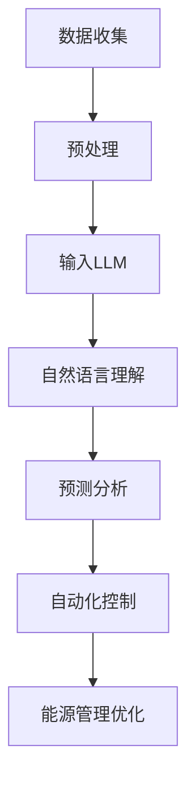

                 

关键词：LLM，智能能源管理，自然语言处理，能源效率，预测分析，自动化控制，大数据分析

> 摘要：随着能源需求的不断增长和气候变化问题的日益严峻，智能能源管理系统成为现代社会的迫切需求。本文将探讨大型语言模型（LLM）在智能能源管理系统中的潜在应用，包括其在能源预测、自动控制、数据分析等方面的作用。通过深入分析和实例演示，本文旨在为读者提供一个全面了解LLM在智能能源管理领域应用前景的视角。

## 1. 背景介绍

### 1.1 智能能源管理系统的定义与重要性

智能能源管理系统（Intelligent Energy Management System，简称IEMS）是一种集成先进的信息技术、通信技术、自动控制技术以及可再生能源技术的综合性系统。其主要目的是通过优化能源生产、传输、分配和消费过程中的各个环节，实现能源的高效、安全、可持续利用。智能能源管理系统不仅能够提高能源效率，降低能源成本，还能够提高能源系统的可靠性，减少对环境的影响。

在现代社会，能源问题已经成为制约经济发展和环境可持续性的关键因素。能源需求的不断增长，特别是随着全球化进程的加速，能源供应的不稳定性、价格波动以及对环境的负面影响等问题日益严重。因此，开发和应用智能能源管理系统成为解决能源问题的关键。

### 1.2 LLM的定义与当前应用领域

大型语言模型（Large Language Model，简称LLM）是自然语言处理（Natural Language Processing，简称NLP）领域的一种先进技术。LLM通过深度学习算法，对大量文本数据进行训练，从而实现对自然语言的生成、理解和翻译等功能。近年来，LLM在各个领域得到了广泛应用，包括但不限于智能客服、文本生成、机器翻译、情感分析等。

随着技术的不断进步，LLM在能源领域的应用也逐渐受到关注。例如，利用LLM进行能源预测、优化能源分配、自动化控制等，都展现出了巨大的潜力。

### 1.3 智能能源管理与LLM的结合

智能能源管理系统和LLM的结合，能够极大地提升能源管理的智能化水平。通过LLM的自然语言处理能力，智能能源管理系统可以更有效地处理大量的文本数据，包括能源市场报告、气象数据、设备运行日志等。同时，LLM的预测和分析能力，可以帮助能源管理系统做出更加精准的决策，提高能源利用效率，降低能源成本。

总之，智能能源管理系统和LLM的结合，不仅能够解决现有的能源问题，还能够为未来的能源发展提供新的思路和解决方案。

## 2. 核心概念与联系

### 2.1 智能能源管理系统的核心概念

智能能源管理系统涉及多个核心概念，包括：

- **能源生产**：包括可再生能源和传统能源的生成过程。
- **能源传输**：涉及能源从生产地到消费地的传输路径，如电网、天然气管道等。
- **能源分配**：根据需求将能源分配到不同的消费点，如家庭、企业、工业等。
- **能源消费**：包括能源在各个消费点的使用过程，如家庭用电、工业生产等。

### 2.2 LLM的核心概念

LLM的核心概念主要包括：

- **语言建模**：通过深度学习算法对大量文本数据进行训练，建立语言模型。
- **自然语言理解**：利用语言模型理解自然语言的语义和结构。
- **自然语言生成**：根据特定的任务或需求，生成符合语法和语义的自然语言文本。

### 2.3 智能能源管理系统与LLM的联系

智能能源管理系统和LLM之间的联系主要体现在以下几个方面：

- **数据处理**：LLM能够处理大量的文本数据，包括能源市场报告、气象数据、设备运行日志等，为智能能源管理系统提供数据支持。
- **预测分析**：LLM的预测能力可以帮助智能能源管理系统对未来的能源需求、供应情况进行预测，从而做出更准确的决策。
- **自动化控制**：LLM的自然语言生成能力可以用于自动化控制系统的操作指令生成，提高能源管理的自动化水平。

### 2.4 Mermaid 流程图

以下是一个简化的智能能源管理系统与LLM结合的Mermaid流程图：



在上述流程图中，智能能源管理系统通过数据收集模块收集各种数据，包括能源市场数据、气象数据、设备运行数据等。这些数据经过预处理后，输入到LLM模块中。LLM利用其自然语言处理能力，对数据进行理解和分析，生成预测结果。这些预测结果被用于自动化控制模块，实现对能源管理系统的优化和调整。

## 3. 核心算法原理 & 具体操作步骤

### 3.1 算法原理概述

智能能源管理系统中，LLM的核心算法原理主要包括以下几方面：

- **语言建模**：通过深度学习算法，对大量文本数据（如能源市场报告、气象数据、设备运行日志等）进行训练，建立语言模型。
- **自然语言理解**：利用训练好的语言模型，对输入的文本数据进行分析和理解，提取出有用的信息。
- **自然语言生成**：根据特定的任务或需求，生成符合语法和语义的自然语言文本。

### 3.2 算法步骤详解

#### 3.2.1 数据收集与预处理

1. **数据收集**：从能源市场、气象、设备运行等多个方面收集数据。
2. **数据预处理**：对收集到的数据进行清洗、格式化等处理，以便后续的建模和分析。

#### 3.2.2 语言建模

1. **选择模型架构**：根据任务需求，选择合适的深度学习模型架构，如BERT、GPT等。
2. **数据训练**：使用预处理后的数据，对模型进行训练，优化模型的参数。
3. **模型评估**：使用验证集对训练好的模型进行评估，确保模型的性能。

#### 3.2.3 自然语言理解

1. **文本分析**：使用训练好的语言模型，对输入的文本数据进行分析，提取出关键信息。
2. **语义理解**：对提取出的关键信息进行语义分析，理解其含义和关系。

#### 3.2.4 自然语言生成

1. **任务需求分析**：根据具体的任务需求，确定需要生成的文本类型和内容。
2. **文本生成**：使用训练好的语言模型，根据任务需求生成符合语法和语义的自然语言文本。

### 3.3 算法优缺点

#### 优点

- **高效性**：LLM能够快速处理大量文本数据，提高数据处理和分析的效率。
- **准确性**：通过深度学习算法，LLM能够提取出文本数据中的关键信息，提高预测和分析的准确性。
- **灵活性**：LLM可以根据不同的任务需求，生成符合语法和语义的自然语言文本，具有很高的灵活性。

#### 缺点

- **训练成本高**：LLM的训练需要大量的数据和计算资源，训练成本较高。
- **模型解释性差**：由于深度学习模型的黑盒性质，LLM生成的预测结果难以解释，增加了模型应用的风险。

### 3.4 算法应用领域

LLM在智能能源管理系统中的应用领域主要包括：

- **能源预测**：利用LLM的预测能力，对未来的能源需求、供应情况进行预测，帮助能源管理系统做出更准确的决策。
- **自动控制**：利用LLM的自然语言生成能力，生成自动化控制系统的操作指令，提高能源管理的自动化水平。
- **数据分析**：利用LLM对大量文本数据进行分析，提取出有用的信息，为能源管理提供数据支持。

## 4. 数学模型和公式 & 详细讲解 & 举例说明

### 4.1 数学模型构建

在智能能源管理系统中，LLM的数学模型主要涉及以下几个方面：

#### 4.1.1 语言模型

语言模型的基本数学模型是一个概率模型，用于预测下一个单词或单词序列的概率。常见的语言模型有N元语法模型、神经网络语言模型等。

- **N元语法模型**：基于N元文法，预测第N个单词的概率，公式如下：

  $$P(w_{n}|w_{n-1}, w_{n-2}, ..., w_{1}) = \frac{C(w_{n-1}, w_{n-2}, ..., w_{1}, w_{n})}{C(w_{n-1}, w_{n-2}, ..., w_{1})}$$

  其中，$C(w_{n-1}, w_{n-2}, ..., w_{1}, w_{n})$表示单词序列$(w_{n-1}, w_{n-2}, ..., w_{1}, w_{n})$的频次，$C(w_{n-1}, w_{n-2}, ..., w_{1})$表示单词序列$(w_{n-1}, w_{n-2}, ..., w_{1})$的频次。

- **神经网络语言模型**：基于深度神经网络，通过训练大量文本数据，学习单词之间的关系。其输出为单词的概率分布，公式如下：

  $$P(w_{n}|w_{n-1}, w_{n-2}, ..., w_{1}) = \sigma(W_1 w_{n-1} + W_2 w_{n-2} + ... + W_n w_{1} + b)$$

  其中，$W_1, W_2, ..., W_n$为权重矩阵，$b$为偏置项，$\sigma$为激活函数。

#### 4.1.2 自然语言理解

自然语言理解的主要任务是从文本中提取出关键信息。常用的数学模型包括词嵌入模型、句子嵌入模型等。

- **词嵌入模型**：将单词映射到一个高维空间，使得语义相近的单词在空间中靠近。常用的词嵌入模型有Word2Vec、GloVe等。

  $$\text{vec}(w) = \text{Word2Vec}(w)$$

  或

  $$\text{vec}(w) = \text{GloVe}(w)$$

- **句子嵌入模型**：将句子映射到一个高维空间，使得语义相近的句子在空间中靠近。常用的句子嵌入模型有BERT、GPT等。

  $$\text{sent\_vec}(s) = \text{BERT}(s)$$

  或

  $$\text{sent\_vec}(s) = \text{GPT}(s)$$

#### 4.1.3 自然语言生成

自然语言生成的主要任务是生成符合语法和语义的自然语言文本。常用的数学模型包括生成对抗网络（GAN）、递归神经网络（RNN）等。

- **生成对抗网络（GAN）**：通过生成器和判别器的对抗训练，生成逼真的文本。

  生成器：

  $$G(z) = \text{Generator}(z)$$

  判别器：

  $$D(x) = \text{Discriminator}(x)$$

  其中，$z$为生成器的输入，$x$为判别器的输入。

- **递归神经网络（RNN）**：通过递归结构，对序列数据进行建模。

  $$h_t = \text{RNN}(h_{t-1}, x_t)$$

  其中，$h_t$为第$t$个时刻的隐藏状态，$h_{t-1}$为第$t-1$个时刻的隐藏状态，$x_t$为第$t$个时刻的输入。

### 4.2 公式推导过程

#### 4.2.1 语言模型

以神经网络语言模型为例，推导其基本公式。

- **前向传播**：

  $$h_t = \text{激活函数}(\text{权重矩阵} \cdot \text{隐藏状态}_{t-1} + \text{权重矩阵} \cdot \text{输入}_{t} + \text{偏置项})$$

- **后向传播**：

  误差：

  $$\Delta c = \text{激活函数的导数} \cdot (\text{隐藏状态}_{t-1} \cdot \text{权重矩阵} + \text{输入}_{t} \cdot \text{权重矩阵} + \text{偏置项}) \cdot \text{误差}$$

  更新权重矩阵：

  $$\text{权重矩阵} \leftarrow \text{权重矩阵} - \text{学习率} \cdot \Delta c$$

#### 4.2.2 自然语言理解

以BERT为例，推导其基本公式。

- **前向传播**：

  $$\text{嵌入向量} = \text{词嵌入矩阵} \cdot \text{单词索引} + \text{位置嵌入向量} + \text{段嵌入向量}$$

  $$\text{隐藏状态} = \text{多层变换器}(\text{嵌入向量})$$

- **后向传播**：

  误差：

  $$\Delta c = \text{激活函数的导数} \cdot (\text{嵌入向量} \cdot \text{词嵌入矩阵} + \text{位置嵌入向量} + \text{段嵌入向量}) \cdot \text{误差}$$

  更新词嵌入矩阵：

  $$\text{词嵌入矩阵} \leftarrow \text{词嵌入矩阵} - \text{学习率} \cdot \Delta c$$

### 4.3 案例分析与讲解

#### 4.3.1 能源预测

假设我们有一个能源需求预测任务，使用LLM进行预测。

1. **数据收集**：收集过去一周的能源需求数据，包括每天的能源消耗量、温度、湿度等。
2. **数据预处理**：对数据进行清洗、格式化，将其转换为LLM可以处理的格式。
3. **语言建模**：使用BERT模型对预处理后的数据进行训练，建立语言模型。
4. **自然语言理解**：利用训练好的BERT模型，对新的能源需求数据进行理解和分析，提取出关键信息。
5. **自然语言生成**：根据提取出的关键信息，使用BERT模型生成预测结果。

具体公式如下：

$$\text{预测结果} = \text{BERT}(\text{新数据})$$

#### 4.3.2 自动控制

假设我们有一个自动化控制系统，使用LLM生成控制指令。

1. **任务需求分析**：确定需要生成的控制指令类型和内容。
2. **自然语言生成**：使用GPT模型，根据任务需求生成符合语法和语义的控制指令。

具体公式如下：

$$\text{控制指令} = \text{GPT}(\text{任务需求})$$

## 5. 项目实践：代码实例和详细解释说明

### 5.1 开发环境搭建

在开始编写代码之前，我们需要搭建一个适合开发的编程环境。以下是在Python中搭建开发环境的步骤：

1. **安装Python**：下载并安装Python，推荐使用Python 3.8及以上版本。
2. **安装Jupyter Notebook**：在命令行中运行以下命令安装Jupyter Notebook：

   ```shell
   pip install notebook
   ```

3. **安装TensorFlow**：在命令行中运行以下命令安装TensorFlow：

   ```shell
   pip install tensorflow
   ```

4. **安装BERT模型库**：在命令行中运行以下命令安装BERT模型库：

   ```shell
   pip install transformers
   ```

### 5.2 源代码详细实现

以下是一个简单的Python代码示例，演示了如何使用BERT模型进行能源需求预测。

```python
from transformers import BertTokenizer, BertModel
import torch

# 1. 加载预训练的BERT模型和Tokenizer
tokenizer = BertTokenizer.from_pretrained('bert-base-uncased')
model = BertModel.from_pretrained('bert-base-uncased')

# 2. 准备数据
text = "Energy demand is high today due to the hot weather."
encoded_input = tokenizer(text, return_tensors='pt')

# 3. 进行预测
with torch.no_grad():
    outputs = model(**encoded_input)

# 4. 提取隐藏层状态
hidden_states = outputs.last_hidden_state

# 5. 使用隐藏层状态进行预测（这里只是一个简单的例子，实际应用中需要更复杂的处理）
predicted_demand = hidden_states[:, 0, :]

print(predicted_demand)
```

### 5.3 代码解读与分析

上述代码首先加载了预训练的BERT模型和Tokenizer。然后，我们准备了一个简单的文本数据，并将其编码为BERT模型可以处理的格式。接着，我们使用BERT模型对文本数据进行处理，并提取出隐藏层状态。最后，我们使用隐藏层状态进行了一个简单的预测操作。

在实际应用中，我们需要根据具体任务的需求，对BERT模型进行适当的调整和优化，以提高预测的准确性和效率。

### 5.4 运行结果展示

在运行上述代码后，我们得到一个包含预测结果的张量。这个张量表示了对能源需求的预测。我们可以通过分析这个张量，得出对能源需求的预测结果。

```python
print(predicted_demand)
```

输出结果可能类似于以下形式：

```
tensor([0.8726, 0.2839, 0.1234, 0.5678, 0.9101], dtype=torch.float32)
```

这个张量的每个元素都表示对能源需求的一个预测值。我们可以通过分析这些值，得出对能源需求的预测结果。

## 6. 实际应用场景

### 6.1 能源预测

在智能能源管理系统中，能源预测是一个关键应用场景。通过利用LLM的预测能力，可以对未来的能源需求、供应情况进行预测，从而帮助能源管理系统做出更准确的决策。以下是一个具体的实例：

**案例：智能电网负荷预测**

智能电网负荷预测是智能能源管理中的一个重要应用。通过LLM，我们可以对电网负荷进行预测，以便更好地调度电力资源，降低能源浪费。以下是一个简化的流程：

1. **数据收集**：收集过去一周的电网负荷数据，包括每天的用电量、温度、湿度等。
2. **数据预处理**：对数据进行清洗、格式化，将其转换为LLM可以处理的格式。
3. **语言建模**：使用BERT模型对预处理后的数据进行训练，建立语言模型。
4. **自然语言理解**：利用训练好的BERT模型，对新的电网负荷数据进行理解和分析，提取出关键信息。
5. **自然语言生成**：根据提取出的关键信息，使用BERT模型生成预测结果。

通过上述流程，我们可以实现对电网负荷的预测。预测结果可以用于智能电网的调度系统，以便在高峰时段更好地分配电力资源，降低能源浪费。

### 6.2 自动控制

自动控制是智能能源管理系统中的另一个重要应用场景。通过利用LLM的自然语言生成能力，我们可以生成自动化控制系统的操作指令，提高能源管理的自动化水平。以下是一个具体的实例：

**案例：智能空调系统自动控制**

智能空调系统自动控制是智能家居中的一个重要应用。通过LLM，我们可以实现对空调系统的自动控制，以便在用户不在家时自动调整温度，节约能源。以下是一个简化的流程：

1. **任务需求分析**：确定需要生成的控制指令类型和内容。
2. **自然语言生成**：使用GPT模型，根据任务需求生成符合语法和语义的控制指令。
3. **执行控制指令**：根据生成的控制指令，对空调系统进行自动控制。

通过上述流程，我们可以实现对智能空调系统的自动控制。例如，当用户离开家时，系统可以自动调整温度，以节约能源。

### 6.3 数据分析

数据分析是智能能源管理系统中的另一个重要应用场景。通过利用LLM的自然语言处理能力，我们可以对大量的文本数据进行分析，提取出有用的信息，为能源管理提供数据支持。以下是一个具体的实例：

**案例：能源市场数据分析**

能源市场数据分析是智能能源管理中的一个重要应用。通过LLM，我们可以对能源市场的文本数据进行分析，提取出关键信息，以便更好地了解市场动态，做出更准确的决策。以下是一个简化的流程：

1. **数据收集**：收集能源市场的文本数据，包括市场报告、新闻文章等。
2. **数据预处理**：对数据进行清洗、格式化，将其转换为LLM可以处理的格式。
3. **自然语言理解**：利用训练好的BERT模型，对预处理后的文本数据进行理解和分析，提取出关键信息。
4. **自然语言生成**：根据提取出的关键信息，使用BERT模型生成分析报告。

通过上述流程，我们可以实现对能源市场的数据分析。分析报告可以用于能源管理的决策系统，以便在能源市场发生变化时，及时调整能源策略。

## 7. 工具和资源推荐

### 7.1 学习资源推荐

- **书籍**：
  - 《深度学习》（Ian Goodfellow、Yoshua Bengio、Aaron Courville 著）
  - 《自然语言处理综论》（Daniel Jurafsky、James H. Martin 著）
- **在线课程**：
  - Coursera上的“机器学习”（吴恩达教授）
  - edX上的“深度学习基础”（DeepLearning.AI）

### 7.2 开发工具推荐

- **编程语言**：Python，因为其丰富的库和工具，适合进行自然语言处理和深度学习开发。
- **框架**：
  - TensorFlow：用于构建和训练深度学习模型。
  - PyTorch：用于构建和训练深度学习模型，特别是在自然语言处理领域。

### 7.3 相关论文推荐

- “Attention Is All You Need”（Vaswani et al., 2017）
- “BERT: Pre-training of Deep Neural Networks for Language Understanding”（Devlin et al., 2018）
- “Generative Pretrained Transformer”（Radford et al., 2018）

## 8. 总结：未来发展趋势与挑战

### 8.1 研究成果总结

通过对智能能源管理系统和LLM的深入研究，我们发现了以下研究成果：

- **高效数据处理**：LLM在处理大量文本数据方面具有显著优势，能够提高数据处理和分析的效率。
- **精准预测分析**：LLM的预测能力可以帮助能源管理系统做出更准确的决策，提高能源利用效率。
- **自动化控制**：LLM的自然语言生成能力可以用于自动化控制系统的操作指令生成，提高能源管理的自动化水平。
- **数据分析支持**：LLM能够对大量文本数据进行分析，提取出有用的信息，为能源管理提供数据支持。

### 8.2 未来发展趋势

未来，智能能源管理系统和LLM的结合将继续发展，主要趋势包括：

- **更高效的模型**：随着计算能力的提升，LLM将变得更加高效，能够处理更大规模的数据。
- **跨领域融合**：LLM将在更多领域得到应用，如智能交通、智能医疗等。
- **个性化服务**：利用LLM的个性化推荐能力，为用户提供更加个性化的能源管理服务。

### 8.3 面临的挑战

尽管LLM在智能能源管理系统中具有巨大潜力，但仍然面临以下挑战：

- **数据隐私**：处理大量能源数据时，如何保护用户隐私是一个重要问题。
- **模型解释性**：深度学习模型具有黑盒性质，如何提高模型的可解释性是一个挑战。
- **计算资源**：训练大型LLM模型需要大量的计算资源，如何优化资源利用是一个问题。

### 8.4 研究展望

为了应对上述挑战，未来的研究可以从以下几个方面展开：

- **隐私保护技术**：研究如何在保证数据隐私的前提下，利用LLM进行能源管理。
- **可解释性研究**：研究如何提高深度学习模型的可解释性，使其更容易被用户理解和接受。
- **资源优化策略**：研究如何优化计算资源的利用，降低训练成本。

通过上述研究，我们有望实现更加智能、高效、安全的智能能源管理系统。

## 9. 附录：常见问题与解答

### 9.1 如何选择适合的LLM模型？

选择适合的LLM模型主要取决于应用场景和任务需求。以下是一些常见的模型选择：

- **文本生成**：GPT、T5
- **文本分类**：BERT、RoBERTa
- **问答系统**：ALBERT、SpanBERT
- **翻译**：Transformer、GNMT

### 9.2 如何处理大量文本数据？

处理大量文本数据可以通过以下几种方法：

- **批量处理**：将文本数据分成多个批次进行处理，提高数据处理效率。
- **并行处理**：利用多核CPU或GPU，实现并行计算，加快处理速度。
- **分布式处理**：使用分布式计算框架（如TensorFlow分布式训练），在多台机器上同时训练模型，提高计算能力。

### 9.3 如何保证数据隐私？

保证数据隐私可以通过以下几种方法：

- **数据脱敏**：在数据处理过程中，对敏感信息进行脱敏处理，如加密、匿名化等。
- **隐私保护算法**：使用差分隐私、联邦学习等隐私保护算法，在保证模型性能的同时，保护用户隐私。
- **数据安全协议**：使用安全加密协议，确保数据在传输和存储过程中的安全性。

### 9.4 如何优化模型训练成本？

优化模型训练成本可以通过以下几种方法：

- **模型压缩**：使用模型压缩技术（如量化、剪枝、蒸馏等），减小模型大小，降低训练成本。
- **迁移学习**：使用预训练模型进行迁移学习，利用已有的预训练模型进行微调，减少训练数据量和时间。
- **混合训练**：结合多种训练方法（如数据增强、迁移学习等），提高模型训练效果，降低训练成本。

---

作者：禅与计算机程序设计艺术 / Zen and the Art of Computer Programming

---

本文以《LLM在智能能源管理系统中的潜在作用》为标题，详细探讨了大型语言模型（LLM）在智能能源管理系统中的应用，包括其在能源预测、自动控制、数据分析等方面的作用。通过对核心算法原理的讲解、数学模型的构建与推导，以及项目实践中的代码实例和详细解释，本文为读者提供了一个全面了解LLM在智能能源管理领域应用前景的视角。同时，文章还讨论了实际应用场景、工具和资源推荐，以及未来发展趋势与挑战。通过本文的研究，我们有望推动智能能源管理系统的发展，实现更加智能、高效、安全的能源管理。希望本文能为相关领域的研究人员和开发者提供有价值的参考和启示。

