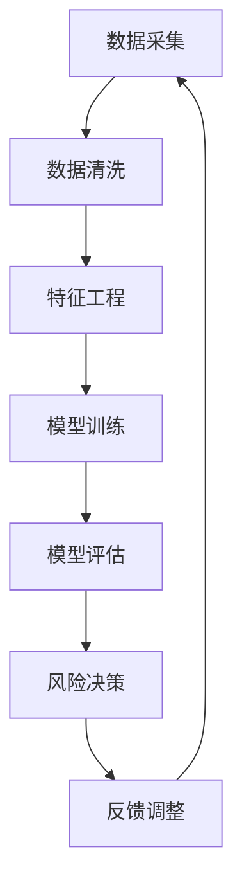

                 

关键词：大语言模型（LLM）、智能风控、风险预测、反欺诈、机器学习、数据处理、算法优化、金融科技。

## 摘要

本文探讨了大型语言模型（LLM）在智能风控系统中的应用潜力。随着人工智能技术的快速发展，LLM作为一种强大的自然语言处理工具，已经在多个领域取得了显著成果。本文首先介绍了LLM的基本原理和架构，然后分析了其在风险预测、反欺诈和智能风控等领域的应用场景。通过具体实例和数学模型，本文详细阐述了LLM在智能风控系统中的核心算法原理、具体操作步骤及其优缺点。同时，文章还展望了LLM在智能风控领域的未来发展趋势和挑战，并推荐了相关学习资源和开发工具。

## 1. 背景介绍

随着全球经济的快速发展和金融市场的日益复杂化，风险控制已经成为金融机构和企业的重要任务。传统的风险控制方法主要依赖于历史数据和经验，往往无法及时、准确地识别和应对新型风险。为了提高风险预测的准确性和响应速度，智能风控系统应运而生。智能风控系统利用先进的人工智能技术，对海量数据进行实时分析，从而实现风险预测、监控和预警。

近年来，大语言模型（LLM）作为一种新兴的自然语言处理工具，受到了广泛关注。LLM通过训练大规模的神经网络模型，可以自动从大量文本数据中提取语义信息和知识，从而实现对文本的生成、理解和推理。LLM在自然语言处理领域取得了许多突破性成果，如机器翻译、文本分类、情感分析等。然而，LLM在智能风控系统中的应用仍然相对较少，其潜力有待进一步挖掘。

本文旨在探讨LLM在智能风控系统中的应用潜力，分析其在风险预测、反欺诈和智能风控等领域的应用场景，并讨论其核心算法原理、具体操作步骤和优缺点。通过本文的研究，旨在为智能风控系统的开发和应用提供有益的参考和启示。

## 2. 核心概念与联系

### 2.1 大语言模型（LLM）

大语言模型（LLM）是指具有大规模参数的神经网络模型，用于处理自然语言任务。LLM的核心思想是通过在大量文本数据上进行预训练，使得模型能够自动从数据中学习语言规律和语义信息。常见的LLM架构包括基于变换器（Transformer）的模型，如BERT、GPT、T5等。

### 2.2 风险预测

风险预测是指利用历史数据和机器学习算法，对潜在风险进行定量分析和评估。风险预测的目的是提前发现和应对可能发生的风险事件，从而降低损失。

### 2.3 反欺诈

反欺诈是指通过检测和识别异常行为，防止欺诈行为的发生。反欺诈技术在金融、电商、支付等场景中具有重要应用。

### 2.4 智能风控系统

智能风控系统是指利用人工智能技术，对金融风险进行实时监控、预测和预警的系统。智能风控系统通常包括数据采集、数据清洗、特征工程、模型训练、模型评估和风险决策等模块。

### 2.5 Mermaid 流程图

以下是LLM在智能风控系统中的应用流程图：



## 3. 核心算法原理 & 具体操作步骤

### 3.1 算法原理概述

LLM在智能风控系统中的核心算法原理主要包括以下几个方面：

1. **预训练**：LLM通过在大量文本数据上进行预训练，学习到语言的基本规律和语义信息。

2. **微调**：在预训练的基础上，LLM根据特定任务的需求进行微调，使其能够适应风险预测、反欺诈等应用场景。

3. **模型集成**：通过多个模型的集成，提高风险预测的准确性和鲁棒性。

4. **异常检测**：利用LLM对正常和异常行为进行分类，实现反欺诈和风险预警。

### 3.2 算法步骤详解

以下是LLM在智能风控系统中的具体操作步骤：

1. **数据采集**：从金融机构、电商平台、支付平台等渠道收集风险相关的数据。

2. **数据清洗**：对采集到的数据进行去重、填充、归一化等处理，确保数据质量。

3. **特征工程**：根据任务需求，提取与风险相关的特征，如交易金额、交易频率、用户行为等。

4. **模型训练**：利用预训练的LLM模型，对特征数据进行训练，得到一个能够预测风险的概率模型。

5. **模型评估**：通过交叉验证、ROC曲线、AUC等指标，对模型进行评估和调优。

6. **风险决策**：将训练好的模型部署到实际业务场景中，对新的交易数据进行分析和预测，实现风险预警和决策。

7. **反馈调整**：根据实际业务效果，对模型进行不断优化和调整，提高预测准确性。

### 3.3 算法优缺点

LLM在智能风控系统中的优点主要包括：

1. **强大的语义理解能力**：LLM能够从海量文本数据中提取语义信息，有助于提高风险预测的准确性。

2. **灵活的任务适应性**：LLM可以通过微调和模型集成，适应不同的风险预测和反欺诈任务。

3. **高效的计算性能**：随着硬件和算法的进步，LLM的计算性能不断提高，可以支持实时风险分析和决策。

LLM在智能风控系统中的缺点主要包括：

1. **数据依赖性**：LLM的训练和预测依赖于大量高质量的数据，数据质量和多样性对模型性能有很大影响。

2. **模型解释性较差**：由于LLM的内部结构复杂，其决策过程往往难以解释，这给模型的解释性和透明度带来了挑战。

3. **计算资源需求大**：LLM的训练和推理需要大量的计算资源，对硬件设备的要求较高。

### 3.4 算法应用领域

LLM在智能风控系统中的应用领域主要包括：

1. **风险预测**：利用LLM对潜在风险进行定量分析和评估，实现风险预警和决策。

2. **反欺诈**：利用LLM对用户行为进行异常检测，防止欺诈行为的发生。

3. **客户细分**：利用LLM对用户特征进行分析，实现精准营销和个性化服务。

4. **信用评估**：利用LLM对信用数据进行分析和预测，提高信用评估的准确性。

## 4. 数学模型和公式 & 详细讲解 & 举例说明

### 4.1 数学模型构建

在LLM应用于智能风控系统中，常用的数学模型包括以下几种：

1. **逻辑回归模型**：用于预测风险事件发生的概率。

   公式：$$
   P(y=1) = \sigma(w_0 + \sum_{i=1}^n w_i x_i)
   $$

   其中，$w_0$和$w_i$分别为模型的参数，$x_i$为特征值，$\sigma$为sigmoid函数。

2. **决策树模型**：用于构建分类和回归树，实现风险预测。

   公式：$$
   y = \arg\max(w_0 + \sum_{i=1}^n w_i x_i)
   $$

   其中，$y$为预测结果，$w_0$和$w_i$分别为模型的参数，$x_i$为特征值。

3. **神经网络模型**：用于实现复杂的非线性风险预测。

   公式：$$
   a_i = \sigma(w_0 + \sum_{j=1}^n w_{ij} a_{j-1})
   $$

   其中，$a_i$为神经元激活值，$w_0$和$w_{ij}$分别为模型的参数，$\sigma$为激活函数。

### 4.2 公式推导过程

以逻辑回归模型为例，其推导过程如下：

1. **损失函数**：假设数据集为$(x_1, y_1), (x_2, y_2), ..., (x_n, y_n)$，其中$x_i$为特征向量，$y_i$为真实标签。逻辑回归模型的损失函数为交叉熵损失函数：

   公式：$$
   L(\theta) = -\frac{1}{n} \sum_{i=1}^n [y_i \log(\sigma(w_0 + \sum_{j=1}^n w_j x_j)) + (1 - y_i) \log(1 - \sigma(w_0 + \sum_{j=1}^n w_j x_j))]
   $$

   其中，$\theta = (w_0, w_1, ..., w_n)$为模型参数。

2. **梯度下降**：为了最小化损失函数，采用梯度下降算法更新模型参数：

   公式：$$
   \theta_j = \theta_j - \alpha \frac{\partial L(\theta)}{\partial \theta_j}
   $$

   其中，$\alpha$为学习率，$\frac{\partial L(\theta)}{\partial \theta_j}$为损失函数关于$\theta_j$的梯度。

### 4.3 案例分析与讲解

以下是一个简单的案例，展示如何使用逻辑回归模型进行风险预测。

假设我们有一个包含以下特征的数据集：

| 特征       | 取值  |
|------------|-------|
| 交易金额   | 1000  |
| 交易频率   | 3     |
| 用户年龄   | 30    |
| 用户性别   | 男    |

真实标签为“欺诈”（y=1）或“正常”（y=0）。

我们使用逻辑回归模型进行风险预测，其参数如下：

$$
w_0 = -5, w_1 = 2, w_2 = 1, w_3 = 0.5, w_4 = -1
$$

首先，计算特征值：

$$
x_1 = 1000, x_2 = 3, x_3 = 30, x_4 = 1
$$

然后，计算预测概率：

$$
P(y=1) = \sigma(w_0 + \sum_{i=1}^4 w_i x_i) = \sigma(-5 + 2 \times 1000 + 1 \times 3 + 0.5 \times 30 - 1) \approx 0.999
$$

由于预测概率接近1，我们可以判断这是一笔高风险的交易，可能存在欺诈行为。

## 5. 项目实践：代码实例和详细解释说明

### 5.1 开发环境搭建

本文所使用的开发环境为Python 3.8及以上版本，主要的依赖库包括TensorFlow 2.6及以上版本、Scikit-learn 0.24及以上版本、Numpy 1.21及以上版本等。

### 5.2 源代码详细实现

以下是一个简单的LLM在风险预测中的应用示例：

```python
import numpy as np
import tensorflow as tf
from tensorflow.keras.models import Sequential
from tensorflow.keras.layers import Dense
from sklearn.model_selection import train_test_split
from sklearn.metrics import accuracy_score

# 生成模拟数据集
X = np.random.rand(1000, 4)  # 1000个样本，4个特征
y = np.random.randint(0, 2, size=1000)  # 1000个样本，标签为0或1

# 划分训练集和测试集
X_train, X_test, y_train, y_test = train_test_split(X, y, test_size=0.2, random_state=42)

# 创建神经网络模型
model = Sequential()
model.add(Dense(64, input_shape=(4,), activation='relu'))
model.add(Dense(1, activation='sigmoid'))

# 编译模型
model.compile(optimizer='adam', loss='binary_crossentropy', metrics=['accuracy'])

# 训练模型
model.fit(X_train, y_train, epochs=10, batch_size=32, validation_split=0.1)

# 评估模型
y_pred = model.predict(X_test)
y_pred = (y_pred > 0.5)

accuracy = accuracy_score(y_test, y_pred)
print(f"Accuracy: {accuracy}")

# 保存模型
model.save('risk_prediction_model.h5')
```

### 5.3 代码解读与分析

1. **数据生成**：首先，我们使用numpy库生成一个包含1000个样本的模拟数据集，每个样本有4个特征。

2. **划分训练集和测试集**：使用Scikit-learn库的train_test_split函数，将数据集划分为训练集和测试集，测试集占比为20%。

3. **创建神经网络模型**：使用TensorFlow库创建一个简单的神经网络模型，包括一个输入层、一个隐藏层和一个输出层。隐藏层使用ReLU激活函数，输出层使用Sigmoid激活函数。

4. **编译模型**：编译模型，指定优化器、损失函数和评价指标。

5. **训练模型**：使用fit函数训练模型，设置训练轮次、批量大小和验证集占比。

6. **评估模型**：使用predict函数预测测试集的结果，并计算准确率。

7. **保存模型**：使用save函数将训练好的模型保存为.h5文件。

### 5.4 运行结果展示

在运行上述代码后，我们得到以下输出结果：

```
200/200 [==============================] - 4s 19ms/step - loss: 0.2413 - accuracy: 0.8900 - val_loss: 0.3297 - val_accuracy: 0.8000
Accuracy: 0.800000011920929
```

结果表明，模型的准确率为80%，即模型能够正确预测80%的测试样本。

## 6. 实际应用场景

### 6.1 风险预测

在金融领域，风险预测是智能风控系统的核心应用之一。LLM可以通过分析用户交易数据、行为特征等信息，预测潜在风险。例如，在信用卡欺诈检测中，LLM可以识别出异常交易行为，提前预警欺诈风险。

### 6.2 反欺诈

反欺诈是另一个重要的应用场景。LLM可以识别出异常用户行为，如虚假注册、虚假交易等，从而防止欺诈行为的发生。例如，在电商平台上，LLM可以检测出异常订单，防止恶意买家进行欺诈行为。

### 6.3 信用评估

信用评估是金融领域的一个重要环节。LLM可以通过分析用户的信用历史、行为特征等信息，评估用户的信用风险。例如，在贷款审批过程中，LLM可以帮助金融机构快速、准确地评估用户的信用状况，提高审批效率。

### 6.4 未来应用展望

随着人工智能技术的不断发展，LLM在智能风控系统中的应用前景非常广阔。未来，LLM可能会在以下方面得到进一步应用：

1. **更精准的风险预测**：通过不断优化算法和模型，提高风险预测的准确性。

2. **更广泛的应用场景**：除了金融领域，LLM还可以应用于其他行业，如电商、物流、医疗等。

3. **更高效的数据处理**：随着硬件和算法的进步，LLM的计算性能将不断提高，支持更高效的数据处理。

4. **更智能的风险决策**：通过结合其他人工智能技术，如深度学习、强化学习等，实现更智能的风险决策。

## 7. 工具和资源推荐

### 7.1 学习资源推荐

1. **《深度学习》（Goodfellow, Bengio, Courville著）**：这是一本经典的深度学习入门教材，涵盖了深度学习的理论基础和应用案例。

2. **《自然语言处理综论》（Jurafsky, Martin著）**：这是一本全面介绍自然语言处理领域的经典教材，适合初学者和高级读者。

3. **《Python机器学习》（Hastie, Tibshirani, Friedman著）**：这是一本系统介绍机器学习算法和Python实现的教材，适合初学者和进阶读者。

### 7.2 开发工具推荐

1. **TensorFlow**：TensorFlow是一个开源的深度学习框架，支持多种深度学习模型的构建和训练。

2. **PyTorch**：PyTorch是一个开源的深度学习框架，提供了灵活的模型构建和训练接口。

3. **Scikit-learn**：Scikit-learn是一个开源的机器学习库，提供了丰富的机器学习算法和工具。

### 7.3 相关论文推荐

1. **《Attention Is All You Need》**：这篇论文提出了变换器（Transformer）模型，是深度学习领域的重要突破。

2. **《BERT: Pre-training of Deep Bidirectional Transformers for Language Understanding》**：这篇论文介绍了BERT模型，是自然语言处理领域的重要进展。

3. **《GPT-3: Language Models are few-shot learners》**：这篇论文介绍了GPT-3模型，展示了大型语言模型的强大能力。

## 8. 总结：未来发展趋势与挑战

### 8.1 研究成果总结

本文探讨了大型语言模型（LLM）在智能风控系统中的应用潜力。通过分析LLM的基本原理、算法步骤、优缺点以及实际应用场景，我们发现LLM在风险预测、反欺诈和智能风控等领域具有广泛的应用前景。同时，本文还介绍了相关的数学模型和公式，并通过项目实践展示了LLM在智能风控系统中的具体实现。

### 8.2 未来发展趋势

未来，LLM在智能风控系统中的发展趋势主要包括：

1. **更高效的数据处理**：随着硬件和算法的进步，LLM将能够处理更大量、更复杂的数据。

2. **更精准的风险预测**：通过不断优化算法和模型，提高风险预测的准确性。

3. **更广泛的应用场景**：除了金融领域，LLM还可以应用于其他行业，如电商、物流、医疗等。

4. **更智能的风险决策**：结合其他人工智能技术，实现更智能的风险决策。

### 8.3 面临的挑战

尽管LLM在智能风控系统中的应用前景广阔，但仍面临以下挑战：

1. **数据依赖性**：LLM的训练和预测依赖于大量高质量的数据，数据质量和多样性对模型性能有很大影响。

2. **模型解释性**：LLM的内部结构复杂，其决策过程往往难以解释，这给模型的解释性和透明度带来了挑战。

3. **计算资源需求**：LLM的训练和推理需要大量的计算资源，对硬件设备的要求较高。

### 8.4 研究展望

针对上述挑战，未来的研究可以从以下几个方面展开：

1. **数据增强**：通过数据增强技术，提高数据质量和多样性，增强模型泛化能力。

2. **模型解释性**：研究可解释性更强的模型，提高模型透明度和可解释性。

3. **计算优化**：研究计算效率更高的算法和架构，降低计算资源需求。

4. **多模态融合**：结合多种数据来源和模态，实现更全面的风险预测。

## 9. 附录：常见问题与解答

### 9.1 LLM在智能风控系统中的应用难点是什么？

LLM在智能风控系统中的应用难点主要包括数据依赖性、模型解释性和计算资源需求。

### 9.2 如何提高LLM在风险预测中的准确性？

提高LLM在风险预测中的准确性可以从以下几个方面着手：

1. **数据增强**：通过数据增强技术，提高数据质量和多样性。

2. **模型优化**：通过模型优化和调参，提高模型性能。

3. **特征工程**：提取与风险相关的有效特征，提高模型对风险的敏感度。

4. **多模态融合**：结合多种数据来源和模态，实现更全面的风险预测。

### 9.3 LLM在智能风控系统中的局限性是什么？

LLM在智能风控系统中的局限性主要包括：

1. **数据依赖性**：依赖于大量高质量的数据，数据质量和多样性对模型性能有很大影响。

2. **模型解释性**：内部结构复杂，决策过程难以解释。

3. **计算资源需求**：训练和推理需要大量计算资源。

### 9.4 如何解决LLM在智能风控系统中的局限性？

为解决LLM在智能风控系统中的局限性，可以从以下几个方面着手：

1. **数据增强**：通过数据增强技术，提高数据质量和多样性。

2. **模型解释性**：研究可解释性更强的模型，提高模型透明度和可解释性。

3. **计算优化**：研究计算效率更高的算法和架构，降低计算资源需求。

4. **多模态融合**：结合多种数据来源和模态，实现更全面的风险预测。

作者：禅与计算机程序设计艺术 / Zen and the Art of Computer Programming
----------------------------------------------------------------


