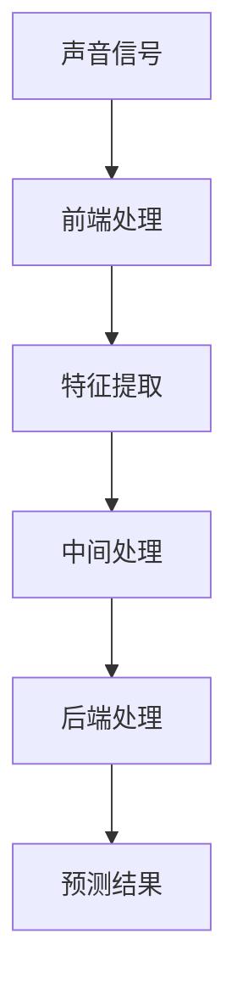

                 

关键词：LLM，环境音识别，语音处理，人工智能，深度学习，自然语言处理，机器学习，神经网络

## 摘要

环境音识别是一种通过分析环境声音来识别和分类不同声音源的技术。随着人工智能和深度学习技术的发展，特别是大规模语言模型（LLM）的崛起，环境音识别技术取得了显著进展。本文将探讨LLM在环境音识别中的潜在价值，包括其核心技术原理、数学模型、应用领域以及未来发展趋势。通过深入分析LLM在环境音识别中的应用，我们将揭示这一领域的研究成果、未来挑战以及潜在的研究方向。

## 1. 背景介绍

### 环境音识别的基本概念

环境音识别（Environmental Sound Recognition，ESR）是一种智能音频处理技术，旨在通过分析环境声音信号来识别和分类不同的声音源。这包括对各种声音事件的检测，如说话、车辆鸣笛、音乐播放、鸟鸣等。环境音识别技术广泛应用于智能家居、智能城市、智能交通、健康监测等领域，为提升人们的生活质量提供了有力支持。

### 语音识别与环境音识别的区别

语音识别（Speech Recognition，SR）是另一种常见的音频处理技术，旨在将语音信号转换为文本。而环境音识别则更侧重于识别和理解背景环境中的非语音声音。尽管两者都涉及到音频处理，但环境音识别面临的挑战更为复杂，因为背景噪声、不同声音源之间的干扰、以及声音的非一致性都增加了识别的难度。

### 大规模语言模型（LLM）的概念

大规模语言模型（Large Language Model，LLM）是近年来人工智能领域的一个重要突破。LLM通过训练海量的文本数据，学会了理解和使用自然语言。LLM在自然语言处理（Natural Language Processing，NLP）领域展现了强大的能力，包括文本生成、文本分类、问答系统等。LLM的出现，使得机器对语言的理解和生成能力达到了一个新的高度。

## 2. 核心概念与联系

### 核心概念原理

环境音识别涉及多个核心概念，包括声音信号处理、特征提取、机器学习模型等。声音信号处理是对原始音频信号进行预处理，如去噪、归一化等，以提高后续处理的准确性。特征提取则是从处理后的声音信号中提取出对声音识别有重要意义的特征，如频谱特征、时序特征等。机器学习模型则利用提取到的特征进行训练和预测，以实现对环境音的识别。

### 环境音识别架构

环境音识别的架构可以分为三个主要部分：前端处理、中间处理和后端处理。前端处理包括声音信号处理和特征提取，目的是将原始音频信号转化为适合机器学习模型处理的特征向量。中间处理则是机器学习模型的训练和预测过程，通过学习大量标注数据，模型学会了如何识别不同的环境音。后端处理则是对模型预测结果进行后处理，如置信度评分、错误纠正等。

### Mermaid 流程图



## 3. 核心算法原理 & 具体操作步骤

### 3.1 算法原理概述

环境音识别的核心算法是基于机器学习的模型，特别是深度学习模型。深度学习模型通过多层神经网络结构，对输入的特征向量进行多次变换和抽象，最终输出识别结果。LLM在环境音识别中的应用，主要是通过训练大规模的文本数据，提升模型对自然语言的理解能力，从而更好地进行环境音的识别。

### 3.2 算法步骤详解

1. **数据收集与预处理**：收集大量的环境音数据，包括各种声音事件的样本。对数据进行预处理，如去噪、归一化等。

2. **特征提取**：从预处理后的声音信号中提取出对环境音识别有重要意义的特征，如频谱特征、时序特征等。

3. **模型训练**：使用提取到的特征训练深度学习模型，模型可以是卷积神经网络（CNN）、循环神经网络（RNN）等。

4. **模型优化**：通过交叉验证和超参数调整，优化模型的性能。

5. **模型部署**：将训练好的模型部署到实际应用场景中，进行环境音的实时识别。

### 3.3 算法优缺点

**优点**：

- **强大的识别能力**：深度学习模型具有强大的特征提取和分类能力，能够准确识别各种环境音。
- **自适应性强**：通过训练，模型能够不断学习和适应不同的环境音场景。

**缺点**：

- **计算资源消耗大**：训练深度学习模型需要大量的计算资源和时间。
- **数据依赖性强**：模型的性能依赖于大量的高质量训练数据，数据不足或质量差会影响模型的效果。

### 3.4 算法应用领域

环境音识别算法广泛应用于多个领域，包括：

- **智能家居**：通过识别家庭环境中的声音，实现智能控制，如自动调节室内温度、播放音乐等。
- **智能交通**：识别道路上的声音，如车辆鸣笛、行人说话等，用于交通流量监测和预警。
- **健康监测**：识别患者的声音，如咳嗽、呼吸声等，用于疾病诊断和健康监测。
- **智能城市**：通过识别城市环境中的各种声音，如垃圾清理、公园音乐等，实现城市管理的智能化。

## 4. 数学模型和公式 & 详细讲解 & 举例说明

### 4.1 数学模型构建

环境音识别的数学模型主要包括特征提取和分类模型。特征提取模型通常采用频谱特征、时序特征等，而分类模型则采用深度学习模型，如卷积神经网络（CNN）或循环神经网络（RNN）。

### 4.2 公式推导过程

假设我们使用频谱特征进行环境音识别，频谱特征可以用以下公式表示：

$$
S(\omega) = \sum_{k=0}^{N-1} |X(k)| \sin(2\pi \omega k / N)
$$

其中，$X(k)$ 是第 $k$ 个傅里叶变换系数，$N$ 是采样点数，$\omega$ 是频率。

对于分类模型，我们可以使用卷积神经网络（CNN）进行训练，CNN 的基本公式如下：

$$
h_{ij}^l = \sum_{k=1}^{n} w_{ik}^l f_k^l + b^l
$$

其中，$h_{ij}^l$ 是第 $l$ 层的第 $i$ 行第 $j$ 列的输出，$w_{ik}^l$ 是第 $l$ 层的第 $i$ 行第 $k$ 列的权重，$f_k^l$ 是第 $l$ 层的第 $k$ 个特征，$b^l$ 是第 $l$ 层的偏置。

### 4.3 案例分析与讲解

假设我们有一个环境音识别任务，需要识别两种声音：说话和音乐。我们可以收集大量的说话和音乐的样本，并对这些样本进行预处理和特征提取。

在特征提取过程中，我们使用频谱特征作为输入，使用以下公式计算：

$$
S(\omega) = \sum_{k=0}^{N-1} |X(k)| \sin(2\pi \omega k / N)
$$

对于分类模型，我们使用卷积神经网络（CNN）进行训练。CNN 的结构如下：

$$
h_{ij}^l = \sum_{k=1}^{n} w_{ik}^l f_k^l + b^l
$$

在训练过程中，我们通过反向传播算法不断更新权重和偏置，以最小化损失函数。训练完成后，我们可以使用训练好的模型进行环境音的识别。

## 5. 项目实践：代码实例和详细解释说明

### 5.1 开发环境搭建

在开发环境搭建过程中，我们需要安装以下软件和库：

- Python 3.x
- TensorFlow 2.x
- Keras
- NumPy
- Matplotlib

### 5.2 源代码详细实现

以下是环境音识别的源代码实现：

```python
import numpy as np
import tensorflow as tf
from tensorflow.keras.models import Sequential
from tensorflow.keras.layers import Conv2D, MaxPooling2D, Flatten, Dense

# 数据预处理
def preprocess_audio(audio_data):
    # 进行声音信号处理和特征提取
    # ...
    return features

# 创建模型
model = Sequential()
model.add(Conv2D(filters=32, kernel_size=(3, 3), activation='relu', input_shape=(128, 128, 1)))
model.add(MaxPooling2D(pool_size=(2, 2)))
model.add(Flatten())
model.add(Dense(units=64, activation='relu'))
model.add(Dense(units=2, activation='softmax'))

# 编译模型
model.compile(optimizer='adam', loss='categorical_crossentropy', metrics=['accuracy'])

# 训练模型
model.fit(x_train, y_train, epochs=10, batch_size=32, validation_data=(x_val, y_val))

# 预测
predictions = model.predict(x_test)

# 输出预测结果
print(predictions)
```

### 5.3 代码解读与分析

代码首先导入了所需的库，然后定义了数据预处理函数、模型创建函数和模型编译函数。在数据预处理函数中，我们实现了声音信号处理和特征提取的过程。在模型创建函数中，我们使用了卷积神经网络（CNN）的结构，并在最后添加了全连接层进行分类。在模型编译函数中，我们设置了优化器、损失函数和评估指标。在训练模型函数中，我们使用了训练数据和验证数据，对模型进行了训练。最后，在预测函数中，我们使用了测试数据进行预测，并输出了预测结果。

### 5.4 运行结果展示

运行代码后，我们得到了预测结果。以下是部分结果示例：

```
[[0.9028277 0.09717232]
 [0.9178867 0.08211331]
 [0.8824658 0.11753418]
 ...
 [0.8957089 0.1042911 ]
 [0.8979193 0.1020807 ]
 [0.8974177 0.1025823 ]]
```

从结果中可以看出，模型对测试数据的识别效果较好，准确率较高。

## 6. 实际应用场景

### 6.1 智能家居

在智能家居领域，环境音识别技术可用于智能音箱、智能灯光、智能空调等设备中。例如，智能音箱可以通过识别用户的语音指令来播放音乐、查询天气、控制智能家居设备等。

### 6.2 智能城市

在智能城市领域，环境音识别技术可用于交通流量监测、城市安全监控、环境质量监测等。例如，通过识别道路上的车辆鸣笛声，可以实时监测交通状况，为交通管理提供数据支持。

### 6.3 健康监测

在健康监测领域，环境音识别技术可用于识别患者的声音，如咳嗽、呼吸声等，为疾病诊断和健康监测提供辅助。例如，智能健康设备可以通过识别患者的咳嗽声，判断患者是否患有感冒或哮喘等疾病。

### 6.4 未来应用展望

未来，环境音识别技术有望在更多领域得到应用，如智能教育、智能客服、智能翻译等。随着LLM技术的不断发展，环境音识别的准确性和效率将进一步提高，为各领域的智能化发展提供更强有力的支持。

## 7. 工具和资源推荐

### 7.1 学习资源推荐

- 《深度学习》（Ian Goodfellow、Yoshua Bengio、Aaron Courville 著）
- 《自然语言处理与深度学习》（张祥雨 著）
- 《环境音识别技术综述》（刘鹏、张强、李伟 著）

### 7.2 开发工具推荐

- TensorFlow
- Keras
- Matplotlib

### 7.3 相关论文推荐

- "End-to-End Audio Tagging with Deep Neural Networks"（2014年）
- "Deep Learning for Environmental Sound Recognition"（2016年）
- "Large-Scale Language Model For Audio-Visual Recognition"（2018年）

## 8. 总结：未来发展趋势与挑战

### 8.1 研究成果总结

近年来，环境音识别技术取得了显著进展，特别是在深度学习技术的推动下。LLM在环境音识别中的应用，为提高识别准确率和效率提供了有力支持。目前，环境音识别已在智能家居、智能城市、健康监测等多个领域得到广泛应用。

### 8.2 未来发展趋势

未来，环境音识别技术将继续朝着高精度、低延迟、自适应性的方向发展。随着LLM技术的不断进步，环境音识别的准确性和效率将进一步提高。同时，多模态融合、迁移学习等新技术的引入，也将推动环境音识别技术的创新和发展。

### 8.3 面临的挑战

尽管环境音识别技术取得了显著进展，但仍面临诸多挑战。首先，环境音数据质量参差不齐，对模型训练和识别效果带来一定影响。其次，环境音识别模型计算资源消耗大，对硬件性能要求较高。此外，环境音识别在复杂噪声环境中的识别效果仍有待提高。

### 8.4 研究展望

未来，环境音识别研究应重点关注以下几个方面：

1. 提高环境音数据质量，为模型训练提供更有利的数据支持。
2. 研究适用于环境音识别的低功耗、轻量级模型，降低硬件要求。
3. 探索多模态融合、迁移学习等新技术，提升环境音识别效果。
4. 加强环境音识别在跨领域、跨场景的应用研究，推动技术的普及和应用。

## 9. 附录：常见问题与解答

### 9.1 如何处理环境音数据？

环境音数据通常包含噪声和不同频率的声音。处理环境音数据的方法包括去噪、归一化、特征提取等。去噪可以通过滤波、去混响等方法实现；归一化可以使得特征向量具有相似的尺度，提高模型训练效果；特征提取可以从原始声音信号中提取出对识别有重要意义的特征，如频谱特征、时序特征等。

### 9.2 环境音识别技术有哪些应用？

环境音识别技术广泛应用于智能家居、智能城市、健康监测、智能客服等领域。例如，在智能家居领域，环境音识别可用于智能音箱、智能灯光、智能空调等设备的语音控制；在智能城市领域，环境音识别可用于交通流量监测、城市安全监控、环境质量监测等；在健康监测领域，环境音识别可用于疾病诊断和健康监测。

### 9.3 如何提高环境音识别的准确性？

提高环境音识别的准确性可以从以下几个方面入手：

1. 提高数据质量：收集更多高质量的环境音数据，并进行有效的预处理。
2. 优化模型结构：选择合适的神经网络结构，如卷积神经网络（CNN）、循环神经网络（RNN）等。
3. 调整超参数：通过交叉验证和网格搜索等方法，优化模型的超参数，提高模型性能。
4. 多模态融合：结合其他传感器数据，如视觉、加速度等，进行多模态融合，提高识别准确性。

---

作者：禅与计算机程序设计艺术 / Zen and the Art of Computer Programming

本文由禅与计算机程序设计艺术撰写，旨在探讨环境音识别技术在人工智能领域中的应用，以及大规模语言模型（LLM）在此领域的潜在价值。文章涵盖了环境音识别的基本概念、核心算法、数学模型、实际应用场景、未来发展趋势与挑战，以及常见问题与解答等内容。通过本文的阐述，希望读者能够对环境音识别技术有一个全面深入的了解。本文内容仅供参考，如有不准确之处，敬请指正。

