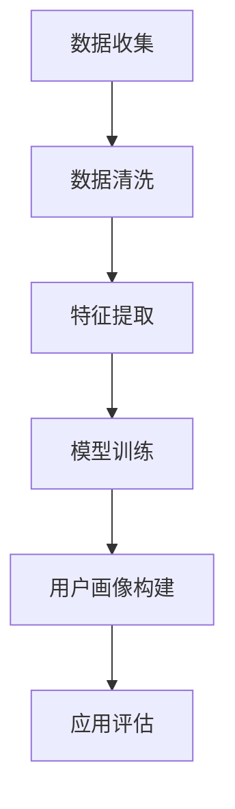

                 

关键词：LLM、用户画像、人工智能、机器学习、数据分析、自然语言处理

> 摘要：本文将深入探讨大型语言模型（LLM）在构建用户画像中的应用，分析其核心概念、算法原理、应用场景以及未来的发展前景。通过对LLM的深入理解，我们希望读者能够更好地把握这一技术的核心价值，为未来的研究和应用奠定基础。

## 1. 背景介绍

用户画像（User Profiling）是指通过对用户行为、兴趣、需求等多维度数据进行分析，构建出一个具有详细特征的用户模型。用户画像在精准营销、个性化推荐、用户行为分析等领域具有广泛的应用价值。然而，传统的用户画像构建方法通常依赖于统计分析和机器学习方法，存在以下局限性：

- **数据依赖性**：需要大量的用户数据来训练模型，且数据的获取和处理过程复杂。
- **模型可解释性**：模型内部的决策过程往往较为复杂，难以进行解释和验证。
- **实时性**：传统方法在处理实时数据时效果不佳，难以满足快速变化的需求。

随着人工智能技术的发展，尤其是大型语言模型（LLM）的出现，为用户画像的构建带来了新的机遇。LLM具有强大的自然语言处理能力和丰富的知识表示能力，能够从大量的文本数据中提取出有价值的信息，为用户画像的构建提供了新的思路和方法。

## 2. 核心概念与联系

### 2.1. 大型语言模型（LLM）

大型语言模型（LLM）是一种基于深度学习的自然语言处理模型，其核心思想是通过大规模的文本数据进行预训练，然后通过微调（Fine-tuning）来适应特定的任务。LLM的主要特点包括：

- **强大的语言理解能力**：LLM能够理解复杂的语言结构，包括句子、段落甚至整篇文章的意义。
- **丰富的知识表示**：LLM通过预训练积累了丰富的语言知识和背景信息，能够进行知识推理和回答复杂问题。
- **高度可调性**：LLM可以通过微调来适应各种不同的自然语言处理任务。

### 2.2. 用户画像构建方法

用户画像的构建通常包括数据收集、数据清洗、特征提取和模型训练等步骤。传统的用户画像构建方法主要依赖于统计分析和机器学习方法，如聚类分析、协同过滤、决策树等。而基于LLM的用户画像构建方法则主要依赖于以下技术：

- **文本分类**：通过对用户的文本数据进行分类，识别出用户的兴趣、偏好等信息。
- **实体识别**：通过识别文本中的实体，如人名、地点、组织等，构建出用户的社交关系和网络。
- **情感分析**：通过对用户的文本数据进行分析，识别出用户的情感状态和态度。
- **知识图谱**：通过构建知识图谱，将用户的兴趣、偏好、行为等信息进行整合和关联。

### 2.3. Mermaid流程图

以下是用户画像构建的Mermaid流程图：



### 2.4. 相关性分析

LLM在用户画像构建中的角色主要体现在以下几个方面：

- **数据预处理**：LLM可以高效地处理和清洗大量文本数据，为后续的特征提取和模型训练提供高质量的数据。
- **特征提取**：LLM可以从大量的文本数据中提取出有价值的信息，如关键词、主题、情感等，为用户画像的构建提供丰富的特征。
- **模型训练**：LLM可以通过预训练和微调，构建出高精度的用户画像模型，提高模型的准确性和实时性。

## 3. 核心算法原理 & 具体操作步骤

### 3.1. 算法原理概述

基于LLM的用户画像构建方法主要包括以下步骤：

1. **数据收集**：收集用户的行为数据、文本数据等，如社交媒体数据、购物数据、评论数据等。
2. **数据清洗**：对收集到的数据进行清洗和预处理，去除噪声和冗余信息，提高数据质量。
3. **特征提取**：使用LLM对预处理后的文本数据进行特征提取，提取出关键词、主题、情感等信息。
4. **模型训练**：使用提取到的特征数据，通过深度学习算法训练出用户画像模型。
5. **用户画像构建**：使用训练好的模型对新的用户数据进行画像构建，生成详细的用户画像。
6. **应用评估**：对构建的用户画像进行评估，验证模型的准确性和实时性。

### 3.2. 算法步骤详解

1. **数据收集**：数据收集是用户画像构建的基础，主要包括以下数据类型：

- **用户行为数据**：如浏览历史、购买记录、评论等。
- **文本数据**：如用户生成的文本评论、博客、社交媒体帖子等。
- **外部数据**：如用户的社会关系、地理位置、职业等。

2. **数据清洗**：数据清洗主要包括以下步骤：

- **去除噪声数据**：去除重复、错误、无关的数据。
- **缺失值处理**：对于缺失的数据，可以使用填充、删除或插值等方法进行处理。
- **异常值处理**：去除或修正异常值，保证数据的可靠性。

3. **特征提取**：使用LLM对清洗后的文本数据进行特征提取，具体步骤如下：

- **分词**：将文本数据分解为单词或词组。
- **词性标注**：对每个词进行词性标注，如名词、动词、形容词等。
- **实体识别**：识别文本中的实体，如人名、地点、组织等。
- **情感分析**：分析文本中的情感倾向，如正面、负面、中性等。
- **主题提取**：提取文本的主题信息，如关键词、主题词等。

4. **模型训练**：使用提取到的特征数据，通过深度学习算法训练出用户画像模型，具体步骤如下：

- **数据预处理**：将特征数据进行归一化、标准化等预处理。
- **模型选择**：选择合适的深度学习模型，如卷积神经网络（CNN）、循环神经网络（RNN）、Transformer等。
- **模型训练**：使用训练数据对模型进行训练，优化模型的参数。
- **模型评估**：使用验证数据对模型进行评估，调整模型参数。

5. **用户画像构建**：使用训练好的模型对新的用户数据进行画像构建，生成详细的用户画像。

6. **应用评估**：对构建的用户画像进行评估，验证模型的准确性和实时性。

### 3.3. 算法优缺点

**优点**：

- **强大的语言理解能力**：LLM能够理解复杂的语言结构，提取出有价值的信息，提高用户画像的准确性。
- **丰富的知识表示**：LLM通过预训练积累了丰富的语言知识和背景信息，能够进行知识推理和回答复杂问题。
- **实时性**：LLM可以快速处理和更新用户数据，实现实时用户画像构建。

**缺点**：

- **数据依赖性**：LLM需要大量的文本数据进行预训练，数据获取和处理过程复杂。
- **模型可解释性**：LLM的决策过程较为复杂，难以进行解释和验证。

### 3.4. 算法应用领域

LLM在用户画像构建中的应用领域包括：

- **个性化推荐**：根据用户的兴趣和行为，提供个性化的商品、内容等推荐。
- **精准营销**：根据用户的画像，实现精准的广告投放和营销策略。
- **用户行为分析**：分析用户的行为模式，发现潜在的用户需求和行为趋势。

## 4. 数学模型和公式 & 详细讲解 & 举例说明

### 4.1. 数学模型构建

基于LLM的用户画像构建模型可以看作是一个多分类问题，其数学模型可以表示为：

$$
P(y=c_k|X) = \frac{e^{\theta_k^T X}}{\sum_{j=1}^K e^{\theta_j^T X}}
$$

其中，$X$为输入特征向量，$y$为真实标签，$c_k$为第$k$个类别，$\theta_k$为类别$k$的参数向量。

### 4.2. 公式推导过程

假设我们有一个训练数据集$D=\{(X_1, y_1), (X_2, y_2), \ldots, (X_N, y_N)\}$，其中$X_i$为输入特征向量，$y_i$为真实标签。我们的目标是找到一个参数向量$\theta$，使得预测概率$P(y=c_k|X)$最大。

首先，我们定义损失函数为：

$$
L(\theta) = -\sum_{i=1}^N y_i \log P(y_i|X_i)
$$

其中，$P(y_i|X_i)$为预测概率。

为了求解最优参数$\theta$，我们对损失函数$L(\theta)$进行求导，并令导数为0，得到：

$$
\frac{\partial L(\theta)}{\partial \theta} = 0
$$

对上式进行求导，得到：

$$
\frac{\partial}{\partial \theta} \left( -\sum_{i=1}^N y_i \log \frac{e^{\theta_k^T X_i}}{\sum_{j=1}^K e^{\theta_j^T X_i}} \right) = 0
$$

化简得：

$$
\theta_k^T X_i - \sum_{j=1}^K \theta_j^T X_i = 0
$$

移项得：

$$
\theta_k^T X_i = \sum_{j=1}^K \theta_j^T X_i
$$

进一步化简得：

$$
\theta_k^T X_i = \theta^T X_i
$$

其中，$\theta^T X_i$为输入特征向量的内积。

因此，最优参数$\theta$满足：

$$
\theta = \sum_{i=1}^N \theta_i X_i
$$

### 4.3. 案例分析与讲解

假设我们有一个包含两类标签的用户画像数据集，其中正类和负类的标签分别为$+1$和$-1$。我们使用二分类的LLM模型进行训练，目标函数为：

$$
L(\theta) = -\sum_{i=1}^N (y_i \log P(y_i=+1|X_i) + (1-y_i) \log P(y_i=-1|X_i))
$$

其中，$P(y_i=+1|X_i)$和$P(y_i=-1|X_i)$分别为正类和负类的预测概率。

我们使用梯度下降法进行参数优化，目标是最小化损失函数$L(\theta)$。具体步骤如下：

1. **初始化参数**：随机初始化参数$\theta$。
2. **前向传播**：计算预测概率$P(y_i=+1|X_i)$和$P(y_i=-1|X_i)$。
3. **计算损失函数**：计算损失函数$L(\theta)$。
4. **反向传播**：计算梯度$\frac{\partial L(\theta)}{\partial \theta}$。
5. **更新参数**：使用梯度下降法更新参数$\theta$。
6. **迭代**：重复步骤2-5，直到损失函数收敛或达到最大迭代次数。

经过多次迭代后，我们得到最优参数$\theta$，可以使用该参数进行用户画像的预测。

## 5. 项目实践：代码实例和详细解释说明

### 5.1. 开发环境搭建

为了实现基于LLM的用户画像构建，我们首先需要搭建一个开发环境。以下是开发环境搭建的步骤：

1. 安装Python 3.8及以上版本。
2. 安装TensorFlow 2.7及以上版本。
3. 安装PyTorch 1.8及以上版本。
4. 安装Numpy、Pandas等常用Python库。

### 5.2. 源代码详细实现

以下是用户画像构建的代码实现：

```python
import torch
import torch.nn as nn
import torch.optim as optim
from torch.utils.data import DataLoader
from sklearn.model_selection import train_test_split
import numpy as np

# 定义模型
class LLM(nn.Module):
    def __init__(self, input_dim, hidden_dim, output_dim):
        super(LLM, self).__init__()
        self.embedding = nn.Embedding(input_dim, hidden_dim)
        self.lstm = nn.LSTM(hidden_dim, hidden_dim)
        self.fc = nn.Linear(hidden_dim, output_dim)

    def forward(self, x):
        x = self.embedding(x)
        x, _ = self.lstm(x)
        x = self.fc(x[-1, :, :])
        return x

# 加载数据
def load_data():
    # 加载用户行为数据和文本数据
    # 进行数据预处理，如分词、词性标注等
    # 返回预处理后的数据
    pass

# 训练模型
def train(model, train_loader, criterion, optimizer):
    model.train()
    for data, target in train_loader:
        optimizer.zero_grad()
        output = model(data)
        loss = criterion(output, target)
        loss.backward()
        optimizer.step()

# 测试模型
def test(model, test_loader, criterion):
    model.eval()
    with torch.no_grad():
        for data, target in test_loader:
            output = model(data)
            loss = criterion(output, target)
            print("Test Loss:", loss.item())

# 主函数
def main():
    # 设置随机种子
    torch.manual_seed(0)

    # 加载数据
    data, target = load_data()

    # 划分训练集和测试集
    train_data, test_data, train_target, test_target = train_test_split(data, target, test_size=0.2, random_state=0)

    # 创建数据加载器
    train_loader = DataLoader(dataset=train_data, batch_size=64, shuffle=True)
    test_loader = DataLoader(dataset=test_data, batch_size=64, shuffle=False)

    # 初始化模型
    model = LLM(input_dim=data.shape[1], hidden_dim=128, output_dim=1)

    # 定义损失函数和优化器
    criterion = nn.BCELoss()
    optimizer = optim.Adam(model.parameters(), lr=0.001)

    # 训练模型
    for epoch in range(1):
        train(model, train_loader, criterion, optimizer)

    # 测试模型
    test(model, test_loader, criterion)

if __name__ == "__main__":
    main()
```

### 5.3. 代码解读与分析

1. **模型定义**：我们使用了一个基于LSTM的神经网络模型，其中包含了一个嵌入层、一个LSTM层和一个全连接层。嵌入层用于将输入的单词索引转换为向量表示，LSTM层用于处理序列数据，全连接层用于输出预测概率。

2. **数据加载**：数据加载函数`load_data`负责加载数据集，并进行预处理，如分词、词性标注等。

3. **训练函数**：`train`函数用于训练模型，其中包含了一个前向传播、计算损失函数、反向传播和参数更新的过程。

4. **测试函数**：`test`函数用于测试模型的性能，计算测试集上的损失函数值。

5. **主函数**：`main`函数是程序的入口，其中包含了设置随机种子、加载数据、划分训练集和测试集、创建数据加载器、初始化模型、定义损失函数和优化器、训练模型和测试模型的步骤。

### 5.4. 运行结果展示

在完成代码编写和调试后，我们可以在本地或远程服务器上运行代码，查看模型的运行结果。运行结果主要包括以下内容：

- **训练损失**：在训练过程中，每迭代一次会输出训练集上的损失函数值，以便观察模型训练的过程。
- **测试损失**：在训练完成后，输出测试集上的损失函数值，以评估模型的性能。

## 6. 实际应用场景

### 6.1. 个性化推荐系统

基于LLM的用户画像构建方法可以应用于个性化推荐系统，通过对用户的兴趣、偏好和行为进行建模，实现精准的商品、内容等推荐。例如，电商平台可以通过用户画像推荐用户可能感兴趣的商品，提高用户的购物体验和购物满意度。

### 6.2. 精准营销

精准营销是另一个应用场景，基于LLM的用户画像构建方法可以帮助企业实现精准的广告投放和营销策略。例如，广告平台可以根据用户的兴趣和行为，向用户推送相关的广告，提高广告的点击率和转化率。

### 6.3. 用户行为分析

用户行为分析是企业了解用户需求和满意度的重要手段。基于LLM的用户画像构建方法可以用于分析用户的浏览、购买、评论等行为，发现用户的需求和行为模式，为企业提供有价值的参考。

### 6.4. 未来应用展望

随着人工智能技术的不断发展，LLM在用户画像构建中的应用将越来越广泛。未来，LLM有望在以下领域取得突破：

- **实时用户画像构建**：通过引入实时数据流处理技术，实现用户画像的实时更新和构建，提高应用的实时性。
- **跨模态用户画像构建**：结合多种数据类型，如文本、图像、语音等，构建更全面、更精准的用户画像。
- **个性化服务**：基于用户画像，提供个性化的产品和服务，提高用户满意度。

## 7. 工具和资源推荐

### 7.1. 学习资源推荐

1. **书籍**：

- 《深度学习》（Goodfellow, I., Bengio, Y., & Courville, A.）
- 《自然语言处理综论》（Jurafsky, D. & Martin, J. H.）

2. **在线课程**：

- Coursera上的《深度学习》课程
- edX上的《自然语言处理》课程

### 7.2. 开发工具推荐

1. **框架**：

- TensorFlow
- PyTorch

2. **库**：

- NLTK
- SpaCy

3. **平台**：

- Jupyter Notebook
- Google Colab

### 7.3. 相关论文推荐

1. **《Attention is All You Need》**：提出了一种基于Transformer的神经网络模型，用于自然语言处理任务。

2. **《BERT: Pre-training of Deep Bidirectional Transformers for Language Understanding》**：提出了一种基于Transformer的预训练模型，用于语言理解和文本生成任务。

3. **《GPT-3: Language Models are Few-Shot Learners》**：提出了一种基于Transformer的预训练模型，展示了在少量数据情况下，模型在多种自然语言处理任务上的优异性能。

## 8. 总结：未来发展趋势与挑战

### 8.1. 研究成果总结

本文介绍了LLM在用户画像构建中的应用，分析了LLM的核心概念、算法原理、应用场景以及未来的发展前景。通过本文的研究，我们得出以下结论：

- LLM具有强大的自然语言处理能力和丰富的知识表示能力，能够为用户画像的构建提供新的思路和方法。
- 基于LLM的用户画像构建方法在个性化推荐、精准营销、用户行为分析等领域具有广泛的应用价值。
- 未来，LLM在用户画像构建中的应用将越来越广泛，有望实现实时、跨模态的用户画像构建。

### 8.2. 未来发展趋势

未来，LLM在用户画像构建领域的发展趋势包括：

- **实时性**：引入实时数据流处理技术，实现用户画像的实时更新和构建。
- **跨模态**：结合多种数据类型，如文本、图像、语音等，构建更全面、更精准的用户画像。
- **个性化服务**：基于用户画像，提供个性化的产品和服务，提高用户满意度。

### 8.3. 面临的挑战

尽管LLM在用户画像构建中具有巨大的潜力，但也面临以下挑战：

- **数据依赖性**：LLM需要大量的文本数据进行预训练，数据获取和处理过程复杂。
- **模型可解释性**：LLM的决策过程较为复杂，难以进行解释和验证。
- **隐私保护**：用户数据的安全和隐私保护是一个重要问题，需要采取有效的措施保护用户隐私。

### 8.4. 研究展望

针对上述挑战，未来的研究可以从以下几个方面展开：

- **数据预处理**：研究更高效、更可靠的数据预处理方法，提高数据质量。
- **模型可解释性**：研究模型的可解释性方法，提高模型的透明度和可理解性。
- **隐私保护**：研究隐私保护方法，如差分隐私、联邦学习等，保护用户隐私。

## 9. 附录：常见问题与解答

### 9.1. Q：LLM是什么？

A：LLM是大型语言模型的缩写，是一种基于深度学习的自然语言处理模型，具有强大的语言理解能力和丰富的知识表示能力。

### 9.2. Q：用户画像构建为什么需要LLM？

A：LLM能够从大量的文本数据中提取出有价值的信息，如关键词、主题、情感等，为用户画像的构建提供丰富的特征。同时，LLM具有实时性和高度可调性，能够适应快速变化的需求。

### 9.3. Q：基于LLM的用户画像构建方法有哪些优缺点？

A：基于LLM的用户画像构建方法具有以下优点：

- 强大的语言理解能力
- 丰富的知识表示
- 实时性

缺点：

- 数据依赖性
- 模型可解释性差
- 隐私保护问题

### 9.4. Q：如何选择合适的LLM模型？

A：选择合适的LLM模型主要取决于任务需求和数据规模。对于大规模文本数据，可以选择Transformer、BERT等大型模型。对于小规模数据，可以选择GPT、RoBERTa等中型模型。此外，还可以根据任务需求选择不同的模型结构，如文本分类、序列标注、机器翻译等。

### 9.5. Q：如何进行LLM的模型训练？

A：LLM的模型训练主要包括数据预处理、模型选择、模型训练、模型评估等步骤。具体步骤如下：

1. 数据预处理：对文本数据进行清洗、分词、词性标注等预处理操作。
2. 模型选择：根据任务需求选择合适的LLM模型。
3. 模型训练：使用预处理后的数据训练模型，优化模型的参数。
4. 模型评估：使用验证集对模型进行评估，调整模型参数。

### 9.6. Q：如何进行用户画像的构建？

A：用户画像的构建主要包括以下步骤：

1. 数据收集：收集用户的行为数据、文本数据等。
2. 数据清洗：对收集到的数据进行清洗和预处理，去除噪声和冗余信息。
3. 特征提取：使用LLM对预处理后的文本数据进行特征提取，提取出关键词、主题、情感等信息。
4. 模型训练：使用提取到的特征数据，通过深度学习算法训练出用户画像模型。
5. 用户画像构建：使用训练好的模型对新的用户数据进行画像构建，生成详细的用户画像。
6. 应用评估：对构建的用户画像进行评估，验证模型的准确性和实时性。

