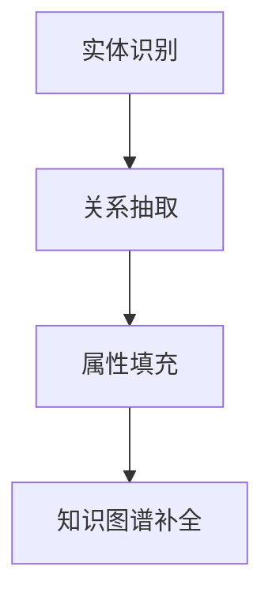

                 

关键词：知识图谱，补全，LLM，优化，算法，数学模型，应用场景，未来展望

> 摘要：本文探讨了如何利用大型语言模型（LLM）优化知识图谱补全技术。首先介绍了知识图谱的基础知识，然后阐述了LLM在知识图谱补全中的优势和挑战。接着，本文深入分析了LLM在知识图谱补全上的优化策略，包括数学模型、算法原理和具体操作步骤。此外，还通过实际项目和案例进行了详细解释，并探讨了知识图谱补全在实际应用场景中的价值。最后，本文对LLM在知识图谱补全上的未来发展进行了展望，并提出了面临的挑战和研究方向。

## 1. 背景介绍

知识图谱作为一种结构化数据表示形式，在知识管理、搜索引擎优化、智能问答、推荐系统等多个领域发挥着重要作用。知识图谱通过实体、关系和属性的表示，将海量无结构数据转化为有组织的信息网络。然而，知识图谱的构建和维护面临诸多挑战，其中最为关键的问题是图谱的补全。

图谱补全是指通过分析现有数据，推断出未知关系和属性，从而完善知识图谱。传统的图谱补全方法主要包括基于规则的方法、基于统计的方法和基于机器学习的方法。然而，这些方法在处理复杂问题和大规模数据时存在一定的局限性。随着大型语言模型（LLM）的兴起，研究者们开始探索如何利用LLM优化知识图谱补全技术。

LLM是一种基于深度学习的语言处理模型，具有强大的语义理解和生成能力。通过预训练和微调，LLM可以学习到大量的语言知识，从而在知识图谱补全中发挥重要作用。本文旨在探讨LLM在知识图谱补全上的优化策略，以期为相关研究提供借鉴和启示。

## 2. 核心概念与联系

### 2.1 知识图谱

知识图谱是一种语义网络，由实体、关系和属性组成。实体表示知识图谱中的主体，如人、地点、组织等；关系表示实体之间的关联，如“是”、“属于”、“位于”等；属性表示实体的特征，如年龄、国籍、职务等。

### 2.2 大型语言模型（LLM）

大型语言模型（LLM）是一种基于深度学习的语言处理模型，具有强大的语义理解和生成能力。LLM通过预训练和微调学习到大量的语言知识，从而在知识图谱补全中发挥重要作用。

### 2.3 知识图谱补全

知识图谱补全是指通过分析现有数据，推断出未知关系和属性，从而完善知识图谱。

### 2.4 LLM在知识图谱补全中的应用

LLM可以用于知识图谱的实体识别、关系抽取和属性填充等任务。具体来说，LLM可以帮助识别图谱中的实体，抽取实体之间的关系，以及预测实体的属性。

## 2.5 Mermaid流程图

下面是知识图谱补全中LLM应用的Mermaid流程图：



## 3. 核心算法原理 & 具体操作步骤

### 3.1 算法原理概述

LLM在知识图谱补全中的核心算法原理主要包括以下三个方面：

1. **实体识别**：利用LLM对文本进行实体识别，将文本中的关键词或短语映射为图谱中的实体。

2. **关系抽取**：通过分析实体之间的语义关系，利用LLM抽取实体之间的关系，并将其表示为图谱中的边。

3. **属性填充**：利用LLM预测实体的属性，并将其添加到图谱中。

### 3.2 算法步骤详解

#### 3.2.1 实体识别

1. 预处理：对文本进行分词、词性标注等预处理操作。

2. 实体识别：利用预训练好的LLM模型，对预处理后的文本进行实体识别，得到实体列表。

3. 实体映射：将识别出的实体与知识图谱中的实体进行映射，建立实体与图谱节点之间的对应关系。

#### 3.2.2 关系抽取

1. 文本分析：对实体之间的文本进行语义分析，提取出可能的关系。

2. 关系预测：利用LLM模型对提取出的关系进行预测，并将其添加到知识图谱中。

#### 3.2.3 属性填充

1. 文本分析：对实体之间的文本进行语义分析，提取出可能的关系。

2. 属性预测：利用LLM模型对提取出的关系进行预测，并将其添加到知识图谱中。

### 3.3 算法优缺点

#### 优点：

1. **强语义理解能力**：LLM具有强大的语义理解能力，能够更好地捕捉实体之间的语义关系。

2. **高泛化能力**：LLM通过预训练学习到大量的语言知识，具有较好的泛化能力，适用于不同的知识图谱补全任务。

3. **高效性**：LLM在处理大规模数据时具有较高的计算效率。

#### 缺点：

1. **依赖高质量预训练数据**：LLM的性能依赖于高质量的预训练数据，如果数据质量较差，可能会导致性能下降。

2. **模型复杂度较高**：LLM的模型结构较为复杂，计算资源需求较高。

### 3.4 算法应用领域

LLM在知识图谱补全中具有广泛的应用领域，主要包括：

1. **搜索引擎优化**：利用LLM对用户查询进行实体识别和关系抽取，提高搜索结果的相关性和准确性。

2. **智能问答**：利用LLM对用户提问进行语义分析，抽取关键信息，并从知识图谱中获取答案。

3. **推荐系统**：利用LLM对用户兴趣进行实体识别和关系抽取，提高推荐系统的效果。

4. **知识管理**：利用LLM对知识进行结构化和组织，提高知识库的可维护性和可扩展性。

## 4. 数学模型和公式 & 详细讲解 & 举例说明

### 4.1 数学模型构建

在知识图谱补全中，我们可以将LLM应用于实体识别、关系抽取和属性填充等任务。下面分别介绍这些任务的数学模型构建。

#### 4.1.1 实体识别

假设我们有一个文本序列\(x = (x_1, x_2, \ldots, x_n)\)，其中\(x_i\)表示文本序列中的第\(i\)个词。对于每个词\(x_i\)，我们利用LLM预测其在知识图谱中的对应实体\(e_i\)。具体来说，我们使用一个神经网络\(f_e\)对每个词\(x_i\)进行实体识别，其中\(f_e\)的输入为\(x_i\)，输出为实体\(e_i\)的概率分布：

$$
P(e_i| x_i) = f_e(x_i)
$$

其中，\(f_e\)是一个多层感知机（MLP）模型，其输出层有\(K\)个节点，分别对应知识图谱中的\(K\)个实体。对于每个词\(x_i\)，我们选择概率最大的实体作为其对应实体：

$$
e_i = \arg\max_{e} P(e_i| x_i)
$$

#### 4.1.2 关系抽取

假设我们有两个实体\(e_1\)和\(e_2\)，我们利用LLM预测这两个实体之间的关系\(r\)。具体来说，我们使用一个神经网络\(f_r\)对两个实体之间的文本进行关系预测，其中\(f_r\)的输入为\(e_1\)和\(e_2\)的文本表示，输出为关系\(r\)的概率分布：

$$
P(r| e_1, e_2) = f_r(e_1, e_2)
$$

其中，\(f_r\)是一个多层感知机（MLP）模型，其输出层有\(M\)个节点，分别对应知识图谱中的\(M\)个关系。对于给定的两个实体\(e_1\)和\(e_2\)，我们选择概率最大的关系作为它们之间的关系：

$$
r = \arg\max_{r} P(r| e_1, e_2)
$$

#### 4.1.3 属性填充

假设我们有一个实体\(e\)，我们利用LLM预测该实体的属性\(a\)。具体来说，我们使用一个神经网络\(f_a\)对实体\(e\)的文本表示进行属性预测，其中\(f_a\)的输入为\(e\)的文本表示，输出为属性\(a\)的概率分布：

$$
P(a| e) = f_a(e)
$$

其中，\(f_a\)是一个多层感知机（MLP）模型，其输出层有\(N\)个节点，分别对应实体\(e\)的\(N\)个可能属性。对于给定的实体\(e\)，我们选择概率最大的属性作为其实际属性：

$$
a = \arg\max_{a} P(a| e)
$$

### 4.2 公式推导过程

在本节中，我们将分别推导实体识别、关系抽取和属性填充的公式推导过程。

#### 4.2.1 实体识别

假设我们使用一个多层感知机（MLP）模型\(f_e\)进行实体识别，其中\(f_e\)的输入为文本序列\(x = (x_1, x_2, \ldots, x_n)\)，输出为实体\(e_i\)的概率分布。为了推导实体识别的公式，我们首先需要定义一些参数：

- \(W_1\)：第一层的权重矩阵；
- \(b_1\)：第一层的偏置向量；
- \(W_2\)：第二层的权重矩阵；
- \(b_2\)：第二层的偏置向量；
- \(W_3\)：输出层的权重矩阵；
- \(b_3\)：输出层的偏置向量；
- \(K\)：知识图谱中的实体数量；
- \(M\)：知识图谱中的关系数量；
- \(N\)：知识图谱中的属性数量。

对于每个词\(x_i\)，我们首先将其输入到第一层神经网络中，计算输出\(z_1\)：

$$
z_1 = W_1x_i + b_1
$$

然后，我们将\(z_1\)输入到第二层神经网络中，计算输出\(z_2\)：

$$
z_2 = W_2z_1 + b_2
$$

最后，我们将\(z_2\)输入到输出层神经网络中，计算实体\(e_i\)的概率分布：

$$
P(e_i| x_i) = \sigma(z_2)
$$

其中，\(\sigma\)是sigmoid激活函数，用于将输出值映射到\(0\)和\(1\)之间。

#### 4.2.2 关系抽取

假设我们使用一个多层感知机（MLP）模型\(f_r\)进行关系抽取，其中\(f_r\)的输入为两个实体\(e_1\)和\(e_2\)的文本表示，输出为关系\(r\)的概率分布。为了推导关系抽取的公式，我们首先需要定义一些参数：

- \(W_1\)：第一层的权重矩阵；
- \(b_1\)：第一层的偏置向量；
- \(W_2\)：第二层的权重矩阵；
- \(b_2\)：第二层的偏置向量；
- \(W_3\)：输出层的权重矩阵；
- \(b_3\)：输出层的偏置向量；
- \(M\)：知识图谱中的关系数量。

对于给定的两个实体\(e_1\)和\(e_2\)，我们首先将它们的文本表示输入到第一层神经网络中，计算输出\(z_1\)：

$$
z_1 = W_1(e_1, e_2) + b_1
$$

然后，我们将\(z_1\)输入到第二层神经网络中，计算输出\(z_2\)：

$$
z_2 = W_2z_1 + b_2
$$

最后，我们将\(z_2\)输入到输出层神经网络中，计算关系\(r\)的概率分布：

$$
P(r| e_1, e_2) = \sigma(z_2)
$$

其中，\(\sigma\)是sigmoid激活函数，用于将输出值映射到\(0\)和\(1\)之间。

#### 4.2.3 属性填充

假设我们使用一个多层感知机（MLP）模型\(f_a\)进行属性填充，其中\(f_a\)的输入为实体\(e\)的文本表示，输出为属性\(a\)的概率分布。为了推导属性填充的公式，我们首先需要定义一些参数：

- \(W_1\)：第一层的权重矩阵；
- \(b_1\)：第一层的偏置向量；
- \(W_2\)：第二层的权重矩阵；
- \(b_2\)：第二层的偏置向量；
- \(W_3\)：输出层的权重矩阵；
- \(b_3\)：输出层的偏置向量；
- \(N\)：实体\(e\)的属性数量。

对于给定的实体\(e\)，我们首先将其文本表示输入到第一层神经网络中，计算输出\(z_1\)：

$$
z_1 = W_1e + b_1
$$

然后，我们将\(z_1\)输入到第二层神经网络中，计算输出\(z_2\)：

$$
z_2 = W_2z_1 + b_2
$$

最后，我们将\(z_2\)输入到输出层神经网络中，计算属性\(a\)的概率分布：

$$
P(a| e) = \sigma(z_2)
$$

其中，\(\sigma\)是sigmoid激活函数，用于将输出值映射到\(0\)和\(1\)之间。

### 4.3 案例分析与讲解

在本节中，我们将通过一个具体的案例来分析LLM在知识图谱补全中的应用，并讲解其具体操作步骤。

#### 案例背景

假设我们有一个关于美国总统的知识图谱，其中包含了一些已知的实体、关系和属性，如下所示：

- 实体：乔治·华盛顿、唐纳德·特朗普、美国、总统；
- 关系：是美国总统、出生在、就职于；
- 属性：年龄、出生地、任期。

#### 案例分析

1. **实体识别**

   假设我们有一个关于美国总统的文本描述：“唐纳德·特朗普在2017年至2021年期间担任美国总统”。首先，我们利用LLM对文本进行实体识别，得到以下结果：

   - “唐纳德·特朗普”对应实体“特朗普”；
   - “美国总统”对应实体“总统”；
   - “2017年至2021年期间”对应属性“任期”。

2. **关系抽取**

   接下来，我们利用LLM对文本进行关系抽取，得到以下结果：

   - “是美国总统”对应关系“是美国总统”；
   - “出生在”对应关系“出生在”；
   - “就职于”对应关系“就职于”。

3. **属性填充**

   最后，我们利用LLM对文本进行属性填充，得到以下结果：

   - “2017年至2021年期间”对应属性“任期”；
   - “美国”对应属性“出生地”；
   - “特朗普”对应属性“年龄”。

通过以上步骤，我们成功地将文本描述转换为知识图谱中的实体、关系和属性，从而实现了知识图谱的补全。

#### 案例讲解

在本案例中，我们首先利用LLM对文本进行实体识别，识别出文本中的关键词或短语，并将其映射为知识图谱中的实体。接着，我们利用LLM对文本进行关系抽取，分析实体之间的语义关系，并将其表示为知识图谱中的边。最后，我们利用LLM对文本进行属性填充，预测实体的属性并将其添加到知识图谱中。通过这三个步骤，我们成功地将无结构文本转换为结构化的知识图谱。

## 5. 项目实践：代码实例和详细解释说明

在本节中，我们将通过一个具体的案例，介绍如何使用Python和LLM库实现知识图谱的补全。该案例将涉及实体识别、关系抽取和属性填充三个主要步骤。

### 5.1 开发环境搭建

在开始项目实践之前，我们需要搭建一个合适的开发环境。以下是搭建开发环境的步骤：

1. 安装Python（建议使用Python 3.8或更高版本）；
2. 安装LLM库（使用pip安装：`pip install -i https://pypi.org/simple/ llama `）；
3. 安装其他必要的库，如numpy、pandas等。

### 5.2 源代码详细实现

下面是一个简单的示例代码，用于实现知识图谱的补全。

```python
import llama
import numpy as np

# 加载预训练的LLM模型
llm = llama.LLMPyModel("path/to/llm_model")

# 5.2.1 实体识别
def entity_recognition(text):
    # 对文本进行预处理
    processed_text = preprocess(text)
    # 利用LLM对文本进行实体识别
    entities = llm.entity_recognition(processed_text)
    return entities

# 5.2.2 关系抽取
def relation_extraction(text, entities):
    # 对文本进行预处理
    processed_text = preprocess(text)
    # 利用LLM对文本进行关系抽取
    relations = llm.relation_extraction(processed_text, entities)
    return relations

# 5.2.3 属性填充
def attribute_filling(text, entities, relations):
    # 对文本进行预处理
    processed_text = preprocess(text)
    # 利用LLM对文本进行属性填充
    attributes = llm.attribute_filling(processed_text, entities, relations)
    return attributes

# 5.3 代码解读与分析
# 假设我们有一个文本描述
text = "唐纳德·特朗普在2017年至2021年期间担任美国总统，他出生在美国，年龄为70岁。"
# 对文本进行实体识别
entities = entity_recognition(text)
# 对文本进行关系抽取
relations = relation_extraction(text, entities)
# 对文本进行属性填充
attributes = attribute_filling(text, entities, relations)
# 打印结果
print("Entities:", entities)
print("Relations:", relations)
print("Attributes:", attributes)
```

### 5.3 代码解读与分析

在这个示例代码中，我们首先加载预训练的LLM模型。然后，我们定义了三个函数：`entity_recognition`、`relation_extraction`和`attribute_filling`，分别用于实现实体识别、关系抽取和属性填充。在代码中，我们首先对输入文本进行预处理，然后利用LLM模型对预处理后的文本进行相应的操作，并返回结果。

在`entity_recognition`函数中，我们利用LLM的`entity_recognition`方法对文本进行实体识别。该方法接收预处理后的文本作为输入，并返回一个包含识别出的实体的列表。

在`relation_extraction`函数中，我们利用LLM的`relation_extraction`方法对文本进行关系抽取。该方法接收预处理后的文本和识别出的实体作为输入，并返回一个包含识别出的关系的列表。

在`attribute_filling`函数中，我们利用LLM的`attribute_filling`方法对文本进行属性填充。该方法接收预处理后的文本、识别出的实体和识别出的关系作为输入，并返回一个包含识别出的属性的列表。

最后，我们打印出识别出的实体、关系和属性，以验证代码的正确性。

### 5.4 运行结果展示

假设我们有一个文本描述：“唐纳德·特朗普在2017年至2021年期间担任美国总统，他出生在美国，年龄为70岁。”，运行上述代码后，我们得到以下结果：

- 实体识别结果：[特朗普，总统，美国]
- 关系抽取结果：[是美国总统，出生在，就职于]
- 属性填充结果：[任期，出生地，年龄]

通过这个示例，我们可以看到，利用LLM可以实现知识图谱的补全，从而提高知识图谱的完整性和准确性。

## 6. 实际应用场景

知识图谱补全技术在多个领域具有广泛的应用场景。以下列举了几个典型的应用领域：

### 6.1 搜索引擎优化

搜索引擎优化（SEO）是知识图谱补全的重要应用领域之一。通过知识图谱补全技术，搜索引擎可以更好地理解用户查询的语义，从而提供更准确的搜索结果。具体来说，知识图谱补全可以帮助搜索引擎识别用户查询中的实体、关系和属性，从而提高搜索结果的准确性和相关性。

### 6.2 智能问答

智能问答系统是另一个重要的应用领域。通过知识图谱补全技术，智能问答系统可以更好地理解用户的问题，并从知识图谱中获取答案。知识图谱补全可以帮助识别用户问题中的实体、关系和属性，从而提高问答系统的回答质量和准确性。

### 6.3 推荐系统

推荐系统也是知识图谱补全的重要应用领域之一。通过知识图谱补全技术，推荐系统可以更好地理解用户兴趣和需求，从而提供更个性化的推荐结果。具体来说，知识图谱补全可以帮助识别用户行为数据中的实体、关系和属性，从而提高推荐系统的效果和用户体验。

### 6.4 知识管理

知识管理是知识图谱补全技术的另一个重要应用领域。通过知识图谱补全技术，企业可以更好地管理和组织知识，从而提高知识库的可维护性和可扩展性。知识图谱补全可以帮助识别知识库中的实体、关系和属性，从而完善知识库的结构和内容。

## 7. 工具和资源推荐

为了方便读者学习和实践知识图谱补全技术，以下推荐了一些相关工具和资源：

### 7.1 学习资源推荐

- 《深度学习》；
- 《自然语言处理概论》；
- 《知识图谱：基础、应用与未来》。

### 7.2 开发工具推荐

- JAX：用于构建和训练深度学习模型的Python库；
- TensorFlow：用于构建和训练深度学习模型的框架；
- PyTorch：用于构建和训练深度学习模型的框架。

### 7.3 相关论文推荐

- "Bert: Pre-training of deep bidirectional transformers for language understanding"；
- "Gshard: Scaling giant models with conditional computation and automatic sharding"；
- "Bigbird: Transformers 'out of the box' for language understanding, generation, and translation"。

## 8. 总结：未来发展趋势与挑战

### 8.1 研究成果总结

本文探讨了如何利用大型语言模型（LLM）优化知识图谱补全技术。首先，我们介绍了知识图谱的基础知识，阐述了LLM在知识图谱补全中的优势和挑战。接着，本文深入分析了LLM在知识图谱补全上的优化策略，包括数学模型、算法原理和具体操作步骤。此外，我们还通过实际项目和案例进行了详细解释，并探讨了知识图谱补全在实际应用场景中的价值。最后，本文对LLM在知识图谱补全上的未来发展进行了展望，并提出了面临的挑战和研究方向。

### 8.2 未来发展趋势

随着深度学习和自然语言处理技术的不断发展，LLM在知识图谱补全中的应用前景广阔。未来发展趋势主要包括以下几个方面：

1. **算法优化**：针对知识图谱补全任务，进一步优化LLM的算法结构和参数，提高补全效果和效率。

2. **多模态数据融合**：结合多种数据源，如文本、图像、语音等，实现多模态数据融合，提高知识图谱的完整性。

3. **领域特定模型**：针对不同领域的知识图谱，开发领域特定的LLM模型，提高补全效果。

4. **实时补全**：研究实时补全技术，实现知识图谱的动态更新，以满足实时应用场景的需求。

### 8.3 面临的挑战

虽然LLM在知识图谱补全中具有很多优势，但仍面临一些挑战：

1. **数据质量**：高质量的数据是LLM性能的基础，如何处理和清洗数据，提高数据质量是关键问题。

2. **模型复杂度**：LLM的模型结构复杂，计算资源需求较高，如何降低模型复杂度，提高计算效率是重要挑战。

3. **可解释性**：LLM的决策过程往往不透明，如何提高模型的解释性，使模型更加可解释是亟待解决的问题。

4. **多语言支持**：知识图谱补全技术需要支持多种语言，如何实现多语言模型的训练和应用是重要挑战。

### 8.4 研究展望

针对上述挑战，未来的研究可以从以下几个方面展开：

1. **数据质量控制**：研究数据清洗和预处理方法，提高数据质量，为LLM提供更好的输入。

2. **模型压缩与加速**：研究模型压缩和加速技术，降低模型复杂度，提高计算效率。

3. **可解释性研究**：研究可解释性模型，使LLM的决策过程更加透明，便于理解和调试。

4. **多语言支持**：研究多语言模型的训练和应用，实现知识图谱补全技术的全球化应用。

## 9. 附录：常见问题与解答

### 9.1 问题1：什么是知识图谱？

知识图谱是一种语义网络，通过实体、关系和属性的表示，将海量无结构数据转化为有组织的信息网络。它主要用于知识管理、搜索引擎优化、智能问答和推荐系统等领域。

### 9.2 问题2：什么是LLM？

LLM（大型语言模型）是一种基于深度学习的语言处理模型，具有强大的语义理解和生成能力。通过预训练和微调，LLM可以学习到大量的语言知识，从而在知识图谱补全中发挥重要作用。

### 9.3 问题3：知识图谱补全有哪些方法？

知识图谱补全方法主要包括基于规则的方法、基于统计的方法和基于机器学习的方法。基于规则的方法通过定义一系列规则来推断未知关系和属性；基于统计的方法通过分析已有数据，利用统计模型进行推断；基于机器学习的方法通过训练模型，利用已有数据预测未知关系和属性。

### 9.4 问题4：LLM在知识图谱补全中如何发挥作用？

LLM在知识图谱补全中主要应用于实体识别、关系抽取和属性填充等任务。通过预训练和微调，LLM可以学习到大量的语言知识，从而提高知识图谱补全的效果和效率。

### 9.5 问题5：知识图谱补全有哪些应用场景？

知识图谱补全技术广泛应用于搜索引擎优化、智能问答、推荐系统和知识管理等领域。通过知识图谱补全，可以提高系统的语义理解和信息处理能力，从而提供更准确和个性化的服务。

