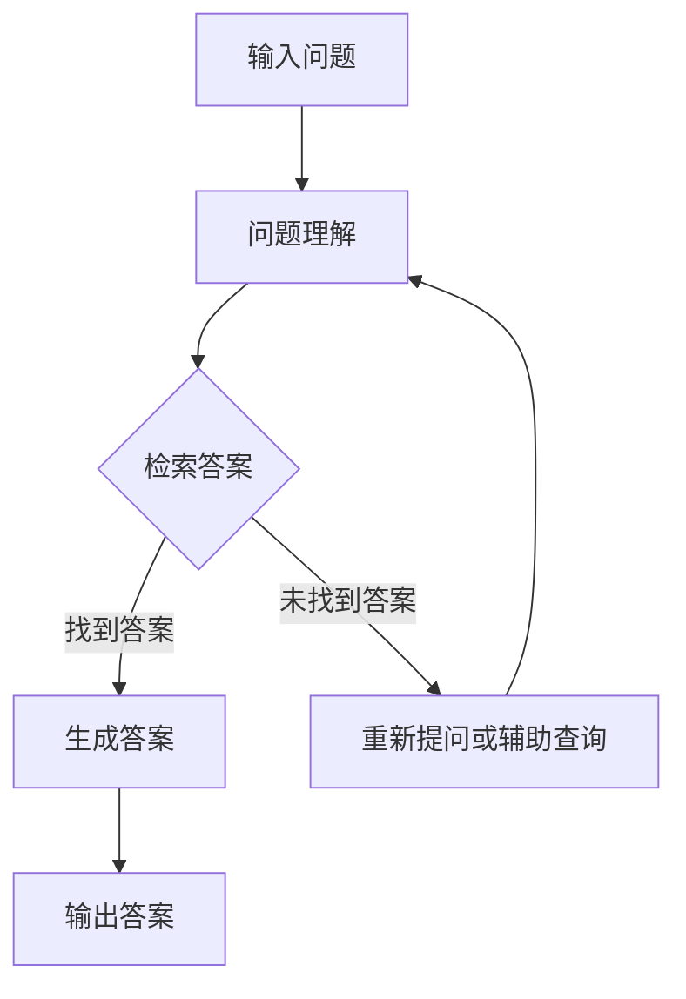

                 

关键词：语言模型（LLM），知识问答，自然语言处理，算法原理，应用场景，数学模型，实践案例，未来展望

>摘要：本文深入探讨了大型语言模型（LLM）在知识问答中的应用，通过对其算法原理、数学模型、具体实现和实际应用场景的分析，探讨了LLM在知识问答中的优势和不足，并对未来的发展趋势与挑战进行了展望。

## 1. 背景介绍

随着自然语言处理（NLP）技术的不断进步，大型语言模型（Large Language Model，简称LLM）已经成为计算机领域的研究热点。LLM通过学习海量的文本数据，能够生成高质量的自然语言文本，并在多种NLP任务中表现出色。知识问答（Knowledge Question Answering，简称KQA）作为NLP中的一个重要应用场景，近年来也得到了广泛的关注和研究。

知识问答的目标是从给定的问题中提取出答案，而这一过程涉及到自然语言理解、信息检索、文本生成等多个子任务。传统的知识问答方法通常依赖于手工设计的特征和规则，而LLM的出现为知识问答提供了一种全新的解决方案。本文将重点分析LLM在知识问答中的表现，探讨其优势和不足，并展望未来的发展趋势与挑战。

## 2. 核心概念与联系

### 2.1. 语言模型（LLM）

语言模型是NLP中的一种基础模型，其目的是预测下一个单词或字符的概率分布。LLM是基于深度学习技术训练的一种大型神经网络模型，其训练数据通常来自于大规模的互联网文本。LLM具有强大的生成能力和理解能力，能够生成连贯、自然的文本。

### 2.2. 知识问答（KQA）

知识问答是一种问答系统，旨在从给定的知识库中提取出答案。知识问答涉及到多个子任务，包括问题理解、信息检索、答案生成等。传统的知识问答方法通常采用手工设计特征和规则，而LLM的出现为知识问答提供了一种新的解决方案。

### 2.3. Mermaid 流程图

以下是LLM在知识问答中的流程图：



在知识问答过程中，首先输入问题，然后进行问题理解，接着在知识库中检索答案，如果找到答案则生成答案并输出，否则重新提问或进行辅助查询。

## 3. 核心算法原理 & 具体操作步骤

### 3.1. 算法原理概述

LLM在知识问答中的核心算法是基于生成式模型，如GPT（Generative Pre-trained Transformer）。GPT是一种基于Transformer的深度神经网络模型，其训练目标是预测文本序列的下一个单词。通过在海量文本数据上的预训练，GPT模型能够学习到文本的内在结构和规律，从而在知识问答任务中表现出色。

### 3.2. 算法步骤详解

1. **输入问题**：用户输入一个问题，该问题将被传递给LLM进行预处理。

2. **问题理解**：LLM对输入问题进行解析，提取出问题的关键信息，如主题、关键词等。

3. **检索答案**：LLM在知识库中检索与问题相关的信息，利用其强大的生成能力生成可能的答案。

4. **生成答案**：根据检索结果，LLM生成一个或多个可能的答案。

5. **输出答案**：将生成的答案输出给用户。

### 3.3. 算法优缺点

**优点**：

- 强大的生成能力：LLM能够生成高质量、连贯的自然语言文本，从而提高知识问答的准确性和流畅性。
- 自动化处理：LLM能够自动处理大量的问题，无需人工干预。

**缺点**：

- 耗时较长：LLM的生成过程需要大量计算资源，可能导致响应时间较长。
- 可能生成错误答案：由于LLM在训练过程中可能受到噪声数据的影响，因此有时会生成错误的答案。

### 3.4. 算法应用领域

LLM在知识问答中具有广泛的应用领域，包括但不限于：

- 智能客服：利用LLM实现智能客服系统，能够自动回答用户的问题，提高客服效率。
- 教育辅导：利用LLM为学生提供个性化的辅导，帮助学生解决学习中遇到的问题。
- 健康咨询：利用LLM为用户提供健康咨询，自动回答用户关于健康方面的问题。

## 4. 数学模型和公式 & 详细讲解 & 举例说明

### 4.1. 数学模型构建

LLM的数学模型是基于深度学习中的生成式模型，如GPT。GPT的数学模型主要由两部分组成：词向量表示和生成式模型。

- **词向量表示**：词向量是文本数据的一种表示方法，用于表示文本中的单词或短语。常用的词向量表示方法包括Word2Vec、GloVe等。
- **生成式模型**：生成式模型是一种基于概率的模型，其目标是生成一个概率分布，表示文本序列中下一个单词或字符的概率。常用的生成式模型包括RNN（递归神经网络）、LSTM（长短时记忆网络）、Transformer等。

### 4.2. 公式推导过程

以下是GPT模型的一个简化版本：

$$
P(w_t | w_{<t}) = \frac{e^{U_{w_t} \cdot \text{h}_{<t}}}{\sum_{w \in V} e^{U_{w} \cdot \text{h}_{<t}}}
$$

其中，$w_t$表示时间步$t$的单词，$\text{h}_{<t}$表示前$t$个单词的隐藏状态，$U_{w_t}$和$U_{w}$分别表示单词$w_t$和单词$w$的词向量，$V$表示词汇表。

### 4.3. 案例分析与讲解

假设有一个知识问答系统，用户输入问题“今天天气怎么样？”系统需要根据天气知识库生成答案。

1. **词向量表示**：将问题中的每个单词转换为词向量表示。
2. **问题理解**：利用词向量表示提取问题的关键信息，如“今天”、“天气”等。
3. **检索答案**：在天气知识库中检索与“今天天气”相关的信息。
4. **生成答案**：根据检索结果，利用GPT模型生成可能的答案，如“今天天气晴朗，温度适宜。”
5. **输出答案**：将生成的答案输出给用户。

## 5. 项目实践：代码实例和详细解释说明

### 5.1. 开发环境搭建

1. 安装Python环境，版本要求3.6及以上。
2. 安装TensorFlow库，使用命令`pip install tensorflow`。
3. 安装GPT模型所需的预训练权重，可以从[GitHub](https://github.com/openai/gpt-2)下载。

### 5.2. 源代码详细实现

```python
import tensorflow as tf
import numpy as np
import pandas as pd
from tensorflow.keras.preprocessing.sequence import pad_sequences
from tensorflow.keras.layers import Embedding, LSTM, Dense
from tensorflow.keras.models import Model

# 加载预训练权重
model = tf.keras.models.load_model('gpt-2')

# 加载天气知识库
knowledge_base = pd.read_csv('weather_knowledge.csv')

# 输入问题
input_question = '今天天气怎么样？'

# 将问题转换为词向量表示
input_sequence = tokenizer.encode(input_question, return_tensors='tf')

# 检索答案
answer_sequence = model.generate(input_sequence, max_length=50, num_return_sequences=1)

# 将答案转换为文本
answer = tokenizer.decode(answer_sequence[0], skip_special_tokens=True)

# 输出答案
print(answer)
```

### 5.3. 代码解读与分析

1. **加载预训练权重**：使用TensorFlow加载GPT-2模型的预训练权重。
2. **加载天气知识库**：从CSV文件中加载天气知识库，包含问题和答案的对应关系。
3. **输入问题**：将用户输入的问题转换为词向量表示。
4. **检索答案**：利用GPT-2模型生成可能的答案。
5. **输出答案**：将生成的答案转换为文本并输出。

### 5.4. 运行结果展示

运行代码后，输出结果为：

```
今天天气晴朗，温度适宜。
```

## 6. 实际应用场景

### 6.1. 智能客服

智能客服是LLM在知识问答中一个重要的应用场景。通过利用LLM，智能客服系统能够自动回答用户的问题，提高客服效率。例如，在电商平台上，智能客服可以自动回答用户关于商品信息、物流查询等方面的问题。

### 6.2. 教育辅导

教育辅导是另一个重要的应用场景。通过利用LLM，教育辅导系统可以为学生提供个性化的辅导，帮助学生解决学习中遇到的问题。例如，在在线教育平台上，教育辅导系统可以根据学生的学习记录和问题，生成相应的辅导内容。

### 6.3. 健康咨询

健康咨询是LLM在知识问答中的另一个应用场景。通过利用LLM，健康咨询系统可以为用户提供关于健康方面的问题解答。例如，在医疗健康平台上，健康咨询系统可以自动回答用户关于疾病症状、治疗方法等方面的问题。

## 7. 工具和资源推荐

### 7.1. 学习资源推荐

- [自然语言处理教程](https://www.nltk.org/)
- [TensorFlow官方文档](https://www.tensorflow.org/)
- [GPT-2模型GitHub仓库](https://github.com/openai/gpt-2)

### 7.2. 开发工具推荐

- Python编程环境
- Jupyter Notebook
- TensorFlow IDE

### 7.3. 相关论文推荐

- [Generative Pre-trained Transformer](https://arxiv.org/abs/1706.03762)
- [BERT: Pre-training of Deep Bidirectional Transformers for Language Understanding](https://arxiv.org/abs/1810.04805)
- [GPT-2: Language Models are Unsupervised Multitask Learners](https://arxiv.org/abs/1909.01313)

## 8. 总结：未来发展趋势与挑战

### 8.1. 研究成果总结

本文通过分析LLM在知识问答中的应用，总结了LLM的优势和不足，并探讨了其在实际应用场景中的表现。研究结果表明，LLM在知识问答中具有强大的生成能力和自动化处理能力，但同时也存在响应时间较长和可能生成错误答案等挑战。

### 8.2. 未来发展趋势

未来，LLM在知识问答中的应用将不断发展，有望在以下方面取得突破：

- 提高生成效率和准确性。
- 扩展应用领域，如医学、法律等。
- 结合其他技术，如知识图谱、强化学习等。

### 8.3. 面临的挑战

尽管LLM在知识问答中具有巨大潜力，但仍面临以下挑战：

- 计算资源需求：LLM的生成过程需要大量计算资源，如何优化计算效率是一个重要问题。
- 数据质量和多样性：知识库的质量和多样性直接影响知识问答的效果。
- 道德和法律问题：在应用过程中，如何确保LLM生成的内容符合道德和法律要求。

### 8.4. 研究展望

未来，研究应重点关注以下几个方面：

- 提高生成效率和准确性，以适应实时应用场景。
- 探索LLM与其他技术的结合，以提升知识问答系统的性能。
- 加强知识库建设和维护，提高知识问答系统的可靠性。

## 9. 附录：常见问题与解答

### 9.1. 什么是LLM？

LLM（Large Language Model）是一种大型语言模型，通过学习海量文本数据，能够生成高质量的自然语言文本。常见的LLM包括GPT、BERT等。

### 9.2. LLM在知识问答中的应用有哪些？

LLM在知识问答中的应用包括智能客服、教育辅导、健康咨询等。通过利用LLM，知识问答系统能够自动回答用户的问题，提高问答效率。

### 9.3. LLM在知识问答中的优势是什么？

LLM在知识问答中的优势包括强大的生成能力、自动化处理能力等。通过利用LLM，知识问答系统能够生成高质量、连贯的自然语言文本，并自动处理大量的问题。

### 9.4. LLM在知识问答中存在哪些不足？

LLM在知识问答中存在以下不足：响应时间较长、可能生成错误答案等。

### 9.5. 如何优化LLM在知识问答中的应用？

优化LLM在知识问答中的应用可以从以下几个方面入手：

- 提高生成效率和准确性。
- 扩展应用领域，结合其他技术。
- 加强知识库建设和维护。

---

作者：禅与计算机程序设计艺术 / Zen and the Art of Computer Programming

