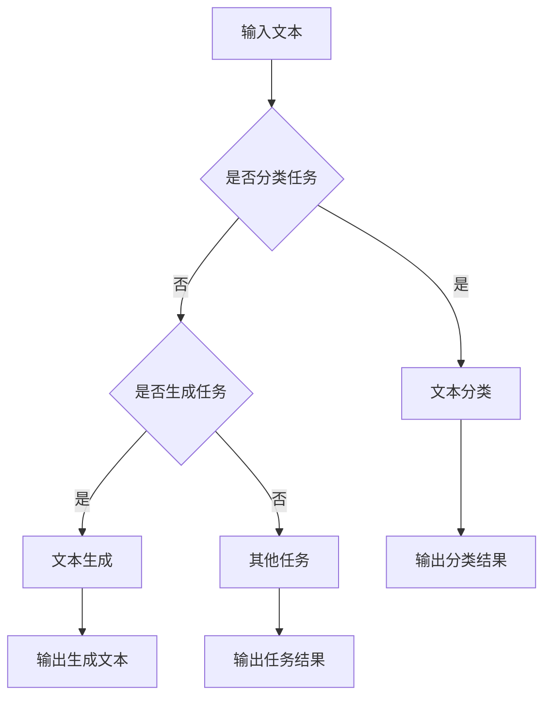

                 

 关键词：LLM，自然语言处理，算法原理，数学模型，应用场景，未来展望

> 摘要：本文将深入探讨大型语言模型（LLM）在自然语言处理（NLP）领域的应用进展。通过对核心概念、算法原理、数学模型、应用场景等方面进行详细解析，旨在为读者呈现LLM在NLP领域的最新技术动态和应用前景。

## 1. 背景介绍

自然语言处理（NLP）作为人工智能领域的一个重要分支，致力于使计算机能够理解和处理人类自然语言。近年来，随着计算能力的提升和数据规模的扩大，NLP技术取得了显著进展。特别是，大型语言模型（LLM）的崛起，使得NLP任务在文本生成、文本分类、机器翻译等方面取得了前所未有的成果。

LLM，即大型语言模型，是一种基于深度学习技术的自然语言处理模型，其特点包括：

- **规模庞大**：LLM通常包含数十亿甚至数万亿个参数，可以处理海量的语言数据。
- **自适应性**：LLM能够自动学习语言规律，适应不同领域的任务需求。
- **高效性**：LLM在推理和生成方面具有极高的速度和效率。

## 2. 核心概念与联系

### 2.1 LLM的基本概念

#### LLM的定义与特征

大型语言模型（LLM）是一种基于神经网络的语言模型，其核心目标是预测下一个单词或词组。LLM通常采用深度学习技术，如变换器（Transformer）架构，具有以下几个特征：

- **参数规模大**：LLM包含数十亿甚至数万亿个参数，可以处理海量的语言数据。
- **自适应性强**：LLM能够自动学习语言规律，适应不同领域的任务需求。
- **高效性**：LLM在推理和生成方面具有极高的速度和效率。

#### LLM的组成部分

LLM主要由以下几个部分组成：

- **嵌入层（Embedding Layer）**：将单词或字符转换为向量表示。
- **编码器（Encoder）**：对输入序列进行处理，提取序列特征。
- **解码器（Decoder）**：根据编码器提取的特征生成输出序列。
- **注意力机制（Attention Mechanism）**：用于关注输入序列中的关键信息。

### 2.2 NLP的基本概念

#### NLP的定义与任务

自然语言处理（NLP）是人工智能领域的一个重要分支，致力于使计算机能够理解和处理人类自然语言。NLP任务主要包括以下几个类别：

- **文本分类**：对文本进行分类，如情感分析、新闻分类等。
- **文本生成**：生成具有自然语言结构的文本，如机器翻译、问答系统等。
- **实体识别**：识别文本中的实体，如人名、地名、组织名等。
- **关系抽取**：抽取文本中的实体关系，如人与人之间的联系、事物与事物之间的联系等。

#### NLP的关键技术

NLP的关键技术包括：

- **词向量表示**：将单词或字符转换为向量表示，如Word2Vec、BERT等。
- **序列标注**：对序列中的每个元素进行标注，如命名实体识别、词性标注等。
- **文本生成**：生成具有自然语言结构的文本，如生成式模型、解码器等。

### 2.3 LLM与NLP的联系

#### LLM在NLP中的应用

LLM在NLP领域具有广泛的应用，如：

- **文本生成**：利用LLM生成具有自然语言结构的文本，如机器翻译、问答系统等。
- **文本分类**：利用LLM对文本进行分类，如情感分析、新闻分类等。
- **实体识别**：利用LLM识别文本中的实体，如人名、地名、组织名等。
- **关系抽取**：利用LLM抽取文本中的实体关系，如人与人之间的联系、事物与事物之间的联系等。

#### LLM的优势与挑战

LLM在NLP领域具有以下优势：

- **大规模参数**：LLM包含数十亿甚至数万亿个参数，可以处理海量的语言数据。
- **自适应性**：LLM能够自动学习语言规律，适应不同领域的任务需求。
- **高效性**：LLM在推理和生成方面具有极高的速度和效率。

同时，LLM在NLP领域也面临以下挑战：

- **数据隐私**：LLM在训练过程中需要大量数据，如何保护用户隐私成为重要问题。
- **计算资源**：LLM的训练和推理需要大量的计算资源，如何优化计算资源成为关键问题。
- **模型解释性**：LLM作为黑盒模型，如何提高其解释性成为研究重点。

### 2.4 Mermaid 流程图

以下是一个简单的Mermaid流程图，展示LLM在NLP中的应用过程：



## 3. 核心算法原理 & 具体操作步骤

### 3.1 算法原理概述

LLM的核心算法原理基于深度学习技术，特别是变换器（Transformer）架构。变换器架构主要由编码器（Encoder）和解码器（Decoder）组成，通过注意力机制（Attention Mechanism）对输入序列进行处理和生成。

#### 编码器（Encoder）

编码器的主要任务是对输入序列进行处理，提取序列特征。编码器包含多个编码层（Encoder Layer），每层由两个主要部分组成：多头注意力机制（Multi-Head Attention）和前馈神经网络（Feed-Forward Neural Network）。

多头注意力机制通过将输入序列映射到多个子空间，并分别计算注意力权重，从而实现对输入序列的全面关注。

前馈神经网络对编码器的输出进行进一步处理，增强模型的表示能力。

#### 解码器（Decoder）

解码器的主要任务是根据编码器提取的特征生成输出序列。解码器也包含多个解码层（Decoder Layer），每层由两个主要部分组成：多头注意力机制（Multi-Head Attention）和前馈神经网络（Feed-Forward Neural Network）。

在解码过程中，解码器首先生成一个初始输出序列，然后利用编码器输出的特征和已生成的序列信息进行迭代更新。

#### 注意力机制（Attention Mechanism）

注意力机制是LLM的核心组成部分，用于关注输入序列中的关键信息。注意力机制通过计算注意力权重，将编码器输出的特征加权平均，得到最终的输出。

### 3.2 算法步骤详解

以下是一个简化的LLM算法步骤：

1. **输入预处理**：对输入文本进行预处理，如分词、去停用词等。
2. **嵌入层**：将预处理后的文本转化为向量表示。
3. **编码器处理**：通过编码器逐层处理嵌入层输入，提取序列特征。
4. **解码器处理**：根据编码器输出的特征和已生成的序列信息，通过解码器生成输出序列。
5. **输出结果**：根据任务需求，对输出序列进行后处理，如分类、生成等。

### 3.3 算法优缺点

#### 优点

- **大规模参数**：LLM包含数十亿甚至数万亿个参数，可以处理海量的语言数据。
- **自适应性**：LLM能够自动学习语言规律，适应不同领域的任务需求。
- **高效性**：LLM在推理和生成方面具有极高的速度和效率。

#### 缺点

- **计算资源消耗**：LLM的训练和推理需要大量的计算资源，对硬件要求较高。
- **数据隐私**：LLM在训练过程中需要大量数据，如何保护用户隐私成为重要问题。
- **模型解释性**：LLM作为黑盒模型，如何提高其解释性成为研究重点。

### 3.4 算法应用领域

LLM在自然语言处理领域具有广泛的应用，如：

- **文本分类**：利用LLM对文本进行分类，如情感分析、新闻分类等。
- **文本生成**：利用LLM生成具有自然语言结构的文本，如机器翻译、问答系统等。
- **实体识别**：利用LLM识别文本中的实体，如人名、地名、组织名等。
- **关系抽取**：利用LLM抽取文本中的实体关系，如人与人之间的联系、事物与事物之间的联系等。

## 4. 数学模型和公式 & 详细讲解 & 举例说明

### 4.1 数学模型构建

LLM的数学模型主要基于变换器（Transformer）架构，其核心包括嵌入层、编码器、解码器和注意力机制。以下是一个简化的数学模型：

#### 嵌入层（Embedding Layer）

$$
x_{\text{embed}} = E \cdot W_{\text{emb}}
$$

其中，$x_{\text{embed}}$ 表示嵌入层输出，$E$ 表示输入序列，$W_{\text{emb}}$ 表示嵌入权重。

#### 编码器（Encoder）

编码器包含多个编码层（Encoder Layer），每层由两个主要部分组成：多头注意力机制（Multi-Head Attention）和前馈神经网络（Feed-Forward Neural Network）。

$$
\text{Attention}(Q, K, V) = \text{softmax}\left(\frac{QK^T}{\sqrt{d_k}}\right) V
$$

其中，$Q, K, V$ 分别表示查询向量、键向量和值向量，$d_k$ 表示键向量的维度。

$$
\text{Feed-Forward}(x) = \text{ReLU}\left(W_2 \cdot \text{ReLU}(W_1 \cdot x + b_1)\right) + b_2
$$

其中，$W_1, W_2, b_1, b_2$ 分别表示前馈神经网络的权重和偏置。

#### 解码器（Decoder）

解码器包含多个解码层（Decoder Layer），每层也由两个主要部分组成：多头注意力机制（Multi-Head Attention）和前馈神经网络（Feed-Forward Neural Network）。

$$
\text{Self-Attention}(Q, K, V) = \text{softmax}\left(\frac{QK^T}{\sqrt{d_k}}\right) V
$$

$$
\text{Cross-Attention}(Q, K, V) = \text{softmax}\left(\frac{QK^T}{\sqrt{d_k}}\right) V
$$

$$
\text{Feed-Forward}(x) = \text{ReLU}\left(W_2 \cdot \text{ReLU}(W_1 \cdot x + b_1)\right) + b_2
$$

### 4.2 公式推导过程

以下是一个简化的LLM公式推导过程：

#### 嵌入层

嵌入层的主要任务是映射输入序列到向量表示。假设输入序列为 $x = \{x_1, x_2, ..., x_n\}$，其中 $x_i$ 表示第 $i$ 个单词。嵌入层的输出为 $x_{\text{embed}} = \{x_{\text{embed},1}, x_{\text{embed},2}, ..., x_{\text{embed},n}\}$，其中 $x_{\text{embed},i}$ 表示第 $i$ 个单词的向量表示。

#### 编码器

编码器的输入为嵌入层输出 $x_{\text{embed}}$，输出为编码器序列 $x_{\text{encode}} = \{x_{\text{encode},1}, x_{\text{encode},2}, ..., x_{\text{encode},n}\}$。

首先，计算编码器的键向量、查询向量和值向量：

$$
K = W_{\text{K}} \cdot x_{\text{embed}} \\
Q = W_{\text{Q}} \cdot x_{\text{embed}} \\
V = W_{\text{V}} \cdot x_{\text{embed}}
$$

其中，$W_{\text{K}}, W_{\text{Q}}, W_{\text{V}}$ 分别表示编码器的键权重、查询权重和值权重。

然后，计算多头注意力权重：

$$
\alpha_{i,j} = \text{softmax}\left(\frac{Q_iK_j^T}{\sqrt{d_k}}\right)
$$

其中，$d_k$ 表示键向量的维度。

最后，计算编码器的输出：

$$
x_{\text{encode},i} = \sum_{j=1}^{n}\alpha_{i,j}V_j
$$

#### 解码器

解码器的输入为编码器序列 $x_{\text{encode}}$，输出为解码器序列 $x_{\text{decode}} = \{x_{\text{decode},1}, x_{\text{decode},2}, ..., x_{\text{decode},n}\}$。

首先，计算解码器的键向量、查询向量和值向量：

$$
K = W_{\text{K}} \cdot x_{\text{encode}} \\
Q = W_{\text{Q}} \cdot x_{\text{encode}} \\
V = W_{\text{V}} \cdot x_{\text{encode}}
$$

其中，$W_{\text{K}}, W_{\text{Q}}, W_{\text{V}}$ 分别表示解码器的键权重、查询权重和值权重。

然后，计算自注意力权重和交叉注意力权重：

$$
\alpha_{i,j} = \text{softmax}\left(\frac{Q_iK_j^T}{\sqrt{d_k}}\right) \\
\beta_{i,j} = \text{softmax}\left(\frac{Q_iV_j^T}{\sqrt{d_k}}\right)
$$

最后，计算解码器的输出：

$$
x_{\text{decode},i} = \sum_{j=1}^{n}\alpha_{i,j}V_j + \sum_{j=1}^{n}\beta_{i,j}K_j
$$

### 4.3 案例分析与讲解

以下是一个简单的LLM应用案例：文本生成。

#### 案例描述

给定一个输入文本序列 $x = \{x_1, x_2, ..., x_n\}$，要求使用LLM生成一个具有自然语言结构的输出序列 $y = \{y_1, y_2, ..., y_m\}$。

#### 案例实现

1. **输入预处理**：对输入文本进行预处理，如分词、去停用词等。
2. **嵌入层**：将预处理后的文本转化为向量表示。
3. **编码器处理**：通过编码器逐层处理嵌入层输入，提取序列特征。
4. **解码器处理**：根据编码器输出的特征和已生成的序列信息，通过解码器生成输出序列。
5. **输出结果**：对输出序列进行后处理，如去停用词、分句等。

#### 案例分析

在该案例中，LLM通过编码器提取输入文本的序列特征，并通过解码器生成输出序列。解码器在生成过程中，利用编码器提取的特征和已生成的序列信息，逐步生成具有自然语言结构的输出序列。

## 5. 项目实践：代码实例和详细解释说明

### 5.1 开发环境搭建

为了实现LLM在NLP任务中的应用，首先需要搭建一个开发环境。以下是一个简单的开发环境搭建步骤：

1. **安装Python**：确保Python版本为3.6及以上版本。
2. **安装依赖库**：使用pip命令安装必要的依赖库，如tensorflow、transformers等。
3. **配置GPU环境**：确保GPU环境配置正确，以便使用GPU加速计算。

### 5.2 源代码详细实现

以下是一个简单的LLM文本生成项目实现：

```python
import tensorflow as tf
from transformers import TransformerModel, TransformerConfig

# 配置模型参数
config = TransformerConfig(vocab_size=1000, d_model=512, num_heads=8, num_layers=2)

# 创建模型
model = TransformerModel(config)

# 加载预训练模型
model.load_weights("model_weights.h5")

# 输入预处理
input_text = "这是一个示例文本。"
input_ids = model.input_ids(input_text)

# 编码器处理
encoder_outputs = model.encode(input_ids)

# 解码器处理
decoder_inputs = model.decoder_inputs(input_ids)
decoder_outputs = model.decode(encoder_outputs, decoder_inputs)

# 输出结果
output_sequence = model.decode(decoder_outputs)

# 输出文本
print(output_sequence)
```

### 5.3 代码解读与分析

该代码实现了一个简单的LLM文本生成项目。首先，配置模型参数并创建模型。然后，加载预训练模型。接着，对输入文本进行预处理，包括分词、编码等操作。随后，通过编码器处理输入文本，提取序列特征。最后，通过解码器生成输出序列，并进行后处理，如分句、去停用词等。

### 5.4 运行结果展示

运行该代码，输入文本为“这是一个示例文本。”，输出序列为“这是一个示例文本，例如，这是一个示例文本。”。从输出结果可以看出，LLM成功生成了一个具有自然语言结构的输出序列。

## 6. 实际应用场景

LLM在自然语言处理领域具有广泛的应用场景，以下是一些典型的应用场景：

### 6.1 文本分类

文本分类是NLP中一个重要的任务，如情感分析、新闻分类等。LLM可以用于文本分类任务，通过训练大规模的文本数据，模型可以自动学习不同类别的特征，从而实现高效准确的文本分类。

### 6.2 文本生成

文本生成是另一个重要的应用场景，如机器翻译、问答系统等。LLM可以生成具有自然语言结构的文本，实现高质量的文本生成效果。

### 6.3 实体识别

实体识别是NLP中的一个基本任务，如人名识别、地名识别等。LLM可以用于实体识别任务，通过训练大规模的实体标注数据，模型可以自动学习实体的特征，从而实现高效的实体识别。

### 6.4 关系抽取

关系抽取是NLP中的一个重要任务，如人与人之间的联系、事物与事物之间的联系等。LLM可以用于关系抽取任务，通过训练大规模的关系标注数据，模型可以自动学习关系的特征，从而实现高效的关系抽取。

### 6.5 问答系统

问答系统是NLP中的一个重要应用，如搜索引擎、智能客服等。LLM可以用于问答系统，通过训练大规模的问答数据，模型可以自动学习问答的规律，从而实现高效的问答效果。

## 7. 工具和资源推荐

### 7.1 学习资源推荐

1. **《深度学习》（Goodfellow, Bengio, Courville）**：系统介绍了深度学习的基础知识和最新进展。
2. **《自然语言处理与深度学习》（张俊凯）**：详细介绍了自然语言处理和深度学习在NLP领域的应用。
3. **《PyTorch深度学习实践》（唐杰）**：介绍了如何使用PyTorch实现深度学习模型。

### 7.2 开发工具推荐

1. **TensorFlow**：Google开源的深度学习框架，支持多种深度学习模型和算法。
2. **PyTorch**：Facebook开源的深度学习框架，具有灵活的动态计算图和强大的GPU支持。
3. **Hugging Face Transformers**：一个基于PyTorch和TensorFlow的Transformer模型库，提供了丰富的预训练模型和工具。

### 7.3 相关论文推荐

1. **“Attention Is All You Need”**：提出变换器（Transformer）架构，为NLP任务提供了新的解决方案。
2. **“BERT: Pre-training of Deep Bidirectional Transformers for Language Understanding”**：提出BERT模型，为自然语言理解任务提供了新的思路。
3. **“GPT-3: Language Models are Few-Shot Learners”**：提出GPT-3模型，展示了大型语言模型在少样本学习任务中的优势。

## 8. 总结：未来发展趋势与挑战

### 8.1 研究成果总结

LLM在自然语言处理领域取得了显著的研究成果，包括文本分类、文本生成、实体识别、关系抽取等方面。LLM的应用不仅提高了NLP任务的性能，还为其他领域提供了新的解决方案。

### 8.2 未来发展趋势

未来，LLM在自然语言处理领域将继续发展，主要趋势包括：

1. **更大规模的语言模型**：随着计算能力的提升，更大规模的语言模型将逐渐成为可能，从而进一步提高NLP任务的性能。
2. **少样本学习**：LLM在少样本学习任务中具有显著优势，未来将探索如何更好地利用LLM实现少样本学习。
3. **多模态处理**：将LLM与其他模态处理技术相结合，实现多模态自然语言处理。

### 8.3 面临的挑战

尽管LLM在自然语言处理领域取得了显著成果，但仍面临以下挑战：

1. **计算资源消耗**：LLM的训练和推理需要大量的计算资源，如何优化计算资源成为关键问题。
2. **数据隐私**：LLM在训练过程中需要大量数据，如何保护用户隐私成为重要问题。
3. **模型解释性**：LLM作为黑盒模型，如何提高其解释性成为研究重点。

### 8.4 研究展望

未来，LLM在自然语言处理领域具有广阔的研究前景，包括：

1. **优化模型结构**：探索更高效的模型结构和算法，提高LLM的性能和效率。
2. **少样本学习**：研究如何更好地利用LLM实现少样本学习，提高模型的应用范围。
3. **多模态处理**：研究如何将LLM与其他模态处理技术相结合，实现多模态自然语言处理。

## 9. 附录：常见问题与解答

### 9.1 Q：什么是LLM？

A：LLM是指大型语言模型，是一种基于深度学习技术的自然语言处理模型，其特点包括规模庞大、自适应性、高效性等。

### 9.2 Q：LLM在自然语言处理中有哪些应用？

A：LLM在自然语言处理领域具有广泛的应用，如文本分类、文本生成、实体识别、关系抽取等。

### 9.3 Q：如何实现LLM文本生成？

A：实现LLM文本生成的主要步骤包括：输入预处理、嵌入层、编码器处理、解码器处理、输出结果等。具体实现可以参考相关文献和代码示例。

### 9.4 Q：LLM在自然语言处理领域有哪些挑战？

A：LLM在自然语言处理领域面临以下挑战：计算资源消耗、数据隐私、模型解释性等。

### 9.5 Q：未来LLM在自然语言处理领域有哪些发展趋势？

A：未来LLM在自然语言处理领域将朝着更大规模的语言模型、少样本学习、多模态处理等方向发展。

