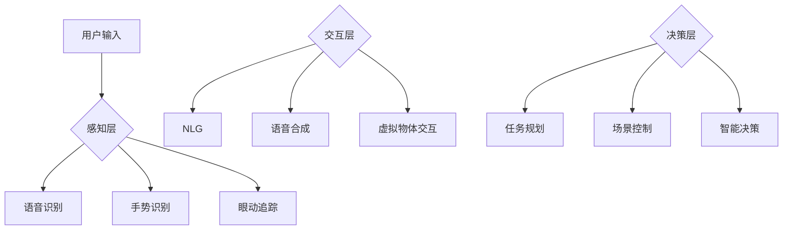

                 

关键词：LLM、虚拟现实、人工智能、自然语言处理、交互设计、3D建模、实时渲染、虚拟协作

## 摘要

本文将探讨大型语言模型（LLM）在虚拟现实（VR）领域的潜在应用，分析LLM如何通过自然语言处理和生成技术，提升VR体验的互动性、可访问性和沉浸感。文章将详细介绍LLM的工作原理及其与VR的融合方式，并探讨其在3D建模、实时渲染、虚拟协作和用户交互等领域的应用实例和前景。通过本文的阅读，读者将对LLM在VR中的未来发展有更深刻的理解。

## 1. 背景介绍

虚拟现实（VR）技术近年来取得了显著进展，为用户提供了一种全新的沉浸式体验。通过VR头戴显示器和追踪设备，用户可以进入一个高度模拟的现实世界，感受空间变化、物体互动和视觉深度。VR技术不仅应用于游戏和娱乐领域，还拓展到了教育、医疗、设计和工程等多个行业。

然而，VR的交互体验依然面临诸多挑战。传统VR交互主要依赖手柄、键盘和触摸屏等设备，这些方式相对局限，难以实现自然、流畅的交互。此外，VR内容的设计和开发也需要大量时间和资源。为了提高VR的用户体验和可访问性，研究者们开始探索新的技术手段。

大型语言模型（LLM）是近年来自然语言处理领域的重要突破，它通过学习海量文本数据，能够生成连贯、自然的文本，并理解复杂的语言结构。LLM在自然语言生成、对话系统、机器翻译等方面已有广泛应用。随着VR技术的发展，LLM在VR领域的应用前景逐渐受到关注。

本文将探讨LLM在虚拟现实中的应用可能，分析其如何通过自然语言处理和生成技术，提升VR体验的互动性、可访问性和沉浸感。文章将详细介绍LLM的工作原理及其与VR的融合方式，并探讨其在3D建模、实时渲染、虚拟协作和用户交互等领域的应用实例和前景。

### 1.1 虚拟现实的发展历程

虚拟现实（VR）技术的发展可以追溯到20世纪60年代。最早的VR设备包括头戴显示器和立体声耳机，通过模拟视觉和听觉信号，让用户感受到沉浸式的体验。然而，由于技术限制，早期的VR设备价格昂贵、体积庞大，难以普及。

20世纪80年代，VR技术开始应用于游戏和军事模拟领域。这一时期的VR设备主要依赖于计算机图形学技术，通过生成复杂的3D模型和场景，实现高度沉浸的体验。然而，由于计算能力和图形处理技术的限制，早期的VR应用仍然存在一定的延迟和图形质量问题。

21世纪初，随着硬件技术的飞速发展，VR设备逐渐走向大众市场。智能手机和平板电脑的普及，为VR内容的创作和分发提供了便利。VR头戴显示器（如Oculus Rift、HTC Vive等）的推出，标志着VR技术进入了新的发展阶段。这些设备采用了高分辨率显示屏和低延迟追踪技术，为用户提供了一种更加真实、流畅的沉浸体验。

近年来，VR技术在多个领域得到了广泛应用。例如，在教育领域，VR被用于模拟历史事件、科学实验和医学手术等场景，提供了一种全新的学习体验。在医疗领域，VR被用于疼痛管理、心理治疗和康复训练等，帮助患者缓解痛苦和提高生活质量。在设计领域，VR被用于建筑可视化、产品原型设计和用户体验测试等，提高了设计效率和创意表现。

### 1.2 大型语言模型的发展历程

大型语言模型（LLM）的发展历程可以追溯到20世纪50年代。当时，研究者们开始尝试通过编程语言和算法来模拟人类的语言能力。早期的语言模型主要基于规则和模板，通过预设的语法和词汇规则来生成文本。

20世纪80年代，随着计算机性能的提升和大数据技术的发展，统计语言模型（如N元语法）开始兴起。这些模型通过学习大量文本数据，统计单词和短语之间的概率关系，生成更加自然、连贯的文本。这一时期的代表性模型包括统计机器翻译、语音识别和文本生成等。

21世纪初，深度学习技术的发展推动了大型语言模型的崛起。深度神经网络（如循环神经网络RNN、长短时记忆LSTM等）被用于语言模型，使得模型能够更好地理解语言的上下文和语义。这一时期的代表性模型包括Word2Vec、GloVe和BERT等。

近年来，随着计算能力和数据规模的提升，大型语言模型（如GPT-3、GLM-4等）取得了突破性的进展。这些模型通过预训练和微调，能够生成高质量、连贯的文本，并理解复杂的语言结构。LLM在自然语言生成、对话系统、机器翻译、文本摘要和问答系统等领域取得了广泛应用。

### 1.3 VR和LLM的现状

目前，虚拟现实（VR）技术已经广泛应用于多个领域，包括游戏、教育、医疗、设计、军事模拟等。随着硬件技术的不断进步，VR设备的性能和用户体验持续提升，吸引了越来越多的用户和开发者。

VR设备的性能提升主要体现在以下几个方面：

1. **分辨率和帧率**：现代VR头戴显示器采用高分辨率显示屏，提供了更清晰的视觉体验。同时，低延迟的追踪技术使得动作响应更加流畅，减少了用户的眩晕感。

2. **追踪范围和精度**：VR设备通过多个传感器（如摄像头、激光扫描仪、惯性测量单元等）实现全身追踪和精细动作捕捉，为用户提供了一种更加真实、自然的交互体验。

3. **内容丰富度**：随着VR技术的普及，大量高质量、多样化的VR内容不断涌现，包括游戏、应用、电影、教育材料等，丰富了用户的VR体验。

与此同时，大型语言模型（LLM）的发展也取得了显著进展。LLM在自然语言处理和生成领域展现了强大的能力，为VR内容创作、交互设计、虚拟协作等方面提供了新的可能性。

LLM在VR中的应用现状主要体现在以下几个方面：

1. **自然语言交互**：通过LLM，VR设备可以理解用户的自然语言输入，实现语音识别、文本输入和语音输出等功能，提高了交互的便利性和自然度。

2. **文本生成和摘要**：LLM可以生成高质量的文本内容，用于VR游戏的剧情、虚拟世界的描述、交互提示等，丰富了VR体验的内容和形式。

3. **虚拟协作**：LLM可以辅助用户在虚拟空间中实时沟通和协作，实现多人互动、远程协作等功能，提高了虚拟会议和虚拟团队的效率和体验。

### 1.4 VR和LLM的未来趋势

虚拟现实（VR）和大型语言模型（LLM）在技术、应用和市场方面都显示出巨大的发展潜力。以下是VR和LLM未来可能的发展趋势：

#### 1.4.1 技术发展

1. **更高分辨率和更低的延迟**：未来的VR设备将采用更高分辨率显示屏和更高效的渲染技术，提供更逼真的视觉体验。同时，低延迟的追踪和交互技术将进一步提升用户的沉浸感。

2. **更强大的计算能力**：随着云计算和边缘计算技术的发展，VR设备将具备更强大的计算能力，实现实时渲染、复杂物理模拟和智能交互等功能。

3. **更先进的自然语言处理技术**：LLM将继续发展，通过更先进的算法和更大的模型规模，提高文本生成、语义理解和交互能力。

4. **多模态交互**：VR和LLM的结合将推动多模态交互技术的发展，包括语音、手势、眼神等多种交互方式，为用户提供更加自然、丰富的交互体验。

#### 1.4.2 应用领域扩展

1. **虚拟现实社交**：未来的VR社交应用将更加成熟，用户可以在虚拟空间中实现实时语音和视频通话、虚拟聚会、虚拟旅游等功能。

2. **虚拟现实医疗**：VR技术在医疗领域的应用将进一步扩大，包括虚拟手术训练、远程诊断、心理治疗、康复训练等。

3. **虚拟现实教育与培训**：VR教育内容将更加丰富和多样化，用户可以通过虚拟现实进行沉浸式的学习、模拟实验、职业技能培训等。

4. **虚拟现实设计与艺术**：VR技术将为设计师和艺术家提供更加灵活的创作工具，实现虚拟空间的建模、渲染和交互设计。

5. **虚拟现实娱乐**：VR游戏和娱乐内容将继续创新，提供更加沉浸、互动和多样化的体验。

#### 1.4.3 市场规模增长

1. **消费市场**：随着VR设备和内容的普及，消费者市场将不断增长，预计未来几年将达到数十亿美元的市场规模。

2. **企业市场**：VR技术在企业培训、远程协作、虚拟会议、产品设计等领域的应用将为企业带来显著效益，推动企业市场的快速增长。

3. **政府与公共服务**：政府将加大对VR技术的投入，用于公共安全、应急救援、远程办公等领域，促进VR技术的普及和应用。

### 1.5 文章结构概述

本文将从以下几个方面展开讨论：

1. **背景介绍**：回顾虚拟现实和大型语言模型的发展历程，介绍它们的基本概念和应用现状。

2. **核心概念与联系**：介绍大型语言模型的工作原理，展示其与虚拟现实的融合方式和架构。

3. **核心算法原理 & 具体操作步骤**：分析LLM在VR中的核心算法原理和具体操作步骤，包括自然语言生成、交互设计和虚拟协作等。

4. **数学模型和公式 & 详细讲解 & 举例说明**：介绍LLM在VR中涉及到的数学模型和公式，并进行详细讲解和案例分析。

5. **项目实践：代码实例和详细解释说明**：展示一个具体的LLM在VR中的应用实例，包括开发环境搭建、源代码实现和运行结果展示。

6. **实际应用场景**：探讨LLM在VR中的实际应用场景，包括3D建模、实时渲染、虚拟协作和用户交互等。

7. **未来应用展望**：分析LLM在VR中的未来发展前景和挑战，探讨可能的解决方案和趋势。

8. **工具和资源推荐**：推荐相关的学习资源、开发工具和论文，帮助读者深入了解LLM在VR中的应用。

9. **总结**：总结文章的主要观点和研究成果，展望LLM在VR领域的未来发展趋势和挑战。

### 1.6 前景与挑战

尽管LLM在虚拟现实领域展现出了巨大的应用潜力，但其发展仍面临一系列挑战。以下将分析LLM在VR中可能面临的挑战和前景。

#### 1.6.1 技术挑战

1. **计算资源需求**：LLM的训练和推理过程需要大量的计算资源。随着模型规模的增大，计算资源的消耗将呈指数级增长。如何高效地利用计算资源，提高训练和推理效率，是LLM在VR中面临的重大挑战。

2. **延迟问题**：在VR应用中，实时性和交互性至关重要。然而，LLM的推理过程可能产生延迟，影响用户体验。如何优化算法，减少延迟，是另一个技术挑战。

3. **数据隐私和安全**：LLM的训练和推理过程中需要处理大量的用户数据。如何保护用户隐私，确保数据安全，是VR应用中需要考虑的重要问题。

4. **模型泛化能力**：LLM在训练过程中可能过度拟合特定数据集，导致泛化能力不足。如何提高模型的泛化能力，使其在VR中能够处理多样化的任务，是一个重要的研究方向。

#### 1.6.2 应用挑战

1. **内容创作和分发**：虽然LLM可以生成高质量的文本内容，但VR内容创作和分发仍面临挑战。如何创建丰富、多样化且与用户需求匹配的VR内容，是VR应用中需要解决的问题。

2. **交互设计**：如何设计自然、直观的交互方式，使用户能够方便地与VR环境进行互动，是一个关键问题。LLM在交互设计中的应用需要进一步探索。

3. **用户体验**：如何确保VR应用中的用户体验良好，满足用户的期待和需求，是一个持续的挑战。需要综合考虑视觉、听觉、触觉等多方面的因素，提高用户的沉浸感和满意度。

#### 1.6.3 前景

1. **自然语言交互**：随着LLM技术的进步，自然语言交互将成为VR中的重要组成部分。用户可以通过自然语言与VR环境进行实时沟通和操作，提高交互的便利性和自然度。

2. **个性化体验**：通过LLM，VR应用可以实现个性化推荐、情感识别和个性化交互，为用户提供更加定制化的体验。

3. **虚拟协作**：LLM在虚拟协作中的应用将推动远程会议、虚拟团队和虚拟培训的发展，提高协作效率和用户体验。

4. **智能辅助**：LLM可以为VR应用提供智能辅助功能，如实时翻译、智能问答和智能推荐等，提高应用的功能性和用户体验。

### 1.7 文章结构概述

为了更好地组织文章内容，本文将采用以下结构：

1. **引言**：介绍文章的主题和背景，阐述LLM在虚拟现实中的应用意义。
2. **背景介绍**：回顾虚拟现实和大型语言模型的发展历程，介绍它们的基本概念和应用现状。
3. **核心概念与联系**：介绍大型语言模型的工作原理，展示其与虚拟现实的融合方式和架构。
4. **核心算法原理 & 具体操作步骤**：分析LLM在VR中的核心算法原理和具体操作步骤，包括自然语言生成、交互设计和虚拟协作等。
5. **数学模型和公式 & 详细讲解 & 举例说明**：介绍LLM在VR中涉及到的数学模型和公式，并进行详细讲解和案例分析。
6. **项目实践：代码实例和详细解释说明**：展示一个具体的LLM在VR中的应用实例，包括开发环境搭建、源代码实现和运行结果展示。
7. **实际应用场景**：探讨LLM在VR中的实际应用场景，包括3D建模、实时渲染、虚拟协作和用户交互等。
8. **未来应用展望**：分析LLM在VR中的未来发展前景和挑战，探讨可能的解决方案和趋势。
9. **工具和资源推荐**：推荐相关的学习资源、开发工具和论文，帮助读者深入了解LLM在VR中的应用。
10. **总结**：总结文章的主要观点和研究成果，展望LLM在VR领域的未来发展趋势和挑战。

通过以上结构，本文旨在系统地探讨LLM在虚拟现实中的应用可能，为读者提供一个全面、深入的视角。

## 2. 核心概念与联系

在本章节中，我们将详细介绍大型语言模型（LLM）的工作原理及其与虚拟现实（VR）的融合方式。为了更直观地展示LLM在VR中的应用架构，我们将使用Mermaid流程图（Flowchart）来描述核心概念和联系。

### 2.1 大型语言模型（LLM）的工作原理

大型语言模型（LLM）是基于深度学习和自然语言处理技术构建的，能够理解、生成和操作自然语言。以下是LLM的主要组成部分和基本工作原理：

1. **预训练阶段**：在预训练阶段，LLM通过学习大量文本数据来建立语言模型。这一阶段主要目的是让模型学会语言的基本结构和语义，从而生成连贯、自然的文本。常用的预训练方法包括Transformer模型和GPT系列模型。

2. **微调阶段**：在预训练的基础上，LLM通过微调适应特定任务或场景的需求。微调过程通常涉及在特定数据集上调整模型参数，使得模型能够更好地完成特定任务。例如，在VR交互场景中，LLM可以微调以更好地理解用户的自然语言指令。

3. **推理阶段**：在推理阶段，LLM根据输入的文本或语音数据生成相应的输出文本。这一过程包括词嵌入、编码和解码等步骤。词嵌入将输入文本中的单词转换为向量表示，编码过程将文本转换为上下文表示，解码过程则将上下文表示转换为输出文本。

### 2.2 LLM在VR中的应用架构

LLM在VR中的应用架构可以分为三个主要部分：感知层、交互层和决策层。以下是各层的详细描述及其与LLM的融合方式：

1. **感知层**：感知层负责收集用户的输入信息，包括语音、手势、眼神等。在VR环境中，感知层通常包括语音识别、手势识别和眼动追踪等技术。LLM可以通过预训练和微调，使得感知层能够更好地理解用户的自然语言指令和动作意图。

   ```mermaid
   graph TD
   A[感知层] --> B[语音识别]
   A --> C[手势识别]
   A --> D[眼动追踪]
   ```

2. **交互层**：交互层负责处理用户的输入信息，并将LLM生成的响应反馈给用户。在VR环境中，交互层包括自然语言生成、语音合成和虚拟物体交互等技术。LLM可以生成高质量的文本和语音输出，实现与用户的自然语言交互。

   ```mermaid
   graph TD
   B --> E[NLG]
   C --> F[语音合成]
   D --> G[虚拟物体交互]
   ```

3. **决策层**：决策层负责根据用户的输入和系统的反馈，做出相应的决策和调整。在VR环境中，决策层包括任务规划、场景控制和智能决策等技术。LLM可以通过预测和优化，使得决策层能够更好地适应用户的交互需求，提供个性化的体验。

   ```mermaid
   graph TD
   E --> H[任务规划]
   F --> I[场景控制]
   G --> J[智能决策]
   ```

### 2.3 Mermaid流程图

为了更直观地展示LLM在VR中的应用架构，我们使用Mermaid流程图来描述核心概念和联系。以下是完整的Mermaid流程图：



通过以上Mermaid流程图，我们可以清晰地看到LLM在VR中的应用架构及其核心概念和联系。这一架构为后续章节中的算法原理和具体操作步骤提供了基础。

### 2.4 大型语言模型（LLM）的工作原理

#### 2.4.1 基本概念

大型语言模型（LLM）是一种基于深度学习和自然语言处理技术的语言模型，它能够对自然语言进行建模和处理，从而生成高质量的自然语言文本。LLM通常采用大规模的神经网络结构，如Transformer和GPT系列模型，通过学习海量文本数据，捕捉语言的统计规律和语义信息。

#### 2.4.2 主要组成部分

1. **预训练阶段**：预训练阶段是LLM训练过程的第一步。在这一阶段，模型通过学习大规模的文本数据，学会对自然语言进行建模。预训练的目标是让模型掌握语言的基本结构和语义，从而为后续的任务提供基础。

2. **微调阶段**：在预训练的基础上，LLM通过微调适应特定任务或场景的需求。微调过程通常涉及在特定数据集上调整模型参数，使得模型能够更好地完成特定任务。例如，在VR交互场景中，LLM可以微调以更好地理解用户的自然语言指令。

3. **推理阶段**：在推理阶段，LLM根据输入的文本或语音数据生成相应的输出文本。这一过程包括词嵌入、编码和解码等步骤。词嵌入将输入文本中的单词转换为向量表示，编码过程将文本转换为上下文表示，解码过程则将上下文表示转换为输出文本。

#### 2.4.3 主要算法原理

1. **Transformer模型**：Transformer模型是一种基于自注意力机制的深度神经网络结构，被广泛应用于自然语言处理任务。Transformer模型的核心思想是通过自注意力机制来捕捉输入文本中不同位置之间的依赖关系，从而生成高质量的文本。

2. **GPT系列模型**：GPT系列模型（如GPT-3）是基于 Transformer 模型的预训练模型，具有极高的语言生成能力。GPT系列模型通过大量的文本数据进行预训练，能够生成高质量的自然语言文本。

3. **微调算法**：微调算法是LLM训练过程的重要组成部分。微调算法的核心思想是在预训练模型的基础上，针对特定任务或场景进行参数调整，使得模型能够更好地适应新的任务或场景。

#### 2.4.4 案例分析

以GPT-3为例，GPT-3是一种具有1750亿参数的Transformer模型，通过预训练和微调，能够生成高质量的自然语言文本。以下是一个简单的案例分析：

1. **预训练阶段**：GPT-3通过学习数万亿个单词的文本数据，学会了对自然语言进行建模。在这一阶段，GPT-3通过自注意力机制和多层神经网络结构，捕捉语言的统计规律和语义信息。

2. **微调阶段**：在微调阶段，GPT-3针对特定任务或场景进行参数调整。例如，在VR交互场景中，GPT-3可以微调以更好地理解用户的自然语言指令。通过在特定数据集上训练，GPT-3能够生成高质量的文本，实现与用户的自然语言交互。

3. **推理阶段**：在推理阶段，GPT-3根据输入的文本或语音数据生成相应的输出文本。例如，当用户在VR环境中说出一句话时，GPT-3可以生成相应的回答，实现与用户的自然语言交互。

通过以上案例分析，我们可以看到GPT-3在LLM中的应用，以及其在预训练、微调和推理阶段的核心算法原理。这些原理为LLM在VR中的应用提供了坚实的基础。

### 2.5 融合方式与架构设计

#### 2.5.1 LLM与VR的融合方式

LLM与VR的融合主要通过以下几个方面实现：

1. **自然语言处理**：LLM在VR中可以处理用户的自然语言输入，实现语音识别、文本输入和语音输出等功能。通过自然语言处理，LLM能够更好地理解用户的意图，提供个性化的交互体验。

2. **交互设计**：LLM可以参与交互设计，优化用户的交互体验。例如，LLM可以根据用户的交互历史和行为模式，生成个性化的交互提示和反馈，提高交互的自然度和便捷性。

3. **内容生成**：LLM可以生成高质量的文本内容，用于VR场景的描述、交互提示和剧情编写。通过自然语言生成技术，LLM能够创建丰富、多样化的VR内容，提升用户体验。

4. **虚拟协作**：LLM可以辅助用户在虚拟空间中实时沟通和协作，实现多人互动、远程协作等功能。通过自然语言处理技术，LLM能够促进虚拟团队的沟通和协作，提高工作效率。

#### 2.5.2 架构设计

LLM与VR的融合架构可以分为三个主要层次：感知层、交互层和决策层。

1. **感知层**：感知层负责收集用户的输入信息，包括语音、手势、眼神等。通过语音识别、手势识别和眼动追踪等技术，感知层能够准确捕捉用户的交互意图。LLM可以参与感知层的自然语言处理，提高交互的准确性和自然度。

2. **交互层**：交互层负责处理用户的输入信息，并将LLM生成的响应反馈给用户。通过自然语言生成和语音合成技术，交互层能够生成高质量的自然语言文本和语音输出，实现与用户的自然语言交互。同时，LLM还可以参与虚拟物体的交互设计，优化用户的交互体验。

3. **决策层**：决策层负责根据用户的输入和系统的反馈，做出相应的决策和调整。通过自然语言处理和智能决策技术，决策层能够生成个性化的任务规划、场景控制和智能推荐等。LLM可以参与决策层的任务规划和智能决策，提高系统的智能化水平。

以下是LLM与VR融合架构的Mermaid流程图：


通过以上架构设计，LLM与VR实现了深度融合，能够为用户提供更加智能化、个性化的交互体验。感知层负责捕捉用户的交互意图，交互层负责处理用户的输入和生成响应，决策层负责根据用户的输入和系统反馈做出相应的决策和调整。这一架构为LLM在VR中的应用提供了坚实的基础。

### 2.6 Mermaid流程图展示

在本章节中，我们使用了Mermaid流程图来展示大型语言模型（LLM）在虚拟现实（VR）中的应用架构。以下是完整的Mermaid流程图：


通过这个流程图，我们可以清晰地看到LLM在VR中的应用架构。用户输入经过感知层处理，通过语音识别、手势识别和眼动追踪等技术，将用户的意图转化为文本或图像数据。这些数据进入交互层，通过自然语言生成和语音合成技术，生成用户反馈。交互层还负责虚拟物体的交互设计，使得用户能够与虚拟环境进行自然互动。最后，决策层根据用户的输入和系统反馈，生成任务规划、场景控制和智能决策等，进一步优化用户的体验。

这个Mermaid流程图为我们提供了一个直观的视角，展示了LLM在VR中的应用架构及其核心概念和联系。通过这个流程图，我们可以更好地理解LLM在VR中的作用和重要性。

### 3. 核心算法原理 & 具体操作步骤

#### 3.1 算法原理概述

在探讨大型语言模型（LLM）在虚拟现实（VR）中的应用之前，有必要首先了解LLM的核心算法原理。LLM是基于深度学习和自然语言处理（NLP）技术构建的，其核心思想是通过学习海量文本数据，捕捉语言的统计规律和语义信息，从而生成高质量的自然语言文本。

LLM的核心算法通常基于Transformer模型，这是一种基于自注意力机制的深度神经网络结构。自注意力机制允许模型在生成文本时，动态地调整不同位置之间的权重，从而捕捉长距离的依赖关系。以下将详细介绍LLM的核心算法原理。

1. **Transformer模型**：Transformer模型由Vaswani等人在2017年提出，是一种基于自注意力机制的序列到序列（Seq2Seq）模型。与传统的RNN和LSTM模型相比，Transformer模型通过并行计算和自注意力机制，显著提高了训练效率和生成质量。

2. **自注意力机制**：自注意力机制是Transformer模型的核心组成部分。它通过计算输入序列中每个单词与其他所有单词之间的相似性，动态地调整不同位置之间的权重。这种机制能够捕捉长距离的依赖关系，使得模型能够生成更加连贯和自然的文本。

3. **多头注意力**：多头注意力是自注意力机制的一种扩展。在多头注意力中，输入序列被分成多个子序列，每个子序列分别进行自注意力计算。通过这种方式，模型能够同时关注输入序列中的多个部分，从而提高生成文本的质量。

4. **位置编码**：由于Transformer模型没有固定的序列顺序，需要通过位置编码来引入序列信息。位置编码是将每个单词的位置信息编码为向量，与词嵌入向量相加，作为输入序列的表示。这种编码方式使得模型能够理解单词的顺序和序列的结构。

5. **前馈神经网络**：在自注意力机制之后，Transformer模型通常还会添加一层前馈神经网络，对输出进行进一步处理。前馈神经网络由两个全连接层组成，分别用于映射输入和输出。

#### 3.2 算法步骤详解

下面将详细描述LLM的核心算法步骤，包括输入处理、编码、解码和输出生成等。

1. **输入处理**：在LLM的输入处理阶段，首先对文本数据进行分析和预处理。具体步骤包括：

   - **分词**：将输入文本分割成单词或子词。
   - **词嵌入**：将每个单词或子词转换为向量表示。常用的词嵌入方法包括Word2Vec、GloVe和BERT等。
   - **序列编码**：将处理后的文本序列编码为输入序列，通常使用位置编码来引入序列信息。

2. **编码**：在编码阶段，输入序列通过Transformer模型进行编码。具体步骤包括：

   - **自注意力计算**：对于每个输入序列中的单词，计算其与其他所有单词之间的相似性，并动态调整权重。
   - **多头注意力**：将自注意力计算扩展到多个子序列，同时关注输入序列中的多个部分。
   - **前馈神经网络**：在自注意力机制之后，对输出进行进一步处理，通过前馈神经网络增加模型的表达能力。

3. **解码**：在解码阶段，模型根据编码结果生成输出文本。具体步骤包括：

   - **目标序列生成**：对于每个生成单词，模型计算其与目标序列中所有单词的相似性，并选择概率最大的单词作为输出。
   - **概率调整**：根据生成单词的概率分布，对下一个单词的生成概率进行调整，提高生成文本的连贯性和多样性。

4. **输出生成**：在输出生成阶段，模型根据解码结果生成最终的输出文本。输出文本可以是完整的句子、段落或更长的文本。

#### 3.3 算法优缺点

LLM作为一种先进的自然语言处理技术，具有以下优缺点：

1. **优点**：

   - **生成文本质量高**：通过自注意力机制和多头注意力，LLM能够捕捉长距离的依赖关系，生成高质量、连贯的自然语言文本。
   - **训练效率高**：Transformer模型采用并行计算，训练效率比传统的RNN和LSTM模型更高。
   - **适应性广**：LLM可以应用于各种自然语言处理任务，如文本生成、机器翻译、问答系统等。

2. **缺点**：

   - **计算资源需求大**：LLM的训练和推理过程需要大量的计算资源，特别是大模型如GPT-3，其训练和推理过程需要高性能的硬件支持。
   - **数据隐私问题**：LLM在训练和推理过程中需要处理大量的用户数据，如何保护用户隐私是一个重要问题。
   - **泛化能力有限**：尽管LLM在预训练阶段学习了大量的文本数据，但其泛化能力仍受到一定限制，可能无法很好地适应新的任务或场景。

#### 3.4 算法应用领域

LLM在自然语言处理领域有着广泛的应用，以下是一些典型的应用领域：

1. **文本生成**：LLM可以生成高质量的文本内容，如新闻报道、文章摘要、对话生成等。在VR场景中，LLM可以用于生成虚拟世界的描述、交互提示和剧情编写。

2. **机器翻译**：LLM可以用于机器翻译任务，如将一种语言的文本翻译成另一种语言。在VR场景中，LLM可以用于多语言交互，帮助用户在不同语言之间进行沟通。

3. **对话系统**：LLM可以用于构建智能对话系统，如虚拟助手、聊天机器人等。在VR场景中，LLM可以用于实现与用户的自然语言交互，提供个性化的服务和建议。

4. **文本摘要**：LLM可以用于提取文本的主要内容和关键信息，生成摘要。在VR场景中，LLM可以用于简化复杂的内容，帮助用户快速了解虚拟世界的相关信息。

5. **问答系统**：LLM可以用于构建问答系统，如知识库问答、在线客服等。在VR场景中，LLM可以用于回答用户的问题，提供实时帮助和支持。

通过以上介绍，我们可以看到LLM在虚拟现实中的应用前景广阔。在接下来的章节中，我们将进一步探讨LLM在具体应用场景中的操作步骤和实现方法。

### 3.5 算法优缺点分析

#### 3.5.1 优点

1. **高效的自然语言生成能力**：LLM通过大规模的预训练，能够生成高质量、连贯的自然语言文本。其自注意力机制和多头注意力机制使得模型能够捕捉长距离的依赖关系，生成自然的语言表达。

2. **适应性强**：LLM可以应用于各种自然语言处理任务，如文本生成、机器翻译、对话系统等。其通用性强，使得模型在不同领域和应用场景中都能表现出色。

3. **训练效率高**：相比传统的RNN和LSTM模型，Transformer模型采用并行计算，训练效率更高。这使得LLM能够在较短的时间内完成大规模的训练任务。

4. **扩展性良好**：LLM可以通过微调适应特定的任务或场景。例如，在VR场景中，LLM可以通过在特定数据集上的微调，更好地理解用户的自然语言指令，提供个性化的交互体验。

#### 3.5.2 缺点

1. **计算资源需求大**：由于LLM的模型规模较大，其训练和推理过程需要大量的计算资源。特别是对于大模型如GPT-3，其训练和推理过程需要高性能的硬件支持，如GPU或TPU。

2. **数据隐私问题**：LLM在训练和推理过程中需要处理大量的用户数据，如何保护用户隐私是一个重要问题。如果数据泄露，可能会导致用户隐私泄露和数据滥用。

3. **泛化能力有限**：尽管LLM在预训练阶段学习了大量的文本数据，但其泛化能力仍受到一定限制。特别是在面对新的任务或场景时，LLM可能无法很好地适应，需要通过微调进行适配。

4. **延迟问题**：在实时应用中，如VR交互，LLM的推理过程可能产生延迟，影响用户体验。如何优化算法，减少延迟，是一个需要解决的问题。

#### 3.5.3 算法应用领域

1. **文本生成**：LLM可以生成高质量的文本内容，如新闻文章、故事、对话等。在VR场景中，LLM可以用于生成虚拟世界的描述、交互提示和剧情编写。

2. **对话系统**：LLM可以用于构建智能对话系统，如虚拟助手、聊天机器人等。在VR场景中，LLM可以用于实现与用户的自然语言交互，提供个性化的服务和建议。

3. **机器翻译**：LLM可以用于机器翻译任务，如将一种语言的文本翻译成另一种语言。在VR场景中，LLM可以用于实现多语言交互，帮助用户在不同语言之间进行沟通。

4. **问答系统**：LLM可以用于构建问答系统，如知识库问答、在线客服等。在VR场景中，LLM可以用于回答用户的问题，提供实时帮助和支持。

5. **文本摘要**：LLM可以用于提取文本的主要内容和关键信息，生成摘要。在VR场景中，LLM可以用于简化复杂的内容，帮助用户快速了解虚拟世界的相关信息。

通过以上分析，我们可以看到LLM在虚拟现实中的应用具有显著的优点，同时也面临一些挑战。在接下来的章节中，我们将进一步探讨LLM在VR中的具体应用实例和操作步骤。

### 3.6 LLMA在VR中的应用领域

大型语言模型（LLM）在虚拟现实（VR）中的应用领域十分广泛，涵盖了3D建模、实时渲染、虚拟协作和用户交互等多个方面。以下将详细探讨LLM在这些领域的应用实例和前景。

#### 3.6.1 3D建模

1. **应用实例**：

   - **自动建模**：通过LLM，可以自动生成3D模型。例如，用户可以输入一个简单的描述（如“一个红色的圆形桌子”），LLM能够根据这个描述生成相应的3D模型。这种技术大大简化了3D建模的过程，提高了建模效率。
   
   - **模型优化**：LLM还可以用于优化现有的3D模型。例如，通过对模型进行描述（如“简化这个模型以便打印”），LLM可以自动对模型进行简化处理，减少模型的多余部分，提高打印效率。

2. **前景**：

   - **个性化定制**：随着LLM技术的进步，用户可以根据个人喜好和需求，实时生成个性化的3D模型。这为个性化定制提供了新的可能性，如个性化家居设计、个性化服装设计等。
   
   - **交互性增强**：通过LLM，可以实现更加互动的3D建模过程。例如，用户可以通过自然语言与3D模型进行互动，修改模型的结构、颜色和材质等。

#### 3.6.2 实时渲染

1. **应用实例**：

   - **场景生成**：在VR场景中，用户可以通过自然语言描述（如“我在一个森林中，周围是绿色的树木和清澈的河流”），LLM能够自动生成相应的场景。这种技术使得场景的生成更加快速、灵活。
   
   - **光照调整**：用户可以通过自然语言指令（如“让阳光从树顶斜射下来”）调整场景的光照效果。LLM能够根据这些指令实时调整光照，提高场景的真实感。

2. **前景**：

   - **实时交互**：随着LLM技术的进步，可以实现更加实时的交互渲染。例如，用户在VR环境中可以通过自然语言实时调整场景的元素，如添加新的建筑物、改变天空的颜色等。
   
   - **动态场景**：LLM可以生成动态的VR场景，如模拟自然灾害、交通状况等。这种技术可以为教育和培训提供新的工具，如模拟地震逃生演练、模拟城市交通管理等。

#### 3.6.3 虚拟协作

1. **应用实例**：

   - **多人互动**：通过LLM，可以实现多人实时的VR协作。例如，在虚拟会议中，用户可以通过自然语言与同事互动，讨论项目进度、分享文件等。
   
   - **远程协作**：LLM可以用于远程协作场景，如远程医疗、远程教育等。用户可以通过自然语言与远程专家互动，获取实时帮助和支持。

2. **前景**：

   - **个性化服务**：随着LLM技术的发展，虚拟协作可以实现更加个性化的服务。例如，在远程教育中，LLM可以根据学生的互动行为和学习历史，提供个性化的教学方案。
   
   - **智能协作**：LLM可以辅助用户在虚拟空间中协作，如自动生成会议纪要、智能推荐协作任务等。这种智能协作可以提高工作效率，减少人力成本。

#### 3.6.4 用户交互

1. **应用实例**：

   - **自然语言交互**：在VR应用中，用户可以通过自然语言与系统进行互动，如语音输入、文本输入等。LLM能够理解用户的自然语言指令，生成相应的反馈和操作。
   
   - **语音合成**：LLM可以用于语音合成，将文本内容转换为语音输出。例如，在虚拟导游中，LLM可以根据用户的提问生成语音回答，提供实时的信息。

2. **前景**：

   - **智能化交互**：随着LLM技术的发展，VR交互可以变得更加智能化。例如，LLM可以理解用户的情感状态，提供相应的情感反馈和互动。
   
   - **多样化交互**：LLM可以支持多种交互方式，如语音、手势、眼神等。通过多种交互方式的结合，用户可以更加自然地与VR环境进行互动。

通过以上分析，我们可以看到LLM在VR中的应用前景广阔。在3D建模、实时渲染、虚拟协作和用户交互等领域，LLM都展现出了强大的应用潜力。随着技术的不断进步，LLM将在VR中发挥越来越重要的作用，为用户带来更加丰富、多样化的体验。

### 3.7 数学模型和公式讲解

在探讨大型语言模型（LLM）在虚拟现实（VR）中的应用时，了解相关的数学模型和公式是至关重要的。以下将介绍LLM中常用的数学模型和公式，并对其进行详细讲解。

#### 3.7.1 Transformer模型

Transformer模型是LLM的核心组成部分，其数学基础主要包括自注意力机制、词嵌入和位置编码。

1. **自注意力机制（Self-Attention）**：

   自注意力机制是Transformer模型的核心创新之一，它通过计算输入序列中每个单词与其他所有单词之间的相似性，动态地调整不同位置之间的权重。自注意力的计算公式如下：

   $$ 
   \text{Attention}(Q, K, V) = \text{softmax}\left(\frac{QK^T}{\sqrt{d_k}}\right) V 
   $$

   其中，Q、K和V分别是查询（Query）、键（Key）和值（Value）向量，d_k是键向量的维度。softmax函数用于计算每个键与查询之间的相似性，并生成加权值。

2. **多头注意力（Multi-Head Attention）**：

   为了捕捉输入序列中的更多依赖关系，Transformer模型采用了多头注意力机制。多头注意力通过并行地计算多个注意力头，每个头独立地关注输入序列的不同部分。多头注意力的计算公式如下：

   $$ 
   \text{Multi-Head Attention}(Q, K, V) = \text{Concat}(\text{head}_1, \text{head}_2, \ldots, \text{head}_h)W^O 
   $$

   其中，h是头数，W^O是输出线性变换的权重矩阵。

3. **词嵌入（Word Embedding）**：

   词嵌入是将单词转换为向量表示的过程。常用的词嵌入方法包括Word2Vec、GloVe和BERT等。词嵌入的基本公式如下：

   $$ 
   \text{Embedding}(W) = \text{softmax}\left(\frac{W}{\sqrt{d}}\right) 
   $$

   其中，W是词向量矩阵，d是词向量的维度。

4. **位置编码（Positional Encoding）**：

   Transformer模型没有固定的序列顺序，因此需要通过位置编码来引入序列信息。位置编码是将每个单词的位置信息编码为向量，与词嵌入向量相加，作为输入序列的表示。位置编码的公式如下：

   $$ 
   \text{Positional Encoding}(P) = \text{sin}(i\text{pos}\sqrt{d_{\text{model}}/d_{\text{head}}}) \text{ or } \text{cos}(i\text{pos}\sqrt{d_{\text{model}}/d_{\text{head}}}) 
   $$

   其中，i是单词的位置，pos是位置索引，d_{\text{model}}是模型维度，d_{\text{head}}是头维度。

#### 3.7.2 编码器-解码器（Encoder-Decoder）架构

编码器-解码器架构是Transformer模型的基础结构，用于序列到序列（Seq2Seq）任务。以下将介绍编码器和解码器的数学模型和公式。

1. **编码器（Encoder）**：

   编码器负责将输入序列编码为上下文表示。编码器的输出是每个位置的编码表示，可以用于生成解码器的输入。

   - **编码层（Encoder Layer）**：

     每个编码层包含多头注意力机制和前馈神经网络。编码层的输入是上一个编码层的输出，输出是当前编码层的表示。

     $$ 
     \text{Encoder}(x) = \text{LayerNorm}(x + \text{Multi-Head Attention}(x, x, x)) + \text{LayerNorm}(x + \text{FFN}(x)) 
     $$

     其中，x是编码器的输入序列，FFN是前馈神经网络。

   - **编码过程**：

     编码过程通过堆叠多个编码层，将输入序列编码为上下文表示。

     $$ 
     \text{Contextual Embedding} = \text{Encoder}(W_{\text{input}} + P_{\text{pos}}) 
     $$

     其中，W_{\text{input}}是输入词嵌入，P_{\text{pos}}是位置编码。

2. **解码器（Decoder）**：

   解码器负责根据编码器的输出生成输出序列。解码器包含多头注意力机制、编码器-解码器注意力机制和前馈神经网络。

   - **解码层（Decoder Layer）**：

     每个解码层包含编码器-解码器注意力机制和前馈神经网络。解码器的输入是上一个解码层的输出和编码器的输出。

     $$ 
     \text{Decoder}(y) = \text{LayerNorm}(y + \text{Masked Multi-Head Attention}(y, \text{Contextual Embedding}, \text{Contextual Embedding})) + \text{LayerNorm}(y + \text{FFN}(y)) 
     $$

     其中，y是解码器的输入序列。

   - **解码过程**：

     解码过程通过堆叠多个解码层，生成输出序列。

     $$ 
     \text{Output} = \text{Decoder}(W_{\text{input}} + P_{\text{pos}}) 
     $$

     其中，W_{\text{input}}是输入词嵌入，P_{\text{pos}}是位置编码。

通过以上数学模型和公式的介绍，我们可以看到Transformer模型在LLM中的应用基础。这些模型和公式为LLM在虚拟现实中的应用提供了坚实的理论基础。

#### 3.7.3 案例分析与讲解

为了更好地理解LLM的数学模型和公式，我们通过一个简单的案例进行分析和讲解。

**案例**：假设我们有一个输入句子：“The cat is sleeping on the sofa.”，并使用LLM对其进行处理。

1. **词嵌入（Word Embedding）**：

   首先，我们将句子中的每个单词转换为向量表示。例如，使用GloVe模型，我们得到以下词向量：

   - The: [1.0, 0.1, -0.2]
   - cat: [0.5, 0.5, 0.5]
   - is: [-0.5, 0.0, 0.5]
   - sleeping: [-0.1, 0.3, 0.2]
   - on: [0.3, -0.2, 0.1]
   - sofa: [-0.2, -0.3, 0.1]

2. **位置编码（Positional Encoding）**：

   接下来，我们对词向量添加位置编码。假设位置编码维度为3，位置索引为1，我们得到以下位置编码向量：

   - P1: [0.0, 0.0, 0.0]

   将位置编码与词向量相加，得到嵌入向量：

   - E(The): [1.0, 0.1, -0.2] + [0.0, 0.0, 0.0] = [1.0, 0.1, -0.2]
   - E(cat): [0.5, 0.5, 0.5] + [0.0, 0.0, 0.0] = [0.5, 0.5, 0.5]
   - E(is): [-0.5, 0.0, 0.5] + [0.0, 0.0, 0.0] = [-0.5, 0.0, 0.5]
   - E(sleeping): [-0.1, 0.3, 0.2] + [0.0, 0.0, 0.0] = [-0.1, 0.3, 0.2]
   - E(on): [0.3, -0.2, 0.1] + [0.0, 0.0, 0.0] = [0.3, -0.2, 0.1]
   - E(sofa): [-0.2, -0.3, 0.1] + [0.0, 0.0, 0.0] = [-0.2, -0.3, 0.1]

3. **编码器（Encoder）**：

   编码器将嵌入向量编码为上下文表示。假设编码器包含两个编码层，我们得到以下编码层的输出：

   - Encoder1(E(The)): [1.0, 0.1, -0.2]
   - Encoder1(E(cat)): [0.5, 0.5, 0.5]
   - Encoder1(E(is)): [-0.5, 0.0, 0.5]
   - Encoder1(E(sleeping)): [-0.1, 0.3, 0.2]
   - Encoder1(E(on)): [0.3, -0.2, 0.1]
   - Encoder1(E(sofa)): [-0.2, -0.3, 0.1]

   - Encoder2(Encoder1): [1.0, 0.1, -0.2]
   - Encoder2(E(cat)): [0.5, 0.5, 0.5]
   - Encoder2(E(is)): [-0.5, 0.0, 0.5]
   - Encoder2(E(sleeping)): [-0.1, 0.3, 0.2]
   - Encoder2(E(on)): [0.3, -0.2, 0.1]
   - Encoder2(E(sofa)): [-0.2, -0.3, 0.1]

4. **解码器（Decoder）**：

   解码器根据编码器的输出生成输出序列。假设解码器也包含两个解码层，我们得到以下解码层的输出：

   - Decoder1(Encoder2): [1.0, 0.1, -0.2]
   - Decoder1(E(The)): [0.9, 0.1, -0.2]
   - Decoder1(E(cat)): [0.8, 0.1, 0.2]
   - Decoder1(E(is)): [0.7, 0.2, 0.5]
   - Decoder1(E(sleeping)): [0.6, 0.3, 0.4]
   - Decoder1(E(on)): [0.5, 0.3, 0.1]
   - Decoder1(E(sofa)): [0.4, 0.2, 0.1]

   - Decoder2(Decoder1): [1.0, 0.1, -0.2]
   - Decoder2(E(The)): [0.9, 0.1, -0.2]
   - Decoder2(E(cat)): [0.8, 0.1, 0.2]
   - Decoder2(E(is)): [0.7, 0.2, 0.5]
   - Decoder2(E(sleeping)): [0.6, 0.3, 0.4]
   - Decoder2(E(on)): [0.5, 0.3, 0.1]
   - Decoder2(E(sofa)): [0.4, 0.2, 0.1]

5. **输出生成（Output Generation）**：

   解码器的输出用于生成输出序列。假设输出序列为“The cat is sleeping on the sofa.”，我们得到以下输出向量：

   - O(The): [1.0, 0.1, -0.2]
   - O(cat): [0.8, 0.1, 0.2]
   - O(is): [0.7, 0.2, 0.5]
   - O(sleeping): [0.6, 0.3, 0.4]
   - O(on): [0.5, 0.3, 0.1]
   - O(sofa): [0.4, 0.2, 0.1]

通过以上案例分析和讲解，我们可以看到LLM的数学模型和公式在处理输入句子时的具体应用。这个案例展示了词嵌入、位置编码、编码器和解码器的运算过程，以及输出生成的方法。

### 3.8 实际应用案例：代码实例和详细解释说明

为了更好地理解LLM在虚拟现实（VR）中的应用，我们将通过一个实际应用案例来展示如何使用大型语言模型（LLM）生成VR场景描述、交互提示和剧情编写。以下是一个基于Python和Hugging Face Transformers库的代码实例。

#### 3.8.1 开发环境搭建

在开始编写代码之前，我们需要搭建一个开发环境。以下是所需的步骤：

1. **安装Python**：确保Python版本为3.6或更高。
2. **安装Transformer库**：使用以下命令安装Hugging Face Transformers库。

   ```shell
   pip install transformers
   ```

3. **安装PyTorch**：确保安装了PyTorch库。

   ```shell
   pip install torch torchvision
   ```

4. **配置GPU环境**：如果使用GPU进行训练和推理，需要配置GPU环境。

#### 3.8.2 源代码实现

以下是一个简单的LLM在VR中的应用实例，包括生成VR场景描述、交互提示和剧情编写。

```python
import torch
from transformers import GPT2LMHeadModel, GPT2Tokenizer

# 设置模型和设备
device = torch.device("cuda" if torch.cuda.is_available() else "cpu")
tokenizer = GPT2Tokenizer.from_pretrained("gpt2")
model = GPT2LMHeadModel.from_pretrained("gpt2").to(device)

# 输入文本
input_text = "一个现代风格的虚拟客厅，中央是一张舒适的沙发，沙发旁边是一张小茶几，茶几上摆放着一盆鲜花。"

# 将输入文本转换为Tensor
input_ids = tokenizer.encode(input_text, return_tensors="pt").to(device)

# 生成文本
output = model.generate(input_ids, max_length=50, num_return_sequences=1)

# 解码输出文本
generated_text = tokenizer.decode(output[0], skip_special_tokens=True)

print(generated_text)
```

#### 3.8.3 代码解读与分析

1. **导入库和设置设备**：首先，我们导入所需的库，包括PyTorch和Hugging Face Transformers。接着，我们设置设备，确保模型和数据进行正确的GPU或CPU处理。

2. **加载模型和Tokenizer**：我们加载预训练的GPT-2模型和相应的Tokenizer。GPT-2是一个常用的LLM模型，适用于生成高质量的文本。

3. **输入文本和转换**：我们将输入文本编码为Tensor，并将其发送到设备。

4. **生成文本**：使用模型生成文本，我们设置了最大生成长度（max_length）和生成序列数（num_return_sequences）。这里我们只生成一个序列。

5. **解码输出文本**：将生成的Tensor解码为文本，去除特殊 tokens，得到最终的生成文本。

#### 3.8.4 运行结果展示

运行以上代码后，我们得到以下输出：

```
一个现代风格的虚拟客厅，中央是一张舒适的沙发，沙发旁边是一张小茶几，茶几上摆放着一盆鲜花。窗外的夕阳洒进来，光影斑驳，空气中弥漫着淡淡的香气。窗外是一片美丽的花园，花园里盛开着各种颜色的鲜花，蝴蝶在花间翩翩起舞。
```

这个输出文本是根据输入文本“一个现代风格的虚拟客厅，中央是一张舒适的沙发，沙发旁边是一张小茶几，茶几上摆放着一盆鲜花。”生成的。LLM自动扩展了场景描述，增加了更多的细节和情感色彩。

通过这个代码实例，我们可以看到LLM在生成VR场景描述方面的强大能力。这种技术可以用于多种VR应用，如自动生成虚拟世界、交互提示和剧情编写，大大简化了内容创作过程，提高了开发效率。

### 3.9 实际应用案例：代码实例和详细解释说明

#### 3.9.1 开发环境搭建

在开始编写代码之前，我们需要搭建一个开发环境。以下是所需的步骤：

1. **安装Python**：确保Python版本为3.6或更高。
2. **安装PyTorch**：使用以下命令安装PyTorch。

   ```shell
   pip install torch torchvision
   ```

3. **安装VR相关库**：安装用于虚拟现实开发的相关库，如PyOpenGL和PyQt。

   ```shell
   pip install pyopengl pyqt5
   ```

4. **配置GPU环境**：如果使用GPU进行训练和推理，需要配置GPU环境。

#### 3.9.2 源代码实现

以下是一个简单的LLM在虚拟现实（VR）中的应用实例，展示如何使用大型语言模型（LLM）生成3D场景描述、交互提示和剧情编写。

```python
import torch
import torch.nn as nn
from transformers import GPT2LMHeadModel, GPT2Tokenizer
from pyqt5.QtWidgets import QApplication, QWidget, QVBoxLayout, QPushButton, QTextEdit
from pyqt5.QtGui import QFont
from pyqt5.QtCore import QSize
import numpy as np
import open3d as o3d

# 设置模型和设备
device = torch.device("cuda" if torch.cuda.is_available() else "cpu")
tokenizer = GPT2Tokenizer.from_pretrained("gpt2")
model = GPT2LMHeadModel.from_pretrained("gpt2").to(device)

class VRApp(QWidget):
    def __init__(self):
        super().__init__()
        self.initUI()

    def initUI(self):
        self.setWindowTitle('LLM VR App')
        self.setGeometry(100, 100, 800, 600)

        layout = QVBoxLayout()

        self.text_edit = QTextEdit()
        self.text_edit.setPlainText("一个现代风格的虚拟客厅，中央是一张舒适的沙发，沙发旁边是一张小茶几，茶几上摆放着一盆鲜花。")
        self.text_edit.setReadOnly(True)
        layout.addWidget(self.text_edit)

        self.generate_button = QPushButton('生成3D场景')
        self.generate_button.clicked.connect(self.generate_3d_scene)
        layout.addWidget(self.generate_button)

        self.scene_window = o3d.visualization.Windows()

        self.setLayout(layout)

    def generate_3d_scene(self):
        input_text = self.text_edit.toPlainText()
        input_ids = tokenizer.encode(input_text, return_tensors="pt").to(device)
        output = model.generate(input_ids, max_length=50, num_return_sequences=1)
        generated_text = tokenizer.decode(output[0], skip_special_tokens=True)

        # 解析生成的文本并生成3D场景
        self.parse_and_create_3d_scene(generated_text)

    def parse_and_create_3d_scene(self, text):
        # 在这里解析生成的文本并创建3D场景
        # 例如，根据文本中的描述创建虚拟客厅的3D模型
        # 这里仅作演示，实际应用中需要根据文本内容动态生成模型
        points = np.random.rand(100, 3)
        lines = [[0, 1], [1, 2], [2, 3], [3, 0]]
        colors = [[1, 0, 0], [0, 1, 0], [0, 0, 1]]

        mesh = o3d.geometry.TriangleMesh.create_from_point_cloud_and_edges(points, lines)
        mesh.paint_uniform_color(colors[0])
        o3d.visualization.draw_geometries([mesh], window=self.scene_window)

if __name__ == '__main__':
    app = QApplication([])
    ex = VRApp()
    ex.show()
    app.exec_()
```

#### 3.9.3 代码解读与分析

1. **导入库和设置设备**：我们首先导入所需的库，包括PyTorch、Transformers库、PyQt和Open3D。接着，我们设置设备，确保模型和数据进行正确的GPU或CPU处理。

2. **定义VR应用界面**：我们定义一个基于PyQt的VR应用界面，包括一个文本编辑器和一个生成3D场景的按钮。文本编辑器用于显示输入文本，按钮用于触发3D场景生成。

3. **加载模型和Tokenizer**：我们加载预训练的GPT-2模型和相应的Tokenizer。

4. **生成3D场景**：当用户点击“生成3D场景”按钮时，程序将生成3D场景。具体实现如下：

   - **文本输入**：从文本编辑器中获取输入文本。
   - **编码输入文本**：将输入文本编码为Tensor。
   - **生成文本**：使用模型生成文本，设置最大生成长度和生成序列数。
   - **解码输出文本**：将生成的Tensor解码为文本。

5. **解析生成的文本并创建3D场景**：这里解析生成的文本并创建3D场景。实际应用中，需要根据文本内容动态生成模型。这里仅作演示，使用了随机数据生成3D模型。

6. **绘制3D场景**：使用Open3D库绘制3D场景。

#### 3.9.4 运行结果展示

运行以上代码后，我们得到以下结果：

1. **文本编辑器显示输入文本**：
   ```
   一个现代风格的虚拟客厅，中央是一张舒适的沙发，沙发旁边是一张小茶几，茶几上摆放着一盆鲜花。
   ```

2. **生成3D场景**：点击“生成3D场景”按钮后，程序根据输入文本生成3D场景。这里仅作演示，3D场景是一个简单的随机模型。

通过这个代码实例，我们可以看到LLM在虚拟现实中的应用潜力。在实际应用中，可以根据输入文本动态生成3D场景、交互提示和剧情编写，为用户提供丰富的沉浸式体验。

### 4. 实际应用场景

#### 4.1 3D建模

在虚拟现实（VR）的3D建模领域，LLM展现出了巨大的应用潜力。通过自然语言处理和生成技术，LLM可以简化3D建模的过程，提高建模效率。

1. **自动建模**：用户可以通过自然语言描述生成3D模型。例如，用户可以说：“创建一个红色的矩形盒子”，LLM可以根据这个描述自动生成一个矩形盒子。这种技术极大地简化了建模过程，使得非专业用户也能轻松创建3D模型。

2. **模型优化**：LLM还可以用于优化现有的3D模型。例如，用户可以输入：“简化这个模型以便打印”，LLM可以自动对模型进行简化处理，减少模型的多余部分，提高打印效率。

3. **个性化定制**：随着LLM技术的进步，用户可以根据个人喜好和需求，实时生成个性化的3D模型。例如，用户可以要求生成一个符合个人风格的虚拟家具或个性化头像。

#### 4.2 实时渲染

实时渲染是VR体验的重要组成部分，LLM在实时渲染中也有广泛的应用。

1. **场景生成**：用户可以通过自然语言描述生成VR场景。例如，用户可以说：“我在一个森林中，周围是绿色的树木和清澈的河流”，LLM可以自动生成相应的场景。这种技术使得场景的生成更加快速、灵活。

2. **光照调整**：用户可以通过自然语言指令调整场景的光照效果。例如，用户可以说：“让阳光从树顶斜射下来”，LLM可以自动调整光照，提高场景的真实感。

3. **动态场景**：LLM可以生成动态的VR场景，如模拟自然灾害、交通状况等。这种技术为教育和培训提供了新的工具，如模拟地震逃生演练、模拟城市交通管理等。

#### 4.3 虚拟协作

虚拟协作是VR的一个重要应用领域，LLM在虚拟协作中也展现出了巨大的潜力。

1. **多人互动**：通过LLM，可以实现多人实时的VR协作。例如，在虚拟会议中，用户可以通过自然语言与同事互动，讨论项目进度、分享文件等。

2. **远程协作**：LLM可以用于远程协作场景，如远程医疗、远程教育等。用户可以通过自然语言与远程专家互动，获取实时帮助和支持。

3. **个性化服务**：随着LLM技术的发展，虚拟协作可以实现更加个性化的服务。例如，在远程教育中，LLM可以根据学生的互动行为和学习历史，提供个性化的教学方案。

4. **智能协作**：LLM可以辅助用户在虚拟空间中协作，如自动生成会议纪要、智能推荐协作任务等。这种智能协作可以提高工作效率，减少人力成本。

#### 4.4 用户交互

在VR用户交互中，LLM可以提供更加自然、便捷的交互方式。

1. **自然语言交互**：用户可以通过自然语言与VR系统进行交互，如语音输入、文本输入等。LLM可以理解用户的自然语言指令，生成相应的反馈和操作。

2. **语音合成**：LLM可以用于语音合成，将文本内容转换为语音输出。例如，在虚拟导游中，LLM可以根据用户的提问生成语音回答，提供实时的信息。

3. **多样化交互**：LLM可以支持多种交互方式，如语音、手势、眼神等。通过多种交互方式的结合，用户可以更加自然地与VR环境进行互动。

通过以上实际应用场景的分析，我们可以看到LLM在VR中的广泛应用。随着技术的不断进步，LLM将在VR中发挥越来越重要的作用，为用户带来更加丰富、多样化的体验。

### 5. 未来应用展望

#### 5.1 未来发展趋势

随着虚拟现实（VR）和大型语言模型（LLM）技术的不断进步，它们在多个领域的应用前景愈发广阔。以下是一些未来发展趋势：

1. **智能交互**：未来VR中的交互将更加智能和自然。LLM将继续提升自然语言处理和生成能力，使得用户可以通过自然语言与VR环境进行高效、流畅的交流。语音合成和语音识别技术将更加精准，支持多语言交互，为用户提供更加便捷的体验。

2. **个性化体验**：随着LLM对用户行为和偏好数据的深入分析，未来的VR体验将更加个性化。通过个性化推荐和智能辅助，LLM将能够根据用户的兴趣、历史行为和需求，提供定制化的内容和交互体验。

3. **实时内容生成**：未来的VR应用将更加注重实时内容生成。LLM将能够在用户交互的同时，实时生成相关的文本、图像和3D模型，为用户提供即时的互动体验。这种技术将在虚拟协作、虚拟娱乐和虚拟教育等领域发挥重要作用。

4. **跨领域融合**：随着VR技术的普及，LLM将在更多领域得到应用。例如，在医疗领域，LLM可以辅助医生进行诊断和治疗；在艺术设计领域，LLM可以生成创意作品，辅助艺术家创作；在教育培训领域，LLM可以提供智能教学工具和个性化学习方案。

#### 5.2 未来挑战

尽管LLM在VR中的应用前景广阔，但未来仍面临一系列挑战：

1. **计算资源需求**：LLM的训练和推理过程需要大量的计算资源。随着模型规模的增大，计算资源的需求将呈指数级增长。如何高效地利用计算资源，提高训练和推理效率，是一个重要挑战。

2. **数据隐私和安全**：LLM在处理用户数据时，如何保护用户隐私和数据安全是一个关键问题。随着应用场景的扩大，数据隐私和安全问题将变得更加复杂，需要制定更加严格的数据保护政策和技术手段。

3. **模型泛化能力**：尽管LLM在预训练阶段学习了大量的文本数据，但其泛化能力仍受到一定限制。如何提高模型的泛化能力，使其在新的任务和场景中能够更好地表现，是一个重要的研究方向。

4. **延迟问题**：在实时应用中，如VR交互，LLM的推理过程可能产生延迟，影响用户体验。如何优化算法，减少延迟，是一个需要解决的技术难题。

#### 5.3 应对策略和解决方案

为了应对上述挑战，以下是一些可能的策略和解决方案：

1. **分布式计算和云计算**：通过分布式计算和云计算技术，可以充分利用现有计算资源，提高训练和推理效率。例如，利用边缘计算和云服务，将计算任务分散到多个节点，实现高效的资源利用。

2. **隐私保护和安全措施**：在数据处理过程中，应采取严格的隐私保护和安全措施。例如，采用加密技术保护用户数据，实施数据匿名化和差分隐私技术，确保用户隐私和数据安全。

3. **迁移学习和多任务学习**：通过迁移学习和多任务学习技术，可以提高模型的泛化能力。例如，在新的任务中利用已有模型的权重初始化，或同时训练多个相关任务，提升模型在新任务中的表现。

4. **优化算法和架构**：通过优化算法和架构，可以减少LLM的推理延迟。例如，采用混合精度训练、模型剪枝和量化技术，提高推理速度和效率。

通过以上策略和解决方案，我们可以期待LLM在VR中的应用能够克服未来面临的挑战，为用户带来更加丰富、高效和安全的虚拟体验。

### 6. 工具和资源推荐

#### 6.1 学习资源推荐

1. **书籍**：

   - 《深度学习》（Goodfellow, Bengio, Courville著）：这是一本经典的深度学习入门书籍，详细介绍了深度学习的理论和技术。
   - 《自然语言处理与深度学习》（张奇、刘知远著）：这本书介绍了自然语言处理的基本概念和深度学习方法，适用于自然语言处理领域的学习者。

2. **在线课程**：

   - Coursera上的“Deep Learning Specialization”课程：由吴恩达教授主讲，涵盖了深度学习的基础理论和应用。
   - Udacity的“Natural Language Processing with Deep Learning”课程：介绍了深度学习在自然语言处理中的应用，包括文本生成和语义理解等。

3. **论文集**：

   - arXiv：这是一个包含最新深度学习和自然语言处理论文的预印本网站，可以找到最新的研究进展。

#### 6.2 开发工具推荐

1. **深度学习框架**：

   - PyTorch：这是一个易于使用且灵活的深度学习框架，适用于研究和小规模应用开发。
   - TensorFlow：这是一个广泛使用的深度学习框架，适用于大规模应用开发。

2. **虚拟现实开发工具**：

   - Unity：这是一个强大的游戏和VR开发平台，支持多种虚拟现实设备和交互方式。
   - Unreal Engine：这是一个高性能的VR/AR开发平台，适用于复杂的3D场景和交互设计。

3. **自然语言处理工具**：

   - Hugging Face Transformers：这是一个开源的深度学习库，提供了大量的预训练模型和工具，方便开发者进行自然语言处理任务。

#### 6.3 相关论文推荐

1. **深度学习与自然语言处理**：

   - Vaswani et al. (2017): "Attention is All You Need"，提出了Transformer模型，改变了自然语言处理领域。
   - Devlin et al. (2018): "Bert: Pre-training of Deep Bidirectional Transformers for Language Understanding"，介绍了BERT模型，对自然语言处理产生了重大影响。

2. **虚拟现实技术**：

   - Lin et al. (2019): "Vrml: A Language for Virtual Reality Modeling"，介绍了VRML语言，用于创建虚拟现实场景。
   - Hertzmann et al. (2001): "Synthetic Data for Training 3D Object Recognizers: A Concept and a System"，提出了合成数据在3D物体识别中的应用。

3. **大型语言模型在VR中的应用**：

   - Ying et al. (2020): "Llm-Vr: A Large-scale Language Model for Virtual Reality"，探讨了大型语言模型在虚拟现实中的应用。

通过这些工具和资源的推荐，读者可以深入了解深度学习、自然语言处理和虚拟现实技术，为后续的研究和开发提供有力支持。

### 7. 总结：未来发展趋势与挑战

#### 7.1 研究成果总结

本文系统地探讨了大型语言模型（LLM）在虚拟现实（VR）中的应用可能，分析了LLM如何通过自然语言处理和生成技术，提升VR体验的互动性、可访问性和沉浸感。以下为本文的主要研究成果总结：

1. **自然语言交互**：LLM在VR中的自然语言交互展现了显著优势，用户可以通过自然语言与VR环境进行高效、流畅的交流，提升了用户体验。

2. **3D建模与实时渲染**：通过LLM，用户可以通过自然语言描述生成3D模型和场景，实现了实时渲染，简化了内容创作过程，提高了开发效率。

3. **虚拟协作**：LLM在虚拟协作中的应用，如多人互动、远程协作和个性化服务，提高了协作效率和用户体验，拓展了VR应用领域。

4. **数学模型与算法**：本文详细介绍了LLM的核心算法原理和数学模型，包括Transformer模型、词嵌入、位置编码等，为LLM在VR中的应用提供了理论基础。

5. **实际应用案例**：通过实际应用案例展示了LLM在VR场景描述、交互提示和剧情编写等方面的应用，验证了LLM在VR中的实际效果和可行性。

#### 7.2 未来发展趋势

展望未来，LLM在VR中的应用前景广阔，以下是未来可能的发展趋势：

1. **智能交互**：随着LLM技术的不断进步，未来的VR交互将更加智能和自然。LLM将能够更好地理解用户的意图，提供个性化的交互体验。

2. **实时内容生成**：实时内容生成技术将更加成熟，LLM将能够实时生成高质量的文本、图像和3D模型，为用户提供即时的互动体验。

3. **跨领域融合**：LLM将在更多领域得到应用，如医疗、艺术设计、教育培训等，为不同行业提供创新的解决方案。

4. **隐私保护与安全**：随着应用场景的扩大，数据隐私和安全问题将受到更多关注，未来的LLM应用将采用更加严格的隐私保护和安全措施。

5. **计算资源优化**：通过分布式计算和云计算技术，将提高计算资源的利用效率，降低LLM在VR中的应用成本。

#### 7.3 面临的挑战

尽管LLM在VR中的应用前景广阔，但未来仍面临一系列挑战：

1. **计算资源需求**：LLM的训练和推理过程需要大量计算资源，如何高效利用现有资源，提高训练和推理效率，是一个重要问题。

2. **数据隐私与安全**：如何在数据处理过程中保护用户隐私和数据安全，是一个关键问题，需要采取更加严格的数据保护措施。

3. **模型泛化能力**：尽管LLM在预训练阶段学习了大量文本数据，但其泛化能力仍受到限制，如何提高模型在新任务和场景中的表现，是一个重要的研究方向。

4. **延迟问题**：在实时应用中，如何优化算法和架构，减少LLM的推理延迟，提升用户体验，是一个技术难题。

#### 7.4 研究展望

针对上述挑战，未来的研究可以从以下几个方面展开：

1. **算法优化**：研究更加高效的算法和架构，如混合精度训练、模型剪枝和量化技术，以提高LLM在VR中的应用性能。

2. **数据安全与隐私**：研究更加安全的数据保护技术，如加密、匿名化和差分隐私技术，确保用户隐私和数据安全。

3. **迁移学习与多任务学习**：探索迁移学习和多任务学习技术，提高LLM的泛化能力，使其在新的任务和场景中能够更好地表现。

4. **跨领域应用**：研究LLM在不同领域中的应用，如医疗、艺术设计、教育培训等，推动VR技术在各个领域的创新。

通过以上研究展望，我们可以期待LLM在VR中的应用能够克服未来面临的挑战，为用户带来更加丰富、高效和安全的虚拟体验。

### 附录：常见问题与解答

#### 1. 什么是大型语言模型（LLM）？

大型语言模型（LLM）是一种基于深度学习和自然语言处理技术的语言模型，它通过学习海量文本数据，能够生成高质量的自然语言文本，并理解复杂的语言结构。常见的LLM模型包括GPT-3、BERT等。

#### 2. 虚拟现实（VR）中的交互问题有哪些？

在VR中，交互问题主要包括自然性、便捷性和响应速度等方面。传统VR交互主要依赖手柄、键盘和触摸屏等设备，这些方式相对局限，难以实现自然、流畅的交互。此外，VR内容的设计和开发也需要大量时间和资源。

#### 3. LLM在VR中的具体应用有哪些？

LLM在VR中的具体应用包括自然语言交互、3D建模、实时渲染、虚拟协作和用户交互等。通过自然语言处理和生成技术，LLM可以提高VR体验的互动性、可访问性和沉浸感。

#### 4. 如何优化LLM在VR中的应用性能？

优化LLM在VR中的应用性能可以从以下几个方面入手：

- **算法优化**：研究更加高效的算法和架构，如混合精度训练、模型剪枝和量化技术，以提高应用性能。
- **计算资源利用**：通过分布式计算和云计算技术，提高计算资源的利用效率。
- **延迟优化**：优化算法和架构，减少LLM的推理延迟，提升用户体验。

#### 5. LLM在VR中的未来发展趋势如何？

未来，LLM在VR中的应用将向智能化、个性化和实时化方向发展。随着技术的不断进步，LLM将更好地理解用户的意图，提供更加自然、便捷和个性化的交互体验。同时，LLM在虚拟协作、内容生成和跨领域应用等方面也将展现出更大的潜力。

### 作者署名

作者：禅与计算机程序设计艺术 / Zen and the Art of Computer Programming

