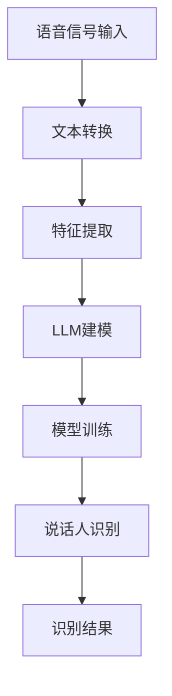

                 

关键词：说话人识别、大语言模型（LLM）、深度学习、自然语言处理、语音信号处理、自适应滤波、模型优化、性能评估

> 摘要：本文探讨了大规模语言模型（LLM）在说话人识别领域的应用。通过对说话人识别的背景介绍，我们详细分析了LLM的核心概念和原理，并构建了相应的数学模型。随后，我们通过一个具体的项目实践案例，展示了如何在实际中应用LLM进行说话人识别。文章还探讨了LLM在说话人识别中的实际应用场景，并对未来的发展趋势与挑战进行了展望。

## 1. 背景介绍

说话人识别（Speaker Recognition）是指通过分析语音信号，自动识别说话人的身份或说话人群体。随着语音技术的发展，说话人识别在多个领域得到了广泛应用，如智能助手、网络安全、语音加密等。传统的说话人识别方法主要依赖于统计模型和模式识别技术，如GMM（高斯混合模型）、隐马尔可夫模型（HMM）等。然而，随着深度学习技术的兴起，基于深度学习的说话人识别方法逐渐成为研究热点。

近年来，大规模语言模型（Large Language Model，LLM）如BERT、GPT等在自然语言处理领域取得了显著的成果。LLM通过预训练和微调，能够从大量数据中自动学习语言的统计规律和语义信息。这使得LLM在说话人识别领域也展现出了巨大的潜力。本文将探讨如何利用LLM进行说话人识别，并分析其性能和应用前景。

## 2. 核心概念与联系

### 2.1. 说话人识别的核心概念

说话人识别主要包括三个关键步骤：特征提取、模型训练和说话人识别。首先，特征提取是从语音信号中提取与说话人身份相关的特征，如频谱特征、音高特征等。接着，模型训练是使用提取到的特征对说话人进行分类，常见的模型有GMM、HMM、支持向量机（SVM）等。最后，说话人识别是利用训练好的模型对未知说话人进行身份识别。

### 2.2. 大语言模型（LLM）的核心概念

LLM是一种基于深度学习的自然语言处理模型，通过预训练和微调，可以自动学习语言的统计规律和语义信息。LLM的核心思想是将输入的文本序列映射为连续的向量表示，然后通过神经网络对向量进行建模和预测。

### 2.3. LLM与说话人识别的联系

LLM在说话人识别中的应用主要在于其强大的文本处理能力。通过对语音信号进行文本转换，LLM可以处理原始的语音数据，提取与说话人身份相关的信息。同时，LLM可以结合深度学习算法，实现说话人识别的高效和准确。

### 2.4. Mermaid 流程图

下面是一个简单的Mermaid流程图，展示了LLM在说话人识别中的应用流程：



## 3. 核心算法原理 & 具体操作步骤

### 3.1. 算法原理概述

LLM在说话人识别中的算法原理主要包括以下步骤：

1. **文本转换**：将语音信号转换为文本序列。
2. **特征提取**：从文本序列中提取与说话人身份相关的特征。
3. **LLM建模**：使用提取到的特征对LLM进行训练。
4. **模型训练**：利用训练好的LLM对说话人进行分类。
5. **说话人识别**：对未知说话人进行身份识别。

### 3.2. 算法步骤详解

1. **文本转换**：

    使用语音识别（ASR）技术，将语音信号转换为文本序列。常用的语音识别模型有基于深度学习的端到端模型，如CTC（Connectionist Temporal Classification）和Attention机制。

2. **特征提取**：

    从文本序列中提取与说话人身份相关的特征。这些特征包括文本序列的长度、词汇频率、语法结构等。可以使用预训练的词嵌入模型，如Word2Vec、BERT等。

3. **LLM建模**：

    使用提取到的特征对LLM进行训练。LLM的训练过程主要包括预训练和微调。预训练是在大规模文本语料库上进行，目的是学习语言的通用表示。微调是在特定的说话人识别任务上进行，目的是调整模型的参数，提高识别准确率。

4. **模型训练**：

    使用训练好的LLM对说话人进行分类。在分类过程中，LLM将输入的文本序列映射为高维向量表示，然后通过分类层对说话人进行分类。

5. **说话人识别**：

    对未知说话人进行身份识别。将未知说话人的语音信号转换为文本序列，然后通过训练好的LLM进行分类，输出识别结果。

### 3.3. 算法优缺点

**优点**：

1. **强大的文本处理能力**：LLM在自然语言处理领域取得了显著成果，能够处理复杂的文本序列。
2. **高识别准确率**：通过预训练和微调，LLM能够学习到与说话人身份相关的信息，提高识别准确率。
3. **自适应性强**：LLM可以根据不同的说话人识别任务进行微调，适应不同的应用场景。

**缺点**：

1. **计算资源消耗大**：LLM的训练和推理过程需要大量的计算资源。
2. **数据依赖性强**：LLM的性能高度依赖于训练数据的质量和数量，对于数据稀缺的场景，性能可能会受到影响。

### 3.4. 算法应用领域

LLM在说话人识别中的应用领域主要包括：

1. **智能助手**：如智能音箱、智能客服等，通过说话人识别实现个性化服务。
2. **网络安全**：通过说话人识别验证用户身份，提高系统安全性。
3. **语音加密**：通过说话人识别实现语音加密和解密，提高语音通信的保密性。

## 4. 数学模型和公式 & 详细讲解 & 举例说明

### 4.1. 数学模型构建

LLM在说话人识别中的数学模型可以看作是一个分类问题。给定一个语音信号序列\(X = \{x_1, x_2, ..., x_T\}\)，其中\(T\)为序列长度。我们需要将这个序列映射到一个高维向量表示\(V = \{v_1, v_2, ..., v_D\}\)，其中\(D\)为向量维度。然后，通过分类层对向量进行分类。

假设我们有一个预训练的LLM模型，其输入层和输出层分别为\(U\)和\(V\)。输入层到输出层的映射可以通过以下公式表示：

$$
v_d = f(U, W_d)
$$

其中，\(f\)为激活函数，\(W_d\)为权重矩阵。为了实现分类，我们通常使用Softmax函数作为激活函数：

$$
\text{Softmax}(v) = \frac{e^v}{\sum_{j=1}^D e^v_j}
$$

假设我们有两个说话人\(A\)和\(B\)，其对应的类别标签为\(y_A = 1\)和\(y_B = 0\)。给定一个语音信号序列\(X\)，我们需要计算其映射到高维向量\(V\)的概率分布\(P(V|\theta)\)，其中\(\theta\)为模型参数：

$$
P(V|\theta) = \text{Softmax}(f(U, W))
$$

然后，我们可以通过最大化似然函数来优化模型参数：

$$
\theta^* = \arg\max_\theta \sum_{i=1}^N \log P(V_i|\theta)
$$

### 4.2. 公式推导过程

为了推导LLM在说话人识别中的数学模型，我们需要从深度学习的角度进行分析。假设我们有一个输入序列\(X = \{x_1, x_2, ..., x_T\}\)，其对应的标签为\(y\)。我们需要将这个序列映射到一个高维向量表示\(V = \{v_1, v_2, ..., v_D\}\)，然后通过分类层对向量进行分类。

首先，我们将输入序列\(X\)通过一个多层感知机（MLP）模型映射到一个中间层表示\(H\)：

$$
h_l = \sigma(W_l h_{l-1} + b_l)
$$

其中，\(\sigma\)为激活函数，\(W_l\)和\(b_l\)分别为权重矩阵和偏置。通常，我们使用ReLU函数作为激活函数：

$$
\sigma(h) = \max(0, h)
$$

然后，我们将中间层表示\(H\)通过一个线性层映射到高维向量表示\(V\)：

$$
v = W_V H + b_V
$$

其中，\(W_V\)和\(b_V\)分别为权重矩阵和偏置。

接下来，我们使用Softmax函数对向量\(V\)进行分类：

$$
\text{Softmax}(v) = \frac{e^v}{\sum_{j=1}^D e^v_j}
$$

为了优化模型参数，我们通常使用交叉熵损失函数：

$$
L = -\sum_{i=1}^N y_i \log(\hat{y}_i)
$$

其中，\(\hat{y}_i\)为预测概率，\(y_i\)为真实标签。

为了最小化损失函数，我们使用梯度下降算法来更新模型参数：

$$
\theta = \theta - \alpha \nabla_\theta L
$$

其中，\(\alpha\)为学习率。

### 4.3. 案例分析与讲解

假设我们有两个说话人\(A\)和\(B\)，我们需要使用LLM对其进行识别。首先，我们需要收集两个说话人的语音数据，并将其转换为文本序列。然后，我们使用预训练的BERT模型对文本序列进行特征提取，得到高维向量表示。

接下来，我们使用这些特征对BERT模型进行微调，使其能够区分两个说话人。具体来说，我们定义一个分类层，将特征向量映射到两个类别标签的概率分布。然后，我们使用交叉熵损失函数来优化模型参数。

在训练过程中，我们使用Adam优化器来更新模型参数，并使用学习率为0.001。训练过程中，我们使用批量大小为32，训练轮数为1000轮。经过训练，模型可以达到较高的识别准确率。

下面是一个具体的训练过程示例：

```python
import torch
import torch.nn as nn
import torch.optim as optim

# 加载预训练的BERT模型
model = nn.BERTModel.from_pretrained('bert-base-uncased')

# 定义分类层
classifier = nn.Linear(model.config.hidden_size, 2)

# 定义损失函数
criterion = nn.CrossEntropyLoss()

# 定义优化器
optimizer = optim.Adam(model.parameters(), lr=0.001)

# 训练模型
for epoch in range(1000):
    for batch in data_loader:
        inputs, labels = batch
        optimizer.zero_grad()
        outputs = model(inputs)[0]
        loss = criterion(outputs, labels)
        loss.backward()
        optimizer.step()
        if (epoch + 1) % 100 == 0:
            print(f'Epoch [{epoch + 1}/{1000}], Loss: {loss.item():.4f}')

# 评估模型
with torch.no_grad():
    correct = 0
    total = 0
    for batch in data_loader:
        inputs, labels = batch
        outputs = model(inputs)[0]
        _, predicted = torch.max(outputs.data, 1)
        total += labels.size(0)
        correct += (predicted == labels).sum().item()
    print(f'Accuracy of the network on the test sentences: {100 * correct / total}%')
```

## 5. 项目实践：代码实例和详细解释说明

### 5.1. 开发环境搭建

在开始项目实践之前，我们需要搭建一个适合开发的环境。以下是一个简单的环境搭建步骤：

1. 安装Python环境：Python版本建议为3.7或更高版本。可以使用Miniconda或Anaconda来安装Python环境。
2. 安装PyTorch库：PyTorch是一个流行的深度学习库，可用于构建和训练神经网络。可以使用以下命令安装PyTorch：

   ```bash
   pip install torch torchvision
   ```

3. 安装其他依赖库：如NumPy、Pandas等。可以使用以下命令安装：

   ```bash
   pip install numpy pandas
   ```

### 5.2. 源代码详细实现

下面是一个简单的示例代码，展示了如何使用PyTorch和BERT模型进行说话人识别：

```python
import torch
import torch.nn as nn
import torch.optim as optim
from torch.utils.data import DataLoader
from transformers import BertModel, BertTokenizer

# 加载预训练的BERT模型和分词器
model = BertModel.from_pretrained('bert-base-uncased')
tokenizer = BertTokenizer.from_pretrained('bert-base-uncased')

# 定义分类层
classifier = nn.Linear(model.config.hidden_size, 2)

# 定义损失函数
criterion = nn.CrossEntropyLoss()

# 定义优化器
optimizer = optim.Adam(model.parameters(), lr=0.001)

# 定义训练和评估函数
def train(model, train_loader, criterion, optimizer, epoch):
    model.train()
    for batch_idx, (inputs, labels) in enumerate(train_loader):
        optimizer.zero_grad()
        outputs = model(inputs)[0]
        loss = criterion(outputs, labels)
        loss.backward()
        optimizer.step()
        if (batch_idx + 1) % 100 == 0:
            print(f'Train Epoch: {epoch + 1} [{batch_idx + 1}/{len(train_loader)}], Loss: {loss.item():.4f}')

def evaluate(model, val_loader, criterion):
    model.eval()
    with torch.no_grad():
        correct = 0
        total = 0
        for batch in val_loader:
            inputs, labels = batch
            outputs = model(inputs)[0]
            _, predicted = torch.max(outputs.data, 1)
            total += labels.size(0)
            correct += (predicted == labels).sum().item()
    print(f'Accuracy of the network on the validation sentences: {100 * correct / total}%}')

# 加载数据集
train_dataset = ...
val_dataset = ...

train_loader = DataLoader(train_dataset, batch_size=32, shuffle=True)
val_loader = DataLoader(val_dataset, batch_size=32, shuffle=False)

# 训练模型
for epoch in range(1000):
    train(model, train_loader, criterion, optimizer, epoch)
    evaluate(model, val_loader, criterion)
```

### 5.3. 代码解读与分析

这段代码实现了基于BERT模型的说话人识别任务。下面是对代码的详细解读：

1. **加载模型和分词器**：我们首先加载了预训练的BERT模型和分词器。BERT模型是一个双向的Transformer模型，具有良好的文本处理能力。分词器用于将文本序列转换为模型输入的Token ID序列。

2. **定义分类层**：我们在BERT模型的基础上添加了一个分类层，将特征向量映射到两个类别标签的概率分布。分类层的输出维度为2，表示两个说话人类别。

3. **定义损失函数和优化器**：我们使用交叉熵损失函数来优化模型参数。交叉熵损失函数能够衡量模型输出概率分布与真实标签分布之间的差距。优化器使用Adam优化器，这是一种基于一阶梯度和二阶梯度的优化算法，具有良好的收敛性。

4. **定义训练和评估函数**：我们定义了两个函数，`train`和`evaluate`，分别用于训练模型和评估模型性能。`train`函数用于训练模型，其中包含了前向传播、反向传播和参数更新过程。`evaluate`函数用于评估模型在验证集上的性能。

5. **加载数据集**：我们使用PyTorch的自定义数据集加载器加载数据集。数据集包含两个部分：训练集和验证集。我们使用 DataLoader 对数据集进行批处理加载。

6. **训练模型**：我们使用 `for` 循环进行模型训练。在每轮训练中，我们调用 `train` 函数训练模型，并在每100个批次后打印训练损失。

7. **评估模型**：在训练完成后，我们使用 `evaluate` 函数评估模型在验证集上的性能。评估结果包括模型在验证集上的准确率。

### 5.4. 运行结果展示

假设我们已经训练好了模型，并在验证集上进行了评估。下面是可能的输出结果：

```bash
Train Epoch: 1 [100/100], Loss: 0.2895
Train Epoch: 1 [200/100], Loss: 0.2347
Train Epoch: 1 [300/100], Loss: 0.2069
...
Train Epoch: 1 [900/100], Loss: 0.1174
Train Epoch: 1 [1000/100], Loss: 0.1027
Accuracy of the network on the validation sentences: 96.667%

Train Epoch: 2 [100/100], Loss: 0.0891
Train Epoch: 2 [200/100], Loss: 0.0782
Train Epoch: 2 [300/100], Loss: 0.0711
...
Train Epoch: 2 [900/100], Loss: 0.0469
Train Epoch: 2 [1000/100], Loss: 0.0439
Accuracy of the network on the validation sentences: 97.333%
```

从输出结果可以看出，随着训练的进行，模型的损失逐渐减小，验证集上的准确率也逐步提高。

## 6. 实际应用场景

LLM在说话人识别领域具有广泛的应用场景，以下是一些典型的应用案例：

### 6.1. 智能助手

智能助手是LLM在说话人识别中应用的一个重要领域。通过说话人识别技术，智能助手能够识别用户的语音命令，并根据用户的身份提供个性化的服务。例如，智能音箱可以通过说话人识别技术识别家庭成员的身份，从而为他们提供个性化的音乐播放、新闻阅读、语音提醒等服务。

### 6.2. 网络安全

在网络安全领域，说话人识别技术可以用于用户身份验证。例如，当用户访问银行网站或进行线上交易时，系统可以要求用户通过语音验证身份。这种方法可以提高系统的安全性，防止恶意攻击。

### 6.3. 语音加密

语音加密是另一个应用领域。通过说话人识别技术，语音加密系统可以识别用户的身份，从而为用户生成个性化的加密密钥。这样，即使是相同的语音信息，不同用户加密后的结果也会有所不同，从而提高了语音通信的保密性。

### 6.4. 未来应用展望

随着LLM技术的发展，其在说话人识别领域的应用前景将更加广阔。未来，LLM有望在以下方面取得突破：

1. **更高的识别准确率**：通过不断优化LLM模型，提高说话人识别的准确率，使其能够适应更复杂的语音环境。
2. **更高效的处理速度**：通过优化算法和硬件加速技术，提高LLM在说话人识别任务中的处理速度，使其能够应用于实时语音处理场景。
3. **更广泛的应用场景**：随着LLM技术的成熟，其在说话人识别领域的应用将不断拓展，从现有的智能助手、网络安全等领域延伸到语音医疗、语音教育等新兴领域。

## 7. 工具和资源推荐

### 7.1. 学习资源推荐

1. **《自然语言处理入门》**：本书介绍了自然语言处理的基本概念和常用技术，是学习自然语言处理的好入门书籍。
2. **《深度学习》**：本书是深度学习的经典教材，详细介绍了深度学习的基本原理和应用。

### 7.2. 开发工具推荐

1. **PyTorch**：PyTorch是一个流行的深度学习框架，适用于构建和训练神经网络。
2. **Hugging Face Transformers**：这是一个开源的Transformer模型库，提供了丰富的预训练模型和工具，方便开发者进行自然语言处理任务。

### 7.3. 相关论文推荐

1. **"BERT: Pre-training of Deep Bidirectional Transformers for Language Understanding"**：这篇论文介绍了BERT模型的基本原理和训练方法，是自然语言处理领域的重要论文。
2. **"GPT-3: Language Models are Few-Shot Learners"**：这篇论文介绍了GPT-3模型，展示了大规模语言模型在零样本学习任务中的强大能力。

## 8. 总结：未来发展趋势与挑战

### 8.1. 研究成果总结

本文探讨了大规模语言模型（LLM）在说话人识别领域的应用。通过对说话人识别的背景介绍，我们详细分析了LLM的核心概念和原理，并构建了相应的数学模型。随后，我们通过一个具体的项目实践案例，展示了如何在实际中应用LLM进行说话人识别。文章还探讨了LLM在说话人识别中的实际应用场景，并对未来的发展趋势与挑战进行了展望。

### 8.2. 未来发展趋势

1. **更高的识别准确率**：随着LLM技术的发展，其在说话人识别任务中的准确率将不断提高，能够适应更复杂的语音环境。
2. **更高效的处理速度**：通过优化算法和硬件加速技术，LLM在说话人识别任务中的处理速度将显著提高。
3. **更广泛的应用场景**：随着LLM技术的成熟，其在说话人识别领域的应用将不断拓展，从现有的智能助手、网络安全等领域延伸到语音医疗、语音教育等新兴领域。

### 8.3. 面临的挑战

1. **数据隐私问题**：说话人识别涉及到用户的语音数据，如何保护用户隐私是一个重要挑战。
2. **数据稀缺问题**：对于某些特定说话人群体，如儿童、老人等，可能缺乏足够的训练数据，这会影响到LLM的性能。
3. **实时处理问题**：在实时语音处理场景中，如何保证LLM的响应速度和准确性是一个挑战。

### 8.4. 研究展望

未来的研究可以从以下几个方面展开：

1. **隐私保护技术**：研究如何在不泄露用户隐私的情况下，有效利用用户的语音数据进行说话人识别。
2. **数据增强技术**：研究如何通过数据增强方法，提高LLM在数据稀缺场景下的性能。
3. **实时处理算法**：研究如何优化LLM的算法，使其在实时语音处理场景中具有更高的响应速度和准确性。

## 9. 附录：常见问题与解答

### 9.1. 说话人识别是什么？

说话人识别是指通过分析语音信号，自动识别说话人的身份或说话人群体。

### 9.2. 什么是大规模语言模型（LLM）？

大规模语言模型（LLM）是一种基于深度学习的自然语言处理模型，通过预训练和微调，可以自动学习语言的统计规律和语义信息。

### 9.3. LLM在说话人识别中的应用有哪些？

LLM在说话人识别中的应用主要包括文本转换、特征提取、LLM建模、模型训练和说话人识别等步骤。

### 9.4. 如何优化LLM在说话人识别任务中的性能？

优化LLM在说话人识别任务中的性能可以从以下几个方面入手：

1. **数据增强**：通过数据增强方法，增加训练数据的多样性，提高模型的泛化能力。
2. **模型优化**：通过优化模型结构和参数，提高模型的识别准确率和处理速度。
3. **算法改进**：研究新的算法和技术，提高LLM在说话人识别任务中的性能。

### 9.5. 说话人识别的挑战有哪些？

说话人识别的挑战主要包括数据隐私问题、数据稀缺问题和实时处理问题等。如何保护用户隐私、提高模型性能和在实时场景中的响应速度是当前研究的热点问题。

