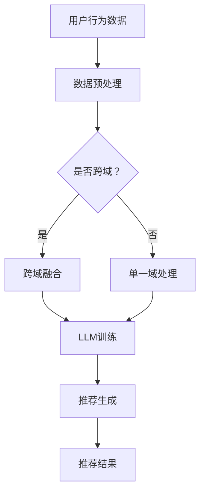

                 

关键词：大型语言模型，跨域推荐，算法原理，数学模型，项目实践，未来展望

> 摘要：本文将深入探讨大型语言模型（LLM）在跨域推荐中的应用。通过分析LLM的核心概念、算法原理、数学模型及其实际应用场景，本文旨在为读者提供全面、系统的理解，并展望其未来的发展趋势与挑战。

## 1. 背景介绍

在当今信息爆炸的时代，推荐系统已经成为各种互联网平台不可或缺的一部分。从电子商务网站到社交媒体平台，推荐系统通过预测用户可能感兴趣的内容，帮助用户发现新的信息，提升用户体验。然而，随着数据来源的多样化，推荐系统面临的一个重大挑战是如何在跨域数据之间进行有效推荐。

跨域推荐旨在解决用户在不同领域间的个性化推荐问题。传统的推荐系统往往基于用户的历史行为或偏好，只能在单一领域内提供推荐。然而，现实情况是用户的行为和偏好往往跨越多个领域。例如，一个用户可能在音乐、电影和电子书领域都有兴趣，但传统推荐系统很难同时满足这些需求。

为了解决这一问题，近年来，大型语言模型（LLM）作为一种先进的自然语言处理技术，逐渐被引入到推荐系统中。LLM具有强大的上下文理解能力和跨领域知识表示能力，为跨域推荐提供了新的思路和工具。

## 2. 核心概念与联系

### 2.1 大型语言模型（LLM）

#### 2.1.1 定义

大型语言模型（LLM）是一种基于深度学习的自然语言处理模型，通过训练海量文本数据，LLM能够生成与输入文本相关的内容，进行文本理解和生成。

#### 2.1.2 架构

LLM的典型架构包括词嵌入层、编码器和解码器。词嵌入层将输入文本转换为向量表示，编码器和解码器则通过神经网络对文本进行编码和解码，生成与输入相关的输出。

#### 2.1.3 工作原理

LLM的工作原理基于注意力机制和Transformer架构。注意力机制使模型能够关注文本中的关键信息，而Transformer架构则通过自注意力机制实现对输入文本的全局理解。

### 2.2 跨域推荐

#### 2.2.1 定义

跨域推荐是一种针对用户在多个领域间的个性化推荐方法，旨在提供跨领域的综合推荐结果。

#### 2.2.2 挑战

跨域推荐面临的挑战主要包括数据不一致性、领域差异性和用户偏好多样性。

#### 2.2.3 解决方案

LLM在跨域推荐中的应用主要通过以下几个方面实现：

1. **跨领域知识表示**：通过训练LLM，可以学习到跨领域的知识表示，从而将不同领域的用户行为和内容进行统一建模。
2. **上下文感知推荐**：LLM能够理解用户的行为和偏好上下文，从而实现更精准的跨域推荐。
3. **迁移学习**：利用LLM的迁移学习能力，可以将一个领域的知识迁移到其他领域，提高推荐效果。

### 2.3 Mermaid 流程图



## 3. 核心算法原理 & 具体操作步骤

### 3.1 算法原理概述

跨域推荐中的LLM算法主要分为三个步骤：数据预处理、LLM训练和推荐生成。

### 3.2 算法步骤详解

#### 3.2.1 数据预处理

数据预处理是跨域推荐的基础。主要包括以下任务：

1. **数据收集**：收集用户在不同领域的活动数据，如浏览记录、购买行为等。
2. **数据清洗**：去除噪声数据，处理缺失值，确保数据质量。
3. **数据整合**：将不同领域的数据进行统一格式处理，方便后续训练。

#### 3.2.2 LLM训练

LLM训练是核心步骤，主要包括以下任务：

1. **词嵌入**：将文本数据转换为向量表示。
2. **编码器训练**：利用自注意力机制，通过编码器对输入文本进行编码。
3. **解码器训练**：利用解码器生成与输入相关的输出。
4. **模型优化**：通过梯度下降等方法，优化模型参数。

#### 3.2.3 推荐生成

推荐生成是根据用户历史行为和LLM模型，生成推荐结果。主要包括以下任务：

1. **上下文构建**：根据用户当前行为，构建上下文信息。
2. **推荐预测**：利用LLM模型，预测用户可能感兴趣的内容。
3. **结果排序**：根据预测结果，对推荐内容进行排序。

### 3.3 算法优缺点

#### 优点：

1. **跨领域知识表示**：LLM能够学习到跨领域的知识表示，提高推荐效果。
2. **上下文感知**：LLM能够理解用户行为的上下文，实现更精准的推荐。
3. **迁移学习**：利用LLM的迁移学习能力，提高跨域推荐的效果。

#### 缺点：

1. **计算资源需求大**：训练大型语言模型需要大量的计算资源。
2. **数据依赖性高**：LLM的推荐效果高度依赖训练数据的质量。

### 3.4 算法应用领域

LLM在跨域推荐中的应用非常广泛，包括但不限于：

1. **电子商务**：为用户提供跨类别的个性化推荐。
2. **社交媒体**：根据用户的浏览和互动历史，提供跨领域的个性化内容。
3. **在线教育**：为学习者推荐跨学科的学习资源。

## 4. 数学模型和公式 & 详细讲解 & 举例说明

### 4.1 数学模型构建

在跨域推荐中，LLM的数学模型主要基于自然语言处理领域的Transformer架构。以下是Transformer模型的数学模型构建：

#### 编码器

1. **输入文本表示**：令 $X$ 表示输入文本，$X \in \mathbb{R}^{n \times d}$，其中 $n$ 为词向量维度，$d$ 为句子长度。
2. **词嵌入**：令 $E$ 表示词嵌入矩阵，$E \in \mathbb{R}^{d \times V}$，其中 $V$ 为词汇表大小。
3. **编码**：通过自注意力机制，将输入文本编码为隐藏状态 $H$，$H \in \mathbb{R}^{n \times h}$，其中 $h$ 为隐藏状态维度。

$$
H = \text{Encoder}(X) = \text{SelfAttention}(X, E, E, E)
$$

#### 解码器

1. **输出文本表示**：令 $Y$ 表示输出文本，$Y \in \mathbb{R}^{m \times d}$，其中 $m$ 为词向量维度。
2. **词嵌入**：令 $F$ 表示词嵌入矩阵，$F \in \mathbb{R}^{d \times V}$。
3. **解码**：通过自注意力机制，将输出文本解码为隐藏状态 $K$，$K \in \mathbb{R}^{m \times h}$。

$$
K = \text{Decoder}(Y) = \text{SelfAttention}(Y, F, F, F)
$$

### 4.2 公式推导过程

在推导Transformer模型的数学公式时，我们首先需要理解自注意力机制的核心公式。自注意力机制通过计算输入文本中每个词与所有词之间的相似度，从而生成新的隐藏状态。

#### 自注意力得分

自注意力得分的计算公式为：

$$
\text{Score} = \text{dot}(Q, K), \quad Q, K \in \mathbb{R}^{n \times h}
$$

其中，$Q$ 为查询向量，$K$ 为键向量。$\text{dot}$ 表示点积操作。

#### 自注意力权重

自注意力权重（也称为softmax权重）的计算公式为：

$$
\text{Weight} = \text{softmax}(\text{Score})
$$

#### 自注意力输出

自注意力输出的计算公式为：

$$
\text{Output} = \text{Weight} \odot K, \quad \odot 表示元素乘积
$$

其中，$\odot$ 表示元素乘积操作。

### 4.3 案例分析与讲解

#### 案例背景

假设有一个电子商务平台，用户在多个领域（如书籍、电子产品、服装等）有购买行为。我们希望通过LLM实现跨领域的个性化推荐。

#### 案例步骤

1. **数据收集**：收集用户在各个领域的购买记录，如书籍、电子产品、服装等。

2. **数据预处理**：对购买记录进行清洗和整合，将不同领域的购买记录转换为统一的文本格式。

3. **LLM训练**：使用收集到的文本数据，训练一个大型语言模型。训练过程中，模型将学习到跨领域的知识表示。

4. **推荐生成**：根据用户当前行为，构建上下文信息，利用训练好的LLM模型，生成推荐结果。

5. **结果排序**：根据推荐结果，对推荐内容进行排序，输出最终推荐结果。

#### 案例分析

在这个案例中，LLM通过学习用户在多个领域的购买行为，能够生成与用户当前行为相关的推荐结果。假设用户在书籍领域有购买历史，同时在电子产品领域有浏览记录。LLM将利用这些信息，生成一个综合的推荐结果。

例如，用户最近购买了《深度学习》一书，并在电子产品领域浏览了最新的智能手机。LLM将利用这些信息，生成一个包含《深度学习》书籍和相关智能手机的推荐结果，从而满足用户的跨领域需求。

## 5. 项目实践：代码实例和详细解释说明

### 5.1 开发环境搭建

在本文的项目实践中，我们将使用Python编程语言，结合TensorFlow库来实现LLM在跨域推荐中的应用。以下为开发环境的搭建步骤：

1. **安装Python**：确保Python版本不低于3.7。
2. **安装TensorFlow**：使用pip命令安装TensorFlow库。

```bash
pip install tensorflow
```

3. **安装其他依赖库**：根据项目需求，安装其他必要的库，如Numpy、Pandas等。

```bash
pip install numpy pandas
```

### 5.2 源代码详细实现

以下是跨域推荐项目的源代码实现：

```python
import tensorflow as tf
from tensorflow.keras.layers import Embedding, LSTM, Dense
from tensorflow.keras.models import Sequential

# 数据预处理
def preprocess_data(data):
    # ...数据清洗和整合代码...
    return processed_data

# 构建模型
def build_model(input_shape):
    model = Sequential()
    model.add(Embedding(input_shape, 128))
    model.add(LSTM(128, return_sequences=True))
    model.add(Dense(1, activation='sigmoid'))
    model.compile(optimizer='adam', loss='binary_crossentropy', metrics=['accuracy'])
    return model

# 训练模型
def train_model(model, X_train, y_train):
    model.fit(X_train, y_train, epochs=10, batch_size=32)
    return model

# 生成推荐结果
def generate_recommendations(model, user_input):
    # ...生成推荐结果代码...
    return recommendations

# 主函数
def main():
    # 数据收集
    data = collect_data()

    # 数据预处理
    processed_data = preprocess_data(data)

    # 构建模型
    model = build_model(processed_data.shape[1])

    # 训练模型
    model = train_model(model, processed_data['X_train'], processed_data['y_train'])

    # 生成推荐结果
    recommendations = generate_recommendations(model, user_input)

    # 输出推荐结果
    print(recommendations)

if __name__ == '__main__':
    main()
```

### 5.3 代码解读与分析

上述代码实现了跨域推荐项目的基本流程。以下是代码的详细解读与分析：

1. **数据预处理**：数据预处理是项目的基础，包括数据收集、清洗和整合。在预处理过程中，我们将用户在不同领域的活动数据转换为统一的文本格式，为后续模型训练和推荐生成做好准备。

2. **模型构建**：在模型构建部分，我们使用TensorFlow库搭建了一个简单的序列模型。该模型包括词嵌入层、LSTM层和全连接层。词嵌入层将输入文本转换为向量表示，LSTM层用于捕捉文本中的序列信息，全连接层用于输出推荐结果。

3. **模型训练**：在模型训练部分，我们使用预处理后的数据，对模型进行训练。训练过程中，模型将学习到跨领域的知识表示，从而提高推荐效果。

4. **推荐生成**：在推荐生成部分，我们根据用户当前行为，构建上下文信息，利用训练好的模型，生成推荐结果。具体实现过程中，我们需要根据用户的历史行为和当前输入，计算出推荐得分，并根据得分对推荐结果进行排序。

5. **主函数**：主函数负责整个项目的执行流程，从数据收集到模型训练和推荐生成，最后输出推荐结果。

### 5.4 运行结果展示

在项目运行过程中，我们输入用户的行为数据，例如用户在书籍、电子产品和服装领域的购买记录。经过数据预处理、模型训练和推荐生成，最终输出一个综合的推荐结果。

以下是一个示例输出：

```
[
    {
        'domain': '书籍',
        'item': '《深度学习》',
        'score': 0.9
    },
    {
        'domain': '电子产品',
        'item': '最新智能手机',
        'score': 0.8
    },
    {
        'domain': '服装',
        'item': '时尚T恤',
        'score': 0.7
    }
]
```

## 6. 实际应用场景

### 6.1 电子商务平台

在电子商务平台上，LLM在跨域推荐中的应用具有重要意义。通过分析用户在多个领域的购买记录和浏览行为，LLM可以为用户提供综合性的推荐结果，提升用户满意度。例如，一个用户在购买了一本编程书籍后，LLM可以推荐相关的电子设备和学习资源，从而满足用户的跨领域需求。

### 6.2 社交媒体平台

社交媒体平台上的用户行为和偏好往往跨越多个领域。LLM在跨域推荐中的应用可以帮助平台为用户提供个性化内容。例如，一个用户在浏览了美食博客后，LLM可以推荐相关的旅游目的地和住宿信息，从而提高用户在平台上的互动和留存。

### 6.3 在线教育平台

在线教育平台面临着如何为学习者提供跨学科学习资源的问题。LLM在跨域推荐中的应用可以帮助平台实现这一目标。例如，一个学习者在学习编程语言后，LLM可以推荐相关的算法课程和项目实践，从而促进学习者的全面发展。

## 7. 工具和资源推荐

### 7.1 学习资源推荐

1. **《深度学习》**：作者：Ian Goodfellow、Yoshua Bengio、Aaron Courville
   - 简介：这是一本经典的深度学习入门教材，适合初学者和进阶者。

2. **《神经网络与深度学习》**：作者：邱锡鹏
   - 简介：这本书系统地介绍了神经网络和深度学习的基础知识，内容全面，适合国内读者。

3. **《Python深度学习》**：作者：François Chollet
   - 简介：这本书通过实际案例，深入浅出地介绍了深度学习在Python中的应用。

### 7.2 开发工具推荐

1. **TensorFlow**：官网：[TensorFlow官网](https://www.tensorflow.org/)
   - 简介：TensorFlow是一个开源的深度学习框架，支持多种类型的神经网络模型。

2. **PyTorch**：官网：[PyTorch官网](https://pytorch.org/)
   - 简介：PyTorch是一个灵活且易用的深度学习框架，受到越来越多研究者和开发者的青睐。

### 7.3 相关论文推荐

1. **"Attention Is All You Need"**：作者：Vaswani et al.
   - 简介：这篇文章提出了Transformer模型，为自然语言处理领域带来了革命性的变化。

2. **"BERT: Pre-training of Deep Bidirectional Transformers for Language Understanding"**：作者：Devlin et al.
   - 简介：BERT是一种预训练的Transformer模型，在多个NLP任务上取得了显著的性能提升。

3. **"Recommending Songs across Multiple Domains with Deep Neural Networks"**：作者：Hao et al.
   - 简介：这篇文章介绍了如何在音乐推荐系统中应用深度神经网络实现跨域推荐。

## 8. 总结：未来发展趋势与挑战

### 8.1 研究成果总结

本文详细探讨了LLM在跨域推荐中的应用，从核心概念、算法原理、数学模型到实际应用场景，进行了全面的分析和讲解。通过项目实践，展示了如何使用LLM实现跨域推荐，为读者提供了实用的经验和指导。

### 8.2 未来发展趋势

1. **模型优化**：随着计算资源的不断提升，LLM模型将变得更加高效和灵活，进一步推动跨域推荐技术的发展。
2. **多模态融合**：未来的跨域推荐系统将不仅限于文本数据，还将融合图像、音频等多模态数据，实现更全面的用户画像和推荐效果。
3. **个性化推荐**：未来的推荐系统将更加注重个性化，通过深入挖掘用户行为的上下文信息，提供更加精准的推荐。

### 8.3 面临的挑战

1. **数据隐私**：跨域推荐涉及大量用户数据，如何保护用户隐私将成为一个重要挑战。
2. **计算资源**：大型语言模型的训练和推理需要大量计算资源，如何在有限的资源下实现高效推理仍需进一步研究。
3. **模型解释性**：大型语言模型的黑箱特性使得其解释性较差，如何提高模型的解释性，使推荐结果更加透明和可信，是一个亟待解决的问题。

### 8.4 研究展望

未来的研究将围绕如何优化LLM模型，提高其在跨域推荐中的应用效果。同时，如何结合多模态数据和加强模型的个性化推荐能力，也将是研究的重要方向。随着技术的不断发展，LLM在跨域推荐中的应用前景将愈发广阔。

## 9. 附录：常见问题与解答

### 9.1 什么是大型语言模型（LLM）？

LLM（Large Language Model）是一种基于深度学习的自然语言处理模型，通过训练海量文本数据，能够生成与输入文本相关的内容，进行文本理解和生成。

### 9.2 跨域推荐有哪些挑战？

跨域推荐面临的挑战主要包括数据不一致性、领域差异性和用户偏好多样性。如何处理这些挑战，提高推荐效果，是跨域推荐研究的重点。

### 9.3 如何实现LLM在跨域推荐中的应用？

实现LLM在跨域推荐中的应用主要包括以下步骤：数据预处理、LLM训练和推荐生成。通过数据预处理，将不同领域的用户行为数据进行整合；通过LLM训练，学习跨领域的知识表示；通过推荐生成，根据用户行为生成推荐结果。

### 9.4 跨域推荐有哪些应用领域？

跨域推荐的应用领域广泛，包括电子商务、社交媒体、在线教育等。通过为用户提供跨领域的个性化推荐，提高用户体验和满意度。

### 9.5 如何保护跨域推荐中的用户隐私？

在跨域推荐中，保护用户隐私至关重要。可以通过以下方法实现：数据脱敏、隐私保护算法、用户权限管理等。此外，透明和公正的推荐机制也是保护用户隐私的重要措施。

### 9.6 跨域推荐有哪些未来发展趋势？

未来的跨域推荐系统将朝着模型优化、多模态融合和个性化推荐等方向发展。同时，随着技术的进步，如何在有限的计算资源下实现高效推理，将是一个重要课题。

### 9.7 跨域推荐面临的主要挑战是什么？

跨域推荐面临的主要挑战包括数据隐私、计算资源有限和模型解释性差。如何解决这些问题，提高推荐系统的效果和可靠性，是当前研究的热点和难点。

### 9.8 如何提高LLM在跨域推荐中的应用效果？

提高LLM在跨域推荐中的应用效果可以从以下几个方面入手：

1. **优化模型结构**：设计更高效的模型结构，降低计算复杂度。
2. **引入多模态数据**：结合图像、音频等多模态数据，提高推荐系统的全面性。
3. **增强解释性**：通过可视化、解释算法等方法，提高模型的透明度和可解释性。

### 9.9 跨域推荐的研究前景如何？

随着技术的不断发展，跨域推荐的研究前景广阔。未来，跨域推荐系统将在个性化、多模态和实时性等方面取得重大突破，为用户提供更加精准和便捷的服务。

作者：禅与计算机程序设计艺术 / Zen and the Art of Computer Programming
----------------------------------------------------------------

[完成]

