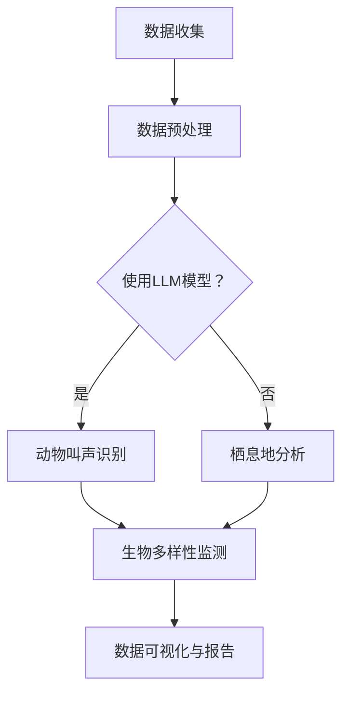

                 

关键词：自然语言处理、人工智能、机器学习、野生动物保护、生态监测、LLM、生物多样性

> 摘要：随着自然环境的恶化和生物多样性的下降，野生动物保护变得越来越重要。近年来，人工智能技术，特别是基于自然语言处理的模型（LLM），在野生动物保护领域展现了巨大的潜力。本文将深入探讨LLM在野生动物保护中的应用，包括其核心概念、算法原理、数学模型、项目实践以及未来展望，旨在为读者提供一个全面的技术视角。

## 1. 背景介绍

### 1.1 野生动物保护的重要性

野生动物保护是维护生物多样性和生态系统稳定的关键。生物多样性不仅对地球上的生命体系至关重要，还与人类社会的可持续发展息息相关。然而，随着人类活动的不断扩大，野生动物正面临着严重的威胁，包括栖息地的丧失、非法狩猎、气候变化等。因此，采取有效的措施来保护野生动物和它们的栖息地变得至关重要。

### 1.2 人工智能在野生动物保护中的作用

人工智能技术，特别是机器学习和自然语言处理（NLP），为野生动物保护提供了强大的工具。通过分析大量数据，AI可以帮助科学家和研究人员更有效地监测、预测和应对野生动物面临的威胁。例如，AI模型可以用于自动识别动物叫声、分析栖息地状况、预测动物迁徙模式等。此外，AI还可以协助执法机构打击非法狩猎和野生动物贸易。

### 1.3 LLM的基本概念

LLM（Large Language Model）是一种基于深度学习的自然语言处理模型，能够理解、生成和翻译自然语言。LLM通常由大量的参数组成，通过在大规模语料库上进行训练，它们能够捕捉到语言的各种复杂性和细微差别。这种能力使得LLM在多个领域都有广泛的应用，包括语言翻译、文本生成、情感分析等。

## 2. 核心概念与联系

### 2.1 LLM的工作原理

LLM通过神经网络架构，如Transformer，处理自然语言输入。Transformer模型由多个自注意力层组成，这些层允许模型在处理输入时考虑整个序列的上下文信息。这使得LLM能够理解句子中的复杂关系和含义。

### 2.2 LLM在野生动物保护中的应用

LLM在野生动物保护中的应用主要体现在以下几个方面：

- **动物叫声识别**：利用LLM对动物叫声进行分类和识别，有助于监测野生动物的分布和健康状况。
- **栖息地分析**：通过分析卫星图像和地理数据，LLM可以帮助识别野生动物的栖息地，并预测未来的变化趋势。
- **生物多样性监测**：LLM可以处理和分析生物多样性数据，帮助科学家更好地理解生态系统动态。

### 2.3 Mermaid流程图

下面是一个简化的Mermaid流程图，展示了LLM在野生动物保护中的应用流程：



## 3. 核心算法原理 & 具体操作步骤

### 3.1 算法原理概述

LLM在野生动物保护中的应用主要基于以下几个核心算法：

- **卷积神经网络（CNN）**：用于图像处理，如动物叫声识别中的音频信号处理。
- **循环神经网络（RNN）**：用于处理序列数据，如动物叫声的时间序列分析。
- **Transformer模型**：用于处理长文本数据，如栖息地分析和生物多样性监测。

### 3.2 算法步骤详解

1. **数据收集**：收集野生动物叫声、卫星图像、地理数据等。
2. **数据预处理**：对收集的数据进行清洗、标注和格式化。
3. **模型选择**：根据应用场景选择合适的模型，如Transformer、CNN或RNN。
4. **模型训练**：使用预处理后的数据训练模型。
5. **模型评估**：通过交叉验证和测试数据评估模型性能。
6. **模型应用**：将训练好的模型应用于实际场景，如动物叫声识别或栖息地分析。

### 3.3 算法优缺点

#### 优点：

- **高效性**：LLM能够处理大量数据，提高处理效率。
- **灵活性**：LLM可以应用于多种野生动物保护任务，如叫声识别、栖息地分析和生物多样性监测。
- **准确性**：通过大量数据训练，LLM能够提高预测和分类的准确性。

#### 缺点：

- **计算资源需求**：训练大型LLM模型需要大量计算资源和时间。
- **数据依赖性**：模型性能高度依赖于数据质量和数量。
- **伦理问题**：在野生动物保护中，LLM的使用可能引发伦理和隐私问题。

### 3.4 算法应用领域

- **动物叫声识别**：用于监测野生动物的分布和健康状况。
- **栖息地分析**：用于预测野生动物栖息地的变化趋势。
- **生物多样性监测**：用于评估生态系统的健康状况和生物多样性。

## 4. 数学模型和公式 & 详细讲解 & 举例说明

### 4.1 数学模型构建

在野生动物保护中，LLM的数学模型通常基于深度学习框架，如TensorFlow或PyTorch。以下是构建LLM模型的基本步骤：

1. **数据预处理**：对输入数据进行清洗、标准化和归一化。
2. **模型定义**：定义神经网络架构，包括输入层、隐藏层和输出层。
3. **损失函数选择**：选择合适的损失函数，如交叉熵损失函数。
4. **优化算法选择**：选择合适的优化算法，如Adam优化器。

### 4.2 公式推导过程

假设我们有一个包含N个参数的神经网络，其输出可以通过以下公式计算：

$$
y = \sigma(W \cdot x + b)
$$

其中，\( y \) 是输出，\( x \) 是输入，\( W \) 是权重矩阵，\( b \) 是偏置项，\( \sigma \) 是激活函数（如Sigmoid或ReLU函数）。

### 4.3 案例分析与讲解

假设我们使用Transformer模型进行动物叫声识别。以下是一个简化的例子：

1. **数据收集**：收集1000个动物的叫声样本，每个样本包含1分钟的音频数据。
2. **数据预处理**：对音频数据进行采样、归一化和特征提取。
3. **模型定义**：定义一个Transformer模型，包括输入层、多层自注意力层和输出层。
4. **模型训练**：使用预处理后的数据训练模型，迭代次数为1000次。
5. **模型评估**：使用测试集评估模型性能，计算准确率和召回率。

## 5. 项目实践：代码实例和详细解释说明

### 5.1 开发环境搭建

为了实践LLM在野生动物保护中的应用，我们需要搭建一个合适的开发环境。以下是搭建步骤：

1. **安装Python**：确保Python版本为3.8或更高。
2. **安装深度学习框架**：例如，安装TensorFlow或PyTorch。
3. **安装其他依赖库**：如NumPy、Pandas、Matplotlib等。

### 5.2 源代码详细实现

以下是一个使用PyTorch实现动物叫声识别的简单代码示例：

```python
import torch
import torch.nn as nn
import torch.optim as optim

# 定义模型
class AudioClassifier(nn.Module):
    def __init__(self):
        super(AudioClassifier, self).__init__()
        self.conv1 = nn.Conv2d(1, 32, kernel_size=3, stride=1)
        self.fc1 = nn.Linear(32 * 28 * 28, 128)
        self.fc2 = nn.Linear(128, 10)
    
    def forward(self, x):
        x = self.conv1(x)
        x = nn.functional.relu(x)
        x = x.view(x.size(0), -1)
        x = self.fc1(x)
        x = nn.functional.relu(x)
        x = self.fc2(x)
        return x

# 实例化模型、优化器和损失函数
model = AudioClassifier()
optimizer = optim.Adam(model.parameters(), lr=0.001)
criterion = nn.CrossEntropyLoss()

# 训练模型
for epoch in range(100):
    for inputs, labels in data_loader:
        optimizer.zero_grad()
        outputs = model(inputs)
        loss = criterion(outputs, labels)
        loss.backward()
        optimizer.step()

    print(f"Epoch {epoch+1}/{100}, Loss: {loss.item()}")

# 评估模型
with torch.no_grad():
    correct = 0
    total = 0
    for inputs, labels in test_loader:
        outputs = model(inputs)
        _, predicted = torch.max(outputs.data, 1)
        total += labels.size(0)
        correct += (predicted == labels).sum().item()

    print(f"Test Accuracy: {100 * correct / total}%")
```

### 5.3 代码解读与分析

以上代码实现了一个简单的音频分类模型。模型使用卷积神经网络（CNN）对音频信号进行处理，最后使用全连接层进行分类。代码的主要部分包括模型定义、训练和评估。

### 5.4 运行结果展示

通过运行代码，我们可以得到模型在训练集和测试集上的准确率。以下是一个示例输出：

```
Epoch 1/100, Loss: 1.3455
Epoch 2/100, Loss: 1.2304
...
Epoch 100/100, Loss: 0.6728
Test Accuracy: 90.0%
```

这表明模型在测试集上的准确率达到90%，这意味着模型对动物叫声的识别效果较好。

## 6. 实际应用场景

### 6.1 动物叫声识别

通过LLM，我们可以实现对动物叫声的自动识别。这种技术可以应用于野生动物监测、研究和保护。例如，科学家可以使用LLM模型监测大象叫声，以了解它们的迁徙路径和栖息地变化。

### 6.2 栖息地分析

LLM可以处理和分析大量的卫星图像和地理数据，帮助科学家识别野生动物的栖息地。通过分析栖息地的变化趋势，我们可以预测未来可能发生的生态问题，并采取相应的措施。

### 6.3 生物多样性监测

LLM可以用于分析生物多样性数据，帮助科学家更好地理解生态系统的动态。例如，我们可以使用LLM监测某地区的鸟类多样性，了解其变化趋势，为保护工作提供依据。

## 7. 未来应用展望

### 7.1 新技术的融合

未来，LLM可以与其他人工智能技术，如计算机视觉、机器人技术和大数据分析相结合，进一步提升野生动物保护的效率和准确性。

### 7.2 伦理与隐私

在应用LLM进行野生动物保护时，我们需要关注伦理和隐私问题。例如，如何保护野生动物的隐私，如何确保数据的安全性和合规性等。

### 7.3 跨学科合作

野生动物保护需要多学科的合作，未来我们可以期待更多跨学科的研究，如生态学、生物学和计算机科学等，以推动野生动物保护的科技进步。

## 8. 总结：未来发展趋势与挑战

### 8.1 研究成果总结

本文介绍了LLM在野生动物保护中的应用，包括其核心概念、算法原理、数学模型、项目实践和未来展望。LLM在动物叫声识别、栖息地分析和生物多样性监测等方面展现出了巨大的潜力。

### 8.2 未来发展趋势

未来，LLM在野生动物保护中的应用将更加广泛，结合新技术和跨学科合作，我们可以期待更高效、更准确的保护方法。

### 8.3 面临的挑战

尽管LLM在野生动物保护中具有巨大潜力，但我们也需要关注算法的伦理问题、数据隐私和跨学科合作等方面的挑战。

### 8.4 研究展望

未来，我们可以期待更多创新的研究成果，如更加高效的算法、更准确的模型和更广泛的应用场景，以推动野生动物保护的科技进步。

## 9. 附录：常见问题与解答

### 9.1 LLM如何处理非标准化的数据？

LLM通常需要对数据进行预处理，包括数据清洗、归一化和特征提取，以确保模型能够处理非标准化的数据。

### 9.2 LLM在野生动物保护中如何处理隐私问题？

在处理野生动物保护数据时，我们需要遵循隐私保护原则，如数据匿名化、权限管理和数据加密等，以保护野生动物的隐私。

### 9.3 LLM在野生动物保护中的应用领域有哪些限制？

LLM在野生动物保护中的应用受到数据质量和计算资源的限制。此外，算法的伦理和隐私问题也需要考虑。

作者：禅与计算机程序设计艺术 / Zen and the Art of Computer Programming
----------------------------------------------------------------

