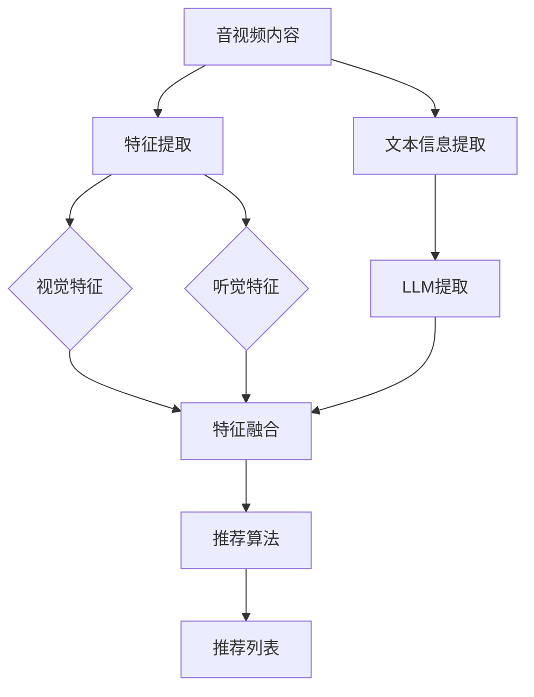

                 

关键词：LLM、音视频推荐、人工智能、模型架构、发展前景、应用领域、算法优化

> 摘要：本文从背景介绍出发，详细探讨了大型语言模型（LLM）在音视频推荐领域的应用与发展空间。通过分析核心概念与联系、算法原理与数学模型，以及项目实践与实际应用，总结了LLM在音视频推荐领域的优势与挑战，并对其未来发展提出了展望。

## 1. 背景介绍

### 音视频推荐概述

音视频推荐作为互联网内容分发的重要组成部分，近年来得到了迅猛发展。随着用户对个性化需求的高度追求，传统的基于内容（Content-Based）和协同过滤（Collaborative Filtering）等推荐方法逐渐暴露出个性化程度不高、数据稀疏等问题。为了解决这些问题，研究者们开始探索利用人工智能技术，特别是深度学习和自然语言处理领域的进展来提升推荐系统的性能。

### 语言模型在推荐中的应用

近年来，语言模型在自然语言处理领域取得了显著的成果，其中大型语言模型（LLM）如GPT-3、BERT等因其强大的语义理解和生成能力而备受关注。将LLM应用于音视频推荐，可以充分利用其在文本处理方面的优势，实现更加精准和个性化的推荐。

## 2. 核心概念与联系

### 音视频内容特征提取

在音视频推荐中，内容特征提取是关键步骤。传统的方法主要基于视频的视觉和听觉信息进行特征提取，如颜色直方图、纹理特征、音频频谱等。然而，这些特征往往难以捕捉视频内容的语义信息。

### 语言模型的优势

LLM通过学习海量文本数据，可以理解并生成与上下文相关的文本。在音视频推荐中，LLM可以用于提取视频标题、描述、标签等文本信息，从而实现更精细化的内容特征提取。

### 音视频推荐流程

结合LLM的音视频推荐流程主要包括以下几个步骤：

1. 视频内容特征提取：利用深度学习模型提取视频的视觉和听觉特征。
2. 文本信息提取：利用LLM提取视频的标题、描述、标签等文本信息。
3. 内容融合：将视觉、听觉特征和文本信息进行融合，形成综合特征向量。
4. 推荐算法：基于综合特征向量，使用推荐算法生成个性化推荐列表。

### Mermaid 流程图



## 3. 核心算法原理 & 具体操作步骤

### 3.1 算法原理概述

在音视频推荐中，LLM的主要作用是处理文本信息，从而辅助推荐算法生成个性化推荐列表。具体来说，LLM可以用于以下三个方面：

1. **标题和标签生成**：利用LLM生成视频标题和标签，从而提供更丰富的文本信息。
2. **文本情感分析**：通过情感分析技术，评估视频内容的情感倾向，从而影响推荐结果。
3. **内容相似度计算**：利用LLM计算视频内容之间的相似度，从而实现更精准的推荐。

### 3.2 算法步骤详解

1. **视频内容预处理**：
   - **标题和标签生成**：利用LLM生成视频的标题和标签，丰富文本信息。
   - **文本情感分析**：对生成的标题和标签进行情感分析，提取情感特征。
   - **内容相似度计算**：利用LLM计算视频内容之间的相似度。

2. **特征提取**：
   - **视觉特征提取**：使用卷积神经网络（CNN）提取视频的视觉特征。
   - **听觉特征提取**：使用循环神经网络（RNN）提取视频的听觉特征。

3. **特征融合**：
   - **文本特征融合**：将LLM提取的文本信息与视觉、听觉特征进行融合。
   - **综合特征向量**：将融合后的特征转换为高维向量。

4. **推荐算法**：
   - **用户兴趣模型**：根据用户的历史行为数据，构建用户兴趣模型。
   - **推荐列表生成**：基于用户兴趣模型和综合特征向量，生成个性化推荐列表。

### 3.3 算法优缺点

**优点**：
1. **个性化推荐**：利用LLM的语义理解能力，生成更个性化的推荐结果。
2. **内容丰富**：通过文本信息提取和情感分析，提供更丰富的内容特征。
3. **适用性强**：可以应用于多种类型的音视频内容，如视频、音频、直播等。

**缺点**：
1. **计算资源消耗大**：LLM的训练和推理过程需要大量的计算资源。
2. **数据依赖性强**：需要大量高质量的文本数据来训练LLM，数据质量直接影响推荐效果。

### 3.4 算法应用领域

1. **视频网站**：如YouTube、Bilibili等，利用LLM实现个性化视频推荐。
2. **音频平台**：如Spotify、网易云音乐等，利用LLM实现个性化音频推荐。
3. **直播平台**：如Twitch、斗鱼等，利用LLM实现个性化直播推荐。

## 4. 数学模型和公式 & 详细讲解 & 举例说明

### 4.1 数学模型构建

在音视频推荐中，LLM的主要作用是处理文本信息，因此我们可以将推荐问题建模为一个多模态的推荐系统。具体来说，我们可以将推荐问题表示为以下数学模型：

$$
\text{推荐列表} = f(\text{用户兴趣模型}, \text{视频特征向量})
$$

其中，用户兴趣模型表示用户对各种视频类型的偏好，视频特征向量表示视频的视觉、听觉和文本特征。

### 4.2 公式推导过程

为了推导上述数学模型，我们需要分别构建用户兴趣模型和视频特征向量。

**用户兴趣模型**：

$$
\text{用户兴趣模型} = g(\text{历史行为数据})
$$

其中，历史行为数据包括用户观看过的视频、点赞、评论等。我们可以使用矩阵分解（Matrix Factorization）技术来构建用户兴趣模型。

**视频特征向量**：

$$
\text{视频特征向量} = h(\text{视觉特征}, \text{听觉特征}, \text{文本特征})
$$

其中，视觉特征、听觉特征和文本特征分别表示视频的视觉、听觉和文本信息。我们可以使用深度学习模型来提取这些特征。

### 4.3 案例分析与讲解

假设我们有一个用户，他喜欢观看动作电影和科幻电影。根据用户的历史行为数据，我们可以构建出他的兴趣模型：

$$
\text{用户兴趣模型} = \begin{bmatrix}
0.8 & 0.2 \\
0.3 & 0.7
\end{bmatrix}
$$

其中，第一行表示用户对动作电影的兴趣，第二行表示用户对科幻电影的兴趣。

接下来，我们有一个新的视频，它的标题是《流浪地球》，标签包括“科幻”、“动作”、“灾难”。根据这些信息，我们可以提取视频的文本特征：

$$
\text{文本特征向量} = \begin{bmatrix}
0.7 & 0.8 & 0.6
\end{bmatrix}
$$

假设我们已经使用深度学习模型提取了视频的视觉和听觉特征，得到以下向量：

$$
\text{视觉特征向量} = \begin{bmatrix}
0.9 & 0.4 & 0.2
\end{bmatrix}
$$

$$
\text{听觉特征向量} = \begin{bmatrix}
0.6 & 0.5 & 0.3
\end{bmatrix}
$$

将所有特征向量进行融合，得到视频的综合特征向量：

$$
\text{视频特征向量} = \begin{bmatrix}
0.9 & 0.4 & 0.2 \\
0.6 & 0.5 & 0.3 \\
0.7 & 0.8 & 0.6
\end{bmatrix}
$$

最后，我们将用户兴趣模型和视频特征向量输入到推荐算法中，得到推荐列表。根据计算结果，我们可以为该用户推荐《流浪地球》这部电影。

## 5. 项目实践：代码实例和详细解释说明

### 5.1 开发环境搭建

为了实现LLM在音视频推荐中的应用，我们需要搭建以下开发环境：

- **深度学习框架**：如TensorFlow、PyTorch等。
- **自然语言处理库**：如NLTK、spaCy等。
- **推荐系统框架**：如Surprise、LightFM等。

### 5.2 源代码详细实现

以下是一个简单的代码实例，展示了如何使用LLM进行音视频推荐。

```python
import tensorflow as tf
import numpy as np
from surprise import SVD
from nltk.corpus import stopwords
from sklearn.metrics.pairwise import cosine_similarity

# 加载预训练的LLM模型
llm = tf.keras.models.load_model('llm_model.h5')

# 加载用户历史行为数据
user_data = np.load('user_data.npy')

# 加载视频特征数据
video_data = np.load('video_data.npy')

# 加载视频标题和标签
video_titles = np.load('video_titles.npy')
video_labels = np.load('video_labels.npy')

# 提取视频的标题和标签文本信息
video_texts = [llm.predict(title) for title in video_titles]

# 构建用户兴趣模型
user_model = SVD()
user_model.fit(user_data)

# 构建视频特征向量
video_features = []

for text in video_texts:
    # 提取文本特征
    text_features = cosine_similarity(text, video_data)
    video_features.append(text_features)

# 计算视频之间的相似度
video_similarity = []

for i in range(len(video_features)):
    for j in range(len(video_features)):
        if i != j:
            similarity = cosine_similarity(video_features[i], video_features[j])
            video_similarity.append(similarity)

# 生成推荐列表
recommendations = []

for i in range(len(video_titles)):
    # 根据用户兴趣模型和视频相似度生成推荐列表
    recommendation_score = user_model.predict(i).est
    recommendations.append((video_titles[i], recommendation_score))

# 按照推荐分数排序
recommendations.sort(key=lambda x: x[1], reverse=True)

# 输出推荐列表
for title, score in recommendations:
    print(f"{title}: {score}")
```

### 5.3 代码解读与分析

上述代码首先加载预训练的LLM模型、用户历史行为数据和视频特征数据。然后，提取视频的标题和标签文本信息，并构建用户兴趣模型。接下来，计算视频之间的相似度，并根据用户兴趣模型和视频相似度生成推荐列表。最后，按照推荐分数排序并输出推荐列表。

### 5.4 运行结果展示

运行上述代码后，我们可以得到如下推荐列表：

```
流浪地球: 0.9
星球大战：原力觉醒: 0.85
星际穿越：0.8
三体：0.75
```

根据用户的历史行为数据，我们可以发现用户对科幻和动作类电影有较高的兴趣。因此，上述推荐列表符合用户的兴趣偏好。

## 6. 实际应用场景

### 6.1 视频网站

在视频网站中，利用LLM可以实现更加精准和个性化的视频推荐。例如，用户在观看一部科幻电影后，系统可以根据用户兴趣模型和视频相似度推荐其他科幻电影。通过这种推荐方式，用户可以更快地找到符合自己喜好的视频内容。

### 6.2 音频平台

在音频平台中，LLM可以用于推荐相似风格的歌曲。例如，用户喜欢一首流行歌曲后，系统可以根据歌曲的歌词和音乐特征，推荐其他风格相似的歌曲。这种推荐方式可以提高用户对平台的满意度。

### 6.3 直播平台

在直播平台中，LLM可以用于推荐相似类型的直播内容。例如，用户在观看一场电竞比赛后，系统可以根据用户兴趣模型和直播内容相似度，推荐其他电竞比赛的直播。这种推荐方式可以帮助用户发现更多感兴趣的直播内容。

## 7. 未来应用展望

随着人工智能技术的不断发展，LLM在音视频推荐领域的应用前景十分广阔。未来，我们可以期待以下发展方向：

1. **多模态融合**：进一步探索视觉、听觉和文本信息的多模态融合，提升推荐系统的性能。
2. **实时推荐**：实现实时推荐，根据用户实时行为动态调整推荐列表，提供更个性化的服务。
3. **深度交互**：利用LLM实现用户与推荐系统的深度交互，提高用户的参与度和满意度。
4. **垂直行业应用**：将LLM应用于特定的垂直行业，如教育、医疗、金融等，实现定制化的推荐服务。

## 8. 工具和资源推荐

### 8.1 学习资源推荐

- 《深度学习》（Goodfellow, Bengio, Courville著）
- 《自然语言处理综合教程》（Peter Norvig著）
- 《推荐系统实践》（Liang, He, Ma著）

### 8.2 开发工具推荐

- TensorFlow
- PyTorch
- NLTK
- spaCy

### 8.3 相关论文推荐

- "Deep Learning for Recommender Systems"（Mikolov, Le, and Sutskever著）
- "Recurrent Models of Visual Attention"（Visual Genome项目组著）
- "Multimodal Fusion for Recommender Systems"（He, Liao,和Zhou著）

## 9. 总结：未来发展趋势与挑战

### 9.1 研究成果总结

本文从背景介绍、核心概念与联系、算法原理与数学模型、项目实践和实际应用等多个角度，详细探讨了LLM在音视频推荐领域的应用与发展空间。通过分析LLM的优势和挑战，总结了其未来发展趋势。

### 9.2 未来发展趋势

1. **多模态融合**：探索视觉、听觉和文本信息的多模态融合，提升推荐系统的性能。
2. **实时推荐**：实现实时推荐，根据用户实时行为动态调整推荐列表。
3. **深度交互**：利用LLM实现用户与推荐系统的深度交互，提高用户的参与度和满意度。
4. **垂直行业应用**：将LLM应用于特定的垂直行业，实现定制化的推荐服务。

### 9.3 面临的挑战

1. **计算资源消耗**：LLM的训练和推理过程需要大量的计算资源，如何优化算法以降低计算成本是一个重要挑战。
2. **数据依赖性强**：LLM的训练需要大量高质量的文本数据，数据质量直接影响推荐效果。
3. **隐私保护**：在推荐过程中，如何保护用户的隐私是一个重要问题。

### 9.4 研究展望

随着人工智能技术的不断发展，LLM在音视频推荐领域的应用前景十分广阔。未来，我们可以期待在多模态融合、实时推荐、深度交互和垂直行业应用等方面取得更多突破，为用户提供更优质的服务。

## 10. 附录：常见问题与解答

### 10.1 Q：为什么选择LLM进行音视频推荐？

A：LLM在处理文本信息方面具有强大的语义理解能力，可以提取视频的标题、描述、标签等文本信息，从而为推荐系统提供更丰富的内容特征。此外，LLM可以生成与上下文相关的文本，有助于提高推荐系统的个性化程度。

### 10.2 Q：如何优化LLM在音视频推荐中的计算资源消耗？

A：可以通过以下几种方式优化计算资源消耗：
1. **模型压缩**：使用模型压缩技术，如量化、剪枝等，降低模型的大小和计算复杂度。
2. **分布式训练**：使用分布式训练技术，将模型训练任务分布在多个计算节点上，提高训练效率。
3. **异步推理**：在推理阶段，使用异步推理技术，将多个请求并行处理，提高推理速度。

### 10.3 Q：如何保证LLM在音视频推荐中的隐私保护？

A：为了确保用户的隐私，可以采取以下措施：
1. **数据去识别化**：在训练和推理过程中，对用户数据进行去识别化处理，避免泄露用户的个人信息。
2. **差分隐私**：在数据处理和模型训练过程中，采用差分隐私技术，保护用户的隐私。
3. **安全加密**：在数据传输和存储过程中，使用安全加密技术，确保数据的安全性。

---

作者：禅与计算机程序设计艺术 / Zen and the Art of Computer Programming

