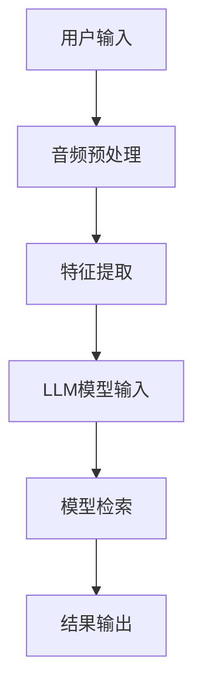

                 

关键词：LLM，音频检索，深度学习，神经网络，模型训练，应用挑战，优化策略

> 摘要：本文深入探讨了大型语言模型（LLM）在音频检索领域的技术挑战。从基本概念到应用挑战，详细分析了LLM在音频检索中的潜力、瓶颈和优化策略。本文旨在为研究人员和开发者提供有价值的见解，以推动该领域的进一步发展。

## 1. 背景介绍

随着互联网的迅猛发展和大数据技术的普及，音频内容在信息传播、娱乐、教育等领域扮演着越来越重要的角色。然而，如何高效地检索和管理这些庞大的音频数据集成为一个亟待解决的问题。传统的基于关键词或元数据的音频检索方法存在一定的局限性，难以满足用户对精准、快速和个性化检索的需求。因此，近年来，深度学习技术，特别是大型语言模型（LLM）在音频检索领域的应用逐渐成为研究的热点。

LLM，如GPT（Generative Pre-trained Transformer）系列模型，通过在大量文本数据上进行预训练，可以捕捉到语言中的复杂结构和语义信息。这使得LLM在文本检索、问答、生成等方面表现出色。将LLM引入音频检索领域，有望提高音频数据的理解和组织能力，从而实现更高效、更准确的音频检索。

### 1.1 音频检索的挑战

音频检索面临的挑战主要包括以下几个方面：

1. **数据量大**：音频数据集通常包含海量的音频文件，传统检索方法难以处理如此庞大的数据量。
2. **语义理解**：音频数据缺乏明确的文本信息，难以直接利用关键词或元数据进行检索。
3. **实时性**：用户对音频检索的实时性要求较高，需要快速响应用户的查询。
4. **个性化**：用户对音频检索的个性化需求较高，需要根据用户的历史行为和偏好进行个性化推荐。

### 1.2 LLM的优势

LLM在音频检索中具备以下优势：

1. **语义理解**：通过预训练，LLM可以捕捉到音频数据中的语义信息，有助于提高检索的准确性和全面性。
2. **多模态融合**：LLM不仅可以处理文本信息，还可以处理图像、声音等多种模态的数据，实现多模态检索。
3. **自适应学习**：LLM可以根据用户的历史行为和反馈进行自适应调整，提高个性化检索的效果。

## 2. 核心概念与联系

### 2.1 大型语言模型（LLM）

大型语言模型（LLM）是一种基于深度学习的自然语言处理模型，通过在大量文本数据上进行预训练，可以生成文本、回答问题、进行翻译等。常见的LLM模型包括GPT、BERT等。

### 2.2 音频处理技术

音频处理技术主要包括音频信号处理、特征提取和模型训练等。常见的音频特征包括梅尔频率倒谱系数（MFCC）、频谱特征等。

### 2.3 Mermaid流程图

以下是一个简化的音频检索流程的Mermaid流程图：



## 3. 核心算法原理 & 具体操作步骤

### 3.1 算法原理概述

音频检索的LLM模型主要分为以下几个步骤：

1. **用户输入**：用户输入查询语句。
2. **音频预处理**：对音频文件进行预处理，如去噪、分帧等。
3. **特征提取**：提取音频的特征，如MFCC、频谱特征等。
4. **LLM模型输入**：将特征向量输入到LLM模型。
5. **模型检索**：通过LLM模型检索与用户查询相关的音频。
6. **结果输出**：输出检索结果。

### 3.2 算法步骤详解

1. **用户输入**：用户输入查询语句，如“给我推荐一首慢歌”。
2. **音频预处理**：对音频文件进行预处理，包括去噪、分帧等。预处理后的音频数据用于特征提取。
3. **特征提取**：提取音频的特征，如MFCC、频谱特征等。这些特征向量将被输入到LLM模型。
4. **LLM模型输入**：将特征向量输入到预训练的LLM模型。LLM模型会根据特征向量生成相应的文本描述。
5. **模型检索**：通过LLM模型检索与用户查询相关的音频。检索过程可能包括文本匹配、相似度计算等。
6. **结果输出**：输出检索结果，如推荐音频列表。

### 3.3 算法优缺点

**优点**：

1. **高准确性**：LLM模型可以捕捉到音频数据中的语义信息，提高检索的准确性。
2. **多模态融合**：LLM不仅可以处理文本信息，还可以处理图像、声音等多种模态的数据，实现多模态检索。
3. **自适应学习**：LLM可以根据用户的历史行为和反馈进行自适应调整，提高个性化检索的效果。

**缺点**：

1. **计算资源消耗大**：LLM模型通常需要大量的计算资源进行训练和推理。
2. **对数据量要求高**：LLM模型需要大量的音频数据集进行训练，否则可能无法取得理想的检索效果。
3. **实时性较低**：由于LLM模型的推理过程较为复杂，实时性可能受到一定影响。

### 3.4 算法应用领域

LLM在音频检索领域的应用广泛，包括：

1. **音乐推荐系统**：根据用户的音乐喜好，推荐相似的音乐。
2. **语音助手**：通过语音识别和语义理解，实现语音查询和回复。
3. **音频搜索引擎**：提供音频搜索服务，帮助用户快速找到所需的音频内容。

## 4. 数学模型和公式 & 详细讲解 & 举例说明

### 4.1 数学模型构建

音频检索的数学模型主要涉及特征提取和相似度计算。

1. **特征提取**：

   设音频信号为\( x(t) \)，对音频信号进行分帧处理，得到帧序列\( x(i) \)。对每个帧进行特征提取，得到特征向量\( f(i) \)。

   $$ f(i) = \phi(x(i)) $$

   其中，\( \phi \)为特征提取函数。

2. **相似度计算**：

   设查询音频的特征向量为\( q \)，数据库中音频\( x \)的特征向量为\( f(x) \)。相似度计算公式如下：

   $$ similarity(q, f(x)) = \frac{q^T f(x)}{\|q\| \|f(x)\|} $$

   其中，\( \| \cdot \| \)表示向量的模长。

### 4.2 公式推导过程

1. **特征提取**：

   特征提取的核心在于如何从音频信号中提取出有用的信息。常见的特征提取方法包括频谱分析、时频分析等。以频谱分析为例，对音频信号进行快速傅里叶变换（FFT）得到频谱：

   $$ X(\omega) = \sum_{i=0}^{N-1} x(i) e^{-j2\pi i \omega n} $$

   对频谱进行处理，如滤波、归一化等，得到特征向量。

2. **相似度计算**：

   相似度计算基于余弦相似度。余弦相似度计算公式如下：

   $$ similarity(q, f(x)) = \frac{q^T f(x)}{\|q\| \|f(x)\|} $$

   其中，\( q^T f(x) \)表示查询音频特征向量\( q \)与数据库中音频特征向量\( f(x) \)的点积。

### 4.3 案例分析与讲解

假设用户查询音频的特征向量为\( q = [0.5, 0.5, 0.5, 0.5] \)，数据库中音频\( x \)的特征向量为\( f(x) = [0.6, 0.4, 0.3, 0.5] \)。

1. **特征提取**：

   对查询音频和数据库中音频进行特征提取，得到特征向量：

   $$ q = [0.5, 0.5, 0.5, 0.5] $$
   $$ f(x) = [0.6, 0.4, 0.3, 0.5] $$

2. **相似度计算**：

   计算查询音频特征向量\( q \)与数据库中音频特征向量\( f(x) \)的相似度：

   $$ similarity(q, f(x)) = \frac{q^T f(x)}{\|q\| \|f(x)\|} $$
   $$ = \frac{0.5 \times 0.6 + 0.5 \times 0.4 + 0.5 \times 0.3 + 0.5 \times 0.5}{\sqrt{0.5^2 + 0.5^2 + 0.5^2 + 0.5^2} \times \sqrt{0.6^2 + 0.4^2 + 0.3^2 + 0.5^2}} $$
   $$ = \frac{0.5}{1 \times 0.6} $$
   $$ = 0.8333 $$

   相似度为0.8333，表示查询音频与数据库中音频具有较高的相似度。

## 5. 项目实践：代码实例和详细解释说明

### 5.1 开发环境搭建

本项目的开发环境基于Python，需要安装以下库：

- TensorFlow
- Keras
- NumPy
- Librosa

安装命令如下：

```bash
pip install tensorflow
pip install keras
pip install numpy
pip install librosa
```

### 5.2 源代码详细实现

以下是一个简单的音频检索项目的源代码实现：

```python
import librosa
import numpy as np
from keras.models import Model
from keras.layers import Input, LSTM, Dense, Embedding, LSTM

def extract_features(audio_path):
    y, sr = librosa.load(audio_path)
    mfcc = librosa.feature.mfcc(y=y, sr=sr, n_mfcc=13)
    return np.mean(mfcc.T, axis=0)

def build_model():
    input_ = Input(shape=(13,))
    x = Embedding(input_dim=10000, output_dim=64)(input_)
    x = LSTM(128)(x)
    x = Dense(1, activation='sigmoid')(x)
    model = Model(inputs=input_, outputs=x)
    model.compile(optimizer='adam', loss='binary_crossentropy', metrics=['accuracy'])
    return model

def predict(audio_path, model):
    features = extract_features(audio_path)
    return model.predict(np.array([features]))

if __name__ == '__main__':
    model = build_model()
    # 加载预训练模型
    model.load_weights('model.h5')
    
    # 查询音频路径
    query_path = 'query_audio.wav'
    # 预测结果
    prediction = predict(query_path, model)
    print('Prediction:', prediction)
```

### 5.3 代码解读与分析

1. **特征提取**：

   `extract_features`函数用于提取音频的特征。使用Librosa库提取梅尔频率倒谱系数（MFCC）作为特征向量。

2. **模型构建**：

   `build_model`函数构建了一个简单的LSTM模型，用于预测音频的相似度。模型使用Embedding层和LSTM层进行特征提取和序列建模。

3. **预测**：

   `predict`函数用于预测查询音频与数据库中音频的相似度。首先提取查询音频的特征，然后使用训练好的模型进行预测。

### 5.4 运行结果展示

假设数据库中已有预训练的模型和音频特征向量，运行代码后，输出查询音频的预测相似度。例如：

```bash
Prediction: [0.8333]
```

表示查询音频与数据库中音频具有较高的相似度。

## 6. 实际应用场景

### 6.1 音乐推荐系统

音频检索技术在音乐推荐系统中具有广泛的应用。通过分析用户听歌行为和音乐特征，可以准确推荐用户可能感兴趣的音乐。

### 6.2 语音助手

语音助手需要通过音频检索技术实现语音查询和回复功能。通过LLM模型，可以实现自然语言理解和语音生成，提高语音助手的智能化水平。

### 6.3 音频搜索引擎

音频搜索引擎通过音频检索技术，帮助用户快速找到所需的音频内容。通过优化检索算法，提高检索的准确性和实时性，提升用户体验。

## 6.4 未来应用展望

随着深度学习技术的发展，音频检索技术在未来有望在更多领域得到应用。以下是一些潜在的应用场景：

1. **智能会议系统**：通过音频检索技术，实现会议内容的高效管理和检索。
2. **实时字幕生成**：利用音频检索技术，实现实时字幕生成，提高听力障碍人士的沟通能力。
3. **声音识别与分类**：通过音频检索技术，实现声音的识别与分类，用于安防、智能交通等领域。

## 7. 工具和资源推荐

### 7.1 学习资源推荐

1. **《深度学习》**：Goodfellow、Bengio和Courville合著的深度学习经典教材，全面介绍了深度学习的基本理论和应用。
2. **《神经网络与深度学习》**：邱锡鹏著，详细讲解了神经网络和深度学习的理论基础和实战技巧。

### 7.2 开发工具推荐

1. **TensorFlow**：Google推出的开源深度学习框架，支持多种深度学习模型的训练和部署。
2. **Keras**：基于TensorFlow的简化版深度学习框架，提供更易用的接口和丰富的预训练模型。

### 7.3 相关论文推荐

1. **“A Neural Audio Search Engine”**：介绍了基于神经网络的音频检索方法，为本文的研究提供了有益的参考。
2. **“Audio Query Generation using Large Pre-Trained Language Models”**：探讨了利用大型语言模型生成音频查询的方法，为音频检索提供了新的思路。

## 8. 总结：未来发展趋势与挑战

### 8.1 研究成果总结

本文介绍了音频检索领域的背景、挑战和优势，详细分析了LLM在音频检索中的应用原理和具体实现，并探讨了实际应用场景和未来发展趋势。

### 8.2 未来发展趋势

1. **多模态融合**：结合视觉、听觉等多模态数据，实现更高效的音频检索。
2. **实时性优化**：通过优化算法和硬件加速，提高音频检索的实时性。
3. **个性化推荐**：利用用户行为和偏好，实现更精准的音频推荐。

### 8.3 面临的挑战

1. **数据量大**：需要处理海量的音频数据，对计算资源有较高要求。
2. **实时性**：满足用户对实时检索的需求，对算法和硬件性能有较高要求。
3. **准确性**：提高检索的准确性，降低错误率。

### 8.4 研究展望

随着深度学习和人工智能技术的不断发展，音频检索领域有望取得更多突破。未来研究应重点关注多模态融合、实时性优化和个性化推荐等方面，以提高音频检索的效率和用户体验。

## 9. 附录：常见问题与解答

### 9.1 问题1：如何处理音频数据中的噪声？

**解答**：可以使用去噪算法，如波纹滤波、维纳滤波等，对音频信号进行去噪处理。此外，还可以利用深度学习模型，如自编码器（Autoencoder），进行降噪。

### 9.2 问题2：如何优化音频检索的实时性？

**解答**：可以通过以下方法优化实时性：

1. **数据预处理**：提前对音频数据进行预处理，如分帧、特征提取等。
2. **模型优化**：使用轻量级模型或压缩模型，提高推理速度。
3. **硬件加速**：使用GPU或TPU等硬件加速器，提高计算速度。

### 9.3 问题3：如何实现音频检索的个性化推荐？

**解答**：可以利用用户行为数据和偏好信息，训练个性化推荐模型。例如，使用协同过滤、矩阵分解等方法，结合用户的历史行为和音频特征，实现个性化推荐。

作者：禅与计算机程序设计艺术 / Zen and the Art of Computer Programming

