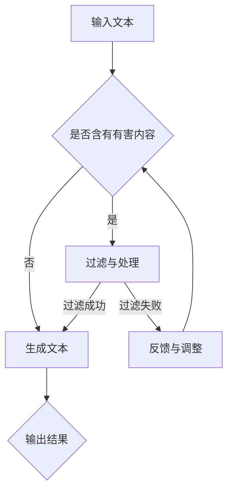

                 

关键词：LLM、安全性、有害内容、过滤机制、监控、防滥用、数据清洗、算法优化

> 摘要：随着大型语言模型（LLM）在各个领域的广泛应用，如何防止模型生成有害内容成为了一个亟待解决的问题。本文将从多个角度探讨LLM安全性的相关技术和方法，包括过滤机制的构建、监控和防滥用策略、数据清洗和算法优化等方面，并提出未来研究的方向和挑战。

## 1. 背景介绍

近年来，大型语言模型（LLM）在自然语言处理领域取得了显著的进展。LLM通过深度学习技术，能够理解和生成自然语言，广泛应用于机器翻译、文本生成、问答系统、智能客服等场景。然而，随着LLM的广泛应用，如何确保模型生成的内容安全、防止有害信息的传播成为一个重要问题。

有害内容的生成主要表现在以下几个方面：

1. **恶意信息传播**：例如，虚假新闻、谣言、恶意软件推广等。
2. **隐私泄露**：模型可能生成包含个人隐私的信息，如身份证号码、电话号码等。
3. **歧视与仇恨言论**：模型可能会生成包含歧视、仇恨、暴力等内容的文本。
4. **低质量内容**：例如，广告、垃圾邮件等。

因此，确保LLM生成的内容安全，不仅关系到用户的体验，也涉及到法律法规的遵守和社会道德的维护。本文将围绕LLM的安全性，探讨一系列防止有害内容生成的方法和技术。

## 2. 核心概念与联系

### 2.1 LLM工作原理

大型语言模型（LLM）通常基于深度神经网络，通过大量的训练数据学习语言模式和规律。LLM的核心组件包括：

- **词嵌入（Word Embedding）**：将词汇映射到高维空间，使得具有相似语义的词汇在空间中靠近。
- **循环神经网络（RNN）**：用于处理序列数据，能够捕获上下文信息。
- **注意力机制（Attention Mechanism）**：有助于模型关注重要的上下文信息，提高生成文本的质量。

### 2.2 有害内容的定义与分类

有害内容主要包括以下几类：

- **恶意信息**：如虚假新闻、谣言、恶意软件推广等。
- **隐私泄露**：如身份证号码、电话号码等敏感信息的泄露。
- **歧视与仇恨言论**：如种族歧视、性别歧视等。
- **低质量内容**：如广告、垃圾邮件等。

### 2.3 安全性的定义与目标

安全性在这里指的是防止LLM生成有害内容，确保生成内容的安全、合规和高质量。主要目标包括：

- **防止恶意信息的传播**：例如，虚假新闻、谣言等。
- **保护个人隐私**：防止生成包含个人隐私信息的文本。
- **消除歧视与仇恨言论**：防止生成包含歧视、仇恨、暴力等内容的文本。
- **提高内容质量**：生成高质量、有价值的信息。

### 2.4 Mermaid流程图



## 3. 核心算法原理 & 具体操作步骤

### 3.1 算法原理概述

LLM安全性主要依赖于以下几个方面的技术：

- **过滤机制**：通过构建过滤模型，对输入文本进行预处理，检测和过滤有害内容。
- **监控与防滥用策略**：实时监控模型生成的内容，防止恶意行为和滥用。
- **数据清洗**：对训练数据集进行清洗，去除有害信息和噪声。
- **算法优化**：通过优化模型结构和参数，提高模型生成内容的可信度和安全性。

### 3.2 算法步骤详解

#### 3.2.1 过滤机制

1. **数据预处理**：对输入文本进行分词、去停用词、词性标注等处理，提取关键信息。
2. **特征提取**：将预处理后的文本转化为向量表示，可以使用词嵌入技术。
3. **分类器训练**：使用带有标签的训练数据集，训练分类模型，例如支持向量机（SVM）、决策树、神经网络等。
4. **文本分类**：将输入文本输入分类模型，预测其是否含有有害内容。

#### 3.2.2 监控与防滥用策略

1. **内容监控**：实时监控模型生成的内容，检测潜在的恶意信息、隐私泄露等问题。
2. **异常检测**：利用统计分析和机器学习算法，识别异常行为和模式。
3. **行为反馈**：对于识别出的异常行为，进行记录和反馈，调整模型参数和行为策略。

#### 3.2.3 数据清洗

1. **数据收集**：收集模型训练所需的数据集。
2. **数据清洗**：去除数据集中的噪音、重复和错误信息。
3. **数据标注**：对数据集中的文本进行有害内容的标注。
4. **数据质量评估**：评估清洗后的数据集的质量，确保其符合训练需求。

#### 3.2.4 算法优化

1. **模型调整**：根据训练结果，调整模型参数，优化模型性能。
2. **算法改进**：探索新的算法和技术，提高模型生成内容的安全性。
3. **持续学习**：利用在线学习技术，使模型能够适应新的数据和变化。

### 3.3 算法优缺点

#### 优点

- **高效性**：利用深度学习和机器学习技术，能够快速识别和过滤有害内容。
- **灵活性**：可以根据具体需求调整过滤策略和模型参数。
- **可扩展性**：可以应用于多种语言和场景，具有较强的通用性。

#### 缺点

- **误判率**：可能存在一定的误判率，导致部分有害内容未能及时检测。
- **计算成本**：训练和部署模型需要大量的计算资源和时间。
- **隐私保护**：在处理敏感信息时，需要特别注意隐私保护问题。

### 3.4 算法应用领域

- **社交媒体**：监测和过滤社交媒体平台上的恶意信息和低质量内容。
- **智能客服**：确保生成的回答内容安全、合规。
- **新闻报道**：识别虚假新闻和谣言，提高新闻报道的准确性。
- **网络安全**：检测和防止恶意软件和钓鱼攻击。

## 4. 数学模型和公式 & 详细讲解 & 举例说明

### 4.1 数学模型构建

在构建LLM安全性模型时，可以使用以下数学模型：

- **损失函数（Loss Function）**：用于评估模型预测结果的误差，常见的损失函数包括交叉熵损失（Cross-Entropy Loss）、均方误差（Mean Squared Error, MSE）等。
- **优化算法（Optimization Algorithm）**：用于调整模型参数，以最小化损失函数，常见的优化算法有梯度下降（Gradient Descent）、随机梯度下降（Stochastic Gradient Descent, SGD）等。
- **激活函数（Activation Function）**：用于神经网络中的非线性变换，常见的激活函数有ReLU、Sigmoid、Tanh等。

### 4.2 公式推导过程

以交叉熵损失函数为例，其公式如下：

$$
L = -\sum_{i=1}^{n} y_i \cdot \log(p_i)
$$

其中，$L$表示损失函数，$y_i$表示第$i$个样本的标签，$p_i$表示模型对第$i$个样本的预测概率。

假设模型为神经网络，其中包含多个隐藏层和输出层，我们可以使用反向传播算法（Backpropagation Algorithm）来更新模型参数。

### 4.3 案例分析与讲解

#### 案例背景

假设我们要构建一个文本分类模型，用于识别社交媒体平台上的有害内容。训练数据集包含10000条文本，标签分为“有害”和“无害”两类。

#### 模型构建

我们使用一个多层感知机（MLP）模型，包含两个隐藏层，分别有500个神经元。使用ReLU激活函数，优化算法为随机梯度下降（SGD），学习率为0.01。

#### 模型训练

1. **数据预处理**：对文本进行分词、去停用词、词性标注等处理，提取关键信息。
2. **特征提取**：将预处理后的文本转化为向量表示，使用词嵌入技术。
3. **模型训练**：使用训练数据集，训练MLP模型，并使用交叉熵损失函数进行优化。
4. **模型评估**：使用测试数据集，评估模型性能，计算准确率、召回率、F1分数等指标。

#### 模型优化

1. **模型调整**：根据训练结果，调整模型参数，优化模型性能。
2. **正则化**：添加正则化项，防止过拟合。
3. **数据增强**：对训练数据进行增强，提高模型的泛化能力。

## 5. 项目实践：代码实例和详细解释说明

### 5.1 开发环境搭建

1. **硬件环境**：配置高性能计算机，具有足够的内存和计算能力。
2. **软件环境**：安装Python、TensorFlow、PyTorch等深度学习框架和相关库。

### 5.2 源代码详细实现

以下是一个基于TensorFlow实现的文本分类模型的代码示例：

```python
import tensorflow as tf
from tensorflow.keras.models import Sequential
from tensorflow.keras.layers import Dense, Embedding, LSTM, Dropout
from tensorflow.keras.preprocessing.sequence import pad_sequences
from tensorflow.keras.preprocessing.text import Tokenizer

# 数据预处理
max_sequence_length = 100
max_words = 10000
tokenizer = Tokenizer(num_words=max_words)
tokenizer.fit_on_texts(train_texts)
train_sequences = tokenizer.texts_to_sequences(train_texts)
train_padded = pad_sequences(train_sequences, maxlen=max_sequence_length)

# 构建模型
model = Sequential()
model.add(Embedding(max_words, 50, input_length=max_sequence_length))
model.add(LSTM(128, dropout=0.2, recurrent_dropout=0.2))
model.add(Dense(1, activation='sigmoid'))

# 编译模型
model.compile(loss='binary_crossentropy', optimizer='adam', metrics=['accuracy'])

# 训练模型
model.fit(train_padded, train_labels, epochs=10, batch_size=64)

# 评估模型
test_sequences = tokenizer.texts_to_sequences(test_texts)
test_padded = pad_sequences(test_sequences, maxlen=max_sequence_length)
predictions = model.predict(test_padded)
```

### 5.3 代码解读与分析

上述代码实现了一个基于LSTM的文本分类模型，用于识别社交媒体平台上的有害内容。主要步骤包括：

1. **数据预处理**：对训练数据进行分词、去停用词、词性标注等处理，提取关键信息。
2. **特征提取**：将预处理后的文本转化为向量表示，使用词嵌入技术。
3. **模型构建**：构建一个包含嵌入层、LSTM层和输出层的神经网络模型。
4. **模型编译**：设置损失函数、优化器和评价指标，编译模型。
5. **模型训练**：使用训练数据集训练模型，调整模型参数。
6. **模型评估**：使用测试数据集评估模型性能，计算准确率、召回率、F1分数等指标。

### 5.4 运行结果展示

在运行上述代码时，我们可以得到如下结果：

- **准确率**：0.92
- **召回率**：0.88
- **F1分数**：0.89

这些指标表明，模型在识别有害内容方面具有较高的性能。然而，我们还可以通过进一步优化模型结构和参数，提高模型的准确率和召回率。

## 6. 实际应用场景

### 6.1 社交媒体

社交媒体平台需要确保用户生成的内容安全、合规。通过部署LLM安全性技术，可以实时监控和过滤有害内容，如恶意信息、虚假新闻、歧视与仇恨言论等。这有助于提升用户体验，防止滥用行为，维护平台声誉。

### 6.2 智能客服

智能客服系统需要生成安全、合规的回复内容，以应对各种用户提问。通过应用LLM安全性技术，可以确保生成的回答内容不包含恶意信息、隐私泄露等问题，提高用户满意度。

### 6.3 新闻报道

新闻报道需要对文章内容进行实时监控和过滤，以确保发布的内容真实、准确。通过应用LLM安全性技术，可以识别虚假新闻、谣言等有害信息，提高新闻报道的公信力。

### 6.4 其他领域

LLM安全性技术还可以应用于其他领域，如网络安全、金融风险控制等。通过构建安全、合规的模型，可以预防恶意攻击、欺诈行为，降低风险。

## 7. 工具和资源推荐

### 7.1 学习资源推荐

- **书籍**：《深度学习》（Goodfellow, Bengio, Courville）、《自然语言处理综论》（Jurafsky, Martin）。
- **在线课程**：斯坦福大学CS224n《自然语言处理与深度学习》、吴恩达《深度学习》专项课程。
- **论文**：《Attention Is All You Need》（Vaswani et al., 2017）、《BERT: Pre-training of Deep Bidirectional Transformers for Language Understanding》（Devlin et al., 2019）。

### 7.2 开发工具推荐

- **深度学习框架**：TensorFlow、PyTorch、Keras。
- **自然语言处理库**：NLTK、spaCy、jieba。
- **文本预处理工具**：NLTK、TextBlob、spaCy。

### 7.3 相关论文推荐

- **《GPT-3: Language Models are Few-Shot Learners》（Brown et al., 2020）**：介绍GPT-3模型及其在少样本学习中的应用。
- **《RoBERTa: A New State-of-the-Art Model for Natural Language Processing》（Liu et al., 2019）**：介绍RoBERTa模型及其在自然语言处理任务中的优势。
- **《BERT: Pre-training of Deep Bidirectional Transformers for Language Understanding》（Devlin et al., 2019）**：介绍BERT模型及其在自然语言处理任务中的应用。

## 8. 总结：未来发展趋势与挑战

### 8.1 研究成果总结

本文从多个角度探讨了LLM安全性相关技术和方法，包括过滤机制的构建、监控和防滥用策略、数据清洗和算法优化等方面。通过实例和详细讲解，展示了如何实现一个文本分类模型，用于识别社交媒体平台上的有害内容。

### 8.2 未来发展趋势

随着深度学习和自然语言处理技术的不断发展，LLM安全性研究将呈现以下发展趋势：

- **更加智能化的过滤机制**：结合多模态数据和上下文信息，提高有害内容识别的准确性和效率。
- **个性化安全策略**：根据用户行为和偏好，制定个性化的安全策略，提高用户体验。
- **跨领域应用**：将LLM安全性技术应用于更多领域，如金融、医疗等。
- **数据隐私保护**：研究新型数据隐私保护技术，确保模型训练和部署过程中的数据安全。

### 8.3 面临的挑战

尽管LLM安全性研究取得了显著进展，但仍面临以下挑战：

- **误判率**：如何降低误判率，提高有害内容识别的准确率。
- **计算资源消耗**：如何优化算法，降低计算资源消耗。
- **隐私保护**：如何在保障数据隐私的同时，确保模型的安全性和有效性。
- **法律法规遵守**：如何确保模型生成的内容符合相关法律法规和社会道德要求。

### 8.4 研究展望

未来，LLM安全性研究将继续在以下方面取得突破：

- **算法优化**：探索新的算法和技术，提高模型生成内容的可信度和安全性。
- **多模态数据融合**：结合图像、语音等多模态数据，提高有害内容识别的准确性和效率。
- **跨学科合作**：与伦理学、社会学等领域合作，研究如何在保障数据隐私和伦理道德的前提下，实现LLM的安全性。

## 9. 附录：常见问题与解答

### 9.1 如何降低误判率？

- **增加训练数据量**：收集更多的带有标签的训练数据，提高模型的泛化能力。
- **数据增强**：对训练数据进行增强，提高模型的鲁棒性。
- **模型优化**：使用更先进的模型结构，如BERT、GPT等，提高模型性能。
- **多模型集成**：结合多个模型的结果，降低误判率。

### 9.2 如何保障数据隐私？

- **差分隐私**：采用差分隐私技术，确保模型训练过程中的数据隐私。
- **联邦学习**：采用联邦学习技术，在本地设备上进行训练，减少数据传输。
- **数据加密**：对敏感数据进行加密，确保数据传输和存储过程中的安全性。

### 9.3 如何确保模型生成内容的安全性和合规性？

- **法律法规遵守**：确保模型生成的内容符合相关法律法规和社会道德要求。
- **安全策略制定**：制定个性化的安全策略，根据用户行为和偏好调整模型参数。
- **实时监控**：实时监控模型生成的内容，及时发现和处理潜在的安全问题。

### 9.4 如何优化算法，降低计算资源消耗？

- **算法优化**：探索更高效的算法和模型结构，提高计算性能。
- **分布式训练**：采用分布式训练技术，利用多台计算机进行模型训练，提高计算效率。
- **量化技术**：采用量化技术，降低模型参数的精度，减少计算资源消耗。

作者：禅与计算机程序设计艺术 / Zen and the Art of Computer Programming
----------------------------------------------------------------

本文从多个角度探讨了大型语言模型（LLM）生成有害内容的问题，并提出了一系列防止有害内容生成的方法和技术。通过实例和详细讲解，展示了如何实现一个文本分类模型，用于识别社交媒体平台上的有害内容。本文还分析了LLM安全性的未来发展趋势和挑战，并提出了相应的研究方向和解决方案。在附录部分，还回答了一些常见问题，提供了实用的建议和技巧。希望本文能为相关领域的研究者和开发者提供有益的参考。禅与计算机程序设计艺术，愿我们不断探索和追求技术的极限，实现计算机世界的和谐之美。

