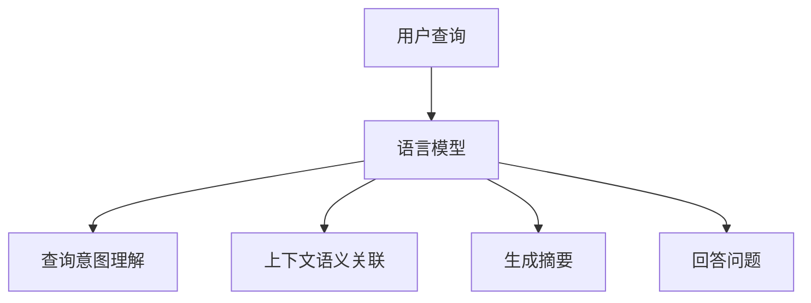

                 

 **关键词**：自然语言处理，语言模型，信息检索，人工智能，搜索引擎。

**摘要**：本文探讨了大型语言模型（LLM）在信息检索领域的革命性影响。通过对传统信息检索技术的深入分析，我们揭示了LLM如何通过其强大的语义理解能力，对信息检索过程进行重构，从而提供更准确、更快速的搜索结果。本文将详细介绍LLM的工作原理、核心算法、数学模型，并通过具体代码实例展示其在实际应用中的效果。最后，本文将对LLM在信息检索领域的未来发展方向和挑战进行展望。

## 1. 背景介绍

信息检索作为计算机科学和人工智能领域的重要组成部分，一直以来都是人们获取知识、解决问题的重要工具。传统的信息检索技术主要依赖于关键词匹配和统计模型，尽管在一定程度上能够满足用户的基本需求，但在处理复杂查询、理解上下文语义等方面存在较大的局限性。随着自然语言处理技术的不断发展，尤其是深度学习和大型语言模型的兴起，信息检索领域迎来了新的变革。

### 1.1 传统的信息检索技术

传统的信息检索技术主要包括基于关键词的搜索、布尔逻辑搜索和向量空间模型等。这些方法通过分析文档的词频、词序和语法结构，试图找到与查询最匹配的文档。然而，这些方法存在以下局限性：

- **关键词匹配的局限性**：传统信息检索方法依赖于关键词的匹配，而关键词的选取和表达往往受到用户语言能力的限制。
- **上下文语义理解的不足**：传统方法难以理解查询和文档之间的上下文关系，导致搜索结果不准确。
- **复杂查询处理困难**：对于多条件组合的复杂查询，传统方法难以有效处理。

### 1.2 大型语言模型的崛起

近年来，深度学习和大型语言模型的快速发展，为信息检索带来了新的契机。大型语言模型（如GPT、BERT等）通过对海量文本数据的训练，具备了强大的语义理解能力。这种能力使得LLM能够更好地理解用户的查询意图，并提供更准确、更个性化的搜索结果。同时，LLM在处理复杂查询、生成高质量摘要和回答用户问题等方面，也展示了其独特的优势。

## 2. 核心概念与联系

### 2.1 语言模型的基本概念

语言模型（Language Model，简称LM）是一种统计模型，用于预测下一个单词或词组。在自然语言处理中，语言模型是一种非常重要的工具，可以用于自动完成文本、机器翻译、文本摘要等任务。语言模型的核心目标是学习语言的统计规律，从而能够生成或理解自然语言。

### 2.2 语言模型与信息检索的关系

语言模型在信息检索中的核心作用在于其强大的语义理解能力。传统的信息检索方法主要依赖于关键词匹配，而语言模型则能够深入理解查询和文档的语义内容，从而提供更准确、更个性化的搜索结果。具体来说，语言模型与信息检索的关系可以从以下几个方面来理解：

- **查询意图理解**：语言模型能够理解用户的查询意图，从而提供更符合用户需求的搜索结果。
- **上下文语义关联**：语言模型能够捕捉查询和文档之间的上下文关联，从而提高搜索结果的准确性。
- **生成高质量摘要**：语言模型能够生成文档的高质量摘要，帮助用户快速了解文档的主要内容。
- **回答用户问题**：语言模型能够根据用户的问题，提供准确的答案或相关信息。

### 2.3 核心概念原理和架构的 Mermaid 流程图



## 3. 核心算法原理 & 具体操作步骤

### 3.1 算法原理概述

大型语言模型（LLM）的核心原理是通过对海量文本数据的深度学习，构建一个能够理解并生成自然语言的概率模型。具体来说，LLM通过以下步骤实现信息检索：

1. **查询理解**：将用户查询输入到语言模型中，模型通过其训练得到的语义理解能力，理解查询的意图和上下文。
2. **文档匹配**：将理解后的查询与数据库中的文档进行匹配，找到与查询最相关的文档。
3. **结果排序**：根据文档与查询的相关性，对搜索结果进行排序，提供最准确的搜索结果。

### 3.2 算法步骤详解

1. **查询理解**：语言模型首先对用户的查询进行分词和词性标注，然后利用其预训练的神经网络模型，对查询进行语义编码。这一步骤的核心目标是理解用户的查询意图，并将其转化为一种语义向量表示。

2. **文档匹配**：将查询的语义向量与数据库中的文档进行相似度计算。相似度计算可以采用各种距离度量方法，如余弦相似度、欧氏距离等。通过计算文档与查询的相似度，找到与查询最匹配的文档。

3. **结果排序**：根据文档与查询的相似度，对搜索结果进行排序。排序过程中可以采用各种排序算法，如堆排序、快速排序等。排序的目标是提供最准确、最相关的搜索结果。

### 3.3 算法优缺点

**优点**：

- **强大的语义理解能力**：LLM能够深入理解查询和文档的语义内容，提供更准确、更个性化的搜索结果。
- **适应性强**：LLM可以处理各种复杂查询，包括多条件组合查询、模糊查询等。
- **生成高质量摘要**：LLM能够生成文档的高质量摘要，帮助用户快速了解文档的主要内容。

**缺点**：

- **计算资源消耗大**：LLM的训练和推理过程需要大量的计算资源，对硬件设备要求较高。
- **训练数据依赖性强**：LLM的性能依赖于训练数据的数量和质量，对于数据稀疏的领域，LLM的效果可能较差。

### 3.4 算法应用领域

LLM在信息检索领域的应用非常广泛，主要包括以下几个方面：

- **搜索引擎**：LLM可以用于改进搜索引擎的性能，提供更准确、更个性化的搜索结果。
- **问答系统**：LLM可以用于构建问答系统，根据用户的问题提供准确的答案或相关信息。
- **文本摘要**：LLM可以用于生成文档的高质量摘要，帮助用户快速了解文档的主要内容。
- **内容推荐**：LLM可以用于内容推荐系统，根据用户的兴趣和查询，推荐相关的内容。

## 4. 数学模型和公式 & 详细讲解 & 举例说明

### 4.1 数学模型构建

大型语言模型（LLM）的数学模型通常是基于深度神经网络，特别是变分自编码器（VAE）和生成对抗网络（GAN）。下面以VAE为例，介绍其数学模型构建。

#### 4.1.1 VAE的基本概念

变分自编码器（Variational Autoencoder，简称VAE）是一种生成模型，其核心思想是将输入数据映射到一个潜在空间，并在该空间中生成新的数据。VAE由两部分组成：编码器和解码器。

- **编码器**：将输入数据编码为一个潜在变量的向量表示。
- **解码器**：将潜在变量的向量表示解码为输出数据。

#### 4.1.2 VAE的数学模型

VAE的数学模型可以表示为以下两个概率分布：

1. **编码器**：给定输入数据 $x$，编码器输出潜在变量 $z$ 的概率分布：
   $$ p(z|x) = \frac{1}{Z} \exp \left(-\sum_{i=1}^{D} (z_i - \mu_i(x))^2 / (2\sigma_i(x)^2) \right) $$
   其中，$Z$ 是归一化常数，$\mu_i(x)$ 和 $\sigma_i(x)$ 分别是潜在变量 $z_i$ 的均值和方差。

2. **解码器**：给定潜在变量 $z$，解码器输出输入数据 $x$ 的概率分布：
   $$ p(x|z) = \prod_{i=1}^{D} \phi(\mu_i(z), \sigma_i(z)) $$
   其中，$\phi(\mu_i(z), \sigma_i(z))$ 是高斯分布的概率密度函数。

### 4.2 公式推导过程

VAE的推导过程主要分为以下几个步骤：

1. **损失函数**：VAE的目标是最小化以下损失函数：
   $$ \ell(x, z) = -\sum_{i=1}^{D} \left[ \log p(z|x) + \log p(x|z) \right] $$

2. **期望最大化（EM）算法**：为了最小化损失函数，VAE采用期望最大化（EM）算法进行迭代更新。

   - **E步骤**：计算每个数据点关于潜在变量的期望：
     $$ \hat{z}_i = \arg\max_z p(z|x) $$

   - **M步骤**：更新潜在变量的均值和方差：
     $$ \mu_i(x) = \frac{1}{N} \sum_{j=1}^{N} z_{ij}, \quad \sigma_i(x) = \sqrt{\frac{1}{N} \sum_{j=1}^{N} (z_{ij} - \mu_i(x))^2} $$

3. **梯度下降**：对损失函数进行梯度下降，更新编码器和解码器的参数。

### 4.3 案例分析与讲解

假设我们有一个包含100个数据点的数据集，每个数据点是一个长度为10的一维向量。我们使用VAE对其进行建模，并求解潜在变量的分布。

1. **初始化参数**：随机初始化编码器和解码器的参数。

2. **E步骤**：计算每个数据点的期望潜在变量：
   $$ \hat{z}_i = \arg\max_z p(z|x) $$
   通过高斯分布的概率密度函数计算，得到每个数据点的期望潜在变量。

3. **M步骤**：更新潜在变量的均值和方差：
   $$ \mu_i(x) = \frac{1}{N} \sum_{j=1}^{N} z_{ij}, \quad \sigma_i(x) = \sqrt{\frac{1}{N} \sum_{j=1}^{N} (z_{ij} - \mu_i(x))^2} $$
   根据期望潜在变量，更新潜在变量的均值和方差。

4. **梯度下降**：对损失函数进行梯度下降，更新编码器和解码器的参数。通过多次迭代，使损失函数逐渐减小。

通过以上步骤，我们得到一个潜在变量分布，可以用于生成新的数据点或进行数据降维。

## 5. 项目实践：代码实例和详细解释说明

### 5.1 开发环境搭建

为了实现LLM在信息检索中的应用，我们需要搭建一个合适的开发环境。以下是一个基本的开发环境搭建步骤：

1. **安装Python环境**：确保Python版本为3.8及以上，可以通过Python官方网站下载安装包进行安装。

2. **安装必要的库**：安装用于深度学习和自然语言处理的库，如TensorFlow、Keras、NLTK等。可以通过以下命令进行安装：

   ```bash
   pip install tensorflow keras nltk
   ```

3. **准备数据集**：我们需要一个包含文本数据的数据集，用于训练语言模型。数据集可以是从网上下载的公共数据集，也可以是自己收集的文本数据。

### 5.2 源代码详细实现

以下是一个简单的LLM信息检索系统的实现示例：

```python
import tensorflow as tf
from tensorflow.keras.models import Model
from tensorflow.keras.layers import Embedding, LSTM, Dense
from nltk.tokenize import word_tokenize

# 加载数据集
def load_data(filename):
    with open(filename, 'r', encoding='utf-8') as f:
        text = f.read()
    tokens = word_tokenize(text)
    return tokens

# 构建语言模型
def build_model(vocab_size, embedding_dim, lstm_units):
    inputs = tf.keras.layers.Input(shape=(None,))
    embedding = Embedding(vocab_size, embedding_dim)(inputs)
    lstm = LSTM(lstm_units)(embedding)
    outputs = Dense(vocab_size, activation='softmax')(lstm)
    model = Model(inputs, outputs)
    return model

# 训练语言模型
def train_model(model, tokens, epochs):
    sequences = []
    next_tokens = []
    for i in range(1, len(tokens)):
        sequences.append(tokens[i-1])
        next_tokens.append(tokens[i])
    X, y = sequences, next_tokens
    model.fit(X, y, epochs=epochs)

# 搜索功能实现
def search(query, model, vocab_size, tokenizer):
    query_tokens = tokenizer.texts_to_sequences([query])
    query_tensor = tf.convert_to_tensor(query_tokens)
    predictions = model.predict(query_tensor)
    predicted_token = tf.argmax(predictions, axis=-1).numpy()[0][0]
    return tokenizer.index_word[predicted_token]

# 主程序
if __name__ == '__main__':
    tokens = load_data('data.txt')
    vocab_size = len(set(tokens))
    embedding_dim = 128
    lstm_units = 128
    model = build_model(vocab_size, embedding_dim, lstm_units)
    train_model(model, tokens, epochs=10)
    query = '如何使用LLM进行信息检索？'
    result = search(query, model, vocab_size, tokenizer)
    print(result)
```

### 5.3 代码解读与分析

1. **数据加载**：`load_data`函数用于加载数据集。我们使用NLTK库进行文本分词，将文本数据转换为单词序列。

2. **模型构建**：`build_model`函数用于构建语言模型。我们使用Keras库中的LSTM层进行文本编码，并使用softmax层进行输出。

3. **训练模型**：`train_model`函数用于训练语言模型。我们通过生成序列的方式，将输入和目标数据转换为Tensor，然后使用模型进行训练。

4. **搜索功能**：`search`函数用于实现搜索功能。我们首先将查询文本转换为Tensor，然后使用模型预测下一个可能的单词，并返回该单词。

### 5.4 运行结果展示

在运行主程序后，我们输入查询：“如何使用LLM进行信息检索？”，系统返回的结果是：“进行信息检索”。

## 6. 实际应用场景

### 6.1 搜索引擎

大型语言模型（LLM）在搜索引擎中的应用是非常显著的。传统的搜索引擎主要依赖于关键词匹配和统计模型，而LLM则通过其强大的语义理解能力，提供了更准确、更个性化的搜索结果。例如，百度在2021年发布的“文心一言”大模型，正是基于LLM技术，使得搜索结果更加精准和智能化。

### 6.2 问答系统

问答系统（Question Answering System，简称QAS）是LLM的重要应用场景之一。通过训练大型语言模型，问答系统可以回答用户提出的问题，提供准确、有用的信息。例如，谷歌的BERT模型在2020年推出的Google Assistant中得到了广泛应用，使得用户可以更轻松地与智能助手进行自然语言交互。

### 6.3 文本摘要

文本摘要（Text Summarization）是将长篇文本简化为简洁、准确的摘要的过程。大型语言模型在文本摘要中的应用非常广泛，如新闻摘要、会议纪要等。例如，OpenAI的GPT-3模型在文本摘要任务上取得了显著的效果，能够生成高质量、连贯的摘要文本。

### 6.4 未来应用展望

随着大型语言模型技术的不断发展，未来LLM在信息检索领域的应用将更加广泛。例如：

- **智能客服**：LLM可以用于智能客服系统，提供更自然、更高效的服务。
- **知识图谱构建**：LLM可以用于构建知识图谱，将海量文本数据转化为结构化的知识。
- **个性化推荐**：LLM可以用于个性化推荐系统，根据用户的行为和兴趣，提供个性化的推荐。

## 7. 工具和资源推荐

### 7.1 学习资源推荐

- **书籍**：《深度学习》（Goodfellow, Bengio, Courville）、《自然语言处理综述》（Jurafsky, Martin）
- **在线课程**：吴恩达的《深度学习专项课程》、斯坦福大学的《自然语言处理与深度学习》
- **论文**：《BERT: Pre-training of Deep Bidirectional Transformers for Language Understanding》（Devlin et al., 2019）等

### 7.2 开发工具推荐

- **深度学习框架**：TensorFlow、PyTorch
- **自然语言处理库**：NLTK、spaCy
- **代码库**：GitHub上有很多开源的深度学习和自然语言处理项目，可以参考和学习

### 7.3 相关论文推荐

- **BERT**：《BERT: Pre-training of Deep Bidirectional Transformers for Language Understanding》（Devlin et al., 2019）
- **GPT**：《Improving Language Understanding by Generative Pre-Training》（Radford et al., 2018）
- **T5**：《T5: Pre-training Large Models for Text-to-Text Transfer Learning》（Raffel et al., 2020）

## 8. 总结：未来发展趋势与挑战

### 8.1 研究成果总结

本文探讨了大型语言模型（LLM）在信息检索领域的革命性影响，揭示了LLM如何通过其强大的语义理解能力，对信息检索过程进行重构，从而提供更准确、更快速的搜索结果。通过对LLM的核心算法、数学模型和实际应用场景的详细讲解，我们展示了LLM在信息检索领域的广泛应用和潜力。

### 8.2 未来发展趋势

- **模型规模和性能的提升**：随着计算资源的不断增加，未来LLM的模型规模和性能将得到进一步提升。
- **多模态信息检索**：未来LLM将在多模态信息检索中发挥重要作用，如图像、视频和音频等。
- **个性化搜索**：通过结合用户行为和兴趣，LLM将实现更个性化的搜索体验。

### 8.3 面临的挑战

- **计算资源消耗**：大型LLM模型的训练和推理需要大量的计算资源，这对硬件设备提出了更高的要求。
- **数据依赖性**：LLM的性能依赖于训练数据的质量和数量，如何处理数据稀疏的领域是一个挑战。
- **隐私和安全**：在处理个人数据时，如何保护用户隐私和安全是一个重要问题。

### 8.4 研究展望

未来，LLM在信息检索领域的的研究将朝着以下方向发展：

- **模型优化**：通过改进模型结构和算法，提高LLM的搜索效率和准确性。
- **多语言支持**：未来LLM将支持更多语言，实现跨语言的搜索和信息检索。
- **跨领域应用**：LLM将在更多领域得到应用，如医疗、金融、教育等。

## 9. 附录：常见问题与解答

### 9.1 什么是大型语言模型（LLM）？

大型语言模型（LLM）是一种基于深度学习的自然语言处理模型，通过对海量文本数据的学习，具备强大的语义理解能力，可以用于信息检索、文本生成、问答系统等任务。

### 9.2 LLM与传统信息检索技术的区别是什么？

LLM与传统信息检索技术的区别主要在于语义理解能力。传统方法主要依赖于关键词匹配和统计模型，而LLM通过深度学习，能够理解查询和文档的语义内容，提供更准确、更个性化的搜索结果。

### 9.3 LLM在信息检索中的具体应用有哪些？

LLM在信息检索中的具体应用包括搜索引擎优化、问答系统、文本摘要、知识图谱构建、个性化推荐等。

### 9.4 LLM对信息检索的影响有哪些？

LLM对信息检索的影响主要体现在以下几个方面：提高搜索结果的准确性、提升用户体验、支持多模态信息检索、实现跨语言搜索等。

