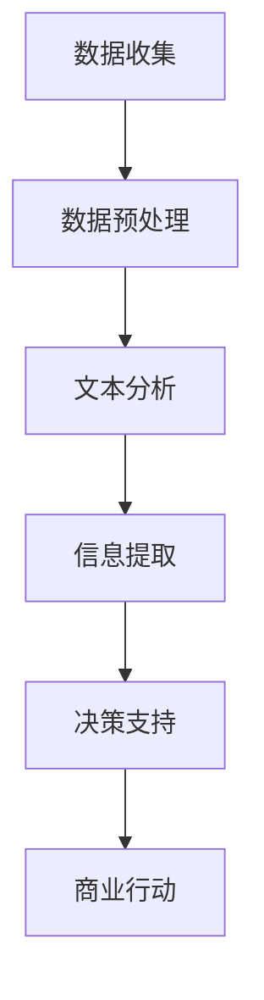

                 

关键词：商业智能、LLM、自然语言处理、人工智能、数据分析、信息提取、决策支持系统

> 摘要：随着人工智能技术的不断发展，大型语言模型（LLM）在商业智能（BI）分析领域展现出了巨大的潜力。本文将深入探讨LLM在传统BI分析中的革新作用，从核心概念、算法原理、数学模型、项目实践等多个角度，阐述LLM如何改变BI分析的方式，提升商业决策的效率与准确性。

## 1. 背景介绍

商业智能分析（Business Intelligence Analysis，简称BI分析）是企业获取、处理、分析和展示数据以支持商业决策的关键过程。传统的BI分析方法依赖于结构化数据，主要依靠SQL查询、数据挖掘和报表生成等技术手段。然而，随着数据量的爆炸式增长和复杂性的提高，传统的BI分析手段逐渐显露出其局限性。

自然语言处理（Natural Language Processing，简称NLP）作为人工智能的重要分支，近年来取得了显著的进展。尤其是近年来大型语言模型（LLM）如GPT-3、ChatGPT等的出现，使得计算机理解和生成自然语言的能力达到了新的高度。LLM的应用不仅局限于语言生成和翻译，其在信息提取、问答系统、文本摘要等领域也展现出了巨大的潜力。

本文旨在探讨如何将LLM与商业智能分析相结合，通过引入NLP技术，革新传统的BI分析方式，提高商业决策的效率与准确性。

## 2. 核心概念与联系

### 2.1. 商业智能分析（BI Analysis）

商业智能分析是指使用技术手段对企业的各种业务数据进行收集、处理、分析和展示，以帮助企业管理层做出更明智的商业决策。传统的BI分析主要包括数据仓库、数据挖掘、报表生成等技术。

### 2.2. 自然语言处理（NLP）

自然语言处理是指使计算机能够理解、解释和生成自然语言的技术。NLP涉及多个领域，包括语言理解、语言生成、机器翻译、情感分析等。在商业智能分析中，NLP可以帮助从非结构化数据（如文本、电子邮件、社交媒体等）中提取有价值的信息。

### 2.3. 大型语言模型（LLM）

大型语言模型（Large Language Model，简称LLM）是一种能够理解和生成自然语言的深度学习模型。LLM通过学习大量的文本数据，掌握自然语言的语法、语义和上下文关系，从而能够进行复杂的语言处理任务。在商业智能分析中，LLM可以用于文本分析、问答系统、自动摘要等。

### 2.4. Mermaid 流程图

下面是一个描述LLM在商业智能分析中应用的Mermaid流程图。



### 2.5. 核心概念联系

商业智能分析与自然语言处理和大型语言模型之间的联系在于，NLP和LLM技术可以扩展BI分析的范围，使其不仅限于结构化数据，还能够处理非结构化数据，如文本、图像等。通过NLP和LLM，BI分析可以从更广泛的数据源中提取有价值的信息，从而提高商业决策的准确性。

## 3. 核心算法原理 & 具体操作步骤

### 3.1. 算法原理概述

LLM在商业智能分析中的核心作用是通过自然语言处理技术，从非结构化数据中提取有价值的信息，为商业决策提供支持。LLM的工作原理主要包括以下几个步骤：

1. **数据收集**：从各种数据源（如社交媒体、新闻报道、内部文档等）收集文本数据。
2. **数据预处理**：对收集的文本数据进行清洗、去噪、标准化等处理，使其符合分析要求。
3. **文本分析**：使用LLM对预处理后的文本进行分析，提取关键信息、情感倾向等。
4. **信息提取**：根据商业需求，从文本分析结果中提取有价值的信息，如市场趋势、客户反馈等。
5. **决策支持**：将提取的信息转化为可视化报表、问答系统等形式，为商业决策提供支持。

### 3.2. 算法步骤详解

1. **数据收集**：

   数据收集是商业智能分析的第一步。在这一阶段，我们需要从各种数据源收集文本数据，如社交媒体平台、新闻报道、内部文档等。这些数据可以是结构化的，也可以是非结构化的。对于非结构化数据，我们可以使用Web爬虫等技术进行收集。

   ```python
   import requests
   from bs4 import BeautifulSoup

   url = 'https://www.example.com'
   response = requests.get(url)
   soup = BeautifulSoup(response.content, 'html.parser')
   # 提取文本数据
   text_data = soup.get_text()
   ```

2. **数据预处理**：

   数据预处理是为了确保文本数据的质量和一致性。在这一阶段，我们需要对文本数据执行去噪、去停用词、词干提取等操作。

   ```python
   import nltk
   from nltk.corpus import stopwords
   from nltk.stem import PorterStemmer

   nltk.download('stopwords')
   stop_words = set(stopwords.words('english'))
   ps = PorterStemmer()

   def preprocess_text(text):
       # 去除HTML标签
       text = re.sub('<.*?>', '', text)
       # 去除停用词
       text = ' '.join([word for word in text.split() if word not in stop_words])
       # 词干提取
       text = ' '.join([ps.stem(word) for word in text.split()])
       return text

   preprocessed_text = preprocess_text(text_data)
   ```

3. **文本分析**：

   文本分析是LLM在商业智能分析中的核心步骤。在这一阶段，我们可以使用LLM对预处理后的文本进行分析，提取关键信息、情感倾向等。

   ```python
   from transformers import pipeline

   # 加载预训练的LLM模型
   text_analyzer = pipeline('text-analysis')

   # 分析文本
   analysis_results = text_analyzer(preprocessed_text)
   print(analysis_results)
   ```

4. **信息提取**：

   根据商业需求，我们需要从文本分析结果中提取有价值的信息，如市场趋势、客户反馈等。

   ```python
   def extract_information(analysis_results):
       information = {}
       for result in analysis_results:
           # 提取市场趋势
           if 'market_trend' in result['labels']:
               information['market_trend'] = result['text']
           # 提取客户反馈
           if 'customer_feedback' in result['labels']:
               information['customer_feedback'] = result['text']
       return information

   extracted_information = extract_information(analysis_results)
   print(extracted_information)
   ```

5. **决策支持**：

   将提取的信息转化为可视化报表、问答系统等形式，为商业决策提供支持。

   ```python
   def generate_decision_support(information):
       # 生成可视化报表
       market_trend = information['market_trend']
       customer_feedback = information['customer_feedback']
       # 生成问答系统
       question = 'What is the current market trend?'
       answer = market_trend
       return market_trend, customer_feedback, question, answer

   market_trend, customer_feedback, question, answer = generate_decision_support(extracted_information)
   print(f'Market Trend: {market_trend}')
   print(f'Customer Feedback: {customer_feedback}')
   print(f'Question: {question}')
   print(f'Answer: {answer}')
   ```

### 3.3. 算法优缺点

**优点**：

1. **高效性**：LLM能够快速处理大量的文本数据，提高BI分析的效率。
2. **准确性**：通过预训练的LLM模型，可以从非结构化数据中提取有价值的信息，提高BI分析的准确性。
3. **灵活性**：LLM可以处理多种文本格式和语言，使得BI分析的应用范围更广。

**缺点**：

1. **计算资源消耗**：LLM模型通常需要大量的计算资源，对硬件要求较高。
2. **数据质量**：如果数据质量较差，可能导致LLM分析结果不准确。
3. **隐私问题**：在处理敏感数据时，需要确保数据隐私和安全性。

### 3.4. 算法应用领域

LLM在商业智能分析中的应用非常广泛，以下是一些主要的领域：

1. **市场分析**：通过分析社交媒体、新闻报道等数据，了解市场趋势和竞争对手动态。
2. **客户反馈分析**：通过分析客户评论、论坛等数据，了解客户对产品和服务的反馈。
3. **风险评估**：通过分析金融报告、新闻等数据，预测市场风险和投资机会。
4. **产品推荐**：通过分析用户行为和偏好，为用户提供个性化的产品推荐。

## 4. 数学模型和公式 & 详细讲解 & 举例说明

### 4.1. 数学模型构建

在LLM应用于商业智能分析时，我们可以构建以下数学模型：

1. **文本表示模型**：用于将文本数据转化为向量表示。
2. **分类模型**：用于对文本数据分类，提取关键信息。
3. **聚类模型**：用于对文本数据进行聚类，发现潜在的市场趋势。
4. **预测模型**：用于对文本数据进行预测，如市场趋势预测、客户流失预测等。

### 4.2. 公式推导过程

1. **文本表示模型**：

   文本表示模型通常采用词嵌入（Word Embedding）方法，将文本转化为向量表示。词嵌入公式如下：

   $$ 
   \textbf{v}_w = \text{Word2Vec}(\text{w}) 
   $$

   其中，$\textbf{v}_w$ 是词 $w$ 的向量表示，$\text{Word2Vec}$ 是词嵌入函数。

2. **分类模型**：

   分类模型通常采用逻辑回归（Logistic Regression）等方法，对文本数据进行分类。逻辑回归公式如下：

   $$
   \text{P}(\text{y}=\text{1}|\textbf{x}; \text{w}) = \frac{1}{1 + \exp(-\text{w}^T\textbf{x})}
   $$

   其中，$\text{P}(\text{y}=1|\textbf{x}; \text{w})$ 是文本 $\textbf{x}$ 属于类别 1 的概率，$\text{w}$ 是分类模型参数。

3. **聚类模型**：

   聚类模型通常采用 K-均值（K-Means）等方法，对文本数据进行聚类。K-均值公式如下：

   $$
   \textbf{x}_{\text{i}} = \frac{1}{k} \sum_{j=1}^{k} \text{w}_{\text{j}} \cdot \text{d}_{\text{i},\text{j}}
   $$

   其中，$\textbf{x}_{\text{i}}$ 是第 $i$ 个文本数据的聚类中心，$\text{w}_{\text{j}}$ 是第 $j$ 个聚类中心，$\text{d}_{\text{i},\text{j}}$ 是第 $i$ 个文本数据到第 $j$ 个聚类中心的距离。

4. **预测模型**：

   预测模型通常采用时间序列模型（如 ARIMA、LSTM）等方法，对文本数据进行预测。LSTM（Long Short-Term Memory）模型公式如下：

   $$
   \text{h}_{t} = \text{f}(\text{h}_{t-1}, \text{x}_{t})
   $$

   其中，$\text{h}_{t}$ 是第 $t$ 个时间步的隐藏状态，$\text{x}_{t}$ 是第 $t$ 个输入，$\text{f}$ 是 LSTM 门控机制。

### 4.3. 案例分析与讲解

#### 案例背景

假设一家电子商务公司想要分析其用户评论，了解用户对产品的满意度，从而制定改进策略。

#### 数据预处理

1. 数据收集：从公司的评论系统收集用户评论。
2. 数据预处理：对评论进行清洗，去除HTML标签、停用词等。

#### 文本分析

1. 词嵌入：使用预训练的 Word2Vec 模型，将评论转化为向量表示。
2. 分类：使用逻辑回归模型，对评论进行分类，判断用户对产品的满意度。

#### 信息提取

1. 从分类结果中提取用户满意度数据。
2. 对用户满意度数据进行可视化，展示用户的整体满意度。

#### 预测

1. 基于历史用户评论数据，使用 LSTM 模型，预测未来一段时间内用户对产品的满意度。

## 5. 项目实践：代码实例和详细解释说明

### 5.1. 开发环境搭建

1. 安装 Python 3.8 或以上版本。
2. 安装必要的 Python 库，如 numpy、pandas、nltk、transformers 等。

### 5.2. 源代码详细实现

以下是一个简单的示例代码，展示了如何使用 LL

