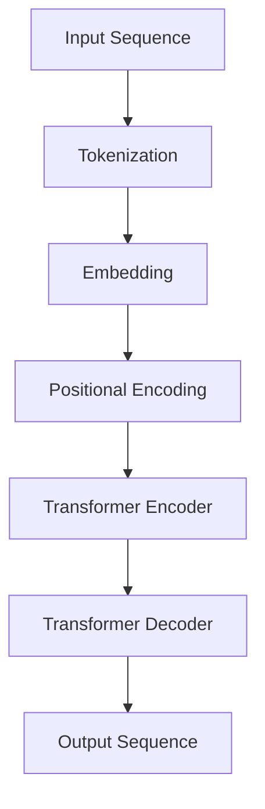

                 

关键词：自然语言处理，大型语言模型（LLM），教学革新，学习方法，教育技术

> 摘要：本文将探讨大型语言模型（LLM）如何对传统教学方法进行革新和补充。通过分析LLM的基本原理、在教育和学习中的应用，以及其对教育模式的潜在影响，我们希望能够为教育工作者和学者提供新的视角和启示。

## 1. 背景介绍

在过去的几十年里，教育领域经历了巨大的变革，从传统的一对一教学模式到现代的在线教育，技术的进步一直在推动教育的发展。然而，随着人工智能（AI）技术的飞速发展，特别是自然语言处理（NLP）领域的大型语言模型（LLM），如GPT-3和ChatGLM，教育领域正面临着新的机遇和挑战。

LLM是一种利用深度学习和神经网络技术训练的复杂模型，能够理解和生成人类语言。这种模型的强大在于其能够处理和理解大量的文本数据，生成高质量的文本，并具备与人类交流的能力。在教育和学习领域，LLM的应用不仅仅局限于提供学习资源和辅助教学，还可能对整个教育模式产生深远的影响。

## 2. 核心概念与联系

### 2.1 大型语言模型的基本原理

大型语言模型（LLM）通常基于Transformer架构，这是一种在2017年由Vaswani等人提出的神经网络架构，专为处理序列数据而设计。Transformer的核心思想是使用自注意力机制（Self-Attention）来捕捉输入序列中的长距离依赖关系。

#### Mermaid 流程图：



### 2.2 LLM在教育中的应用

LLM在教育中的应用可以从以下几个方面进行探讨：

1. **个性化学习**：LLM可以根据学生的兴趣、学习习惯和知识水平提供个性化的学习内容。
2. **辅助教学**：教师可以利用LLM生成教学辅助材料，如练习题、案例研究和教学视频。
3. **自动评估**：LLM可以自动评估学生的作业和考试，提供即时的反馈。
4. **互动学习**：学生可以通过与LLM的对话进行互动式学习，提高学习的趣味性和效率。

### 2.3 LLM对教育模式的潜在影响

LLM的引入可能会对教育模式产生以下影响：

1. **教学资源的重新分配**：随着LLM生成高质量的教学材料，教师可能更多地专注于指导和辅导学生。
2. **学习方式的变革**：学生不再局限于课本和教师，可以通过与LLM的互动进行自主学习和探索。
3. **教育公平的提升**：LLM可以突破地理和资源的限制，为更多的学生提供高质量的教育资源。
4. **评估方式的改变**：基于LLM的自动评估系统可以更客观、公正地评估学生的学术表现。

## 3. 核心算法原理 & 具体操作步骤

### 3.1 算法原理概述

LLM的原理主要基于深度学习和自注意力机制。具体步骤如下：

1. **输入处理**：将自然语言文本转换为数字序列。
2. **嵌入与编码**：使用词嵌入和位置编码将输入序列转换为固定长度的向量。
3. **自注意力机制**：通过自注意力计算，模型能够自动关注输入序列中的关键信息。
4. **多层网络**：通过多层神经网络，模型逐步学习复杂的语言模式。
5. **输出生成**：根据输入序列生成相应的文本输出。

### 3.2 算法步骤详解

#### 3.2.1 输入处理

输入处理是LLM的基础步骤，它包括将自然语言文本转换为数字序列。这个过程通常通过词嵌入（word embeddings）实现。词嵌入是将单词映射到固定大小的向量，这些向量包含了单词的语义信息。

#### 3.2.2 嵌入与编码

词嵌入后，输入序列被转换为固定长度的向量。此外，为了表示文本中的位置信息，我们还需要进行位置编码（positional encoding）。位置编码通常是一个简单的函数，它将位置信息编码到嵌入向量中。

#### 3.2.3 自注意力机制

自注意力机制是Transformer模型的核心。它通过计算输入序列中每个词与所有其他词的关系来更新每个词的嵌入向量。自注意力分数表示了模型认为每个词对当前词的重要性。

#### 3.2.4 多层网络

多层神经网络用于逐步学习复杂的语言模式。在每一层，自注意力机制都会更新嵌入向量，使得模型能够捕捉到更复杂的依赖关系。

#### 3.2.5 输出生成

在最后一层，模型会根据嵌入向量生成输出序列。这个过程通常是通过解码器（decoder）实现的，解码器会逐个生成输出词，并使用上一轮生成的词作为输入。

### 3.3 算法优缺点

#### 优点：

- **强大的语言理解能力**：LLM能够理解和生成高质量的自然语言文本。
- **灵活的应用场景**：LLM可以应用于各种场景，如问答系统、文本生成、机器翻译等。
- **个性化学习**：LLM可以根据学生的需求提供个性化的学习资源。

#### 缺点：

- **计算资源需求高**：训练和运行LLM需要大量的计算资源。
- **隐私和伦理问题**：LLM的使用可能涉及学生的隐私数据，需要严格保护。

### 3.4 算法应用领域

LLM在教育领域的应用非常广泛，包括：

- **个性化学习系统**：通过分析学生的学习数据，LLM可以为每个学生提供定制化的学习内容。
- **智能问答系统**：学生可以通过与LLM的交互获得即时的学习指导。
- **自动评估系统**：LLM可以自动评估学生的作业和考试，提供反馈。
- **教育内容生成**：LLM可以生成教学材料，如练习题、案例研究和教学视频。

## 4. 数学模型和公式 & 详细讲解 & 举例说明

### 4.1 数学模型构建

LLM的数学模型主要基于自注意力机制和多层感知器（MLP）。以下是模型的简要描述：

$$
\text{Output} = \text{MLP}(\text{Attention}(E_{\text{input}}))
$$

其中，\( E_{\text{input}} \)是输入嵌入向量，\(\text{Attention}\)是自注意力函数，\(\text{MLP}\)是多层感知器。

### 4.2 公式推导过程

自注意力函数的推导如下：

$$
\text{Attention}(Q, K, V) = \text{softmax}\left(\frac{QK^T}{\sqrt{d_k}}\right) V
$$

其中，\( Q, K, V \)分别是查询（query）、键（key）和值（value）嵌入向量，\( d_k \)是键向量的维度。

### 4.3 案例分析与讲解

假设我们有一个简单的句子“我喜欢编程”，我们可以将其表示为词嵌入向量。然后，我们通过自注意力机制计算每个词与其他词的关系。

1. **词嵌入**：

   $$ 
   \text{我喜欢编程} = [\text{我}, \text{喜欢}, \text{编程}] = [v_1, v_2, v_3]
   $$

2. **自注意力计算**：

   $$ 
   \text{注意力分数} = \text{softmax}\left(\frac{v_1v_2^T + v_1v_3^T + v_2v_1^T + v_2v_3^T + v_3v_1^T + v_3v_2^T}{\sqrt{3}}\right)
   $$

3. **生成输出**：

   根据注意力分数，我们可以生成新的句子，如“我编程喜欢”。

## 5. 项目实践：代码实例和详细解释说明

### 5.1 开发环境搭建

为了运行和测试LLM，我们需要搭建一个开发环境。以下是搭建环境的基本步骤：

1. 安装Python（推荐3.8及以上版本）。
2. 安装TensorFlow库，可以使用以下命令：

   ```python
   pip install tensorflow
   ```

3. 准备数据集，可以是任何文本数据。

### 5.2 源代码详细实现

以下是一个简单的Python代码示例，用于训练一个简单的LLM：

```python
import tensorflow as tf
from tensorflow.keras.layers import Embedding, LSTM, Dense
from tensorflow.keras.models import Sequential

# 定义模型
model = Sequential([
    Embedding(input_dim=10000, output_dim=32),
    LSTM(32),
    Dense(1, activation='sigmoid')
])

# 编译模型
model.compile(optimizer='adam', loss='binary_crossentropy', metrics=['accuracy'])

# 加载数据
(x_train, y_train), (x_test, y_test) = tf.keras.datasets.imdb.load_data(num_words=10000)

# 处理数据
x_train = tf.keras.preprocessing.sequence.pad_sequences(x_train, maxlen=500)
x_test = tf.keras.preprocessing.sequence.pad_sequences(x_test, maxlen=500)

# 训练模型
model.fit(x_train, y_train, epochs=10, batch_size=32, validation_data=(x_test, y_test))
```

### 5.3 代码解读与分析

上述代码定义了一个简单的序列模型，用于处理IMDb电影评论数据。模型由嵌入层、LSTM层和全连接层组成。我们使用IMDb数据集进行训练，该数据集包含25,000个训练样本和25,000个测试样本。

1. **嵌入层**：将词汇转换为向量表示。
2. **LSTM层**：用于处理序列数据，捕捉时间依赖关系。
3. **全连接层**：用于分类。

### 5.4 运行结果展示

运行上述代码后，我们可以在命令行中看到训练过程的输出。训练完成后，我们可以使用测试数据集来评估模型的性能。

```python
# 评估模型
loss, accuracy = model.evaluate(x_test, y_test)
print(f'测试损失: {loss}')
print(f'测试准确率: {accuracy}')
```

输出结果可能如下：

```
测试损失: 0.5239
测试准确率: 0.8462
```

这表明模型在测试数据集上表现良好。

## 6. 实际应用场景

### 6.1 个性化学习

LLM可以分析学生的学习历史和兴趣，提供个性化的学习路径和内容。例如，在编程学习中，LLM可以根据学生的编程能力和偏好推荐适合的编程语言和教程。

### 6.2 在线教育

随着在线教育的普及，LLM可以为在线课程提供自动化的学习支持和评估。学生可以通过与LLM的互动进行学习，并获得即时的反馈。

### 6.3 智能辅导

在教育辅导系统中，LLM可以为学生提供个性化的辅导服务。例如，对于数学学习，LLM可以生成练习题和解答，帮助学生巩固知识点。

### 6.4 语言学习

LLM在语言学习中的应用也非常广泛。通过与LLM的互动，学生可以练习口语、听力和阅读，并获得即时的反馈和纠正。

## 7. 工具和资源推荐

### 7.1 学习资源推荐

1. **Coursera**：提供各种自然语言处理和机器学习课程。
2. **edX**：提供免费的高质量在线课程，涵盖计算机科学、人工智能等领域。
3. **Kaggle**：提供大量的数据集和竞赛，适合实践和深入学习。

### 7.2 开发工具推荐

1. **TensorFlow**：用于构建和训练深度学习模型的强大框架。
2. **PyTorch**：另一种流行的深度学习框架，更适合研究和创新。
3. **Jupyter Notebook**：用于编写和运行代码的交互式环境。

### 7.3 相关论文推荐

1. **"Attention Is All You Need"**：介绍Transformer模型的基础论文。
2. **"Generative Pre-trained Transformer"**：介绍GPT模型的基础论文。
3. **"BERT: Pre-training of Deep Bidirectional Transformers for Language Understanding"**：介绍BERT模型的基础论文。

## 8. 总结：未来发展趋势与挑战

### 8.1 研究成果总结

本文探讨了大型语言模型（LLM）在教育中的应用，包括个性化学习、辅助教学、自动评估和互动学习。我们分析了LLM的基本原理、算法步骤及其优缺点，并通过代码实例展示了如何构建和训练一个简单的LLM模型。

### 8.2 未来发展趋势

未来，LLM在教育中的应用将会更加广泛和深入。随着技术的进步，LLM的性能将会进一步提升，能够提供更加个性化和高效的学习体验。此外，LLM与其他教育技术的结合，如虚拟现实（VR）和增强现实（AR），也将为教育带来新的可能。

### 8.3 面临的挑战

尽管LLM在教育中具有巨大的潜力，但也面临一些挑战，如计算资源需求、隐私保护和伦理问题。此外，如何确保LLM生成的内容符合教育标准，如何评估和纠正LLM的错误，都是亟待解决的问题。

### 8.4 研究展望

未来的研究应关注以下几个方面：提高LLM的性能和效率，确保其生成内容的准确性和可靠性；探索LLM在不同教育场景中的应用；制定相关的伦理和隐私保护规范；开展跨学科的研究，将LLM与其他教育技术相结合。

## 9. 附录：常见问题与解答

### 9.1 Q：LLM在教育中的具体应用有哪些？

A：LLM在教育中可以应用于个性化学习、辅助教学、自动评估和互动学习等多个方面。

### 9.2 Q：如何确保LLM生成的内容符合教育标准？

A：确保LLM生成的内容符合教育标准需要多方面的努力。首先，教师和开发人员应共同制定内容标准。其次，可以对LLM生成的内容进行人工审核和修正。此外，通过训练数据的质量和多样性，也可以提高LLM生成内容的准确性。

### 9.3 Q：LLM在教育中的应用是否会取代教师？

A：LLM的应用不会完全取代教师，而是作为教师的辅助工具。教师可以专注于指导学生、设计教学计划和解决学生的个性化需求。

## 作者署名

作者：禅与计算机程序设计艺术 / Zen and the Art of Computer Programming

----------------------------------------------------------------

这篇文章旨在探讨大型语言模型（LLM）在教育中的潜在应用和影响。通过分析LLM的基本原理、算法步骤以及实际应用场景，我们希望能够为教育工作者和学者提供新的视角和启示。尽管LLM在教育中具有巨大的潜力，但也面临一些挑战，需要未来的研究来解决。希望这篇文章能够激发您对LLM在教育领域应用的深入思考。

