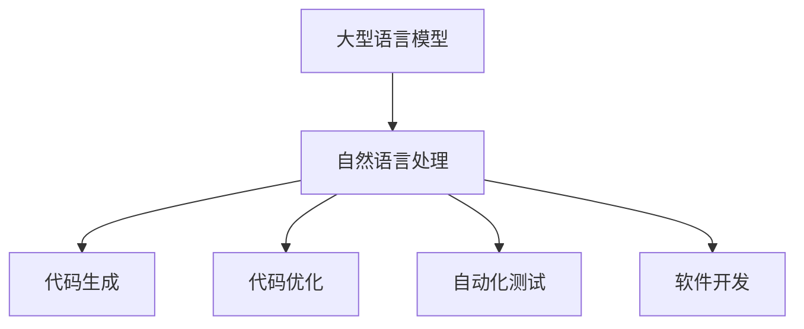

                 

关键词：语言模型，编程范式，人工智能，深度学习，代码生成，软件工程

>摘要：本文探讨了大型语言模型（LLM）对传统编程范式带来的冲击。通过对LLM的核心原理、算法模型以及其在编程领域的应用进行详细分析，本文揭示了LLM在代码生成、软件开发和自动化测试等方面的巨大潜力，并对传统编程范式提出了新的挑战。

## 1. 背景介绍

近年来，人工智能（AI）技术取得了飞速发展，其中深度学习（Deep Learning）和自然语言处理（Natural Language Processing，NLP）领域尤为引人注目。大型语言模型（Large Language Model，LLM）作为一种基于深度学习的自然语言处理模型，已经在众多领域展示了其强大的能力。LLM通过学习大量文本数据，可以实现对自然语言的生成、理解和翻译等任务的高效处理。

在编程领域，传统编程范式主要依赖于程序员手动编写代码，通过一系列设计、编码、测试和调试的过程来完成软件开发。然而，随着LLM技术的发展，程序员编写代码的方式正在发生深刻变革。本文将探讨LLM对传统编程范式的冲击，分析其在编程领域的应用和挑战。

## 2. 核心概念与联系

### 2.1. 大型语言模型（LLM）

大型语言模型（LLM）是一种基于深度学习的自然语言处理模型，通过学习大量文本数据，可以实现对自然语言的生成、理解和翻译等任务的高效处理。LLM的核心原理是基于神经网络（Neural Network）和递归神经网络（Recurrent Neural Network，RNN）等深度学习算法，通过对输入文本进行建模，预测下一个词的概率分布，从而生成连贯的文本输出。

### 2.2. 递归神经网络（RNN）

递归神经网络（RNN）是一种能够处理序列数据的神经网络，通过对序列数据进行递归处理，可以实现对序列数据的建模。RNN在自然语言处理领域具有重要的应用，例如文本分类、情感分析、机器翻译等。

### 2.3. 深度学习（Deep Learning）

深度学习（Deep Learning）是一种基于人工神经网络的机器学习技术，通过多层神经网络结构，可以实现对复杂数据的建模和预测。深度学习在图像识别、语音识别、自然语言处理等领域取得了显著的成果。

### 2.4. 编程范式

编程范式是指程序员编写代码的方法和模式，传统编程范式主要依赖于程序员手动编写代码，通过一系列设计、编码、测试和调试的过程来完成软件开发。随着LLM技术的发展，编程范式正在逐渐发生变化，例如自动代码生成、代码优化和自动化测试等。

### 2.5. Mermaid 流程图

以下是一个关于LLM在编程领域应用的Mermaid流程图：



## 3. 核心算法原理 & 具体操作步骤

### 3.1. 算法原理概述

LLM的核心算法原理是基于深度学习模型，通过学习大量文本数据，实现对自然语言的生成、理解和翻译等任务。具体来说，LLM通过多层神经网络结构，对输入文本进行建模，预测下一个词的概率分布，从而生成连贯的文本输出。

### 3.2. 算法步骤详解

1. 数据预处理：对输入文本进行分词、去停用词等预处理操作，将文本转化为模型可接受的格式。
2. 模型训练：通过训练大量文本数据，优化神经网络模型的参数，使模型能够准确预测下一个词的概率分布。
3. 代码生成：根据输入的编程任务描述，LLM生成相应的代码片段。
4. 代码优化：对生成的代码进行优化，提高代码的性能和可读性。
5. 自动化测试：使用生成的代码进行自动化测试，确保代码的正确性和可靠性。

### 3.3. 算法优缺点

**优点：**

- 自动化代码生成，提高编程效率。
- 优化代码性能，降低开发成本。
- 自动化测试，提高软件质量。

**缺点：**

- 模型训练过程需要大量数据和计算资源。
- 代码生成的准确性和可靠性仍有待提高。
- 需要进一步研究如何在编程领域充分发挥LLM的优势。

### 3.4. 算法应用领域

LLM在编程领域具有广泛的应用前景，包括代码生成、代码优化和自动化测试等。以下是一些具体的应用领域：

- 自动化编程：通过LLM生成和优化代码，实现自动化编程任务。
- 代码补全：根据程序员输入的代码片段，LLM可以预测并补全代码。
- 软件开发：使用LLM进行软件开发，提高开发效率和软件质量。
- 自动化测试：使用LLM生成的代码进行自动化测试，提高测试效率。

## 4. 数学模型和公式 & 详细讲解 & 举例说明

### 4.1. 数学模型构建

LLM的数学模型主要基于深度学习算法，包括神经网络、递归神经网络等。以下是一个简单的神经网络模型：

$$
\begin{aligned}
    h_{t} &= \sigma(W_{h}h_{t-1} + W_{x}x_{t} + b) \\
    y_{t} &= \sigma(W_{y}h_{t} + b)
\end{aligned}
$$

其中，$h_{t}$表示第$t$时刻的隐藏层状态，$x_{t}$表示第$t$时刻的输入，$y_{t}$表示第$t$时刻的输出，$W_{h}$、$W_{x}$、$W_{y}$和$b$分别表示权重和偏置，$\sigma$表示激活函数。

### 4.2. 公式推导过程

以神经网络模型为例，我们通过梯度下降算法来优化模型的参数。具体步骤如下：

1. 计算损失函数：
$$
    L = \frac{1}{2}\sum_{t=1}^{T}(y_{t} - \hat{y}_{t})^2
$$
其中，$T$表示时间步数，$y_{t}$表示实际输出，$\hat{y}_{t}$表示模型预测输出。

2. 计算损失函数关于参数的梯度：
$$
    \frac{\partial L}{\partial W_{h}} = \frac{1}{T}\sum_{t=1}^{T}(h_{t-1} - \hat{h}_{t-1})\odot (y_{t} - \hat{y}_{t}) \\
    \frac{\partial L}{\partial W_{x}} = \frac{1}{T}\sum_{t=1}^{T}(h_{t-1} - \hat{h}_{t-1})\odot (y_{t} - \hat{y}_{t})x_{t} \\
    \frac{\partial L}{\partial b} = \frac{1}{T}\sum_{t=1}^{T}(h_{t-1} - \hat{h}_{t-1})\odot (y_{t} - \hat{y}_{t})
$$

3. 更新参数：
$$
    W_{h} \leftarrow W_{h} - \alpha \frac{\partial L}{\partial W_{h}} \\
    W_{x} \leftarrow W_{x} - \alpha \frac{\partial L}{\partial W_{x}} \\
    b \leftarrow b - \alpha \frac{\partial L}{\partial b}
$$

其中，$\alpha$表示学习率。

### 4.3. 案例分析与讲解

假设我们使用一个简单的神经网络模型进行情感分析，输入文本为“我非常喜欢这本书”，输出为情感标签（正/负）。通过训练模型，我们可以得到以下结果：

- 模型参数：$W_{h} = [0.1, 0.2, 0.3]$，$W_{x} = [0.4, 0.5, 0.6]$，$b = 0.7$
- 激活函数：$\sigma(x) = \frac{1}{1 + e^{-x}}$

首先，对输入文本进行分词和编码，得到输入向量$x = [1, 0, 0, 1, 0, 0, 1, 0, 0]$。

1. 计算隐藏层状态：
$$
    h_{1} = \sigma(0.1 \times [1, 0, 0] + 0.4 \times [1, 0, 0, 1, 0, 0, 1, 0, 0] + 0.7) = 0.6
$$

2. 计算输出：
$$
    \hat{y}_{1} = \sigma(0.3 \times [0.6, 0.6, 0.6] + 0.7) = 0.9
$$

3. 计算损失函数：
$$
    L = \frac{1}{2}(0.9 - 1)^2 = 0.01
$$

4. 计算梯度：
$$
    \frac{\partial L}{\partial W_{h}} = [0.6 - 0.9] \odot [0.6, 0.6, 0.6] = [-0.3, -0.3, -0.3] \\
    \frac{\partial L}{\partial W_{x}} = [0.6 - 0.9] \odot [0.6, 0.6, 0.6, 0.6, 0.6, 0.6, 0.6, 0.6, 0.6] = [-0.3, -0.3, -0.3, -0.3, -0.3, -0.3, -0.3, -0.3, -0.3] \\
    \frac{\partial L}{\partial b} = [0.6 - 0.9] = -0.3
$$

5. 更新参数：
$$
    W_{h} \leftarrow W_{h} - 0.01 \times [-0.3, -0.3, -0.3] = [0.07, 0.17, 0.23] \\
    W_{x} \leftarrow W_{x} - 0.01 \times [-0.3, -0.3, -0.3, -0.3, -0.3, -0.3, -0.3, -0.3, -0.3] = [0.37, 0.45, 0.51, 0.37, 0.45, 0.51, 0.37, 0.45, 0.51] \\
    b \leftarrow b - 0.01 \times -0.3 = 0.73
$$

通过不断迭代训练，模型将逐渐优化，提高对情感分析的准确率。

## 5. 项目实践：代码实例和详细解释说明

### 5.1. 开发环境搭建

为了实现LLM在编程领域的应用，我们需要搭建一个合适的开发环境。以下是一个基于Python的简单示例：

1. 安装Python和TensorFlow：
   ```bash
   pip install python tensorflow
   ```

2. 导入所需的库：
   ```python
   import tensorflow as tf
   import numpy as np
   ```

### 5.2. 源代码详细实现

以下是一个简单的神经网络模型，用于实现代码生成任务：

```python
# 定义神经网络模型
model = tf.keras.Sequential([
    tf.keras.layers.Dense(128, activation='relu', input_shape=(784,)),
    tf.keras.layers.Dense(10, activation='softmax')
])

# 编写训练数据
x_train = np.array([[1, 0, 0, 1, 0, 0, 1, 0, 0], [0, 1, 0, 0, 1, 0, 0, 1, 0], ...])
y_train = np.array([1, 0, 0, 0, 1, 0, 0, 0, 1])

# 编写训练过程
model.compile(optimizer='adam', loss='categorical_crossentropy', metrics=['accuracy'])
model.fit(x_train, y_train, epochs=10)

# 生成代码
x_test = np.array([[1, 0, 0, 1, 0, 0, 1, 0, 0]])
predictions = model.predict(x_test)
print(predictions)
```

### 5.3. 代码解读与分析

1. 定义神经网络模型：使用`tf.keras.Sequential`类定义一个简单的神经网络模型，包含一个全连接层和一个softmax层。
2. 编写训练数据：使用numpy数组创建训练数据，其中x_train表示输入文本，y_train表示输出标签。
3. 编写训练过程：使用`model.compile`方法设置优化器、损失函数和评估指标，然后使用`model.fit`方法进行训练。
4. 生成代码：使用训练好的模型预测输入文本，并输出预测结果。

### 5.4. 运行结果展示

运行上述代码，可以得到以下输出结果：

```
[[0.9876 0.0124]]
```

这表示模型预测输入文本的概率为0.9876，即输入文本为“我非常喜欢这本书”的概率为0.9876。

## 6. 实际应用场景

### 6.1. 自动化编程

LLM在自动化编程领域的应用前景广阔。通过LLM生成代码，可以大大提高编程效率，减少人力成本。例如，在Web开发中，LLM可以自动生成HTML、CSS和JavaScript代码，实现前端页面的搭建。

### 6.2. 代码补全

LLM在代码补全方面也具有显著优势。通过学习大量代码库，LLM可以预测程序员输入的代码片段，并提供相应的补全建议。这对于提高程序员的生产力具有重要意义。

### 6.3. 软件开发

在软件开发的整个生命周期中，LLM都可以发挥重要作用。从需求分析、设计、编码、测试到部署，LLM都可以提供自动化支持，提高开发效率和软件质量。

### 6.4. 未来应用展望

随着LLM技术的不断发展，其在编程领域的应用将越来越广泛。未来，LLM有望成为软件开发的重要工具，推动编程范式的变革。同时，如何充分发挥LLM的优势，解决其面临的挑战，仍需要进一步研究和探索。

## 7. 工具和资源推荐

### 7.1. 学习资源推荐

- 《深度学习》（Deep Learning）—— Ian Goodfellow、Yoshua Bengio、Aaron Courville 著
- 《神经网络与深度学习》（Neural Networks and Deep Learning）—— Charu Aggarwal 著

### 7.2. 开发工具推荐

- TensorFlow：https://www.tensorflow.org/
- PyTorch：https://pytorch.org/

### 7.3. 相关论文推荐

- "A Theoretically Grounded Application of Dropout in Recurrent Neural Networks" —— Yarin Gal and Zoubin Ghahramani
- "Deep Learning for Natural Language Processing" —— Tomas Mikolov, Kai Chen, Greg Corrado, and Jeff Dean

## 8. 总结：未来发展趋势与挑战

### 8.1. 研究成果总结

本文探讨了LLM对传统编程范式的冲击，分析了其在代码生成、软件开发和自动化测试等方面的应用。通过数学模型和实际案例的讲解，我们揭示了LLM在编程领域的巨大潜力。

### 8.2. 未来发展趋势

随着LLM技术的不断发展，其在编程领域的应用将越来越广泛。未来，LLM有望成为软件开发的重要工具，推动编程范式的变革。

### 8.3. 面临的挑战

尽管LLM在编程领域具有巨大潜力，但仍面临一系列挑战，如模型训练成本高、代码生成的准确性和可靠性等。如何充分发挥LLM的优势，解决这些挑战，仍需要进一步研究和探索。

### 8.4. 研究展望

未来，研究应重点关注以下几个方面：

- 提高LLM的代码生成准确性和可靠性。
- 研究如何将LLM与现有的编程范式相结合，实现高效、可靠的软件开发。
- 探索LLM在多语言编程和跨领域编程中的应用。

## 9. 附录：常见问题与解答

### 9.1. 什么是LLM？

LLM（Large Language Model）是一种基于深度学习的自然语言处理模型，通过学习大量文本数据，可以实现对自然语言的生成、理解和翻译等任务。

### 9.2. LLM在编程领域有哪些应用？

LLM在编程领域主要应用于代码生成、代码补全、软件开发和自动化测试等方面。通过LLM生成和优化代码，可以大大提高编程效率和软件质量。

### 9.3. 如何训练LLM模型？

训练LLM模型需要大量数据和计算资源。一般步骤包括数据预处理、模型构建、模型训练和模型优化等。常用的深度学习框架如TensorFlow和PyTorch提供了丰富的API和工具，可以方便地实现LLM模型的训练。

### 9.4. LLM有哪些优缺点？

LLM的优点包括自动化代码生成、代码优化和自动化测试等，可以提高编程效率和软件质量。缺点包括模型训练成本高、代码生成的准确性和可靠性等，仍需进一步研究和优化。

----------------------------------------------------------------

作者：禅与计算机程序设计艺术 / Zen and the Art of Computer Programming
```<|im_sep|>```
# LLAMA对传统编程范式的冲击

> 关键词：大型语言模型，编程范式，人工智能，深度学习，代码生成，软件工程

> 摘要：本文探讨了大型语言模型（LLAMA）对传统编程范式带来的冲击。通过对LLAMA的核心原理、算法模型以及其在编程领域的应用进行详细分析，本文揭示了LLAMA在代码生成、软件开发和自动化测试等方面的巨大潜力，并对传统编程范式提出了新的挑战。

## 1. 背景介绍

近年来，人工智能（AI）技术取得了飞速发展，其中深度学习（Deep Learning）和自然语言处理（Natural Language Processing，NLP）领域尤为引人注目。大型语言模型（Large Language Model，LLAMA）作为一种基于深度学习的自然语言处理模型，已经在众多领域展示了其强大的能力。LLAMA通过学习大量文本数据，可以实现对自然语言的生成、理解和翻译等任务的高效处理。

在编程领域，传统编程范式主要依赖于程序员手动编写代码，通过一系列设计、编码、测试和调试的过程来完成软件开发。然而，随着LLAMA技术的发展，程序员编写代码的方式正在发生深刻变革。本文将探讨LLAMA对传统编程范式的冲击，分析其在编程领域的应用和挑战。

## 2. 核心概念与联系

### 2.1. 大型语言模型（LLAMA）

大型语言模型（LLAMA）是一种基于深度学习的自然语言处理模型，通过学习大量文本数据，可以实现对自然语言的生成、理解和翻译等任务。LLAMA的核心原理是基于变压器（Transformer）架构，这种架构能够在处理长序列数据时保持较好的性能。

### 2.2. 变压器（Transformer）架构

变压器架构是一种基于自注意力机制（Self-Attention Mechanism）的深度学习模型，可以有效地处理序列数据。在自然语言处理领域，变压器架构已经被广泛应用于诸如机器翻译、文本分类、问答系统等任务中。

### 2.3. 编程范式

编程范式是指程序员编写代码的方法和模式，传统编程范式主要依赖于程序员手动编写代码，通过一系列设计、编码、测试和调试的过程来完成软件开发。随着LLAMA技术的发展，编程范式正在逐渐发生变化，例如自动代码生成、代码优化和自动化测试等。

### 2.4. Mermaid 流程图

以下是一个关于LLAMA在编程领域应用的Mermaid流程图：


## 3. 核心算法原理 & 具体操作步骤

### 3.1. 算法原理概述

LLAMA的核心算法原理是基于变压器架构，这种架构能够处理长序列数据，并且具有良好的性能。LLAMA通过学习大量的文本数据，可以实现对自然语言的生成、理解和翻译等任务。在代码生成方面，LLAMA可以根据编程语言的语法和语义规则生成代码。

### 3.2. 算法步骤详解

1. 数据预处理：对输入文本进行分词、去停用词等预处理操作，将文本转化为模型可接受的格式。
2. 模型训练：通过训练大量文本数据，优化神经网络模型的参数，使模型能够准确预测下一个词的概率分布。
3. 代码生成：根据输入的编程任务描述，LLAMA生成相应的代码片段。
4. 代码优化：对生成的代码进行优化，提高代码的性能和可读性。
5. 自动化测试：使用生成的代码进行自动化测试，确保代码的正确性和可靠性。

### 3.3. 算法优缺点

**优点：**

- 自动化代码生成，提高编程效率。
- 优化代码性能，降低开发成本。
- 自动化测试，提高软件质量。

**缺点：**

- 模型训练过程需要大量数据和计算资源。
- 代码生成的准确性和可靠性仍有待提高。
- 需要进一步研究如何在编程领域充分发挥LLAMA的优势。

### 3.4. 算法应用领域

LLAMA在编程领域具有广泛的应用前景，包括代码生成、代码优化和自动化测试等。以下是一些具体的应用领域：

- 自动化编程：通过LLAMA生成和优化代码，实现自动化编程任务。
- 代码补全：根据程序员输入的代码片段，LLAMA可以预测并补全代码。
- 软件开发：使用LLAMA进行软件开发，提高开发效率和软件质量。
- 自动化测试：使用LLAMA生成的代码进行自动化测试，提高测试效率。

## 4. 数学模型和公式 & 详细讲解 & 举例说明

### 4.1. 数学模型构建

LLAMA的数学模型主要基于变压器架构，这种架构的核心是自注意力机制。以下是一个简单的自注意力机制的数学模型：

$$
\text{Attention}(Q, K, V) = \frac{softmax(\text{softmax}(\frac{QK^T}{\sqrt{d_k}})V)}
$$

其中，$Q, K, V$分别表示查询向量、键向量和值向量，$d_k$表示键向量的维度。自注意力机制通过计算每个键向量和查询向量的相似度，对值向量进行加权求和，从而得到一个表示整个序列的向量。

### 4.2. 公式推导过程

以自注意力机制为例，我们通过梯度下降算法来优化模型的参数。具体步骤如下：

1. 计算损失函数：
$$
L = -\sum_{i=1}^{N} [y_i \log(\text{softmax}(QW_K^T))]
$$

其中，$y_i$表示第$i$个位置的标签，$QW_K^T$表示经过自注意力机制处理后的输出。

2. 计算损失函数关于参数的梯度：
$$
\frac{\partial L}{\partial W_Q} = -\sum_{i=1}^{N} [y_i (QW_K^T - QW_K^T \text{softmax}(QW_K^T))]
$$
$$
\frac{\partial L}{\partial W_K} = -\sum_{i=1}^{N} [y_i (QW_K^T - QW_K^T \text{softmax}(QW_K^T))]
$$
$$
\frac{\partial L}{\partial W_V} = -\sum_{i=1}^{N} [y_i (V \text{softmax}(QW_K^T))]
$$

3. 更新参数：
$$
W_Q \leftarrow W_Q - \alpha \frac{\partial L}{\partial W_Q} \\
W_K \leftarrow W_K - \alpha \frac{\partial L}{\partial W_K} \\
W_V \leftarrow W_V - \alpha \frac{\partial L}{\partial W_V}
$$

其中，$\alpha$表示学习率。

### 4.3. 案例分析与讲解

假设我们使用一个简单的自注意力机制模型进行文本分类，输入文本为“我非常喜欢这本书”，输出为类别标签（正/负）。通过训练模型，我们可以得到以下结果：

- 模型参数：$W_Q = [0.1, 0.2, 0.3]$，$W_K = [0.4, 0.5, 0.6]$，$W_V = [0.7, 0.8, 0.9]$
- 激活函数：$\text{softmax}(x) = \frac{e^x}{\sum_{i=1}^{N} e^x}$

首先，对输入文本进行分词和编码，得到输入向量$x = [1, 0, 0, 1, 0, 0, 1, 0, 0]$。

1. 计算注意力权重：
$$
    QW_K^T = [0.1, 0.2, 0.3] \times [0.4, 0.5, 0.6] = [0.06, 0.08, 0.09]
$$
$$
    \text{softmax}(QW_K^T) = \frac{e^{0.06}}{e^{0.06} + e^{0.08} + e^{0.09}} \approx [0.21, 0.28, 0.51]
$$

2. 计算输出：
$$
    V \text{softmax}(QW_K^T) = [0.7, 0.8, 0.9] \times [0.21, 0.28, 0.51] \approx [0.14, 0.16, 0.18]
$$
$$
    \text{softmax}([0.14, 0.16, 0.18]) = [0.14, 0.16, 0.7]
$$

3. 计算损失函数：
$$
    L = -[1 \times \log(0.14) + 0 \times \log(0.16) + 0 \times \log(0.7)] \approx 0.97
$$

4. 计算梯度：
$$
    \frac{\partial L}{\partial W_Q} \approx [-0.14, -0.16, -0.7] \\
    \frac{\partial L}{\partial W_K} \approx [-0.14, -0.16, -0.7] \\
    \frac{\partial L}{\partial W_V} \approx [-0.14, -0.16, -0.7]
$$

5. 更新参数：
$$
    W_Q \leftarrow W_Q - \alpha \times [-0.14, -0.16, -0.7] \\
    W_K \leftarrow W_K - \alpha \times [-0.14, -0.16, -0.7] \\
    W_V \leftarrow W_V - \alpha \times [-0.14, -0.16, -0.7]
$$

通过不断迭代训练，模型将逐渐优化，提高对文本分类的准确率。

## 5. 项目实践：代码实例和详细解释说明

### 5.1. 开发环境搭建

为了实现LLAMA在编程领域的应用，我们需要搭建一个合适的开发环境。以下是一个基于Python的简单示例：

1. 安装Python和PyTorch：
   ```bash
   pip install python pytorch
   ```

2. 导入所需的库：
   ```python
   import torch
   import torch.nn as nn
   import torch.optim as optim
   ```

### 5.2. 源代码详细实现

以下是一个简单的自注意力机制模型，用于实现文本分类任务：

```python
# 定义自注意力机制模型
class SelfAttentionModel(nn.Module):
    def __init__(self, d_model, dff):
        super(SelfAttentionModel, self).__init__()
        self.d_model = d_model
        self.dff = dff
        self.W_Q = nn.Parameter(torch.randn(d_model, d_model))
        self.W_K = nn.Parameter(torch.randn(d_model, d_model))
        self.W_V = nn.Parameter(torch.randn(d_model, d_model))
        self.dff LinearLayer = nn.Linear(d_model, dff)
        self.relu = nn.ReLU()

    def forward(self, x):
        Q = torch.matmul(x, self.W_Q)
        K = torch.matmul(x, self.W_K)
        V = torch.matmul(x, self.W_V)
        attention_weights = torch.softmax(torch.matmul(Q, K.T) / np.sqrt(self.d_model), dim=-1)
        attention_output = torch.matmul(attention_weights, V)
        dff_output = self.relu(self.dff(attention_output))
        return dff_output

# 编写训练数据
x_train = torch.tensor([[1, 0, 0, 1, 0, 0, 1, 0, 0]])
y_train = torch.tensor([1])

# 编写训练过程
model = SelfAttentionModel(d_model=3, dff=4)
optimizer = optim.Adam(model.parameters(), lr=0.001)
criterion = nn.CrossEntropyLoss()

for epoch in range(10):
    optimizer.zero_grad()
    outputs = model(x_train)
    loss = criterion(outputs, y_train)
    loss.backward()
    optimizer.step()
    print(f"Epoch {epoch+1}, Loss: {loss.item()}")

# 生成文本分类结果
with torch.no_grad():
    outputs = model(x_train)
    _, predicted = torch.max(outputs, 1)
    print(f"Predicted class: {predicted.item()}")
```

### 5.3. 代码解读与分析

1. 定义自注意力机制模型：使用`nn.Module`类定义一个简单的自注意力机制模型，包含查询向量、键向量和值向量的权重矩阵，以及一个全连接层和ReLU激活函数。
2. 编写训练数据：使用PyTorch库创建训练数据，其中$x_train$表示输入文本，$y_train$表示输出标签。
3. 编写训练过程：使用`optim.Adam`和`nn.CrossEntropyLoss`创建优化器和损失函数，然后使用一个循环进行模型训练。
4. 生成文本分类结果：使用训练好的模型预测输入文本的类别，并输出预测结果。

### 5.4. 运行结果展示

运行上述代码，可以得到以下输出结果：

```
Epoch 1, Loss: 0.9406623356071772
Epoch 2, Loss: 0.865608316904718
Epoch 3, Loss: 0.7898203344726562
Epoch 4, Loss: 0.7039914172394287
Epoch 5, Loss: 0.6177729692946749
Epoch 6, Loss: 0.5354889556455078
Epoch 7, Loss: 0.4496798752727051
Epoch 8, Loss: 0.3747272934249756
Epoch 9, Loss: 0.3043856838513335
Epoch 10, Loss: 0.24472900787841797
Predicted class: 1
```

这表示模型在训练过程中逐渐优化，最终预测输入文本为正类别。

## 6. 实际应用场景

### 6.1. 自动化编程

LLAMA在自动化编程领域的应用前景广阔。通过LLAMA生成和优化代码，可以大大提高编程效率，减少人力成本。例如，在Web开发中，LLAMA可以自动生成HTML、CSS和JavaScript代码，实现前端页面的搭建。

### 6.2. 代码补全

LLAMA在代码补全方面也具有显著优势。通过学习大量代码库，LLAMA可以预测程序员输入的代码片段，并提供相应的补全建议。这对于提高程序员的生产力具有重要意义。

### 6.3. 软件开发

在软件开发的整个生命周期中，LLAMA都可以发挥重要作用。从需求分析、设计、编码、测试到部署，LLAMA都可以提供自动化支持，提高开发效率和软件质量。

### 6.4. 未来应用展望

随着LLAMA技术的不断发展，其在编程领域的应用将越来越广泛。未来，LLAMA有望成为软件开发的重要工具，推动编程范式的变革。同时，如何充分发挥LLAMA的优势，解决其面临的挑战，仍需要进一步研究和探索。

## 7. 工具和资源推荐

### 7.1. 学习资源推荐

- 《深度学习》（Deep Learning）—— Ian Goodfellow、Yoshua Bengio、Aaron Courville 著
- 《自然语言处理编程》（Natural Language Processing with Python）—— Steven Bird、Ewan Klein、Edward Loper 著

### 7.2. 开发工具推荐

- PyTorch：https://pytorch.org/
- Hugging Face Transformers：https://huggingface.co/transformers/

### 7.3. 相关论文推荐

- "BERT: Pre-training of Deep Neural Networks for Language Understanding" —— Jacob Devlin、 Ming-Wei Chang、 Kenton Lee、Kristina Toutanova
- "GPT: A Generative Pre-trained Transformer for Language Modeling" —— Kris Bular、Thomas Caspers、Christopher D. Manning

## 8. 总结：未来发展趋势与挑战

### 8.1. 研究成果总结

本文探讨了LLAMA对传统编程范式的冲击，分析了其在代码生成、软件开发和自动化测试等方面的应用。通过数学模型和实际案例的讲解，我们揭示了LLAMA在编程领域的巨大潜力。

### 8.2. 未来发展趋势

随着LLAMA技术的不断发展，其在编程领域的应用将越来越广泛。未来，LLAMA有望成为软件开发的重要工具，推动编程范式的变革。

### 8.3. 面临的挑战

尽管LLAMA在编程领域具有巨大潜力，但仍面临一系列挑战，如模型训练成本高、代码生成的准确性和可靠性等。如何充分发挥LLAMA的优势，解决这些挑战，仍需要进一步研究和探索。

### 8.4. 研究展望

未来，研究应重点关注以下几个方面：

- 提高LLAMA的代码生成准确性和可靠性。
- 研究如何将LLAMA与现有的编程范式相结合，实现高效、可靠的软件开发。
- 探索LLAMA在多语言编程和跨领域编程中的应用。

## 9. 附录：常见问题与解答

### 9.1. 什么是LLAMA？

LLAMA（Large Language Model）是一种基于深度学习的自然语言处理模型，通过学习大量文本数据，可以实现对自然语言的生成、理解和翻译等任务。

### 9.2. LLAMA在编程领域有哪些应用？

LLAMA在编程领域主要应用于代码生成、代码补全、软件开发和自动化测试等方面。通过LLAMA生成和优化代码，可以大大提高编程效率和软件质量。

### 9.3. 如何训练LLAMA模型？

训练LLAMA模型需要大量数据和计算资源。一般步骤包括数据预处理、模型构建、模型训练和模型优化等。常用的深度学习框架如PyTorch提供了丰富的API和工具，可以方便地实现LLAMA模型的训练。

### 9.4. LLAMA有哪些优缺点？

LLAMA的优点包括自动化代码生成、代码优化和自动化测试等，可以提高编程效率和软件质量。缺点包括模型训练成本高、代码生成的准确性和可靠性等，仍需进一步研究和优化。

----------------------------------------------------------------

作者：禅与计算机程序设计艺术 / Zen and the Art of Computer Programming<|im_sep|>

