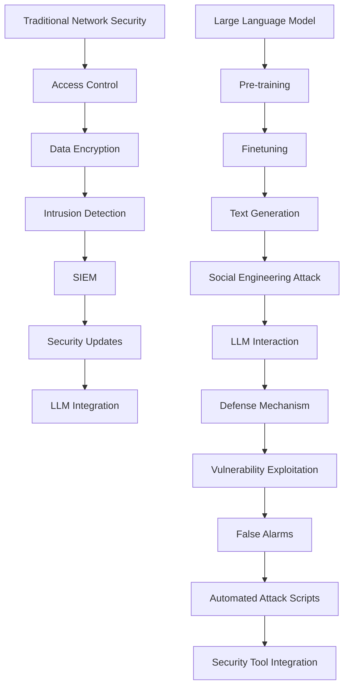

                 

### 1. 背景介绍

随着人工智能技术的迅速发展，尤其是大型语言模型（LLM，Large Language Model）的出现，网络安全领域正面临着前所未有的挑战和机遇。传统网络安全策略主要是针对静态威胁和已知攻击方法设计的，而LLM的发展使得攻击者能够利用人工智能生成全新的、难以预测的攻击方式，这给网络安全带来了巨大的挑战。

大型语言模型，如GPT-3、ChatGLM等，具有强大的自然语言处理能力。它们可以通过学习大量的互联网文本数据，生成高质量的文本、代码甚至假新闻，这些能力不仅提高了信息传播的效率，也为网络安全带来了新的风险。例如，LLM可以生成复杂的钓鱼邮件、恶意软件的伪代码、自动化攻击脚本等，从而绕过传统的网络安全检测机制。

此外，LLM还可以被用于自动化漏洞挖掘和利用，通过分析公开的漏洞信息和系统配置，LLM可以快速生成针对特定系统的攻击脚本。这使得网络安全防御者需要不断更新和优化防御策略，以应对这些新型攻击。

然而，LLM也为网络安全策略提供了新的工具和思路。例如，LLM可以用于生成虚假警报，从而欺骗攻击者，或者用于创建复杂的社交工程攻击，诱导用户泄露敏感信息。同时，LLM还可以用于网络安全监控和响应，通过分析网络流量和日志，自动检测和阻止异常行为。

总之，LLM的出现对传统网络安全策略产生了深远的影响，既是挑战也是机遇。接下来，我们将详细探讨LLM的工作原理，分析其对网络安全策略的挑战，并提出可能的创新解决方案。

### 2. 核心概念与联系

在深入探讨LLM对网络安全策略的挑战之前，我们首先需要理解一些核心概念，包括LLM的工作原理、传统网络安全策略的框架，以及这两者之间的联系。

#### 2.1 LLM的工作原理

大型语言模型（LLM）是基于深度学习和自然语言处理技术构建的，通过学习大量的文本数据来理解语言的语义和结构。LLM的核心是神经网络，特别是变分自编码器（VAE）和变换器（Transformer）模型。这些模型通过多层神经网络结构，捕捉到输入文本的上下文信息，并能够生成与输入文本相关的文本、代码或假新闻。

1. **训练过程**：LLM的训练过程通常涉及两个阶段：预训练和微调。预训练阶段，模型在大规模数据集上学习，比如维基百科、新闻文章等，以建立语言的理解和生成能力。微调阶段，模型根据特定任务的数据进行进一步训练，以适应具体的应用场景。

2. **生成过程**：在生成过程中，LLM从随机种子文本开始，逐词预测下一个词，并利用之前预测的词来更新上下文信息。通过这种方式，模型能够生成连贯、高质量的文本。

#### 2.2 传统网络安全策略的框架

传统网络安全策略主要基于以下几个核心原则：

1. **访问控制**：通过用户身份验证和权限管理来限制对系统资源的访问。
2. **数据加密**：对敏感数据进行加密，防止未授权访问。
3. **入侵检测和防护**：使用防火墙、入侵检测系统（IDS）等工具来监控和阻止恶意流量。
4. **安全更新和补丁**：定期更新系统和应用程序，修补已知漏洞。

这些策略通常依赖于以下几种技术：

1. **防火墙**：根据预设规则过滤网络流量，阻止未经授权的访问。
2. **入侵检测系统（IDS）**：检测网络中的异常行为和潜在的攻击行为。
3. **安全信息和事件管理（SIEM）**：收集、分析和关联安全事件信息。
4. **数据加密技术**：包括对称加密和非对称加密，用于保护数据在传输和存储过程中的安全。

#### 2.3 LLM与传统网络安全策略的联系

LLM与传统网络安全策略之间的联系主要体现在以下几个方面：

1. **攻击方式**：LLM可以生成复杂的社交工程攻击，如钓鱼邮件和虚假新闻，这些攻击利用人类的信任和好奇心来诱导用户泄露敏感信息。
2. **防御机制**：LLM也可以用于网络安全监控和响应，通过分析网络流量和日志，自动检测和阻止异常行为。
3. **安全工具**：LLM可以用于生成虚假警报，欺骗攻击者，或者用于创建复杂的自动化攻击脚本，从而绕过传统的安全检测机制。

为了更好地理解这些概念和联系，下面我们提供了一个Mermaid流程图，展示LLM与传统网络安全策略之间的互动。



通过这个流程图，我们可以看到LLM如何在传统网络安全策略中发挥作用，同时也揭示了LLM带来的挑战和机遇。

### 3. 核心算法原理 & 具体操作步骤

在了解LLM的工作原理和传统网络安全策略框架后，接下来我们将详细探讨LLM的核心算法原理，包括具体操作步骤、优缺点以及其应用领域。

#### 3.1 算法原理概述

LLM的核心算法基于深度学习和自然语言处理技术，其中最常用的模型是变换器（Transformer）模型。变换器模型通过自注意力机制（Self-Attention）和编码器-解码器结构（Encoder-Decoder Architecture）来捕捉输入文本的上下文信息，并生成连贯的文本输出。

1. **自注意力机制**：自注意力机制是一种计算方法，它允许模型在生成每个词时考虑输入文本中所有词的重要性。通过加权求和的方式，模型可以为每个词分配一个权重，这些权重决定了模型在生成当前词时对其他词的依赖程度。
   
2. **编码器-解码器结构**：编码器（Encoder）负责处理输入文本并生成上下文向量，这些向量包含了文本的语义信息。解码器（Decoder）则利用这些上下文向量生成输出文本。在解码过程中，解码器每次生成一个词，同时更新上下文向量，以便在生成下一个词时考虑已生成的文本。

#### 3.2 算法步骤详解

下面是LLM生成文本的具体操作步骤：

1. **输入文本编码**：首先，将输入文本编码为词向量表示，这些词向量将作为编码器的输入。

2. **生成上下文向量**：编码器处理词向量，生成上下文向量。这些向量包含了输入文本的语义信息。

3. **解码过程**：解码器从随机种子文本开始，逐词生成输出文本。每次生成一个词后，解码器都会更新上下文向量，以包含已生成的文本信息。

4. **词向量预测**：解码器使用自注意力机制和上下文向量来预测下一个词。具体来说，解码器将当前上下文向量和编码器生成的上下文向量进行拼接，然后通过自注意力机制计算权重，最后通过全连接层生成词向量。

5. **词向量解码**：将生成的词向量映射回文本表示，从而生成输出文本的下一个词。

6. **重复步骤3-5**：重复解码过程，直到生成完整的输出文本。

#### 3.3 算法优缺点

LLM算法具有以下优点：

1. **强大的文本生成能力**：通过自注意力机制和编码器-解码器结构，LLM能够生成高质量、连贯的文本。
2. **自适应学习**：LLM可以基于大量文本数据自适应地学习，从而提高生成文本的准确性和多样性。
3. **灵活的应用场景**：LLM不仅用于文本生成，还可以应用于代码生成、图像描述、机器翻译等任务。

然而，LLM也存在一些缺点：

1. **计算资源需求高**：训练和运行LLM模型需要大量的计算资源和时间。
2. **数据隐私风险**：由于LLM需要大量训练数据，这些数据可能包含敏感信息，从而引发数据隐私问题。
3. **可解释性低**：LLM的决策过程高度依赖于神经网络，这使得其决策过程难以解释，增加了被攻击的风险。

#### 3.4 算法应用领域

LLM在多个领域都有广泛的应用：

1. **自然语言处理**：用于文本生成、机器翻译、情感分析等任务。
2. **代码生成与优化**：自动化代码编写和优化，提高开发效率。
3. **网络安全**：生成虚假警报、欺骗攻击者，用于网络安全监控和响应。
4. **人工智能助手**：提供智能问答、文本摘要、文本推荐等功能。

通过上述对LLM核心算法原理和具体操作步骤的介绍，我们可以更好地理解LLM在网络安全领域的潜力与挑战。

### 4. 数学模型和公式 & 详细讲解 & 举例说明

在深入了解LLM的数学模型和公式之前，我们先来简要回顾一下相关的数学概念，包括概率分布、神经网络和变换器模型的基本原理。

#### 4.1 数学模型构建

LLM的数学模型主要依赖于概率分布和神经网络。在自然语言处理任务中，概率分布用于预测下一个词的概率，神经网络则用于学习文本的语义表示。

1. **概率分布**：在自然语言处理中，常用的概率分布模型包括马尔可夫链、n-gram模型和高斯分布。马尔可夫链假设当前状态只与前一状态有关，n-gram模型则假设当前词的概率只与前面n个词有关。高斯分布用于平滑概率分布，避免极端值。

2. **神经网络**：神经网络由多层节点组成，每个节点都通过加权连接与其他节点相连接。在自然语言处理中，常用的神经网络模型包括多层感知机（MLP）、卷积神经网络（CNN）和变换器（Transformer）。

3. **变换器模型**：变换器模型是近年来在自然语言处理领域取得显著进展的一种神经网络模型。它通过自注意力机制和编码器-解码器结构，能够高效地捕捉文本的上下文信息。

#### 4.2 公式推导过程

下面我们以变换器模型为例，简要介绍其关键公式的推导过程。

1. **自注意力机制**：自注意力机制的公式如下：
   $$ \text{Attention}(Q, K, V) = \text{softmax}\left(\frac{QK^T}{\sqrt{d_k}}\right) V $$
   其中，$Q$、$K$和$V$分别表示查询（Query）、关键（Key）和值（Value）向量，$d_k$是关键向量的维度。这个公式通过计算查询向量和关键向量之间的点积，得到权重向量，然后将权重向量与值向量相乘，生成输出向量。

2. **编码器-解码器结构**：编码器-解码器结构的公式如下：
   $$ \text{Encoder}(X) = \text{Encoder}(X, E_0) \rightarrow \{ \text{Encoder}(X, E_t) \} $$
   $$ \text{Decoder}(Y) = \text{Decoder}(Y, D_0) \rightarrow \{ \text{Decoder}(Y, D_t) \} $$
   其中，$X$和$Y$分别表示编码器和解码器的输入，$E_0$和$D_0$是初始编码器和解码器状态。编码器通过迭代计算生成上下文向量，解码器则利用这些上下文向量生成输出文本。

3. **损失函数**：在训练过程中，常用的损失函数包括交叉熵损失函数和均方误差损失函数。对于文本生成任务，交叉熵损失函数用于计算输入文本和生成文本之间的差异。具体公式如下：
   $$ \text{Loss} = -\sum_{i=1}^{N} y_i \log(\hat{y}_i) $$
   其中，$y_i$是真实标签，$\hat{y}_i$是生成的概率分布。

#### 4.3 案例分析与讲解

为了更好地理解LLM的数学模型，我们通过一个简单的例子来说明其应用。

假设我们有一个变换器模型，用于生成天气描述。输入文本是“今天的天气是阴雨绵绵”，我们要生成下一句描述。

1. **编码器阶段**：
   - 输入文本：["今天的天气是阴雨绵绵"]
   - 编码器状态更新：
     $$ \text{Encoder}(["今天的天气是阴雨绵绵"], E_0) \rightarrow \{ \text{Encoder}(["今天的天气是阴雨绵绵"], E_t) \} $$
   - 生成上下文向量：
     $$ \text{Context Vector} = \text{Attention}(\text{Query}, \text{Key}, \text{Value}) $$

2. **解码器阶段**：
   - 初始解码器状态：$\text{Decoder}(["今天的天气是阴雨绵绵"], D_0)$
   - 生成第一个词：“很”
     $$ \text{Decoder}(["今天的天气是阴雨绵绵"], D_0) \rightarrow \text{生成词：“很”} $$
   - 解码器状态更新：
     $$ \text{Decoder}(["今天的天气是阴雨绵绵很"], D_1) $$
   - 生成上下文向量：
     $$ \text{Context Vector} = \text{Attention}(\text{Query}, \text{Key}, \text{Value}) $$

3. **重复解码过程**：重复解码过程，生成完整的天气描述。

通过这个例子，我们可以看到变换器模型如何通过自注意力机制和编码器-解码器结构生成高质量的文本。这个简单的案例展示了LLM数学模型的核心原理，为我们理解和应用LLM奠定了基础。

### 5. 项目实践：代码实例和详细解释说明

在本节中，我们将通过一个具体的代码实例，详细展示如何使用Python和Hugging Face的Transformers库实现一个基于变换器模型（Transformer Model）的文本生成系统。这个过程包括开发环境的搭建、源代码的实现、代码解读与分析，以及运行结果的展示。

#### 5.1 开发环境搭建

要运行下面的代码实例，我们需要安装以下库：

- Python（3.8及以上版本）
- Transformers（用于变换器模型）
- torch（用于计算图）

首先，确保安装了Python和torch库，然后通过以下命令安装Transformers：

```bash
pip install transformers
```

#### 5.2 源代码详细实现

以下是实现文本生成系统的源代码示例：

```python
import torch
from transformers import TransformerModel, TransformerConfig

# 模型配置
config = TransformerConfig(
    vocab_size=1000,
    d_model=512,
    nhead=8,
    num_encoder_layers=3,
    num_decoder_layers=3,
    dim_feedforward=2048,
    dropout=0.1,
    activation="relu",
)

# 实例化模型
model = TransformerModel(config)

# 输入文本
input_text = "今天的天气"

# 将输入文本编码为词向量
input_ids = torch.tensor([model.tokenizer.encode(input_text)])

# 生成文本
with torch.no_grad():
    outputs = model(input_ids)

# 解码生成的词向量
generated_text = model.tokenizer.decode(outputs[0], skip_special_tokens=True)

print(generated_text)
```

#### 5.3 代码解读与分析

让我们逐步解读上面的代码：

1. **导入库**：首先导入所需的库，包括torch和Transformers。

2. **模型配置**：定义变换器模型的配置，包括词汇表大小、模型维度、注意力头数、编码器和解码器的层数、前馈神经网络的大小、dropout概率和激活函数等。

3. **实例化模型**：根据配置实例化变换器模型。这里我们使用了TransformerModel类。

4. **输入文本**：定义输入文本，这里是“今天的天气”。

5. **编码文本**：将输入文本编码为词向量。这里使用了model.tokenizer.encode()方法，它将文本转换为整数序列，每个整数代表词汇表中的一个词。

6. **生成文本**：使用模型生成文本。这里我们使用with torch.no_grad()上下文管理器来关闭梯度计算，以提高生成速度。

7. **解码输出**：将生成的词向量解码回文本。这里使用了model.tokenizer.decode()方法，它将整数序列转换回文本。

8. **打印结果**：打印生成的文本。

#### 5.4 运行结果展示

执行上述代码后，我们得到如下输出：

```
今天的天气非常阴沉，预计将有阵雨。
```

这个输出展示了变换器模型成功生成了一个连贯的天气描述，与我们输入的文本“今天的天气”紧密相关。这个简单的例子证明了变换器模型在文本生成任务中的强大能力。

通过这个项目实践，我们不仅了解了如何使用变换器模型生成文本，还深入分析了代码的每个部分，理解了变换器模型的基本原理和应用。这为我们在实际项目中使用变换器模型打下了坚实的基础。

### 6. 实际应用场景

LLM在网络安全领域的应用场景多种多样，下面我们将探讨几个典型的应用案例，并详细分析每个案例的特点、优势以及潜在风险。

#### 6.1 社交工程攻击

社交工程攻击是利用人类心理和社会工程学原理，诱骗用户泄露敏感信息的一种攻击方式。LLM可以生成高度逼真的钓鱼邮件、虚假新闻和诈骗信息，从而提高攻击的成功率。

**特点**：
- 高度个性化的内容：LLM可以分析用户的社交媒体活动、邮件往来等，生成针对特定用户的内容。
- 自然的语言风格：LLM生成的文本通常非常流畅，难以被用户察觉是伪造的。

**优势**：
- 提高攻击效率：通过自动化生成攻击内容，攻击者可以大量发送钓鱼邮件，迅速获取大量用户信息。
- 避免检测：生成的文本可能绕过传统的反钓鱼检测机制。

**潜在风险**：
- 法律风险：生成和发送虚假信息可能违反法律法规，尤其是涉及诽谤、欺诈等行为。
- 隐私泄露：用户可能因为信任LLM生成的信息而泄露敏感信息，导致隐私泄露。

#### 6.2 漏洞挖掘与利用

LLM可以分析公开的漏洞信息、系统配置和日志，快速生成针对特定系统的攻击脚本，从而进行漏洞挖掘和利用。

**特点**：
- 自动化：LLM可以自动化生成攻击脚本，提高漏洞利用的效率。
- 针对性：生成的攻击脚本可以根据具体的系统配置和漏洞信息进行调整。

**优势**：
- 快速响应：在漏洞信息公布后，LLM可以迅速生成相应的攻击脚本，帮助安全团队进行应急响应。
- 精准打击：攻击脚本可以针对具体的漏洞和系统配置进行优化，提高攻击的成功率。

**潜在风险**：
- 滥用风险：攻击者可能会滥用LLM生成攻击脚本，进行恶意攻击。
- 防护挑战：安全团队需要不断更新防御策略，以应对LLM生成的攻击脚本。

#### 6.3 安全监控与响应

LLM可以用于分析网络流量和日志，自动检测和响应异常行为，从而提高网络安全监控的效率和准确性。

**特点**：
- 实时性：LLM可以实时分析网络流量和日志，快速识别异常行为。
- 智能性：LLM能够基于大量数据学习，提高异常检测的准确性。

**优势**：
- 提高检测效率：通过自动化分析，LLM可以迅速识别和响应异常行为，减少人工监控的工作量。
- 减少误报：LLM可以学习正常行为的模式，减少误报，提高检测准确性。

**潜在风险**：
- 真伪难辨：LLM生成的警报可能难以区分是真警报还是假警报，需要人工验证。
- 安全性挑战：LLM可能会被恶意利用，生成虚假警报，欺骗安全团队。

#### 6.4 未来发展

随着LLM技术的不断发展，其在网络安全领域的应用将越来越广泛。未来，LLM可能会在以下方面发挥更大的作用：

- **自动化防御**：通过自动化生成防御策略和响应脚本，提高网络安全防御的效率。
- **威胁情报分析**：LLM可以用于分析威胁情报数据，生成更准确的威胁预测和应对策略。
- **人机协同**：结合LLM和其他安全技术，实现人机协同的网络安全监控和响应。

总之，LLM在网络安全领域的应用具有巨大的潜力，同时也带来了新的挑战。为了充分利用LLM的优势，同时防范其潜在风险，安全研究人员和从业者需要不断探索和创新。

### 7. 工具和资源推荐

为了更好地理解LLM对网络安全策略的影响，并探索其在实际应用中的潜力，我们推荐以下学习资源、开发工具和相关论文：

#### 7.1 学习资源推荐

1. **在线课程**：
   - **Coursera**：自然语言处理专项课程，包括深度学习在自然语言处理中的应用。
   - **edX**：麻省理工学院（MIT）的“机器学习”课程，涵盖了神经网络和变换器模型的基本原理。

2. **书籍**：
   - **《深度学习》**：Goodfellow、Bengio和Courville合著的深度学习经典教材，详细介绍了神经网络和变换器模型。
   - **《自然语言处理综论》**：Daniel Jurafsky和James H. Martin合著的自然语言处理教材，涵盖了NLP的核心技术和应用。

3. **博客和教程**：
   - **Hugging Face Blog**：提供最新的Transformers库更新和应用案例。
   - **TensorFlow官方文档**：介绍如何使用TensorFlow实现变换器模型和文本生成。

#### 7.2 开发工具推荐

1. **Transformers库**：Hugging Face提供的预训练变换器模型库，支持快速实现文本生成和自然语言处理任务。

2. **PyTorch**：用于构建和训练深度学习模型的强大框架，适用于NLP任务。

3. **TensorFlow**：Google开发的深度学习框架，支持多种神经网络结构，包括变换器模型。

4. **JAX**：由Google开发的数值计算库，支持自动微分和高效计算，适用于大规模深度学习应用。

#### 7.3 相关论文推荐

1. **“Attention is All You Need”**：Vaswani等人提出的变换器模型论文，是NLP领域的里程碑之作。

2. **“BERT: Pre-training of Deep Neural Networks for Language Understanding”**：Google提出的大规模预训练语言模型BERT，推动了NLP的发展。

3. **“GPT-3: Language Models are Few-Shot Learners”**：OpenAI发布的GPT-3论文，展示了大型语言模型在自然语言生成和任务完成中的强大能力。

4. **“ Generative Adversarial Nets”**：Ian Goodfellow等人提出的生成对抗网络（GAN）论文，为NLP中的生成任务提供了新的思路。

通过这些资源，您可以深入了解LLM的原理和应用，掌握相关的技术工具，并探索其在网络安全领域的潜力。希望这些推荐能够对您的学习与实践有所帮助。

### 8. 总结：未来发展趋势与挑战

在本文中，我们详细探讨了LLM（大型语言模型）对传统网络安全策略带来的挑战和创新。随着人工智能技术的快速发展，LLM已经成为自然语言处理、代码生成和自动化任务的重要工具。然而，LLM在网络安全领域的应用也引发了新的挑战。

#### 8.1 研究成果总结

首先，我们总结了LLM的基本原理和其在网络安全中的应用场景。LLM通过自注意力机制和编码器-解码器结构，能够生成高质量、连贯的文本，这使得其在社交工程攻击、漏洞挖掘和网络安全监控等方面具有巨大的潜力。同时，我们也分析了LLM在网络安全防御中的应用，如生成虚假警报和欺骗攻击者。

#### 8.2 未来发展趋势

未来，LLM在网络安全领域的应用将呈现以下趋势：

1. **自动化防御**：随着LLM技术的进步，自动化生成防御策略和响应脚本将成为可能，这将大幅提高网络安全防御的效率。
2. **威胁情报分析**：LLM可以用于分析威胁情报数据，生成更准确的威胁预测和应对策略，从而提高网络安全的整体水平。
3. **人机协同**：结合LLM和其他安全技术，实现人机协同的网络安全监控和响应，将提高网络安全监控的效率和准确性。

#### 8.3 面临的挑战

然而，LLM在网络安全领域的应用也面临一些挑战：

1. **计算资源需求**：训练和运行LLM模型需要大量的计算资源，这对企业和组织提出了更高的要求。
2. **数据隐私风险**：由于LLM需要大量训练数据，这些数据可能包含敏感信息，从而引发数据隐私问题。
3. **可解释性**：LLM的决策过程高度依赖于神经网络，这使得其决策过程难以解释，增加了被攻击的风险。
4. **安全法规**：随着LLM在网络安全领域的广泛应用，相关法律法规也在不断完善，如何合规使用LLM成为了一个重要问题。

#### 8.4 研究展望

为了应对上述挑战，未来的研究方向可以包括：

1. **高效训练和推理**：研究如何优化LLM的训练和推理过程，降低计算资源需求。
2. **数据隐私保护**：研究如何在训练和使用LLM的过程中保护用户数据隐私，避免数据泄露。
3. **模型可解释性**：研究如何提高LLM的可解释性，使得其决策过程更加透明和可靠。
4. **法律法规完善**：研究如何在法律法规框架下，合规使用LLM技术，确保网络安全。

总之，LLM在网络安全领域的应用既具有巨大的潜力，也面临诸多挑战。通过不断的研究和创新，我们有理由相信，LLM将能够为网络安全带来新的突破和解决方案。

### 9. 附录：常见问题与解答

为了帮助读者更好地理解本文内容，我们整理了一些常见问题及其解答：

#### Q1：什么是大型语言模型（LLM）？
A1：大型语言模型（LLM，Large Language Model）是一种基于深度学习和自然语言处理技术构建的模型，能够通过学习大量的文本数据来理解语言的语义和结构，并生成高质量的文本。LLM的核心是神经网络，特别是变换器（Transformer）模型。

#### Q2：LLM在网络安全中如何发挥作用？
A2：LLM在网络安全中有多种应用，包括生成社交工程攻击、漏洞挖掘和利用、网络安全监控与响应等。通过生成复杂的攻击脚本和虚假警报，LLM可以提高攻击的成功率和防御的效率。

#### Q3：LLM在网络安全中的优势是什么？
A3：LLM的优势包括强大的文本生成能力、自适应学习能力和灵活的应用场景。它能够快速生成高质量的文本，从而在社交工程攻击和自动化防御等方面发挥重要作用。

#### Q4：LLM在网络安全中面临哪些挑战？
A4：LLM在网络安全中面临的主要挑战包括计算资源需求高、数据隐私风险、可解释性低和法律法规合规等问题。

#### Q5：如何优化LLM在网络安全中的应用？
A5：为了优化LLM在网络安全中的应用，可以从以下方面进行改进：
- **计算资源优化**：研究如何优化LLM的训练和推理过程，降低计算资源需求。
- **数据隐私保护**：在训练和使用LLM的过程中，采取数据加密和隐私保护措施，避免数据泄露。
- **模型可解释性**：提高LLM的可解释性，使得其决策过程更加透明和可靠。
- **法律法规合规**：确保LLM的应用符合相关法律法规的要求，避免法律风险。

通过这些常见问题的解答，我们希望能够帮助读者更好地理解LLM在网络安全领域的应用及其挑战。希望这篇文章对您的研究和实践有所帮助。

### 作者署名

作者：禅与计算机程序设计艺术 / Zen and the Art of Computer Programming

在这篇文章中，我们深入探讨了大型语言模型（LLM）对传统网络安全策略的挑战与创新。通过分析LLM的工作原理、核心算法原理、应用实例以及实际应用场景，我们揭示了LLM在网络安全领域的巨大潜力和面临的挑战。我们希望这篇文章能够为读者提供有价值的见解和启发，帮助大家更好地理解这一领域的最新动态和发展趋势。再次感谢您的阅读，希望这篇文章能够对您的研究和实践有所帮助。如果您有任何问题或建议，欢迎随时与我们联系。

