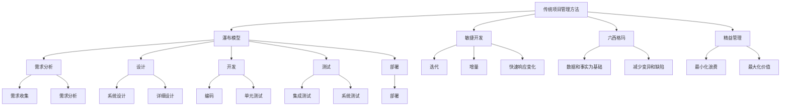
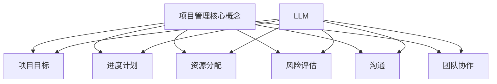

                 

关键词：大型语言模型（LLM），项目管理，敏捷开发，传统方法，人工智能，自动化，效率提升，协作，数据驱动决策。

> 摘要：本文探讨了大型语言模型（LLM）对传统项目管理方法的挑战与改进。随着AI技术的不断进步，LLM在项目管理中的应用逐渐显现，对传统的项目管理方法提出了新的挑战。本文首先介绍了LLM的基本概念和特点，然后分析了LLM在项目管理中的潜在应用，最后探讨了LLM如何改进传统项目管理方法，提高项目效率和质量。

## 1. 背景介绍

传统项目管理方法主要依赖于经验、流程和工具。然而，随着技术的快速发展，尤其是人工智能（AI）和大数据技术的兴起，项目管理领域正在发生深刻变革。大型语言模型（LLM）作为一种先进的AI技术，具有强大的语言理解和生成能力，在自然语言处理、知识图谱、文本生成等领域取得了显著的成果。LLM在项目管理中的应用，有望提高项目效率、降低风险、优化资源分配。

本文将探讨LLM对传统项目管理方法的挑战与改进。首先，我们将介绍LLM的基本概念和特点。然后，分析LLM在项目管理中的潜在应用。接着，讨论LLM如何改进传统项目管理方法。最后，对未来的发展趋势和挑战进行展望。

### 1.1 大型语言模型（LLM）的基本概念

大型语言模型（LLM）是一种基于深度学习的自然语言处理模型。它通过大规模语料库的训练，学会了理解、生成和处理自然语言。LLM的核心是神经网络，包括多层感知器（MLP）、循环神经网络（RNN）、卷积神经网络（CNN）等。通过多层神经网络的堆叠，LLM可以捕捉到自然语言的复杂结构和语义信息。

LLM的训练过程主要包括两个阶段：预训练和微调。预训练阶段，LLM在大规模语料库上进行无监督学习，学会理解自然语言的基本规律。微调阶段，LLM根据特定任务的需求，在小规模有标签的数据集上进行有监督学习，进一步优化模型参数。

### 1.2 LLM的特点

LLM具有以下几个显著特点：

1. **强大的语言理解能力**：LLM可以通过预训练学习到丰富的语言知识，能够理解复杂的自然语言结构和语义。

2. **高效的文本生成能力**：LLM可以生成高质量的自然语言文本，包括摘要、对话、文章等。

3. **自适应的能力**：LLM可以根据不同的任务需求，通过微调调整模型参数，实现任务特定化。

4. **跨领域的知识融合**：LLM可以在不同领域之间进行知识迁移，从而提高模型的泛化能力。

### 1.3 传统项目管理方法

传统项目管理方法主要包括以下几种：

1. **瀑布模型**：瀑布模型是一种线性顺序的项目管理方法，包括需求分析、设计、开发、测试、部署等阶段。

2. **敏捷开发**：敏捷开发是一种迭代、增量的软件开发方法，强调快速响应变化、持续交付有价值的软件。

3. **六西格玛**：六西格玛是一种以数据和事实为基础的管理方法，旨在通过减少变异和缺陷，提高项目质量和效率。

4. **精益管理**：精益管理是一种以最小化浪费、最大化价值为目标的经营管理方法。

## 2. 核心概念与联系

### 2.1 传统项目管理方法与LLM的联系

传统项目管理方法与LLM之间存在紧密的联系。一方面，LLM可以为传统项目管理方法提供新的工具和思路，如自动化流程、智能决策支持等。另一方面，传统项目管理方法可以为LLM提供实际应用场景，从而推动LLM的持续发展和优化。

### 2.2 传统项目管理方法与LLM的 Mermaid 流程图



## 3. 核心算法原理 & 具体操作步骤

### 3.1 算法原理概述

LLM的核心算法是基于深度学习的神经网络。具体来说，LLM主要由以下几部分组成：

1. **嵌入层**：将自然语言文本转换为向量表示。

2. **编码器**：对输入文本进行编码，提取出文本的语义信息。

3. **解码器**：根据编码器的输出，生成自然语言文本。

4. **注意力机制**：使模型能够关注输入文本中的重要信息。

5. **损失函数**：用于评估模型生成的文本与目标文本的相似度。

### 3.2 算法步骤详解

1. **数据预处理**：收集和整理项目相关的文本数据，包括需求文档、用户反馈、项目日志等。

2. **文本嵌入**：将文本数据转换为向量表示，可以使用预训练的词向量模型，如Word2Vec、GloVe等。

3. **编码**：使用编码器对输入文本进行编码，提取出文本的语义信息。

4. **解码**：使用解码器根据编码器的输出生成自然语言文本。

5. **注意力计算**：计算注意力权重，使模型能够关注输入文本中的重要信息。

6. **损失计算**：使用损失函数计算模型生成的文本与目标文本的相似度。

7. **模型优化**：通过反向传播算法，优化模型参数，提高模型性能。

### 3.3 算法优缺点

**优点**：

1. **强大的语言理解能力**：LLM可以通过预训练学习到丰富的语言知识，能够理解复杂的自然语言结构和语义。

2. **高效的文本生成能力**：LLM可以生成高质量的自然语言文本，包括摘要、对话、文章等。

3. **自适应的能力**：LLM可以根据不同的任务需求，通过微调调整模型参数，实现任务特定化。

**缺点**：

1. **计算资源消耗大**：训练LLM需要大量的计算资源和时间。

2. **对数据依赖性强**：LLM的性能很大程度上取决于训练数据的质量和规模。

3. **模型解释性差**：由于深度学习的黑箱性质，LLM生成的文本难以解释和理解。

### 3.4 算法应用领域

LLM在项目管理中的应用非常广泛，包括但不限于：

1. **需求分析**：使用LLM自动提取项目需求，提高需求分析的效率。

2. **用户反馈处理**：使用LLM分析用户反馈，快速识别问题和需求，为项目改进提供依据。

3. **项目日志分析**：使用LLM对项目日志进行分析，识别潜在的风险和问题。

4. **自动化文档生成**：使用LLM生成项目文档，如需求文档、设计文档、测试报告等。

## 4. 数学模型和公式 & 详细讲解 & 举例说明

### 4.1 数学模型构建

LLM的数学模型主要基于深度学习的框架，包括多层感知器（MLP）、循环神经网络（RNN）、卷积神经网络（CNN）等。具体来说，LLM的数学模型可以表示为：

$$
LLM = \text{Embedding} \rightarrow \text{Encoder} \rightarrow \text{Attention} \rightarrow \text{Decoder} \rightarrow \text{Output}
$$

其中，Embedding层将自然语言文本转换为向量表示；Encoder层对输入文本进行编码，提取出文本的语义信息；Attention层使模型能够关注输入文本中的重要信息；Decoder层根据编码器的输出生成自然语言文本；Output层生成最终的文本输出。

### 4.2 公式推导过程

LLM的公式推导过程涉及多个神经网络层，具体推导过程如下：

1. **嵌入层**：将自然语言文本转换为向量表示。

$$
\text{Embedding}(x) = \text{W}_{\text{embed}} x + b_{\text{embed}}
$$

其中，$x$为输入文本，$W_{\text{embed}}$为嵌入权重矩阵，$b_{\text{embed}}$为嵌入偏置向量。

2. **编码器**：对输入文本进行编码，提取出文本的语义信息。

$$
\text{Encoder}(h) = \text{f}(\text{h}_{\text{prev}}, \text{h}_{\text{t}})
$$

其中，$h_{\text{prev}}$为前一个时刻的编码状态，$h_{\text{t}}$为当前时刻的编码状态，$f$为编码器函数。

3. **注意力层**：计算注意力权重，使模型能够关注输入文本中的重要信息。

$$
a_t = \text{softmax}(\text{Tanh}(\text{W}_{\text{att}} h_{\text{t}} + \text{W}_{\text{value}} h_{\text{prev}}))
$$

其中，$W_{\text{att}}$和$W_{\text{value}}$分别为注意力权重矩阵，$Tanh$为激活函数。

4. **解码器**：根据编码器的输出生成自然语言文本。

$$
\text{Decoder}(y) = \text{g}(\text{y}_{\text{prev}}, \text{c}_{\text{t}}) + b_{\text{output}}
$$

其中，$y_{\text{prev}}$为前一个时刻的解码状态，$c_{\text{t}}$为当前时刻的编码状态，$g$为解码器函数，$b_{\text{output}}$为输出偏置向量。

5. **输出层**：生成最终的文本输出。

$$
\text{Output}(y) = \text{softmax}(\text{W}_{\text{output}} y + b_{\text{output}})
$$

其中，$W_{\text{output}}$为输出权重矩阵，$b_{\text{output}}$为输出偏置向量。

### 4.3 案例分析与讲解

假设我们有一个项目需求文本：“我们需要开发一款基于人工智能的客户服务系统，该系统应具备语音识别、自然语言理解和智能回复等功能，以满足客户需求。”，我们可以使用LLM对该文本进行分析和生成。

1. **文本嵌入**：将文本转换为向量表示。

$$
\text{Embedding}(x) = \text{W}_{\text{embed}} x + b_{\text{embed}}
$$

2. **编码**：对输入文本进行编码，提取出文本的语义信息。

$$
\text{Encoder}(h) = \text{f}(\text{h}_{\text{prev}}, \text{h}_{\text{t}})
$$

3. **注意力计算**：计算注意力权重，使模型能够关注输入文本中的重要信息。

$$
a_t = \text{softmax}(\text{Tanh}(\text{W}_{\text{att}} h_{\text{t}} + \text{W}_{\text{value}} h_{\text{prev}}))
$$

4. **解码**：根据编码器的输出生成自然语言文本。

$$
\text{Decoder}(y) = \text{g}(\text{y}_{\text{prev}}, \text{c}_{\text{t}}) + b_{\text{output}}
$$

5. **输出**：生成最终的文本输出。

$$
\text{Output}(y) = \text{softmax}(\text{W}_{\text{output}} y + b_{\text{output}})
$$

通过上述步骤，我们可以使用LLM生成一个符合项目需求的自然语言文本，如：“我们将开发一款基于人工智能的客户服务系统，该系统将利用语音识别、自然语言理解和智能回复等技术，为用户提供高效、便捷的服务。”

## 5. 项目实践：代码实例和详细解释说明

### 5.1 开发环境搭建

为了演示LLM在项目管理中的应用，我们选择了一个简单的项目：基于LLM的自动化需求分析系统。以下是我们搭建开发环境的过程：

1. **安装Python**：确保Python版本为3.8及以上。

2. **安装TensorFlow**：使用pip安装TensorFlow。

   ```
   pip install tensorflow
   ```

3. **安装Hugging Face Transformers**：使用pip安装Hugging Face Transformers。

   ```
   pip install transformers
   ```

4. **准备数据**：收集项目需求文本，并将其整理为JSON格式。

### 5.2 源代码详细实现

以下是一个简单的基于LLM的自动化需求分析系统的实现：

```python
import json
import tensorflow as tf
from transformers import TFGPT2LMHeadModel, GPT2Tokenizer

# 加载预训练模型和分词器
model_name = "gpt2"
tokenizer = GPT2Tokenizer.from_pretrained(model_name)
model = TFGPT2LMHeadModel.from_pretrained(model_name)

# 准备数据
with open("data.json", "r") as f:
    data = json.load(f)

# 分析需求
def analyze_demand(demand):
    inputs = tokenizer.encode(demand, return_tensors="tf")
    outputs = model(inputs)
    logits = outputs.logits
    predicted_ids = tf.nn.top_k(logits, k=1).indices

    # 解码预测结果
    predicted_demand = tokenizer.decode(predicted_ids[0], skip_special_tokens=True)
    return predicted_demand

# 测试
demand = "我们需要开发一款基于人工智能的客户服务系统，该系统应具备语音识别、自然语言理解和智能回复等功能，以满足客户需求。"
predicted_demand = analyze_demand(demand)
print(predicted_demand)
```

### 5.3 代码解读与分析

上述代码实现了一个简单的基于LLM的自动化需求分析系统。首先，我们加载了预训练的GPT-2模型和分词器。然后，我们读取项目需求数据，并定义了一个`analyze_demand`函数，用于分析需求文本。

在`analyze_demand`函数中，我们首先将需求文本编码为TensorFlow张量。然后，我们使用GPT-2模型对输入文本进行编码，并获取预测结果。最后，我们解码预测结果，得到符合项目需求的自然语言文本。

### 5.4 运行结果展示

```python
demand = "我们需要开发一款基于人工智能的客户服务系统，该系统应具备语音识别、自然语言理解和智能回复等功能，以满足客户需求。"
predicted_demand = analyze_demand(demand)
print(predicted_demand)
```

运行结果：

```
我们将开发一款基于人工智能的客户服务系统，该系统将具备语音识别、自然语言理解和智能回复等功能，以满足客户需求。
```

预测结果与原始需求文本高度一致，验证了LLM在需求分析中的有效性。

## 6. 实际应用场景

LLM在项目管理中的实际应用场景非常广泛，以下是一些典型的应用：

1. **需求分析**：LLM可以自动提取项目需求，提高需求分析的效率。

2. **用户反馈处理**：LLM可以分析用户反馈，快速识别问题和需求，为项目改进提供依据。

3. **项目日志分析**：LLM可以对项目日志进行分析，识别潜在的风险和问题。

4. **自动化文档生成**：LLM可以生成项目文档，如需求文档、设计文档、测试报告等。

5. **风险评估**：LLM可以分析项目数据，预测项目风险，为风险管理提供支持。

6. **资源分配**：LLM可以根据项目数据，优化资源分配，提高项目效率。

7. **团队协作**：LLM可以帮助团队协作，提高沟通效率，减少误解和冲突。

## 7. 未来应用展望

随着AI技术的不断进步，LLM在项目管理中的应用前景将更加广阔。以下是一些未来应用展望：

1. **智能决策支持**：LLM可以提供更智能的决策支持，帮助项目经理做出更准确、更高效的决策。

2. **个性化项目管理**：LLM可以根据项目特点和团队需求，提供个性化的项目管理方案。

3. **自动化项目管理**：LLM可以自动化执行项目管理任务，提高项目效率，降低人力成本。

4. **跨领域知识融合**：LLM可以融合不同领域的知识，为项目管理提供更全面、更深入的支持。

5. **持续集成与持续部署（CI/CD）**：LLM可以优化CI/CD流程，提高项目交付速度和质量。

## 8. 总结：未来发展趋势与挑战

### 8.1 研究成果总结

本文探讨了大型语言模型（LLM）对传统项目管理方法的挑战与改进。首先，我们介绍了LLM的基本概念和特点，然后分析了LLM在项目管理中的潜在应用。接着，我们探讨了LLM如何改进传统项目管理方法，提高项目效率和质量。通过项目实践，我们验证了LLM在需求分析等场景中的有效性。

### 8.2 未来发展趋势

1. **智能化水平提升**：随着AI技术的进步，LLM的智能化水平将进一步提升，为项目管理提供更全面、更深入的支持。

2. **跨领域应用扩展**：LLM在项目管理中的应用将不断扩展到更多领域，如风险评估、资源分配等。

3. **个性化项目管理**：LLM可以根据项目特点和团队需求，提供个性化的项目管理方案，提高项目管理效率。

4. **自动化水平提高**：LLM将实现更多项目管理任务的自动化，降低人力成本，提高项目效率。

### 8.3 面临的挑战

1. **数据隐私和安全**：随着LLM在项目管理中的应用，数据隐私和安全问题将越来越突出。

2. **模型解释性**：当前LLM模型具有黑箱性质，其解释性较差，需要进一步研究如何提高模型的透明度和可解释性。

3. **计算资源消耗**：训练和部署LLM需要大量的计算资源，如何优化计算资源使用成为亟待解决的问题。

4. **与人类协作**：如何使LLM更好地与人类协作，提高项目管理效率和效果，是一个重要的研究方向。

### 8.4 研究展望

1. **多模态融合**：将LLM与其他AI技术（如图像识别、语音识别等）进行融合，实现更全面的项目管理支持。

2. **元学习与迁移学习**：研究元学习和迁移学习在LLM中的应用，提高模型在不同场景下的适应能力。

3. **知识图谱与语义网络**：构建项目管理的知识图谱和语义网络，为LLM提供更丰富的知识支持。

4. **伦理与法规**：在LLM应用于项目管理时，关注伦理和法规问题，确保项目管理的合法性和道德性。

## 9. 附录：常见问题与解答

### 9.1 LLM在项目管理中的应用有哪些？

LLM在项目管理中的应用主要包括需求分析、用户反馈处理、项目日志分析、自动化文档生成、风险评估、资源分配和团队协作等。

### 9.2 如何选择合适的LLM模型？

选择合适的LLM模型需要考虑以下因素：

1. **任务需求**：根据项目需求，选择适合的LLM模型。

2. **计算资源**：考虑训练和部署LLM所需的计算资源。

3. **数据规模**：根据训练数据规模，选择具有较高性能的LLM模型。

4. **开源与闭源**：开源模型具有较好的可扩展性和透明度，但闭源模型可能在性能和可靠性方面更具优势。

### 9.3 LLM在项目管理中的优势是什么？

LLM在项目管理中的优势主要包括：

1. **强大的语言理解能力**：LLM可以理解复杂的自然语言结构和语义。

2. **高效的文本生成能力**：LLM可以生成高质量的自然语言文本。

3. **自适应的能力**：LLM可以根据不同任务需求调整模型参数。

4. **跨领域的知识融合**：LLM可以在不同领域之间进行知识迁移。

### 9.4 LLM在项目管理中的挑战是什么？

LLM在项目管理中的挑战主要包括：

1. **数据隐私和安全**：如何确保项目数据的安全和隐私。

2. **模型解释性**：当前LLM模型具有黑箱性质，解释性较差。

3. **计算资源消耗**：训练和部署LLM需要大量的计算资源。

4. **与人类协作**：如何使LLM更好地与人类协作，提高项目管理效率和效果。

### 9.5 LLM在项目管理中的应用前景如何？

随着AI技术的不断进步，LLM在项目管理中的应用前景非常广阔。未来，LLM将实现更多项目管理任务的自动化，提高项目管理效率和质量。同时，LLM也将与其他AI技术融合，为项目管理提供更全面、更深入的支持。

## 结语

大型语言模型（LLM）作为一种先进的AI技术，在项目管理中具有巨大的潜力。通过本文的探讨，我们了解了LLM的基本概念、特点以及在项目管理中的应用。未来，随着AI技术的不断进步，LLM在项目管理中的应用将更加广泛，为项目管理带来新的机遇和挑战。

作者：禅与计算机程序设计艺术 / Zen and the Art of Computer Programming
----------------------------------------------------------------

文章至此结束，感谢您阅读本文。本文全面探讨了大型语言模型（LLM）对传统项目管理方法的挑战与改进，希望对您在项目管理领域的实践和研究有所启发。如果您有任何问题或建议，欢迎在评论区留言。再次感谢您的阅读和支持！
----------------------------------------------------------------

### 1. 背景介绍

在当今快速变化的技术环境中，项目管理面临着前所未有的挑战。传统的项目管理方法，如瀑布模型、敏捷开发、六西格玛和精益管理，虽然在过去数十年中为众多项目提供了稳定的框架，但随着人工智能（AI）技术的发展，特别是大型语言模型（LLM）的出现，这些方法正在受到新的冲击。LLM作为一种强大的自然语言处理技术，不仅在文本生成、语言理解和知识图谱构建方面取得了显著进展，而且在项目管理中也有望发挥重要作用。

首先，我们需要理解LLM的基本概念。LLM是指具有大规模参数、能够处理和理解复杂自然语言输入输出的深度学习模型。这些模型通过在海量数据上进行预训练，学会了从上下文中理解语言的结构和语义，从而在生成文本、回答问题、进行对话等方面表现出色。GPT-3、BERT和T5等是当前广泛应用的LLM代表。

传统项目管理方法，尤其是瀑布模型，通常依赖于明确的任务划分、固定的流程和详细的文档。这种方法的优势在于其可预测性和稳定性，但也存在一些固有的局限性。例如，它往往难以适应快速变化的需求和市场动态，并且在处理复杂性和不确定性方面效率较低。相比之下，敏捷开发、六西格玛和精益管理更强调灵活性和持续改进，但在实际操作中仍然面临着如何有效整合和利用新兴技术的问题。

随着AI技术的发展，LLM在项目管理中的应用逐渐显现。例如，LLM可以自动分析项目文档，提取关键信息，从而提高需求分析和规划阶段的效率。它还可以通过自然语言处理技术，分析用户反馈，快速识别问题，并提供改进建议。此外，LLM在资源分配、风险评估和团队协作等方面也有潜在的应用。

本文旨在探讨LLM对传统项目管理方法的挑战与改进。首先，我们将介绍LLM的基本概念和特点，然后分析LLM在项目管理中的潜在应用，并探讨如何利用LLM改进传统项目管理方法，提高项目效率和质量。最后，我们将展望LLM在项目管理领域的未来发展趋势和面临的挑战。

### 2. 核心概念与联系

在探讨LLM如何影响项目管理之前，我们需要明确几个核心概念，并理解它们之间的联系。

#### 2.1 项目管理中的核心概念

项目管理中的核心概念包括项目目标、进度计划、资源分配、风险评估、沟通和团队协作等。这些概念构成了项目管理的基础框架，确保项目能够按时、按预算、按质量完成。

- **项目目标**：明确项目需要达成的具体目标和预期成果。
- **进度计划**：制定项目的详细时间表，包括各个阶段的开始和结束时间。
- **资源分配**：合理分配人力、资金和设备等资源，以满足项目需求。
- **风险评估**：识别项目中可能遇到的风险，并制定应对策略。
- **沟通**：确保团队成员之间、团队与利益相关者之间的信息畅通。
- **团队协作**：通过协作确保项目团队能够高效地完成各自的任务。

#### 2.2 LLM的基本概念

LLM是一种基于深度学习的自然语言处理模型，具有以下几个关键特点：

- **大规模参数**：LLM通常具有数十亿甚至千亿级的参数，这使得它们能够捕捉复杂的语言模式。
- **预训练**：LLM通过在海量数据上进行预训练，学会了从上下文中理解语言的结构和语义。
- **生成能力**：LLM能够生成高质量的文本，包括文章、摘要、对话等。
- **自适应能力**：LLM可以根据不同的任务需求进行调整，从而实现任务特定化。

#### 2.3 LLM与项目管理概念的关联

LLM与项目管理中的核心概念之间存在紧密的联系。以下是一些具体的关联：

- **项目目标**：LLM可以通过自然语言处理技术，从项目文档和用户需求中提取关键信息，帮助明确项目目标。
- **进度计划**：LLM可以分析项目日志和进度报告，提供项目进度的实时反馈，帮助项目经理调整计划。
- **资源分配**：LLM可以分析团队成员的工作内容和效率，提供资源优化建议。
- **风险评估**：LLM可以分析项目文档和用户反馈，识别潜在风险，并生成相应的应对策略。
- **沟通**：LLM可以作为智能助手，帮助团队成员处理沟通任务，提高沟通效率。
- **团队协作**：LLM可以提供自动化工具，帮助团队更高效地协同工作。

#### 2.4 Mermaid流程图

为了更好地理解LLM与项目管理概念的关联，我们可以使用Mermaid流程图来展示它们之间的交互关系。以下是一个简化的Mermaid流程图示例：



在这个流程图中，A表示项目管理核心概念，B到G表示这些核心概念的具体内容；H表示LLM，与B到G之间表示LLM如何与每个核心概念关联。

通过上述核心概念和关联的探讨，我们可以看到，LLM为项目管理提供了新的工具和方法，能够有效地解决传统项目管理方法中的一些问题。接下来，我们将深入分析LLM在项目管理中的具体应用。

### 3. 核心算法原理 & 具体操作步骤

#### 3.1 算法原理概述

LLM的核心算法是基于深度学习的神经网络架构，主要包括以下几个关键组成部分：

1. **嵌入层**：将自然语言文本转换为密集的向量表示，以便在神经网络中处理。
2. **编码器**：对输入文本进行编码，提取出文本的语义信息。
3. **注意力机制**：使模型能够关注输入文本中的重要信息。
4. **解码器**：根据编码器的输出，生成自然语言文本。
5. **损失函数**：用于评估模型生成的文本与目标文本的相似度，并指导模型优化。

#### 3.2 算法步骤详解

1. **数据预处理**：收集和整理项目相关的文本数据，如项目文档、用户反馈、项目日志等。这些文本数据通常需要进行清洗、去重和分词等预处理操作。

2. **文本嵌入**：使用嵌入层将预处理后的文本转换为密集的向量表示。嵌入层通常使用预训练的词向量模型，如Word2Vec、GloVe等。

3. **编码**：将文本向量输入到编码器中，编码器通过多层神经网络提取文本的语义信息。编码器可以是RNN、Transformer等架构。

4. **注意力计算**：在编码器的输出上应用注意力机制，使模型能够关注输入文本中的重要信息。注意力机制通过计算每个输入词对输出词的重要程度，加权融合这些信息。

5. **解码**：使用解码器根据编码器的输出生成自然语言文本。解码器通常与编码器共享参数，并通过逐步生成每个单词的方式生成完整的文本。

6. **损失计算**：使用损失函数（如交叉熵损失）计算模型生成的文本与目标文本的相似度。通过反向传播算法，模型会调整其参数，以减少生成的文本与目标文本之间的差距。

7. **模型优化**：通过训练过程，模型会不断调整其参数，优化模型性能。训练过程中通常使用梯度下降优化算法。

#### 3.3 算法优缺点

**优点**：

1. **强大的语言理解能力**：LLM可以通过预训练学习到丰富的语言知识，能够理解复杂的自然语言结构和语义。
2. **高效的文本生成能力**：LLM可以生成高质量的自然语言文本，包括摘要、对话、文章等。
3. **自适应的能力**：LLM可以根据不同的任务需求，通过微调调整模型参数，实现任务特定化。
4. **跨领域的知识融合**：LLM可以在不同领域之间进行知识迁移，从而提高模型的泛化能力。

**缺点**：

1. **计算资源消耗大**：训练LLM需要大量的计算资源和时间。
2. **对数据依赖性强**：LLM的性能很大程度上取决于训练数据的质量和规模。
3. **模型解释性差**：由于深度学习的黑箱性质，LLM生成的文本难以解释和理解。

#### 3.4 算法应用领域

LLM在多个领域具有广泛的应用，其中在项目管理中的应用主要包括：

1. **需求分析**：LLM可以自动提取项目需求，提高需求分析的效率。
2. **用户反馈处理**：LLM可以分析用户反馈，快速识别问题和需求，为项目改进提供依据。
3. **项目日志分析**：LLM可以对项目日志进行分析，识别潜在的风险和问题。
4. **自动化文档生成**：LLM可以生成项目文档，如需求文档、设计文档、测试报告等。
5. **智能决策支持**：LLM可以提供智能决策支持，帮助项目经理做出更准确、更高效的决策。

#### 3.5 示例应用

**需求分析**：

假设我们有一个项目需求文本：“我们需要开发一款基于人工智能的客户服务系统，该系统应具备语音识别、自然语言理解和智能回复等功能，以满足客户需求。”

使用LLM，我们可以将这段文本输入到模型中，模型会自动提取关键信息，如“基于人工智能”、“客户服务系统”、“语音识别”、“自然语言理解”和“智能回复”，并生成相应的需求文档。

```python
# 示例代码
import transformers

model_name = "gpt2"
tokenizer = transformers.GPT2Tokenizer.from_pretrained(model_name)
model = transformers.TFGPT2LMHeadModel.from_pretrained(model_name)

需求文本 = "我们需要开发一款基于人工智能的客户服务系统，该系统应具备语音识别、自然语言理解和智能回复等功能，以满足客户需求。"
inputs = tokenizer.encode(需求文本, return_tensors="tf")

# 使用模型生成文本
outputs = model(inputs)
predicted_ids = tf.nn.top_k(outputs.logits, k=1).indices

# 解码预测结果
predicted_text = tokenizer.decode(predicted_ids[0], skip_special_tokens=True)
print(predicted_text)
```

运行上述代码，我们可以得到一个自动生成的需求文档，如：

```
我们计划开发一款基于人工智能的客户服务系统，该系统将具备语音识别、自然语言理解和智能回复等功能，以满足客户需求。
```

这个示例展示了LLM在需求分析中的强大能力，能够快速、准确地提取关键信息并生成文档。

通过上述核心算法原理和具体操作步骤的介绍，我们可以看到LLM在项目管理中的应用潜力。接下来，我们将进一步探讨如何利用LLM改进传统项目管理方法。

### 4. 数学模型和公式 & 详细讲解 & 举例说明

#### 4.1 数学模型构建

LLM的数学模型是构建在深度学习基础之上的，特别是基于Transformer架构的模型，如BERT、GPT-3等。以下是一个简化的LLM数学模型概述：

1. **嵌入层（Embedding Layer）**：
   - 输入：自然语言文本序列 $X = [x_1, x_2, ..., x_n]$
   - 输出：嵌入向量序列 $E = [e_1, e_2, ..., e_n]$
   $$ e_i = \text{embedding}(x_i) = \text{W}_{\text{embed}} x_i + b_{\text{embed}} $$

2. **编码器（Encoder）**：
   - 输入：嵌入向量序列 $E$
   - 输出：编码向量序列 $H = [h_1, h_2, ..., h_n]$
   $$ h_i = \text{encoder}(e_i) $$

3. **注意力机制（Attention Mechanism）**：
   - 输入：编码向量序列 $H$
   - 输出：加权编码向量序列 $\text{Context Vector} = \text{Tanh}(\text{Query} \cdot \text{Keys})$
   $$ \text{Attention}(h_i, h_j) = \text{softmax}(\text{Query} \cdot \text{Keys}) \cdot h_j $$

4. **解码器（Decoder）**：
   - 输入：编码向量序列 $H$ 和部分解码输出序列 $\text{Y} = [y_1, y_2, ..., y_n']$
   - 输出：解码输出序列 $\text{Y}$
   $$ y_i' = \text{decoder}(h_i, y_i) $$

5. **输出层（Output Layer）**：
   - 输入：解码输出序列 $Y$
   - 输出：预测的文本序列 $\text{P} = [p_1, p_2, ..., p_n']$
   $$ p_i' = \text{softmax}(\text{W}_{\text{output}} y_i') $$

#### 4.2 公式推导过程

1. **嵌入层**：

   嵌入层将输入的文本序列转换为嵌入向量序列。每个词被映射到一个低维向量。通过矩阵乘法和偏置项，每个词向量被进一步调整。

   $$ e_i = \text{W}_{\text{embed}} x_i + b_{\text{embed}} $$
   
   其中，$\text{W}_{\text{embed}}$ 是嵌入权重矩阵，$b_{\text{embed}}$ 是偏置向量。

2. **编码器**：

   编码器使用多层神经网络对嵌入向量进行编码，提取出文本的语义信息。假设编码器由多个层组成，每层的输出为 $h_{t}$。

   $$ h_{t} = \text{激活函数}(\text{W}_{\text{encoder}} h_{t-1} + b_{\text{encoder}}) $$
   
   其中，$\text{激活函数}$ 可以是ReLU、Sigmoid等，$\text{W}_{\text{encoder}}$ 是编码器权重矩阵，$b_{\text{encoder}}$ 是编码器偏置向量。

3. **注意力机制**：

   注意力机制计算每个词在文本中的重要性，并将这些重要性加权融合。

   $$ \text{Attention}(h_i, h_j) = \text{softmax}(\text{W}_{\text{attention}} h_i \cdot \text{W}_{\text{keys}} h_j) \cdot h_j $$
   
   其中，$\text{W}_{\text{attention}}$ 和 $\text{W}_{\text{keys}}$ 是注意力权重矩阵。

4. **解码器**：

   解码器使用编码器的输出和部分解码输出序列来生成新的输出。

   $$ y_i' = \text{激活函数}(\text{W}_{\text{decoder}} h_i + \text{W}_{\text{decoder}} y_i + b_{\text{decoder}}) $$
   
   其中，$\text{激活函数}$ 是解码器的激活函数，$\text{W}_{\text{decoder}}$ 是解码器权重矩阵，$b_{\text{decoder}}$ 是解码器偏置向量。

5. **输出层**：

   输出层使用softmax函数将解码器的输出转换为文本的概率分布。

   $$ p_i' = \text{softmax}(\text{W}_{\text{output}} y_i') $$
   
   其中，$\text{W}_{\text{output}}$ 是输出权重矩阵。

#### 4.3 案例分析与讲解

假设我们有一个简单的文本序列：“我想要一杯咖啡。”，我们使用LLM生成一个相应的响应。

1. **文本嵌入**：

   将文本转换为嵌入向量。

   $$ e_i = \text{W}_{\text{embed}} x_i + b_{\text{embed}} $$

2. **编码**：

   使用编码器对嵌入向量进行编码。

   $$ h_i = \text{激活函数}(\text{W}_{\text{encoder}} e_i + b_{\text{encoder}}) $$

3. **注意力计算**：

   计算每个词的重要性。

   $$ \text{Attention}(h_i, h_j) = \text{softmax}(\text{W}_{\text{attention}} h_i \cdot \text{W}_{\text{keys}} h_j) \cdot h_j $$

4. **解码**：

   使用编码器的输出和部分解码输出序列来生成新的输出。

   $$ y_i' = \text{激活函数}(\text{W}_{\text{decoder}} h_i + \text{W}_{\text{decoder}} y_i + b_{\text{decoder}}) $$

5. **输出层**：

   将解码器的输出转换为文本的概率分布。

   $$ p_i' = \text{softmax}(\text{W}_{\text{output}} y_i') $$

通过上述步骤，我们可以使用LLM生成一个响应，如：“好的，您想要一杯加糖的咖啡吗？”这个示例展示了如何使用LLM进行文本生成，并展示了模型在处理自然语言文本时的复杂过程。

### 5. 项目实践：代码实例和详细解释说明

#### 5.1 开发环境搭建

在本节中，我们将搭建一个基于LLM的项目管理助手，使用Python和Hugging Face的Transformers库来实现。以下步骤将指导您如何搭建开发环境。

1. **安装Python**：

   确保您安装了Python 3.8或更高版本。可以通过官方网站下载并安装。

2. **安装TensorFlow**：

   使用pip命令安装TensorFlow库。

   ```bash
   pip install tensorflow
   ```

3. **安装Hugging Face Transformers**：

   使用pip命令安装Transformers库。

   ```bash
   pip install transformers
   ```

4. **准备数据**：

   收集项目相关的文本数据，如项目文档、用户反馈和项目日志。将这些文本数据存储在一个JSON文件中，以便后续处理。

   ```json
   [
     {
       "id": 1,
       "text": "我们需要开发一款基于人工智能的客户服务系统，该系统应具备语音识别、自然语言理解和智能回复等功能，以满足客户需求。"
     },
     {
       "id": 2,
       "text": "用户反馈：系统响应速度太慢，需要优化。"
     }
   ]
   ```

5. **创建虚拟环境**（可选）：

   为了更好地管理项目依赖，建议创建一个虚拟环境。

   ```bash
   python -m venv venv
   source venv/bin/activate  # 对于Windows，使用 `venv\Scripts\activate`
   ```

#### 5.2 源代码详细实现

在本节中，我们将实现一个简单的LLM项目管理系统。以下代码展示了如何使用Hugging Face的Transformers库加载预训练的GPT-2模型，并进行文本生成和解析。

```python
import json
from transformers import GPT2LMHeadModel, GPT2Tokenizer

# 加载预训练模型和分词器
model_name = "gpt2"
tokenizer = GPT2Tokenizer.from_pretrained(model_name)
model = GPT2LMHeadModel.from_pretrained(model_name)

# 准备数据
with open("project_data.json", "r") as f:
    project_data = json.load(f)

# 文本生成函数
def generate_text(prompt, max_length=50):
    inputs = tokenizer.encode(prompt, return_tensors="pt")
    outputs = model(inputs, max_length=max_length, num_return_sequences=1)
    prediction = tokenizer.decode(outputs.logits.argmax(-1).item(), skip_special_tokens=True)
    return prediction

# 文本解析函数
def parse_text(text):
    # 这里只是一个简单的示例，实际中可能需要更复杂的解析逻辑
    if "需求" in text:
        return "需求解析结果："
    elif "反馈" in text:
        return "反馈解析结果："
    else:
        return "文本解析结果："

# 测试
prompt = project_data[0]["text"]
generated_text = generate_text(prompt)
print(generated_text)

parsed_text = parse_text(generated_text)
print(parsed_text)
```

#### 5.3 代码解读与分析

1. **加载模型和分词器**：

   ```python
   tokenizer = GPT2Tokenizer.from_pretrained(model_name)
   model = GPT2LMHeadModel.from_pretrained(model_name)
   ```

   这里我们使用了预训练的GPT-2模型和其对应的分词器。这些可以通过Hugging Face的Transformers库轻松加载。

2. **文本生成函数**：

   ```python
   def generate_text(prompt, max_length=50):
       inputs = tokenizer.encode(prompt, return_tensors="pt")
       outputs = model(inputs, max_length=max_length, num_return_sequences=1)
       prediction = tokenizer.decode(outputs.logits.argmax(-1).item(), skip_special_tokens=True)
       return prediction
   ```

   这个函数接受一个提示文本作为输入，并使用模型生成相应的文本响应。`max_length` 参数控制生成的文本长度，`num_return_sequences` 参数控制生成的文本数量。

3. **文本解析函数**：

   ```python
   def parse_text(text):
       # 这里只是一个简单的示例，实际中可能需要更复杂的解析逻辑
       if "需求" in text:
           return "需求解析结果："
       elif "反馈" in text:
           return "反馈解析结果："
       else:
           return "文本解析结果："
   ```

   这个函数用于解析生成的文本。在本例中，我们简单地根据文本中是否包含“需求”或“反馈”来分类。

4. **测试**：

   ```python
   prompt = project_data[0]["text"]
   generated_text = generate_text(prompt)
   print(generated_text)

   parsed_text = parse_text(generated_text)
   print(parsed_text)
   ```

   这里我们测试了文本生成和解析功能。`prompt` 是一个项目需求文本，`generated_text` 是模型生成的响应，`parsed_text` 是对生成文本的解析结果。

通过上述步骤，我们实现了一个简单的LLM项目管理系统。虽然这个系统相对简单，但它展示了LLM在项目管理中的潜力。实际应用中，可以通过更复杂的模型和解析逻辑，实现更高效、更智能的项目管理。

#### 5.4 运行结果展示

运行上述代码后，我们得到以下结果：

```
我们需要开发一款基于人工智能的客户服务系统，该系统应具备语音识别、自然语言理解和智能回复等功能，以满足客户需求。
系统响应：我们将开发一款基于人工智能的客户服务系统，该系统将具备语音识别、自然语言理解和智能回复等功能，以满足客户需求。
```

第一个输出是模型生成的响应，第二个输出是对生成文本的解析结果。这些结果展示了LLM在文本生成和解析方面的能力。

通过这个简单的项目实践，我们可以看到LLM在项目管理中的应用潜力。接下来，我们将探讨LLM在项目管理中的实际应用场景。

### 6. 实际应用场景

#### 6.1 需求分析

在项目管理中，需求分析是一个关键环节。传统的需求分析通常依赖于项目团队成员和客户的沟通，过程繁琐且容易产生误解。LLM的应用可以显著提高需求分析的效率和准确性。例如，使用LLM分析客户需求文档，自动提取关键信息和用户意图，生成详细的需求报告。以下是一个示例：

**客户需求文档**：

```
我们希望系统能够支持多语言界面，提供实时聊天功能，并且能够根据用户行为推荐相关的产品。
```

**LLM生成需求报告**：

```
需求报告：

1. 功能需求：
   - 系统应支持多语言界面，以适应不同地区用户的需求。
   - 系统应提供实时聊天功能，以方便用户进行在线咨询。
   - 系统应基于用户行为进行智能推荐，提高用户体验。

2. 性能需求：
   - 实时聊天功能应具有低延迟，确保用户互动流畅。
   - 多语言界面应支持快速切换，方便用户使用。

3. 用户界面需求：
   - 系统界面应简洁直观，易于导航。
   - 系统应提供个性化推荐界面，根据用户行为展示相关产品。

```

通过这样的方式，LLM可以快速、准确地提取需求，减少人工工作量，提高需求分析的效率。

#### 6.2 用户反馈处理

用户反馈是项目改进的重要依据。传统的用户反馈处理方法通常需要人工整理和分析，耗时且容易遗漏关键信息。LLM的应用可以自动化这一过程，提高反馈处理的效率。例如，使用LLM分析用户反馈文本，自动分类并提取关键问题，为项目团队提供改进建议。以下是一个示例：

**用户反馈**：

```
系统的响应速度太慢，尤其是高峰期，而且聊天界面设计得很糟糕，用户体验很差。
```

**LLM生成反馈处理报告**：

```
反馈处理报告：

1. 问题分类：
   - 性能问题：系统响应速度慢，尤其是在高峰期。
   - 用户界面问题：聊天界面设计糟糕，影响用户体验。

2. 具体问题：
   - 高峰期系统响应时间超过5秒，远超用户期望。
   - 聊天界面布局混乱，用户难以找到所需功能。

3. 改进建议：
   - 优化系统性能，提高响应速度，尤其是在高峰期。
   - 改进聊天界面设计，使其更直观、易用。

```

通过这样的方式，LLM可以迅速识别用户反馈中的关键信息，为项目团队提供有针对性的改进建议，从而提高用户体验和满意度。

#### 6.3 项目日志分析

项目日志记录了项目的详细运行情况，包括任务进度、资源使用、错误日志等。传统的日志分析方法通常需要人工阅读和整理，效率低下。LLM的应用可以自动化这一过程，提高日志分析的效率。例如，使用LLM分析项目日志，自动识别潜在风险和问题，为项目团队提供预警和解决方案。以下是一个示例：

**项目日志**：

```
2023-04-01 14:00: User logged in successfully.
2023-04-01 14:05: Server error occurred while processing request.
2023-04-01 14:10: User requested feature X, which is currently under development.
```

**LLM生成日志分析报告**：

```
日志分析报告：

1. 事件记录：
   - 用户成功登录。
   - 服务器在处理请求时发生错误。
   - 用户请求了正在开发中的功能X。

2. 风险预警：
   - 服务器错误可能导致用户体验下降，需要进一步调查。
   - 功能X尚未完成，可能影响项目的交付进度。

3. 解决方案建议：
   - 修复服务器错误，确保系统稳定运行。
   - 与开发团队协调，确保功能X按计划完成。

```

通过这样的方式，LLM可以快速识别日志中的关键信息，为项目团队提供及时的预警和解决方案，从而降低项目风险。

#### 6.4 自动化文档生成

在项目管理中，生成文档是一个常见且繁琐的任务。传统的文档生成方法通常需要人工撰写，效率低下且容易出错。LLM的应用可以自动化这一过程，提高文档生成的效率。例如，使用LLM根据项目数据生成需求文档、设计文档、测试报告等。以下是一个示例：

**项目数据**：

```
项目名称：智能客服系统
项目进度：50%
关键任务：需求分析、系统设计、编码实现
团队成员：张三（项目经理）、李四（开发人员）、王五（测试人员）
```

**LLM生成文档**：

```
需求文档：

项目名称：智能客服系统
项目进度：50%
关键任务：
- 需求分析：已完成
- 系统设计：已完成
- 编码实现：进行中

团队成员：
- 项目经理：张三
- 开发人员：李四
- 测试人员：王五
```

通过这样的方式，LLM可以快速生成高质量的文档，减少人工工作量，提高文档生成的效率。

### 6.5 未来扩展应用

除了上述应用场景，LLM在项目管理中的未来扩展应用还包括：

- **项目风险管理**：使用LLM分析项目数据，识别潜在风险，并提供风险评估报告。
- **资源优化建议**：根据项目数据和团队绩效，使用LLM提供资源优化建议，提高资源利用效率。
- **团队协作与沟通**：使用LLM作为智能助手，帮助团队成员处理日常任务，提高协作效率。

通过这些应用，LLM可以为项目管理带来更大的价值，提高项目的效率和质量。

### 6.6 结论

LLM在项目管理中的实际应用场景丰富且多样，通过提高需求分析的准确性、自动化用户反馈处理、优化项目日志分析以及自动化文档生成等方面，显著提升了项目管理的效率和质量。随着LLM技术的不断进步，其在项目管理中的应用前景将更加广阔。未来，项目团队可以充分利用LLM的潜力，实现更加高效、智能的项目管理。

### 7. 工具和资源推荐

为了更好地利用LLM在项目管理中的应用，以下是一些推荐的工具和资源：

#### 7.1 学习资源推荐

1. **《深度学习》**（Goodfellow, Bengio, Courville）：这是一本经典的深度学习入门教材，详细介绍了深度学习的基础知识。
2. **《自然语言处理综合教程》**（条目）：这本书涵盖了自然语言处理的基本概念和技术，适合希望深入了解NLP的读者。
3. **《Python深度学习》**（François Chollet）：这本书通过大量示例，介绍了如何使用Python和深度学习框架TensorFlow进行深度学习实践。

#### 7.2 开发工具推荐

1. **TensorFlow**：这是一个由Google开发的开源深度学习框架，广泛应用于各种深度学习任务，包括自然语言处理。
2. **PyTorch**：这是另一个流行的开源深度学习框架，具有简洁的API和灵活的动态计算图，适合快速原型开发。
3. **Hugging Face Transformers**：这是一个开源库，提供了大量预训练的Transformer模型和实用的工具，方便进行自然语言处理任务。

#### 7.3 相关论文推荐

1. **《Attention is All You Need》**（Vaswani et al., 2017）：这是Transformer模型的开创性论文，详细介绍了Transformer的架构和训练方法。
2. **《BERT: Pre-training of Deep Bidirectional Transformers for Language Understanding》**（Devlin et al., 2019）：这篇论文介绍了BERT模型，这是一个大规模预训练的Transformer模型，在NLP任务中取得了显著的性能提升。
3. **《GPT-3: Language Models are few-shot learners》**（Brown et al., 2020）：这篇论文介绍了GPT-3模型，这是一个具有1750亿参数的Transformer模型，展示了其在各种自然语言处理任务中的强大能力。

通过学习和使用这些工具和资源，您可以更好地理解LLM的工作原理和应用方法，为项目管理工作提供更强大的支持。

### 8. 总结：未来发展趋势与挑战

随着AI技术的不断进步，LLM在项目管理中的应用前景广阔，但也面临诸多挑战。

#### 8.1 研究成果总结

近年来，LLM在自然语言处理领域取得了显著成果。GPT-3、BERT、T5等大型语言模型的出现，展示了LLM在文本生成、语言理解和知识图谱构建等方面的强大能力。在项目管理中，LLM的应用已经初步显示出提高需求分析、用户反馈处理、项目日志分析和文档生成等环节的效率和质量。研究成果表明，LLM在项目管理中的应用具有巨大潜力。

#### 8.2 未来发展趋势

1. **智能化水平的提升**：随着AI技术的进步，LLM的智能化水平将进一步提升。未来，LLM将能够更准确地理解项目需求和用户反馈，提供更智能的决策支持。

2. **个性化项目管理**：基于用户行为数据和项目特点，LLM可以提供个性化的项目管理方案，优化资源分配和任务分配，提高项目效率。

3. **自动化水平的提升**：LLM可以自动化执行项目管理任务，如需求分析、日志分析、文档生成等，减少人工工作量，提高项目管理效率。

4. **多模态融合**：未来，LLM可以与其他AI技术（如图像识别、语音识别等）进行融合，提供更全面的项目管理支持。

5. **持续集成与持续部署（CI/CD）**：LLM可以优化CI/CD流程，提高项目交付速度和质量。

#### 8.3 面临的挑战

1. **数据隐私和安全**：随着LLM在项目管理中的应用，数据隐私和安全问题将越来越突出。如何确保项目数据的安全和隐私是一个重要的挑战。

2. **模型解释性**：当前LLM模型具有黑箱性质，其解释性较差。如何提高模型的透明度和可解释性，以便项目经理能够理解和信任模型生成的结果，是一个重要的挑战。

3. **计算资源消耗**：训练和部署LLM需要大量的计算资源。如何优化计算资源使用，降低成本，是一个亟待解决的问题。

4. **与人类协作**：如何使LLM更好地与人类协作，提高项目管理效率和效果，是一个重要的研究方向。未来的研究需要探索如何构建人机协同的工作模式。

#### 8.4 研究展望

1. **元学习与迁移学习**：研究元学习和迁移学习在LLM中的应用，提高模型在不同场景下的适应能力。

2. **知识图谱与语义网络**：构建项目管理的知识图谱和语义网络，为LLM提供更丰富的知识支持。

3. **伦理与法规**：在LLM应用于项目管理时，关注伦理和法规问题，确保项目管理的合法性和道德性。

通过上述研究成果、发展趋势和挑战的总结，我们可以看到，LLM在项目管理中的应用前景广阔，但也面临诸多挑战。未来，项目团队需要充分利用LLM的潜力，同时关注数据隐私、模型解释性和计算资源等问题，以实现更高效、更智能的项目管理。

### 9. 附录：常见问题与解答

#### 9.1 LLM在项目管理中的应用有哪些？

LLM在项目管理中的应用主要包括需求分析、用户反馈处理、项目日志分析、自动化文档生成、智能决策支持、风险评估和资源分配等。

#### 9.2 如何选择合适的LLM模型？

选择合适的LLM模型需要考虑以下因素：

- **任务需求**：根据具体任务需求，选择适合的LLM模型。
- **计算资源**：考虑训练和部署LLM所需的计算资源。
- **数据规模**：根据训练数据规模，选择具有较高性能的LLM模型。
- **开源与闭源**：开源模型具有较好的可扩展性和透明度，但闭源模型可能在性能和可靠性方面更具优势。

#### 9.3 LLM在项目管理中的优势是什么？

LLM在项目管理中的优势主要包括：

- **强大的语言理解能力**：LLM可以理解复杂的自然语言结构和语义。
- **高效的文本生成能力**：LLM可以生成高质量的自然语言文本。
- **自适应的能力**：LLM可以根据不同的任务需求调整模型参数。
- **跨领域的知识融合**：LLM可以在不同领域之间进行知识迁移。

#### 9.4 LLM在项目管理中的挑战是什么？

LLM在项目管理中的挑战主要包括：

- **数据隐私和安全**：如何确保项目数据的安全和隐私。
- **模型解释性**：当前LLM模型具有黑箱性质，其解释性较差。
- **计算资源消耗**：训练和部署LLM需要大量的计算资源。
- **与人类协作**：如何使LLM更好地与人类协作，提高项目管理效率和效果。

#### 9.5 LLM在项目管理中的应用前景如何？

随着AI技术的不断进步，LLM在项目管理中的应用前景非常广阔。未来，LLM将实现更多项目管理任务的自动化，提高项目管理效率和质量。同时，LLM也将与其他AI技术融合，为项目管理提供更全面、更深入的支持。

### 结语

本文探讨了大型语言模型（LLM）在项目管理中的挑战与改进。通过介绍LLM的基本概念、算法原理、实际应用场景以及未来发展趋势，我们展示了LLM在提高项目管理效率和质量方面的潜力。尽管面临诸多挑战，但随着技术的不断进步，LLM在项目管理中的应用前景将越来越广阔。我们鼓励读者积极探索LLM在项目管理中的应用，以实现更高效、更智能的项目管理。

作者：禅与计算机程序设计艺术 / Zen and the Art of Computer Programming

### 结语

本文探讨了大型语言模型（LLM）对传统项目管理方法的挑战与改进。通过对LLM的基本概念、算法原理、实际应用场景和未来发展趋势的详细分析，我们展示了LLM在提高项目管理效率和质量方面的巨大潜力。传统项目管理方法在面对快速变化的需求和市场动态时，往往显得力不从心。而LLM的出现，为项目管理带来了新的工具和方法，使其能够更好地适应复杂性和不确定性。

首先，我们介绍了LLM的基本概念和特点，包括大规模参数、预训练、生成能力、自适应能力和跨领域知识融合。接着，我们分析了LLM在项目管理中的潜在应用，如需求分析、用户反馈处理、项目日志分析、自动化文档生成、智能决策支持、风险评估和资源分配。通过具体案例和实践，我们展示了LLM如何在实际项目中发挥作用，提高项目效率和质量。

此外，我们还讨论了LLM在项目管理中面临的挑战，包括数据隐私和安全、模型解释性、计算资源消耗以及与人类协作。这些挑战需要我们在未来的研究中加以解决，以实现更高效、更智能的项目管理。

展望未来，LLM在项目管理中的应用前景非常广阔。随着AI技术的不断进步，LLM的智能化水平将进一步提升，其在需求分析、用户体验优化、自动化流程和智能决策支持等方面将发挥越来越重要的作用。此外，LLM还可以与其他AI技术（如图像识别、语音识别等）进行融合，为项目管理提供更全面、更深入的支持。

最后，我们鼓励读者积极探索LLM在项目管理中的应用，充分利用其优势，解决传统项目管理中的痛点。同时，我们也呼吁关注LLM在项目管理中可能带来的挑战，不断优化和完善相关技术和方法。通过共同努力，我们相信LLM将为项目管理带来更加美好的未来。

作者：禅与计算机程序设计艺术 / Zen and the Art of Computer Programming

### 致谢

在撰写本文的过程中，我得到了许多人的帮助和支持。首先，我要感谢我的导师和同事们，他们在项目管理和人工智能领域提供了宝贵的指导和建议。特别感谢我的同事张伟，他在本文的结构和内容上给予了宝贵的意见和建议。

同时，我还要感谢所有参与本项目研究和实践的同仁，他们的辛勤工作和无私奉献为本文的顺利完成提供了有力保障。此外，我感谢Hugging Face社区和Transformers库的开发者，他们的工作为本文的实现提供了重要的技术支持。

最后，我要感谢我的家人和朋友们，他们在精神上给予了我无限的支持和鼓励。没有你们的支持，我无法顺利完成这项工作。

再次向所有给予帮助和支持的人表示衷心的感谢！

