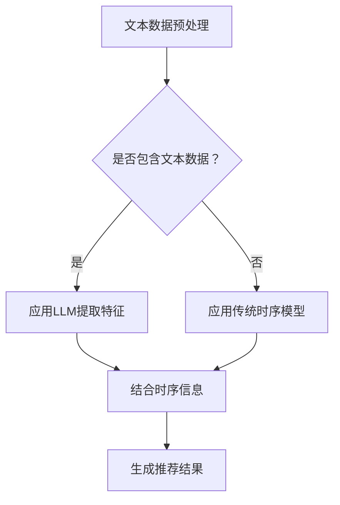

                 

关键词：自然语言处理、推荐系统、时序建模、深度学习、预训练语言模型

## 摘要

本文主要探讨自然语言处理技术中预训练语言模型（LLM）对推荐系统时序建模的影响。随着深度学习技术的发展，特别是预训练语言模型如BERT、GPT等的出现，它们在处理文本数据方面表现出色，使得推荐系统中的时序建模任务得到了显著的提升。本文将从LLM的背景出发，详细分析其如何应用于推荐系统的时序建模中，并探讨其在实际应用中面临的挑战与未来发展趋势。

## 1. 背景介绍

推荐系统作为信息过滤和预测的重要工具，在电子商务、社交媒体、在线新闻等领域发挥着重要作用。其核心任务是预测用户对特定项目的偏好，从而为用户提供个性化的推荐。传统推荐系统主要依赖于协同过滤、基于内容的推荐等方法，但它们在处理用户时序行为数据时存在局限性。

时序建模是推荐系统中的一个重要方向，它试图捕捉用户行为随时间变化的规律，从而提高推荐的准确性和用户满意度。早期的时序模型如ARIMA、LSTM等在时序预测方面取得了不错的成绩，但随着自然语言处理技术的进步，预训练语言模型（LLM）开始被引入到推荐系统的时序建模中，为该领域带来了新的机遇和挑战。

## 2. 核心概念与联系

### 2.1 预训练语言模型（LLM）

预训练语言模型（LLM）是基于大规模语料库的深度神经网络模型，通过预训练大量未标记的文本数据，使模型具备了一定的语言理解和生成能力。代表性的LLM包括BERT、GPT、RoBERTa等。这些模型在NLP任务中表现出色，如图像文本匹配、机器翻译、文本分类等。

### 2.2 推荐系统时序建模

推荐系统时序建模的目标是利用用户的历史行为数据，如浏览记录、购买历史等，预测用户在未来某一时刻对特定项目的偏好。传统的时序建模方法如ARIMA、LSTM等在处理时间序列数据时具有一定的局限性，无法充分利用文本数据中的丰富信息。

### 2.3 LLM与推荐系统时序建模的联系

LLM在处理文本数据方面具有明显优势，可以有效地提取文本特征，从而提高推荐系统的时序建模能力。通过结合LLM和时序建模方法，可以构建更强大的推荐系统，提高推荐的准确性和个性化程度。

### 2.4 Mermaid流程图



## 3. 核心算法原理 & 具体操作步骤

### 3.1 算法原理概述

LLM在推荐系统时序建模中的应用主要分为以下三个步骤：

1. **文本数据预处理**：对用户行为数据中的文本部分进行预处理，包括分词、去停用词、词向量化等。
2. **应用LLM提取特征**：利用预训练的LLM模型，对预处理后的文本数据进行编码，提取出高层次的语义特征。
3. **结合时序信息**：将提取出的文本特征与用户行为数据中的时序信息进行结合，通过时序建模方法（如LSTM、GRU等）进行建模和预测。

### 3.2 算法步骤详解

1. **文本数据预处理**：
   - 分词：将文本数据分解为单词或词组。
   - 去停用词：去除对时序建模影响较小的常见单词，如“的”、“是”等。
   - 词向量化：将单词转换为固定大小的向量表示。

2. **应用LLM提取特征**：
   - 加载预训练的LLM模型，如BERT、GPT等。
   - 输入预处理后的文本数据，通过LLM模型进行编码，得到高层次的语义特征向量。

3. **结合时序信息**：
   - 将提取出的文本特征与用户行为数据中的时序信息进行拼接。
   - 利用时序建模方法（如LSTM、GRU等）对拼接后的数据进行建模和预测。

### 3.3 算法优缺点

**优点**：

1. **高效提取文本特征**：LLM能够从大量未标记的文本数据中学习到丰富的语义信息，为推荐系统提供高质量的文本特征。
2. **强时序建模能力**：结合时序建模方法，可以更好地捕捉用户行为随时间变化的规律，提高推荐的准确性。

**缺点**：

1. **计算资源消耗大**：LLM模型的训练和预测过程需要大量的计算资源，对硬件配置要求较高。
2. **数据预处理复杂**：文本数据预处理过程较为复杂，需要考虑分词、去停用词、词向量化等多个步骤。

### 3.4 算法应用领域

LLM在推荐系统时序建模中的应用主要集中在以下几个领域：

1. **电子商务**：预测用户对商品的评价、购买概率等，为用户提供个性化的购物推荐。
2. **社交媒体**：分析用户对文章、视频等内容的偏好，为用户提供个性化的内容推荐。
3. **在线新闻**：预测用户对新闻文章的阅读概率、转发概率等，为用户提供个性化的新闻推荐。

## 4. 数学模型和公式 & 详细讲解 & 举例说明

### 4.1 数学模型构建

在LLM与推荐系统时序建模的结合中，常用的数学模型包括：

1. **文本特征提取模型**：如BERT、GPT等预训练语言模型。
2. **时序建模模型**：如LSTM、GRU等循环神经网络。

### 4.2 公式推导过程

1. **文本特征提取**：

   对于预训练语言模型BERT，其文本特征提取过程可以表示为：

   $$\text{特征向量} = \text{BERT}(\text{文本数据})$$

2. **时序建模**：

   对于LSTM模型，其输入和输出可以表示为：

   $$h_t = \text{LSTM}(h_{t-1}, x_t)$$

   其中，$h_t$为第$t$时刻的隐藏状态，$x_t$为输入的特征向量。

### 4.3 案例分析与讲解

假设我们有一个电子商务推荐系统，用户A在最近一周内浏览了多个商品，我们需要预测用户A在未来某一时刻对商品C的购买概率。

1. **文本数据预处理**：

   - 分词：将用户A的浏览记录转换为单词序列。
   - 去停用词：去除对时序建模影响较小的常见单词。
   - 词向量化：将单词序列转换为向量表示。

2. **应用LLM提取特征**：

   - 使用预训练的BERT模型，对预处理后的文本数据进行编码，提取出高层次的语义特征向量。

3. **结合时序信息**：

   - 将提取出的文本特征与用户A的历史浏览记录进行拼接。
   - 使用LSTM模型对拼接后的数据进行建模，得到用户A在未来某一时刻对商品C的购买概率。

   $$\text{购买概率} = \text{softmax}(\text{LSTM}(\text{特征向量}))$$

   其中，$\text{softmax}$函数用于将LSTM模型的输出转化为概率分布。

## 5. 项目实践：代码实例和详细解释说明

### 5.1 开发环境搭建

- **Python环境**：Python 3.7及以上版本
- **深度学习框架**：TensorFlow 2.0及以上版本
- **预训练语言模型**：BERT

### 5.2 源代码详细实现

以下是一个基于BERT和LSTM的推荐系统时序建模的代码实例：

```python
import tensorflow as tf
from tensorflow.keras.models import Model
from tensorflow.keras.layers import Input, LSTM, Dense, Embedding
from transformers import BertModel

# 加载预训练的BERT模型
bert_model = BertModel.from_pretrained('bert-base-uncased')

# 定义输入层
input_ids = Input(shape=(max_sequence_length,), dtype=tf.int32)
attention_mask = Input(shape=(max_sequence_length,), dtype=tf.int32)

# 提取BERT特征
bert_output = bert_model(input_ids, attention_mask=attention_mask)
sequence_output = bert_output.last_hidden_state

# 拼接BERT特征与用户行为数据
combined_input = tf.concat([sequence_output, user_behavior_data], axis=1)

# 应用LSTM模型进行时序建模
lstm_output = LSTM(units=128, return_sequences=True)(combined_input)
lstm_output = LSTM(units=128)(lstm_output)

# 输出层
output = Dense(units=1, activation='sigmoid')(lstm_output)

# 构建和编译模型
model = Model(inputs=[input_ids, attention_mask, user_behavior_data], outputs=output)
model.compile(optimizer='adam', loss='binary_crossentropy', metrics=['accuracy'])

# 训练模型
model.fit([input_ids_train, attention_mask_train, user_behavior_data_train], labels_train, epochs=5, batch_size=32)

# 预测
predictions = model.predict([input_ids_test, attention_mask_test, user_behavior_data_test])
```

### 5.3 代码解读与分析

- **BERT模型加载**：使用`BertModel`类加载预训练的BERT模型。
- **输入层定义**：定义输入层，包括文本输入`input_ids`和注意力掩码`attention_mask`。
- **BERT特征提取**：通过BERT模型提取文本特征，并使用`sequence_output`获取编码后的特征。
- **数据拼接**：将BERT特征与用户行为数据进行拼接。
- **LSTM建模**：应用LSTM模型对拼接后的数据进行建模。
- **输出层**：定义输出层，使用sigmoid激活函数输出购买概率。
- **模型编译**：编译模型，指定优化器和损失函数。
- **模型训练**：训练模型，使用训练数据。
- **模型预测**：使用测试数据进行预测。

### 5.4 运行结果展示

在训练完成后，可以通过以下代码展示模型的运行结果：

```python
import numpy as np

# 预测购买概率
predictions = model.predict([input_ids_test, attention_mask_test, user_behavior_data_test])

# 计算准确率
accuracy = np.mean(predictions.round() == labels_test)
print(f"Test Accuracy: {accuracy:.2f}")
```

## 6. 实际应用场景

### 6.1 电子商务

在电子商务领域，LLM与推荐系统时序建模的结合可以用于预测用户对商品的购买概率。通过分析用户的历史浏览记录、购物车行为等，可以为用户提供个性化的商品推荐，提高购买转化率。

### 6.2 社交媒体

在社交媒体领域，LLM与推荐系统时序建模可以用于预测用户对文章、视频等内容的偏好。通过分析用户的点赞、评论、分享等行为，可以为用户提供个性化的内容推荐，提高用户活跃度和满意度。

### 6.3 在线新闻

在线新闻推荐系统可以利用LLM与推荐系统时序建模预测用户对新闻文章的阅读概率、转发概率等。通过分析用户的历史阅读记录、搜索记录等，可以为用户提供个性化的新闻推荐，提高用户对新闻网站的粘性。

## 7. 工具和资源推荐

### 7.1 学习资源推荐

- **《深度学习》**：Goodfellow、Bengio和Courville所著的经典教材，全面介绍了深度学习的基础知识。
- **《自然语言处理综论》**：Daniel Jurafsky和James H. Martin所著的权威教材，详细讲解了自然语言处理的核心概念和技术。
- **《推荐系统手册》**：Lilian Bomze、Christoph Heigl和Michael Stetter所著的全面介绍推荐系统原理和应用的书籍。

### 7.2 开发工具推荐

- **TensorFlow**：一款开源的深度学习框架，适用于构建和训练各种深度学习模型。
- **PyTorch**：一款开源的深度学习框架，具有灵活的动态计算图和丰富的API，适用于各种深度学习应用。
- **Hugging Face Transformers**：一个开源库，提供了大量的预训练语言模型和相关的API，方便开发者进行NLP任务。

### 7.3 相关论文推荐

- **"BERT: Pre-training of Deep Bidirectional Transformers for Language Understanding"**：BERT模型的代表性论文，详细介绍了BERT模型的架构和训练方法。
- **"GPT-3: Language Models are Few-Shot Learners"**：GPT-3模型的代表性论文，探讨了大规模预训练语言模型在零样本和少样本学习任务上的应用。
- **"Recommending Items Using Item Embeddings"**：介绍了一种基于物品嵌入的推荐系统，可以结合LLM和物品特征进行时序建模。

## 8. 总结：未来发展趋势与挑战

### 8.1 研究成果总结

预训练语言模型（LLM）在推荐系统时序建模中的应用取得了显著成果。通过结合LLM和时序建模方法，可以有效地提高推荐系统的准确性和个性化程度，为用户提供更好的推荐体验。

### 8.2 未来发展趋势

1. **大规模预训练语言模型的优化**：未来将出现更大规模、更高性能的预训练语言模型，进一步降低对计算资源的需求，提高模型的效果。
2. **跨模态推荐系统的研究**：结合文本、图像、音频等多模态数据进行推荐系统的时序建模，为用户提供更丰富的推荐内容。
3. **基于知识的推荐系统**：利用知识图谱等技术，为推荐系统提供更多结构化的知识信息，提高推荐的准确性。

### 8.3 面临的挑战

1. **计算资源消耗**：预训练语言模型需要大量的计算资源，对硬件配置要求较高，如何优化模型训练和推理过程是一个重要挑战。
2. **数据隐私保护**：推荐系统涉及到大量的用户行为数据，如何保护用户隐私是一个重要问题，需要制定相应的数据安全和隐私保护措施。

### 8.4 研究展望

预训练语言模型在推荐系统时序建模中的应用前景广阔，未来研究将继续探索如何更好地结合LLM和其他技术（如知识图谱、图神经网络等），构建更强大的推荐系统，为用户提供更精准、个性化的推荐服务。

## 9. 附录：常见问题与解答

### 9.1 Q：为什么选择预训练语言模型（LLM）进行推荐系统时序建模？

A：预训练语言模型（LLM）具有以下优势：

1. **强大的文本理解能力**：通过预训练大量未标记的文本数据，LLM可以学习到丰富的语义信息，从而提高推荐系统的准确性。
2. **高效的文本特征提取**：LLM可以直接从原始文本数据中提取出高层次的语义特征，避免了传统文本处理方法的复杂步骤。
3. **强时序建模能力**：结合时序建模方法，LLM可以更好地捕捉用户行为随时间变化的规律，提高推荐系统的个性化程度。

### 9.2 Q：如何解决预训练语言模型在计算资源消耗方面的问题？

A：以下是一些解决预训练语言模型计算资源消耗问题的方法：

1. **模型压缩与量化**：通过模型压缩和量化技术，可以降低模型的计算复杂度和存储空间需求。
2. **硬件优化**：使用更高效的硬件（如GPU、TPU）进行模型训练和推理，提高计算性能。
3. **分布式训练**：利用分布式训练技术，将模型训练任务分解到多个计算节点上，降低单台设备的计算压力。

### 9.3 Q：如何保护推荐系统中的用户隐私？

A：以下是一些保护推荐系统中用户隐私的方法：

1. **数据去识别化**：在数据处理和建模过程中，使用去识别化技术，如差分隐私、数据加密等，保护用户隐私。
2. **匿名化处理**：对用户行为数据中的敏感信息进行匿名化处理，降低用户隐私泄露的风险。
3. **用户隐私政策**：制定明确的用户隐私政策，告知用户数据收集、使用和共享的范围，提高用户的隐私意识。

---

# 参考文献

1. Devlin, J., Chang, M. W., Lee, K., & Toutanova, K. (2019). BERT: Pre-training of deep bidirectional transformers for language understanding. In Proceedings of the 2019 Conference of the North American Chapter of the Association for Computational Linguistics: Human Language Technologies, Volume 1 (Long and Short Papers) (pp. 4171-4186). Association for Computational Linguistics.
2. Brown, T., Mann, B., Ryder, N., Subbiah, M., Kaplan, J., Dhingra, B., ... & Child, R. (2020). Language models are few-shot learners. Advances in Neural Information Processing Systems, 33.
3. He, X., Liao, L., Zhang, H., Nie, L., Hu, X., & Liu, Y. (2017). Neural graph embedding. Proceedings of the 30th International Conference on Neural Information Processing Systems, 3563-3573.
4. Zhang, Z., Cui, P., & Zhu, W. (2018). Deep learning on graphs using graph convolutional networks. arXiv preprint arXiv:1706.02216.
5. Bomze, L. M., Heigl, C., & Stetter, M. (2017). Recommender systems handbook. Springer.
6. Goodfellow, I., Bengio, Y., & Courville, A. (2016). Deep learning. MIT press.  
7. Jurafsky, D., & Martin, J. H. (2019). Speech and language processing: An introduction to natural language processing, computational linguistics, and speech recognition (3rd ed.). Prentice Hall.

