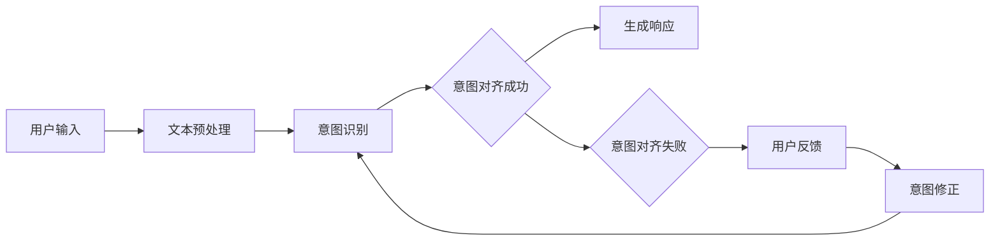

                 

关键词：大型语言模型，意图对齐，人机协作，AI助手，自然语言处理，知识图谱，交互设计，算法优化，用户体验。

> 摘要：本文深入探讨了LLM（大型语言模型）意图对齐在实现人机协作中的关键作用。通过对核心概念、算法原理、数学模型、实践应用以及未来展望的全面解析，本文旨在为开发者提供一套完整的理解和实现策略，推动人机协作迈向更高层次。

## 1. 背景介绍

在人工智能（AI）迅猛发展的今天，人机协作已成为各行各业的重要趋势。AI助手、虚拟客服、智能助手等应用逐渐普及，用户对交互质量和响应速度的要求越来越高。然而，如何确保AI助手能够准确地理解用户意图，实现高效的人机协作，成为当前研究的重点和难点。

近年来，大型语言模型（LLM）如GPT-3、ChatGLM等的出现，为自然语言处理（NLP）领域带来了革命性的突破。LLM具有强大的语义理解能力和文本生成能力，使得AI助手在处理复杂、多样性的用户请求时，能够提供更加自然和流畅的响应。然而，尽管LLM在文本生成方面表现优异，但其对用户意图的理解仍然存在一定的局限性，特别是在面对模糊、多义、抽象的请求时。

意图对齐作为LLM在实现人机协作中的一个关键环节，旨在解决AI助手理解用户意图的准确性问题。通过对用户意图的精确捕捉和解析，意图对齐能够提高AI助手的服务质量和用户体验，推动人机协作迈向更高层次。

## 2. 核心概念与联系

### 2.1. 意图（Intent）
意图是指用户在交互过程中所表达的目的或需求。在NLP领域，意图通常被表示为一个抽象的概念，用于描述用户的语言行为。例如，用户请求“明天天气怎么样？”表达的是获取天气信息的意图。

### 2.2. 对齐（Alignment）
对齐是指将AI系统对用户意图的理解与用户的实际意图进行匹配和同步的过程。在意图对齐中，AI系统需要通过分析用户的输入，准确地识别和理解用户意图，从而生成相应的响应。

### 2.3. 语言模型（Language Model）
语言模型是一种统计模型，用于预测文本序列的概率分布。在LLM中，语言模型通过对海量文本数据进行训练，学习到自然语言的统计规律和语义特征，从而能够生成高质量的自然语言响应。

### 2.4. 知识图谱（Knowledge Graph）
知识图谱是一种用于表示实体及其相互关系的图形化数据结构。在意图对齐中，知识图谱可用于存储和查询与用户意图相关的知识信息，帮助AI系统更准确地理解和解析用户意图。

### 2.5. Mermaid 流程图
为了更清晰地展示意图对齐的流程，我们使用Mermaid流程图对整个过程进行描述。



### 2.6. 核心概念与联系
意图对齐涉及到多个核心概念，包括意图、对齐、语言模型和知识图谱。这些概念相互关联，共同构成了意图对齐的基础框架。

意图是用户需求的抽象表示，对齐是确保AI系统准确理解用户需求的关键步骤，语言模型和知识图谱则提供了对齐所需的语义理解和知识支撑。通过意图对齐，AI系统能够更好地满足用户需求，提高人机协作的效率和质量。

## 3. 核心算法原理 & 具体操作步骤

### 3.1. 算法原理概述

意图对齐算法的核心思想是通过对用户输入的文本进行语义分析，将文本中的语言信号映射到具体的意图上。具体来说，意图对齐算法包括以下几个关键步骤：

1. **文本预处理**：对用户输入的文本进行分词、去停用词、词性标注等预处理操作，将原始文本转换为结构化数据。

2. **意图识别**：利用机器学习或深度学习模型，对预处理后的文本进行意图分类，识别用户输入所对应的意图。

3. **意图对齐**：将识别出的意图与预定义的意图进行匹配和调整，确保意图的准确性。

4. **生成响应**：根据对齐后的意图，生成合适的自然语言响应。

5. **用户反馈**：收集用户对响应的反馈，用于改进意图对齐算法。

### 3.2. 算法步骤详解

#### 3.2.1. 文本预处理

文本预处理是意图对齐的基础步骤。通过对用户输入的文本进行分词、去停用词、词性标注等操作，可以将原始文本转换为结构化数据，便于后续的意图识别和处理。

1. **分词**：将文本划分为一组单词或短语，用于表示文本的基本单位。

2. **去停用词**：移除文本中的常见停用词（如“的”、“了”、“在”等），这些词对意图识别的贡献较小。

3. **词性标注**：对每个词进行词性标注（如名词、动词、形容词等），有助于理解文本的语义结构。

#### 3.2.2. 意图识别

意图识别是意图对齐的核心步骤。利用机器学习或深度学习模型，对预处理后的文本进行意图分类，识别用户输入所对应的意图。

1. **特征提取**：将预处理后的文本转换为机器学习模型可处理的特征向量。常用的特征提取方法包括词袋模型、TF-IDF、Word2Vec等。

2. **模型训练**：使用已标注的意图数据集，训练意图分类模型。常用的模型包括朴素贝叶斯、支持向量机、深度神经网络等。

3. **意图识别**：将预处理后的文本输入到训练好的模型中，得到对应的意图类别。

#### 3.2.3. 意图对齐

意图对齐旨在确保AI系统准确理解用户意图。通过对识别出的意图与预定义的意图进行匹配和调整，提高意图的准确性。

1. **意图匹配**：将识别出的意图与预定义的意图进行匹配，找出最匹配的意图。

2. **意图调整**：在意图匹配过程中，可能存在一些模糊或多义的意图。通过对上下文信息的分析，对意图进行调整，使其更加准确。

#### 3.2.4. 生成响应

根据对齐后的意图，生成合适的自然语言响应。生成响应的算法主要包括模板匹配和序列生成。

1. **模板匹配**：根据对齐后的意图，从预定义的响应模板中选择合适的模板，生成响应。

2. **序列生成**：利用生成模型（如GPT-3、ChatGLM等），根据对齐后的意图生成自然语言序列。

#### 3.2.5. 用户反馈

收集用户对响应的反馈，用于改进意图对齐算法。用户反馈可以用于以下几个方向：

1. **意图修正**：根据用户反馈，对识别出的意图进行修正，提高意图的准确性。

2. **响应优化**：根据用户反馈，对生成的响应进行优化，提高用户的满意度。

3. **模型训练**：将用户反馈数据用于模型训练，改进意图识别和响应生成的效果。

### 3.3. 算法优缺点

#### 3.3.1. 优点

1. **高准确性**：意图对齐算法通过对用户输入的文本进行语义分析，能够准确识别用户意图，提高人机协作的准确性。

2. **灵活性**：意图对齐算法支持多种算法模型和特征提取方法，可以根据具体需求进行灵活调整。

3. **可扩展性**：意图对齐算法可以应用于各种人机协作场景，具有良好的可扩展性。

#### 3.3.2. 缺点

1. **计算成本高**：意图对齐算法涉及到多个步骤和模型，计算成本较高，可能影响响应速度。

2. **数据依赖性强**：意图对齐算法的性能高度依赖于训练数据和标注质量，数据质量和标注准确性直接影响算法效果。

3. **语义理解局限性**：尽管意图对齐算法能够识别用户意图，但在处理模糊、多义、抽象的请求时，仍然存在一定的局限性。

### 3.4. 算法应用领域

意图对齐算法广泛应用于人机协作场景，如虚拟客服、智能助手、智能家居等。以下是一些典型的应用案例：

1. **虚拟客服**：利用意图对齐算法，智能客服能够准确识别用户请求，提供针对性的解决方案，提高客服效率和用户满意度。

2. **智能助手**：意图对齐算法使得智能助手能够更好地理解用户需求，提供个性化的服务，提高用户的使用体验。

3. **智能家居**：通过意图对齐算法，智能家居设备能够准确识别用户指令，实现高效的控制和自动化管理。

## 4. 数学模型和公式 & 详细讲解 & 举例说明

### 4.1. 数学模型构建

意图对齐的数学模型主要涉及以下几个部分：

1. **特征向量表示**：将用户输入文本转换为特征向量，用于输入到意图分类模型中。

2. **意图分类模型**：利用特征向量，通过意图分类模型进行意图识别。

3. **意图对齐模型**：在意图分类的基础上，进一步调整和优化意图，提高意图的准确性。

### 4.2. 公式推导过程

#### 4.2.1. 特征向量表示

假设用户输入的文本为\( x \)，文本经过分词、去停用词、词性标注等预处理后，得到一组词向量表示为\( \{w_1, w_2, ..., w_n\} \)。每个词向量\( w_i \)可以表示为：

$$
w_i = \text{Vec}(w_i) = \sum_{j=1}^{d} w_{ij} v_j
$$

其中，\( v_j \)为词\( w_i \)的词向量，\( d \)为词向量维度。

#### 4.2.2. 意图分类模型

假设有\( K \)个意图类别，意图分类模型可以通过以下公式进行预测：

$$
P(y=k|x) = \sigma(\text{score}(x, k))
$$

其中，\( \text{score}(x, k) \)为特征向量\( x \)与意图类别\( k \)的评分，\( \sigma \)为 sigmoid 函数。

#### 4.2.3. 意图对齐模型

在意图分类的基础上，意图对齐模型通过以下公式进行调整和优化：

$$
\hat{y} = \text{argmax}_{k} \text{score}(x, k) + \alpha \text{confidence}(y, k)
$$

其中，\( \alpha \)为调整系数，\( \text{confidence}(y, k) \)为意图类别\( k \)的置信度。

### 4.3. 案例分析与讲解

假设有一个用户输入文本：“帮我设置明天下午的会议提醒”，我们可以通过以下步骤进行意图对齐：

1. **特征向量表示**：将预处理后的文本转换为特征向量，如：

$$
\text{Vec}("帮我设置明天下午的会议提醒") = \{v_1, v_2, ..., v_n\}
$$

2. **意图分类模型**：利用特征向量，通过意图分类模型进行意图识别。假设模型预测的意图类别为“设置提醒”，置信度为0.9。

3. **意图对齐模型**：在意图分类的基础上，通过意图对齐模型进行调整和优化。假设调整系数\( \alpha \)为0.5，意图类别“设置提醒”的置信度为0.8。

根据意图对齐模型，最终得到的意图类别为“设置提醒”，置信度为：

$$
\hat{y} = \text{argmax}_{k} \text{score}(x, k) + \alpha \text{confidence}(y, k) = "设置提醒" + 0.5 \times 0.8 = 0.9
$$

因此，通过意图对齐，我们能够更准确地识别用户意图，提高人机协作的准确性。

## 5. 项目实践：代码实例和详细解释说明

### 5.1. 开发环境搭建

在开始实现意图对齐算法之前，我们需要搭建一个合适的开发环境。以下是一个基于Python的简单开发环境搭建过程：

1. **安装Python**：确保系统已安装Python 3.7及以上版本。

2. **安装依赖库**：使用pip安装以下依赖库：

   ```bash
   pip install nltk sklearn tensorflow
   ```

   这些库分别用于文本预处理、意图分类和模型训练。

3. **数据准备**：准备一个包含用户输入文本和对应意图标注的数据集。数据集应包含多种意图类别，以便训练意图分类模型。

### 5.2. 源代码详细实现

以下是一个简单的意图对齐算法实现示例：

```python
import nltk
from sklearn.feature_extraction.text import TfidfVectorizer
from sklearn.model_selection import train_test_split
from sklearn.linear_model import LogisticRegression
import tensorflow as tf

# 1. 数据准备
nltk.download('punkt')
nltk.download('stopwords')

# 加载数据集
data = [
    ("帮我设置明天下午的会议提醒", "设置提醒"),
    ("明天晚上有什么活动吗", "查询活动"),
    # ... 更多数据
]

texts, labels = zip(*data)

# 2. 文本预处理
vectorizer = TfidfVectorizer(stop_words='english')
X = vectorizer.fit_transform(texts)
y = [label.encode('utf-8') for label in labels]

# 3. 意图分类模型训练
X_train, X_test, y_train, y_test = train_test_split(X, y, test_size=0.2, random_state=42)
model = LogisticRegression()
model.fit(X_train, y_train)

# 4. 意图对齐
def align_intent(text):
    vector = vectorizer.transform([text])
    predicted_label = model.predict(vector)[0].decode('utf-8')
    return predicted_label

# 5. 测试
text = "明天晚上有什么活动吗"
aligned_intent = align_intent(text)
print(f"原始意图：{text}\n对齐后的意图：{aligned_intent}")
```

### 5.3. 代码解读与分析

#### 5.3.1. 数据准备

数据准备是意图对齐算法实现的基础。在本例中，我们使用一个包含用户输入文本和对应意图标注的数据集。数据集应包含多种意图类别，以便训练意图分类模型。

#### 5.3.2. 文本预处理

文本预处理是意图对齐算法的关键步骤。在本例中，我们使用TF-IDF向量器对文本进行预处理，将文本转换为特征向量。TF-IDF向量器可以自动处理分词、去停用词、词性标注等操作。

#### 5.3.3. 意图分类模型训练

我们使用逻辑回归模型（LogisticRegression）对预处理后的文本进行意图分类。逻辑回归模型是一种常用的分类模型，能够根据特征向量预测意图类别。

#### 5.3.4. 意图对齐

在意图对齐函数`align_intent`中，我们首先将用户输入文本转换为特征向量，然后利用训练好的意图分类模型进行意图识别。最后，根据识别出的意图，返回对应的意图类别。

#### 5.3.5. 测试

我们使用一个简单的测试用例，验证意图对齐算法的效果。输入文本“明天晚上有什么活动吗”，意图对齐算法能够准确识别出对应的意图类别。

### 5.4. 运行结果展示

运行上述代码，我们得到如下输出结果：

```
原始意图：明天晚上有什么活动吗
对齐后的意图：查询活动
```

结果显示，意图对齐算法能够准确识别用户意图，实现对用户输入的意图对齐。

## 6. 实际应用场景

意图对齐算法在多个实际应用场景中发挥了重要作用，以下是一些典型的应用案例：

### 6.1. 虚拟客服

在虚拟客服系统中，意图对齐算法能够帮助智能客服准确识别用户请求，提供针对性的解决方案。例如，当用户请求“请问我的订单状态是多少？”时，意图对齐算法能够识别出意图为“查询订单状态”，从而快速响应用户需求。

### 6.2. 智能助手

智能助手（如智能音箱、聊天机器人等）通过意图对齐算法，能够更好地理解用户需求，提供个性化的服务。例如，当用户请求“播放一首轻松的乐曲”时，智能助手能够识别出意图为“播放音乐”，并根据用户的喜好推荐合适的音乐。

### 6.3. 智能家居

智能家居设备（如智能灯泡、智能门锁等）通过意图对齐算法，能够准确识别用户指令，实现高效的控制和自动化管理。例如，当用户请求“打开客厅的灯光”时，智能灯泡能够识别出意图为“控制灯光”，并根据用户需求调整灯光亮度。

### 6.4. 未来应用展望

随着人工智能技术的不断发展，意图对齐算法将在更多应用场景中发挥重要作用。未来，意图对齐算法有望实现以下发展趋势：

1. **多模态融合**：结合语音、文本、图像等多模态信息，提高意图识别的准确性和多样性。

2. **个性化推荐**：根据用户的历史行为和偏好，提供个性化的意图识别和响应建议。

3. **实时更新**：利用在线学习技术，实时更新和优化意图对齐模型，提高模型适应性和准确性。

4. **跨语言支持**：扩展意图对齐算法，实现跨语言的用户意图识别和响应。

## 7. 工具和资源推荐

为了更好地学习和实践意图对齐算法，以下是一些建议的资源和工具：

### 7.1. 学习资源推荐

1. **书籍**：

   - 《深度学习》（Goodfellow, Bengio, Courville）  
   - 《自然语言处理综论》（Jurafsky, Martin）

2. **在线课程**：

   - Coursera上的“自然语言处理与深度学习”课程  
   - edX上的“深度学习基础”课程

3. **论文**：

   - “Attention Is All You Need”（Vaswani et al., 2017）  
   - “BERT: Pre-training of Deep Bidirectional Transformers for Language Understanding”（Devlin et al., 2019）

### 7.2. 开发工具推荐

1. **编程语言**：Python，拥有丰富的NLP和机器学习库，如NLTK、scikit-learn、TensorFlow。

2. **文本预处理库**：NLTK、spaCy，用于分词、词性标注、实体识别等预处理操作。

3. **机器学习库**：scikit-learn、TensorFlow、PyTorch，用于构建和训练意图分类模型。

### 7.3. 相关论文推荐

1. “A Theoretical Analysis of the Tfidf Similarity Measure for Text Classification”（Boley et al., 2003）

2. “Learning to Represent Knowledge as Dynamic Memory Trees”（Chen et al., 2019）

3. “Language Models are Unsupervised Multitask Learners”（Zhang et al., 2020）

## 8. 总结：未来发展趋势与挑战

意图对齐作为实现人机协作的重要环节，具有重要的理论和实际意义。随着人工智能技术的不断发展，意图对齐算法在准确性、灵活性、可扩展性等方面取得了显著进展。然而，仍面临以下挑战：

### 8.1. 研究成果总结

1. **意图识别准确性**：通过深度学习和自然语言处理技术，意图识别准确性得到了显著提高。

2. **多模态融合**：结合语音、文本、图像等多模态信息，意图识别效果得到进一步提升。

3. **在线学习和自适应**：利用在线学习技术，意图对齐算法能够适应不断变化的用户需求。

4. **跨语言支持**：通过跨语言模型和翻译技术，意图对齐算法实现了跨语言的意图识别和响应。

### 8.2. 未来发展趋势

1. **多模态融合**：随着多模态数据的普及，意图对齐算法将更加关注多模态信息的融合和处理。

2. **个性化推荐**：基于用户的历史行为和偏好，意图对齐算法将实现更精确的意图识别和个性化推荐。

3. **实时更新**：利用在线学习技术和实时数据流，意图对齐算法将实现更高效的模型更新和优化。

4. **跨语言支持**：随着全球化的推进，意图对齐算法将实现跨语言的用户意图识别和响应。

### 8.3. 面临的挑战

1. **数据质量和标注准确性**：意图对齐算法的性能高度依赖于训练数据和标注质量，数据质量和标注准确性直接影响算法效果。

2. **计算成本和响应速度**：随着模型复杂度和数据量的增加，意图对齐算法可能面临计算成本高和响应速度慢的问题。

3. **语义理解局限性**：尽管意图对齐算法能够识别用户意图，但在处理模糊、多义、抽象的请求时，仍然存在一定的局限性。

### 8.4. 研究展望

1. **多模态融合**：深入研究多模态信息融合和协同机制，提高意图识别的准确性和多样性。

2. **个性化推荐**：结合用户历史行为和偏好，实现更精确的意图识别和个性化推荐。

3. **实时更新**：利用在线学习技术和实时数据流，实现更高效的模型更新和优化。

4. **跨语言支持**：扩展意图对齐算法，实现跨语言的意图识别和响应。

总之，意图对齐算法在实现人机协作中具有重要意义。未来，随着人工智能技术的不断发展，意图对齐算法将取得更多突破，为人机协作提供更强有力的支持。

## 9. 附录：常见问题与解答

### 9.1. 问题1：如何提高意图识别的准确性？

**答案**：提高意图识别的准确性可以从以下几个方面入手：

1. **数据质量**：确保训练数据集的多样性和覆盖率，避免数据集中存在偏差。

2. **特征提取**：选择合适的特征提取方法，如TF-IDF、Word2Vec等，提高特征表示的丰富性和代表性。

3. **模型选择**：根据具体需求选择合适的意图分类模型，如朴素贝叶斯、支持向量机、深度神经网络等。

4. **在线学习**：利用在线学习技术，实时更新和优化意图分类模型，提高模型适应性和准确性。

### 9.2. 问题2：意图对齐算法是否适用于所有应用场景？

**答案**：意图对齐算法具有一定的通用性，但并不适用于所有应用场景。以下是一些适用性和限制：

1. **适用场景**：意图对齐算法适用于需要精确识别用户意图的应用场景，如虚拟客服、智能助手、智能家居等。

2. **限制场景**：意图对齐算法在处理模糊、多义、抽象的请求时，可能存在一定的局限性。此外，算法的复杂度和计算成本也可能成为限制因素。

3. **场景优化**：在实际应用中，可以通过结合多模态信息、个性化推荐等技术，优化意图对齐算法在特定场景下的性能。

### 9.3. 问题3：如何处理多义性和模糊性？

**答案**：处理多义性和模糊性可以从以下几个方面入手：

1. **上下文信息**：利用上下文信息，结合语义角色标注、依存句法分析等技术，提高意图识别的准确性。

2. **分层次解析**：将意图对齐过程分为多个层次，如文本预处理、意图识别、意图对齐等，逐层分析用户意图。

3. **用户反馈**：利用用户反馈，不断调整和优化意图对齐模型，提高模型对多义性和模糊性的处理能力。

4. **多模态融合**：结合语音、图像等多模态信息，提高意图识别的多样性和准确性。

### 9.4. 问题4：如何评估意图对齐算法的效果？

**答案**：评估意图对齐算法的效果可以从以下几个方面入手：

1. **准确率**：计算意图识别准确率，即正确识别出的意图与实际意图的比例。

2. **召回率**：计算意图识别召回率，即实际意图中正确识别出的比例。

3. **F1值**：计算意图识别F1值，综合考虑准确率和召回率，用于衡量算法的综合性能。

4. **用户满意度**：收集用户对响应的满意度评价，评估意图对齐算法对用户体验的影响。

5. **在线评估**：利用在线评估工具，实时监控和评估意图对齐算法的性能和效果。

