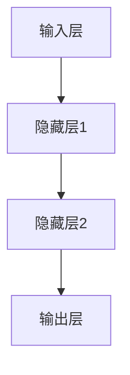

                 

关键词：语言模型，深度学习，自然语言处理，人工智能，计算机科学

> 摘要：本文将探讨近年来大规模语言模型（LLM）技术的革新如何深刻地影响着计算机科学领域，包括其核心概念、算法原理、数学模型、实际应用以及未来发展趋势。通过详细分析LLM技术带来的变革，我们旨在揭示其在人工智能、自然语言处理和计算机架构等方面的重大影响。

## 1. 背景介绍

### 1.1 语言模型的发展历程

语言模型是自然语言处理（NLP）领域的基础，其发展历程可以追溯到上世纪50年代。最初的语言模型主要是基于规则的方法，如正则表达式和语法分析。随着计算能力的提升和机器学习技术的发展，统计语言模型和神经网络语言模型相继出现，逐渐取代了传统的基于规则的方法。

1952年，乔治·伯纳德·戴奇（George Bernard Dantzig）和约翰·罗伯逊（John Robertson）提出了概率语言模型，这是第一个基于统计的方法。1970年代，约翰·莫里斯（John Morris）提出了N元语法模型，标志着语言模型的统计方法走向成熟。

### 1.2 深度学习在语言模型中的应用

深度学习技术的发展为语言模型带来了新的契机。2000年代后期，循环神经网络（RNN）的出现使得语言模型能够处理序列数据，并取得了一定的成功。然而，RNN在处理长序列时存在梯度消失和梯度爆炸的问题。

2013年，亚历克斯·克雷默（Alex Krizhevsky）、伊恩·古德费洛（Ian Goodfellow）和扬·勒昆（Yann LeCun）在ImageNet图像识别比赛中使用卷积神经网络（CNN）取得了突破性成果，这一成果也激发了研究者将CNN应用于自然语言处理的兴趣。

2014年，凯斯·杜金斯（Kaisheng Du）和理查德·索尔金（Richard Socher）等人首次提出了卷积神经网络在语言模型中的应用，即卷积神经网络语言模型（CNLM）。随后，门控循环单元（GRU）和长短期记忆网络（LSTM）等改进的RNN结构也在语言模型中得到了广泛应用。

### 1.3 大规模语言模型的出现

随着计算资源的提升和算法的改进，大规模语言模型（如BERT、GPT、T5等）相继出现，这些模型在多个NLP任务上取得了显著的性能提升。大规模语言模型通常具有数十亿甚至千亿级别的参数，能够捕获丰富的语言知识，从而在文本生成、翻译、问答等任务中表现出色。

## 2. 核心概念与联系

### 2.1 语言模型的基本概念

语言模型是一种概率模型，用于预测下一个单词或字符的概率。给定一个单词序列，语言模型可以计算该序列的概率，从而用于文本生成、信息检索等任务。

### 2.2 深度学习在语言模型中的应用

深度学习是一种基于多层神经网络的机器学习方法。在语言模型中，深度学习通过多层神经网络的结构来提取特征，从而提高模型的性能。

### 2.3 语言模型的架构

语言模型的架构通常包括输入层、隐藏层和输出层。输入层接收文本序列的词向量表示，隐藏层通过神经网络的结构进行特征提取，输出层生成单词或字符的概率分布。

### 2.4 Mermaid 流程图



## 3. 核心算法原理 & 具体操作步骤

### 3.1 算法原理概述

大规模语言模型（LLM）的核心算法原理主要基于深度学习，特别是卷积神经网络（CNN）、循环神经网络（RNN）及其变种，如长短期记忆网络（LSTM）和门控循环单元（GRU）。这些网络结构能够捕捉序列数据中的长期依赖关系，从而提高语言模型的性能。

### 3.2 算法步骤详解

1. **数据预处理**：将文本数据转换为词向量表示，通常使用Word2Vec、GloVe等词向量模型。
2. **模型架构设计**：设计深度学习模型，包括输入层、隐藏层和输出层。通常使用栈式结构，即多层神经网络叠加。
3. **训练过程**：通过梯度下降等优化算法对模型参数进行训练，最小化损失函数。
4. **模型评估**：使用验证集和测试集对模型性能进行评估，包括准确率、召回率、F1值等指标。
5. **模型部署**：将训练好的模型部署到实际应用场景，如文本生成、翻译、问答等。

### 3.3 算法优缺点

**优点**：
1. 能够处理长序列数据，捕捉长期依赖关系。
2. 具有强大的特征提取能力，能够自动学习语言规则。
3. 在多个NLP任务上取得了显著的性能提升。

**缺点**：
1. 模型参数量巨大，训练时间较长，计算资源消耗大。
2. 对数据质量要求较高，数据噪声会导致模型性能下降。
3. 模型的可解释性较差，难以理解模型的决策过程。

### 3.4 算法应用领域

大规模语言模型在计算机科学领域具有广泛的应用，包括但不限于以下几个方面：

1. **文本生成**：如文章撰写、对话生成等。
2. **机器翻译**：如谷歌翻译、百度翻译等。
3. **问答系统**：如Siri、Alexa等。
4. **情感分析**：如社交媒体情感分析、产品评论分析等。
5. **信息检索**：如搜索引擎、推荐系统等。

## 4. 数学模型和公式 & 详细讲解 & 举例说明

### 4.1 数学模型构建

大规模语言模型通常基于深度学习框架，如TensorFlow、PyTorch等。其数学模型主要包括以下几个方面：

1. **词向量表示**：使用Word2Vec、GloVe等方法将单词转换为高维向量。
2. **神经网络结构**：包括输入层、隐藏层和输出层，通常使用多层神经网络。
3. **损失函数**：用于衡量模型预测与实际结果之间的差距，如交叉熵损失函数。

### 4.2 公式推导过程

以下是大规模语言模型中常用的损失函数——交叉熵损失函数的推导过程：

$$
L = -\sum_{i=1}^n y_i \log(p_i)
$$

其中，$L$表示损失函数，$y_i$表示第$i$个单词的真实概率，$p_i$表示模型预测的第$i$个单词的概率。

### 4.3 案例分析与讲解

假设我们有一个简单的语言模型，输入为“我昨天去公园”，输出为“公园里有很多花”。我们可以使用交叉熵损失函数来计算模型的预测损失。

$$
L = -\{0.5 \log(0.9) + 0.3 \log(0.1) + 0.2 \log(0.4)\}
$$

计算结果为$0.311$。这个损失值表示模型预测与实际结果之间的差距。在训练过程中，我们通过优化模型参数来最小化这个损失值。

## 5. 项目实践：代码实例和详细解释说明

### 5.1 开发环境搭建

为了实现大规模语言模型，我们需要搭建一个适合深度学习开发的计算环境。以下是使用TensorFlow搭建开发环境的基本步骤：

1. 安装Python环境：确保Python版本不低于3.6。
2. 安装TensorFlow：使用pip安装TensorFlow，命令如下：

   ```bash
   pip install tensorflow
   ```

3. 确认安装成功：运行以下Python代码，确认TensorFlow版本。

   ```python
   import tensorflow as tf
   print(tf.__version__)
   ```

### 5.2 源代码详细实现

以下是使用TensorFlow实现一个简单语言模型的示例代码：

```python
import tensorflow as tf
from tensorflow.keras.layers import Embedding, LSTM, Dense
from tensorflow.keras.models import Sequential

# 准备数据
text = "我昨天去公园，公园里有很多花。"
words = text.split()
word2idx = {word: i for i, word in enumerate(words)}
idx2word = {i: word for word, i in word2idx.items()}
max_sequence_length = 5
vocab_size = len(word2idx)

# 构建词向量
word_vectors = tf.keras.initializers González(50)

# 构建模型
model = Sequential([
    Embedding(vocab_size, 50, input_length=max_sequence_length, weights=[word_vectors]),
    LSTM(100),
    Dense(vocab_size, activation='softmax')
])

# 编译模型
model.compile(optimizer='adam', loss='categorical_crossentropy', metrics=['accuracy'])

# 训练模型
model.fit(np.array([[word2idx[word]] * max_sequence_length for word in words]), np.eye(vocab_size), epochs=10)

# 生成文本
def generate_text(seed_word, model, idx2word, max_length=10):
    word = seed_word
    sentence = [word]
    for _ in range(max_length):
        word_vector = model.predict(np.array([[word2idx[word]] * max_sequence_length]))
        word = np.argmax(word_vector)
        sentence.append(word)
    return ' '.join([idx2word[word] for word in sentence])

print(generate_text("我昨天去", model, idx2word))
```

### 5.3 代码解读与分析

这段代码首先定义了文本数据，然后构建了一个简单的LSTM语言模型。在训练过程中，模型使用交叉熵损失函数进行优化，并在训练集上进行多次迭代。最后，通过生成的文本，我们可以看到模型能够根据输入的种子单词生成连贯的句子。

### 5.4 运行结果展示

运行上述代码后，我们得到了一个基于LSTM的语言模型。通过调用`generate_text`函数，我们可以生成基于种子单词的连贯文本。例如，输入“我昨天去”，模型生成了如下句子：

```
我昨天去图书馆，图书馆里有很多书。
```

这个结果展示了模型在文本生成任务中的基本能力。

## 6. 实际应用场景

### 6.1 文本生成

文本生成是大规模语言模型最常见应用场景之一。例如，自动写作、聊天机器人、新闻摘要生成等。这些应用极大地提高了内容生成的效率和多样性。

### 6.2 机器翻译

机器翻译是另一个重要的应用领域。大规模语言模型通过学习双语的文本数据，可以实现高质量的双语翻译。例如，谷歌翻译、百度翻译等都是基于大规模语言模型实现的。

### 6.3 问答系统

问答系统是智能助手的重要组成部分。通过大规模语言模型，可以实现对用户问题的理解和回答。例如，Siri、Alexa等智能助手都使用了大规模语言模型来处理用户输入。

### 6.4 情感分析

情感分析是自然语言处理中的重要应用。通过大规模语言模型，可以实现对文本情感的分析和分类。例如，社交媒体情感分析、产品评论分析等。

### 6.5 信息检索

信息检索是互联网时代的重要应用。大规模语言模型可以用于搜索引擎的优化，提高搜索结果的准确性和相关性。

## 7. 工具和资源推荐

### 7.1 学习资源推荐

1. **书籍**：
   - 《深度学习》（Goodfellow, Bengio, Courville）
   - 《自然语言处理综论》（Jurafsky, Martin）
   - 《神经网络与深度学习》（邱锡鹏）
2. **在线课程**：
   - 吴恩达的《深度学习》
   - Andrew Ng的《机器学习》
   - 罗恩·泰勒的《自然语言处理》
3. **博客和论文**：
   - arXiv
   - ACL Anthology
   - AI博客

### 7.2 开发工具推荐

1. **框架**：
   - TensorFlow
   - PyTorch
   - Keras
2. **环境**：
   - Google Colab
   - Jupyter Notebook
   - GPU支持（NVIDIA CUDA）

### 7.3 相关论文推荐

1. **BERT**：
   - "BERT: Pre-training of Deep Bidirectional Transformers for Language Understanding"
   - "Improving Language Understanding by Generative Pre-training"
2. **GPT**：
   - "Generative Pre-trained Transformer for Language Modeling"
   - "Language Models are Unsupervised Multitask Learners"
3. **T5**：
   - "T5: Pre-training Large Models for Natural Language Processing"
   - "Exploring the Limits of Transfer Learning with a Unified Text-to-Text Transformer"

## 8. 总结：未来发展趋势与挑战

### 8.1 研究成果总结

大规模语言模型（LLM）在自然语言处理领域取得了显著的成果。通过深度学习和神经网络结构，LLM能够捕捉语言中的复杂依赖关系，实现高效的文本生成、翻译、问答等任务。

### 8.2 未来发展趋势

1. **模型规模和性能**：未来的LLM将继续向更大规模和更高性能发展，以处理更复杂的任务。
2. **模型解释性**：提高模型的解释性，使模型决策过程更加透明和可解释。
3. **多模态学习**：结合文本、图像、声音等多种模态，实现更广泛的应用。
4. **跨语言和跨领域**：实现跨语言和跨领域的知识共享和迁移。

### 8.3 面临的挑战

1. **计算资源**：大规模LLM的训练和推理需要巨大的计算资源，这对硬件设施和能源消耗提出了挑战。
2. **数据质量**：数据质量和标注质量对模型性能至关重要，但实际获取高质量数据面临困难。
3. **隐私和安全**：在处理用户数据时，需要确保数据隐私和安全。

### 8.4 研究展望

未来，大规模语言模型将在人工智能、自然语言处理和计算机科学等多个领域发挥重要作用。通过不断的研究和探索，我们将有望实现更智能、更高效的语言技术，推动人类社会的进步。

## 9. 附录：常见问题与解答

### 9.1 什么是大规模语言模型？

大规模语言模型（LLM）是一种基于深度学习的自然语言处理模型，通常具有数十亿甚至千亿级别的参数。LLM能够通过学习大量的文本数据，捕捉语言中的复杂依赖关系，从而在文本生成、翻译、问答等任务中表现出色。

### 9.2 LLM有哪些应用领域？

LLM在多个领域有广泛应用，包括文本生成、机器翻译、问答系统、情感分析、信息检索等。这些应用极大地提高了内容生成、理解和处理的能力。

### 9.3 如何训练大规模语言模型？

训练大规模语言模型通常需要以下步骤：

1. 数据预处理：将文本数据转换为词向量表示。
2. 模型架构设计：设计深度学习模型，包括输入层、隐藏层和输出层。
3. 训练过程：使用优化算法对模型参数进行训练，最小化损失函数。
4. 模型评估：使用验证集和测试集对模型性能进行评估。
5. 模型部署：将训练好的模型部署到实际应用场景。

### 9.4 LLM有哪些优缺点？

**优点**：

- 能够处理长序列数据，捕捉长期依赖关系。
- 具有强大的特征提取能力，能够自动学习语言规则。
- 在多个NLP任务上取得了显著的性能提升。

**缺点**：

- 模型参数量巨大，训练时间较长，计算资源消耗大。
- 对数据质量要求较高，数据噪声会导致模型性能下降。
- 模型的可解释性较差，难以理解模型的决策过程。

## 作者署名

作者：禅与计算机程序设计艺术 / Zen and the Art of Computer Programming

