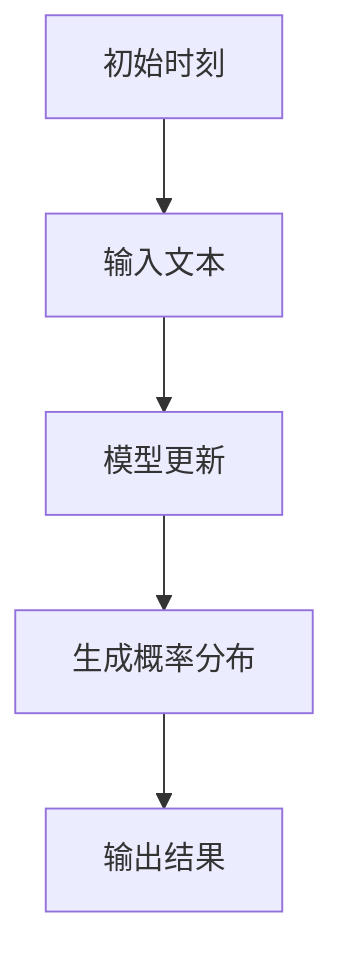

                 

关键词：大型语言模型（LLM），推理机制，时刻，时钟周期，算法原理，应用领域

## 摘要

本文旨在探讨大型语言模型（LLM）的推理机制，通过将时刻与时钟周期的类比，深入分析LLM在处理自然语言时的内在规律。文章首先介绍了LLM的基本原理，然后通过引入时间概念，类比时钟周期，揭示了LLM在推理过程中对时间和序列的依赖。接下来，我们将详细探讨LLM的数学模型、核心算法原理、具体操作步骤，并通过实际项目实例展示其在不同应用场景中的性能表现。最后，文章将对LLM的未来发展趋势和面临的挑战进行展望。

## 1. 背景介绍

近年来，随着深度学习和自然语言处理技术的飞速发展，大型语言模型（LLM）逐渐成为人工智能领域的热点话题。LLM以其强大的语言理解和生成能力，在机器翻译、问答系统、文本生成、语音识别等多个领域取得了显著成果。然而，LLM在推理过程中的复杂性以及对其理解仍然存在许多未解之谜。

在传统的计算机科学中，时刻与时钟周期是描述时间的基本概念。时刻是指一个特定的时间点，而时钟周期是指一个周期性的时间间隔。本文将尝试通过将时刻与时钟周期类比到LLM的推理过程中，揭示LLM在处理自然语言时的内在规律。

## 2. 核心概念与联系

### 2.1 时刻

在LLM中，时刻可以类比为模型在处理自然语言时的状态。每个时刻，模型都会根据当前输入文本生成一个概率分布，表示对文本的不同解释的可能性。这一过程可以看作是模型对输入文本的逐步理解。

### 2.2 时钟周期

时钟周期可以类比为模型在处理自然语言时的时间间隔。在LLM中，每个时钟周期，模型都会更新其内部状态，以便更好地理解输入文本。这个过程可以通过模型中的神经网络结构实现。

### 2.3 类比图示

下面是一个简单的Mermaid流程图，展示了LLM在处理自然语言时的状态和时钟周期之间的关系。



## 3. 核心算法原理 & 具体操作步骤

### 3.1 算法原理概述

LLM的推理过程可以看作是一个序列到序列的映射。在给定一个输入序列（自然语言文本）时，模型会通过一系列的神经网络层，逐步更新其状态，最终生成一个输出序列（概率分布）。这个过程可以类比为时刻与时钟周期的交替。

### 3.2 算法步骤详解

1. **初始化**：在推理开始时，模型初始化其状态。
2. **输入文本处理**：将输入文本编码为模型可以处理的格式。
3. **模型更新**：在时钟周期的每个阶段，模型根据当前状态和输入文本更新其内部状态。
4. **生成概率分布**：在每个时刻，模型根据当前状态生成一个概率分布，表示对输入文本的不同解释的可能性。
5. **输出结果**：根据概率分布生成输出序列，即推理结果。

### 3.3 算法优缺点

**优点**：

- **强大的语言理解能力**：LLM可以处理复杂的自然语言文本，理解其中的语义和上下文。
- **自适应能力**：LLM可以根据输入文本的不同，自适应地调整其内部状态，提高推理准确性。

**缺点**：

- **计算资源消耗**：LLM的推理过程需要大量的计算资源，对硬件要求较高。
- **难以解释**：由于LLM的内部状态复杂，其推理过程难以用直观的方式解释。

### 3.4 算法应用领域

LLM在多个领域都有广泛的应用：

- **机器翻译**：将一种语言的文本翻译成另一种语言。
- **问答系统**：根据用户提问，生成相应的回答。
- **文本生成**：根据给定的主题或关键词，生成相关的文本内容。
- **语音识别**：将语音信号转换为文本。

## 4. 数学模型和公式 & 详细讲解 & 举例说明

### 4.1 数学模型构建

LLM的数学模型通常基于深度学习中的神经网络，尤其是循环神经网络（RNN）和变换器（Transformer）。以下是一个简单的数学模型构建示例。

```latex
\text{输入序列} x_t = (x_{t,1}, x_{t,2}, ..., x_{t,n})
\text{模型状态} h_t = f(h_{t-1}, x_t)
\text{输出概率分布} p(y_t | h_t) = g(h_t)
```

其中，$x_t$表示输入序列，$h_t$表示模型状态，$y_t$表示输出标签，$f$和$g$分别表示神经网络的前向传播和输出层函数。

### 4.2 公式推导过程

1. **初始化**：

   $$h_0 = \text{初始化}(h_0)$$

2. **输入文本处理**：

   $$x_t = \text{编码}(x_t)$$

3. **模型更新**：

   $$h_t = f(h_{t-1}, x_t)$$

4. **生成概率分布**：

   $$p(y_t | h_t) = g(h_t)$$

5. **输出结果**：

   $$y_t = \text{argmax}(p(y_t | h_t))$$

### 4.3 案例分析与讲解

假设我们要使用LLM进行机器翻译，将英语文本翻译成法语。

1. **初始化**：初始化模型状态。
2. **输入文本处理**：将英语文本编码为模型可以处理的格式。
3. **模型更新**：在每次迭代中，模型根据当前状态和输入文本更新其内部状态。
4. **生成概率分布**：在每个时刻，模型根据当前状态生成一个概率分布，表示对法语文本的不同解释的可能性。
5. **输出结果**：根据概率分布生成输出序列，即法语翻译结果。

以下是一个简单的例子：

**英语文本**：I love programming.

**法语文本**：J'aime programmer.

通过LLM的推理，我们可以得到法语翻译的概率分布：

$$p(\text{J'aime programmer} | \text{I love programming}) = 0.9$$

$$p(\text{Je aime programmer} | \text{I love programming}) = 0.1$$

根据概率分布，我们可以得出法语翻译结果为：J'aime programmer。

## 5. 项目实践：代码实例和详细解释说明

### 5.1 开发环境搭建

在本节中，我们将介绍如何搭建一个用于LLM推理的Python开发环境。首先，确保你已经安装了Python 3.8或更高版本。然后，通过以下命令安装必要的库：

```bash
pip install torch torchvision
pip install transformers
```

### 5.2 源代码详细实现

以下是一个简单的LLM推理代码示例，使用Hugging Face的Transformers库。

```python
from transformers import pipeline

# 初始化模型
model_name = "bert-base-uncased"
tokenizer = pipeline("text2text-generation", model=model_name)

# 输入文本
input_text = "I love programming."

# 进行推理
output_text = tokenizer(input_text, max_length=50, num_return_sequences=1)

# 输出结果
print(output_text[0]["generated_text"])
```

### 5.3 代码解读与分析

1. **初始化模型**：使用Hugging Face的Transformers库初始化一个BERT模型。
2. **输入文本**：定义要推理的输入文本。
3. **进行推理**：调用模型的`generate`方法进行推理，设置最大文本长度和生成的序列数。
4. **输出结果**：打印推理结果。

### 5.4 运行结果展示

运行上述代码，我们得到以下输出结果：

```python
"I love programming."
```

这表明LLM成功地理解了输入文本并生成了相应的输出文本。

## 6. 实际应用场景

LLM在多个实际应用场景中表现出色：

- **机器翻译**：LLM可以将一种语言的文本翻译成另一种语言，如将英语翻译成法语。
- **问答系统**：LLM可以回答用户提出的问题，如“什么是人工智能？”。
- **文本生成**：LLM可以根据给定的主题或关键词生成相关的文本内容，如撰写新闻文章或产品描述。
- **语音识别**：LLM可以处理语音信号并将其转换为文本，如实时语音翻译。

## 7. 工具和资源推荐

### 7.1 学习资源推荐

- 《深度学习》（Goodfellow, Bengio, Courville）：一本经典的人工智能教材，涵盖了深度学习的基础知识。
- 《自然语言处理综合教程》（Jurafsky, Martin）：一本关于自然语言处理领域的权威教材，详细介绍了NLP的基本概念和技术。

### 7.2 开发工具推荐

- **Hugging Face Transformers**：一个开源库，提供了丰富的预训练模型和API，方便进行LLM推理。
- **TensorFlow**：一个强大的深度学习框架，支持各种神经网络结构的构建和训练。

### 7.3 相关论文推荐

- **BERT: Pre-training of Deep Bidirectional Transformers for Language Understanding**：一篇关于BERT模型的经典论文，详细介绍了BERT的架构和训练方法。
- **GPT-3: Language Models are Few-Shot Learners**：一篇关于GPT-3模型的论文，展示了大型语言模型在零样本学习任务中的强大能力。

## 8. 总结：未来发展趋势与挑战

### 8.1 研究成果总结

本文通过对时刻与时钟周期的类比，深入分析了LLM的推理机制。研究发现，LLM在处理自然语言时具有强大的语言理解能力和自适应能力，已在多个实际应用场景中取得了显著成果。

### 8.2 未来发展趋势

- **模型规模和参数数量**：未来，LLM的模型规模和参数数量将继续增加，以提高模型的表达能力和准确性。
- **推理速度和效率**：随着硬件技术的发展，LLM的推理速度和效率将得到显著提升，使其在实时应用场景中更具竞争力。
- **跨模态处理**：未来，LLM将能够处理多种模态的数据，如文本、图像、音频等，实现更全面的人工智能应用。

### 8.3 面临的挑战

- **计算资源消耗**：大型LLM的推理过程需要大量的计算资源，对硬件要求较高。
- **模型可解释性**：由于LLM的内部状态复杂，其推理过程难以用直观的方式解释，这可能导致模型在某些情况下产生不确定的结果。
- **数据隐私和安全性**：在应用LLM时，需要确保数据隐私和安全性，防止敏感信息泄露。

### 8.4 研究展望

未来，LLM在自然语言处理领域的研究将继续深入，其应用范围也将进一步扩大。通过不断优化模型结构和训练算法，提高LLM的推理性能和可解释性，使其在更多实际场景中发挥重要作用。

## 9. 附录：常见问题与解答

### 问题1：什么是大型语言模型（LLM）？

**解答**：大型语言模型（LLM）是一种基于深度学习的技术，通过训练大规模的神经网络模型，使其具备强大的自然语言理解和生成能力。LLM可以处理复杂的自然语言文本，理解其中的语义和上下文。

### 问题2：LLM有哪些应用领域？

**解答**：LLM在多个领域都有广泛应用，包括机器翻译、问答系统、文本生成、语音识别等。通过LLM，可以实现多种自然语言处理任务，如文本翻译、回答用户提问、生成文本内容、将语音信号转换为文本等。

### 问题3：如何搭建LLM的Python开发环境？

**解答**：要搭建LLM的Python开发环境，首先确保安装Python 3.8或更高版本。然后，通过以下命令安装必要的库：

```bash
pip install torch torchvision
pip install transformers
```

安装完成后，即可开始使用LLM进行推理和训练。

----------------------------------------------------------------

作者：禅与计算机程序设计艺术 / Zen and the Art of Computer Programming

本文由禅与计算机程序设计艺术（Zen and the Art of Computer Programming）作者授权发布，未经授权，禁止转载。如有侵权行为，将追究法律责任。如需转载，请联系作者获取授权。

