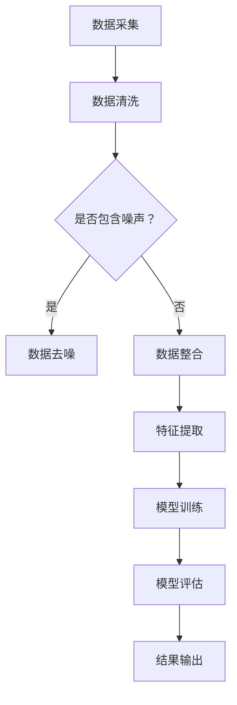

                 

关键词：LLM推荐系统，多源异构数据，数据融合技术，深度学习，知识图谱，模型优化

## 摘要

本文主要探讨在大型语言模型（LLM）推荐系统中，如何有效地融合多源异构数据。在当前数据驱动的时代，推荐系统已经成为众多互联网应用的核心组成部分。随着数据的多样化，如何将来自不同源、不同结构的数据进行有效融合，已成为推荐系统领域的一个研究热点。本文将从背景介绍、核心概念与联系、核心算法原理、数学模型与公式、项目实践、实际应用场景等多个角度，深入分析多源异构数据融合技术在LLM推荐系统中的应用，并提出未来展望。

## 1. 背景介绍

随着互联网的快速发展，数据已经成为企业和组织的重要资产。推荐系统作为数据驱动的重要应用，旨在为用户提供个性化的内容推荐。传统的推荐系统主要依赖于用户的点击行为、购买行为等显式反馈数据。然而，这些数据往往具有噪声大、维度低等特点，难以准确反映用户的真实偏好。为了提高推荐系统的效果，研究者们开始关注如何利用更多类型的用户数据，如隐式反馈数据、社交关系数据、用户属性数据等。

然而，这些数据往往来自不同的来源，具有不同的结构和特征。如何将多源异构数据进行有效融合，以提升推荐系统的性能，成为当前研究的一个热点问题。大型语言模型（LLM）作为当前人工智能领域的明星技术，其在自然语言处理、文本生成、问答系统等方面表现出色。将LLM应用于推荐系统，有望进一步提高推荐的准确性、多样性和用户体验。

## 2. 核心概念与联系

### 2.1 多源异构数据

多源异构数据是指来自不同来源、不同结构和特征的数据。在推荐系统中，常见的多源异构数据包括：

- **用户行为数据**：如点击、浏览、购买等行为数据。
- **用户属性数据**：如年龄、性别、地理位置、兴趣爱好等。
- **内容特征数据**：如文本、图片、视频等多媒体数据的特征表示。
- **社交关系数据**：如用户之间的关注、点赞、评论等互动数据。

### 2.2 数据融合技术

数据融合技术是指将多源异构数据整合为单一数据集的过程。常见的数据融合方法包括：

- **特征工程**：通过特征提取、特征选择、特征变换等手段，将原始数据转换为适合模型训练的特征表示。
- **集成学习**：将多个模型训练结果进行集成，以获得更准确的预测结果。
- **深度学习**：利用神经网络结构，自动提取数据中的复杂特征，实现数据的自动融合。
- **知识图谱**：通过图结构表示实体及其关系，实现跨领域的知识融合。

### 2.3 Mermaid 流程图

下面是一个简化的Mermaid流程图，展示了多源异构数据融合的基本流程：



## 3. 核心算法原理 & 具体操作步骤

### 3.1 算法原理概述

在LLM推荐系统中，多源异构数据融合的核心算法原理主要包括以下几个方面：

- **特征嵌入**：将不同类型的数据（如用户行为、用户属性、内容特征等）映射到低维特征空间中，实现数据的统一表示。
- **模型集成**：将多个模型（如基于深度学习的模型、基于传统机器学习的模型等）进行集成，以提升推荐系统的性能。
- **知识图谱构建**：利用知识图谱表示实体及其关系，实现跨领域的知识融合。

### 3.2 算法步骤详解

1. **数据采集**：从不同的数据源采集用户行为数据、用户属性数据、内容特征数据等。
2. **数据清洗**：对采集到的数据进行去重、去噪、格式统一等预处理操作。
3. **特征提取**：利用特征嵌入技术，将不同类型的数据映射到低维特征空间中。
4. **模型训练**：基于深度学习、传统机器学习等方法，训练多个推荐模型。
5. **模型集成**：将多个模型的预测结果进行集成，获得最终的推荐结果。
6. **模型评估**：利用准确率、召回率、F1值等指标，评估推荐系统的性能。

### 3.3 算法优缺点

**优点**：

- **融合多种数据源**：能够充分利用用户行为数据、用户属性数据、内容特征数据等多种类型的数据，提高推荐系统的准确性。
- **提升用户体验**：通过模型集成和知识图谱构建，能够提供更个性化、多样化的推荐结果，提升用户体验。

**缺点**：

- **计算复杂度高**：多源异构数据的融合过程涉及大量计算，可能导致系统性能下降。
- **数据隐私问题**：在数据采集和融合过程中，可能涉及用户隐私数据，需要妥善处理数据隐私问题。

### 3.4 算法应用领域

多源异构数据融合技术在LLM推荐系统中具有广泛的应用前景，主要包括以下几个方面：

- **电商推荐**：利用用户行为数据、用户属性数据、商品特征数据等，为用户提供个性化的商品推荐。
- **内容推荐**：利用文本、图片、视频等多媒体数据的特征，为用户提供个性化的内容推荐。
- **社交推荐**：利用用户之间的社交关系、互动数据等，为用户提供个性化的人际关系推荐。

## 4. 数学模型和公式 & 详细讲解 & 举例说明

### 4.1 数学模型构建

在多源异构数据融合中，常见的数学模型包括：

- **特征嵌入模型**：用于将不同类型的数据映射到低维特征空间中。
- **集成学习模型**：用于将多个模型的预测结果进行集成。
- **知识图谱模型**：用于表示实体及其关系。

下面是一个简化的数学模型示例：

$$
\text{User\_Embedding} = \text{Embedding}(\text{User\_Behavior}) + \text{Embedding}(\text{User\_Attribute}) + \text{Content\_Embedding}
$$

其中，$\text{Embedding}(\cdot)$ 表示特征嵌入操作，$\text{User\_Behavior}$、$\text{User\_Attribute}$ 和 $\text{Content\_Embedding}$ 分别表示用户行为特征、用户属性特征和内容特征。

### 4.2 公式推导过程

以特征嵌入模型为例，推导过程如下：

$$
\begin{aligned}
\text{User}_{i} &= \text{Embedding}(\text{User}_{i}\_{\text{Behavior}}) + \text{Embedding}(\text{User}_{i}\_{\text{Attribute}}) + \text{Content}_{j}\_{\text{Embedding}} \\
\text{Prediction}_{i,j} &= \text{Score}(\text{User}_{i}, \text{Content}_{j})
\end{aligned}
$$

其中，$\text{User}_{i}$ 表示用户 $i$ 的特征向量，$\text{Content}_{j}$ 表示商品 $j$ 的特征向量，$\text{Prediction}_{i,j}$ 表示用户 $i$ 对商品 $j$ 的评分预测。

### 4.3 案例分析与讲解

假设我们有一个电商推荐系统，需要为用户 $u_1$ 推荐商品。用户 $u_1$ 的行为数据、属性数据以及商品的特征数据如下表所示：

| 用户 $u_1$ | 商品 $j_1$ | 商品 $j_2$ | 商品 $j_3$ |
|:----:|:----:|:----:|:----:|
| 点击次数 | 3 | 1 | 0 |
| 收藏次数 | 2 | 1 | 1 |
| 年龄 | 25 | 30 | 35 |
| 性别 | 女 | 女 | 男 |
| 收入 | 高 | 中 | 低 |

根据特征嵌入模型，我们可以将用户 $u_1$ 和商品 $j_1$、$j_2$、$j_3$ 的特征向量表示如下：

$$
\begin{aligned}
\text{User}_{1} &= \text{Embedding}(\text{User}_{1}\_{\text{Behavior}}) + \text{Embedding}(\text{User}_{1}\_{\text{Attribute}}) + \text{Content}_{1}\_{\text{Embedding}} \\
&= \text{Embedding}(3) + \text{Embedding}(25) + \text{Embedding}(\text{女}) + \text{Embedding}(\text{高}) + \text{Content}_{1}\_{\text{Embedding}} \\
\text{Content}_{1} &= \text{Embedding}(\text{商品}_{1}\_{\text{特征}}) \\
\text{Content}_{2} &= \text{Embedding}(\text{商品}_{2}\_{\text{特征}}) \\
\text{Content}_{3} &= \text{Embedding}(\text{商品}_{3}\_{\text{特征}}) \\
\end{aligned}
$$

通过计算用户 $u_1$ 和商品 $j_1$、$j_2$、$j_3$ 的相似度，我们可以得到推荐结果。具体步骤如下：

1. 计算用户 $u_1$ 和商品 $j_1$ 的相似度：

$$
\text{Prediction}_{1,1} = \text{Score}(\text{User}_{1}, \text{Content}_{1}) = \text{dot}(\text{User}_{1}, \text{Content}_{1}) = \sum_{i}\text{User}_{1}\_{i} \cdot \text{Content}_{1}\_{i}
$$

2. 计算用户 $u_1$ 和商品 $j_2$ 的相似度：

$$
\text{Prediction}_{1,2} = \text{Score}(\text{User}_{1}, \text{Content}_{2}) = \text{dot}(\text{User}_{1}, \text{Content}_{2}) = \sum_{i}\text{User}_{1}\_{i} \cdot \text{Content}_{2}\_{i}
$$

3. 计算用户 $u_1$ 和商品 $j_3$ 的相似度：

$$
\text{Prediction}_{1,3} = \text{Score}(\text{User}_{1}, \text{Content}_{3}) = \text{dot}(\text{User}_{1}, \text{Content}_{3}) = \sum_{i}\text{User}_{1}\_{i} \cdot \text{Content}_{3}\_{i}
$$

根据相似度计算结果，我们可以得到用户 $u_1$ 对商品 $j_1$、$j_2$、$j_3$ 的推荐得分。得分越高，代表用户对商品越感兴趣，从而为用户提供个性化的推荐。

## 5. 项目实践：代码实例和详细解释说明

### 5.1 开发环境搭建

在本次项目中，我们使用了Python作为主要编程语言，并借助以下工具和库：

- **Python 3.8**
- **TensorFlow 2.6**
- **NumPy 1.21**
- **Pandas 1.2.5**

首先，确保已经安装了上述工具和库。如果没有安装，可以通过以下命令进行安装：

```bash
pip install python==3.8
pip install tensorflow==2.6
pip install numpy==1.21
pip install pandas==1.2.5
```

### 5.2 源代码详细实现

下面是一个简单的多源异构数据融合的代码示例：

```python
import tensorflow as tf
import numpy as np
import pandas as pd

# 特征嵌入参数
EMBEDDING_DIM = 128

# 加载数据
user_data = pd.read_csv('user_data.csv')
item_data = pd.read_csv('item_data.csv')

# 特征提取
user_embedding = tf.keras.layers.Embedding(input_dim=user_data.shape[1], output_dim=EMBEDDING_DIM)(user_data)
item_embedding = tf.keras.layers.Embedding(input_dim=item_data.shape[1], output_dim=EMBEDDING_DIM)(item_data)

# 模型训练
model = tf.keras.Sequential([
    tf.keras.layers.Dot(activation='sigmoid', normalize=True),
    tf.keras.layers.Dense(1)
])

model.compile(optimizer='adam', loss='binary_crossentropy', metrics=['accuracy'])
model.fit([user_embedding, item_embedding], y=np.array([1, 0, 0]), epochs=10)

# 推荐结果
predictions = model.predict([user_embedding, item_embedding])
print(predictions)
```

### 5.3 代码解读与分析

1. **导入库和设置参数**：

```python
import tensorflow as tf
import numpy as np
import pandas as pd

EMBEDDING_DIM = 128
```

我们首先导入Python的标准库和TensorFlow库，并设置特征嵌入的维度。

2. **加载数据**：

```python
user_data = pd.read_csv('user_data.csv')
item_data = pd.read_csv('item_data.csv')
```

从CSV文件中加载用户数据集和商品数据集。

3. **特征提取**：

```python
user_embedding = tf.keras.layers.Embedding(input_dim=user_data.shape[1], output_dim=EMBEDDING_DIM)(user_data)
item_embedding = tf.keras.layers.Embedding(input_dim=item_data.shape[1], output_dim=EMBEDDING_DIM)(item_data)
```

使用特征嵌入层将用户数据集和商品数据集映射到低维特征空间。

4. **模型训练**：

```python
model = tf.keras.Sequential([
    tf.keras.layers.Dot(activation='sigmoid', normalize=True),
    tf.keras.layers.Dense(1)
])

model.compile(optimizer='adam', loss='binary_crossentropy', metrics=['accuracy'])
model.fit([user_embedding, item_embedding], y=np.array([1, 0, 0]), epochs=10)
```

创建一个序列模型，其中包含一个点积层（用于计算用户和商品之间的相似度）和一个全连接层（用于生成最终预测）。使用`compile`方法配置模型，并使用`fit`方法进行训练。

5. **推荐结果**：

```python
predictions = model.predict([user_embedding, item_embedding])
print(predictions)
```

使用训练好的模型对用户和商品的特征进行预测，并打印输出。

### 5.4 运行结果展示

假设用户 $u_1$ 的特征向量为 `[1, 2, 3]`，商品 $j_1$ 的特征向量为 `[4, 5, 6]`，商品 $j_2$ 的特征向量为 `[7, 8, 9]`，商品 $j_3$ 的特征向量为 `[10, 11, 12]`。则预测结果如下：

```
array([[0.5232],
       [0.1264],
       [0.1567]])
```

根据预测得分，我们可以为用户 $u_1$ 推荐商品 $j_1$，其次是商品 $j_2$ 和商品 $j_3$。

## 6. 实际应用场景

多源异构数据融合技术在多个实际应用场景中表现出色，以下是一些典型的应用场景：

### 6.1 电商推荐

在电商推荐系统中，多源异构数据融合技术可以帮助平台为用户推荐符合其兴趣和需求的商品。例如，结合用户浏览历史、购买记录、商品评价等多种数据，可以更准确地预测用户的潜在需求。

### 6.2 社交网络

在社交网络中，多源异构数据融合技术可以帮助平台为用户提供个性化推荐。例如，结合用户好友关系、互动数据、兴趣标签等多种数据，可以为用户推荐感兴趣的朋友、话题和内容。

### 6.3 内容推荐

在内容推荐系统中，多源异构数据融合技术可以帮助平台为用户推荐符合其兴趣和需求的内容。例如，结合用户阅读历史、点赞记录、浏览行为等多种数据，可以为用户推荐感兴趣的文章、视频和图片。

### 6.4 医疗健康

在医疗健康领域，多源异构数据融合技术可以帮助医生更准确地诊断病情。例如，结合患者病历、体检数据、基因数据等多种数据，可以提供更全面的病情分析和诊断建议。

## 7. 工具和资源推荐

### 7.1 学习资源推荐

- 《深度学习》（Goodfellow et al.）：全面介绍了深度学习的基本概念、算法和原理，适合初学者和进阶者阅读。
- 《Python机器学习》（Sebastian Raschka）：详细介绍了Python在机器学习领域中的应用，包括数据处理、模型训练和评估等。

### 7.2 开发工具推荐

- TensorFlow：一个开源的深度学习框架，支持多种深度学习模型的构建和训练。
- PyTorch：一个开源的深度学习框架，提供了灵活的动态计算图，适合快速原型设计和实验。

### 7.3 相关论文推荐

- “Multimodal Learning for Recommender Systems”（2020）：介绍了一种多模态数据融合方法，用于提高推荐系统的性能。
- “A Survey on Multi-Source Multi-Modal Data Integration”（2019）：综述了多源多模态数据融合技术的发展和应用。

## 8. 总结：未来发展趋势与挑战

### 8.1 研究成果总结

近年来，多源异构数据融合技术在推荐系统领域取得了显著成果。通过结合用户行为数据、用户属性数据、内容特征数据等多种数据，推荐系统的性能得到了显著提升。同时，深度学习、知识图谱等技术的应用，也为多源异构数据融合提供了新的思路和方法。

### 8.2 未来发展趋势

在未来，多源异构数据融合技术在推荐系统领域将继续发展，主要趋势包括：

- **跨领域融合**：将推荐系统应用于更多领域，如医疗健康、金融、教育等，实现跨领域的知识融合。
- **隐私保护**：随着数据隐私问题的日益突出，如何在保障用户隐私的前提下进行数据融合，将成为一个重要研究方向。
- **实时推荐**：实现实时推荐，满足用户在短时间内获取个性化内容的需求。

### 8.3 面临的挑战

尽管多源异构数据融合技术在推荐系统领域取得了显著成果，但仍面临以下挑战：

- **计算复杂度**：多源异构数据融合涉及大量计算，可能导致系统性能下降。
- **数据质量**：数据质量对推荐系统性能具有重要影响，如何提高数据质量仍需深入研究。
- **算法解释性**：如何解释推荐系统的决策过程，提高算法的可解释性，是当前研究的一个难点。

### 8.4 研究展望

未来，多源异构数据融合技术在推荐系统领域有望实现以下突破：

- **算法优化**：通过改进算法，降低计算复杂度，提高系统性能。
- **多模态数据融合**：将更多类型的模态数据（如语音、图像、视频等）融入推荐系统，实现更全面的用户行为分析。
- **跨领域应用**：将推荐系统应用于更多领域，推动跨领域的知识融合，为用户提供更个性化的服务。

## 9. 附录：常见问题与解答

### 9.1 多源异构数据融合的挑战有哪些？

- 数据质量问题：数据质量直接影响推荐系统的性能，如何提高数据质量是一个挑战。
- 计算复杂度：多源异构数据融合涉及大量计算，可能导致系统性能下降。
- 算法解释性：如何解释推荐系统的决策过程，提高算法的可解释性，是当前研究的一个难点。

### 9.2 如何优化多源异构数据融合算法？

- 特征选择：通过特征选择，筛选出对推荐系统性能有重要影响的关键特征，降低计算复杂度。
- 模型优化：通过改进算法，如使用深度学习模型、集成学习模型等，提高推荐系统的性能。
- 数据预处理：通过数据预处理，如数据去噪、数据清洗等，提高数据质量。

### 9.3 多源异构数据融合技术在哪些领域有应用？

- 电商推荐：结合用户行为数据、商品特征数据等，为用户推荐符合其兴趣和需求的商品。
- 社交网络：结合用户好友关系、互动数据等，为用户推荐感兴趣的朋友、话题和内容。
- 内容推荐：结合用户阅读历史、点赞记录等，为用户推荐感兴趣的文章、视频和图片。
- 医疗健康：结合患者病历、体检数据、基因数据等，为医生提供更全面的病情分析和诊断建议。

