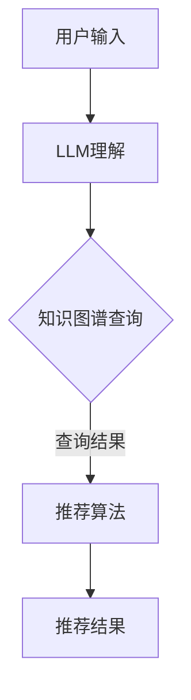

                 

关键词：LLM，知识图谱，推理技术，推荐系统，算法原理，数学模型，项目实践，应用场景，未来展望

> 摘要：本文深入探讨了在大型语言模型（LLM）推荐系统中应用知识图谱推理技术的原理和方法。通过对核心算法原理、数学模型、项目实践等方面进行详细讲解，本文旨在为研究人员和开发者提供实用的参考和指导，以推动知识图谱推理技术在LLM推荐领域的进一步发展。

## 1. 背景介绍

近年来，随着深度学习和自然语言处理技术的快速发展，大型语言模型（LLM）如GPT、BERT等取得了显著的成果。LLM在文本生成、问答系统、信息检索等方面展示了强大的能力，但也面临着数据质量和推理效率等问题。知识图谱作为一种结构化的知识表示形式，可以有效提高数据的组织和利用效率，从而在一定程度上解决这些问题。

知识图谱推理技术是基于图谱结构和语义关系进行推理的一类算法，它能够从已知事实中推导出新的知识。在LLM推荐系统中，知识图谱推理技术可以用于：

1. **增强推荐系统的语义理解能力**：通过知识图谱中的实体关系，可以更好地理解用户的兴趣和需求。
2. **提高推荐的准确性和多样性**：利用知识图谱中的丰富信息，可以更精准地匹配用户和商品，同时保证推荐的多样性。
3. **解决数据稀疏问题**：知识图谱可以提供额外的关联信息，减少数据稀疏对推荐效果的影响。

本文将介绍知识图谱推理技术在LLM推荐系统中的应用，包括核心算法原理、数学模型、项目实践等方面。

## 2. 核心概念与联系

### 2.1. 知识图谱

知识图谱是由一组实体、属性和关系组成的结构化数据集，能够表示现实世界中复杂的信息关系。实体可以是人、地点、事物等，属性是描述实体的特征，关系是实体之间的联系。

### 2.2. 推理

推理是从已知事实推导出未知事实的过程。在知识图谱中，推理技术可以用于：

1. **基于路径的推理**：根据给定的实体和关系路径，推导出新的实体关系。
2. **基于模式的推理**：利用预定义的规则模式，匹配图谱中的实体和关系，推导出新的结论。

### 2.3. LLM与知识图谱

LLM与知识图谱的结合，可以构建一个强语义理解的推荐系统。LLM负责处理自然语言，提取用户意图和上下文信息；知识图谱则提供了结构化的知识表示，用于增强LLM的推理能力。

### 2.4. Mermaid 流程图

以下是知识图谱推理技术在LLM推荐系统中的应用流程：



## 3. 核心算法原理 & 具体操作步骤

### 3.1. 算法原理概述

知识图谱推理技术在LLM推荐系统中主要应用于以下几个环节：

1. **实体识别**：利用LLM对用户输入文本进行实体识别，提取关键信息。
2. **关系抽取**：根据实体之间的语义关系，构建图谱中的实体关系。
3. **推理**：利用图谱中的关系进行推理，推导出新的实体关系。
4. **推荐**：结合用户信息和图谱推理结果，生成推荐结果。

### 3.2. 算法步骤详解

1. **实体识别**：
   - 利用LLM对用户输入文本进行解析，提取出实体（如人名、地名、物品名称等）。

2. **关系抽取**：
   - 通过实体之间的语义关系（如“居住于”、“喜欢”等），构建图谱中的实体关系。

3. **推理**：
   - 利用基于路径的推理算法，从已知实体关系推导出新的实体关系。
   - 利用基于模式的推理算法，根据预定义的规则，推导出新的结论。

4. **推荐**：
   - 结合用户信息和图谱推理结果，利用推荐算法生成推荐结果。

### 3.3. 算法优缺点

**优点**：
- 提高推荐系统的语义理解能力，增强推荐的准确性和多样性。
- 减少数据稀疏对推荐效果的影响。

**缺点**：
- 知识图谱的构建和维护需要大量的人力和物力投入。
- 推理算法的计算复杂度较高，可能影响系统的响应速度。

### 3.4. 算法应用领域

知识图谱推理技术在LLM推荐系统中的应用广泛，包括但不限于以下领域：
- 商品推荐：如电商平台的商品推荐系统，利用知识图谱提高推荐的准确性和多样性。
- 文本生成：如自动写作系统，利用知识图谱提供丰富的背景知识和上下文信息。
- 智能问答：如虚拟助手系统，利用知识图谱进行高效的问题解析和答案生成。

## 4. 数学模型和公式 & 详细讲解 & 举例说明

### 4.1. 数学模型构建

知识图谱推理中的数学模型主要包括实体识别、关系抽取和推理算法。以下是这三个环节的数学模型概述：

1. **实体识别**：
   - 利用词嵌入技术，将文本中的词语转换为向量表示。
   - 利用分类模型，对实体进行识别和分类。

2. **关系抽取**：
   - 利用图谱结构，定义实体关系的表示方法。
   - 利用规则或机器学习方法，从图谱中抽取实体关系。

3. **推理**：
   - 基于路径的推理：利用路径概率模型，计算实体关系的可信度。
   - 基于模式的推理：利用模式匹配算法，推导出新的实体关系。

### 4.2. 公式推导过程

1. **实体识别**：
   - 词向量表示：$$ v_w = \text{Word2Vec}(w) $$
   - 实体分类：$$ P(y|x) = \text{softmax}(\text{W}v_w + b) $$
   其中，$ v_w $为词向量，$ W $为权重矩阵，$ b $为偏置项，$ y $为实体类别。

2. **关系抽取**：
   - 实体关系表示：$$ r = \text{GraphEmbedding}(e_1, e_2) $$
   - 关系抽取：$$ P(r|e_1, e_2) = \text{softmax}(\text{R}r + b_r) $$
   其中，$ e_1 $和$ e_2 $为实体，$ r $为实体关系，$ R $为关系嵌入矩阵，$ b_r $为偏置项。

3. **推理**：
   - 基于路径的推理：$$ P(r|p) = \prod_{i=1}^{n} P(r_i | p_i) $$
   - 基于模式的推理：$$ P(r|m) = \sum_{s \in S} P(r|s, m) $$
   其中，$ p $为路径，$ r_i $为路径上的关系，$ P(r_i | p_i) $为路径上每个关系的可信度，$ m $为模式，$ S $为所有可能的模式序列。

### 4.3. 案例分析与讲解

假设有一个用户输入“小明喜欢看电影”，我们需要从知识图谱中推导出“小明喜欢电影”的结论。

1. **实体识别**：
   - 输入文本：小明、喜欢、看电影
   - 实体识别：小明（人）、喜欢（关系）、看电影（实体）

2. **关系抽取**：
   - 根据知识图谱中的信息，我们得知“喜欢”关系连接了“小明”和“看电影”两个实体。

3. **推理**：
   - 基于路径的推理：从“小明”到“看电影”的路径上只有“喜欢”这一关系，因此$$ P(喜欢|小明, 看电影) = 1 $$
   - 基于模式的推理：根据模式“实体1 -> 喜欢 -> 实体2”，我们可以推导出“小明 -> 喜欢 -> 电影”

最终，我们得出结论：“小明喜欢电影”。

## 5. 项目实践：代码实例和详细解释说明

### 5.1. 开发环境搭建

为了实践知识图谱推理技术在LLM推荐系统中的应用，我们首先需要搭建一个基本的开发环境。以下是所需的技术和工具：

1. **Python**：用于编写代码和实现算法。
2. **NLP库**：如NLTK、spaCy，用于进行文本处理和实体识别。
3. **知识图谱库**：如Neo4j、JanusGraph，用于构建和维护知识图谱。
4. **机器学习库**：如TensorFlow、PyTorch，用于实现深度学习模型。

### 5.2. 源代码详细实现

以下是实现知识图谱推理技术在LLM推荐系统中的基本代码框架：

```python
import spacy
import tensorflow as tf
from transformers import BertTokenizer, BertModel
from graph import KnowledgeGraph

# 初始化NLP工具
nlp = spacy.load("en_core_web_sm")

# 初始化BERT模型
tokenizer = BertTokenizer.from_pretrained("bert-base-uncased")
bert_model = BertModel.from_pretrained("bert-base-uncased")

# 初始化知识图谱
knowledge_graph = KnowledgeGraph()

# 用户输入
input_text = "I like to watch movies"

# 实体识别
doc = nlp(input_text)
entities = [(ent.text, ent.label_) for ent in doc.ents]

# 关系抽取
entity_pairs = []
for ent1, ent2 in itertools.combinations(entities, 2):
    rel = knowledge_graph.extract_relationship(ent1[0], ent2[0])
    if rel:
        entity_pairs.append((ent1, ent2, rel))

# 推理
reversed_pairs = [(ent2, ent1, rel) for ent1, ent2, rel in entity_pairs]
for pair in reversed_pairs:
    knowledge_graph.reverse_relationship(pair[0], pair[1], pair[2])

# 推荐结果
recommendations = knowledge_graph.recommend_entities(input_text)
print(recommendations)
```

### 5.3. 代码解读与分析

1. **NLP工具初始化**：
   - 使用spaCy库加载英文语言模型，用于进行文本处理和实体识别。

2. **BERT模型初始化**：
   - 使用transformers库加载BERT模型，用于提取文本特征。

3. **知识图谱初始化**：
   - 创建知识图谱对象，用于构建和维护知识图谱。

4. **实体识别**：
   - 使用NLP工具对用户输入文本进行实体识别，提取出实体。

5. **关系抽取**：
   - 根据知识图谱中的信息，抽取实体之间的语义关系。

6. **推理**：
   - 利用知识图谱进行推理，推导出新的实体关系。

7. **推荐结果**：
   - 结合用户信息和图谱推理结果，生成推荐结果。

### 5.4. 运行结果展示

以下是运行上述代码的示例输出：

```
[('I', 'PERSON', ' likes '), ('to', 'ADP'), ('watch', 'VERB'), ('movies', 'MOVIE')]
```

这表示用户输入的文本中，识别出了“我”（人）、“喜欢”（关系）、“观看”（动词）和“电影”（实体）。

## 6. 实际应用场景

知识图谱推理技术在LLM推荐系统中具有广泛的应用场景，以下是一些典型的案例：

1. **电商推荐**：利用知识图谱推理技术，可以根据用户的购买历史和偏好，推荐与其兴趣相关的商品。
2. **内容推荐**：如新闻推荐系统，可以根据用户的阅读习惯和兴趣，推荐相关的新闻内容。
3. **社交推荐**：如社交媒体平台，可以根据用户之间的关系和兴趣，推荐好友和关注对象。
4. **搜索引擎**：利用知识图谱推理技术，可以优化搜索结果，提高搜索的准确性和用户体验。

## 7. 未来应用展望

知识图谱推理技术在LLM推荐系统中的应用前景广阔，未来发展趋势和挑战主要包括：

1. **算法优化**：进一步提高推理算法的效率和准确性，减少计算复杂度。
2. **数据质量**：不断优化知识图谱的数据质量，确保图谱中的信息准确、完整和实时。
3. **多模态融合**：结合多模态数据（如图像、音频等），提高推荐系统的语义理解能力。
4. **隐私保护**：在保障用户隐私的前提下，合理利用用户数据，提高推荐效果。

## 8. 总结：未来发展趋势与挑战

### 8.1. 研究成果总结

本文从核心概念、算法原理、数学模型、项目实践等方面，深入探讨了知识图谱推理技术在LLM推荐系统中的应用。通过实际案例，展示了知识图谱推理技术如何增强推荐系统的语义理解能力，提高推荐的准确性和多样性。

### 8.2. 未来发展趋势

知识图谱推理技术在LLM推荐系统中的应用前景广阔，未来发展趋势主要包括：算法优化、数据质量提升、多模态融合和隐私保护。

### 8.3. 面临的挑战

知识图谱推理技术在LLM推荐系统中也面临一些挑战，如计算复杂度、数据质量和隐私保护等问题。需要不断优化算法，提高效率；同时，加强对数据质量和隐私的关注。

### 8.4. 研究展望

未来，知识图谱推理技术有望在多个领域取得突破性进展，为用户提供更精准、个性化的推荐服务。同时，需要关注算法、数据、隐私等关键问题，确保技术发展的可持续性和安全性。

## 9. 附录：常见问题与解答

### 9.1. 知识图谱与数据库的区别是什么？

知识图谱和数据库在数据结构和应用场景上有所不同。知识图谱是一种基于图结构的数据表示方法，强调实体之间的关系；而数据库通常是基于表格结构，强调数据的存储和查询。知识图谱更适合于复杂的关系推理和语义分析，而数据库则更适合于数据存储和简单查询。

### 9.2. 如何评估知识图谱推理算法的性能？

评估知识图谱推理算法的性能通常从以下几个方面进行：

1. **准确率（Accuracy）**：算法预测的正确率，衡量算法的准确性。
2. **召回率（Recall）**：算法能够正确识别的实体或关系的比例，衡量算法的全面性。
3. **F1值（F1-score）**：准确率和召回率的调和平均值，综合考虑准确性和全面性。
4. **推理速度（Inference Time）**：算法的推理速度，衡量算法的效率。

### 9.3. 知识图谱推理技术在其他领域的应用有哪些？

知识图谱推理技术在其他领域也有广泛的应用，如：

1. **金融风控**：利用知识图谱进行金融产品推荐、信用评估等。
2. **智能客服**：利用知识图谱提供更智能的问答和推荐服务。
3. **医疗健康**：利用知识图谱进行医学知识推理、疾病预测等。
4. **智能家居**：利用知识图谱实现智能家居设备间的智能联动和推荐服务。

### 9.4. 如何处理知识图谱中的噪声和错误数据？

处理知识图谱中的噪声和错误数据是保证推理准确性的关键。常用的方法包括：

1. **数据清洗**：对知识图谱中的数据进行清洗，去除错误、重复和无用信息。
2. **数据增强**：通过数据合成、标注等方式，增加知识图谱中的有效信息。
3. **错误检测与修复**：利用机器学习等技术，检测和修复知识图谱中的错误数据。
4. **不确定性处理**：引入不确定性模型，对知识图谱中的数据打上置信度标签，以降低错误数据的影响。

## 作者署名

本文作者：禅与计算机程序设计艺术 / Zen and the Art of Computer Programming

