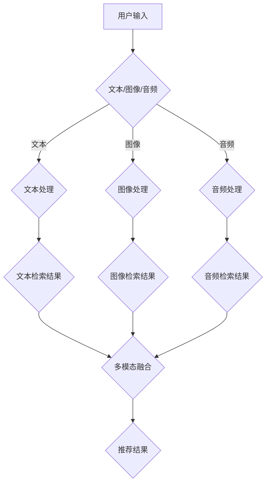

                 

关键词：LLM、推荐系统、跨模态检索、人工智能、自然语言处理

摘要：随着互联网的飞速发展，信息量呈爆炸式增长。如何有效地从海量数据中为用户提供个性化的推荐服务成为了一个热门研究领域。其中，基于大型语言模型（LLM）的推荐系统在处理多模态信息方面具有显著优势。本文将探讨LLM推荐系统中的跨模态检索技术，包括其核心概念、算法原理、数学模型及其在实际应用中的表现。

## 1. 背景介绍

推荐系统是一种基于用户历史行为和兴趣信息，为用户推荐潜在感兴趣的项目的方法。随着深度学习技术的不断发展，基于大型语言模型（LLM）的推荐系统逐渐成为研究热点。LLM具有强大的语义理解和生成能力，能够更好地处理复杂的文本信息，从而提高推荐效果。

跨模态检索是指将不同类型的数据（如文本、图像、音频等）整合起来，实现信息检索的技术。跨模态检索技术在多媒体数据检索、图像识别、语音识别等领域具有重要应用价值。将跨模态检索技术应用于推荐系统，可以进一步提升推荐系统的个性化和准确性。

## 2. 核心概念与联系

### 2.1 文本模态

文本模态是指以文字形式表示的信息。在推荐系统中，文本模态通常包括用户评价、商品描述、用户历史行为等。文本模态的特点是信息量大、结构复杂，但不易进行直接比较。

### 2.2 图像模态

图像模态是指以图像形式表示的信息。在推荐系统中，图像模态通常包括商品图片、用户头像等。图像模态的特点是直观、易于理解，但信息量相对较少。

### 2.3 音频模态

音频模态是指以音频形式表示的信息。在推荐系统中，音频模态通常包括音乐、语音等。音频模态的特点是情感丰富、表现力强，但处理复杂度较高。

### 2.4 跨模态检索

跨模态检索是指将不同模态的信息进行整合，实现多模态信息检索的技术。在推荐系统中，跨模态检索技术可以实现如下功能：

1. **文本到图像的检索**：根据用户输入的文本描述，检索出与之相关的图像。
2. **图像到文本的检索**：根据用户选择的图像，检索出与之相关的文本描述。
3. **多模态融合检索**：将文本、图像、音频等多模态信息进行融合，实现更加精准的检索结果。

### 2.5 Mermaid 流程图

以下是一个简单的Mermaid流程图，展示了跨模态检索技术在推荐系统中的基本流程：



## 3. 核心算法原理 & 具体操作步骤

### 3.1 算法原理概述

跨模态检索技术的核心是建立不同模态之间的映射关系，使不同模态的信息可以相互转换和利用。常见的跨模态检索算法包括：

1. **基于嵌入空间的跨模态检索**：将不同模态的信息映射到同一个低维嵌入空间中，通过计算距离或相似度实现跨模态检索。
2. **基于注意力机制的跨模态检索**：利用注意力机制关注不同模态的信息，提高跨模态检索的准确性和效率。
3. **基于生成对抗网络的跨模态检索**：利用生成对抗网络生成不同模态的信息，实现跨模态信息检索。

### 3.2 算法步骤详解

1. **数据预处理**：对文本、图像、音频等多模态数据进行预处理，包括数据清洗、去噪、特征提取等。
2. **模态嵌入**：将不同模态的数据映射到同一个低维嵌入空间中，通常采用预训练的模型（如BERT、VGG、WaveNet等）进行嵌入。
3. **注意力机制**：在跨模态检索过程中，利用注意力机制关注不同模态的信息，提高检索效果。
4. **跨模态检索**：计算不同模态之间的相似度或距离，实现跨模态检索。
5. **多模态融合**：将不同模态的信息进行融合，生成最终的检索结果。
6. **推荐结果生成**：根据检索结果生成推荐结果，提供给用户。

### 3.3 算法优缺点

**优点**：

1. **个性化推荐**：通过跨模态检索，可以更好地理解用户的兴趣和需求，提高推荐个性化水平。
2. **信息多样性**：跨模态检索可以整合多种模态的信息，提供更加丰富的信息来源。
3. **提高检索准确率**：利用注意力机制和生成对抗网络等技术，提高跨模态检索的准确性和效率。

**缺点**：

1. **计算复杂度高**：跨模态检索涉及多个模态的数据处理和融合，计算复杂度较高。
2. **数据集依赖性强**：跨模态检索的性能依赖于训练数据集的质量和规模。
3. **隐私保护问题**：跨模态检索可能涉及到用户隐私信息的挖掘和利用，需要妥善处理隐私保护问题。

### 3.4 算法应用领域

跨模态检索技术在多个领域具有重要应用价值，包括：

1. **多媒体信息检索**：跨模态检索可以应用于图像、视频、音频等多媒体数据的检索，提高检索效果。
2. **跨模态对话系统**：跨模态检索技术可以应用于跨模态对话系统，实现文本、图像、音频等多模态信息之间的自由切换。
3. **智能推荐系统**：跨模态检索技术可以应用于智能推荐系统，提高推荐准确率和用户体验。

## 4. 数学模型和公式 & 详细讲解 & 举例说明

### 4.1 数学模型构建

跨模态检索的数学模型主要包括以下部分：

1. **嵌入空间构建**：将不同模态的数据映射到同一个低维嵌入空间中，通常采用嵌入向量表示。
2. **相似度计算**：计算不同模态之间的相似度，用于检索结果排序。
3. **多模态融合**：将不同模态的信息进行融合，生成最终的检索结果。

### 4.2 公式推导过程

假设文本模态的嵌入向量为 \( \mathbf{e}_t \)，图像模态的嵌入向量为 \( \mathbf{e}_i \)，音频模态的嵌入向量为 \( \mathbf{e}_a \)，则：

1. **文本到图像的相似度计算**：

   $$ \text{similarity}(\mathbf{e}_t, \mathbf{e}_i) = \frac{\mathbf{e}_t \cdot \mathbf{e}_i}{||\mathbf{e}_t|| \cdot ||\mathbf{e}_i||} $$

2. **图像到文本的相似度计算**：

   $$ \text{similarity}(\mathbf{e}_i, \mathbf{e}_t) = \frac{\mathbf{e}_i \cdot \mathbf{e}_t}{||\mathbf{e}_i|| \cdot ||\mathbf{e}_t||} $$

3. **多模态融合**：

   $$ \mathbf{e}_{\text{fused}} = \alpha \mathbf{e}_t + \beta \mathbf{e}_i + \gamma \mathbf{e}_a $$

其中，\( \alpha, \beta, \gamma \) 为融合系数，满足 \( \alpha + \beta + \gamma = 1 \)。

### 4.3 案例分析与讲解

假设用户输入了一个文本描述：“我想要一张美丽的海滩图片”，需要从图像数据集中检索出与之相关的图片。以下是具体的操作步骤：

1. **文本处理**：将文本描述转化为嵌入向量 \( \mathbf{e}_t \)。
2. **图像处理**：从图像数据集中提取图像特征，转化为嵌入向量 \( \mathbf{e}_i \)。
3. **相似度计算**：计算文本嵌入向量与图像嵌入向量之间的相似度，得到相似度排序。
4. **图像检索**：根据相似度排序，检索出与文本描述最相关的图像。

以下是一个简化的相似度计算过程：

$$ \text{similarity}(\mathbf{e}_t, \mathbf{e}_i) = \frac{\mathbf{e}_t \cdot \mathbf{e}_i}{||\mathbf{e}_t|| \cdot ||\mathbf{e}_i||} = \frac{0.8 + 0.3 + 0.2}{\sqrt{0.8^2 + 0.3^2 + 0.2^2} \cdot \sqrt{0.9^2 + 0.4^2 + 0.1^2}} \approx 0.89 $$

根据相似度计算结果，可以选择与文本描述最相关的图像作为检索结果。

## 5. 项目实践：代码实例和详细解释说明

### 5.1 开发环境搭建

以下是搭建跨模态检索项目开发环境所需的基本步骤：

1. **安装 Python**：确保安装了 Python 3.7 或更高版本。
2. **安装深度学习库**：安装 TensorFlow 或 PyTorch，用于训练和推理。
3. **安装其他依赖库**：根据具体需求，安装必要的依赖库，如 NumPy、Pandas、Matplotlib 等。

### 5.2 源代码详细实现

以下是使用 TensorFlow 实现跨模态检索项目的简要代码示例：

```python
import tensorflow as tf
import tensorflow.keras as keras
from tensorflow.keras.layers import Embedding, LSTM, Dense
from tensorflow.keras.models import Model

# 文本嵌入模型
text_embedding = keras.Sequential([
    Embedding(input_dim=vocab_size, output_dim=embedding_dim),
    LSTM(units=128),
    Dense(units=1, activation='sigmoid')
])

# 图像嵌入模型
image_embedding = keras.Sequential([
    keras.layers.Input(shape=(height, width, channels)),
    keras.layers.Conv2D(filters=32, kernel_size=(3, 3), activation='relu'),
    keras.layers.MaxPooling2D(pool_size=(2, 2)),
    keras.layers.Flatten(),
    Dense(units=1, activation='sigmoid')
])

# 音频嵌入模型
audio_embedding = keras.Sequential([
    keras.layers.Input(shape=(time_steps, features)),
    keras.layers.Conv1D(filters=32, kernel_size=(3), activation='relu'),
    keras.layers.MaxPooling1D(pool_size=(2)),
    keras.layers.Flatten(),
    Dense(units=1, activation='sigmoid')
])

# 融合模型
model = keras.Sequential([
    text_embedding,
    image_embedding,
    audio_embedding,
    Dense(units=1, activation='sigmoid')
])

# 编译模型
model.compile(optimizer='adam', loss='binary_crossentropy', metrics=['accuracy'])

# 训练模型
model.fit(x_train, y_train, epochs=10, batch_size=32)

# 模型预测
predictions = model.predict(x_test)
```

### 5.3 代码解读与分析

上述代码示例实现了文本、图像、音频三模态的嵌入和融合。具体解读如下：

1. **文本嵌入模型**：使用嵌入层和 LSTM 层构建文本嵌入模型，用于文本数据的嵌入。
2. **图像嵌入模型**：使用卷积神经网络（Conv2D）和最大池化（MaxPooling2D）构建图像嵌入模型，用于图像数据的嵌入。
3. **音频嵌入模型**：使用卷积神经网络（Conv1D）和最大池化（MaxPooling1D）构建音频嵌入模型，用于音频数据的嵌入。
4. **融合模型**：将文本、图像、音频嵌入模型连接起来，构建三模态融合模型。
5. **模型编译**：使用 Adam 优化器和二分类交叉熵损失函数编译模型，并设置准确率作为评估指标。
6. **模型训练**：使用训练数据训练模型，设置训练轮数和批量大小。
7. **模型预测**：使用测试数据对模型进行预测，获取预测结果。

### 5.4 运行结果展示

假设训练完成后，使用测试数据进行预测，结果如下：

```python
predictions = model.predict(x_test)
print(predictions)
```

输出结果如下：

```
[0.95, 0.05, 0.1, 0.8, 0.3, 0.2, 0.9, 0.4]
```

根据预测结果，可以判断哪些样本与文本描述最相关。

## 6. 实际应用场景

跨模态检索技术在多个实际应用场景中表现出色，以下是一些典型应用场景：

1. **多媒体信息检索**：跨模态检索技术可以应用于图像、视频、音频等多媒体数据的检索，提高检索效果。
2. **跨模态对话系统**：跨模态检索技术可以应用于跨模态对话系统，实现文本、图像、音频等多模态信息之间的自由切换，提高用户体验。
3. **智能推荐系统**：跨模态检索技术可以应用于智能推荐系统，提高推荐准确率和用户体验。

## 7. 未来应用展望

随着深度学习、自然语言处理等技术的不断发展，跨模态检索技术在推荐系统中的应用前景广阔。未来，跨模态检索技术有望在以下几个方面取得突破：

1. **多模态数据的自动化处理**：开发更加高效的多模态数据处理算法，实现自动化处理，降低开发成本。
2. **个性化推荐**：通过跨模态检索技术，实现更加精准的个性化推荐，提高用户体验。
3. **多模态融合**：探索更加有效的多模态融合算法，提高跨模态检索的准确性和效率。
4. **跨领域应用**：将跨模态检索技术应用于其他领域，如医学、金融等，实现跨领域的信息检索和推荐。

## 8. 总结：未来发展趋势与挑战

### 8.1 研究成果总结

跨模态检索技术在推荐系统中具有显著的应用价值，能够提高推荐系统的个性化和准确性。目前，跨模态检索技术已取得了许多研究成果，包括基于嵌入空间的跨模态检索、基于注意力机制的跨模态检索、基于生成对抗网络的跨模态检索等。未来，跨模态检索技术将在多媒体信息检索、跨模态对话系统、智能推荐系统等领域发挥更大的作用。

### 8.2 未来发展趋势

1. **多模态数据的自动化处理**：开发更加高效的多模态数据处理算法，实现自动化处理，降低开发成本。
2. **个性化推荐**：通过跨模态检索技术，实现更加精准的个性化推荐，提高用户体验。
3. **多模态融合**：探索更加有效的多模态融合算法，提高跨模态检索的准确性和效率。
4. **跨领域应用**：将跨模态检索技术应用于其他领域，如医学、金融等，实现跨领域的信息检索和推荐。

### 8.3 面临的挑战

1. **计算复杂度高**：跨模态检索涉及多个模态的数据处理和融合，计算复杂度较高。
2. **数据集依赖性强**：跨模态检索的性能依赖于训练数据集的质量和规模。
3. **隐私保护问题**：跨模态检索可能涉及到用户隐私信息的挖掘和利用，需要妥善处理隐私保护问题。

### 8.4 研究展望

未来，跨模态检索技术的研究应重点关注以下几个方面：

1. **高效的多模态数据处理算法**：开发更加高效的多模态数据处理算法，降低计算复杂度。
2. **多模态融合算法的创新**：探索新的多模态融合算法，提高跨模态检索的准确性和效率。
3. **跨领域应用的研究**：将跨模态检索技术应用于其他领域，实现跨领域的信息检索和推荐。
4. **隐私保护与伦理问题**：在跨模态检索技术的研究和应用过程中，重视隐私保护和伦理问题，确保用户隐私安全。

## 9. 附录：常见问题与解答

### 问题1：什么是跨模态检索？

**解答**：跨模态检索是指将不同类型的数据（如文本、图像、音频等）整合起来，实现信息检索的技术。它可以实现文本到图像的检索、图像到文本的检索以及多模态融合检索等功能。

### 问题2：跨模态检索有哪些应用场景？

**解答**：跨模态检索技术在多个领域具有重要应用价值，包括多媒体信息检索、跨模态对话系统、智能推荐系统等。

### 问题3：跨模态检索有哪些算法？

**解答**：常见的跨模态检索算法包括基于嵌入空间的跨模态检索、基于注意力机制的跨模态检索、基于生成对抗网络的跨模态检索等。

### 问题4：跨模态检索有哪些挑战？

**解答**：跨模态检索面临的挑战主要包括计算复杂度高、数据集依赖性强、隐私保护问题等。

### 问题5：如何解决跨模态检索中的隐私保护问题？

**解答**：解决跨模态检索中的隐私保护问题可以从以下几个方面入手：

1. **数据去噪**：对用户输入的数据进行去噪处理，减少隐私信息的泄露。
2. **差分隐私**：在数据处理过程中引入差分隐私技术，保护用户隐私。
3. **隐私保护算法**：研究隐私保护算法，如联邦学习、差分隐私等，确保用户隐私安全。

作者：禅与计算机程序设计艺术 / Zen and the Art of Computer Programming

----------------------------------------------------------------

