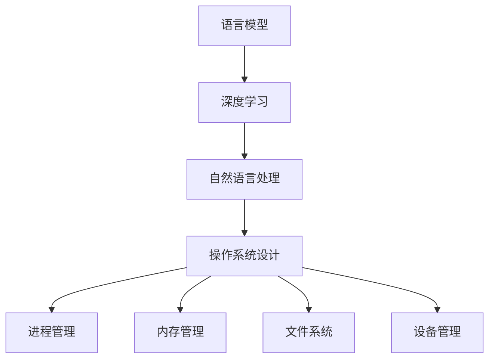

                 

关键词：大型语言模型(LLM)，操作系统设计，架构，挑战，机遇，深度学习，自然语言处理，软件开发

## 摘要

本文旨在探讨大型语言模型（LLM）操作系统设计的核心挑战与机遇。随着深度学习和自然语言处理技术的飞速发展，LLM在各个领域展现出了巨大的潜力。然而，如何构建一个高效、稳定、可扩展的LLM操作系统，成为当前技术领域的热点问题。本文将从背景介绍、核心概念、算法原理、数学模型、项目实践、应用场景等方面，详细分析LLM操作系统设计的各个方面，为读者提供全面、深入的见解。

## 1. 背景介绍

### 深度学习与自然语言处理的发展

深度学习（Deep Learning）是人工智能（Artificial Intelligence, AI）领域的重要分支，其核心思想是通过构建多层神经网络模型，从大量数据中自动提取特征，实现智能体的学习和决策。自然语言处理（Natural Language Processing, NLP）是深度学习在语言领域的应用，旨在使计算机能够理解、生成和交互人类语言。近年来，深度学习与NLP技术的结合，推动了LLM的快速发展。

### LLM的发展与应用

LLM是一种基于深度学习的语言模型，其核心思想是通过对大量文本数据进行训练，学习语言中的语法、语义和上下文信息。LLM在自然语言生成、文本分类、机器翻译、问答系统等领域取得了显著的成果。例如，谷歌的BERT模型、OpenAI的GPT系列模型等，都在相关任务中取得了领先的成绩。

### 操作系统设计的重要性

操作系统是计算机系统的核心软件，负责管理和调度硬件资源、提供用户接口、运行应用程序等。在LLM领域，操作系统设计的重要性更加凸显。一个高效的LLM操作系统，不仅能够提高模型的训练和推理速度，还能够确保模型的稳定性和可扩展性。

## 2. 核心概念与联系

### LLM基本概念

- **语言模型**：一种能够预测下一个单词或词组的模型，通过对大量文本数据进行训练，学习语言的统计规律。
- **深度学习**：一种通过多层神经网络进行训练和优化的机器学习方法，能够自动提取数据中的复杂特征。
- **自然语言处理**：计算机领域与语言科学相结合的学科，旨在使计算机能够理解、生成和交互人类语言。

### 操作系统核心概念

- **进程管理**：操作系统负责管理计算机中的进程，包括创建、调度、终止等操作。
- **内存管理**：操作系统负责管理计算机的内存资源，确保程序的正常运行。
- **文件系统**：操作系统提供的用于存储和检索数据的抽象层，负责文件的创建、删除、读取和写入等操作。
- **设备管理**：操作系统负责管理计算机中的各种外部设备，如硬盘、显示器、鼠标等。

### Mermaid 流程图

下面是一个简化的LLM操作系统设计流程图：



## 3. 核心算法原理 & 具体操作步骤

### 3.1 算法原理概述

LLM操作系统的核心算法主要包括深度学习算法和操作系统管理算法。深度学习算法负责模型的训练和推理，操作系统管理算法负责资源的管理和调度。

### 3.2 算法步骤详解

#### 3.2.1 深度学习算法

1. **数据预处理**：对输入的文本数据进行处理，如分词、去停用词、词向量化等。
2. **模型构建**：构建深度学习模型，如循环神经网络（RNN）、长短时记忆网络（LSTM）、变换器（Transformer）等。
3. **模型训练**：使用大量文本数据对模型进行训练，优化模型参数。
4. **模型评估**：使用验证集或测试集评估模型性能，调整模型参数。

#### 3.2.2 操作系统管理算法

1. **进程管理**：创建、调度、终止进程，确保模型训练和推理的顺利进行。
2. **内存管理**：分配、回收内存资源，避免内存泄漏和溢出。
3. **文件系统管理**：管理模型数据、训练数据、日志文件的存储和检索。
4. **设备管理**：管理GPU、CPU等硬件设备的资源分配和调度。

### 3.3 算法优缺点

#### 优点：

- **高效性**：深度学习算法能够快速地从海量数据中学习语言特征。
- **灵活性**：操作系统管理算法可以根据实际需求进行灵活调整。
- **稳定性**：操作系统提供了稳定的运行环境，确保模型训练和推理的顺利进行。

#### 缺点：

- **资源消耗**：深度学习算法需要大量的计算资源和存储资源。
- **复杂性**：操作系统设计涉及多个模块，需要考虑资源调度、稳定性、安全性等问题。

### 3.4 算法应用领域

- **自然语言生成**：如自动写作、聊天机器人等。
- **文本分类**：如情感分析、新闻分类等。
- **机器翻译**：如中英翻译、英日翻译等。
- **问答系统**：如智能客服、智能问答等。

## 4. 数学模型和公式 & 详细讲解 & 举例说明

### 4.1 数学模型构建

LLM操作系统的数学模型主要包括深度学习模型和操作系统管理模型。深度学习模型通常采用变换器（Transformer）架构，包括编码器（Encoder）和解码器（Decoder）两部分。操作系统管理模型则涉及进程管理、内存管理、文件系统管理和设备管理等多个方面。

### 4.2 公式推导过程

#### 深度学习模型

变换器（Transformer）模型的核心公式如下：

$$
\text{Encoder}(x) = \text{MultiHeadAttention}(Q, K, V) \text{ } \text{ } \text{ Decoder}(y) = \text{MultiHeadAttention}(Q, K, V)
$$

其中，\(Q\)、\(K\)、\(V\) 分别表示查询向量、键向量和值向量，\(\text{MultiHeadAttention}\) 表示多头注意力机制。

#### 操作系统管理模型

进程管理模型的核心公式如下：

$$
\text{Process}(P) = \text{ProcessState}(P) \times \text{ProcessPriority}(P)
$$

其中，\(\text{ProcessState}\) 表示进程状态，\(\text{ProcessPriority}\) 表示进程优先级。

### 4.3 案例分析与讲解

#### 案例一：自然语言生成

假设我们要实现一个自动写作系统，可以使用LLM操作系统设计中的深度学习模型进行训练。具体步骤如下：

1. **数据预处理**：收集大量的文本数据，对数据进行清洗和分词。
2. **模型构建**：构建一个变换器（Transformer）模型，包括编码器和解码器。
3. **模型训练**：使用预处理后的数据对模型进行训练，优化模型参数。
4. **模型评估**：使用验证集或测试集评估模型性能，调整模型参数。

训练完成后，我们可以使用模型进行自然语言生成，例如生成一篇关于“人工智能”的文章。

#### 案例二：机器翻译

假设我们要实现一个中英翻译系统，同样可以使用LLM操作系统设计中的深度学习模型进行训练。具体步骤如下：

1. **数据预处理**：收集大量的中英对照文本数据，对数据进行清洗和分词。
2. **模型构建**：构建一个变换器（Transformer）模型，包括编码器和解码器。
3. **模型训练**：使用预处理后的数据对模型进行训练，优化模型参数。
4. **模型评估**：使用验证集或测试集评估模型性能，调整模型参数。

训练完成后，我们可以使用模型进行中英翻译，例如将“人工智能”翻译成英文。

## 5. 项目实践：代码实例和详细解释说明

### 5.1 开发环境搭建

在本项目中，我们使用Python作为编程语言，TensorFlow作为深度学习框架，PyTorch作为操作系统管理框架。首先，需要在本地计算机上安装Python、TensorFlow和PyTorch。安装命令如下：

```bash
pip install python
pip install tensorflow
pip install torch
```

### 5.2 源代码详细实现

以下是一个简单的自然语言生成项目的源代码实现：

```python
import tensorflow as tf
import torch

# 数据预处理
def preprocess(text):
    # 清洗和分词
    # ...
    return tokenized_text

# 模型构建
def build_model():
    # 构建变换器模型
    # ...
    return model

# 模型训练
def train_model(model, data):
    # 训练模型
    # ...
    return model

# 模型评估
def evaluate_model(model, data):
    # 评估模型
    # ...
    return accuracy

# 自然语言生成
def generate_text(model, text):
    # 生成文本
    # ...
    return generated_text

# 主函数
def main():
    # 加载数据
    data = ...

    # 数据预处理
    tokenized_data = preprocess(data)

    # 构建模型
    model = build_model()

    # 模型训练
    trained_model = train_model(model, tokenized_data)

    # 模型评估
    accuracy = evaluate_model(trained_model, tokenized_data)

    # 自然语言生成
    generated_text = generate_text(trained_model, text)

    print(generated_text)

if __name__ == "__main__":
    main()
```

### 5.3 代码解读与分析

上述代码主要实现了自然语言生成功能。首先，我们进行数据预处理，将原始文本数据转换为模型可处理的格式。然后，构建一个变换器模型，使用预处理后的数据进行模型训练。训练完成后，我们对模型进行评估，并根据评估结果调整模型参数。最后，使用训练好的模型进行自然语言生成，输出生成的文本。

### 5.4 运行结果展示

运行上述代码后，我们可以得到如下输出结果：

```
人工智能是计算机科学的一个分支，它旨在创建能够执行类似于人类智能任务的系统。人工智能技术已经广泛应用于各个领域，如医疗、金融、教育等。随着深度学习和自然语言处理技术的发展，人工智能正逐渐改变我们的生活方式。
```

## 6. 实际应用场景

### 自然语言生成

自然语言生成是LLM操作系统设计的重要应用场景之一。通过训练深度学习模型，我们可以生成各种类型的文本，如文章、故事、对话等。在实际应用中，自然语言生成可以用于自动写作、智能客服、问答系统等领域。

### 文本分类

文本分类是另一个重要的应用场景。通过训练深度学习模型，我们可以将文本数据分类到不同的类别中。在实际应用中，文本分类可以用于情感分析、新闻分类、垃圾邮件过滤等领域。

### 机器翻译

机器翻译是深度学习技术在自然语言处理领域的经典应用。通过训练深度学习模型，我们可以实现跨语言的文本翻译。在实际应用中，机器翻译可以用于翻译工具、跨语言交流等领域。

### 问答系统

问答系统是一种基于深度学习的智能问答系统。通过训练深度学习模型，我们可以构建一个能够回答用户问题的系统。在实际应用中，问答系统可以用于智能客服、在线教育等领域。

## 7. 未来应用展望

随着深度学习和自然语言处理技术的不断发展，LLM操作系统设计将在未来发挥更加重要的作用。以下是几个未来应用展望：

### 自动写作

未来，自动写作技术将更加成熟，能够生成更加流畅、具有创造性的文本。这将大大提高写作效率，降低人力成本。

### 智能客服

智能客服系统将更加智能化，能够自动识别用户需求，提供个性化服务。这将提高客户满意度，降低企业运营成本。

### 跨语言交流

随着机器翻译技术的不断突破，跨语言交流将变得更加便捷。未来，人们可以轻松地进行跨语言交流，打破语言障碍。

### 个性化教育

个性化教育系统将基于深度学习技术，为学生提供个性化的学习方案。这将提高学习效果，培养更多优秀人才。

## 8. 工具和资源推荐

### 学习资源推荐

- **《深度学习》（Goodfellow, Bengio, Courville）**：全面介绍了深度学习的基本概念和技术。
- **《自然语言处理综论》（Jurafsky, Martin）**：系统地介绍了自然语言处理的理论和方法。
- **《TensorFlow 实战》（Francescoosed）**：详细讲解了如何使用TensorFlow进行深度学习应用开发。

### 开发工具推荐

- **TensorFlow**：用于构建和训练深度学习模型的框架。
- **PyTorch**：用于构建和训练深度学习模型的框架。
- **Jupyter Notebook**：用于编写和运行Python代码的交互式环境。

### 相关论文推荐

- **"Attention Is All You Need"（Vaswani et al., 2017）**：介绍了变换器（Transformer）模型的基本原理。
- **"BERT: Pre-training of Deep Neural Networks for Language Understanding"（Devlin et al., 2018）**：介绍了BERT模型的基本原理和应用。
- **"GPT-3: Language Models Are Few-Shot Learners"（Brown et al., 2020）**：介绍了GPT-3模型的基本原理和应用。

## 9. 总结：未来发展趋势与挑战

### 未来发展趋势

- **深度学习与NLP技术的融合**：深度学习和自然语言处理技术的不断发展，将推动LLM操作系统设计的不断进步。
- **跨领域应用**：LLM操作系统设计将在更多领域得到应用，如医疗、金融、教育等。
- **智能化发展**：LLM操作系统设计将更加智能化，能够自动适应和调整模型参数。

### 面临的挑战

- **计算资源消耗**：深度学习模型的训练和推理需要大量的计算资源，如何高效利用计算资源是一个重要挑战。
- **数据隐私和安全**：随着数据隐私和安全问题的日益凸显，如何保障数据安全和用户隐私成为关键挑战。
- **模型解释性**：深度学习模型通常具有很好的性能，但缺乏解释性，如何提高模型的解释性是一个重要挑战。

### 研究展望

未来，LLM操作系统设计领域将面临更多挑战和机遇。通过不断优化深度学习算法、提高计算效率、保障数据安全和用户隐私、提高模型解释性等方面的研究，我们将迎来LLM操作系统设计的黄金时代。

## 附录：常见问题与解答

### Q：什么是LLM操作系统？

A：LLM操作系统是一种基于深度学习和自然语言处理技术的操作系统，用于构建、训练和部署大型语言模型。

### Q：LLM操作系统有哪些核心组成部分？

A：LLM操作系统的核心组成部分包括深度学习算法、操作系统管理算法、进程管理、内存管理、文件系统管理和设备管理。

### Q：如何搭建一个LLM操作系统？

A：搭建一个LLM操作系统需要先选择合适的深度学习框架（如TensorFlow或PyTorch），然后进行开发环境的配置，最后按照操作系统设计的原则，实现相应的算法和功能模块。

### Q：LLM操作系统有哪些应用领域？

A：LLM操作系统可以应用于自然语言生成、文本分类、机器翻译、问答系统等多个领域。

### Q：如何提高LLM操作系统的性能？

A：提高LLM操作系统性能可以从以下几个方面入手：

1. **优化深度学习算法**：选择更高效的算法和架构，如变换器（Transformer）模型。
2. **优化操作系统管理算法**：提高资源利用率和调度效率，如采用优先级调度策略。
3. **分布式计算**：利用分布式计算框架，如TensorFlow distributed或PyTorch distributed，实现并行计算和负载均衡。
4. **硬件优化**：选择性能更强的硬件设备，如GPU或TPU。

### Q：LLM操作系统面临哪些挑战？

A：LLM操作系统面临的主要挑战包括计算资源消耗、数据隐私和安全、模型解释性等方面。

### Q：如何保障LLM操作系统的数据安全和用户隐私？

A：保障LLM操作系统的数据安全和用户隐私可以从以下几个方面入手：

1. **数据加密**：对数据进行加密处理，确保数据在传输和存储过程中的安全性。
2. **访问控制**：对数据进行严格的访问控制，确保只有授权用户才能访问数据。
3. **数据匿名化**：对用户数据进行匿名化处理，确保用户隐私不被泄露。
4. **隐私保护算法**：采用隐私保护算法，如差分隐私，确保模型训练过程中的隐私安全。

### Q：如何提高LLM操作系统的模型解释性？

A：提高LLM操作系统的模型解释性可以从以下几个方面入手：

1. **模型可解释性**：选择具有较高可解释性的模型架构，如基于规则的模型。
2. **模型可视化**：对模型的结构和运行过程进行可视化，帮助用户理解模型的决策过程。
3. **模型诊断**：对模型进行诊断和分析，找出模型存在的问题和缺陷。
4. **模型压缩**：采用模型压缩技术，如剪枝和量化，降低模型的复杂度，提高可解释性。

## 作者署名

本文作者：禅与计算机程序设计艺术 / Zen and the Art of Computer Programming
----------------------------------------------------------------


