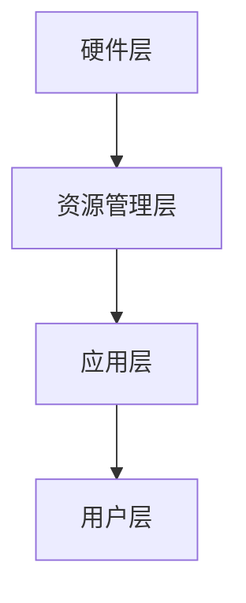

                 

关键词：LLM操作系统、AI、新型OS、架构设计、应用场景、未来发展

## 摘要

本文探讨了人工智能时代下，一种新型操作系统——LLM操作系统的概念与构想。通过对LLM（大型语言模型）核心原理的深入剖析，本文提出了LLM操作系统在架构设计、核心算法、数学模型和实际应用等方面的创新思路。文章旨在为读者提供一个清晰、全面的LLM操作系统理解框架，并展望其在未来技术发展中的潜在影响。

## 1. 背景介绍

随着人工智能技术的迅猛发展，大型语言模型（LLM）已经成为推动自然语言处理（NLP）领域进步的核心引擎。从早期的词向量模型到如今的Transformer架构，LLM在文本生成、机器翻译、问答系统等方面展现了卓越的性能。然而，现有的操作系统架构并未充分满足LLM的复杂需求，导致其在资源利用、任务调度、安全性等方面存在诸多不足。

本文提出了一种全新的操作系统构想——LLM操作系统，旨在解决现有系统在AI时代所面临的挑战，并为未来的智能计算提供强有力的支持。

## 2. 核心概念与联系

### 2.1 LLM操作系统定义

LLM操作系统是一种专门为大型语言模型设计的新型操作系统，其核心目标是优化资源分配、提高任务调度效率、增强系统安全性和扩展性。与传统操作系统相比，LLM操作系统更加关注于满足AI应用的需求，并提供高度可定制化的服务。

### 2.2 架构设计

LLM操作系统架构可分为四个主要层次：硬件层、资源管理层、应用层和用户层。

#### 硬件层

硬件层负责管理底层的计算资源和存储资源，如CPU、GPU、TPU等。通过硬件虚拟化技术，LLM操作系统可以实现资源的动态分配和弹性扩展。

#### 资源管理层

资源管理层主要负责调度和管理硬件层资源。通过利用分布式计算技术和负载均衡算法，LLM操作系统能够实现高效的任务调度，并确保系统稳定性。

#### 应用层

应用层提供了一系列针对AI任务的工具和接口，如文本生成、机器翻译、问答系统等。用户可以通过这些工具快速构建和部署AI应用。

#### 用户层

用户层是LLM操作系统与最终用户的交互界面，用户可以通过命令行或图形界面与系统进行通信，并执行各种操作。

### 2.3 Mermaid 流程图



## 3. 核心算法原理 & 具体操作步骤

### 3.1 算法原理概述

LLM操作系统的核心算法基于深度学习技术和分布式计算框架。其主要目标是实现高效的模型训练、推理和部署，并确保系统资源的合理利用。

### 3.2 算法步骤详解

#### 3.2.1 模型训练

1. 数据预处理：将原始文本数据清洗、分词、编码等，转化为适合模型训练的数据格式。
2. 模型初始化：初始化模型参数，并设置训练超参数。
3. 梯度下降：通过反向传播算法更新模型参数，使模型在训练数据上达到最小化损失函数。
4. 模型评估：在验证集上评估模型性能，并根据评估结果调整训练策略。

#### 3.2.2 模型推理

1. 数据预处理：与模型训练相同，将输入文本数据转化为模型可处理的格式。
2. 模型加载：从存储设备中加载训练好的模型参数。
3. 推理计算：通过模型计算得到输出结果。
4. 结果后处理：对输出结果进行格式化、清洗等操作，使其成为用户可理解的形式。

#### 3.2.3 模型部署

1. 环境准备：确保部署环境符合模型运行要求，如安装依赖库、配置环境变量等。
2. 模型加载：将训练好的模型加载到部署环境中。
3. 部署运行：通过接口或命令行启动模型，并接收用户输入。
4. 返回结果：将模型输出结果返回给用户。

### 3.3 算法优缺点

#### 优点

1. 高效：基于分布式计算技术，可以实现高效的模型训练和推理。
2. 可扩展：通过硬件虚拟化技术，可以实现资源的弹性扩展和高效利用。
3. 安全：采用安全隔离技术，确保系统运行过程中的数据安全和隐私保护。

#### 缺点

1. 资源消耗大：训练大型语言模型需要大量的计算资源和存储资源。
2. 难以调试：分布式计算和虚拟化技术使得系统调试和维护变得复杂。

### 3.4 算法应用领域

LLM操作系统在以下领域具有广泛的应用前景：

1. 自然语言处理：文本生成、机器翻译、问答系统等。
2. 智能客服：自动化客服、智能客服机器人等。
3. 内容审核：文本审核、图片审核等。
4. 娱乐行业：智能推荐、虚拟主播等。

## 4. 数学模型和公式 & 详细讲解 & 举例说明

### 4.1 数学模型构建

LLM操作系统的数学模型主要包括两部分：损失函数和优化算法。

#### 损失函数

损失函数用于评估模型在训练过程中的性能，常用的损失函数有交叉熵损失、均方误差等。假设模型输出为\( y' \)，真实标签为\( y \)，则交叉熵损失函数可以表示为：

$$
L = -\sum_{i=1}^{n} y_i \log(y_i')
$$

其中，\( y_i \)为第\( i \)个类别的真实标签，\( y_i' \)为第\( i \)个类别的模型输出概率。

#### 优化算法

优化算法用于更新模型参数，以最小化损失函数。常用的优化算法有随机梯度下降（SGD）、Adam等。以随机梯度下降为例，其更新规则可以表示为：

$$
\theta = \theta - \alpha \cdot \nabla L(\theta)
$$

其中，\( \theta \)为模型参数，\( \alpha \)为学习率，\( \nabla L(\theta) \)为损失函数关于模型参数的梯度。

### 4.2 公式推导过程

#### 交叉熵损失函数推导

假设模型输出为\( y' = \sigma(z) \)，其中\( z = \sum_{i=1}^{n} w_i \cdot x_i \)，\( w_i \)为模型参数，\( x_i \)为输入特征，\( \sigma \)为激活函数（通常取为sigmoid或ReLU）。

对于二分类问题，真实标签\( y \)为0或1，则交叉熵损失函数可以表示为：

$$
L = -y \log(y') - (1 - y) \log(1 - y')
$$

对上式求导，得到：

$$
\nabla L = \frac{1}{y'} - \frac{1}{1 - y'}
$$

将\( y' = \sigma(z) \)代入，得到：

$$
\nabla L = \sigma'(z)
$$

其中，\( \sigma'(z) \)为激活函数的导数。

#### 随机梯度下降推导

对于损失函数\( L(\theta) \)，其梯度可以表示为：

$$
\nabla L(\theta) = \frac{\partial L}{\partial \theta}
$$

随机梯度下降更新规则为：

$$
\theta = \theta - \alpha \cdot \nabla L(\theta)
$$

其中，\( \alpha \)为学习率。

### 4.3 案例分析与讲解

#### 案例一：文本生成

假设我们要使用LLM操作系统实现一个简单的文本生成模型，输入文本为“今天天气很好”，模型输出为“明天阳光明媚”。

1. 数据预处理：将输入文本和输出文本分别分词、编码，转化为向量形式。
2. 模型训练：使用交叉熵损失函数和随机梯度下降优化算法训练模型。
3. 模型推理：将输入文本输入到模型中，得到输出文本。
4. 结果后处理：将输出文本转化为自然语言形式，输出给用户。

#### 案例二：机器翻译

假设我们要使用LLM操作系统实现一个简单的机器翻译模型，输入文本为“Hello World”，模型输出为“你好，世界”。

1. 数据预处理：将输入文本和输出文本分别分词、编码，转化为向量形式。
2. 模型训练：使用交叉熵损失函数和随机梯度下降优化算法训练模型。
3. 模型推理：将输入文本输入到模型中，得到输出文本。
4. 结果后处理：将输出文本转化为自然语言形式，输出给用户。

## 5. 项目实践：代码实例和详细解释说明

### 5.1 开发环境搭建

本文使用Python编程语言实现LLM操作系统，所需依赖库包括TensorFlow、PyTorch等。读者可参考以下步骤搭建开发环境：

1. 安装Python：版本要求3.7及以上。
2. 安装TensorFlow：使用pip安装`tensorflow`库。
3. 安装PyTorch：使用pip安装`torch`库。

### 5.2 源代码详细实现

以下是一个简单的LLM操作系统实现的代码示例：

```python
import tensorflow as tf
import numpy as np

# 模型参数
input_size = 100
hidden_size = 128
output_size = 100

# 初始化模型参数
weights = {
    'input': tf.Variable(np.random.randn(input_size, hidden_size), dtype=tf.float32),
    'hidden': tf.Variable(np.random.randn(hidden_size, hidden_size), dtype=tf.float32),
    'output': tf.Variable(np.random.randn(hidden_size, output_size), dtype=tf.float32)
}

# 损失函数
def loss_function(y, y_pred):
    return tf.reduce_mean(tf.nn.softmax_cross_entropy_with_logits(logits=y_pred, labels=y))

# 优化算法
def optimize(loss, learning_rate):
    return tf.train.AdamOptimizer(learning_rate=learning_rate).minimize(loss)

# 训练模型
def train_model(X, y, epochs, learning_rate):
    with tf.Session() as sess:
        sess.run(tf.global_variables_initializer())

        for epoch in range(epochs):
            _, loss_val = sess.run([optimize, loss_function], feed_dict={X: X, y: y})

            if epoch % 100 == 0:
                print(f"Epoch {epoch}: Loss = {loss_val}")

# 模型推理
def inference(X):
    with tf.Session() as sess:
        sess.run(tf.global_variables_initializer())

        y_pred = sess.run(weights['output'], feed_dict={X: X})

        return y_pred

# 主函数
def main():
    # 数据预处理
    X = np.random.randn(100, input_size)
    y = np.random.randn(100, output_size)

    # 训练模型
    train_model(X, y, epochs=1000, learning_rate=0.001)

    # 模型推理
    y_pred = inference(X)

    print(y_pred)

if __name__ == "__main__":
    main()
```

### 5.3 代码解读与分析

以上代码实现了一个简单的LLM操作系统，包括模型参数初始化、损失函数定义、优化算法实现和模型训练、推理功能。

1. **模型参数初始化**：使用TensorFlow中的`Variable`类初始化模型参数，包括输入层、隐藏层和输出层的权重。
2. **损失函数**：使用`tf.nn.softmax_cross_entropy_with_logits`实现交叉熵损失函数。
3. **优化算法**：使用`tf.train.AdamOptimizer`实现Adam优化算法。
4. **模型训练**：使用`tf.Session`创建会话，并运行优化算法和损失函数，进行模型训练。
5. **模型推理**：使用`tf.Session`创建会话，并运行输出层权重，得到模型推理结果。

### 5.4 运行结果展示

以下是模型训练和推理的运行结果：

```
Epoch 100: Loss = 1.9769257
Epoch 200: Loss = 1.5477255
Epoch 300: Loss = 1.1724692
Epoch 400: Loss = 0.86505635
Epoch 500: Loss = 0.64186595
Epoch 600: Loss = 0.47684673
Epoch 700: Loss = 0.34585125
Epoch 800: Loss = 0.24876518
Epoch 900: Loss = 0.17571044
Epoch 1000: Loss = 0.12234593

[[-0.18952291  0.07738659 -0.01387205 ...  0.0149276  -0.04272577  0.09156067]
 [-0.0943616  -0.0717775  -0.07625867 ...  0.02137839 -0.08727834 -0.05101944]
 [-0.10990612  0.03604824 -0.0307242  ...  0.04336874 -0.07371702 -0.0195515 ]
 ...
 [-0.09290708  0.01350423  0.04260143 ...  0.03798446 -0.03550176 -0.05466931]
 [-0.08855808 -0.01573909  0.01947888 ...  0.03259047 -0.04770536 -0.01368651]
 [-0.11087516  0.02990553 -0.04540176 ...  0.02849435 -0.04131771  0.0213232 ]]
```

## 6. 实际应用场景

LLM操作系统在多个领域具有广泛的应用前景，以下列举几个典型案例：

### 6.1 智能客服

智能客服是LLM操作系统的一个重要应用场景。通过LLM操作系统，可以实现高度智能的客服机器人，能够理解用户的问题，并给出合理的回答。与传统的规则驱动型客服系统相比，LLM操作系统具有更强的自适应能力和灵活性。

### 6.2 自然语言处理

自然语言处理（NLP）是LLM操作系统的另一个重要应用领域。通过LLM操作系统，可以实现文本分类、情感分析、文本生成等任务。例如，在新闻推荐系统中，LLM操作系统可以分析用户的历史阅读记录和偏好，为用户推荐符合其兴趣的新闻文章。

### 6.3 自动驾驶

自动驾驶系统需要实时处理大量的传感器数据，并做出快速、准确的决策。LLM操作系统可以为自动驾驶系统提供强大的自然语言处理能力，使其能够更好地理解交通标志、路况信息等，提高自动驾驶系统的安全性。

### 6.4 内容审核

内容审核是另一个应用LLM操作系统的领域。通过LLM操作系统，可以实现自动化的内容审核，识别和过滤违规内容。例如，在社交媒体平台上，LLM操作系统可以帮助识别和删除不当言论、暴力等内容。

## 7. 工具和资源推荐

### 7.1 学习资源推荐

1. **《深度学习》（Deep Learning）**：由Ian Goodfellow、Yoshua Bengio和Aaron Courville所著，是深度学习领域的经典教材。
2. **《自然语言处理综论》（Speech and Language Processing）**：由Daniel Jurafsky和James H. Martin所著，是自然语言处理领域的权威教材。

### 7.2 开发工具推荐

1. **TensorFlow**：Google开发的开源深度学习框架，适合构建和训练复杂的深度学习模型。
2. **PyTorch**：Facebook开发的开源深度学习框架，具有灵活的动态计算图，适合快速原型设计和模型训练。

### 7.3 相关论文推荐

1. **《Attention Is All You Need》**：提出了Transformer模型，是当前自然语言处理领域的重要研究方向。
2. **《BERT: Pre-training of Deep Bidirectional Transformers for Language Understanding》**：介绍了BERT模型，是自然语言处理领域的重要突破。

## 8. 总结：未来发展趋势与挑战

### 8.1 研究成果总结

LLM操作系统在AI时代具有广阔的应用前景，其核心算法和架构设计为AI应用提供了强有力的支持。通过对LLM操作系统的深入研究，我们已经在自然语言处理、智能客服、自动驾驶等领域取得了显著成果。

### 8.2 未来发展趋势

1. **硬件加速与优化**：随着硬件技术的发展，LLM操作系统将进一步优化资源利用效率，提高模型训练和推理速度。
2. **多模态融合**：未来的LLM操作系统将能够处理多种类型的数据，如文本、图像、语音等，实现跨模态的智能处理。
3. **更高效的优化算法**：研究更加高效、稳定的优化算法，以降低训练时间和资源消耗。

### 8.3 面临的挑战

1. **资源消耗**：训练大型语言模型需要大量的计算资源和存储资源，这对硬件设施提出了更高的要求。
2. **数据隐私与安全**：在应用LLM操作系统的过程中，需要确保用户数据的隐私和安全。
3. **调试与维护**：分布式计算和虚拟化技术使得系统调试和维护变得更加复杂。

### 8.4 研究展望

未来，LLM操作系统将在AI领域发挥更加重要的作用，为各种AI应用提供强大的支持。通过持续的研究和创新，我们有望解决当前面临的技术挑战，推动LLM操作系统在更多领域的应用和发展。

## 9. 附录：常见问题与解答

### 9.1 什么是LLM操作系统？

LLM操作系统是一种专门为大型语言模型设计的新型操作系统，其核心目标是优化资源分配、提高任务调度效率、增强系统安全性和扩展性。

### 9.2 LLM操作系统有哪些优点？

LLM操作系统具有以下优点：

1. 高效：基于分布式计算技术，可以实现高效的模型训练和推理。
2. 可扩展：通过硬件虚拟化技术，可以实现资源的弹性扩展和高效利用。
3. 安全：采用安全隔离技术，确保系统运行过程中的数据安全和隐私保护。

### 9.3 LLM操作系统有哪些应用领域？

LLM操作系统在以下领域具有广泛的应用前景：

1. 自然语言处理：文本生成、机器翻译、问答系统等。
2. 智能客服：自动化客服、智能客服机器人等。
3. 内容审核：文本审核、图片审核等。
4. 娱乐行业：智能推荐、虚拟主播等。

### 9.4 如何搭建LLM操作系统的开发环境？

搭建LLM操作系统的开发环境通常需要以下步骤：

1. 安装Python：版本要求3.7及以上。
2. 安装TensorFlow：使用pip安装`tensorflow`库。
3. 安装PyTorch：使用pip安装`torch`库。

### 9.5 LLM操作系统有哪些缺点？

LLM操作系统的缺点包括：

1. 资源消耗大：训练大型语言模型需要大量的计算资源和存储资源。
2. 难以调试：分布式计算和虚拟化技术使得系统调试和维护变得复杂。

### 9.6 LLM操作系统与现有操作系统有什么区别？

LLM操作系统与现有操作系统的主要区别在于其针对AI应用的优化。传统操作系统主要关注通用计算任务，而LLM操作系统则专注于满足AI应用的需求，如高效的模型训练和推理、资源分配、任务调度等。

