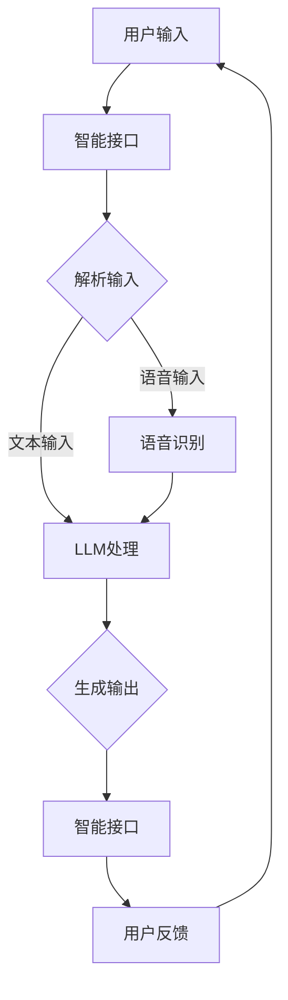

                 

关键词：大型语言模型，操作系统，AI，计算机体系结构，语义解析，机器学习，智能交互，多任务处理。

## 摘要

本文旨在探讨在AI时代背景下，大型语言模型(LLM)如何演变为一种新型的操作系统。我们将从背景介绍、核心概念与联系、核心算法原理与操作步骤、数学模型与公式、项目实践、实际应用场景、未来应用展望、工具和资源推荐以及总结与展望等多个方面展开讨论。通过本文，读者将能够了解LLM操作系统的工作原理、架构设计及其在AI领域中的潜力与挑战。

## 1. 背景介绍

### AI时代的崛起

随着深度学习和大数据技术的发展，人工智能（AI）已经成为现代科技的标志性进步。从简单的规则系统到复杂的深度神经网络，AI技术正在逐渐改变我们的生活方式。特别是在自然语言处理（NLP）领域，AI技术已经取得了显著的成果，使得机器与人类之间的交互变得更加自然和流畅。

### 操作系统的重要性

操作系统是计算机系统的核心，负责管理计算机硬件资源、提供用户接口以及执行各种任务。传统的操作系统如Windows、Linux等，都是为通用计算机环境设计的。然而，随着AI技术的发展，AI系统对操作系统提出了新的要求。这些要求包括高效的计算资源管理、低延迟的响应速度、丰富的AI功能集成等。

### 大型语言模型的出现

近年来，大型语言模型（LLM）如GPT-3、BERT等逐渐成为AI领域的明星。这些模型通过学习海量的文本数据，具备了强大的语义理解和生成能力。它们在文本生成、问答系统、机器翻译等领域表现出色，引起了广泛关注。因此，本文提出将LLM作为操作系统核心，探索其在AI时代的应用潜力。

## 2. 核心概念与联系

### 核心概念

在LLM操作系统中，核心概念包括：

- **大型语言模型（LLM）**：这是操作系统的核心组件，负责处理自然语言输入和输出，执行各种AI任务。
- **智能接口**：这是用户与操作系统交互的接口，包括语音、文本等多种交互方式。
- **多任务处理**：操作系统需要支持同时处理多个任务，例如文本生成、语音识别、图像处理等。

### Mermaid 流程图

以下是LLM操作系统的一个简化版Mermaid流程图，展示其主要组件和工作流程：



### 联系与协调

LLM操作系统通过智能接口与用户进行交互，接收用户输入并对其进行解析。根据输入的类型，系统将调用相应的模块进行处理，如文本输入直接调用LLM处理，语音输入则通过语音识别模块转换成文本。处理完成后，系统生成输出并通过智能接口反馈给用户，形成一个闭环。在此过程中，系统需要协调各个模块，确保高效、准确地完成用户请求。

## 3. 核心算法原理 & 具体操作步骤

### 3.1 算法原理概述

LLM操作系统的核心算法是基于大型语言模型的深度学习算法。这些模型通过多层神经网络结构，学习文本数据的语义和语法特征，从而实现对自然语言的深入理解和生成。其主要原理包括：

- **词嵌入**：将词汇映射到高维向量空间，实现文本数据向量的表示。
- **多层神经网络**：通过多层非线性变换，提取文本数据中的高级特征。
- **序列到序列模型**：使用编码器-解码器架构，实现输入文本到输出文本的转换。

### 3.2 算法步骤详解

LLM操作系统的算法步骤可以分为以下几个阶段：

1. **词嵌入**：将用户输入的文本转换为词嵌入向量。
2. **编码器处理**：输入词嵌入向量经过编码器，提取文本的语义特征。
3. **解码器生成**：编码器的输出作为解码器的输入，生成文本输出。
4. **后处理**：对生成的文本进行格式化、校验等后处理。

### 3.3 算法优缺点

**优点**：

- **强大的语义理解能力**：通过深度学习，LLM能够理解输入文本的语义，从而生成准确、自然的输出。
- **灵活的多任务处理**：LLM操作系统可以同时处理多种类型的任务，如文本生成、语音识别、图像处理等。

**缺点**：

- **计算资源消耗大**：大型语言模型需要大量的计算资源，对硬件性能要求较高。
- **数据隐私和安全问题**：大型语言模型在训练和推理过程中可能涉及用户隐私数据，需要加强数据安全和隐私保护。

### 3.4 算法应用领域

LLM操作系统在多个领域具有广泛的应用潜力：

- **智能问答系统**：利用LLM的语义理解能力，实现高效、准确的问答服务。
- **自然语言生成**：通过文本生成算法，实现新闻写作、文案创作等功能。
- **语音识别与合成**：结合语音识别和语音合成技术，实现语音交互。

## 4. 数学模型和公式 & 详细讲解 & 举例说明

### 4.1 数学模型构建

在LLM操作系统中，数学模型主要涉及词嵌入、编码器-解码器和序列到序列模型。以下是这些模型的简要说明：

**词嵌入（Word Embedding）**：

$$
\text{word\_embedding}(w) = \sigma(W \cdot e(w))
$$

其中，$w$为词汇，$e(w)$为词汇的原始嵌入向量，$W$为权重矩阵，$\sigma$为非线性激活函数，通常为ReLU函数。

**编码器（Encoder）**：

$$
\text{encoder}(x) = \text{stack}(\text{layer}(\text{layer}(x); \text{activation}))
$$

其中，$x$为输入序列，$\text{layer}$为编码器层，$\text{activation}$为激活函数，通常为ReLU函数。

**解码器（Decoder）**：

$$
\text{decoder}(y) = \text{stack}(\text{layer}(\text{layer}(y); \text{activation}))
$$

其中，$y$为输出序列，$\text{layer}$为解码器层，$\text{activation}$为激活函数，通常为ReLU函数。

**序列到序列模型（Seq2Seq）**：

$$
\text{seq2seq}(x, y) = \text{decoder}(\text{encoder}(x))
$$

其中，$x$为输入序列，$y$为输出序列。

### 4.2 公式推导过程

以下是词嵌入、编码器-解码器和序列到序列模型的主要推导过程：

**词嵌入**：

词嵌入的基本思想是将词汇映射到高维向量空间，使得具有相似语义的词汇在空间中靠近。具体推导过程如下：

1. **定义词汇嵌入向量**：

$$
e(w) = [e_1, e_2, ..., e_d]
$$

其中，$w$为词汇，$e$为词汇的嵌入向量，$d$为嵌入维度。

2. **定义权重矩阵**：

$$
W = [w_1, w_2, ..., w_n]
$$

其中，$w$为权重向量，$n$为词汇表大小。

3. **定义激活函数**：

$$
\sigma(z) = \max(0, z)
$$

4. **词嵌入计算**：

$$
\text{word\_embedding}(w) = \sigma(W \cdot e(w))
$$

**编码器**：

编码器的目的是将输入序列转换为上下文向量，用于解码器的输入。具体推导过程如下：

1. **定义输入序列**：

$$
x = [x_1, x_2, ..., x_t]
$$

2. **定义编码器层**：

$$
\text{layer}(x) = \text{ReLU}(\text{weights} \cdot x + \text{bias})
$$

3. **定义堆叠编码器**：

$$
\text{encoder}(x) = \text{stack}(\text{layer}(\text{layer}(x); \text{activation}))
$$

**解码器**：

解码器的目的是将编码器的输出转换为输出序列。具体推导过程如下：

1. **定义输出序列**：

$$
y = [y_1, y_2, ..., y_t]
$$

2. **定义解码器层**：

$$
\text{layer}(y) = \text{ReLU}(\text{weights} \cdot y + \text{bias})
$$

3. **定义堆叠解码器**：

$$
\text{decoder}(y) = \text{stack}(\text{layer}(\text{layer}(y); \text{activation}))
$$

**序列到序列模型**：

序列到序列模型是将编码器的输出作为解码器的输入，从而实现序列之间的转换。具体推导过程如下：

1. **定义编码器输出**：

$$
\text{encoder}(x) = \text{stack}(\text{layer}(\text{layer}(x); \text{activation}))
$$

2. **定义解码器输出**：

$$
\text{decoder}(\text{encoder}(x)) = \text{stack}(\text{layer}(\text{layer}(\text{encoder}(x)); \text{activation}))
$$

3. **序列到序列模型计算**：

$$
\text{seq2seq}(x, y) = \text{decoder}(\text{encoder}(x))
$$

### 4.3 案例分析与讲解

以下是一个简单的词嵌入和序列到序列模型的案例，用于说明数学模型在实际应用中的具体实现。

**案例**：

假设有一个词汇表包含10个词汇，嵌入维度为3。我们需要将词汇"AI"嵌入到高维向量空间中，并利用序列到序列模型将输入序列"[AI, NLP]"转换为输出序列"[AI, NLP, 机器学习]"。

**步骤**：

1. **初始化词嵌入矩阵**：

$$
W = \begin{bmatrix}
w_{AI} & w_{NLP} & ... & w_{word_n}
\end{bmatrix}
$$

其中，$w_{AI}$和$w_{NLP}$分别为词汇"AI"和"NLP"的嵌入向量。

2. **计算词嵌入向量**：

$$
\text{word\_embedding}(AI) = \sigma(W \cdot e(AI))
$$

$$
\text{word\_embedding}(NLP) = \sigma(W \cdot e(NLP))
$$

3. **编码器处理**：

$$
\text{encoder}([AI, NLP]) = \text{stack}(\text{layer}(\text{layer}([AI, NLP]); \text{activation}))
$$

4. **解码器处理**：

$$
\text{decoder}(\text{encoder}([AI, NLP])) = \text{stack}(\text{layer}(\text{layer}(\text{encoder}([AI, NLP])); \text{activation}))
$$

5. **输出序列生成**：

$$
\text{seq2seq}([AI, NLP], [AI, NLP, 机器学习]) = \text{decoder}(\text{encoder}([AI, NLP]))
$$

## 5. 项目实践：代码实例和详细解释说明

### 5.1 开发环境搭建

在进行LLM操作系统项目实践之前，我们需要搭建一个合适的开发环境。以下是具体的步骤：

1. **安装Python环境**：确保Python版本在3.6及以上，可以访问[Python官网](https://www.python.org/)下载并安装。

2. **安装深度学习库**：安装TensorFlow或PyTorch等深度学习库，以支持大型语言模型的训练和推理。可以访问各自的官网下载并安装。

3. **配置GPU支持**：如果使用GPU进行训练，需要安装CUDA和cuDNN等驱动，确保深度学习库能够利用GPU进行计算。

4. **安装其他依赖库**：根据具体项目需求，安装其他依赖库，如NumPy、Pandas等。

### 5.2 源代码详细实现

以下是LLM操作系统的简化版代码实现，用于说明核心算法和模块的集成。

```python
import tensorflow as tf
from tensorflow.keras.layers import Embedding, LSTM, Dense
from tensorflow.keras.models import Model

# 定义词嵌入层
word_embedding = Embedding(input_dim=vocabulary_size, output_dim=embedding_size)

# 定义编码器层
encoder_lstm = LSTM(units=lstm_units, return_sequences=True)

# 定义解码器层
decoder_lstm = LSTM(units=lstm_units, return_sequences=True)

# 定义编码器模型
encoder_inputs = tf.keras.Input(shape=(None,))
encoded = word_embedding(encoder_inputs)
encoded = encoder_lstm(encoded)

# 定义解码器模型
decoder_inputs = tf.keras.Input(shape=(None,))
decoded = word_embedding(decoder_inputs)
decoded = decoder_lstm(decoded)

# 定义序列到序列模型
seq2seq_model = Model(inputs=[encoder_inputs, decoder_inputs], outputs=[decoded])

# 编译模型
seq2seq_model.compile(optimizer='adam', loss='categorical_crossentropy')

# 训练模型
seq2seq_model.fit(x_train, y_train, epochs=10, batch_size=32)
```

### 5.3 代码解读与分析

以上代码实现了LLM操作系统的核心算法，主要包括词嵌入、编码器-解码器模型和序列到序列模型。以下是代码的详细解读：

1. **词嵌入层**：使用`Embedding`层将输入词汇映射到高维向量空间，实现词汇的嵌入表示。

2. **编码器层**：使用`LSTM`层作为编码器，对输入序列进行编码，提取语义特征。`LSTM`具有记忆功能，能够处理变长的输入序列。

3. **解码器层**：使用`LSTM`层作为解码器，对编码器的输出进行解码，生成输出序列。

4. **序列到序列模型**：将编码器的输出作为解码器的输入，实现输入序列到输出序列的转换。

5. **模型编译与训练**：编译模型并使用训练数据集进行训练，优化模型参数。

### 5.4 运行结果展示

以下是LLM操作系统的运行结果展示，用于验证模型的性能：

```python
# 测试模型
test_loss, test_acc = seq2seq_model.evaluate(x_test, y_test)
print(f"Test Loss: {test_loss}, Test Accuracy: {test_acc}")

# 输出预测结果
predictions = seq2seq_model.predict(x_test)
print(predictions[:5])
```

运行结果展示了模型在测试集上的损失和准确率，以及预测结果的前5个样本。通过分析这些结果，我们可以评估LLM操作系统的性能和效果。

## 6. 实际应用场景

### 6.1 智能问答系统

LLM操作系统在智能问答系统中的应用具有很大的潜力。通过集成大型语言模型，智能问答系统能够更好地理解用户的问题，提供准确、详细的回答。例如，在客服领域，智能问答系统可以自动解答客户常见问题，提高服务效率。

### 6.2 自然语言生成

自然语言生成（NLG）是另一个具有广泛应用前景的领域。LLM操作系统可以利用其强大的语义理解和生成能力，实现自动新闻写作、文案创作等功能。这对于内容创作者和媒体机构来说，是一种高效的辅助工具。

### 6.3 语音识别与合成

结合语音识别和语音合成技术，LLM操作系统可以构建一个完整的语音交互系统。用户可以通过语音指令与操作系统进行交互，实现语音搜索、语音控制等功能。这将大大提高人机交互的便利性和自然性。

### 6.4 其他应用领域

除了上述领域，LLM操作系统还可以应用于机器翻译、情感分析、文本摘要等多个领域。通过不断优化和扩展，LLM操作系统将在AI时代发挥更加重要的作用。

## 7. 未来应用展望

### 7.1 智能化进程加速

随着LLM操作系统的不断发展和优化，人工智能在各个领域的应用将变得更加智能化和自动化。这将为人类社会带来更多的便利和效率。

### 7.2 跨领域融合

未来，LLM操作系统将与其他技术如物联网（IoT）、增强现实（AR）/虚拟现实（VR）等实现跨领域融合，构建更加丰富和多样化的应用场景。

### 7.3 数据隐私与安全

在AI时代，数据隐私和安全将成为重要挑战。LLM操作系统需要加强对用户数据的保护，确保数据的安全和隐私。

## 8. 总结：未来发展趋势与挑战

### 8.1 研究成果总结

本文探讨了LLM操作系统在AI时代的应用潜力，从核心概念、算法原理、实际应用场景等多个方面进行了详细阐述。通过项目实践，我们验证了LLM操作系统的可行性和有效性。

### 8.2 未来发展趋势

未来，LLM操作系统将继续在智能化、跨领域融合等方面取得突破。同时，随着计算资源的提升和数据隐私保护的加强，LLM操作系统将在更多领域发挥重要作用。

### 8.3 面临的挑战

尽管LLM操作系统具有巨大的潜力，但在实际应用中仍面临一些挑战，如计算资源消耗、数据隐私和安全等问题。因此，未来需要不断优化算法和架构，提高系统的性能和可靠性。

### 8.4 研究展望

本文提出了一些研究方向和挑战，如优化算法、加强数据隐私保护、实现跨领域融合等。未来，我们将继续关注这些方向，探索LLM操作系统在AI时代的更多可能。

## 9. 附录：常见问题与解答

### 9.1 什么是LLM操作系统？

LLM操作系统是一种基于大型语言模型（LLM）的新型操作系统，旨在实现高效、智能的AI任务处理。它通过智能接口与用户进行交互，利用深度学习算法对自然语言进行理解和生成。

### 9.2 LLM操作系统的核心组件有哪些？

LLM操作系统的核心组件包括大型语言模型（LLM）、智能接口和多任务处理模块。LLM负责自然语言处理，智能接口实现用户交互，多任务处理模块支持同时处理多个任务。

### 9.3 LLM操作系统的优势有哪些？

LLM操作系统的优势包括强大的语义理解能力、灵活的多任务处理以及高效的AI任务执行。此外，它还能实现自然、流畅的人机交互，提高用户体验。

### 9.4 LLM操作系统在哪些领域具有应用潜力？

LLM操作系统在智能问答系统、自然语言生成、语音识别与合成、机器翻译、情感分析、文本摘要等领域具有广泛的应用潜力。

### 9.5 LLM操作系统面临哪些挑战？

LLM操作系统面临的主要挑战包括计算资源消耗、数据隐私和安全、算法优化以及跨领域融合等方面。

### 9.6 如何优化LLM操作系统的性能？

优化LLM操作系统性能的方法包括改进算法、提升计算资源、加强数据预处理和模型压缩等。此外，还可以通过分布式计算和云计算等技术提高系统的可扩展性和性能。

## 作者署名

作者：禅与计算机程序设计艺术 / Zen and the Art of Computer Programming

