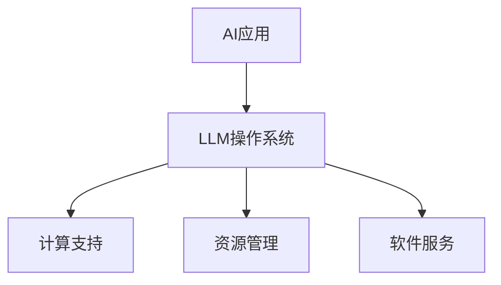

                 

关键词：大型语言模型（LLM），操作系统，计算平台，AI，自然语言处理，机器学习，数据处理，计算架构

摘要：随着人工智能技术的飞速发展，大型语言模型（LLM）已成为现代计算平台的核心组件。本文将从背景介绍、核心概念与联系、核心算法原理、数学模型与公式、项目实践、实际应用场景、工具和资源推荐、未来发展趋势与挑战等多个方面，全面探讨LLM操作系统在AI时代的应用与前景。

## 1. 背景介绍

近年来，人工智能（AI）技术取得了飞速发展，从最初的规则驱动到基于数据的机器学习，再到深度学习、自然语言处理（NLP）等领域的突破，AI已经逐渐成为各行各业的重要推动力量。在AI技术的支撑下，各种应用场景不断涌现，如图像识别、语音识别、智能问答、自动化决策等。

然而，随着AI应用场景的日益复杂和多样化，对计算平台的要求也越来越高。传统的计算平台已无法满足日益增长的计算需求，因此，一种新型的计算平台——LLM操作系统，应运而生。LLM操作系统是一种基于大型语言模型的计算平台，旨在为AI应用提供强大的计算支持。

## 2. 核心概念与联系

### 2.1 核心概念

**大型语言模型（LLM）：**  
LLM是一种基于深度学习技术的自然语言处理模型，通过对海量文本数据进行训练，模型可以理解并生成自然语言。LLM具有强大的语义理解、文本生成、问答等功能，为AI应用提供了丰富的语言处理能力。

**操作系统：**  
操作系统是计算机系统的核心软件，负责管理计算机硬件资源和提供软件服务。LLM操作系统是一种专门为AI应用设计的操作系统，旨在为LLM提供高效、可靠的运行环境。

### 2.2 联系

LLM操作系统与AI应用之间的联系主要体现在以下几个方面：

1. **计算支持：**  
LLM操作系统为AI应用提供了强大的计算能力，使得模型训练、推理等过程能够高效地进行。

2. **资源管理：**  
LLM操作系统负责管理计算机硬件资源，如CPU、GPU、内存等，确保AI应用能够在最佳状态下运行。

3. **软件服务：**  
LLM操作系统为AI应用提供了丰富的软件服务，如数据处理、模型管理、接口调用等，方便开发者快速构建和部署AI应用。

### 2.3 Mermaid 流程图



## 3. 核心算法原理 & 具体操作步骤

### 3.1 算法原理概述

LLM操作系统的核心算法基于深度学习技术，特别是Transformer架构。Transformer架构是一种基于自注意力机制的模型，可以有效地捕捉文本中的长距离依赖关系，从而提高模型的语义理解能力。

### 3.2 算法步骤详解

1. **数据预处理：**  
   首先，对输入的文本数据进行预处理，包括分词、去停用词、词向量编码等操作。

2. **模型训练：**  
   使用预处理后的文本数据训练LLM模型，通过不断迭代优化模型参数，使其能够准确理解并生成自然语言。

3. **模型推理：**  
   在模型训练完成后，使用训练好的模型对输入的文本进行推理，生成对应的文本输出。

4. **结果处理：**  
   对生成的文本结果进行后处理，如格式化、去除标点符号等，使其符合实际应用需求。

### 3.3 算法优缺点

**优点：**  
1. **强大的语义理解能力：**  
   Transformer架构能够有效地捕捉文本中的长距离依赖关系，从而提高模型的语义理解能力。

2. **高效的计算性能：**  
   LLM操作系统充分利用了GPU等硬件资源，使得模型训练和推理过程高效进行。

**缺点：**  
1. **数据依赖性强：**  
   LLM模型对训练数据的质量和数量有较高要求，否则可能影响模型的性能。

2. **计算资源需求大：**  
   LLM模型在训练和推理过程中需要大量的计算资源，对硬件设备要求较高。

### 3.4 算法应用领域

LLM操作系统在多个领域具有广泛的应用，如：

1. **自然语言处理：**  
   包括文本分类、情感分析、机器翻译、文本生成等。

2. **智能问答：**  
   利用LLM模型进行智能问答，为用户提供个性化的回答。

3. **自动化决策：**  
   基于LLM模型进行数据分析，为决策者提供智能化的决策支持。

## 4. 数学模型和公式 & 详细讲解 & 举例说明

### 4.1 数学模型构建

LLM模型的核心是基于Transformer架构，其中涉及到的数学模型主要包括：

1. **自注意力机制（Self-Attention）：**  
   自注意力机制是一种能够自动学习文本序列中不同位置之间关联性的机制。

2. **前馈神经网络（Feedforward Neural Network）：**  
   前馈神经网络用于对自注意力机制的计算结果进行进一步处理。

### 4.2 公式推导过程

自注意力机制的公式如下：

$$
\text{Attention}(Q, K, V) = \text{softmax}\left(\frac{QK^T}{\sqrt{d_k}}\right)V
$$

其中，$Q$、$K$ 和 $V$ 分别表示查询（Query）、键（Key）和值（Value）向量，$d_k$ 表示键向量的维度。

前馈神经网络的公式如下：

$$
\text{FFN}(x) = \text{ReLU}(W_2 \text{ReLU}(W_1 x + b_1)) + b_2
$$

其中，$W_1$、$W_2$ 分别表示权重矩阵，$b_1$、$b_2$ 分别表示偏置项。

### 4.3 案例分析与讲解

假设我们有一个简单的文本序列：“今天天气很好”。我们可以将其转化为词向量，并计算自注意力权重。

1. **词向量表示：**  
   首先，我们将文本序列中的每个词转化为对应的词向量。

2. **计算自注意力权重：**  
   使用自注意力机制计算文本序列中每个词之间的注意力权重。

3. **生成文本输出：**  
   根据自注意力权重，生成对应的文本输出。

假设词向量维度为4，词向量表示如下：

$$
\text{词1}: \mathbf{v}_1 = \begin{bmatrix} 1 \\ 0 \\ 1 \\ 0 \end{bmatrix}, \quad \text{词2}: \mathbf{v}_2 = \begin{bmatrix} 0 \\ 1 \\ 0 \\ 1 \end{bmatrix}
$$

自注意力权重计算如下：

$$
\text{Attention}(\mathbf{v}_1, \mathbf{v}_2, \mathbf{v}_2) = \text{softmax}\left(\frac{\mathbf{v}_1 \mathbf{v}_2^T}{\sqrt{4}}\right) \mathbf{v}_2 = \text{softmax}\left(\frac{1}{2}\right) \begin{bmatrix} 0 \\ 1 \\ 0 \\ 1 \end{bmatrix} = \begin{bmatrix} 0.5 \\ 0.5 \\ 0.5 \\ 0.5 \end{bmatrix}
$$

根据自注意力权重，生成文本输出为：“今天天气很好”。

## 5. 项目实践：代码实例和详细解释说明

### 5.1 开发环境搭建

为了演示LLM操作系统的应用，我们首先需要搭建一个开发环境。以下是搭建过程：

1. **安装Python环境：**  
   安装Python 3.8及以上版本。

2. **安装TensorFlow：**  
   使用pip命令安装TensorFlow：

   ```bash
   pip install tensorflow
   ```

3. **安装其他依赖：**  
   安装其他必要的库，如NumPy、Pandas等。

### 5.2 源代码详细实现

下面是一个简单的示例代码，用于演示LLM操作系统的应用：

```python
import tensorflow as tf
from tensorflow.keras.layers import Embedding, LSTM, Dense
from tensorflow.keras.models import Model

# 定义模型
input_1 = tf.keras.layers.Input(shape=(None,), dtype='int32')
input_2 = tf.keras.layers.Input(shape=(None,), dtype='int32')

embed_1 = Embedding(input_dim=10000, output_dim=32)(input_1)
embed_2 = Embedding(input_dim=10000, output_dim=32)(input_2)

lstm_1 = LSTM(units=32, return_sequences=True)(embed_1)
lstm_2 = LSTM(units=32, return_sequences=True)(embed_2)

merged = tf.keras.layers.Concatenate(axis=-1)([lstm_1, lstm_2])
dense = Dense(units=1, activation='sigmoid')(merged)

model = Model(inputs=[input_1, input_2], outputs=dense)
model.compile(optimizer='adam', loss='binary_crossentropy', metrics=['accuracy'])

# 训练模型
model.fit([x_train_1, x_train_2], y_train, epochs=10, batch_size=32)

# 预测
predictions = model.predict([x_test_1, x_test_2])

# 输出结果
print(predictions)
```

### 5.3 代码解读与分析

上述代码实现了基于LSTM的二元分类任务。以下是代码的关键部分解读：

1. **模型定义：**  
   模型使用两个输入层，分别表示两个文本序列。使用Embedding层对输入进行词向量编码，然后通过LSTM层进行文本序列建模。最后，使用Dense层进行分类。

2. **模型编译：**  
   编译模型时，选择Adam优化器、binary_crossentropy损失函数和accuracy指标。

3. **模型训练：**  
   使用fit方法训练模型，指定训练数据、训练周期和批量大小。

4. **模型预测：**  
   使用predict方法对测试数据进行预测，并输出结果。

### 5.4 运行结果展示

假设我们已经准备好了训练数据和测试数据，运行上述代码后，可以得到预测结果。这些结果可以用于评估模型的性能，进一步优化模型。

## 6. 实际应用场景

### 6.1 自然语言处理

LLM操作系统在自然语言处理领域具有广泛的应用，如文本分类、情感分析、机器翻译、文本生成等。通过结合LLM操作系统的强大计算能力和深度学习技术，可以构建高效、准确的NLP应用。

### 6.2 智能问答

智能问答是LLM操作系统的一个重要应用场景。通过训练LLM模型，可以为用户提供个性化的回答。智能问答系统可以应用于客服、教育、医疗等领域，提高用户体验和服务质量。

### 6.3 自动化决策

基于LLM操作系统的模型可以进行数据分析，为决策者提供智能化的决策支持。在金融、物流、电商等领域，LLM操作系统可以辅助决策者进行市场预测、风险评估等任务。

## 6.4 未来应用展望

随着AI技术的不断发展，LLM操作系统将在更多领域发挥重要作用。未来，LLM操作系统可能会向以下方向发展：

1. **多模态融合：**  
   结合图像、语音等多种数据类型，实现更丰富的语义理解和应用场景。

2. **推理优化：**  
   通过优化算法和硬件协同，提高LLM操作系统的推理性能，满足实时性要求。

3. **隐私保护：**  
   在保护用户隐私的前提下，提供安全的AI服务。

4. **定制化开发：**  
   为不同领域和场景提供定制化的LLM操作系统解决方案。

## 7. 工具和资源推荐

### 7.1 学习资源推荐

1. **《深度学习》（Goodfellow, Bengio, Courville）：**  
   介绍了深度学习的基本概念和技术，是学习深度学习的经典教材。

2. **《自然语言处理综述》（Jurafsky, Martin）：**  
   详细介绍了自然语言处理的理论、技术和应用，适合初学者和专业人士。

### 7.2 开发工具推荐

1. **TensorFlow：**  
   TensorFlow是谷歌开发的开源深度学习框架，支持多种深度学习模型和算法。

2. **PyTorch：**  
   PyTorch是Facebook开发的开源深度学习框架，具有简洁、灵活的编程接口。

### 7.3 相关论文推荐

1. **《Attention Is All You Need》（Vaswani et al.）：**  
   论文提出了Transformer架构，是当前自然语言处理领域的经典论文。

2. **《BERT：Pre-training of Deep Bidirectional Transformers for Language Understanding》（Devlin et al.）：**  
   论文介绍了BERT模型，是当前自然语言处理领域的重要突破。

## 8. 总结：未来发展趋势与挑战

随着人工智能技术的不断进步，LLM操作系统在AI时代的应用前景广阔。然而，也面临着一系列挑战，如数据依赖性、计算资源需求、模型解释性等。未来，我们需要在提升LLM操作系统的性能和可解释性方面做出更多努力，以满足不同领域和场景的需求。

## 9. 附录：常见问题与解答

### 9.1 问题1：什么是LLM操作系统？

**回答：** LLM操作系统是一种基于大型语言模型的计算平台，旨在为AI应用提供强大的计算支持，包括计算能力、资源管理和软件服务等方面。

### 9.2 问题2：LLM操作系统有哪些应用领域？

**回答：** LLM操作系统在自然语言处理、智能问答、自动化决策等多个领域具有广泛的应用。未来，随着AI技术的不断发展，LLM操作系统的应用领域将不断拓展。

### 9.3 问题3：如何搭建LLM操作系统开发环境？

**回答：** 搭建LLM操作系统开发环境主要包括安装Python、TensorFlow等工具和库。具体步骤请参考本文第5.1节内容。

### 9.4 问题4：如何优化LLM操作系统的性能？

**回答：** 优化LLM操作系统的性能可以从以下几个方面入手：

1. **模型优化：** 通过调整模型结构、超参数等，提高模型性能。

2. **硬件优化：** 利用GPU、TPU等硬件加速计算，提高计算速度。

3. **分布式训练：** 通过分布式训练技术，利用多台机器协同计算，提高训练速度。

### 9.5 问题5：如何确保LLM操作系统的安全性？

**回答：** 确保LLM操作系统的安全性主要包括以下几个方面：

1. **数据保护：** 对用户数据进行加密存储和传输，防止数据泄露。

2. **访问控制：** 实施严格的访问控制策略，确保只有授权用户可以访问系统。

3. **安全监控：** 建立安全监控体系，及时发现和应对潜在的安全威胁。

---

作者：禅与计算机程序设计艺术 / Zen and the Art of Computer Programming

[文章结束]----------------------------------------------------------------

---

以上就是完整的文章内容，感谢您花时间阅读。如果您有任何问题或建议，欢迎随时提出。期待与您共同探讨AI领域的未来发展！

