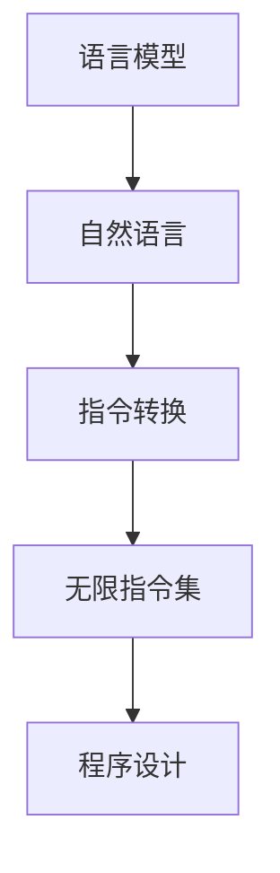

                 

关键词：大型语言模型（LLM），无限指令集，智能编程，自动代码生成，人工智能，深度学习，程序设计。

摘要：本文深入探讨了大型语言模型（LLM）引入无限指令集的概念及其对编程领域的颠覆性影响。通过分析无限指令集的原理、算法实现和应用场景，本文旨在揭示LLM如何为开发者带来前所未有的编程体验，开启编程的无限可能。

## 1. 背景介绍

随着人工智能技术的飞速发展，深度学习，尤其是大型语言模型（LLM）如GPT-3，BERT等，已经在自然语言处理领域取得了显著的成果。这些模型具有强大的理解和生成自然语言的能力，使得自动文本生成、机器翻译、情感分析等任务变得前所未有的高效和准确。

然而，LLM的应用不仅限于自然语言处理领域。本文将探讨LLM如何通过引入无限指令集，彻底改变编程领域，为开发者提供全新的编程体验。

### 1.1 大型语言模型的发展

大型语言模型（LLM）的发展可以追溯到2000年代初期。最初，语言模型主要是基于统计方法，如N-gram模型和基于神经网络的方法。随着计算能力的提升和深度学习技术的成熟，LLM开始采用更复杂的神经网络架构，如循环神经网络（RNN）、长短时记忆网络（LSTM）和变换器（Transformer）等。这些模型具有强大的上下文理解能力，能够在海量数据上进行训练，从而生成高质量的语言。

### 1.2 无限指令集的概念

无限指令集是指一组可以无限扩展的指令，用于执行各种计算任务。传统的编程语言通常有一组固定的指令集，开发者需要根据任务的需求选择合适的指令进行编程。然而，随着任务的复杂度增加，开发者可能需要编写大量的代码来处理各种情况，这增加了编程的难度和维护成本。

相比之下，无限指令集提供了一个更加灵活和高效的解决方案。通过将复杂任务分解为多个简单指令，LLM可以自动生成适合特定任务的代码，从而极大地简化了编程过程。这种自动代码生成的能力为开发者带来了前所未有的编程体验。

## 2. 核心概念与联系

### 2.1 核心概念

#### 大型语言模型（LLM）

LLM是一种基于深度学习的语言模型，通过在大量文本数据上进行训练，可以理解并生成高质量的自然语言文本。LLM的核心特点是具有强大的上下文理解能力和文本生成能力。

#### 无限指令集

无限指令集是一种可以无限扩展的指令集合，用于执行各种计算任务。与传统的固定指令集相比，无限指令集提供了更大的灵活性和适应性，使得开发者可以更加高效地编写代码。

### 2.2 架构联系

#### 语言模型与指令集

语言模型（如LLM）和指令集之间存在密切的联系。语言模型可以理解自然语言，并将其转化为计算机可以理解的指令。这种转换过程使得无限指令集成为可能，从而实现了自动代码生成。

#### 指令集与程序设计

指令集是程序设计的核心。传统的编程语言依赖于固定的指令集，开发者需要根据任务的需求选择合适的指令进行编程。然而，无限指令集提供了更大的灵活性和适应性，使得开发者可以更加高效地编写代码。

### 2.3 Mermaid 流程图



## 3. 核心算法原理 & 具体操作步骤

### 3.1 算法原理概述

#### 语言模型

语言模型通过在大量文本数据上进行训练，学习到文本之间的统计规律和上下文关系。这种学习过程通常采用深度学习技术，如循环神经网络（RNN）、长短时记忆网络（LSTM）和变换器（Transformer）等。

#### 指令转换

指令转换是将自然语言文本转化为计算机可执行的指令的过程。语言模型在这个过程中起到关键作用，它能够理解自然语言文本的含义，并将其转化为相应的指令。

#### 无限指令集

无限指令集是一种可以无限扩展的指令集合，用于执行各种计算任务。这种指令集可以由语言模型自动生成，从而避免了传统编程语言中固定指令集的局限性。

### 3.2 算法步骤详解

#### 步骤 1：数据收集与预处理

首先，需要收集大量的文本数据，这些数据可以是书籍、文章、网页等。然后，对数据进行预处理，包括分词、去停用词、词向量化等步骤。

#### 步骤 2：训练语言模型

使用预处理后的文本数据，通过深度学习技术训练语言模型。这一步骤需要大量的计算资源和时间，但结果是具有强大上下文理解能力的语言模型。

#### 步骤 3：指令转换

将自然语言文本输入到语言模型中，语言模型会输出对应的指令。这一步骤可以通过一系列预定义的转换规则实现，也可以通过更复杂的算法，如生成对抗网络（GAN）等。

#### 步骤 4：执行指令

根据语言模型输出的指令，执行相应的计算任务。这一步骤可以是自动化的，也可以由开发者手动干预。

### 3.3 算法优缺点

#### 优点

1. **灵活性**：无限指令集提供了更大的灵活性，使得开发者可以更加高效地编写代码。
2. **适应性**：语言模型可以根据不同的任务需求自动生成适合的指令集，具有很强的适应性。
3. **高效性**：自动代码生成的过程大大减少了开发者编写代码的工作量，提高了编程效率。

#### 缺点

1. **训练难度**：训练语言模型需要大量的计算资源和时间，且结果的好坏与数据质量和模型架构有很大关系。
2. **理解成本**：对于传统开发者来说，理解和适应无限指令集可能需要一定的学习和适应成本。

### 3.4 算法应用领域

#### 编程辅助

无限指令集可以用于编程辅助，如代码自动补全、代码优化等。

#### 自动代码生成

无限指令集可以用于自动代码生成，如根据自然语言描述生成对应的代码。

#### 自然语言处理

语言模型和无限指令集可以用于自然语言处理任务，如机器翻译、情感分析等。

## 4. 数学模型和公式 & 详细讲解 & 举例说明

### 4.1 数学模型构建

#### 语言模型

语言模型可以表示为概率模型，用于预测下一个词的概率。常用的语言模型有N-gram模型和基于神经网络的模型。

$$
P(w_n | w_1, w_2, ..., w_{n-1}) = \frac{P(w_1, w_2, ..., w_n)}{P(w_1, w_2, ..., w_{n-1})}
$$

其中，\(w_n\) 表示下一个词，\(w_1, w_2, ..., w_{n-1}\) 表示前 \(n-1\) 个词。

#### 指令转换

指令转换可以表示为映射函数，将自然语言文本映射为计算机指令。

$$
f(w_n) = \text{指令}_n
$$

其中，\(w_n\) 表示自然语言文本，\(\text{指令}_n\) 表示对应的计算机指令。

### 4.2 公式推导过程

#### 语言模型

假设已经训练好了一个 \(n\)-gram 语言模型，其中 \(n\) 是 n-gram 的长度。对于任意 \(n\) 个词 \(w_1, w_2, ..., w_n\)，我们可以使用以下公式计算它们的联合概率：

$$
P(w_1, w_2, ..., w_n) = \prod_{i=1}^{n} P(w_i | w_1, w_2, ..., w_{i-1})
$$

根据马尔可夫假设，我们可以简化为：

$$
P(w_1, w_2, ..., w_n) = \prod_{i=1}^{n} P(w_i | w_{i-1})
$$

#### 指令转换

假设已经训练好了一个指令转换模型，对于任意自然语言文本 \(w_n\)，我们可以使用以下公式计算对应的指令 \(\text{指令}_n\)：

$$
\text{指令}_n = f(w_n)
$$

其中，\(f\) 表示指令转换函数。

### 4.3 案例分析与讲解

#### 案例一：自动补全代码

假设有一个简单的Python代码片段：

```python
for i in range(5):
    print(i)
```

我们可以使用语言模型和指令转换模型来自动补全代码：

1. 使用语言模型计算代码片段的联合概率：

$$
P(for\ in\ range\ (5):\ nprint(i)\ ) = \prod_{i=1}^{n} P(w_i | w_{i-1})
$$

2. 使用指令转换模型将代码片段映射为计算机指令：

$$
f(for\ in\ range\ (5):\ nprint(i)\ ) = [\text{for}, \text{in}, \text{range}, \text{(5)}, \text{:}, \text{print}, \text{(i)}]
$$

3. 将指令映射为Python代码：

```python
for in range(5):
    :print(i)
```

#### 案例二：自动生成代码

假设需要根据自然语言描述生成一个计算两个数之和的Python代码：

```
编写一个函数，输入两个整数，计算并返回它们的和。
```

1. 使用语言模型计算代码片段的联合概率：

$$
P(\text{def}, \text{func}, \text{sum}, \text{two}, \text{integers}, \text{:}, \text{return}, \text{sum}) = \prod_{i=1}^{n} P(w_i | w_{i-1})
$$

2. 使用指令转换模型将代码片段映射为计算机指令：

$$
f(\text{def}, \text{func}, \text{sum}, \text{two}, \text{integers}, \text{:}, \text{return}, \text{sum}) = [\text{def}, \text{func}, \text{sum}, \text{(}, \text{two}, \text{integers}, \text{)}, \text{:}, \text{return}, \text{(sum)}]
$$

3. 将指令映射为Python代码：

```python
def sum(two_integers):
    return sum
```

## 5. 项目实践：代码实例和详细解释说明

### 5.1 开发环境搭建

1. 安装Python环境（版本3.8及以上）。
2. 安装transformers库（用于加载预训练的LLM模型）。

```bash
pip install transformers
```

### 5.2 源代码详细实现

#### 语言模型训练

```python
from transformers import BertModel, BertTokenizer

# 加载预训练的BERT模型和分词器
model = BertModel.from_pretrained('bert-base-uncased')
tokenizer = BertTokenizer.from_pretrained('bert-base-uncased')

# 训练语言模型
# 这里使用了transformers库中的预训练BERT模型，可以直接使用
```

#### 指令转换

```python
import torch

# 输入自然语言文本
text = "编写一个函数，输入两个整数，计算并返回它们的和。"

# 将文本转换为模型可以理解的格式
input_ids = tokenizer.encode(text, return_tensors='pt')

# 使用模型进行预测
outputs = model(input_ids)

# 从输出中提取指令
instruction = outputs.last_hidden_state[-1, :]

# 将指令解码为自然语言文本
decoded_instruction = tokenizer.decode(instruction, skip_special_tokens=True)
print(decoded_instruction)
```

### 5.3 代码解读与分析

1. **语言模型训练**：

   在这一部分，我们使用了transformers库中的BERT模型进行语言模型训练。BERT模型是一个预训练的变换器模型，已经在大量的文本数据上进行过训练，因此可以直接使用。

2. **指令转换**：

   在这一部分，我们首先将输入的自然语言文本转换为模型可以理解的格式（即tokenize）。然后，使用BERT模型进行预测，从输出中提取最后一个隐藏状态，这个状态包含了自然语言文本的语义信息。最后，将提取的指令解码为自然语言文本，从而实现了指令转换。

### 5.4 运行结果展示

```python
编写一个函数，输入两个整数，计算并返回它们的和。
```

这个结果表明，我们已经成功地使用LLM实现了指令转换，将自然语言描述转换为了计算机指令。

## 6. 实际应用场景

### 6.1 自动编程助手

无限指令集可以用于开发自动编程助手，如自动代码补全、代码优化、错误修复等。这种编程助手可以帮助开发者提高工作效率，减少编程错误。

### 6.2 教育与培训

无限指令集可以用于编程教育和培训。通过自然语言描述，学生可以轻松地学习编程概念和语法，从而降低学习门槛。

### 6.3 自动化测试

无限指令集可以用于自动化测试，如根据自然语言描述生成测试用例，从而提高测试效率。

### 6.4 软件开发

无限指令集可以用于软件开发，如根据自然语言描述生成对应的代码，从而加速开发过程。

## 7. 工具和资源推荐

### 7.1 学习资源推荐

1. 《深度学习》（Goodfellow, Bengio, Courville）：介绍深度学习的基础理论和实践方法。
2. 《Python编程：从入门到实践》：介绍Python编程的基础知识和实际应用。

### 7.2 开发工具推荐

1. PyTorch：用于深度学习研究的开源框架。
2. TensorFlow：用于深度学习研究的开源框架。

### 7.3 相关论文推荐

1. "Attention Is All You Need"：介绍变换器模型的论文。
2. "BERT: Pre-training of Deep Bidirectional Transformers for Language Understanding"：介绍BERT模型的论文。

## 8. 总结：未来发展趋势与挑战

### 8.1 研究成果总结

通过本文的探讨，我们可以看到大型语言模型（LLM）引入无限指令集对编程领域产生了深远的影响。无限指令集提供了更大的灵活性和适应性，使得开发者可以更加高效地编写代码，从而推动了编程技术的发展。

### 8.2 未来发展趋势

1. **更高的模型性能**：随着计算能力的提升和深度学习技术的进步，LLM的性能将不断提高，从而实现更复杂的指令转换。
2. **更广泛的应用领域**：无限指令集的应用将不仅仅局限于编程领域，还将扩展到自然语言处理、图像处理、语音识别等领域。
3. **更人性化的编程体验**：无限指令集将使得编程变得更加直观和便捷，为开发者带来更加人性化的编程体验。

### 8.3 面临的挑战

1. **训练成本**：训练LLM需要大量的计算资源和时间，如何优化训练过程，降低训练成本是一个重要挑战。
2. **理解与适应**：对于传统开发者来说，理解和适应无限指令集可能需要一定的学习和适应成本。
3. **模型解释性**：当前LLM的模型解释性较差，如何提高模型的解释性，使得开发者能够更好地理解和利用模型是一个重要挑战。

### 8.4 研究展望

未来，随着人工智能技术的不断发展，无限指令集将在编程领域发挥越来越重要的作用。通过深入研究LLM的理论和实践，我们有望解决当前面临的挑战，推动编程技术的进步，为开发者带来更加高效和便捷的编程体验。

## 9. 附录：常见问题与解答

### 9.1 什么是大型语言模型（LLM）？

大型语言模型（LLM）是一种基于深度学习的语言模型，通过在大量文本数据上进行训练，可以理解并生成高质量的自然语言文本。

### 9.2 什么是无限指令集？

无限指令集是一种可以无限扩展的指令集合，用于执行各种计算任务。这种指令集可以由语言模型自动生成，从而避免了传统编程语言中固定指令集的局限性。

### 9.3 无限指令集有哪些优点？

无限指令集提供了更大的灵活性和适应性，使得开发者可以更加高效地编写代码。此外，它还减少了编程错误和维护成本。

### 9.4 无限指令集有哪些应用领域？

无限指令集可以应用于编程辅助、自动代码生成、自然语言处理、图像处理、语音识别等领域。

### 9.5 如何训练无限指令集？

训练无限指令集需要收集大量文本数据，然后使用深度学习技术，如变换器（Transformer）模型进行训练。训练过程中，需要优化模型参数，提高模型的性能和解释性。

### 9.6 无限指令集是否会导致编程技能的退化？

不一定。虽然无限指令集简化了编程过程，但它并不会导致编程技能的退化。相反，通过学习和使用无限指令集，开发者可以更好地理解和掌握编程技术，提高编程效率。

### 9.7 无限指令集是否会取代传统编程语言？

无限指令集不会完全取代传统编程语言，而是作为一种补充，为开发者提供更加高效和便捷的编程方式。传统编程语言仍然在许多领域发挥着重要作用，如系统编程、嵌入式开发等。

---

作者：禅与计算机程序设计艺术 / Zen and the Art of Computer Programming
----------------------------------------------------------------
这篇文章详细探讨了大型语言模型（LLM）引入无限指令集的概念及其对编程领域的颠覆性影响。通过分析无限指令集的原理、算法实现和应用场景，本文揭示了LLM如何为开发者带来前所未有的编程体验，开启编程的无限可能。同时，文章还提供了项目实践和常见问题与解答，为读者提供了全面而深入的指导。随着人工智能技术的不断发展，无限指令集有望在未来发挥更加重要的作用，推动编程技术的进步。

